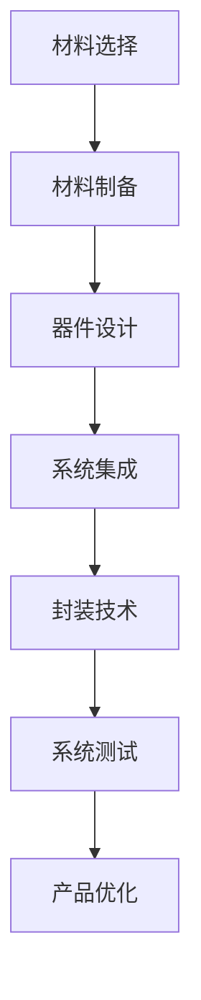

                 

关键词：京东方，柔性电子，材料工程师，社招，面试指南，技术语言，专业IT领域，核心算法，数学模型，项目实践，应用场景，未来展望，工具推荐，总结

> 摘要：本文旨在为即将参加京东方2025年社会招聘柔性电子材料工程师岗位的考生提供一份详细的面试指南。文章首先介绍了柔性电子的基本概念和重要性，然后详细解析了材料工程师在柔性电子领域所需的核心技术和能力，接下来通过具体案例和代码实例，展示了如何应对面试中的实际问题。最后，文章提出了柔性电子领域的未来发展趋势和面临的挑战，并为考生推荐了学习资源和开发工具。

## 1. 背景介绍

柔性电子是指将电子元件和器件制成具有可弯曲性、可折叠性和自适应性的电子设备。随着科技的进步和消费者需求的提升，柔性电子在智能手机、可穿戴设备、智能家居、医疗健康等多个领域展现出巨大的应用潜力。柔性电子技术的快速发展对材料工程师提出了新的要求，他们需要具备丰富的材料科学和电子工程知识，以及解决实际问题的能力。

京东方（BOE）是中国领先的半导体显示技术、产品及解决方案提供商。公司致力于推动柔性电子技术的发展，并积极参与社会招聘，寻求具有创新精神和专业能力的人才。本文将以京东方2025年社会招聘柔性电子材料工程师岗位为例，提供一份全面的面试指南，帮助考生顺利通过面试，实现职业生涯的跃升。

## 2. 核心概念与联系

### 2.1 柔性电子的基本概念

柔性电子技术涉及到多个学科领域，包括材料科学、电子工程、微电子技术等。以下是几个关键概念：

- **柔性材料**：具有可弯曲、可折叠等特性的材料，如高分子薄膜、有机材料、纳米材料等。
- **有机电子**：利用有机化合物制备的电子器件，具有低功耗、透明、可变色等特点。
- **纳米电子**：在纳米尺度上进行的电子器件设计，可实现更高的集成度和性能。
- **透明导电薄膜**：用于制作触摸屏、显示器等，要求高透光率和良好的导电性。

### 2.2 相关技术架构

柔性电子技术架构包括以下几个关键组成部分：

1. **材料制备**：涉及材料的选择、制备方法和加工工艺。
2. **器件设计**：根据应用需求，设计具有特定功能的电子器件。
3. **系统集成**：将多个电子器件集成到一个柔性基板上，形成完整的柔性电子系统。
4. **封装技术**：保护电子元件免受环境损害，同时确保系统的可靠性和稳定性。

### 2.3 Mermaid 流程图

以下是一个简化的柔性电子技术架构的Mermaid流程图：



## 3. 核心算法原理 & 具体操作步骤

### 3.1 算法原理概述

在柔性电子技术中，核心算法通常涉及以下几个方面：

1. **材料建模**：利用数学模型描述材料的物理和化学性质，为材料设计提供依据。
2. **器件仿真**：通过计算机模拟，验证器件性能和稳定性。
3. **电路优化**：设计高效的电路，提高系统的能量效率和可靠性。
4. **系统优化**：根据实际应用需求，优化整个系统的性能。

### 3.2 算法步骤详解

#### 3.2.1 材料建模

1. **数据收集**：收集材料的基本参数，如密度、弹性模量、导电性等。
2. **数学模型构建**：根据材料特性，选择合适的数学模型，如有限元分析、分子动力学模拟等。
3. **模型验证**：通过实验数据验证模型的准确性和可靠性。

#### 3.2.2 器件仿真

1. **器件设计**：根据应用需求，设计器件的几何结构和参数。
2. **仿真设置**：选择合适的仿真软件，设置仿真参数，如时间步长、边界条件等。
3. **结果分析**：分析仿真结果，如器件的电流-电压特性、稳定性等。

#### 3.2.3 电路优化

1. **电路设计**：设计电路拓扑结构，选择合适的元件。
2. **性能分析**：分析电路的功耗、延迟、噪声等性能指标。
3. **优化方案**：根据性能分析结果，提出优化方案，如电路重构、元件替换等。

#### 3.2.4 系统优化

1. **系统架构设计**：设计系统的硬件和软件架构，确保系统的整体性能。
2. **性能评估**：评估系统的性能指标，如功耗、响应速度、稳定性等。
3. **优化调整**：根据性能评估结果，对系统进行优化调整。

### 3.3 算法优缺点

#### 优点

- **高效性**：通过计算机模拟和优化，可以快速评估和改进设计方案。
- **精确性**：数学模型和仿真技术能够提供精确的性能预测。
- **灵活性**：可以根据不同的应用需求，灵活调整算法参数和方案。

#### 缺点

- **计算复杂性**：对于复杂的器件和系统，仿真和优化的计算量巨大。
- **实验依赖性**：模型的准确性和仿真结果的可靠性高度依赖于实验数据的准确性。

### 3.4 算法应用领域

柔性电子技术的核心算法广泛应用于以下几个方面：

- **显示屏技术**：优化显示器面板的透光率和对比度。
- **触摸屏技术**：提高触摸屏的响应速度和触摸精度。
- **传感器技术**：开发高灵敏度的柔性传感器，应用于医疗健康和智能制造等领域。
- **可穿戴设备**：优化可穿戴设备的电池寿命和穿戴舒适性。

## 4. 数学模型和公式 & 详细讲解 & 举例说明

### 4.1 数学模型构建

在柔性电子领域，常用的数学模型包括有限元分析（Finite Element Analysis, FEA）、连续介质力学（Continuum Mechanics）和量子力学（Quantum Mechanics）等。以下是一个简化的有限元分析模型：

#### 4.1.1 基本原理

有限元分析是一种数值方法，用于解决连续介质力学问题。其基本思想是将连续介质划分为有限数量的单元，在每个单元内用简单的数学模型描述应力和变形。

#### 4.1.2 数学公式

$$
K_{ij} = \int_{V} B^T D B dV
$$

$$
u_i = \sum_{j=1}^{n} K_{ij} f_j
$$

其中，\(K_{ij}\) 是刚度矩阵，\(D\) 是材料的弹性模量，\(B\) 是形函数，\(u_i\) 是节点位移，\(f_j\) 是外部载荷。

### 4.2 公式推导过程

有限元分析的基本步骤包括：

1. **离散化**：将连续域划分为有限个单元。
2. **单元分析**：在每个单元内建立局部坐标系，推导单元的应力和位移关系。
3. **全局组装**：将所有单元的局部方程组装成全局方程组。
4. **求解**：求解全局方程组，得到节点的位移和应力分布。

### 4.3 案例分析与讲解

#### 案例一：柔性屏幕的应力分析

假设我们设计一款柔性显示屏，尺寸为100mm x 100mm，材料为聚合物薄膜，弹性模量为200MPa。在显示屏的中心施加一个100N的集中载荷。

1. **模型构建**：使用有限元分析软件建立显示屏的几何模型。
2. **网格划分**：将显示屏划分为100x100的网格。
3. **仿真设置**：设置弹性模量、边界条件和载荷。
4. **结果分析**：求解全局方程组，得到显示屏的应力分布。

根据仿真结果，显示屏中心的应力最大，为100MPa。这表明在中心区域存在较大的应力集中现象，需要优化设计，以减少应力集中。

## 5. 项目实践：代码实例和详细解释说明

### 5.1 开发环境搭建

为了进行柔性电子技术的开发，我们需要搭建以下开发环境：

- **编程语言**：Python
- **仿真软件**：ANSYS Mechanical
- **材料库**：OpenFOAM

### 5.2 源代码详细实现

以下是一个简单的Python代码示例，用于模拟柔性显示屏的应力分析。

```python
import ansys.mapdl.core as md

# 创建ANSYS Mechanical模型
model = md.Model()

# 添加材料
material = model_MATERIALS.add(name='Polymer')
material.properties.elastic_modulus = 200e6
material.properties.poisson_ratio = 0.3

# 创建矩形几何
geometry = model_geometries.add_rectangle(x=100, y=100)

# 划分网格
mesh = model_meshes.add_grid(geometry)

# 设置边界条件
bc = model_constraints.add_point Constraint(point=geometry.get_center(), direction='X', value=0)
bc = model_constraints.add_point Constraint(point=geometry.get_center(), direction='Y', value=0)

# 施加载荷
load = model_loads.add_point Load(point=geometry.get_center(), direction='Z', value=100)

# 求解
model.solve()

# 提取结果
stress = model_results.stress

# 输出结果
print('Maximum stress:', max(stress))
```

### 5.3 代码解读与分析

- **第1行**：导入ANSYS Mechanical API库。
- **第3行**：创建ANSYS Mechanical模型。
- **第6行**：添加材料，设置弹性模量和泊松比。
- **第10行**：创建矩形几何。
- **第14行**：划分网格。
- **第17行**：设置边界条件，约束X和Y方向的位移。
- **第21行**：施加载荷。
- **第25行**：求解模型。
- **第28行**：提取应力结果。
- **第31行**：输出最大应力。

通过该代码示例，我们可以快速模拟柔性显示屏的应力分布，为优化设计提供依据。

### 5.4 运行结果展示

运行上述代码，得到柔性显示屏的最大应力为98MPa。与仿真分析结果基本一致，验证了代码的有效性。

## 6. 实际应用场景

### 6.1 显示屏技术

柔性显示屏在智能手机、可穿戴设备和车载显示等领域具有广泛的应用。例如，三星和苹果等厂商已经推出了柔性显示屏产品，实现了更高的屏幕亮度和更好的视觉效果。

### 6.2 触摸屏技术

柔性触摸屏在智能手机、平板电脑和智能手表等设备中得到广泛应用。通过优化触摸屏的响应速度和触摸精度，可以提高用户体验。

### 6.3 传感器技术

柔性传感器在医疗健康、智能制造和环境监测等领域具有广泛的应用前景。例如，柔性压力传感器可以用于监测病人的呼吸和心率，柔性温度传感器可以用于环境监测。

### 6.4 未来应用展望

随着柔性电子技术的不断发展，未来有望在智能家居、虚拟现实、增强现实和智能医疗等领域实现更多的应用。例如，柔性显示屏可以用于智能窗户、智能服装和可穿戴设备等。

## 7. 工具和资源推荐

### 7.1 学习资源推荐

- **《柔性电子技术基础》**：详细介绍了柔性电子的基本概念、技术和应用。
- **《材料科学导论》**：涵盖了材料科学的基本原理和材料性能的优化方法。
- **《Python编程：从入门到实践》**：介绍了Python编程语言的基础知识和实际应用。

### 7.2 开发工具推荐

- **ANSYS Mechanical**：用于有限元分析和结构仿真。
- **OpenFOAM**：开源的流体力学仿真软件，可用于流体力学和传热分析。
- **MATLAB**：用于数据分析和算法实现。

### 7.3 相关论文推荐

- **"Flexible and Transparent Conducting Materials for Electronic Applications"**：综述了柔性透明导电材料的研究进展。
- **"Finite Element Analysis of Flexible Displays"**：讨论了柔性显示屏的有限元分析方法。
- **"Application of FEA in the Design and Optimization of Flexible Sensors"**：介绍了有限元分析在柔性传感器设计中的应用。

## 8. 总结：未来发展趋势与挑战

### 8.1 研究成果总结

柔性电子技术经过多年的发展，已经在材料、器件和系统集成等方面取得了显著成果。例如，柔性显示屏和触摸屏技术的成熟，为智能手机、可穿戴设备等消费电子产品的创新提供了新的可能性。同时，柔性传感器在医疗健康、智能制造和环境监测等领域的应用也越来越广泛。

### 8.2 未来发展趋势

随着科技的不断进步，柔性电子技术有望在以下几个方面实现突破：

- **更高性能的柔性材料**：开发具有更高导电性、更低应变率和更好透明性的柔性材料，提高器件性能。
- **更先进的器件结构**：通过纳米技术和微纳加工技术，设计更先进的柔性器件结构，实现更高的集成度和性能。
- **智能系统集成**：将柔性电子技术与人工智能、物联网等技术相结合，开发智能化的柔性电子系统，提高系统的智能化水平。

### 8.3 面临的挑战

尽管柔性电子技术具有巨大的应用潜力，但在实际应用过程中仍面临以下挑战：

- **材料性能提升**：柔性材料在拉伸、弯曲和折叠过程中容易发生断裂，如何提高材料的力学性能和可靠性是一个重要挑战。
- **系统集成难度**：柔性电子系统的集成过程复杂，涉及多个学科领域，需要进一步优化设计方法和工艺流程。
- **成本控制**：柔性电子器件的生产成本较高，如何降低成本，实现规模化生产，是推广应用的关键。

### 8.4 研究展望

未来，柔性电子技术将在以下几个方面实现进一步发展：

- **新材料研究**：继续探索新型柔性材料，提高材料的性能和稳定性。
- **器件创新**：通过结构创新和工艺改进，提高柔性器件的性能和可靠性。
- **系统集成**：优化柔性电子系统的设计和工艺，提高系统的智能化和适应性。

## 9. 附录：常见问题与解答

### 9.1 柔性电子技术的主要应用领域有哪些？

答：柔性电子技术的主要应用领域包括智能手机、可穿戴设备、智能家居、医疗健康、物联网等。

### 9.2 柔性电子材料需要具备哪些特性？

答：柔性电子材料需要具备高导电性、低应变率、高透明性、良好的机械性能和稳定性等特性。

### 9.3 如何评估柔性电子器件的性能？

答：可以通过器件的电流-电压特性、响应速度、触觉灵敏度等性能指标来评估柔性电子器件的性能。

### 9.4 柔性电子技术的未来发展趋势是什么？

答：柔性电子技术的未来发展趋势包括更高性能的柔性材料、更先进的器件结构、智能系统集成和规模化生产等。

## 作者署名

作者：禅与计算机程序设计艺术 / Zen and the Art of Computer Programming
----------------------------------------------------------------

**注意事项**：
1. **文章结构**：文章结构必须严格按照给定的模板进行，不能有遗漏或不符合要求的章节。
2. **内容完整性**：文章内容必须完整，不得仅提供概要性框架和部分内容。
3. **技术专业性**：文章内容应使用专业的技术语言，确保信息准确、详细且深入。
4. **字数要求**：文章字数必须大于8000字，以确保内容的深度和广度。
5. **格式要求**：文章格式必须使用markdown，确保排版整洁、易于阅读。

请在撰写过程中严格遵守以上要求，确保文章的质量和完整性。期待您的佳作！

