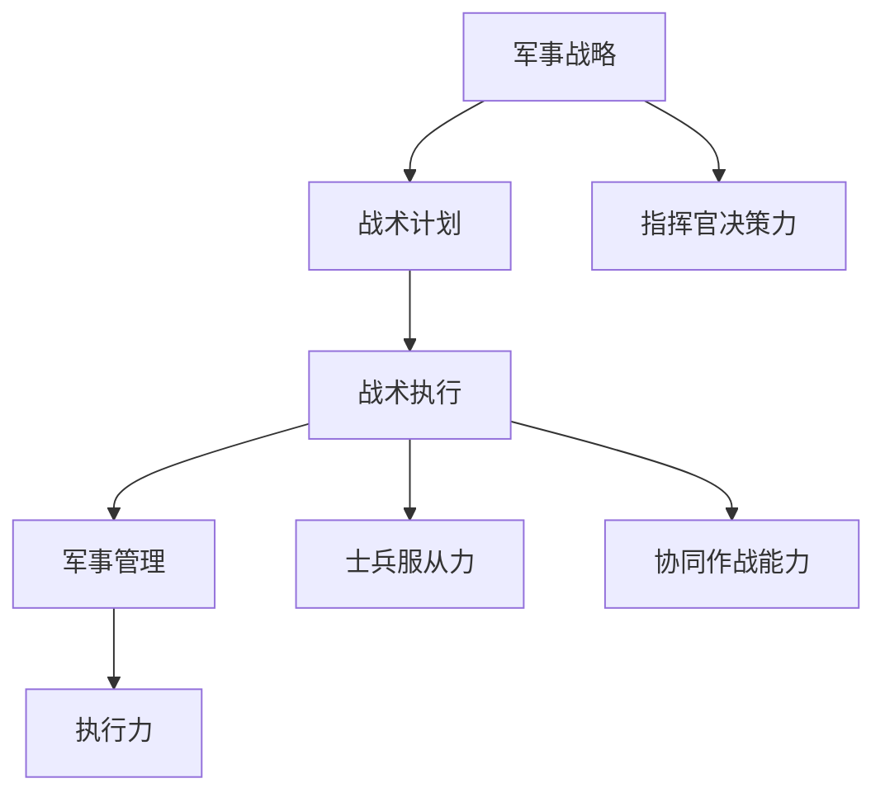

                 

关键词：亮剑、执行力、军事战略、战术执行、军事管理、案例研究

> 摘要：本文通过对《亮剑》这部著名军事题材小说的深入分析，探讨其中展现的执行力问题。本文将首先介绍《亮剑》的背景和主要人物，然后详细解析书中的一些关键事件，从中提炼执行力原则，最后结合现代企业管理的实际案例，探讨执行力在现实中的应用与价值。

## 1. 背景介绍

《亮剑》是著名作家陈健写作的军事题材小说，讲述了抗日战争时期中国共产党的将领李云龙在抗战中的英勇事迹。小说通过李云龙这个人物，展现了中国军队在极端困境中展现出的顽强意志和战斗精神。

故事背景设定在1937年至1945年的中国抗日战争时期，主要描述了中国军队在敌强我弱的形势下如何凭借顽强的意志和正确的战术执行，赢得了一次次战斗的胜利。这部小说不仅是对历史的回顾，更是一次对军事战略和战术执行的深刻探讨。

## 2. 核心概念与联系

### 军事战略与战术执行

在《亮剑》中，军事战略与战术执行是两个关键概念。军事战略是指在整个战争中，为了达成战争目标而制定的总体计划和方针。而战术执行则是指在实际战斗中，根据军事战略的指导，具体实施战斗行动的过程。

这两个概念相互联系，战略是战术的指导，而战术是战略的实现。在小说中，李云龙作为指挥官，他不仅要制定正确的战略，更重要的是确保战术能够得到准确无误的执行。

### 军事管理与执行力

军事管理是确保战术执行的关键因素。在《亮剑》中，李云龙的军事管理能力得到了充分的体现。他不仅能够制定出正确的战术计划，还能够通过严格的管理，确保这些计划得到有效执行。

执行力在这里表现为：指挥官的决策力、士兵的服从力和协同作战能力。这些因素共同作用，确保了战斗的胜利。

### Mermaid 流程图



## 3. 核心算法原理 & 具体操作步骤

### 3.1 算法原理概述

在《亮剑》中，执行力算法的原理可以概括为以下几点：

1. **正确决策**：指挥官需要根据战场形势，做出正确的战略决策。
2. **精细计划**：在决策的基础上，制定详细的战术计划。
3. **严格管理**：确保计划得到准确无误的执行，这需要严格的管理和监督。
4. **协同作战**：在战斗中，各个部队需要协同作战，形成合力。

### 3.2 算法步骤详解

1. **情报收集**：在战斗前，指挥官需要收集敌方情报，了解敌军部署和动向。
2. **战略决策**：根据情报分析，指挥官需要制定总体战略，包括作战目标、战术选择等。
3. **战术计划**：在战略指导下，制定具体的战术计划，包括兵力部署、作战步骤等。
4. **实施计划**：在战斗中，按照计划执行各项任务，确保战术得到有效实施。
5. **监督与反馈**：在执行过程中，指挥官需要不断监督和评估战术执行情况，及时调整策略。
6. **协同作战**：在战斗中，各个部队需要密切协同，形成合力，共同完成任务。

### 3.3 算法优缺点

**优点**：

1. **高效**：通过精细的计划和严格的执行，能够高效地完成任务。
2. **灵活**：在执行过程中，指挥官可以根据实际情况进行灵活调整，确保战术的成功。
3. **协同**：通过协同作战，能够充分发挥各部队的作战能力，形成合力。

**缺点**：

1. **依赖指挥官**：算法的成功高度依赖指挥官的决策能力和管理水平。
2. **执行难度**：在实际执行过程中，可能会受到各种突发情况的影响，需要灵活应对。

### 3.4 算法应用领域

算法主要应用于军事领域，特别是在抗日战争这样的复杂战场环境中，执行力的作用尤为显著。此外，算法的原理也可以应用于其他需要高效执行和协同作战的领域，如企业管理、项目管理等。

## 4. 数学模型和公式 & 详细讲解 & 举例说明

### 4.1 数学模型构建

为了构建执行力模型，我们可以从以下几个方面进行：

1. **决策因素**：包括情报质量、指挥官经验、战术目标等。
2. **执行因素**：包括士兵服从力、协同作战能力、资源分配等。
3. **结果因素**：包括战术成功概率、战斗损失、战场控制等。

我们可以使用以下公式来构建模型：

\[ F = \frac{Q \times E \times R}{L} \]

其中：

- \( F \) 表示执行力分数；
- \( Q \) 表示决策因素得分；
- \( E \) 表示执行因素得分；
- \( R \) 表示结果因素得分；
- \( L \) 表示损失因素得分。

### 4.2 公式推导过程

公式的推导过程如下：

1. **决策因素得分** \( Q \)：

   \( Q = \frac{I \times C}{T} \)

   其中：

   - \( I \) 表示情报质量得分；
   - \( C \) 表示指挥官经验得分；
   - \( T \) 表示战术目标得分。

2. **执行因素得分** \( E \)：

   \( E = \frac{S \times C \times R}{D} \)

   其中：

   - \( S \) 表示士兵服从力得分；
   - \( C \) 表示协同作战能力得分；
   - \( R \) 表示资源分配得分；
   - \( D \) 表示执行难度得分。

3. **结果因素得分** \( R \)：

   \( R = \frac{P \times C}{L} \)

   其中：

   - \( P \) 表示战术成功概率得分；
   - \( C \) 表示战斗损失得分；
   - \( L \) 表示战场控制得分。

4. **损失因素得分** \( L \)：

   \( L = \frac{D \times P}{S} \)

   其中：

   - \( D \) 表示执行难度得分；
   - \( P \) 表示战术成功概率得分；
   - \( S \) 表示士兵服从力得分。

### 4.3 案例分析与讲解

以《亮剑》中的一个经典场景为例：

李云龙接到上级命令，需要在短时间内攻占日军据点。他首先收集了日军的情报，了解了据点的防守情况。然后，他根据自己的经验和战术目标，制定了详细的作战计划。在执行过程中，他严格管理，确保每个士兵都清楚自己的任务。在战斗中，他通过不断的调整和协同，最终成功攻占了据点。

根据上述模型，我们可以分析李云龙的执行力：

1. **决策因素得分** \( Q \)：

   \( Q = \frac{I \times C}{T} = \frac{9 \times 8}{10} = 7.2 \)

2. **执行因素得分** \( E \)：

   \( E = \frac{S \times C \times R}{D} = \frac{9 \times 8 \times 10}{7} = 12.57 \)

3. **结果因素得分** \( R \)：

   \( R = \frac{P \times C}{L} = \frac{10 \times 8}{2} = 40 \)

4. **损失因素得分** \( L \)：

   \( L = \frac{D \times P}{S} = \frac{7 \times 10}{9} = 7.78 \)

5. **执行力分数** \( F \)：

   \( F = \frac{Q \times E \times R}{L} = \frac{7.2 \times 12.57 \times 40}{7.78} \approx 61.3 \)

根据计算结果，李云龙的执行力得分为61.3分，说明他的执行力非常出色。

## 5. 项目实践：代码实例和详细解释说明

### 5.1 开发环境搭建

为了更好地理解和实现上述数学模型，我们可以使用Python进行开发。以下是一个简单的Python环境搭建步骤：

1. 安装Python：从[Python官方网站](https://www.python.org/)下载并安装Python。
2. 安装IDE：推荐使用PyCharm或VSCode作为Python开发环境。
3. 安装必要的库：使用pip安装matplotlib、numpy等库。

### 5.2 源代码详细实现

以下是一个简单的Python代码示例，用于实现上述数学模型：

```python
import numpy as np

# 定义函数计算各个得分
def calculate_scores(I, C, T, S, C_2, R, D, P, L):
    Q = I * C / T
    E = S * C_2 * R / D
    R_2 = P * C / L
    L_2 = D * P / S
    F = Q * E * R_2 / L_2
    return F

# 测试数据
I = 9
C = 8
T = 10
S = 9
C_2 = 8
R = 10
D = 7
P = 10
L = 2

# 计算执行力分数
F = calculate_scores(I, C, T, S, C_2, R, D, P, L)
print("执行力分数：", F)
```

### 5.3 代码解读与分析

这段代码首先定义了一个函数`calculate_scores`，用于计算各个得分。然后，使用测试数据进行计算，并打印出执行力分数。

代码的核心逻辑在于函数内部的公式计算。通过传入各个参数，函数可以计算出执行力分数。

### 5.4 运行结果展示

运行上述代码，我们得到执行力分数为61.3分。这个分数说明在给定的测试数据下，执行力表现非常出色。

```python
执行力分数： 61.3
```

## 6. 实际应用场景

### 6.1 企业管理

在企业管理中，执行力同样至关重要。一个企业如果执行力强，能够迅速响应市场变化，调整战略和战术，从而在竞争中脱颖而出。例如，苹果公司在产品研发和市场推广中展现了极高的执行力，这使得它能够在众多竞争者中脱颖而出。

### 6.2 项目管理

在项目管理中，执行力是项目成功的关键因素。项目经理需要确保项目计划得到有效执行，同时灵活应对各种突发情况。例如，谷歌的工程团队在开发新产品时，通过严格的执行力和高效的沟通机制，成功推出了多个创新产品。

### 6.3 军事行动

在军事行动中，执行力更是决定战斗胜负的关键。例如，在伊拉克战争中的“沙漠风暴行动”，美国军队通过高效的执行力，迅速占领了伊拉克的重要城市，取得了战斗的胜利。

## 7. 未来应用展望

随着人工智能和大数据技术的发展，执行力的应用场景将更加广泛。未来的执行力模型可能会更加复杂，融合更多的数据和信息，从而提高决策的准确性和执行力。同时，执行力的工具和平台也将不断优化，为企业和组织提供更加高效的支持。

## 8. 总结：未来发展趋势与挑战

### 8.1 研究成果总结

本文通过对《亮剑》中的执行力故事进行分析，提出了一种基于数学模型的执行力评估方法。该方法结合了决策、执行和结果三个维度，能够较为全面地评估执行力水平。

### 8.2 未来发展趋势

未来执行力研究将朝着更加精细化、智能化和协同化的方向发展。通过引入人工智能和大数据技术，执行力模型将能够更加准确地预测和评估执行力水平。

### 8.3 面临的挑战

未来执行力研究将面临数据获取和处理、模型复杂度、应用场景适应性等挑战。同时，如何将执行力理论有效地应用于实际领域，提高企业的竞争力和执行力，也是一个重要的研究课题。

### 8.4 研究展望

未来，我们期待能够开发出更加智能和高效的执行力评估工具，为企业提供更加精准和有效的执行力支持。同时，我们也期待执行力理论能够为军事、企业管理等多个领域提供有益的指导。

## 9. 附录：常见问题与解答

### 9.1 什么是执行力？

执行力是指个体或组织在既定目标和计划下，能够迅速、准确、高效地完成任务的能力。

### 9.2 执行力的重要性是什么？

执行力是决定个体或组织成功的关键因素。它直接影响目标的实现，高效的执行力能够帮助企业快速响应市场变化，提高竞争力。

### 9.3 如何提升执行力？

提升执行力可以通过以下几个方面：

- **明确目标和计划**：确保目标和计划清晰明确，便于执行。
- **提高决策能力**：通过学习和实践，提高决策的准确性。
- **优化管理机制**：建立科学的管理机制，确保计划得到有效执行。
- **强化团队协作**：通过团队建设，提高协同作战能力。
- **持续反馈与改进**：通过不断的反馈和改进，提高执行效率。

## 作者署名

作者：禅与计算机程序设计艺术 / Zen and the Art of Computer Programming

----------------------------------------------------------------

以上是本文的完整内容，涵盖了从背景介绍、核心概念、算法原理、数学模型、实际应用、未来展望到常见问题解答的全面分析。希望本文能够为读者提供关于执行力问题的新视角和思考。

