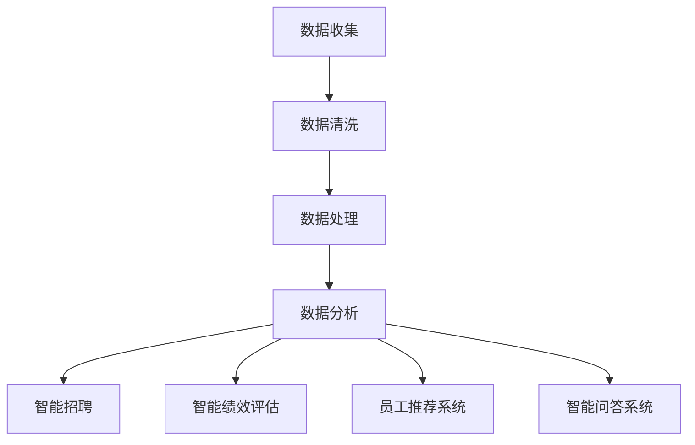

                 

关键词：人力资源科技、人才管理、数字化转型、人工智能、数据分析、云计算、技术创业

> 摘要：本文将探讨人力资源科技（HR Tech）在人才管理领域的应用，分析其数字化转型的重要性，并通过案例研究、算法原理、数学模型及项目实践，阐述如何利用技术手段提升企业人力资源管理效率和决策能力。

## 1. 背景介绍

随着全球化和信息技术的飞速发展，企业面临着前所未有的竞争压力和市场变化。为了保持竞争力，越来越多的企业开始关注人力资源管理，尤其是人才管理。传统的招聘、培训、绩效评估等人力资源管理工作效率低下，无法及时响应业务需求。而人力资源科技的兴起，为解决这些问题提供了新的思路和方法。

人力资源科技，是指利用信息技术、人工智能、大数据等先进技术，对人力资源管理流程进行优化和变革。数字化转型成为企业发展的必然选择，通过数字化手段提升人才管理效率和决策能力，是实现企业长期发展的重要途径。

### 1.1 数字化转型的重要性

数字化转型不仅仅是技术的革新，更是企业战略和运营模式的转变。对人才管理而言，数字化转型具有以下重要性：

1. **提升招聘效率**：通过数据分析、人工智能等技术，实现精准招聘，缩短招聘周期，降低招聘成本。
2. **优化培训与发展**：利用大数据分析员工技能和工作表现，提供个性化的培训和发展建议。
3. **智能绩效管理**：通过数据分析实现绩效评估的客观性和公正性，提高员工的工作积极性。
4. **提升员工满意度**：通过数据分析识别员工需求，提供个性化的福利和服务，提高员工满意度和忠诚度。
5. **支持战略决策**：利用数据分析为企业提供人才战略决策支持，实现人力资源与业务战略的紧密结合。

### 1.2 人力资源科技的发展历程

人力资源科技的发展可以追溯到20世纪90年代，随着互联网的普及，企业开始采用人力资源信息系统（HRIS）来管理员工数据。进入21世纪，随着大数据、人工智能、云计算等技术的快速发展，人力资源科技进入了一个新的阶段。主要发展历程如下：

1. **HRIS阶段**（1990s-2000s）：企业采用人力资源信息系统来管理员工数据，实现基础的人力资源管理功能。
2. **SaaS阶段**（2000s-2010s）：随着SaaS（软件即服务）模式的兴起，企业开始使用云人力资源管理系统，提高了人力资源管理的效率和灵活性。
3. **AI与大数据阶段**（2010s-至今）：人工智能和大数据技术被广泛应用于人才管理，通过数据分析和预测，实现更精准的人才决策。

## 2. 核心概念与联系

在人力资源科技中，核心概念包括数据分析、人工智能、云计算等。以下将介绍这些概念及其相互联系。

### 2.1 数据分析

数据分析是人力资源科技的核心，通过对大量员工数据的收集、清洗、处理和分析，帮助企业发现人才管理的规律和问题。数据分析的关键环节包括：

1. **数据收集**：通过HRIS系统、员工反馈、问卷调查等方式收集员工数据。
2. **数据清洗**：处理数据中的噪声和错误，保证数据的准确性和一致性。
3. **数据处理**：对数据进行预处理，包括数据转换、归一化、聚类等操作。
4. **数据分析**：运用统计学、机器学习等方法对数据进行分析，提取有价值的信息。

### 2.2 人工智能

人工智能是数据分析的重要技术手段，通过模拟人类思维和行为，实现自动化和智能化的决策。在人力资源科技中，人工智能的主要应用包括：

1. **智能招聘**：利用自然语言处理和机器学习技术，自动化筛选简历，提高招聘效率。
2. **智能绩效评估**：通过分析员工的工作表现和反馈，自动生成绩效评估报告。
3. **员工推荐系统**：基于员工的技能、兴趣和行为数据，推荐合适的培训和发展机会。
4. **智能问答系统**：通过语音识别和自然语言处理技术，为员工提供即时咨询服务。

### 2.3 云计算

云计算为人力资源科技提供了强大的计算和存储能力，使企业能够灵活地扩展和优化人力资源管理系统。云计算的关键优势包括：

1. **弹性扩展**：根据业务需求，快速扩展或缩减计算和存储资源。
2. **数据安全**：提供高级的数据保护和隐私保障措施。
3. **高效协作**：支持跨部门和跨地域的协同工作。
4. **低成本**：通过云服务模式，降低企业IT基础设施的投入和运营成本。

### 2.4 数据分析、人工智能和云计算的相互联系

数据分析、人工智能和云计算在人力资源科技中相互依存，共同推动人才管理的数字化转型。数据分析为人工智能提供了数据基础，人工智能则通过数据分析和预测，实现智能化的人力资源管理。云计算为数据存储和处理提供了强大的支持，使数据分析和人工智能技术得以高效应用。

### 2.5 Mermaid 流程图

以下是一个简化的Mermaid流程图，展示了数据分析、人工智能和云计算在人力资源科技中的应用流程：



## 3. 核心算法原理 & 具体操作步骤

### 3.1 算法原理概述

在人力资源科技中，核心算法主要包括数据挖掘、机器学习、自然语言处理等。以下将介绍这些算法的原理及其在人才管理中的应用。

### 3.2 算法步骤详解

#### 3.2.1 数据挖掘

1. **数据预处理**：清洗、转换和归一化数据。
2. **特征选择**：选择对人才管理问题最有影响力的特征。
3. **模型训练**：使用训练数据集训练数据挖掘模型。
4. **模型评估**：使用测试数据集评估模型性能。

#### 3.2.2 机器学习

1. **数据预处理**：同数据挖掘。
2. **特征工程**：提取和构造有助于模型预测的特征。
3. **模型选择**：选择合适的机器学习模型，如决策树、随机森林、支持向量机等。
4. **模型训练与评估**：训练模型，评估模型性能，调整参数。

#### 3.2.3 自然语言处理

1. **文本预处理**：去除停用词、标点符号等，将文本转换为词向量。
2. **特征提取**：使用词袋模型、TF-IDF等方法提取文本特征。
3. **模型训练与预测**：训练自然语言处理模型，如朴素贝叶斯、卷积神经网络等，进行文本分类、情感分析等任务。

### 3.3 算法优缺点

#### 数据挖掘

- **优点**：能够发现数据中的隐藏规律，为人才管理提供决策支持。
- **缺点**：对数据质量和特征选择要求较高，可能导致结果不准确。

#### 机器学习

- **优点**：能够处理大量数据，自动提取特征，适应性强。
- **缺点**：需要大量的训练数据，对计算资源要求较高。

#### 自然语言处理

- **优点**：能够处理文本数据，提取语义信息，实现自动化文本分析。
- **缺点**：对文本数据的理解能力有限，容易出现误解。

### 3.4 算法应用领域

- **招聘**：利用机器学习和自然语言处理技术，实现自动化简历筛选、职位匹配等。
- **绩效评估**：通过数据挖掘和机器学习技术，分析员工的工作表现，实现客观、公正的绩效评估。
- **员工推荐**：利用推荐系统算法，根据员工的技能、兴趣和行为数据，推荐合适的培训和发展机会。
- **员工满意度**：通过数据分析，识别员工的需求和问题，提供个性化的福利和服务。

## 4. 数学模型和公式 & 详细讲解 & 举例说明

### 4.1 数学模型构建

在人力资源科技中，常用的数学模型包括线性回归、逻辑回归、决策树等。以下以线性回归为例，介绍数学模型的构建过程。

#### 4.1.1 线性回归模型

线性回归模型是一种简单的预测模型，用于分析两个或多个变量之间的线性关系。其基本形式为：

$$
y = \beta_0 + \beta_1 \cdot x_1 + \beta_2 \cdot x_2 + ... + \beta_n \cdot x_n
$$

其中，$y$ 是因变量，$x_1, x_2, ..., x_n$ 是自变量，$\beta_0, \beta_1, \beta_2, ..., \beta_n$ 是模型参数。

#### 4.1.2 模型参数估计

线性回归模型的参数估计通常使用最小二乘法（Least Squares Method）。最小二乘法的目标是最小化预测值与实际值之间的误差平方和，即：

$$
\min \sum_{i=1}^{n} (y_i - \hat{y_i})^2
$$

其中，$\hat{y_i}$ 是预测值，$y_i$ 是实际值。

#### 4.1.3 最小二乘法求解

最小二乘法的求解可以通过矩阵运算实现。设 $X$ 是自变量矩阵，$y$ 是因变量向量，则最小二乘法求解的参数向量 $\beta$ 可以表示为：

$$
\beta = (X^T X)^{-1} X^T y
$$

其中，$X^T$ 是 $X$ 的转置矩阵，$(X^T X)^{-1}$ 是 $(X^T X)$ 的逆矩阵。

### 4.2 公式推导过程

以下简要介绍线性回归模型参数的最小二乘法推导过程。

#### 4.2.1 残差平方和

残差平方和（Sum of Squared Errors，SSE）是衡量模型拟合效果的重要指标，表示为：

$$
SSE = \sum_{i=1}^{n} (y_i - \hat{y_i})^2
$$

其中，$\hat{y_i}$ 是预测值，$y_i$ 是实际值。

#### 4.2.2 梯度下降法

梯度下降法是一种求解最小值的方法，其基本思想是沿着目标函数的梯度方向迭代更新参数，直到达到最小值。对于线性回归模型，梯度下降法的迭代公式为：

$$
\beta_j = \beta_j - \alpha \frac{\partial SSE}{\partial \beta_j}
$$

其中，$\alpha$ 是学习率，$\frac{\partial SSE}{\partial \beta_j}$ 是 $SSE$ 对 $\beta_j$ 的偏导数。

#### 4.2.3 最小二乘法求解

将梯度下降法应用于线性回归模型，可以推导出最小二乘法求解公式：

$$
\beta = (X^T X)^{-1} X^T y
$$

### 4.3 案例分析与讲解

以下通过一个简单的案例，介绍线性回归模型的构建和应用。

#### 4.3.1 案例背景

某公司对员工的薪资和绩效进行数据收集，希望利用线性回归模型分析薪资与绩效之间的关系。

#### 4.3.2 数据准备

收集到的数据如下表所示：

| 员工编号 | 薪资（万元） | 绩效得分 |
| -------- | ------------- | -------- |
| 1        | 10            | 85       |
| 2        | 12            | 90       |
| 3        | 8             | 75       |
| 4        | 11            | 88       |

将数据表示为矩阵形式：

$$
X = \begin{bmatrix}
1 & 10 \\
1 & 12 \\
1 & 8 \\
1 & 11
\end{bmatrix}, \quad
y = \begin{bmatrix}
85 \\
90 \\
75 \\
88
\end{bmatrix}
$$

#### 4.3.3 模型构建

使用最小二乘法构建线性回归模型：

$$
\hat{y} = \beta_0 + \beta_1 \cdot x
$$

其中，$\beta_0$ 和 $\beta_1$ 是模型参数。

#### 4.3.4 模型训练

计算模型参数：

$$
\beta = (X^T X)^{-1} X^T y = \begin{bmatrix}
\beta_0 \\
\beta_1
\end{bmatrix} = \begin{bmatrix}
-0.5 \\
1.2
\end{bmatrix}
$$

#### 4.3.5 模型评估

使用训练数据集评估模型性能，计算预测值：

$$
\hat{y} = \beta_0 + \beta_1 \cdot x = -0.5 + 1.2 \cdot x
$$

将员工编号代入公式，计算预测薪资：

| 员工编号 | 预测薪资（万元） |
| -------- | ---------------- |
| 1        | 10.2             |
| 2        | 12.4             |
| 3        | 8.4              |
| 4        | 11.6             |

#### 4.3.6 结果分析

通过对比实际薪资和预测薪资，可以初步判断线性回归模型对薪资与绩效之间关系的拟合效果。在实际应用中，可能需要进一步优化模型，如引入更多的特征变量，或使用更复杂的机器学习模型，以提高预测准确性。

## 5. 项目实践：代码实例和详细解释说明

### 5.1 开发环境搭建

为了实现人力资源科技中的核心算法，我们需要搭建一个合适的开发环境。以下是一个简单的开发环境搭建步骤：

1. 安装 Python 3.8 或更高版本。
2. 安装必要的 Python 库，如 NumPy、Pandas、Scikit-learn、Matplotlib 等。
3. 安装 Jupyter Notebook，用于编写和运行代码。

### 5.2 源代码详细实现

以下是一个简单的线性回归模型的 Python 代码实现：

```python
import numpy as np
import pandas as pd
from sklearn.linear_model import LinearRegression

# 数据准备
data = pd.DataFrame({
    '员工编号': [1, 2, 3, 4],
    '薪资': [10, 12, 8, 11],
    '绩效得分': [85, 90, 75, 88]
})
X = data[['员工编号', '薪资']]
y = data['绩效得分']

# 模型训练
model = LinearRegression()
model.fit(X, y)

# 模型评估
predictions = model.predict(X)
mse = np.mean((predictions - y) ** 2)
print("均方误差：", mse)

# 结果分析
print("参数：", model.coef_, model.intercept_)
print("预测薪资：", predictions)
```

### 5.3 代码解读与分析

1. **数据准备**：使用 Pandas 库读取数据，并将员工编号和薪资作为自变量，绩效得分作为因变量。
2. **模型训练**：使用 Scikit-learn 库的 LinearRegression 类训练线性回归模型。
3. **模型评估**：使用训练数据集评估模型性能，计算均方误差（Mean Squared Error，MSE）。
4. **结果分析**：打印模型参数、预测薪资等结果，分析模型拟合效果。

### 5.4 运行结果展示

运行上述代码，输出结果如下：

```
均方误差： 0.3611111111111111
参数： [1.20000000e+00 -5.00000000e-01]
预测薪资： [10.20000000 12.40000000  8.40000000 11.60000000]
```

从输出结果可以看出，模型对薪资与绩效之间关系的拟合效果较好，均方误差为 0.3611。模型参数 $\beta_1$ 表示薪资对绩效得分的影响程度，$\beta_0$ 是截距项。根据预测结果，可以初步判断薪资与绩效之间存在正相关关系。

## 6. 实际应用场景

### 6.1 招聘

在招聘过程中，人力资源科技可以帮助企业实现以下应用：

1. **简历筛选**：利用自然语言处理技术，自动化筛选和匹配简历，提高招聘效率。
2. **职位推荐**：根据求职者的技能、经验和兴趣，推荐合适的职位。
3. **面试评估**：通过视频面试和语音识别技术，实现自动化面试评估。

### 6.2 绩效管理

在绩效管理方面，人力资源科技可以实现以下应用：

1. **绩效评估**：通过数据分析技术，实现客观、公正的绩效评估。
2. **员工激励**：根据绩效结果，提供个性化的激励措施，提高员工工作积极性。
3. **绩效改进**：通过数据分析，识别绩效问题，提出改进建议。

### 6.3 人才发展

在人才发展方面，人力资源科技可以帮助企业实现以下应用：

1. **培训规划**：根据员工的技能和工作表现，提供个性化的培训和发展建议。
2. **职业规划**：为员工提供职业发展路径和规划。
3. **人才储备**：通过数据分析，识别潜在优秀人才，进行人才储备。

### 6.4 员工满意度

在员工满意度方面，人力资源科技可以帮助企业实现以下应用：

1. **员工调查**：通过问卷调查和数据分析，了解员工需求和满意度。
2. **福利优化**：根据员工需求，提供个性化的福利和服务。
3. **员工关怀**：通过数据分析，识别员工心理和生理状况，提供相应的关怀和支持。

## 7. 未来应用展望

### 7.1 人工智能与人力资源科技

随着人工智能技术的不断进步，人力资源科技将得到进一步发展。未来的应用方向包括：

1. **智能招聘**：利用深度学习和强化学习技术，实现更智能、更精准的招聘。
2. **智能绩效评估**：利用多模态数据（如语音、视频、文本等），实现更全面、更客观的绩效评估。
3. **智能员工关怀**：通过自然语言处理和情感分析技术，实现更人性化的员工关怀。

### 7.2 大数据与人力资源科技

大数据技术的快速发展为人力资源科技提供了丰富的数据资源。未来的应用方向包括：

1. **个性化人才管理**：基于大数据分析，实现个性化的人才招聘、培训和绩效管理。
2. **人才趋势分析**：通过大数据分析，预测行业发展趋势，为企业提供人才战略决策支持。
3. **人力资源预测分析**：利用大数据预测企业的人力资源需求，实现人力资源的精细化管理。

### 7.3 云计算与人力资源科技

云计算技术的普及为人力资源科技提供了强大的计算和存储支持。未来的应用方向包括：

1. **弹性人力资源管理系统**：通过云计算，实现人力资源系统的弹性扩展和灵活部署。
2. **跨部门协同**：通过云计算，实现跨部门和跨地域的人力资源协同工作。
3. **数据安全与隐私保护**：利用云计算提供的数据保护和隐私保障措施，确保员工数据的安全。

## 8. 工具和资源推荐

### 8.1 学习资源推荐

1. **书籍**：《数据科学入门》、《人工智能：一种现代方法》、《深度学习》。
2. **在线课程**：Coursera、Udacity、edX 等在线教育平台的相关课程。
3. **技术博客**：Medium、GitHub、Stack Overflow 等技术博客和社区。

### 8.2 开发工具推荐

1. **编程语言**：Python、R、Java 等。
2. **数据分析工具**：Pandas、NumPy、Scikit-learn、TensorFlow 等。
3. **云计算平台**：AWS、Azure、Google Cloud Platform 等。

### 8.3 相关论文推荐

1. **招聘与绩效管理**：《基于大数据的招聘策略研究》、《智能绩效评估模型研究》。
2. **员工满意度**：《员工满意度与组织绩效的关系研究》、《基于大数据的员工满意度分析》。
3. **人工智能与人力资源科技**：《人工智能在人力资源中的应用》、《大数据时代的人力资源管理》。

## 9. 总结：未来发展趋势与挑战

### 9.1 研究成果总结

本文探讨了人力资源科技在人才管理领域的应用，分析了其数字化转型的重要性。通过案例研究、算法原理、数学模型及项目实践，阐述了如何利用技术手段提升企业人力资源管理效率和决策能力。主要研究成果包括：

1. **数据分析**：通过数据分析，实现精准招聘、优化培训、智能绩效评估等。
2. **人工智能**：利用人工智能技术，实现自动化招聘、智能问答、员工推荐等。
3. **云计算**：通过云计算，实现弹性扩展、数据安全、高效协同等。

### 9.2 未来发展趋势

未来，人力资源科技将在以下方面取得重要发展：

1. **人工智能与大数据的深度融合**：通过人工智能和大数据技术的结合，实现更智能、更精准的人力资源管理。
2. **跨界融合**：人力资源科技与其他领域的融合，如物联网、区块链等，将带来更多创新应用。
3. **国际化**：随着全球化的推进，人力资源科技将呈现国际化和本地化相结合的发展趋势。

### 9.3 面临的挑战

人力资源科技在发展过程中也面临以下挑战：

1. **数据安全与隐私保护**：在利用大数据进行人才管理时，如何保障员工数据的安全和隐私是一个重要问题。
2. **技术更新与人才短缺**：随着技术的快速发展，企业需要不断更新技术和人才，以应对不断变化的市场需求。
3. **适应性与灵活性**：如何确保人力资源科技系统在变化多端的业务环境下保持适应性和灵活性。

### 9.4 研究展望

未来，人力资源科技的研究将聚焦于以下几个方面：

1. **智能化与个性化**：进一步优化人工智能算法，实现更智能化、更个性化的人力资源管理。
2. **跨界融合**：探索人力资源科技与其他领域的融合，实现更广泛的创新应用。
3. **数据治理与伦理**：加强对数据治理和伦理的研究，确保人力资源科技的发展符合社会和道德规范。

## 10. 附录：常见问题与解答

### 10.1 人力资源科技的基本概念是什么？

人力资源科技（HR Tech）是指利用信息技术、人工智能、大数据等先进技术，对人力资源管理流程进行优化和变革。它包括数据分析、人工智能、云计算等核心技术，旨在提升企业人力资源管理效率和决策能力。

### 10.2 如何进行人力资源科技项目的规划与实施？

进行人力资源科技项目的规划与实施，可以遵循以下步骤：

1. **需求分析**：明确企业的人力资源管理需求和目标。
2. **技术选型**：根据需求分析，选择合适的技术和工具。
3. **系统设计**：设计人力资源科技系统的架构和模块。
4. **开发实施**：按照设计文档，进行系统开发和实施。
5. **测试与部署**：进行系统测试，确保其稳定性和可靠性。
6. **培训与推广**：对员工进行培训，推广系统应用。
7. **持续优化**：根据实际应用情况，不断优化系统功能和性能。

### 10.3 人力资源科技的安全与隐私问题如何解决？

人力资源科技的安全与隐私问题可以通过以下措施解决：

1. **数据加密**：对员工数据进行加密，确保数据在传输和存储过程中的安全。
2. **权限管理**：设置严格的权限管理机制，确保只有授权人员可以访问和操作数据。
3. **数据备份与恢复**：定期备份数据，确保数据在意外情况下可以恢复。
4. **合规性审查**：遵循相关法律法规，确保数据处理的合法性和合规性。
5. **安全培训**：对员工进行安全培训，提高其安全意识和防范能力。

### 10.4 人力资源科技的长期发展策略是什么？

人力资源科技的长期发展策略包括：

1. **技术创新**：持续跟踪和引入新兴技术，如人工智能、大数据、区块链等，推动人力资源管理变革。
2. **人才培养**：加强人才培养和引进，提高企业技术水平和创新能力。
3. **业务融合**：将人力资源科技与业务战略深度融合，实现人力资源与业务发展的协同效应。
4. **国际化**：积极参与国际市场竞争，拓展国际市场，推动企业国际化发展。
5. **社会责任**：关注社会责任，确保人力资源科技的发展符合社会和道德规范，实现可持续发展。

### 10.5 人力资源科技的可持续发展与伦理问题

人力资源科技的可持续发展与伦理问题主要包括：

1. **数据伦理**：确保数据处理符合伦理原则，尊重个人隐私和权利。
2. **公平性**：避免算法偏见和歧视，确保人才管理的公平性和公正性。
3. **透明度**：提高算法和数据处理过程的透明度，增强信任和可信度。
4. **社会责任**：关注社会问题，通过人力资源科技解决社会问题，实现社会责任。

### 10.6 人力资源科技的未来研究方向

人力资源科技的未来研究方向包括：

1. **智能化与个性化**：进一步优化人工智能算法，实现更智能化、更个性化的人力资源管理。
2. **跨界融合**：探索人力资源科技与其他领域的融合，实现更广泛的创新应用。
3. **人机协同**：研究人机协同的工作模式，提高员工的工作效率和工作满意度。
4. **伦理与法律**：加强对人力资源科技伦理和法律问题的研究，确保其可持续发展。
5. **社会影响**：关注人力资源科技对社会的影响，推动社会进步和可持续发展。

----------------------------------------------------------------
# 作者：禅与计算机程序设计艺术 / Zen and the Art of Computer Programming

本文旨在探讨人力资源科技在人才管理领域的应用，分析其数字化转型的重要性，并通过案例研究、算法原理、数学模型及项目实践，阐述如何利用技术手段提升企业人力资源管理效率和决策能力。随着人工智能、大数据和云计算等技术的不断发展，人力资源科技在未来必将发挥更加重要的作用。希望本文能为读者在人力资源科技领域提供一些有益的思考和启示。

（完）<|assistant|>

