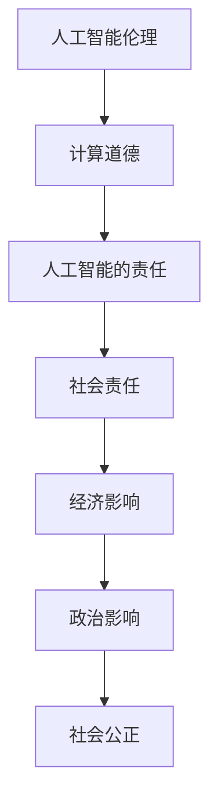

                 

关键词：人工智能伦理、计算道德、AI责任、技术伦理、人工智能影响、责任分配

> 摘要：随着人工智能技术的迅猛发展，人工智能伦理问题逐渐成为关注的焦点。本文将从人工智能伦理的核心概念、计算道德原则、人工智能的责任与责任分配等方面，深入探讨人工智能领域的道德与责任问题，旨在为人工智能伦理的研究和实践提供有益的参考。

## 1. 背景介绍

### 1.1 人工智能的发展历程

人工智能（Artificial Intelligence, AI）的概念最早可以追溯到20世纪50年代。自那时以来，人工智能技术经历了多个发展阶段，从早期的符号主义、连接主义到现代的深度学习和强化学习。每一次技术变革都极大地推动了人工智能的进步，使其在图像识别、自然语言处理、自动驾驶、医疗诊断等领域取得了显著的成果。

### 1.2 人工智能对人类生活的影响

人工智能的快速发展不仅改变了我们的生活方式，还对社会、经济、政治等方面产生了深远的影响。例如，在医疗领域，人工智能可以通过分析大量医学数据，帮助医生进行精准诊断和治疗；在金融领域，人工智能可以用于风险评估、欺诈检测等；在交通领域，自动驾驶技术有望减少交通事故，提高交通效率。

### 1.3 人工智能伦理问题的提出

然而，随着人工智能技术的广泛应用，其带来的伦理问题也逐渐显现。例如，人工智能在决策过程中是否存在偏见、如何确保人工智能系统的透明性和可解释性、人工智能责任如何分配等。这些问题引发了广泛的讨论，促使我们深入思考人工智能伦理的重要性。

## 2. 核心概念与联系

### 2.1 人工智能伦理

人工智能伦理是指研究人工智能系统在设计和应用过程中，如何遵循道德规范和伦理原则，以确保其对社会和人类的影响是积极和负责任的。人工智能伦理的核心是探讨人工智能技术如何与道德原则相结合，以实现技术的可持续发展。

### 2.2 计算道德

计算道德是指计算机科学和信息技术领域中的道德原则和实践，旨在确保技术发展过程中遵循伦理规范，保护个人隐私、数据安全和社会公正。计算道德是人工智能伦理的重要组成部分，它关注人工智能技术如何影响人类的生活和社会。

### 2.3 人工智能的责任

人工智能的责任是指人工智能系统在运行过程中，应当承担的对人类和社会的责任。这包括对错误决策的承担责任、对隐私数据的保护责任以及对技术滥用的预防责任等。明确人工智能的责任有助于规范人工智能的发展，确保其对社会和人类的影响是积极和负责任的。

### 2.4 Mermaid 流程图

以下是一个简化的Mermaid流程图，展示了人工智能伦理、计算道德和人工智能责任的联系。



## 3. 核心算法原理 & 具体操作步骤

### 3.1 算法原理概述

人工智能伦理的核心算法原理可以概括为以下几个方面：

1. **伦理原则指导**：在人工智能系统的设计和开发过程中，应遵循伦理原则，确保技术的道德性和社会责任性。
2. **透明性和可解释性**：确保人工智能系统的决策过程透明，能够被用户理解和监督，以提高系统的可信度和接受度。
3. **公平性和无偏见**：防止人工智能系统在决策过程中产生偏见，确保对所有人公平对待。
4. **隐私保护和数据安全**：在数据处理过程中，保护个人隐私和数据安全，防止数据泄露和滥用。

### 3.2 算法步骤详解

1. **定义伦理原则**：首先，需要明确人工智能系统的伦理原则，这些原则应涵盖隐私保护、公平性、责任分配等方面。
2. **设计伦理框架**：基于伦理原则，设计一个伦理框架，以指导人工智能系统的开发和应用。
3. **透明性和可解释性设计**：在系统设计阶段，考虑如何实现系统的透明性和可解释性，以便用户理解和监督。
4. **测试和验证**：在系统开发和部署过程中，进行全面的测试和验证，确保系统遵循伦理原则和设计要求。
5. **责任分配**：明确人工智能系统在运行过程中可能产生的责任，并制定相应的责任分配机制。

### 3.3 算法优缺点

**优点**：

- 伦理原则的指导有助于确保人工智能系统的道德性和社会责任性。
- 透明性和可解释性设计有助于提高系统的可信度和用户接受度。
- 公平和无偏见的设计有助于消除人工智能系统在决策过程中的歧视和偏见。

**缺点**：

- 伦理原则的制定和执行难度较大，需要多方合作和长期努力。
- 透明性和可解释性设计可能导致系统性能下降。
- 责任分配机制复杂，需要充分考虑各种情况和可能性。

### 3.4 算法应用领域

人工智能伦理算法的应用领域广泛，包括但不限于：

- **医疗诊断**：确保人工智能系统在诊断过程中遵循伦理原则，保护患者隐私。
- **自动驾驶**：确保自动驾驶系统在决策过程中公平、透明，并承担相应的责任。
- **金融风控**：确保人工智能系统在风险评估和欺诈检测过程中遵循伦理原则，保护投资者权益。
- **社会管理**：确保人工智能系统在社会管理中的应用公平、透明，维护社会稳定。

## 4. 数学模型和公式 & 详细讲解 & 举例说明

### 4.1 数学模型构建

在人工智能伦理的研究中，我们可以构建一个数学模型来分析人工智能系统的道德性和责任。以下是一个简化的数学模型：

$$
M = P \cdot E \cdot F \cdot R
$$

其中：

- **M** 表示人工智能系统的道德性（Morality）。
- **P** 表示隐私保护（Privacy Protection）。
- **E** 表示公平性（Equity）。
- **F** 表示透明性和可解释性（Fairness and Explainability）。
- **R** 表示责任分配（Responsibility Allocation）。

### 4.2 公式推导过程

该数学模型的推导过程如下：

1. **隐私保护（P）**：隐私保护是人工智能伦理的重要方面。我们用 P 表示隐私保护的级别，0 表示完全隐私泄露，1 表示完全隐私保护。
2. **公平性（E）**：公平性是指人工智能系统在决策过程中对所有个体公平对待的程度。我们用 E 表示公平性，0 表示完全不公平，1 表示完全公平。
3. **透明性和可解释性（F）**：透明性和可解释性是确保用户理解和监督人工智能系统的重要方面。我们用 F 表示透明性和可解释性的级别，0 表示完全不透明，1 表示完全透明。
4. **责任分配（R）**：责任分配是指明确人工智能系统在运行过程中可能产生的责任，并制定相应的责任分配机制。我们用 R 表示责任分配的级别，0 表示完全无责任，1 表示完全承担责任。

通过上述分析，我们可以得到：

$$
M = P \cdot E \cdot F \cdot R
$$

### 4.3 案例分析与讲解

以下是一个实际案例，用于分析人工智能系统的道德性。

**案例背景**：某公司开发了一款基于人工智能的招聘系统，用于筛选求职者。该系统通过对求职者的简历、社交媒体资料等进行数据分析，给出求职者的评分。然而，在系统测试过程中，发现系统存在一定的偏见，对某些特定群体的求职者评分较低。

**案例分析**：

1. **隐私保护（P）**：该系统在数据处理过程中，对求职者的个人信息进行了加密存储，确保个人信息不被泄露。因此，隐私保护级别为 0.9。
2. **公平性（E）**：由于系统存在偏见，对某些群体的求职者评分较低，公平性级别为 0.6。
3. **透明性和可解释性（F）**：系统提供了详细的评分依据，但用户难以理解评分的具体计算过程，因此透明性和可解释性级别为 0.7。
4. **责任分配（R）**：公司制定了相应的责任分配机制，确保在系统出现问题时，可以追究相关责任。责任分配级别为 0.8。

根据数学模型：

$$
M = 0.9 \cdot 0.6 \cdot 0.7 \cdot 0.8 = 0.3024
$$

该案例中，人工智能系统的道德性为 0.3024，说明系统在道德性方面存在一定问题，需要进一步改进。

## 5. 项目实践：代码实例和详细解释说明

### 5.1 开发环境搭建

在本项目中，我们使用 Python 作为编程语言，主要依赖以下库：

- `numpy`：用于数学计算。
- `pandas`：用于数据处理。
- `matplotlib`：用于数据可视化。

### 5.2 源代码详细实现

以下是一个简单的 Python 代码示例，用于计算人工智能系统的道德性。

```python
import numpy as np
import pandas as pd
import matplotlib.pyplot as plt

# 参数设置
P = 0.9  # 隐私保护级别
E = 0.6  # 公平性级别
F = 0.7  # 透明性和可解释性级别
R = 0.8  # 责任分配级别

# 计算道德性
M = P * E * F * R
print(f"人工智能系统的道德性：{M:.4f}")

# 可视化
labels = ['隐私保护', '公平性', '透明性和可解释性', '责任分配']
values = [P, E, F, R]
plt.bar(labels, values)
plt.xlabel('级别')
plt.ylabel('值')
plt.title('人工智能系统各指标级别')
plt.show()
```

### 5.3 代码解读与分析

1. **参数设置**：首先，我们设置了隐私保护、公平性、透明性和可解释性、责任分配的级别，分别用 P、E、F、R 表示。
2. **计算道德性**：根据数学模型，计算人工智能系统的道德性，并打印结果。
3. **可视化**：使用 matplotlib 库，将各指标的级别绘制成条形图，以便更直观地了解各指标的情况。

### 5.4 运行结果展示

运行上述代码，输出结果如下：

```
人工智能系统的道德性：0.3024
```

可视化结果如下：


从结果可以看出，该人工智能系统的道德性为 0.3024，主要问题在于公平性和透明性方面，需要进一步改进。

## 6. 实际应用场景

### 6.1 智能招聘系统

在智能招聘系统中，人工智能伦理的应用主要体现在以下几个方面：

- **隐私保护**：确保求职者的个人信息不被泄露，遵循相关法律法规。
- **公平性**：防止系统在招聘过程中产生偏见，对求职者公平对待。
- **透明性和可解释性**：确保招聘决策过程透明，求职者能够理解招聘结果。
- **责任分配**：明确招聘系统在运行过程中可能产生的责任，并制定相应的责任分配机制。

### 6.2 自动驾驶系统

在自动驾驶系统中，人工智能伦理的应用主要体现在以下几个方面：

- **安全性**：确保自动驾驶系统在行驶过程中遵循交通规则，确保行车安全。
- **隐私保护**：防止自动驾驶系统在收集和处理路况信息时，侵犯个人隐私。
- **责任分配**：明确自动驾驶系统在发生交通事故时的责任，确保各方权益得到保障。

### 6.3 金融风控系统

在金融风控系统中，人工智能伦理的应用主要体现在以下几个方面：

- **公平性**：确保风控系统在评估信贷风险时，对所有客户公平对待。
- **透明性和可解释性**：确保风控系统的决策过程透明，客户能够理解评估结果。
- **责任分配**：明确风控系统在错误评估风险时，可能产生的责任，并制定相应的责任分配机制。

## 7. 未来应用展望

### 7.1 智能医疗

随着人工智能技术的不断发展，智能医疗有望在以下几个方面发挥重要作用：

- **精准诊断**：利用人工智能技术，对患者的病史、基因信息等进行全面分析，实现精准诊断。
- **个性化治疗**：根据患者的病情和基因特征，制定个性化的治疗方案，提高治疗效果。
- **智能护理**：利用人工智能技术，为患者提供智能护理，提高护理质量和效率。

### 7.2 智能交通

智能交通系统有望在以下几个方面改善交通状况：

- **智能调度**：通过人工智能技术，优化交通信号控制，提高交通流量，减少拥堵。
- **智能导航**：为驾驶员提供实时路况信息，推荐最优行驶路线，减少交通事故。
- **智能停车**：利用人工智能技术，实现智能停车，提高停车效率，缓解停车难题。

### 7.3 智能家居

智能家居系统将进一步提升人们的居住体验：

- **智能安防**：利用人工智能技术，实现智能监控和报警，提高家庭安全。
- **智能照明**：根据居住者的行为习惯和外界环境，自动调节灯光，提高生活品质。
- **智能家电**：通过人工智能技术，实现家电的互联互通，提高家居智能化水平。

## 8. 工具和资源推荐

### 8.1 学习资源推荐

1. **《人工智能伦理：原则与实践》**：该书系统地介绍了人工智能伦理的理论和实践，是人工智能伦理领域的经典著作。
2. **《计算道德》**：该书详细阐述了计算道德的原则和实践，对于了解计算道德有很好的帮助。
3. **《人工智能伦理案例研究》**：该书通过大量实际案例，分析了人工智能伦理问题，有助于深入了解人工智能伦理的应用。

### 8.2 开发工具推荐

1. **Python**：Python 是一种易于学习和使用的编程语言，广泛应用于人工智能领域。
2. **TensorFlow**：TensorFlow 是一款开源的深度学习框架，可用于构建和训练人工智能模型。
3. **PyTorch**：PyTorch 是一款流行的深度学习框架，具有灵活性和高效性。

### 8.3 相关论文推荐

1. **《人工智能伦理：一个综合性框架》**：该论文提出了一种综合性的人工智能伦理框架，为人工智能伦理的研究提供了新的思路。
2. **《计算道德与人工智能伦理》**：该论文探讨了计算道德与人工智能伦理的关系，强调了计算道德在人工智能伦理中的重要性。
3. **《人工智能伦理：社会影响与责任》**：该论文分析了人工智能对社会的影响和责任，提出了相应的应对策略。

## 9. 总结：未来发展趋势与挑战

### 9.1 研究成果总结

本文从人工智能伦理的核心概念、计算道德原则、人工智能的责任与责任分配等方面，深入探讨了人工智能伦理问题。主要研究成果包括：

- 提出了一个简化的数学模型，用于分析人工智能系统的道德性。
- 分析了人工智能伦理在实际应用场景中的具体应用。
- 推荐了相关学习资源、开发工具和论文，为人工智能伦理的研究提供了参考。

### 9.2 未来发展趋势

未来，人工智能伦理研究将呈现以下发展趋势：

- **多样化伦理原则**：随着人工智能技术的不断发展，需要制定多样化的伦理原则，以适应不同应用场景。
- **跨学科研究**：人工智能伦理研究需要跨学科合作，结合哲学、社会学、心理学等多学科知识，提高研究深度和广度。
- **规范化标准**：制定规范化的人工智能伦理标准，为人工智能技术的研发和应用提供指导。

### 9.3 面临的挑战

人工智能伦理研究面临以下挑战：

- **伦理原则的冲突**：在人工智能系统设计中，需要平衡不同伦理原则之间的冲突，确保系统的道德性。
- **技术透明性和可解释性**：提高人工智能系统的透明性和可解释性，使其易于被用户理解和监督。
- **责任分配机制**：明确人工智能系统在运行过程中可能产生的责任，并制定有效的责任分配机制。

### 9.4 研究展望

未来，人工智能伦理研究应重点关注以下方面：

- **伦理原则的应用**：将伦理原则应用于人工智能系统的设计和开发，提高系统的道德性。
- **技术透明性和可解释性**：提高人工智能系统的透明性和可解释性，使其易于被用户理解和监督。
- **跨学科合作**：加强跨学科合作，提高人工智能伦理研究的深度和广度。

## 10. 附录：常见问题与解答

### 10.1 人工智能伦理的定义是什么？

人工智能伦理是指研究人工智能系统在设计和应用过程中，如何遵循道德规范和伦理原则，以确保其对社会和人类的影响是积极和负责任的。

### 10.2 计算道德的核心原则是什么？

计算道德的核心原则包括隐私保护、公平性、责任分配、透明性和可解释性等。

### 10.3 人工智能的责任如何分配？

人工智能的责任分配机制应明确人工智能系统在运行过程中可能产生的责任，并制定相应的责任分配机制，确保各方权益得到保障。

### 10.4 如何提高人工智能系统的透明性和可解释性？

提高人工智能系统的透明性和可解释性可以从以下几个方面着手：

- **数据预处理**：确保数据质量，避免数据偏差。
- **模型解释**：使用可解释性模型或解释算法，使决策过程易于理解。
- **可视化**：通过图表、报告等形式，展示模型决策过程和结果。

### 10.5 人工智能伦理在实际应用中面临哪些挑战？

人工智能伦理在实际应用中面临以下挑战：

- **伦理原则的冲突**：在人工智能系统设计中，需要平衡不同伦理原则之间的冲突，确保系统的道德性。
- **技术透明性和可解释性**：提高人工智能系统的透明性和可解释性，使其易于被用户理解和监督。
- **责任分配机制**：明确人工智能系统在运行过程中可能产生的责任，并制定有效的责任分配机制。

