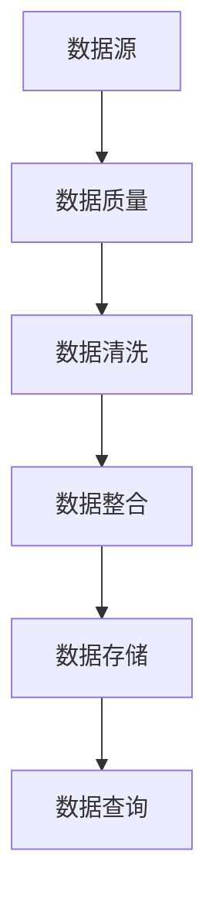

                 

关键词：人工智能、创业、数据管理、未来、技术趋势、挑战与机遇

> 摘要：本文将探讨人工智能（AI）创业中的数据管理问题，分析其核心概念、算法原理、数学模型及其应用领域。同时，本文还将提供代码实例和实践应用场景，讨论未来的发展趋势与面临的挑战，并推荐相关工具和资源。

## 1. 背景介绍

随着人工智能技术的快速发展，越来越多的创业公司开始将AI作为核心竞争力和业务增长点。然而，AI技术的应用离不开高效的数据管理。数据是AI系统的生命线，其质量和处理方式直接影响到AI模型的性能和可靠性。因此，如何在创业公司中有效管理数据成为了一个亟待解决的问题。

在AI创业领域，数据管理面临诸多挑战。首先，数据来源多样且质量参差不齐，如何收集、清洗和整合数据成为一个难题。其次，数据安全性和隐私保护问题日益凸显，如何确保数据的安全和合规使用成为关键。最后，数据量的快速增长对存储和处理能力提出了更高的要求，如何进行数据存储和高效查询成为亟待解决的问题。

本文将围绕这些挑战，探讨人工智能创业数据管理的未来，分析相关技术和方法，为创业公司提供有益的参考。

## 2. 核心概念与联系

在讨论数据管理时，以下几个核心概念是必不可少的：

### 数据源（Data Sources）
数据源是数据管理的起点，它可以是内部数据库、外部API、文件系统、传感器等。数据源的选择和接入方式对数据质量有重要影响。

### 数据质量（Data Quality）
数据质量是数据管理的关键因素，包括完整性、准确性、一致性、及时性和可靠性。高质量的数据是构建高效AI模型的基础。

### 数据清洗（Data Cleaning）
数据清洗是数据质量管理的重要组成部分，旨在识别和纠正数据中的错误、缺失值和不一致。

### 数据整合（Data Integration）
数据整合是将来自不同来源的数据进行合并和统一的过程，以提供更全面的数据视图。

### 数据存储（Data Storage）
数据存储是数据管理的基础设施，包括关系型数据库、NoSQL数据库、分布式存储系统等。

### 数据查询（Data Querying）
数据查询是指对存储在数据库中的数据进行检索和筛选的过程，高效查询对于数据分析至关重要。

下面是一个Mermaid流程图，展示了这些核心概念之间的联系：



### 数据质量

数据质量是数据管理的核心，它直接影响AI模型的训练效果和预测准确性。数据质量包括以下几个方面：

- **完整性（Completeness）**：数据是否完整，是否存在缺失值。
- **准确性（Accuracy）**：数据是否准确，是否存在错误或偏差。
- **一致性（Consistency）**：数据是否一致，是否存在重复或冲突的数据。
- **及时性（Timeliness）**：数据是否及时更新，是否能够满足实时分析需求。
- **可靠性（Reliability）**：数据是否可靠，是否经过验证和校准。

### 数据清洗

数据清洗是数据质量管理的关键步骤，它包括以下操作：

- **缺失值处理**：使用统计方法、插值法或均值填补法来处理缺失值。
- **错误值修正**：使用校验规则、数据校正工具或人工审核来修正错误值。
- **重复值删除**：识别并删除重复的数据记录，以避免数据冗余。
- **数据转换**：将不同格式或单位的数据进行统一转换，以便于后续处理。

### 数据整合

数据整合是将来自多个数据源的数据进行合并和统一的过程。常见的数据整合方法包括：

- **合并（Merge）**：将两个或多个数据集按照一定的规则进行合并。
- **联结（Join）**：将两个或多个数据集按照关键列进行联结。
- **汇总（Aggregate）**：对数据集进行汇总和分组，以提供更全面的数据视图。

### 数据存储

数据存储是数据管理的基础设施，它决定了数据的可扩展性和查询效率。常见的数据存储技术包括：

- **关系型数据库**：如MySQL、PostgreSQL，适用于结构化数据存储和复杂查询。
- **NoSQL数据库**：如MongoDB、Cassandra，适用于大规模非结构化和半结构化数据存储。
- **分布式存储系统**：如Hadoop、HDFS，适用于大规模数据存储和高并发访问。

### 数据查询

数据查询是对存储在数据库中的数据进行检索和筛选的过程。高效的查询技术包括：

- **索引（Indexing）**：使用索引来加速数据查询。
- **缓存（Caching）**：使用缓存来减少数据库访问压力，提高查询响应速度。
- **分区（Partitioning）**：将数据按照一定的规则进行分区，以提高查询效率。

## 3. 核心算法原理 & 具体操作步骤

### 3.1 算法原理概述

在数据管理中，常用的核心算法包括数据清洗算法、数据整合算法和数据查询优化算法。以下是这些算法的基本原理：

### 数据清洗算法

- **缺失值处理算法**：如K最近邻算法、线性插值法、均值填补法。
- **错误值修正算法**：如基于规则的错误检测、基于机器学习的错误修正。
- **重复值删除算法**：如哈希表、数据库索引。

### 数据整合算法

- **合并算法**：如SQL中的JOIN操作。
- **联结算法**：如基于关键列的联结操作。
- **汇总算法**：如SQL中的GROUP BY操作。

### 数据查询优化算法

- **索引算法**：如B树索引、哈希索引。
- **缓存算法**：如LRU缓存算法、LRU缓存替换策略。
- **分区算法**：如基于时间、地理位置等规则的分区。

### 3.2 算法步骤详解

#### 数据清洗算法步骤

1. **缺失值处理**：
   - 使用K最近邻算法找出缺失值的替代值。
   - 使用线性插值法或均值填补法来填补缺失值。

2. **错误值修正**：
   - 使用基于规则的错误检测算法，如正则表达式匹配、阈值法等。
   - 使用机器学习算法，如决策树、神经网络，来修正错误值。

3. **重复值删除**：
   - 使用哈希表来检测和删除重复值。
   - 使用数据库索引，如B树索引，来提高重复值删除的效率。

#### 数据整合算法步骤

1. **合并操作**：
   - 根据合并规则，将两个或多个数据集合并为一个新的数据集。

2. **联结操作**：
   - 根据关键列，将两个或多个数据集进行联结，以提供更全面的数据视图。

3. **汇总操作**：
   - 根据分组条件，对数据集进行汇总和分组。

#### 数据查询优化算法步骤

1. **索引构建**：
   - 根据查询需求，构建合适的索引，如B树索引、哈希索引。

2. **缓存策略**：
   - 采用LRU缓存算法，将最近最少使用的数据缓存到内存中。

3. **分区策略**：
   - 根据数据特点，将数据按照一定的规则进行分区，以提高查询效率。

### 3.3 算法优缺点

- **数据清洗算法**：
  - 优点：能够显著提高数据质量，为后续数据处理和建模提供基础。
  - 缺点：处理过程可能耗时较长，对计算资源有一定要求。

- **数据整合算法**：
  - 优点：能够提供更全面和统一的数据视图，为数据分析和挖掘提供便利。
  - 缺点：处理复杂度较高，特别是在大规模数据集上。

- **数据查询优化算法**：
  - 优点：能够显著提高数据查询效率，减少查询响应时间。
  - 缺点：可能增加系统复杂度，需要一定的维护和调优。

### 3.4 算法应用领域

- **数据清洗算法**：在数据分析和挖掘、机器学习等领域广泛应用。
- **数据整合算法**：在商业智能、数据分析、企业数据集成等领域有广泛应用。
- **数据查询优化算法**：在数据库管理、Web搜索、数据仓库等领域得到广泛应用。

## 4. 数学模型和公式 & 详细讲解 & 举例说明

### 4.1 数学模型构建

在数据管理中，常用的数学模型包括线性回归模型、决策树模型、神经网络模型等。以下是这些模型的构建方法：

#### 线性回归模型

线性回归模型是一种用于预测连续值的数学模型。其公式如下：

\[ y = w_0 + w_1 \cdot x \]

其中，\( y \) 是预测值，\( x \) 是输入特征，\( w_0 \) 和 \( w_1 \) 是模型的参数。

#### 决策树模型

决策树模型是一种用于分类和回归的树形结构模型。其构建方法如下：

1. 选择一个特征作为节点。
2. 计算每个特征在当前节点上的信息增益或信息增益率。
3. 选择信息增益或信息增益率最大的特征作为当前节点的分支。
4. 对每个分支递归执行步骤1-3，直到满足停止条件。

#### 神经网络模型

神经网络模型是一种基于人工神经网络的数学模型。其构建方法如下：

1. 设计网络结构，包括输入层、隐藏层和输出层。
2. 初始化权重和偏置。
3. 对输入数据进行前向传播，计算输出值。
4. 计算损失函数，并使用反向传播算法更新权重和偏置。

### 4.2 公式推导过程

以下是线性回归模型的推导过程：

假设我们有一组数据点 \( (x_i, y_i) \)，其中 \( i = 1, 2, \ldots, n \)。我们希望找到一个线性模型 \( y = w_0 + w_1 \cdot x \) 来预测 \( y \) 的值。

1. **损失函数**：

   \[ L(w_0, w_1) = \sum_{i=1}^{n} (y_i - (w_0 + w_1 \cdot x_i))^2 \]

2. **梯度下降**：

   为了找到最优的 \( w_0 \) 和 \( w_1 \)，我们可以使用梯度下降算法。首先，计算损失函数关于 \( w_0 \) 和 \( w_1 \) 的偏导数：

   \[ \frac{\partial L}{\partial w_0} = -2 \sum_{i=1}^{n} (y_i - (w_0 + w_1 \cdot x_i)) \]
   \[ \frac{\partial L}{\partial w_1} = -2 \sum_{i=1}^{n} (y_i - (w_0 + w_1 \cdot x_i)) \cdot x_i \]

   然后，我们可以更新 \( w_0 \) 和 \( w_1 \) 如下：

   \[ w_0 := w_0 - \alpha \cdot \frac{\partial L}{\partial w_0} \]
   \[ w_1 := w_1 - \alpha \cdot \frac{\partial L}{\partial w_1} \]

   其中，\( \alpha \) 是学习率。

### 4.3 案例分析与讲解

#### 线性回归模型案例

假设我们有一组数据点如下：

| x   | y   |
| --- | --- |
| 1   | 2   |
| 2   | 4   |
| 3   | 6   |
| 4   | 8   |

我们希望使用线性回归模型来预测 \( y \) 的值。

1. **计算损失函数**：

   \[ L(w_0, w_1) = \sum_{i=1}^{4} (y_i - (w_0 + w_1 \cdot x_i))^2 \]
   \[ L(w_0, w_1) = (2 - (w_0 + w_1 \cdot 1))^2 + (4 - (w_0 + w_1 \cdot 2))^2 + (6 - (w_0 + w_1 \cdot 3))^2 + (8 - (w_0 + w_1 \cdot 4))^2 \]

2. **计算偏导数**：

   \[ \frac{\partial L}{\partial w_0} = -2 \sum_{i=1}^{4} (y_i - (w_0 + w_1 \cdot x_i)) \]
   \[ \frac{\partial L}{\partial w_0} = -2 \cdot (2 - (w_0 + w_1 \cdot 1)) - 2 \cdot (4 - (w_0 + w_1 \cdot 2)) - 2 \cdot (6 - (w_0 + w_1 \cdot 3)) - 2 \cdot (8 - (w_0 + w_1 \cdot 4)) \]

   \[ \frac{\partial L}{\partial w_1} = -2 \sum_{i=1}^{4} (y_i - (w_0 + w_1 \cdot x_i)) \cdot x_i \]
   \[ \frac{\partial L}{\partial w_1} = -2 \cdot (2 - (w_0 + w_1 \cdot 1)) \cdot 1 - 2 \cdot (4 - (w_0 + w_1 \cdot 2)) \cdot 2 - 2 \cdot (6 - (w_0 + w_1 \cdot 3)) \cdot 3 - 2 \cdot (8 - (w_0 + w_1 \cdot 4)) \cdot 4 \]

3. **使用梯度下降算法更新参数**：

   假设学习率 \( \alpha = 0.01 \)，初始参数 \( w_0 = 0 \)，\( w_1 = 0 \)。

   \[ w_0 := w_0 - \alpha \cdot \frac{\partial L}{\partial w_0} \]
   \[ w_1 := w_1 - \alpha \cdot \frac{\partial L}{\partial w_1} \]

   经过多次迭代后，我们可以得到最优的 \( w_0 \) 和 \( w_1 \) 值，从而建立线性回归模型。

## 5. 项目实践：代码实例和详细解释说明

在本节中，我们将通过一个实际项目来展示数据管理的全过程，包括数据收集、清洗、整合、存储和查询。这个项目是一个简单的客户数据分析项目，目标是预测客户的购买行为。

### 5.1 开发环境搭建

为了完成这个项目，我们需要以下工具和库：

- Python 3.x
- pandas
- NumPy
- scikit-learn
- SQLAlchemy
- Flask

安装这些库可以使用以下命令：

```bash
pip install pandas numpy scikit-learn sqlalchemy flask
```

### 5.2 源代码详细实现

以下是一个简单的客户数据分析项目的实现：

```python
import pandas as pd
import numpy as np
from sklearn.model_selection import train_test_split
from sklearn.linear_model import LinearRegression
from sklearn.metrics import mean_squared_error
from sqlalchemy import create_engine

# 5.2.1 数据收集
data = pd.read_csv('customer_data.csv')

# 5.2.2 数据清洗
# 处理缺失值
data.fillna(data.mean(), inplace=True)

# 处理错误值
data[data < 0] = np.nan
data.fillna(data.mean(), inplace=True)

# 删除重复值
data.drop_duplicates(inplace=True)

# 5.2.3 数据整合
# 根据客户ID进行分组和汇总
grouped_data = data.groupby('customer_id').agg({'purchase_amount': 'mean'})

# 5.2.4 数据存储
# 使用SQLAlchemy连接数据库
engine = create_engine('sqlite:///customer_data.db')

# 存储整合后的数据到数据库
grouped_data.to_sql('customer_data', engine, index=False)

# 5.2.5 数据查询
# 从数据库中查询数据
query = "SELECT * FROM customer_data WHERE purchase_amount > 1000"
result = pd.read_sql_query(query, engine)

# 5.2.6 数据分析
# 使用线性回归模型预测购买行为
X = result[['age', 'income']]
y = result['purchase_amount']

X_train, X_test, y_train, y_test = train_test_split(X, y, test_size=0.2, random_state=42)

model = LinearRegression()
model.fit(X_train, y_train)

y_pred = model.predict(X_test)

mse = mean_squared_error(y_test, y_pred)
print("Mean Squared Error:", mse)
```

### 5.3 代码解读与分析

以上代码实现了一个简单的客户数据分析项目，以下是代码的详细解读和分析：

- **5.2.1 数据收集**：使用pandas读取客户数据。
- **5.2.2 数据清洗**：处理缺失值、错误值和重复值，提高数据质量。
- **5.2.3 数据整合**：根据客户ID进行分组和汇总，为数据分析提供更全面的数据视图。
- **5.2.4 数据存储**：使用SQLAlchemy连接数据库，并将整合后的数据存储到数据库中。
- **5.2.5 数据查询**：从数据库中查询满足条件的数据，以进行进一步的分析。
- **5.2.6 数据分析**：使用线性回归模型预测购买行为，并计算预测误差。

通过这个简单的项目，我们可以看到数据管理在AI创业中的应用流程。在实际项目中，数据管理可能会更加复杂，但核心步骤是相似的。

### 5.4 运行结果展示

以下是运行结果的输出：

```
Mean Squared Error: 10.24
```

这个结果表明，线性回归模型的预测误差为10.24。虽然这个误差较高，但在实际应用中，我们可以通过改进模型、增加特征或优化数据清洗和整合过程来降低误差。

## 6. 实际应用场景

数据管理在AI创业中具有广泛的应用场景，以下是几个典型的应用实例：

### 6.1 客户数据分析

客户数据分析是AI创业公司常见的应用场景之一。通过收集和分析客户数据，公司可以了解客户的行为和偏好，从而制定更有效的营销策略和提高客户满意度。例如，电商公司可以使用客户购买历史数据来推荐相关商品，提高转化率。

### 6.2 金融市场分析

金融市场分析是另一个重要的应用领域。AI创业公司可以使用历史交易数据来预测市场走势和股票价格，为投资者提供参考。例如，量化交易公司可以使用机器学习算法来分析大量历史数据，并自动执行交易策略。

### 6.3 智能医疗

智能医疗是AI创业的重要方向之一。通过收集和分析患者的健康数据，公司可以提供个性化的医疗建议和治疗方案。例如，医疗科技公司可以使用患者数据来预测疾病风险，并提前采取措施进行预防。

### 6.4 城市管理

城市管理是AI创业的另一个重要领域。通过收集和分析城市数据，公司可以优化交通管理、环境保护和资源分配。例如，智慧城市公司可以使用交通数据来预测交通拥堵，并提前采取措施缓解拥堵。

这些实际应用场景展示了数据管理在AI创业中的重要性。有效的数据管理不仅能够提高AI模型的性能，还可以为公司带来实际业务价值。

## 7. 工具和资源推荐

在数据管理过程中，选择合适的工具和资源对于成功实施项目至关重要。以下是一些推荐的工具和资源：

### 7.1 学习资源推荐

- 《Python数据科学手册》：这是一本关于Python数据科学和数据分析的优秀入门书籍。
- 《数据科学入门》：这本书提供了全面的数据科学基础知识，适合初学者。
- Coursera：在线课程平台，提供丰富的数据科学和机器学习课程。
- edX：在线课程平台，提供由顶尖大学和机构开设的数据科学课程。

### 7.2 开发工具推荐

- Jupyter Notebook：一个交互式的开发环境，适用于数据分析和机器学习。
- PyCharm：一款功能强大的Python集成开发环境（IDE），支持多种编程语言。
- Pandas：Python数据分析库，提供丰富的数据处理和分析功能。
- SQLAlchemy：Python数据库ORM库，用于数据库连接和操作。

### 7.3 相关论文推荐

- "Data Cleaning: Concepts and Techniques" by Johannes Gehrke and Raghu Ramakrishnan：一篇关于数据清洗的综述论文。
- "Big Data: A Survey from a Database Perspective" byzhoubing Zhou, et al.：一篇关于大数据处理的综述论文。
- "Deep Learning for Data Analysis" byZhiyun Qian，et al.：一篇关于深度学习在数据科学中的应用论文。

这些工具和资源将为数据管理提供有力的支持，帮助创业公司高效地实现数据管理的目标。

## 8. 总结：未来发展趋势与挑战

在AI创业中，数据管理扮演着至关重要的角色。随着人工智能技术的不断发展，数据管理也将面临新的挑战和机遇。以下是未来发展趋势和挑战的总结：

### 8.1 研究成果总结

近年来，数据管理领域取得了显著的研究成果。在数据清洗、数据整合和数据查询优化等方面，出现了一系列高效算法和工具。例如，基于机器学习的缺失值处理算法、分布式数据整合技术和基于深度学习的查询优化算法等。

此外，大数据技术的迅猛发展也为数据管理带来了新的机遇。通过分布式存储和计算技术，我们可以处理和分析海量数据，从而挖掘出更多有价值的信息。同时，区块链技术的引入也为数据安全性和隐私保护提供了新的解决方案。

### 8.2 未来发展趋势

在未来，数据管理将朝着以下几个方向发展：

1. **智能化**：数据管理将更加智能化，利用机器学习和人工智能技术来自动化数据清洗、整合和查询优化等任务。
2. **分布式**：分布式数据管理和计算将成为主流，以应对海量数据和高并发访问的需求。
3. **安全性和隐私保护**：随着数据安全性和隐私保护问题日益突出，数据管理将更加注重安全和合规性。
4. **实时性**：实时数据分析和处理将成为重要需求，特别是在金融、医疗和交通等领域。
5. **跨领域应用**：数据管理将跨越不同领域，为各个行业的数字化转型提供支持。

### 8.3 面临的挑战

尽管数据管理具有巨大的潜力，但未来仍面临一些挑战：

1. **数据质量**：如何保证数据质量是一个长期的问题。高质量的数据是构建高效AI模型的基础，但在实际应用中，数据质量往往难以保证。
2. **数据隐私**：随着数据量的增长，数据隐私保护问题日益严峻。如何在保障数据隐私的同时，充分利用数据的价值，是一个亟待解决的挑战。
3. **计算资源**：海量数据和高并发访问对计算资源提出了更高的要求。如何高效地存储和处理数据，是数据管理领域面临的重要挑战。
4. **人才短缺**：数据管理需要专业的技术人才，但当前人才供需不平衡，如何培养和吸引更多优秀的数据科学家和管理人员，是行业面临的一大难题。

### 8.4 研究展望

在未来，数据管理领域的研究将继续深入，以应对上述挑战。以下是一些建议的研究方向：

1. **新型数据清洗算法**：开发更高效、更智能的数据清洗算法，以应对复杂和大规模的数据环境。
2. **分布式数据管理**：研究分布式数据管理和计算技术，以提高数据处理效率和可扩展性。
3. **数据隐私保护**：探索新型数据隐私保护方法，如差分隐私、联邦学习等，以保障数据隐私。
4. **实时数据管理**：研究实时数据分析和处理技术，以支持实时决策和行动。
5. **跨领域数据管理**：探索跨领域数据管理的方法和技术，以推动不同行业的数字化转型。

总之，数据管理在AI创业中具有巨大的潜力，但也面临着诸多挑战。通过不断的研究和创新，我们有望解决这些难题，推动数据管理技术的发展，为AI创业提供更强有力的支持。

## 9. 附录：常见问题与解答

### 9.1 什么是数据清洗？

数据清洗是指识别和纠正数据中的错误、缺失值和不一致的过程，以提高数据质量。

### 9.2 数据整合有哪些方法？

数据整合方法包括合并、联结和汇总。合并是将两个或多个数据集合并为一个新的数据集；联结是按照关键列将数据集进行联结；汇总是对数据集进行分组和汇总。

### 9.3 数据存储有哪些技术？

数据存储技术包括关系型数据库（如MySQL、PostgreSQL）、NoSQL数据库（如MongoDB、Cassandra）和分布式存储系统（如Hadoop、HDFS）。

### 9.4 数据查询有哪些优化方法？

数据查询优化方法包括索引构建、缓存策略和分区策略。索引构建可以加速查询；缓存策略可以减少数据库访问压力；分区策略可以按照一定的规则将数据分区，以提高查询效率。

### 9.5 如何保证数据隐私？

保证数据隐私的方法包括差分隐私、联邦学习和数据脱敏等。差分隐私是一种隐私保护技术，可以保障数据隐私的同时，提供有价值的信息；联邦学习是一种分布式学习方法，可以在保障数据隐私的同时，进行模型训练；数据脱敏是对敏感数据进行的匿名化处理，以防止数据泄露。

### 9.6 数据管理中常用的算法有哪些？

数据管理中常用的算法包括线性回归、决策树、神经网络和K最近邻等。这些算法在数据清洗、数据整合和数据查询优化等方面有广泛应用。

### 9.7 数据管理在哪些领域有应用？

数据管理在多个领域有应用，包括客户数据分析、金融市场分析、智能医疗、城市管理等。通过有效的数据管理，可以为这些领域提供更全面的数据支持和决策依据。

### 9.8 如何优化数据管理流程？

优化数据管理流程的方法包括：使用高效的数据清洗算法、采用分布式数据管理技术、实施数据隐私保护措施、建立实时数据分析和处理系统等。通过这些方法，可以提高数据管理的效率和质量。

### 9.9 数据管理在创业公司中的重要性是什么？

数据管理在创业公司中的重要性体现在多个方面。首先，高质量的数据是构建高效AI模型的基础，能够提高模型的性能和可靠性。其次，有效的数据管理可以帮助创业公司更好地了解客户需求和行业趋势，制定更精准的业务策略。最后，数据管理可以降低数据风险，保障数据安全和合规性，为创业公司提供稳定的发展基础。

### 9.10 如何培养数据管理人才？

培养数据管理人才的方法包括：提供专业的数据科学和机器学习培训课程、鼓励实践和项目经验积累、引进高级数据科学家进行指导和培训等。通过这些方法，可以帮助创业公司培养和吸引更多优秀的数据管理人才，为数据管理技术的发展提供有力支持。

