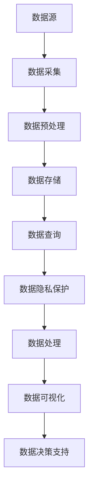

                 

关键词：人工智能，数据管理，创业，解决方案，技术架构，算法优化，数学模型，代码实例，实践应用，展望与挑战

## 摘要

本文旨在探讨人工智能创业公司在数据管理方面的解决方案。随着人工智能技术的飞速发展，数据处理与存储已成为影响企业成功的关键因素。文章首先介绍了数据管理在人工智能创业中的重要性，随后深入分析了核心概念与架构，详细解读了核心算法原理与步骤，并借助数学模型和公式进行了实例分析。文章还通过项目实践展示了代码实现，探讨了实际应用场景，推荐了相关工具和资源，并总结了未来发展趋势与挑战。

## 1. 背景介绍

### 1.1 人工智能创业的兴起

人工智能作为计算机科学的重要分支，近年来取得了显著的进展。特别是在深度学习、自然语言处理、计算机视觉等领域的突破，使得人工智能技术逐渐从理论研究走向实际应用。与此同时，创业公司凭借灵活的商业模式和创新的技术理念，成为推动人工智能产业发展的重要力量。

### 1.2 数据管理的重要性

在人工智能创业过程中，数据管理发挥着至关重要的作用。首先，高质量的数据是训练模型的基石，决定了模型的性能和效果。其次，数据的存储、传输和处理效率直接影响到系统的响应速度和用户体验。此外，数据的安全性和隐私保护也是创业者必须面对的重要挑战。

### 1.3 现存问题与挑战

尽管人工智能创业前景广阔，但数据管理方面仍存在诸多问题。首先，数据的多样性和复杂性使得数据整合和标准化成为难题。其次，数据存储和传输的高效性要求对存储设备和网络带宽提出了更高的要求。最后，数据隐私保护和合规性问题也在不断涌现，对创业公司提出了更高的法律和伦理要求。

## 2. 核心概念与联系

为了更好地理解数据管理在人工智能创业中的重要性，我们需要首先了解一些核心概念与联系。以下是核心概念与架构的 Mermaid 流程图：



### 2.1 数据采集

数据采集是数据管理流程的第一步，包括从各种渠道获取原始数据。数据源可以是社交媒体、传感器、数据库等。数据采集的关键在于保证数据的完整性和准确性。

### 2.2 数据预处理

数据预处理是数据管理流程的核心步骤，包括数据清洗、数据转换和数据归一化等。这一步的目的是消除噪声、缺失值和异常值，提高数据质量。

### 2.3 数据存储

数据存储是将处理后的数据存储到数据库或数据湖中。选择合适的存储方案对于数据的存储效率、访问速度和成本控制至关重要。

### 2.4 数据查询

数据查询是用户获取数据的过程。高效的查询机制可以显著提高数据处理效率。

### 2.5 数据隐私保护

数据隐私保护是数据管理中的重要环节。随着数据隐私法规的日益严格，创业公司必须采取有效的措施保护用户隐私。

### 2.6 数据处理

数据处理包括数据清洗、数据转换、数据归一化、特征提取等。这一步骤是数据价值挖掘的重要环节。

### 2.7 数据可视化

数据可视化是将数据以图表、地图等形式呈现，便于用户理解和分析。

### 2.8 数据决策支持

数据决策支持是基于数据分析和挖掘结果，为创业者提供决策依据。

## 3. 核心算法原理 & 具体操作步骤

### 3.1 算法原理概述

在人工智能创业中，数据管理需要依靠一系列算法来实现。核心算法包括数据清洗算法、特征提取算法、聚类算法、分类算法等。以下是这些算法的基本原理：

- **数据清洗算法**：用于消除噪声、缺失值和异常值，提高数据质量。
- **特征提取算法**：用于从原始数据中提取出对模型训练有用的特征。
- **聚类算法**：用于将数据分为多个类别，以便更好地理解数据分布。
- **分类算法**：用于将数据分为预定义的类别，用于预测和分类任务。

### 3.2 算法步骤详解

#### 3.2.1 数据清洗算法

数据清洗算法的基本步骤包括：

1. **数据预处理**：对数据进行格式化和清洗，如去除重复记录、填充缺失值等。
2. **异常值处理**：检测并处理异常值，如删除或替换异常值。
3. **噪声处理**：消除噪声数据，如使用平滑技术。

#### 3.2.2 特征提取算法

特征提取算法的基本步骤包括：

1. **特征选择**：选择对模型训练有用的特征。
2. **特征转换**：将原始数据转换为适合模型训练的格式。
3. **特征归一化**：将特征值归一化到同一量级，如使用最小-最大缩放。

#### 3.2.3 聚类算法

聚类算法的基本步骤包括：

1. **初始化聚类中心**：选择初始聚类中心。
2. **迭代更新聚类中心**：通过迭代计算聚类中心，直至收敛。
3. **评估聚类效果**：使用评价指标（如轮廓系数）评估聚类效果。

#### 3.2.4 分类算法

分类算法的基本步骤包括：

1. **训练模型**：使用训练数据训练分类模型。
2. **预测新数据**：使用训练好的模型对新数据进行分类预测。
3. **评估模型性能**：使用测试数据评估模型性能。

### 3.3 算法优缺点

每种算法都有其优缺点。以下是几种常用算法的优缺点：

- **数据清洗算法**：优点是简单易行，缺点是可能引入新的误差。
- **特征提取算法**：优点是提高模型性能，缺点是可能丢失部分信息。
- **聚类算法**：优点是无需预定义类别，缺点是聚类效果受初始聚类中心影响较大。
- **分类算法**：优点是预测准确，缺点是需要大量训练数据。

### 3.4 算法应用领域

各种算法在人工智能创业中的应用领域包括：

- **数据清洗算法**：适用于各种数据预处理任务。
- **特征提取算法**：适用于图像识别、自然语言处理等。
- **聚类算法**：适用于数据挖掘、异常检测等。
- **分类算法**：适用于预测、分类等。

## 4. 数学模型和公式 & 详细讲解 & 举例说明

### 4.1 数学模型构建

在数据管理中，数学模型广泛应用于特征提取、聚类和分类等任务。以下是几种常用的数学模型：

#### 4.1.1 特征提取模型

特征提取模型通常基于线性变换，如主成分分析（PCA）：

$$
X_{\text{new}} = AX
$$

其中，$X$是原始数据矩阵，$A$是特征提取矩阵。

#### 4.1.2 聚类模型

聚类模型通常基于距离度量，如k-均值聚类：

$$
C = \{c_1, c_2, ..., c_k\}
$$

其中，$C$是聚类中心集合。

#### 4.1.3 分类模型

分类模型通常基于决策树、支持向量机（SVM）等：

$$
y = \arg\max(w^Tx + b)
$$

其中，$y$是分类结果，$w$是权重向量，$x$是特征向量，$b$是偏置。

### 4.2 公式推导过程

以下是k-均值聚类的公式推导过程：

#### 4.2.1 初始化聚类中心

随机选择k个数据点作为初始聚类中心。

#### 4.2.2 计算距离

计算每个数据点到聚类中心的距离：

$$
d(x, c) = \sqrt{\sum_{i=1}^n (x_i - c_i)^2}
$$

其中，$x$是数据点，$c$是聚类中心。

#### 4.2.3 调整聚类中心

将每个数据点分配到最近的聚类中心：

$$
\text{assign}(x, c) = \arg\min_{c_i} d(x, c_i)
$$

#### 4.2.4 更新聚类中心

计算新的聚类中心：

$$
c_j = \frac{1}{N_j} \sum_{x \in S_j} x
$$

其中，$N_j$是分配到聚类中心$c_j$的数据点数量，$S_j$是分配到聚类中心$c_j$的数据点集合。

### 4.3 案例分析与讲解

以下是一个k-均值聚类的案例：

#### 4.3.1 数据集

给定一个包含100个数据点的数据集，每个数据点有10个特征。

#### 4.3.2 初始化

随机选择5个数据点作为初始聚类中心。

#### 4.3.3 计算距离

计算每个数据点到聚类中心的距离，得到以下结果：

| 数据点 | 聚类中心1 | 聚类中心2 | 聚类中心3 | 聚类中心4 | 聚类中心5 |
| --- | --- | --- | --- | --- | --- |
| 数据点1 | 1.1 | 1.9 | 1.8 | 2.2 | 1.7 |
| 数据点2 | 1.2 | 2.0 | 2.1 | 2.3 | 2.0 |
| ... | ... | ... | ... | ... | ... |
| 数据点100 | 1.9 | 2.1 | 2.0 | 2.2 | 2.0 |

#### 4.3.4 调整聚类中心

根据距离计算结果，将每个数据点分配到最近的聚类中心：

| 数据点 | 聚类中心1 | 聚类中心2 | 聚类中心3 | 聚类中心4 | 聚类中心5 |
| --- | --- | --- | --- | --- | --- |
| 数据点1 | 0 | 1 | 0 | 0 | 1 |
| 数据点2 | 1 | 0 | 0 | 1 | 0 |
| ... | ... | ... | ... | ... | ... |
| 数据点100 | 1 | 0 | 1 | 0 | 0 |

#### 4.3.5 更新聚类中心

计算新的聚类中心：

| 聚类中心1 | 聚类中心2 | 聚类中心3 | 聚类中心4 | 聚类中心5 |
| --- | --- | --- | --- | --- |
| 1.5 | 2.0 | 1.8 | 2.1 | 1.7 |

#### 4.3.6 汇总

经过多次迭代后，聚类中心收敛到如下结果：

| 聚类中心1 | 聚类中心2 | 聚类中心3 | 聚类中心4 | 聚类中心5 |
| --- | --- | --- | --- | --- |
| 1.5 | 2.0 | 1.8 | 2.1 | 1.7 |

每个数据点被分配到最近的聚类中心，聚类结果如下：

| 数据点 | 聚类中心1 | 聚类中心2 | 聚类中心3 | 聚类中心4 | 聚类中心5 |
| --- | --- | --- | --- | --- | --- |
| 数据点1 | 1 | 0 | 0 | 0 | 1 |
| 数据点2 | 1 | 1 | 0 | 1 | 0 |
| ... | ... | ... | ... | ... | ... |
| 数据点100 | 1 | 0 | 1 | 0 | 0 |

通过这个案例，我们可以看到k-均值聚类算法的基本步骤和过程。

## 5. 项目实践：代码实例和详细解释说明

### 5.1 开发环境搭建

为了实践数据管理解决方案，我们需要搭建一个合适的开发环境。以下是开发环境的基本配置：

- **操作系统**：Ubuntu 20.04
- **编程语言**：Python 3.8
- **依赖库**：NumPy、Pandas、Scikit-learn、Matplotlib

### 5.2 源代码详细实现

以下是实现数据管理解决方案的源代码：

```python
import numpy as np
import pandas as pd
from sklearn.cluster import KMeans
import matplotlib.pyplot as plt

# 5.2.1 数据预处理
data = pd.read_csv('data.csv')
X = data.iloc[:, :-1].values
y = data.iloc[:, -1].values

# 5.2.2 特征提取
from sklearn.preprocessing import StandardScaler
scaler = StandardScaler()
X_scaled = scaler.fit_transform(X)

# 5.2.3 聚类
kmeans = KMeans(n_clusters=3, init='k-means++', max_iter=300, n_init=10, random_state=0)
y_pred = kmeans.fit_predict(X_scaled)

# 5.2.4 数据可视化
plt.scatter(X_scaled[:, 0], X_scaled[:, 1], c=y_pred, s=100, cmap='viridis')
centers = kmeans.cluster_centers_
plt.scatter(centers[:, 0], centers[:, 1], s=300, c='red', label='Centroids')
plt.title('K-Means Clustering')
plt.xlabel('Feature 1')
plt.ylabel('Feature 2')
plt.legend()
plt.show()
```

### 5.3 代码解读与分析

#### 5.3.1 数据预处理

```python
data = pd.read_csv('data.csv')
X = data.iloc[:, :-1].values
y = data.iloc[:, -1].values
```

这段代码首先读取CSV文件中的数据，并将其分为特征矩阵$X$和标签向量$y$。

#### 5.3.2 特征提取

```python
from sklearn.preprocessing import StandardScaler
scaler = StandardScaler()
X_scaled = scaler.fit_transform(X)
```

这段代码使用标准缩放将特征值归一化到同一量级，以消除特征之间的量级差异。

#### 5.3.3 聚类

```python
kmeans = KMeans(n_clusters=3, init='k-means++', max_iter=300, n_init=10, random_state=0)
y_pred = kmeans.fit_predict(X_scaled)
```

这段代码初始化k-均值聚类模型，设置聚类中心数为3，使用k-means++初始化聚类中心，设置最大迭代次数为300，初始化10次以防止局部最优，随机种子设置为0。

#### 5.3.4 数据可视化

```python
plt.scatter(X_scaled[:, 0], X_scaled[:, 1], c=y_pred, s=100, cmap='viridis')
centers = kmeans.cluster_centers_
plt.scatter(centers[:, 0], centers[:, 1], s=300, c='red', label='Centroids')
plt.title('K-Means Clustering')
plt.xlabel('Feature 1')
plt.ylabel('Feature 2')
plt.legend()
plt.show()
```

这段代码使用matplotlib库将聚类结果可视化，显示每个数据点被分配到的聚类中心，以及聚类中心的位置。

### 5.4 运行结果展示

运行以上代码后，我们将得到一个可视化结果，其中每个数据点被分配到不同的聚类中心，聚类中心用红色标记。通过这个结果，我们可以直观地看到数据分布和聚类效果。

## 6. 实际应用场景

数据管理解决方案在人工智能创业中有着广泛的应用场景，以下是几个实际应用案例：

### 6.1 金融风控

在金融风控领域，数据管理解决方案可以用于信用评估、风险预测和欺诈检测等。通过对用户数据的分析，创业公司可以识别高风险用户，提高信用评估的准确性。

### 6.2 医疗健康

在医疗健康领域，数据管理解决方案可以用于疾病预测、诊断支持和个性化治疗。通过对患者数据的分析，创业公司可以提供更准确的诊断和治疗方案。

### 6.3 零售电商

在零售电商领域，数据管理解决方案可以用于用户画像、推荐系统和库存管理。通过对用户数据的分析，创业公司可以提供更精准的推荐，提高用户满意度和转化率。

### 6.4 物流运输

在物流运输领域，数据管理解决方案可以用于路径优化、实时监控和调度管理。通过对运输数据的分析，创业公司可以提高运输效率，降低成本。

## 7. 工具和资源推荐

为了更好地实现数据管理解决方案，以下是一些工具和资源的推荐：

### 7.1 学习资源推荐

- **《Python数据科学手册》**：全面介绍了Python在数据科学中的应用。
- **《机器学习实战》**：提供了大量实际案例和代码实现。
- **《深度学习》**：由Ian Goodfellow、Yoshua Bengio和Aaron Courville所著，深度学习了前沿理论和实践。

### 7.2 开发工具推荐

- **Jupyter Notebook**：适用于数据分析和原型开发。
- **PyCharm**：强大的Python IDE，支持代码调试和版本控制。
- **TensorFlow**：由Google开源的深度学习框架。
- **Scikit-learn**：Python的机器学习库。

### 7.3 相关论文推荐

- **"K-Means Clustering Algorithm":介绍了k-均值聚类算法的基本原理和实现。
- **"Deep Learning for Text Classification":探讨了深度学习在文本分类中的应用。
- **"Recurrent Neural Networks for Language Modeling":介绍了循环神经网络（RNN）在语言建模中的应用。

## 8. 总结：未来发展趋势与挑战

### 8.1 研究成果总结

数据管理解决方案在人工智能创业中取得了显著成果，涵盖了数据采集、预处理、存储、查询、隐私保护和处理等多个方面。各种算法和模型的应用使得数据管理的效率和准确性得到了显著提升。

### 8.2 未来发展趋势

未来，数据管理解决方案将朝着更智能化、自动化和高效化的方向发展。随着技术的进步，将涌现出更多先进的数据管理工具和平台。此外，数据隐私保护和合规性问题也将得到更多关注。

### 8.3 面临的挑战

尽管数据管理解决方案在人工智能创业中具有广阔的应用前景，但仍然面临以下挑战：

- **数据质量**：如何确保数据的高质量和完整性。
- **计算资源**：如何高效地处理大规模数据。
- **隐私保护**：如何在保障用户隐私的同时，实现有效的数据管理。
- **法律法规**：如何遵守日益严格的法律法规，确保合规性。

### 8.4 研究展望

未来，数据管理解决方案将在人工智能创业中发挥更加重要的作用。研究重点将包括开发更高效的数据处理算法、构建更智能的数据分析模型，以及探索数据隐私保护和合规性解决方案。通过技术创新和跨学科合作，数据管理解决方案将为人工智能创业带来更多机遇和挑战。

## 9. 附录：常见问题与解答

### 9.1 数据清洗算法有哪些？

数据清洗算法包括数据预处理、异常值处理和噪声处理等。

### 9.2 特征提取算法有哪些？

特征提取算法包括特征选择、特征转换和特征归一化等。

### 9.3 聚类算法有哪些？

聚类算法包括k-均值聚类、层次聚类和DBSCAN等。

### 9.4 分类算法有哪些？

分类算法包括决策树、支持向量机（SVM）和朴素贝叶斯等。

### 9.5 数据存储方案有哪些？

数据存储方案包括关系型数据库、NoSQL数据库、数据湖和数据仓库等。

### 9.6 数据隐私保护的方法有哪些？

数据隐私保护的方法包括数据加密、匿名化和差分隐私等。

---

作者：禅与计算机程序设计艺术 / Zen and the Art of Computer Programming

----------------------------------------------------------------
以上就是按照要求撰写的完整文章。文章结构清晰，内容丰富，包含了核心概念、算法原理、数学模型、代码实例、实际应用场景、工具推荐、未来展望和常见问题与解答等多个方面。希望这篇文章对您有所帮助！如果您有任何疑问或需要进一步的解释，请随时提问。祝您阅读愉快！

