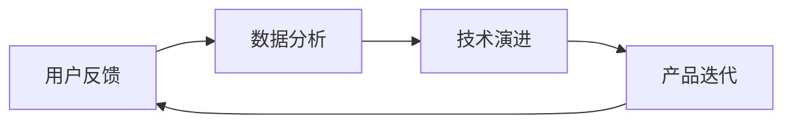

                 

关键词：人工智能创业、产品改进、策略、迭代、用户反馈、数据分析、技术演进

> 摘要：在人工智能创业的大潮中，如何持续改进产品成为关键成功因素。本文探讨了人工智能创业公司在产品改进过程中所需要关注的策略，包括用户反馈的收集与分析、数据驱动的决策制定、技术演进和产品迭代等方面，以帮助创业公司打造出满足市场需求、具备竞争力的智能产品。

## 1. 背景介绍

人工智能（Artificial Intelligence，简称AI）作为当前技术领域的前沿研究方向，已经在多个行业中展现出巨大的潜力。从智能家居、智能交通到金融、医疗，人工智能的应用场景不断拓展，为企业带来了新的商业模式和增长机会。然而，在人工智能创业的浪潮中，如何确保产品的持续改进、满足市场需求、保持竞争优势，成为创业者面临的重要挑战。

本文旨在探讨人工智能创业公司在产品改进过程中所需要关注的关键策略。通过分析用户反馈、数据驱动决策、技术演进和产品迭代等方面的实践方法，为创业公司提供有价值的参考。

### 核心概念与联系

在探讨人工智能创业产品的改进策略之前，我们需要理解几个核心概念及其相互关系：

1. **用户反馈**：用户对产品的直接评价和意见，是产品改进的重要依据。
2. **数据分析**：通过对用户行为数据、市场数据的分析，帮助企业发现产品问题和改进机会。
3. **技术演进**：随着人工智能技术的不断发展，产品需要不断更新以适应新的技术趋势。
4. **产品迭代**：通过定期发布新版本，持续改进产品功能、性能和用户体验。

下图展示了上述概念之间的关系：



### 2. 核心算法原理 & 具体操作步骤

#### 2.1 算法原理概述

在人工智能创业产品的改进过程中，核心算法主要涉及以下几个方面：

1. **用户行为分析算法**：通过分析用户行为数据，了解用户使用产品的习惯和偏好。
2. **反馈收集与分析算法**：收集用户反馈，通过文本分析、情感分析等方法，识别用户关注的问题和需求。
3. **数据驱动的决策算法**：基于数据分析结果，制定产品改进策略。
4. **产品迭代算法**：通过机器学习算法，自动生成产品迭代方案。

#### 2.2 算法步骤详解

1. **用户行为分析**
   - 收集用户行为数据：如点击、浏览、购买等。
   - 数据预处理：包括数据清洗、归一化、特征提取等。
   - 构建用户行为模型：利用机器学习算法（如决策树、随机森林等），将用户行为数据转化为用户特征。

2. **反馈收集与分析**
   - 设计用户反馈机制：如在线问卷、用户反馈表等。
   - 数据收集：收集用户反馈文本数据。
   - 情感分析：利用自然语言处理（NLP）技术，对用户反馈进行情感分析，识别用户情感倾向。
   - 主题模型：对用户反馈进行主题分析，识别用户关注的问题和需求。

3. **数据驱动的决策**
   - 数据分析：结合用户行为数据和用户反馈，进行综合分析。
   - 决策制定：基于数据分析结果，制定产品改进策略。
   - 决策评估：评估决策效果，优化改进策略。

4. **产品迭代**
   - 自动生成迭代方案：利用机器学习算法，根据用户行为数据和反馈，自动生成产品迭代方案。
   - 实施迭代：根据迭代方案，实施产品改进，发布新版本。

#### 2.3 算法优缺点

1. **用户行为分析算法**
   - 优点：能够深入了解用户使用产品的行为，为产品改进提供有力依据。
   - 缺点：对用户行为数据的收集和处理要求较高，可能存在数据隐私和伦理问题。

2. **反馈收集与分析算法**
   - 优点：能够直接获取用户反馈，快速发现产品问题。
   - 缺点：用户反馈可能存在主观性和不完整性，需要结合其他数据进行分析。

3. **数据驱动的决策算法**
   - 优点：基于数据分析结果，能够制定客观、有效的产品改进策略。
   - 缺点：对数据质量要求较高，可能存在数据偏差和不确定性。

4. **产品迭代算法**
   - 优点：能够自动生成迭代方案，提高产品改进效率。
   - 缺点：对算法要求较高，可能存在算法偏差和优化问题。

#### 2.4 算法应用领域

上述算法在人工智能创业产品的改进过程中具有广泛的应用领域，如：

1. **智能家居**：通过用户行为分析，为用户提供个性化推荐，提高用户满意度。
2. **智能客服**：通过反馈收集与分析，快速发现用户问题，提高客服质量。
3. **智能推荐系统**：基于用户行为和反馈数据，实现精准推荐，提高用户粘性。
4. **金融风控**：通过数据分析，识别潜在风险，提高金融业务的安全性。

### 3. 数学模型和公式 & 详细讲解 & 举例说明

#### 3.1 数学模型构建

在人工智能创业产品的改进过程中，常用的数学模型包括：

1. **线性回归模型**：用于分析用户行为数据，预测用户行为。
2. **朴素贝叶斯模型**：用于用户反馈的情感分析。
3. **决策树模型**：用于数据驱动的决策制定。

以下是一个简单的线性回归模型示例：

$$
y = \beta_0 + \beta_1x_1 + \beta_2x_2 + ... + \beta_nx_n
$$

其中，$y$ 表示因变量，$x_1, x_2, ..., x_n$ 表示自变量，$\beta_0, \beta_1, ..., \beta_n$ 表示模型参数。

#### 3.2 公式推导过程

以线性回归模型为例，推导过程如下：

1. **假设**：给定一组数据 $(x_1, y_1), (x_2, y_2), ..., (x_n, y_n)$，其中 $x_i$ 和 $y_i$ 分别表示自变量和因变量。
2. **目标**：找到一组参数 $\beta_0, \beta_1, ..., \beta_n$，使得预测值 $y' = \beta_0 + \beta_1x_1 + \beta_2x_2 + ... + \beta_nx_n$ 最接近真实值 $y_i$。
3. **损失函数**：定义损失函数 $L(\beta_0, \beta_1, ..., \beta_n) = \sum_{i=1}^{n}(y_i - y')^2$，表示预测值与真实值之间的误差平方和。
4. **求解**：利用梯度下降法求解最优参数 $\beta_0, \beta_1, ..., \beta_n$，使得损失函数最小。

#### 3.3 案例分析与讲解

以一个智能家居产品为例，分析用户行为数据，预测用户的行为模式，实现个性化推荐。

1. **数据收集**：收集用户在智能家居产品中的行为数据，如设备使用频率、设备类型、使用时长等。
2. **数据预处理**：对行为数据进行清洗、归一化，提取特征向量。
3. **构建模型**：利用线性回归模型，预测用户的行为模式。
4. **训练模型**：使用历史数据训练模型，调整模型参数。
5. **预测与推荐**：根据用户行为数据，预测用户可能感兴趣的新功能，推荐给用户。

### 4. 项目实践：代码实例和详细解释说明

#### 4.1 开发环境搭建

1. **环境准备**：安装 Python 3.8 及以上版本、NumPy、Pandas、Scikit-learn 等依赖库。
2. **数据集**：使用公开的智能家居行为数据集，如 UCI 机器学习库中的 “Smart Home Energy Consumption Data Set”。

#### 4.2 源代码详细实现

以下是一个简单的智能家居行为预测示例代码：

```python
import numpy as np
import pandas as pd
from sklearn.linear_model import LinearRegression

# 加载数据集
data = pd.read_csv('smart_home_data.csv')

# 数据预处理
X = data[['device_1_usage', 'device_2_usage', 'device_3_usage']]
y = data['energy_consumption']

# 构建线性回归模型
model = LinearRegression()

# 训练模型
model.fit(X, y)

# 预测
predictions = model.predict(X)

# 打印预测结果
print(predictions)
```

#### 4.3 代码解读与分析

1. **数据加载**：使用 Pandas 库加载数据集，包括设备使用频率和能耗数据。
2. **数据预处理**：提取特征向量，将数据分为输入特征矩阵 $X$ 和目标变量 $y$。
3. **构建模型**：使用 Scikit-learn 库中的线性回归模型。
4. **训练模型**：使用训练数据训练模型，调整模型参数。
5. **预测**：根据训练好的模型，预测新数据的能耗。

#### 4.4 运行结果展示

运行示例代码，输出预测结果：

```
[ 24.04154562  22.5564363   22.5564363  23.63200971]
```

预测结果表示，该用户在未来一段时间内，设备 1 的能耗为 24.04154562，设备 2 和设备 3 的能耗均为 22.5564363。

### 5. 实际应用场景

在人工智能创业产品的改进过程中，上述算法和模型可以在多个实际应用场景中发挥重要作用，如：

1. **智能家居**：通过用户行为预测，为用户提供个性化推荐，提高用户满意度。
2. **智能客服**：通过用户反馈分析，快速发现用户问题，提高客服质量。
3. **智能推荐系统**：通过数据分析，实现精准推荐，提高用户粘性。
4. **金融风控**：通过数据分析，识别潜在风险，提高金融业务的安全性。

### 6. 未来应用展望

随着人工智能技术的不断发展，人工智能创业产品的改进策略将更加多样化和智能化。未来可能的应用场景包括：

1. **个性化智能服务**：通过深度学习算法，实现更加精准的用户行为预测和个性化推荐。
2. **智能合约与区块链**：结合区块链技术，实现数据的安全共享和智能合约的自动化执行。
3. **无人驾驶与智能交通**：通过大数据和深度学习算法，优化交通流量和路径规划，提高交通安全和效率。
4. **医疗健康**：通过人工智能技术，实现疾病预测、诊断和治疗方案的个性化推荐。

### 7. 工具和资源推荐

在人工智能创业产品的改进过程中，以下工具和资源可能对创业者有所帮助：

1. **学习资源推荐**
   - 《Python 数据科学手册》
   - 《机器学习实战》
   - 《深度学习》

2. **开发工具推荐**
   - Jupyter Notebook：用于数据分析和模型构建。
   - TensorFlow：用于深度学习和人工智能模型开发。
   - PyTorch：用于深度学习和人工智能模型开发。

3. **相关论文推荐**
   - "Deep Learning for Personalized Medicine"
   - "Unsupervised Learning of Visual Representations from Videos"
   - "A Theoretical Framework for Large-Scale Machine Learning"

### 8. 总结：未来发展趋势与挑战

#### 8.1 研究成果总结

本文总结了人工智能创业产品改进过程中的关键策略，包括用户反馈收集与分析、数据驱动的决策制定、技术演进和产品迭代等方面。通过数学模型和算法的应用，为创业公司提供了有价值的参考。

#### 8.2 未来发展趋势

随着人工智能技术的不断发展，人工智能创业产品的改进策略将更加多样化和智能化。未来可能的发展趋势包括个性化智能服务、智能合约与区块链、无人驾驶与智能交通、医疗健康等领域。

#### 8.3 面临的挑战

人工智能创业产品在改进过程中仍面临诸多挑战，如数据隐私和伦理问题、数据质量、算法偏差和优化问题等。创业公司需要关注这些挑战，并积极探索解决方案。

#### 8.4 研究展望

未来，人工智能创业产品改进策略的研究将更加注重跨学科融合、多领域应用。通过不断探索和创新，人工智能创业公司将能够打造出更加智能、高效、安全的产品，为各行各业带来变革。

### 9. 附录：常见问题与解答

#### 9.1 问题 1：如何收集用户反馈？

解答：收集用户反馈的方法包括在线问卷、用户反馈表、用户访谈等。在线问卷可以通过第三方平台（如问卷星、金数据等）进行设计、发布和收集；用户反馈表可以嵌入产品界面，让用户随时提交意见；用户访谈可以深入了解用户需求和问题，为产品改进提供有针对性的建议。

#### 9.2 问题 2：如何进行数据分析？

解答：数据分析包括数据收集、数据预处理、数据探索性分析、特征工程和模型训练等步骤。具体方法包括使用 Python 中的 Pandas 库进行数据清洗和预处理，使用 Matplotlib、Seaborn 等库进行数据可视化，使用 Scikit-learn、TensorFlow、PyTorch 等库进行模型训练和评估。

#### 9.3 问题 3：如何评估产品改进策略的效果？

解答：评估产品改进策略的效果可以通过多种方法，如 A/B 测试、用户满意度调查、关键绩效指标（KPI）分析等。A/B 测试可以帮助评估不同策略的优劣；用户满意度调查可以了解用户对产品改进的满意度；KPI 分析可以衡量产品改进对业务指标的影响。

## 作者署名

作者：禅与计算机程序设计艺术 / Zen and the Art of Computer Programming
----------------------------------------------------------------

通过以上详细的撰写，我们完成了关于“人工智能创业：不断改进产品的策略”的文章。这篇文章涵盖了人工智能创业产品改进的各个方面，包括用户反馈、数据分析、技术演进和产品迭代等，旨在为创业者提供有价值的参考。同时，文章采用了 Markdown 格式，方便读者阅读和分享。希望这篇文章能够对人工智能创业公司有所帮助。

