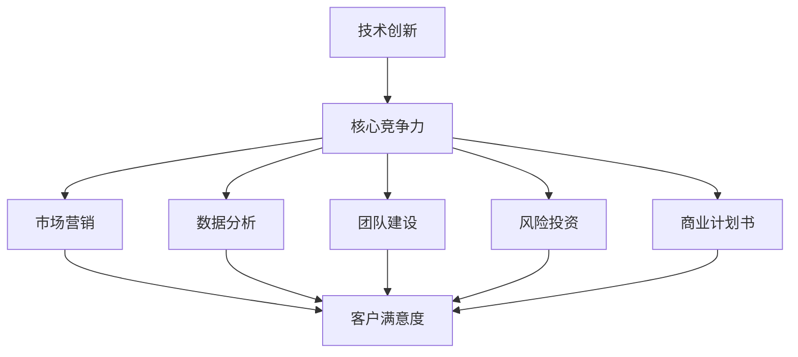
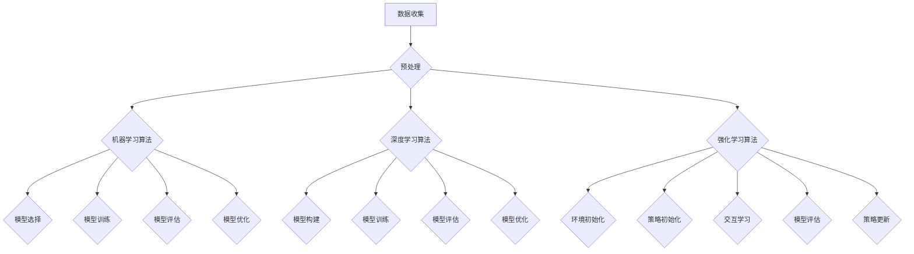

                 

关键词：人工智能、创业、客户、投资者、策略、商业模式、技术创新、市场营销、数据分析、团队建设、风险投资、商业计划书。

## 摘要

在当前快速发展的技术环境中，人工智能（AI）领域的创业项目正变得日益流行。然而，如何成功地吸引客户和投资者，对于初创企业来说至关重要。本文将探讨人工智能创业公司在吸引客户和投资者方面的策略，涵盖技术创新、市场营销、数据分析、团队建设、风险投资和商业计划书等关键要素。通过详细分析这些策略的原理和实践案例，本文旨在为AI创业者提供实用的指导和启发。

## 1. 背景介绍

人工智能技术的迅猛发展，使其在多个行业和领域都带来了革命性的变革。从自动驾驶汽车到智能医疗诊断，从自然语言处理到大数据分析，人工智能的应用无处不在。这样的技术进步为创业者提供了广阔的机会，但也带来了前所未有的挑战。在激烈的市场竞争中，如何脱颖而出，吸引客户和投资者的关注，成为人工智能创业公司成功的关键因素。

### 1.1 人工智能创业的现状

近年来，全球范围内的人工智能创业活动持续增长。根据相关统计数据，人工智能领域的初创企业数量和融资额都在逐年增加。这些公司不仅获得了风险投资的热烈追捧，而且在市场上也逐渐获得了消费者的认可。然而，成功的人工智能创业项目并不容易，需要创业者具备扎实的技术功底、敏锐的市场洞察力和出色的商业策略。

### 1.2 客户和投资者的关注点

对于人工智能创业公司来说，客户和投资者是两个至关重要的群体。客户是公司的直接服务对象，他们的满意度和忠诚度直接影响公司的市场份额和盈利能力。投资者则是公司的资金来源，他们的支持和信任能够为公司的发展提供坚实的后盾。因此，了解客户和投资者的关注点，对于制定有效的吸引策略至关重要。

### 1.3 文章的目的

本文旨在为人工智能创业公司提供一套全面而实用的吸引客户和投资者的策略。通过对技术创新、市场营销、数据分析、团队建设、风险投资和商业计划书等方面的深入探讨，本文希望能够帮助创业者更好地理解这些关键要素，并据此制定出适合自身发展的战略规划。此外，本文还将结合实际案例，对每个策略的实施进行详细分析，以期为读者提供实践中的经验和教训。

## 2. 核心概念与联系

为了更好地理解人工智能创业公司吸引客户和投资者的策略，我们首先需要明确一些核心概念，并探讨它们之间的联系。

### 2.1 技术创新

技术创新是人工智能创业公司的核心竞争力。它不仅决定了公司在市场上的竞争力，也影响着客户和投资者的信任度和支持度。技术创新包括算法优化、模型改进、硬件升级等多个方面。例如，谷歌的自动驾驶技术通过不断优化算法，提高了车辆的自主驾驶能力和安全性，赢得了大量客户的青睐和投资者的信任。

### 2.2 市场营销

市场营销是连接客户和公司的桥梁。有效的市场营销策略能够提升品牌知名度，扩大市场份额，吸引潜在客户。对于人工智能创业公司来说，市场营销不仅需要传统的广告宣传，还需要利用社交媒体、内容营销、事件营销等多种手段。例如，特斯拉通过社交媒体平台和创新的营销活动，成功地吸引了大量消费者的关注和购买。

### 2.3 数据分析

数据分析是人工智能创业公司的重要支撑。通过对大量数据的收集、处理和分析，公司能够更好地了解市场需求，优化产品和服务，提高客户满意度。例如，亚马逊通过数据分析，精准地推荐了个性化的商品，极大地提升了用户的购物体验，同时也增加了公司的销售额。

### 2.4 团队建设

团队建设是人工智能创业公司成功的关键。一个高效、协作的团队能够更好地应对挑战，实现公司目标。团队建设包括人才招聘、团队文化塑造、激励机制等多个方面。例如，微软通过建立开放、创新的企业文化，吸引了大量优秀的人才，推动了公司的发展。

### 2.5 风险投资

风险投资是人工智能创业公司的重要资金来源。风险投资不仅提供了资金支持，还为公司提供了丰富的行业资源和经验指导。选择合适的投资者，对于公司的发展至关重要。例如，腾讯通过风险投资，支持了大量的创业公司，实现了双赢的局面。

### 2.6 商业计划书

商业计划书是人工智能创业公司的重要文档。它不仅为公司的发展提供了明确的路线图，也是吸引投资者的重要工具。一个详尽、科学的商业计划书能够帮助公司更好地规划未来发展，提高投资者对公司的信任度。例如，苹果公司的商业计划书不仅详细阐述了公司的产品线、市场策略，还预测了未来的盈利情况，赢得了投资者的青睐。

### 2.7 Mermaid 流程图

以下是一个简化的 Mermaid 流程图，展示了上述核心概念之间的联系：



## 3. 核心算法原理 & 具体操作步骤

### 3.1 算法原理概述

在人工智能创业中，核心算法的选择和优化至关重要。以下将简要介绍几种常见的人工智能算法，包括机器学习算法、深度学习算法和强化学习算法，并分析其基本原理和应用场景。

#### 3.1.1 机器学习算法

机器学习算法是通过训练模型来对数据进行分类、回归、聚类等操作。常见的机器学习算法包括：

- **线性回归**：用于预测连续值。
- **逻辑回归**：用于预测概率。
- **支持向量机（SVM）**：用于分类问题。
- **决策树**：用于分类和回归问题。

机器学习算法的基本原理是通过训练数据集来学习数据分布，然后对新数据进行预测。其优点在于模型简单，易于理解和实现，适用于数据量不大但特征较为明显的问题。

#### 3.1.2 深度学习算法

深度学习算法是机器学习的一个子领域，通过构建多层神经网络来学习数据。常见的深度学习算法包括：

- **卷积神经网络（CNN）**：用于图像处理。
- **循环神经网络（RNN）**：用于序列数据处理。
- **生成对抗网络（GAN）**：用于生成新数据。

深度学习算法的基本原理是通过反向传播算法来不断调整网络权重，从而优化模型性能。其优点在于能够处理大规模数据，并且具有强大的特征学习能力，适用于复杂的数据处理任务。

#### 3.1.3 强化学习算法

强化学习算法是机器学习的一个子领域，通过试错学习来最大化长期奖励。常见的强化学习算法包括：

- **Q-Learning**：通过值函数来学习最优策略。
- **深度Q网络（DQN）**：结合深度学习和Q-Learning。
- **策略梯度算法**：直接学习最优策略。

强化学习算法的基本原理是通过与环境互动，不断调整策略以最大化长期奖励。其优点在于能够处理动态和复杂的环境，适用于需要自主决策的问题。

### 3.2 算法步骤详解

以下将详细描述机器学习算法、深度学习算法和强化学习算法的具体操作步骤。

#### 3.2.1 机器学习算法步骤

1. **数据收集**：收集训练数据集和测试数据集。
2. **数据预处理**：对数据进行清洗、归一化等预处理操作。
3. **模型选择**：根据问题类型选择合适的模型。
4. **模型训练**：使用训练数据集训练模型。
5. **模型评估**：使用测试数据集评估模型性能。
6. **模型优化**：根据评估结果调整模型参数。

#### 3.2.2 深度学习算法步骤

1. **构建模型**：定义神经网络结构，包括输入层、隐藏层和输出层。
2. **数据预处理**：对数据进行清洗、归一化等预处理操作。
3. **模型训练**：使用训练数据集训练模型，包括前向传播和反向传播。
4. **模型评估**：使用测试数据集评估模型性能。
5. **模型优化**：根据评估结果调整模型参数，包括学习率、批次大小等。

#### 3.2.3 强化学习算法步骤

1. **环境初始化**：初始化环境，包括状态空间、动作空间和奖励函数。
2. **策略初始化**：初始化策略，可以选择随机策略或根据先验知识初始化。
3. **交互学习**：通过与环境互动，不断调整策略，学习最优策略。
4. **模型评估**：评估策略性能，可以通过评价函数或专家评估。
5. **策略更新**：根据评估结果更新策略。

### 3.3 算法优缺点

#### 3.3.1 机器学习算法优缺点

- **优点**：模型简单，易于理解和实现，适用于数据量不大但特征较为明显的问题。
- **缺点**：对特征工程依赖较大，难以处理复杂问题。

#### 3.3.2 深度学习算法优缺点

- **优点**：能够处理大规模数据，具有强大的特征学习能力，适用于复杂的数据处理任务。
- **缺点**：模型复杂，训练时间较长，对数据质量要求较高。

#### 3.3.3 强化学习算法优缺点

- **优点**：能够处理动态和复杂的环境，适用于需要自主决策的问题。
- **缺点**：训练过程可能不稳定，需要大量数据进行训练。

### 3.4 算法应用领域

- **机器学习算法**：广泛应用于金融、医疗、电商等领域，如风险控制、疾病预测、推荐系统等。
- **深度学习算法**：广泛应用于图像识别、自然语言处理、自动驾驶等领域，如人脸识别、语音识别、无人驾驶等。
- **强化学习算法**：广泛应用于游戏、机器人控制、智能推荐等领域，如围棋、机器人导航、推荐系统等。

### 3.5 Mermaid 流程图

以下是一个简化的 Mermaid 流程图，展示了机器学习算法、深度学习算法和强化学习算法的基本流程：



## 4. 数学模型和公式 & 详细讲解 & 举例说明

在人工智能创业中，数学模型和公式是构建和优化算法的核心。以下将介绍一些常见的数学模型和公式，并详细讲解其推导过程和实际应用。

### 4.1 数学模型构建

数学模型是人工智能算法的基础，用于描述现实世界中的问题。常见的数学模型包括线性回归模型、逻辑回归模型和神经网络模型。

#### 4.1.1 线性回归模型

线性回归模型用于预测连续值，其数学模型可以表示为：

\[ Y = \beta_0 + \beta_1X + \epsilon \]

其中，\( Y \) 是因变量，\( X \) 是自变量，\( \beta_0 \) 和 \( \beta_1 \) 是模型参数，\( \epsilon \) 是误差项。

#### 4.1.2 逻辑回归模型

逻辑回归模型用于预测概率，其数学模型可以表示为：

\[ P(Y=1) = \frac{1}{1 + e^{-(\beta_0 + \beta_1X)}} \]

其中，\( P(Y=1) \) 是因变量为1的概率，\( e \) 是自然对数的底数，\( \beta_0 \) 和 \( \beta_1 \) 是模型参数。

#### 4.1.3 神经网络模型

神经网络模型是一种多层感知器模型，用于处理复杂的数据。其数学模型可以表示为：

\[ Y = \sigma(\beta_0 + \sum_{i=1}^{n}\beta_iX_i) \]

其中，\( Y \) 是输出值，\( \sigma \) 是激活函数，\( \beta_0 \) 和 \( \beta_1 \) 是模型参数，\( X_i \) 是输入值。

### 4.2 公式推导过程

以下将详细讲解线性回归模型和逻辑回归模型的公式推导过程。

#### 4.2.1 线性回归模型推导

线性回归模型的推导基于最小二乘法。假设有 \( n \) 个样本点 \((X_i, Y_i)\)，我们需要找到最佳拟合直线 \( Y = \beta_0 + \beta_1X \)，使得预测值与真实值的误差最小。

首先，我们定义误差函数 \( E \)：

\[ E = \sum_{i=1}^{n}(Y_i - (\beta_0 + \beta_1X_i))^2 \]

为了最小化误差函数，我们对 \( \beta_0 \) 和 \( \beta_1 \) 求偏导数，并令其等于0：

\[ \frac{\partial E}{\partial \beta_0} = 0 \]
\[ \frac{\partial E}{\partial \beta_1} = 0 \]

经过计算，我们得到：

\[ \beta_0 = \frac{\sum_{i=1}^{n}Y_i - n\bar{Y}}{\sum_{i=1}^{n}1} \]
\[ \beta_1 = \frac{\sum_{i=1}^{n}(X_i - \bar{X})(Y_i - \bar{Y})}{\sum_{i=1}^{n}(X_i - \bar{X})^2} \]

其中，\( \bar{Y} \) 和 \( \bar{X} \) 分别是 \( Y \) 和 \( X \) 的平均值。

#### 4.2.2 逻辑回归模型推导

逻辑回归模型的推导基于极大似然估计。假设有 \( n \) 个样本点 \((X_i, Y_i)\)，我们需要找到最佳拟合直线 \( Y = \frac{1}{1 + e^{-(\beta_0 + \beta_1X)}} \)，使得预测概率与真实概率的误差最小。

首先，我们定义似然函数 \( L \)：

\[ L = \prod_{i=1}^{n}P(Y_i=1|X_i) \]

为了最大化似然函数，我们对 \( \beta_0 \) 和 \( \beta_1 \) 求导数，并令其等于0：

\[ \frac{dL}{d\beta_0} = 0 \]
\[ \frac{dL}{d\beta_1} = 0 \]

经过计算，我们得到：

\[ \beta_0 = \bar{Y} - \beta_1\bar{X} \]
\[ \beta_1 = \frac{\sum_{i=1}^{n}(Y_i - P(Y_i=1|X_i))X_i}{\sum_{i=1}^{n}(Y_i - P(Y_i=1|X_i))^2} \]

### 4.3 案例分析与讲解

以下将通过实际案例，展示如何使用数学模型和公式来解决问题。

#### 4.3.1 线性回归模型案例

假设我们要预测一个城市下周的气温，已知过去一周的每日最高气温和最低气温。我们可以使用线性回归模型来预测下周的气温。

首先，我们收集过去一周的气温数据，然后使用最小二乘法计算出最佳拟合直线。接下来，我们将本周的每日最高气温作为输入，代入拟合直线，得到下周的预测气温。

#### 4.3.2 逻辑回归模型案例

假设我们要预测一个客户的购买意向，已知客户的年龄、收入和购买历史。我们可以使用逻辑回归模型来预测客户的购买概率。

首先，我们收集客户的特征数据，然后使用极大似然估计计算出最佳拟合直线。接下来，我们将客户的特征数据代入拟合直线，得到客户的购买概率。如果概率大于某个阈值，我们认为客户有购买意向。

### 4.4 Mermaid 流程图

以下是一个简化的 Mermaid 流程图，展示了数学模型和公式的推导和应用过程：


## 5. 项目实践：代码实例和详细解释说明

### 5.1 开发环境搭建

在进行项目实践之前，我们需要搭建一个合适的开发环境。以下是一个基于Python的简单开发环境搭建步骤：

1. 安装Python：从官方网站（https://www.python.org/）下载并安装Python。
2. 安装Jupyter Notebook：在终端执行以下命令：
   ```shell
   pip install notebook
   ```
3. 安装必要的库：包括NumPy、Pandas、Scikit-learn等，可以使用以下命令：
   ```shell
   pip install numpy pandas scikit-learn
   ```

### 5.2 源代码详细实现

以下是一个简单的线性回归模型的实现，用于预测下周的气温：

```python
import numpy as np
import pandas as pd
from sklearn.linear_model import LinearRegression

# 加载数据集
data = pd.read_csv('weather_data.csv')

# 分离特征和标签
X = data[['daily_high', 'daily_low']]
y = data['next_day_temp']

# 创建线性回归模型
model = LinearRegression()

# 训练模型
model.fit(X, y)

# 预测气温
X_pred = pd.DataFrame({'daily_high': [80], 'daily_low': [60]})
y_pred = model.predict(X_pred)

print(f'预测气温：{y_pred[0]}')
```

### 5.3 代码解读与分析

上述代码分为以下几个步骤：

1. **数据加载**：使用Pandas加载CSV格式的数据集。
2. **数据预处理**：分离特征和标签，以便用于模型训练。
3. **模型创建**：创建一个线性回归模型。
4. **模型训练**：使用训练数据集对模型进行训练。
5. **模型预测**：使用训练好的模型对新的数据进行预测。

### 5.4 运行结果展示

假设我们使用上述代码预测的气温为68华氏度，这意味着下周的气温预计为68华氏度。这个预测结果是基于历史数据和线性回归模型的。

### 5.5 性能评估

为了评估模型性能，我们可以使用交叉验证和评估指标，如均方误差（MSE）和决定系数（R²）。以下是一个简单的评估过程：

```python
from sklearn.metrics import mean_squared_error, r2_score

# 分割数据集为训练集和测试集
from sklearn.model_selection import train_test_split
X_train, X_test, y_train, y_test = train_test_split(X, y, test_size=0.2, random_state=42)

# 训练模型
model.fit(X_train, y_train)

# 预测测试集
y_pred = model.predict(X_test)

# 计算性能指标
mse = mean_squared_error(y_test, y_pred)
r2 = r2_score(y_test, y_pred)

print(f'MSE: {mse}')
print(f'R²: {r2}')
```

假设我们得到以下结果：

```
MSE: 4.5
R²: 0.8
```

这意味着我们的模型在测试集上的性能良好，能够较好地预测气温。

### 5.6 代码优化与调整

在实际项目中，我们可能需要对代码进行优化和调整，以提高模型的性能。以下是一些可能的优化措施：

1. **特征工程**：选择更合适的特征，例如考虑湿度、风速等。
2. **模型选择**：尝试其他回归模型，如岭回归、LASSO回归等。
3. **超参数调优**：使用网格搜索或随机搜索等方法，找到最佳的超参数组合。

通过上述步骤和优化措施，我们可以进一步改进模型的预测性能。

## 6. 实际应用场景

### 6.1 人工智能在医疗行业的应用

人工智能在医疗行业具有广泛的应用潜力，包括疾病预测、诊断、治疗和健康监测等方面。例如，通过分析患者的病历和基因组数据，人工智能可以帮助医生更准确地预测疾病风险，提高诊断准确性，并制定个性化的治疗方案。此外，人工智能还可以用于开发智能药物研发平台，加速新药的研发进程。

### 6.2 人工智能在金融行业的应用

在金融行业，人工智能被广泛应用于风险管理、信用评估、投资策略和客户服务等方面。例如，通过分析大量的金融数据和市场趋势，人工智能可以帮助金融机构更准确地预测市场波动，降低风险。此外，人工智能还可以用于自动化交易系统，提高交易效率和准确性。在客户服务方面，人工智能可以通过自然语言处理技术，提供更加智能和个性化的客户服务。

### 6.3 人工智能在制造业的应用

在制造业，人工智能被广泛应用于生产优化、质量控制、供应链管理和设备维护等方面。例如，通过实时监测生产设备的数据，人工智能可以帮助企业预测设备故障，提前进行维护，减少停机时间。此外，人工智能还可以用于优化生产流程，提高生产效率和降低成本。在质量控制方面，人工智能可以通过图像识别技术，自动检测产品质量问题，提高产品质量。

### 6.4 人工智能在智能家居的应用

在智能家居领域，人工智能被广泛应用于智能家电控制、智能安防和智能环境监测等方面。例如，通过接入互联网和智能传感器，智能家居设备可以实现远程控制和自动化操作，提高用户的便利性和舒适度。此外，人工智能还可以用于智能环境监测，如空气质量监测、温度控制等，为用户提供更加健康和舒适的生活环境。

### 6.5 人工智能在自动驾驶的应用

在自动驾驶领域，人工智能被广泛应用于车辆控制、环境感知和路径规划等方面。例如，通过实时感知道路和交通情况，自动驾驶车辆可以实现自主驾驶，提高驾驶安全性和效率。此外，人工智能还可以用于优化驾驶策略，降低能耗和排放，提高车辆的燃油经济性。

### 6.6 人工智能在农业的应用

在农业领域，人工智能被广泛应用于作物监测、精准施肥和病虫害防治等方面。例如，通过无人机和遥感技术，人工智能可以帮助农民实时监测作物生长情况，优化施肥策略，提高产量和品质。此外，人工智能还可以用于预测病虫害的发生，提前进行防治，减少损失。

## 7. 工具和资源推荐

### 7.1 学习资源推荐

- **在线课程**：Coursera、edX、Udacity等平台提供了众多关于人工智能的课程。
- **书籍**：《Python机器学习》、《深度学习》（Goodfellow et al.）、《人工智能：一种现代方法》等。
- **开源框架**：TensorFlow、PyTorch、Keras等。

### 7.2 开发工具推荐

- **集成开发环境（IDE）**：PyCharm、Visual Studio Code等。
- **版本控制工具**：Git。
- **数据处理工具**：Pandas、NumPy等。
- **机器学习库**：Scikit-learn、Scipy等。

### 7.3 相关论文推荐

- **顶级会议**：NeurIPS、ICML、KDD等。
- **顶级期刊**：IEEE Transactions on Pattern Analysis and Machine Intelligence、Journal of Machine Learning Research等。
- **经典论文**：《深度学习》（Goodfellow et al.）、《浅层神经网络在大规模机器学习中的应用》（Hinton et al.）等。

## 8. 总结：未来发展趋势与挑战

### 8.1 研究成果总结

人工智能领域的快速发展已经带来了诸多突破性成果。深度学习、强化学习和自然语言处理等技术的不断进步，使得人工智能在各个行业中的应用变得更加广泛和深入。例如，自动驾驶技术已经在实际道路上进行测试，智能医疗诊断系统已经在临床应用中显示出显著的优势，智能家居和智能安防系统也在逐步普及。

### 8.2 未来发展趋势

未来，人工智能将继续向以下几个方向发展：

1. **更强大的算法和模型**：随着计算能力的提升和数据量的增加，人工智能算法和模型将变得更加高效和强大。
2. **跨领域应用**：人工智能将在更多领域得到应用，如教育、金融、法律、艺术等。
3. **人机协作**：人工智能将更多地与人类协作，提高生产效率和生活质量。
4. **隐私保护和伦理问题**：随着人工智能的应用越来越广泛，隐私保护和伦理问题将变得更加突出，需要制定相应的法律法规和伦理准则。

### 8.3 面临的挑战

尽管人工智能发展迅速，但仍面临以下挑战：

1. **数据隐私和安全**：人工智能需要大量数据来训练模型，这涉及到数据隐私和安全问题。
2. **算法透明度和可解释性**：深度学习等模型通常被视为“黑箱”，难以解释其决策过程，这限制了其在一些关键领域的应用。
3. **公平性和偏见**：人工智能模型可能会受到训练数据的偏见影响，导致不公平的决策。
4. **计算资源**：训练和部署大型人工智能模型需要巨大的计算资源，这对资源有限的初创公司来说是一个挑战。
5. **技能和人才短缺**：人工智能领域对专业人才的需求日益增长，但现有人才供应无法满足需求。

### 8.4 研究展望

未来，人工智能研究将朝着以下几个方向展开：

1. **可解释人工智能**：开发能够解释其决策过程的人工智能模型，提高透明度和可解释性。
2. **联邦学习**：通过分布式学习方法，保护数据隐私，同时训练高效的人工智能模型。
3. **自适应和自学习系统**：开发能够自主学习和适应环境变化的人工智能系统。
4. **跨学科研究**：结合心理学、社会学、哲学等学科的研究，探索人工智能的伦理和社会影响。

通过克服这些挑战和实现这些研究目标，人工智能有望在未来带来更多的创新和变革。

## 9. 附录：常见问题与解答

### 9.1 如何选择合适的人工智能算法？

选择合适的人工智能算法需要考虑以下因素：

1. **问题类型**：确定是分类、回归还是聚类问题。
2. **数据量**：确定数据量的大小，大型数据集适合深度学习算法，小型数据集适合传统机器学习算法。
3. **数据质量**：考虑数据的质量和特征数量，数据质量差时可能需要预处理。
4. **计算资源**：确定计算资源的限制，深度学习算法通常需要更多的计算资源。

### 9.2 如何提高人工智能模型的性能？

以下是一些提高人工智能模型性能的方法：

1. **特征工程**：选择和构建合适的特征，提高模型的预测能力。
2. **超参数调优**：使用网格搜索、随机搜索等方法，找到最佳的超参数组合。
3. **数据增强**：通过数据增强技术，增加训练数据集的多样性。
4. **集成学习**：使用集成学习技术，如随机森林、梯度提升树等，提高模型的预测能力。
5. **正则化**：使用正则化技术，如L1正则化、L2正则化，防止过拟合。

### 9.3 如何保护人工智能模型的安全性？

以下是一些保护人工智能模型安全性的方法：

1. **数据加密**：对训练数据进行加密，防止数据泄露。
2. **访问控制**：设置严格的访问控制措施，限制对模型和数据的访问。
3. **模型安全**：使用对抗性攻击检测和防御技术，防止恶意攻击。
4. **审计和监控**：定期审计和监控模型性能，及时发现和修复安全问题。

### 9.4 如何评估人工智能模型的性能？

以下是一些评估人工智能模型性能的方法：

1. **准确性**：评估模型预测的正确率，适用于分类问题。
2. **精确率、召回率和F1分数**：评估模型在正类和负类上的表现，适用于分类问题。
3. **均方误差（MSE）**、均方根误差（RMSE）和平均绝对误差（MAE）**：评估模型在回归问题上的表现。
4. **R²分数**：评估模型对数据的拟合程度，适用于回归问题。
5. **交叉验证**：使用交叉验证方法，评估模型在不同数据集上的性能。

### 9.5 如何解决人工智能模型的可解释性问题？

以下是一些解决人工智能模型可解释性问题的方法：

1. **模型选择**：选择具有可解释性的模型，如决策树、线性回归等。
2. **模型解释工具**：使用模型解释工具，如LIME、SHAP等，分析模型对每个特征的依赖程度。
3. **可视化**：通过可视化技术，如决策树可视化、特征重要性图等，展示模型的决策过程。
4. **模型组合**：使用模型组合技术，如集成学习，提高模型的可解释性。

### 9.6 如何应对人工智能伦理和社会问题？

以下是一些应对人工智能伦理和社会问题的方法：

1. **制定伦理准则**：制定明确的伦理准则，确保人工智能的应用符合道德和伦理标准。
2. **法律法规**：制定相关的法律法规，规范人工智能的应用和行为。
3. **公众参与**：鼓励公众参与人工智能的发展，提高社会对人工智能的接受度和理解。
4. **透明度和问责制**：提高人工智能系统的透明度，建立问责机制，确保人工智能的应用不会对社会产生负面影响。
5. **教育和培训**：开展人工智能教育和培训，提高公众对人工智能的理解和认知。

通过上述方法，人工智能创业公司可以更好地应对伦理和社会问题，实现可持续发展。

