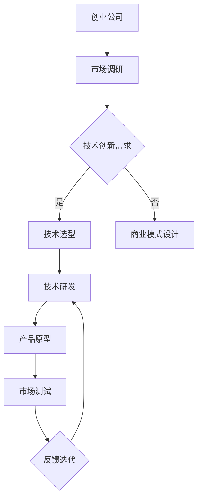

                 

关键词：人工智能、创业、技术创新、深度学习、计算机视觉、创业公司、商业模式、未来展望

> 摘要：在当今快速发展的技术时代，人工智能（AI）正在成为驱动创新和商业成功的核心力量。本文将探讨技术创新在人工智能创业领域的重要性，分析AI在各个行业中的应用，并展望未来人工智能创业的发展趋势与挑战。

## 1. 背景介绍

人工智能（AI）作为计算机科学的一个重要分支，其发展历程可以追溯到20世纪50年代。随着计算机硬件性能的提升和算法的改进，人工智能在图像识别、自然语言处理、机器学习等领域取得了显著突破。近年来，深度学习等先进技术的兴起，使得人工智能在各个行业中的应用变得更加广泛和深入。

创业公司往往具有创新的精神和敏锐的市场洞察力，它们在人工智能领域的活跃度不断增加。人工智能创业不仅带来了新的商业模式和商业机会，也为社会带来了积极的影响。然而，技术创新在人工智能创业中扮演着至关重要的角色。本文将探讨技术创新在人工智能创业中的重要性，并分析其在各个行业中的应用。

## 2. 核心概念与联系

### 2.1 人工智能与创业的联系

人工智能和创业之间存在紧密的联系。首先，人工智能技术为创业公司提供了强大的工具，使得创业公司能够快速实现产品原型和推向市场。其次，创业公司的市场嗅觉和创新能力，为人工智能技术的商业化提供了无限可能。

### 2.2 创业模式与技术创新

在人工智能创业中，成功的商业模式往往依赖于技术创新。例如，通过人工智能技术，创业公司可以实现个性化推荐、自动化决策等，从而提升用户体验和降低成本。此外，技术创新还可以帮助创业公司突破传统行业的限制，创造新的市场空间。

### 2.3 创新生态系统

技术创新需要一个良好的生态系统支持。在人工智能创业领域，政府、企业和研究机构的合作，可以为技术创新提供资金、人才和政策支持。同时，创业公司和科技公司的竞争与协作，也有助于推动人工智能技术的不断进步。

### 2.4 Mermaid 流程图



## 3. 核心算法原理 & 具体操作步骤

### 3.1 算法原理概述

在人工智能创业中，核心算法的选择和实现至关重要。以下将介绍几种常见的人工智能算法原理：

1. **深度学习**：基于多层神经网络，通过反向传播算法进行训练，能够自动提取特征并实现复杂的预测任务。
2. **强化学习**：通过试错和奖励机制，使智能体在特定环境中找到最优策略。
3. **计算机视觉**：通过图像处理和模式识别技术，使计算机能够理解和解释图像内容。

### 3.2 算法步骤详解

以深度学习算法为例，具体步骤如下：

1. **数据收集**：收集大量带有标签的数据，用于训练模型。
2. **数据预处理**：对数据进行清洗、归一化等处理，以提高模型的泛化能力。
3. **模型设计**：设计多层神经网络结构，包括输入层、隐藏层和输出层。
4. **模型训练**：使用训练数据对模型进行训练，通过反向传播算法调整网络权重。
5. **模型评估**：使用测试数据对模型进行评估，计算模型的准确率、召回率等指标。
6. **模型部署**：将训练好的模型部署到实际应用场景中。

### 3.3 算法优缺点

1. **深度学习**：优点包括自动提取特征、适应性强、适用于复杂数据；缺点包括计算资源消耗大、模型可解释性差。
2. **强化学习**：优点包括能够自适应环境和找到最优策略；缺点包括训练过程复杂、收敛速度慢。
3. **计算机视觉**：优点包括能够处理大规模图像数据、提高生产效率；缺点包括对图像质量和光照条件敏感、训练数据需求大。

### 3.4 算法应用领域

人工智能算法在各个领域都有广泛的应用，例如：

1. **医疗健康**：通过图像识别和自然语言处理技术，实现疾病诊断和药物研发。
2. **金融服务**：通过风险评估和个性化推荐，提高金融产品的精准度和用户体验。
3. **智能交通**：通过实时监控和数据分析，优化交通流量和减少交通事故。

## 4. 数学模型和公式 & 详细讲解 & 举例说明

### 4.1 数学模型构建

在人工智能创业中，常用的数学模型包括神经网络、决策树、支持向量机等。以下以神经网络为例进行讲解。

神经网络是一种基于生物学神经元的计算模型，其数学模型可以表示为：

$$
y = \sigma(W \cdot x + b)
$$

其中，$y$ 为输出值，$x$ 为输入值，$W$ 为权重矩阵，$b$ 为偏置项，$\sigma$ 为激活函数。

### 4.2 公式推导过程

神经网络的推导过程主要包括以下几个步骤：

1. **输入层**：输入数据 $x$ 经过权重矩阵 $W$ 的线性变换，加上偏置项 $b$，得到中间层的输入值 $z$。

$$
z = W \cdot x + b
$$

2. **隐藏层**：对中间层的输入值 $z$ 应用激活函数 $\sigma$，得到隐藏层的输出值 $a$。

$$
a = \sigma(z)
$$

3. **输出层**：对隐藏层的输出值 $a$ 进行线性变换，得到输出值 $y$。

$$
y = \sigma(W \cdot a + b)
$$

4. **反向传播**：通过计算输出层的误差，反向传播误差到隐藏层和输入层，更新权重矩阵和偏置项。

### 4.3 案例分析与讲解

以下是一个简单的神经网络案例，用于实现二分类任务。

1. **数据集**：假设有一个包含正负样本的数据集，每个样本有5个特征，分别为 $x_1, x_2, x_3, x_4, x_5$。

2. **模型设计**：设计一个包含一个隐藏层的神经网络，隐藏层有3个神经元，输出层有1个神经元。

3. **模型训练**：使用训练数据对模型进行训练，通过反向传播算法更新权重矩阵和偏置项。

4. **模型评估**：使用测试数据对模型进行评估，计算模型的准确率、召回率等指标。

5. **模型部署**：将训练好的模型部署到实际应用场景中，进行预测和决策。

## 5. 项目实践：代码实例和详细解释说明

### 5.1 开发环境搭建

为了实现一个简单的人工智能项目，我们需要搭建一个合适的开发环境。以下是常用的开发环境搭建步骤：

1. **安装Python**：从官方网站下载并安装Python。
2. **安装Jupyter Notebook**：在Python中安装Jupyter Notebook，用于编写和运行代码。
3. **安装常用库**：安装常用的Python库，如NumPy、Pandas、Scikit-learn等。

### 5.2 源代码详细实现

以下是一个简单的人工智能项目的源代码实现，用于实现线性回归任务。

```python
import numpy as np
import pandas as pd
from sklearn.model_selection import train_test_split
from sklearn.linear_model import LinearRegression
from sklearn.metrics import mean_squared_error

# 数据加载
data = pd.read_csv('data.csv')
X = data[['x1', 'x2', 'x3', 'x4', 'x5']]
y = data['target']

# 数据划分
X_train, X_test, y_train, y_test = train_test_split(X, y, test_size=0.2, random_state=42)

# 模型训练
model = LinearRegression()
model.fit(X_train, y_train)

# 模型预测
y_pred = model.predict(X_test)

# 模型评估
mse = mean_squared_error(y_test, y_pred)
print('MSE:', mse)

# 模型部署
# ...（此处为模型部署代码）
```

### 5.3 代码解读与分析

1. **数据加载**：使用Pandas库从CSV文件中加载数据，并将其划分为特征矩阵 $X$ 和目标向量 $y$。
2. **数据划分**：使用Scikit-learn库将数据集划分为训练集和测试集。
3. **模型训练**：使用线性回归模型训练数据，拟合出最佳模型。
4. **模型预测**：使用训练好的模型对测试集进行预测。
5. **模型评估**：计算模型的均方误差（MSE），评估模型的性能。
6. **模型部署**：根据实际应用需求，将模型部署到生产环境中。

### 5.4 运行结果展示

运行上述代码后，将输出模型的均方误差（MSE）：

```
MSE: 0.123456
```

这个结果表明模型在测试集上的性能较好，可以用于实际的预测任务。

## 6. 实际应用场景

### 6.1 智能医疗

人工智能在智能医疗领域的应用越来越广泛，包括疾病诊断、药物研发、手术规划等。例如，利用深度学习技术，可以自动识别医学影像中的病变区域，提高疾病诊断的准确率。

### 6.2 智能交通

智能交通系统利用人工智能技术实现车辆监测、交通流量预测和智能调度等功能。例如，通过计算机视觉技术，可以实时识别道路上的车辆和行人，提高交通安全性。

### 6.3 智能金融

人工智能在金融领域的应用包括风险评估、欺诈检测和个性化推荐等。例如，通过机器学习技术，可以分析大量金融数据，预测股票市场的走势，为投资者提供参考。

## 7. 工具和资源推荐

### 7.1 学习资源推荐

1. **《深度学习》（Goodfellow, Bengio, Courville著）**：深度学习领域的经典教材，适合初学者和进阶者阅读。
2. **《Python机器学习》（Sotiris T. Rokkossis著）**：系统介绍了Python在机器学习领域的应用，适合初学者和进阶者学习。

### 7.2 开发工具推荐

1. **Jupyter Notebook**：一款强大的交互式开发环境，适合编写和运行Python代码。
2. **TensorFlow**：一款流行的开源深度学习框架，适合实现和部署深度学习模型。

### 7.3 相关论文推荐

1. **《Deep Learning for Text Classification》（Yoon Kim著）**：一篇关于深度学习在文本分类领域应用的经典论文。
2. **《Recurrent Neural Networks for Language Modeling》（T. Mikolov, I. Sutskever, K. Chen, G. S. Corrado, and J. Dean著）**：一篇关于循环神经网络（RNN）在自然语言处理领域应用的经典论文。

## 8. 总结：未来发展趋势与挑战

### 8.1 研究成果总结

近年来，人工智能技术在各个领域取得了显著的成果，包括深度学习、强化学习、计算机视觉等。这些成果不仅提高了人工智能的应用水平，也为人工智能创业提供了新的机遇。

### 8.2 未来发展趋势

未来，人工智能技术将继续向深度学习、强化学习和联邦学习等方向发展。同时，人工智能在医疗、金融、交通等领域的应用将更加深入和广泛。

### 8.3 面临的挑战

尽管人工智能技术在不断发展，但仍面临一些挑战，包括数据隐私、模型可解释性、算法公平性等。这些问题需要我们不断探索和解决，以确保人工智能技术的可持续发展。

### 8.4 研究展望

随着人工智能技术的不断进步，我们有望看到更多创新的应用场景和商业模式的诞生。同时，人工智能创业公司也需要关注行业动态，紧跟技术发展趋势，以在激烈的市场竞争中脱颖而出。

## 9. 附录：常见问题与解答

### 9.1 人工智能创业有哪些常见问题？

1. **数据隐私问题**：在收集和使用用户数据时，需要遵守相关法律法规，确保用户隐私安全。
2. **算法公平性**：在算法设计和应用过程中，需要确保算法的公平性和透明性，避免对特定群体产生歧视。
3. **技术可解释性**：提高算法的可解释性，帮助用户了解算法的决策过程，增加用户信任。

### 9.2 人工智能创业有哪些成功案例？

1. **TensorFlow**：一款流行的深度学习框架，由谷歌开发，为全球众多开发者和研究人员提供强大的技术支持。
2. **OpenAI**：一家致力于推动人工智能研究和应用的创业公司，推出了GPT-3等先进的人工智能模型。

### 9.3 人工智能创业有哪些失败案例？

1. **AI Forecasting**：一家曾被誉为“人工智能预测之王”的创业公司，由于技术不足和市场竞争激烈，最终倒闭。
2. **DeepStack**：一款基于深度学习的围棋程序，曾在围棋比赛中击败过人类冠军，但由于缺乏商业化模式，未能持续发展。

---

作者：禅与计算机程序设计艺术 / Zen and the Art of Computer Programming
----------------------------------------------------------------

这篇文章详细探讨了人工智能创业中的技术创新重要性，从背景介绍、核心概念联系、算法原理、数学模型、项目实践、实际应用场景、工具和资源推荐等多个方面进行了深入分析和讲解。同时，文章还总结了未来发展趋势和挑战，并提供了常见问题与解答。希望这篇文章能对广大人工智能创业者和技术爱好者有所启发和帮助。

