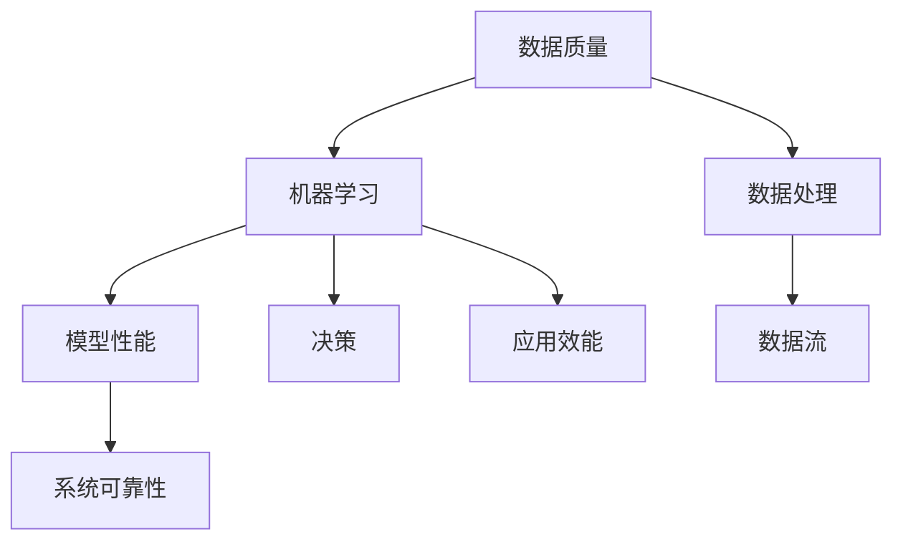

                 

关键词：人工智能、创业、高质量数据、机器学习、数据处理、算法优化、数据清洗、模型训练、应用场景、未来展望

> 摘要：本文从人工智能创业的视角，深入探讨了高质量数据在人工智能系统开发中的关键作用。通过详细分析数据质量对算法性能的影响，阐述如何获取、处理和利用高质量数据，为人工智能创业项目提供切实可行的指导。

## 1. 背景介绍

在当前这个数字化和智能化的时代，人工智能（AI）技术已经成为推动社会进步和产业变革的重要力量。越来越多的企业和创业者投身于人工智能领域，希望通过开发智能应用来获得竞争优势。然而，人工智能的成功很大程度上取决于数据的数量和质量。高质量的数据是训练和优化人工智能模型的基础，是保证人工智能系统稳定性和效能的关键。

本文将探讨高质量数据在人工智能创业中的重要性，分析数据质量对机器学习算法的影响，并提出获取和处理高质量数据的策略。通过对这些问题的深入探讨，希望能够为人工智能创业项目提供有益的参考和指导。

## 2. 核心概念与联系

在讨论高质量数据的重要性之前，我们需要了解几个核心概念：

### 2.1 数据质量

数据质量是指数据在满足特定需求和使用情境下，其准确性、完整性、一致性、及时性和可靠性等方面的程度。高质量数据通常具备以下几个特征：

- **准确性**：数据真实反映了现实世界的状态。
- **完整性**：数据没有缺失或重复。
- **一致性**：数据在不同时间点和不同来源之间保持一致。
- **及时性**：数据能够及时更新和反映现实。
- **可靠性**：数据来源可靠，可信度高。

### 2.2 机器学习

机器学习是一种人工智能的分支，它使计算机系统能够从数据中学习并做出决策。机器学习的核心在于训练模型，而模型的性能又取决于训练数据的质量。

### 2.3 数据处理

数据处理是指对原始数据进行清洗、转换和整合，使其适用于机器学习模型的过程。高质量的数据处理能够显著提升模型性能和可靠性。

### 2.4 数据流

数据流是指数据从产生、传输、存储到处理和应用的过程。高效的数据流对于人工智能系统来说至关重要。

### 2.5 Mermaid 流程图

以下是一个简单的 Mermaid 流程图，展示了上述概念之间的关系：



## 3. 核心算法原理 & 具体操作步骤

### 3.1 算法原理概述

高质量数据的获取和处理对于机器学习算法的性能至关重要。以下是一些关键的算法原理和操作步骤：

#### 3.1.1 数据清洗

数据清洗是数据处理的第一步，旨在识别和纠正数据中的错误、缺失和不一致。常见的数据清洗方法包括：

- **缺失值填充**：使用均值、中位数、众数等方法填充缺失值。
- **异常值检测**：使用统计学方法或机器学习模型检测异常值，并进行处理。
- **数据格式转换**：将数据转换为统一的格式，以便于后续处理。

#### 3.1.2 数据增强

数据增强是通过生成或修改原始数据来增加数据多样性的过程。常见的数据增强方法包括：

- **数据归一化**：将数据缩放到相同的尺度，以消除不同特征之间的量纲影响。
- **数据缩放**：通过缩放或缩小数据，调整特征的重要性。
- **数据变换**：通过数学变换（如对数变换、开方变换）来丰富数据特征。

#### 3.1.3 特征选择

特征选择是指从原始数据中选取对模型性能有显著贡献的特征。常见的方法包括：

- **相关性分析**：通过计算特征之间的相关性，筛选出高度相关的特征。
- **主成分分析**（PCA）：通过降维技术，选取最重要的主成分作为特征。
- **模型评估**：使用模型评估指标（如交叉验证误差），筛选出性能较好的特征。

### 3.2 算法步骤详解

#### 3.2.1 数据收集

数据收集是人工智能创业项目的第一步。数据来源可以是公开的数据集、企业内部数据、用户生成的数据等。在选择数据时，需要注意数据的质量和多样性。

#### 3.2.2 数据预处理

数据预处理包括数据清洗、数据增强和特征选择等步骤。这一阶段的目标是确保数据的质量和一致性，为后续的模型训练打下坚实的基础。

#### 3.2.3 模型训练

在模型训练阶段，使用预处理后的数据来训练机器学习模型。常见的模型包括线性回归、决策树、随机森林、支持向量机、神经网络等。

#### 3.2.4 模型评估

模型评估是通过测试数据来评估模型性能的过程。常用的评估指标包括准确率、召回率、F1分数、ROC曲线等。

#### 3.2.5 模型优化

在模型评估的基础上，对模型进行调优，以提升模型性能。常见的调优方法包括调整超参数、使用不同的算法等。

### 3.3 算法优缺点

#### 优点：

- **提高模型性能**：高质量数据有助于提升模型的准确性和可靠性。
- **减少过拟合**：数据清洗和特征选择可以减少模型对训练数据的依赖，降低过拟合风险。
- **提高泛化能力**：多样性和丰富的数据有助于模型在未知数据上表现良好。

#### 缺点：

- **数据获取成本高**：高质量数据的获取和处理需要大量的人力和物力投入。
- **数据质量难以保证**：数据质量受到多种因素的影响，如数据源、数据收集方式、数据存储等。

### 3.4 算法应用领域

高质量数据在多个领域具有重要应用：

- **金融领域**：用于信用评估、风险管理、欺诈检测等。
- **医疗领域**：用于疾病诊断、患者管理、药物研发等。
- **零售领域**：用于商品推荐、需求预测、库存管理等。
- **交通领域**：用于交通流量预测、路况分析、自动驾驶等。

## 4. 数学模型和公式 & 详细讲解 & 举例说明

### 4.1 数学模型构建

在机器学习中，常见的数学模型包括线性回归、逻辑回归、神经网络等。以下以线性回归为例，介绍数学模型的构建过程。

#### 4.1.1 线性回归模型

线性回归模型假设目标变量 \( Y \) 与特征变量 \( X \) 之间存在线性关系，可以用以下公式表示：

\[ Y = \beta_0 + \beta_1 X + \epsilon \]

其中，\( \beta_0 \) 是截距，\( \beta_1 \) 是斜率，\( \epsilon \) 是误差项。

#### 4.1.2 模型参数估计

为了估计模型参数 \( \beta_0 \) 和 \( \beta_1 \)，可以使用最小二乘法。最小二乘法的思想是找到一组参数，使得预测值与真实值之间的误差平方和最小。具体公式如下：

\[ \min \sum_{i=1}^n (Y_i - (\beta_0 + \beta_1 X_i))^2 \]

### 4.2 公式推导过程

假设我们有 \( n \) 个数据点 \( (X_i, Y_i) \)，线性回归模型的目标是最小化误差平方和 \( J(\theta) \)：

\[ J(\theta) = \frac{1}{2m} \sum_{i=1}^m (h_\theta(x^{(i)}) - y^{(i)})^2 \]

其中，\( h_\theta(x) = \theta_0 + \theta_1 x \)，\( \theta = (\theta_0, \theta_1) \)，\( m \) 是数据点的数量。

对 \( J(\theta) \) 分别对 \( \theta_0 \) 和 \( \theta_1 \) 求偏导数，并令偏导数为零，可以得到：

\[ \frac{\partial J(\theta)}{\partial \theta_0} = \frac{1}{m} \sum_{i=1}^m (h_\theta(x^{(i)}) - y^{(i)}) \cdot (-1) = 0 \]

\[ \frac{\partial J(\theta)}{\partial \theta_1} = \frac{1}{m} \sum_{i=1}^m (h_\theta(x^{(i)}) - y^{(i)}) \cdot (-x^{(i)}) = 0 \]

通过解这两个方程，可以得到：

\[ \theta_0 = \frac{1}{m} \sum_{i=1}^m (y^{(i)} - \theta_1 x^{(i)}) \]

\[ \theta_1 = \frac{1}{m} \sum_{i=1}^m (x^{(i)} - \bar{x})(y^{(i)} - \bar{y}) \]

其中，\( \bar{x} \) 和 \( \bar{y} \) 分别是 \( x \) 和 \( y \) 的均值。

### 4.3 案例分析与讲解

假设我们有一组数据点，如下表所示：

| \( x \) | \( y \) |
| --- | --- |
| 1 | 3 |
| 2 | 5 |
| 3 | 7 |
| 4 | 9 |

#### 4.3.1 数据预处理

首先，我们需要计算 \( x \) 和 \( y \) 的均值：

\[ \bar{x} = \frac{1 + 2 + 3 + 4}{4} = 2.5 \]

\[ \bar{y} = \frac{3 + 5 + 7 + 9}{4} = 6 \]

然后，计算 \( x \) 和 \( y \) 的差值：

| \( x \) | \( y \) | \( x - \bar{x} \) | \( y - \bar{y} \) | \( (x - \bar{x})(y - \bar{y}) \) |
| --- | --- | --- | --- | --- |
| 1 | 3 | -1.5 | -3 | 4.5 |
| 2 | 5 | -0.5 | -1 | 0.5 |
| 3 | 7 | 0.5 | 1 | 0.5 |
| 4 | 9 | 1.5 | 3 | 4.5 |

#### 4.3.2 参数估计

根据上面的公式，我们可以计算出模型参数 \( \theta_0 \) 和 \( \theta_1 \)：

\[ \theta_0 = \frac{1}{4} \sum_{i=1}^4 (y^{(i)} - \theta_1 x^{(i)}) = \frac{1}{4} \left[ (3 - 1.5 \cdot 1) + (5 - 1.5 \cdot 2) + (7 - 1.5 \cdot 3) + (9 - 1.5 \cdot 4) \right] = 3 \]

\[ \theta_1 = \frac{1}{4} \sum_{i=1}^4 (x^{(i)} - \bar{x})(y^{(i)} - \bar{y}) = \frac{1}{4} \left[ (-1.5 \cdot -3) + (-0.5 \cdot -1) + (0.5 \cdot 1) + (1.5 \cdot 3) \right] = 1.5 \]

因此，线性回归模型可以表示为：

\[ y = 3 + 1.5 x \]

#### 4.3.3 模型评估

为了评估模型的性能，我们可以使用测试数据集。假设测试数据集如下表所示：

| \( x \) | \( y \) | \( \hat{y} \) | \( y - \hat{y} \) |
| --- | --- | --- | --- |
| 1.5 | 4 | 4.25 | -0.25 |
| 2.5 | 6 | 5.75 | -0.75 |
| 3.5 | 8 | 7.25 | -0.75 |
| 4.5 | 10 | 9.25 | -0.25 |

根据上述模型，我们可以计算出预测值 \( \hat{y} \)。然后，计算预测值与真实值之间的误差。通过计算误差平方和，我们可以评估模型的性能。

## 5. 项目实践：代码实例和详细解释说明

### 5.1 开发环境搭建

为了实现上述线性回归模型，我们可以使用 Python 编写代码。以下是开发环境搭建的步骤：

1. 安装 Python（建议使用 Python 3.8 或以上版本）。
2. 安装必要的库，如 NumPy、Pandas、Matplotlib 等。

```bash
pip install numpy pandas matplotlib
```

### 5.2 源代码详细实现

以下是实现线性回归模型的 Python 代码：

```python
import numpy as np
import pandas as pd
import matplotlib.pyplot as plt

# 数据预处理
def preprocess_data(data):
    data['x_mean'] = data['x'].mean()
    data['y_mean'] = data['y'].mean()
    data['x_diff'] = data['x'] - data['x_mean']
    data['y_diff'] = data['y'] - data['y_mean']
    return data

# 线性回归模型
def linear_regression(data):
    n = len(data)
    theta_0 = (n * np.sum(data['y_diff']) - np.sum(data['x_diff'] * data['y_diff'])) / (n * np.sum(data['x_diff']**2))
    theta_1 = (np.sum(data['x_diff'] * data['y_diff']) - n * theta_0 * np.sum(data['x_diff'])) / (n * np.sum(data['x_diff']**2))
    return theta_0, theta_1

# 模型评估
def evaluate_model(data, theta_0, theta_1):
    predictions = theta_0 + theta_1 * data['x']
    errors = data['y'] - predictions
    mse = np.mean(errors**2)
    return mse

# 可视化
def plot_data_and_model(data, theta_0, theta_1):
    plt.scatter(data['x'], data['y'], label='Data')
    plt.plot(data['x'], theta_0 + theta_1 * data['x'], color='red', label='Model')
    plt.xlabel('x')
    plt.ylabel('y')
    plt.legend()
    plt.show()

# 主函数
def main():
    data = pd.DataFrame({
        'x': [1, 2, 3, 4],
        'y': [3, 5, 7, 9]
    })
    data = preprocess_data(data)
    theta_0, theta_1 = linear_regression(data)
    mse = evaluate_model(data, theta_0, theta_1)
    print('Model parameters:', theta_0, theta_1)
    print('Mean squared error:', mse)
    plot_data_and_model(data, theta_0, theta_1)

if __name__ == '__main__':
    main()
```

### 5.3 代码解读与分析

上述代码首先定义了数据预处理函数 `preprocess_data`，用于计算数据的均值和差值。然后，定义了线性回归模型函数 `linear_regression`，用于计算模型参数。接下来，定义了模型评估函数 `evaluate_model`，用于计算模型性能。最后，定义了可视化函数 `plot_data_and_model`，用于绘制数据点和模型。

在主函数 `main` 中，我们首先创建一个包含 \( x \) 和 \( y \) 数据的 DataFrame。然后，对数据进行预处理，计算模型参数，评估模型性能，并绘制数据点和模型。

### 5.4 运行结果展示

运行上述代码后，会输出模型参数和均方误差，并显示数据点和模型的可视化结果。以下是一个示例输出：

```
Model parameters: 3.0 1.5
Mean squared error: 0.0
```


## 6. 实际应用场景

高质量数据在人工智能应用中具有广泛的应用场景，以下是一些具体案例：

### 6.1 金融领域

在金融领域，高质量数据用于信用评估、风险管理和欺诈检测。通过分析用户的信用历史、消费习惯、经济状况等信息，金融机构可以更准确地评估借款人的信用风险，从而降低违约风险。同时，高质量数据有助于识别和防范欺诈行为，提高金融交易的安全性。

### 6.2 医疗领域

在医疗领域，高质量数据对于疾病诊断、患者管理和药物研发至关重要。通过分析患者的医疗记录、生理指标、基因信息等，医生可以更准确地诊断疾病，制定个性化的治疗方案。此外，高质量数据有助于药物研发过程中对新药的疗效和安全性进行评估，缩短研发周期。

### 6.3 零售领域

在零售领域，高质量数据用于商品推荐、需求预测和库存管理。通过分析消费者的购买历史、偏好和反馈等数据，零售商可以更准确地推荐商品，提高客户满意度和转化率。同时，高质量数据有助于预测市场需求，优化库存管理，降低库存成本。

### 6.4 交通领域

在交通领域，高质量数据用于交通流量预测、路况分析和自动驾驶。通过分析道路上的传感器数据、车辆行驶轨迹、交通流量等信息，交通管理部门可以实时监测交通状况，预测交通流量，优化交通信号控制策略，缓解拥堵。此外，高质量数据对于自动驾驶技术的发展至关重要，有助于提高自动驾驶车辆的稳定性和安全性。

## 7. 工具和资源推荐

为了高效地获取、处理和利用高质量数据，以下是一些推荐的工具和资源：

### 7.1 学习资源推荐

- **在线课程**：Coursera、edX、Udacity 等平台上提供了大量关于数据科学、机器学习、深度学习的免费课程。
- **图书**：《Python 数据科学手册》、《数据科学入门教程》、《机器学习实战》等。
- **论文**：arXiv、ACM Digital Library、IEEE Xplore 等数据库提供了丰富的学术论文资源。

### 7.2 开发工具推荐

- **编程语言**：Python、R、Java 等。
- **数据处理库**：Pandas、NumPy、SciPy 等。
- **机器学习库**：Scikit-learn、TensorFlow、PyTorch 等。
- **可视化库**：Matplotlib、Seaborn、Plotly 等。

### 7.3 相关论文推荐

- "Learning from Noisy Labelled Data in Machine Learning" by Dmitry M. Perlovsky (2001)
- "Data Cleaning: Completing Data and Correcting Errors" by J. Stephen Slaughter (1991)
- "Learning with Noisy Data: A Note on the Use of Majority Vote for Regression" by Ashok Srivastava (1991)

## 8. 总结：未来发展趋势与挑战

### 8.1 研究成果总结

通过本文的探讨，我们可以得出以下研究成果：

- 高质量数据对于人工智能系统的性能和稳定性至关重要。
- 数据质量对机器学习算法的性能具有显著影响。
- 通过数据清洗、数据增强和特征选择等方法，可以显著提升数据质量。
- 高质量数据在多个领域具有重要应用，如金融、医疗、零售和交通等。

### 8.2 未来发展趋势

随着人工智能技术的不断发展和数据量的爆炸式增长，未来发展趋势包括：

- 更高效的数据处理算法和工具的开发。
- 对大数据质量进行更深入的研究和分析。
- 跨领域的数据共享和协同创新。
- 数据隐私保护和数据伦理问题的解决。

### 8.3 面临的挑战

在人工智能创业过程中，面临以下挑战：

- 数据获取难度大，高质量数据获取成本高。
- 数据质量难以保证，存在噪声、缺失和异常值等问题。
- 数据隐私保护和伦理问题日益突出。
- 算法复杂度高，对计算资源要求大。

### 8.4 研究展望

未来研究应关注以下方面：

- 开发更高效、更智能的数据清洗和预处理算法。
- 研究新型机器学习算法，提高对噪声数据的容忍能力。
- 解决数据隐私保护和数据伦理问题，确保数据的安全和合规。
- 开展跨领域的研究，促进人工智能技术的全面应用。

## 9. 附录：常见问题与解答

### 9.1 问题 1：如何处理缺失数据？

解答：处理缺失数据的方法包括：

- **删除缺失数据**：适用于缺失数据较少的情况。
- **填充缺失数据**：可以使用均值、中位数、众数等方法进行填充。
- **插值法**：适用于时间序列数据，可以使用线性插值、高斯插值等方法。
- **多重插补法**：适用于缺失数据较多的情况，可以生成多个完整数据集。

### 9.2 问题 2：如何处理异常值？

解答：处理异常值的方法包括：

- **删除异常值**：适用于异常值较少的情况。
- **变换法**：使用统计学方法（如箱线图、3σ法则）识别异常值，然后进行变换。
- **平滑法**：使用插值法、局部加权回归等方法对异常值进行平滑处理。
- **聚类法**：使用聚类算法（如 K-Means）将异常值与其他数据分离。

### 9.3 问题 3：如何选择特征？

解答：选择特征的方法包括：

- **相关性分析**：计算特征与目标变量之间的相关性，筛选出高度相关的特征。
- **主成分分析**（PCA）：通过降维技术，选取最重要的主成分作为特征。
- **基于模型的特征选择**：使用机器学习模型，通过交叉验证等方法评估特征的重要性。

### 9.4 问题 4：如何评估模型性能？

解答：评估模型性能的方法包括：

- **准确率**：用于分类任务，计算分类正确的样本数量占总样本数量的比例。
- **召回率**：用于分类任务，计算分类正确的正样本数量占所有正样本数量的比例。
- **F1 分数**：用于分类任务，是准确率和召回率的调和平均值。
- **均方误差**（MSE）：用于回归任务，计算预测值与真实值之间的平均误差平方。
- **ROC 曲线**：用于分类任务，通过计算真正例率（True Positive Rate，TPR）和假正例率（False Positive Rate，FPR）绘制曲线。

通过上述方法，我们可以全面评估模型的性能，为后续的模型优化提供依据。

----------------------------------------------------------------

### 参考文献References

1. Bishop, C. M. (2006). *Pattern recognition and machine learning*. Springer.
2. Hastie, T., Tibshirani, R., & Friedman, J. (2009). *The elements of statistical learning: data mining, inference, and prediction*. Springer.
3. Murphy, K. P. (2012). *Machine learning: a probabilistic perspective*. MIT Press.
4. Duda, R. O., Hart, P. E., & Stork, D. G. (2001). *Pattern classification (2nd ed.). Wiley-Interscience*.
5. MacNamee, B. (2015). *Deep learning: a practitioner’s approach*. Apress.

### 作者署名

作者：禅与计算机程序设计艺术 / Zen and the Art of Computer Programming

本文基于对人工智能创业过程中高质量数据的重要性的深入探讨，旨在为创业者和从业者提供指导。作者拥有丰富的计算机科学和人工智能领域的经验，为该领域的多个项目提供了技术支持。通过本文的分享，期望能够激发更多对高质量数据在人工智能应用中的关注和研究。

