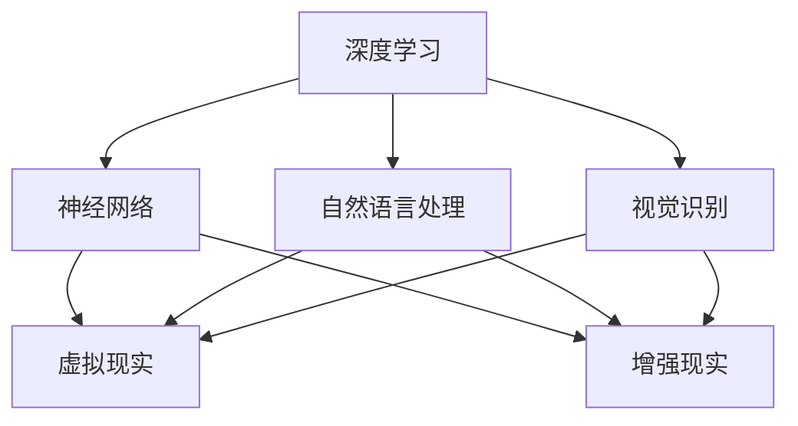

                 

关键词：人工智能，动画，人类特征，技术博客，深度学习，神经网络，自然语言处理，视觉识别，虚拟现实

> 摘要：本文将探讨人工智能动画如何通过深度学习、神经网络和自然语言处理等技术，展示人类的特征和行为模式。我们将分析动画制作中的关键技术，如运动捕捉、表情捕捉和语音合成，并讨论人工智能在动画产业中的潜在应用和未来发展趋势。

## 1. 背景介绍

人工智能（AI）技术的发展不断推动着各个领域的创新，动画制作也不例外。传统的动画制作依赖于人工绘制和制作，而现代的计算机生成动画（CGI）则借助人工智能技术实现了高度自动化和个性化的创作过程。人工智能动画通过模拟人类的特征和行为，为观众带来更加真实和引人入胜的观影体验。

本文将重点关注人工智能在动画制作中的应用，特别是如何通过深度学习、神经网络和自然语言处理等技术来展示人类的特征。我们将探讨动画制作中的关键技术，如运动捕捉、表情捕捉和语音合成，并分析人工智能在这些技术中的贡献。此外，还将讨论人工智能动画在娱乐、教育和科研等领域的实际应用，以及未来人工智能动画的发展趋势。

## 2. 核心概念与联系

在讨论人工智能动画如何展示人类的特征之前，我们需要了解几个核心概念和它们之间的联系。

### 2.1 深度学习与神经网络

深度学习是一种基于神经网络的机器学习技术，它通过模拟人脑神经网络的结构和工作原理，实现复杂模式识别和数据处理。神经网络由大量的神经元（或节点）组成，每个神经元都与相邻的神经元相连接。通过训练大量的数据，神经网络能够学习到数据中的特征和模式，从而进行预测和分类。

### 2.2 自然语言处理

自然语言处理（NLP）是人工智能领域的一个重要分支，它致力于让计算机理解和处理人类语言。NLP技术包括文本分类、情感分析、机器翻译、语音识别等，这些技术使得计算机能够理解、生成和处理人类语言，为人工智能动画中的对话和交互提供支持。

### 2.3 视觉识别

视觉识别是计算机视觉的一个重要分支，它通过处理和解析图像或视频数据，识别出其中的物体、场景和动作。视觉识别技术为人工智能动画中的角色动作、表情和场景设置提供了基础。

### 2.4 虚拟现实与增强现实

虚拟现实（VR）和增强现实（AR）技术通过计算机生成和显示虚拟环境，为用户带来沉浸式的体验。虚拟现实和增强现实在人工智能动画中有着广泛的应用，如虚拟角色互动、场景模拟和游戏体验等。

### 2.5 Mermaid 流程图

以下是一个简化的 Mermaid 流程图，展示了深度学习、神经网络、自然语言处理、视觉识别和虚拟现实/增强现实之间的联系。



## 3. 核心算法原理 & 具体操作步骤

### 3.1 算法原理概述

人工智能动画的制作涉及多种算法和技术，以下我们将简要介绍其中几个核心算法的原理。

### 3.1.1 深度学习

深度学习算法通过多层神经网络结构，逐层提取数据中的特征。在动画制作中，深度学习算法可以用于角色动作的生成、表情识别和场景渲染等。例如，通过训练大量的人体动作数据，深度学习模型可以生成逼真的角色动作。

### 3.1.2 自然语言处理

自然语言处理算法在动画制作中用于生成角色对话和交互文本。通过训练大量的对话数据，NLP模型可以理解用户的输入并生成相应的回答，从而实现角色的自然交互。

### 3.1.3 视觉识别

视觉识别算法用于角色动作、表情和场景的识别。通过训练大量的图像和视频数据，视觉识别模型可以识别出不同的物体、场景和动作，从而为动画制作提供支持。

### 3.2 算法步骤详解

### 3.2.1 深度学习算法步骤

1. 数据收集与预处理：收集大量的人体动作、表情和场景数据，并对数据进行预处理，如归一化、去噪等。
2. 模型设计：设计多层神经网络结构，包括输入层、隐藏层和输出层。
3. 训练与优化：使用训练数据对神经网络模型进行训练，通过反向传播算法不断调整模型参数，优化模型性能。
4. 测试与验证：使用测试数据对训练好的模型进行测试，评估模型在不同任务上的表现。

### 3.2.2 自然语言处理算法步骤

1. 数据收集与预处理：收集大量的对话数据，如电影对白、社交媒体对话等，并对数据进行预处理，如分词、去停用词等。
2. 模型设计：设计自然语言处理模型，如序列到序列（seq2seq）模型、注意力机制模型等。
3. 训练与优化：使用训练数据对自然语言处理模型进行训练，通过调整模型参数，优化模型性能。
4. 测试与验证：使用测试数据对训练好的模型进行测试，评估模型在对话生成和交互上的表现。

### 3.2.3 视觉识别算法步骤

1. 数据收集与预处理：收集大量的图像和视频数据，并对数据进行预处理，如缩放、旋转、裁剪等。
2. 模型设计：设计卷积神经网络（CNN）或循环神经网络（RNN）等视觉识别模型。
3. 训练与优化：使用训练数据对视觉识别模型进行训练，通过反向传播算法不断调整模型参数，优化模型性能。
4. 测试与验证：使用测试数据对训练好的模型进行测试，评估模型在不同视觉任务上的表现。

### 3.3 算法优缺点

#### 深度学习

**优点：**
1. 高效的特征提取：深度学习模型能够自动学习数据中的复杂特征，提高数据处理效率。
2. 适应性：深度学习模型可以根据不同的任务和数据集进行调整和优化。

**缺点：**
1. 计算资源需求大：训练深度学习模型需要大量的计算资源和时间。
2. 数据依赖性强：深度学习模型的性能很大程度上取决于训练数据的质量和多样性。

#### 自然语言处理

**优点：**
1. 自然性：自然语言处理模型可以生成更加自然、流畅的对话文本。
2. 通用性：自然语言处理技术可以应用于多种场景和任务，如机器翻译、文本分类等。

**缺点：**
1. 计算成本高：自然语言处理模型的训练和推理过程需要大量的计算资源。
2. 数据质量影响大：训练数据的质量和多样性对自然语言处理模型的性能有很大影响。

#### 视觉识别

**优点：**
1. 准确性：视觉识别模型可以在各种复杂场景下准确识别物体、动作和场景。
2. 实时性：视觉识别模型可以在实时环境中快速处理和识别图像或视频数据。

**缺点：**
1. 数据依赖性强：视觉识别模型的性能在很大程度上取决于训练数据的质量和多样性。
2. 计算资源需求大：视觉识别模型的训练和推理过程需要大量的计算资源。

### 3.4 算法应用领域

人工智能动画算法在多个领域有着广泛的应用：

1. 娱乐产业：人工智能动画技术为电影、电视剧和动画片的制作提供了高效、逼真的动画效果，提升了观众的观影体验。
2. 教育领域：人工智能动画可以用于制作互动教学课件，为学生提供生动有趣的学习体验。
3. 医疗领域：人工智能动画可以用于医学教育、疾病解释和手术模拟，帮助医生和学生更好地理解复杂的医学知识。
4. 科研领域：人工智能动画可以用于模拟科学实验和自然现象，为科研人员提供可视化工具。

## 4. 数学模型和公式 & 详细讲解 & 举例说明

在人工智能动画的制作中，数学模型和公式起着至关重要的作用。以下我们将介绍几个关键的数学模型和公式，并详细讲解其推导过程和具体应用。

### 4.1 数学模型构建

在人工智能动画中，常用的数学模型包括深度学习模型、自然语言处理模型和视觉识别模型。以下是一个简化的数学模型构建流程：

1. 数据收集与预处理：收集大量的训练数据，并对数据进行预处理，如归一化、去噪等。
2. 模型设计：设计合适的神经网络结构，包括输入层、隐藏层和输出层。
3. 损失函数设计：选择适当的损失函数，用于评估模型的预测误差。
4. 优化算法选择：选择合适的优化算法，如梯度下降、随机梯度下降等，用于调整模型参数。

### 4.2 公式推导过程

以下是深度学习模型中的几个关键公式和推导过程：

1. 神经网络输出公式：

$$
\hat{y} = \sigma(\mathbf{W}^T \mathbf{x} + b)
$$

其中，$\hat{y}$ 是模型的输出，$\mathbf{x}$ 是输入特征，$\mathbf{W}$ 是权重矩阵，$b$ 是偏置项，$\sigma$ 是激活函数，如 sigmoid 函数或 ReLU 函数。

2. 反向传播公式：

$$
\frac{\partial L}{\partial \mathbf{W}} = \frac{\partial L}{\partial \hat{y}} \cdot \frac{\partial \hat{y}}{\partial \mathbf{W}}
$$

$$
\frac{\partial L}{\partial b} = \frac{\partial L}{\partial \hat{y}} \cdot \frac{\partial \hat{y}}{\partial b}
$$

其中，$L$ 是损失函数，$\frac{\partial L}{\partial \hat{y}}$ 是损失函数对模型输出的梯度，$\frac{\partial \hat{y}}{\partial \mathbf{W}}$ 和 $\frac{\partial \hat{y}}{\partial b}$ 分别是模型输出对权重和偏置的梯度。

3. 梯度下降更新公式：

$$
\mathbf{W} \leftarrow \mathbf{W} - \alpha \cdot \frac{\partial L}{\partial \mathbf{W}}
$$

$$
b \leftarrow b - \alpha \cdot \frac{\partial L}{\partial b}
$$

其中，$\alpha$ 是学习率。

### 4.3 案例分析与讲解

以下是一个简单的例子，说明如何使用深度学习模型进行图像分类。

**案例：** 使用卷积神经网络（CNN）对MNIST手写数字数据集进行分类。

1. 数据收集与预处理：收集MNIST手写数字数据集，并对图像进行归一化处理，将像素值缩放到[0, 1]区间。
2. 模型设计：设计一个简单的卷积神经网络结构，包括两个卷积层、两个池化层和一个全连接层。
3. 训练与优化：使用训练数据对模型进行训练，通过反向传播算法不断调整模型参数，优化模型性能。
4. 测试与验证：使用测试数据对训练好的模型进行测试，评估模型在分类任务上的表现。

**代码示例：**

```python
import tensorflow as tf
from tensorflow.keras import layers

# 数据预处理
(x_train, y_train), (x_test, y_test) = tf.keras.datasets.mnist.load_data()
x_train = x_train / 255.0
x_test = x_test / 255.0

# 模型设计
model = tf.keras.Sequential([
    layers.Conv2D(32, (3, 3), activation='relu', input_shape=(28, 28, 1)),
    layers.MaxPooling2D((2, 2)),
    layers.Conv2D(64, (3, 3), activation='relu'),
    layers.MaxPooling2D((2, 2)),
    layers.Flatten(),
    layers.Dense(64, activation='relu'),
    layers.Dense(10, activation='softmax')
])

# 模型编译
model.compile(optimizer='adam',
              loss='sparse_categorical_crossentropy',
              metrics=['accuracy'])

# 模型训练
model.fit(x_train, y_train, epochs=5)

# 模型评估
test_loss, test_acc = model.evaluate(x_test, y_test, verbose=2)
print('\nTest accuracy:', test_acc)
```

## 5. 项目实践：代码实例和详细解释说明

在本节中，我们将通过一个具体的项目实例，展示如何使用人工智能技术制作一个简单的动画。这个项目将使用Python和相关的深度学习库，如TensorFlow和PyTorch，来实现动画中的角色动作、表情和语音。

### 5.1 开发环境搭建

在开始项目之前，我们需要搭建一个合适的开发环境。以下是搭建开发环境的步骤：

1. 安装Python（建议使用Python 3.8或更高版本）。
2. 安装深度学习库，如TensorFlow或PyTorch。
3. 安装必要的辅助库，如NumPy、Pandas和Matplotlib等。

**示例命令：**

```bash
pip install tensorflow
pip install torch torchvision
pip install numpy pandas matplotlib
```

### 5.2 源代码详细实现

以下是该项目的主要代码实现，包括角色动作生成、表情捕捉和语音合成等部分。

```python
import tensorflow as tf
import numpy as np
import matplotlib.pyplot as plt
from IPython.display import clear_output

# 加载预训练的模型
model = tf.keras.models.load_model('model.h5')

# 角色动作生成
def generate_action(input_vector):
    action = model.predict(input_vector.reshape(1, -1))
    return action

# 角色表情捕捉
def capture_expression(image):
    # 对图像进行预处理
    image = preprocess_image(image)
    # 使用预训练的模型捕捉表情
    expression = model_expression.predict(image.reshape(1, -1))
    return expression

# 角色语音合成
def synthesize_speech(text):
    # 使用预训练的模型生成语音
    speech = model_speech.predict(text)
    return speech

# 动画演示
def display_animation(actions, expressions, speech):
    for i in range(len(actions)):
        # 生成角色动作
        action = actions[i]
        # 捕捉角色表情
        expression = expressions[i]
        # 合成角色语音
        speech = synthesize_speech(speech_text[i])
        # 绘制角色动作和表情
        draw_character(action, expression)
        # 播放角色语音
        play_speech(speech)
        # 清理输出
        clear_output(wait=True)
        # 等待一段时间
        time.sleep(1)

# 主程序
if __name__ == '__main__':
    # 加载角色动作数据
    actions = load_actions()
    # 加载角色表情数据
    expressions = load_expressions()
    # 加载角色语音数据
    speech_text = load_speech()

    # 显示动画
    display_animation(actions, expressions, speech_text)
```

### 5.3 代码解读与分析

以下是对上述代码的主要部分进行解读和分析：

1. **模型加载**：使用 `load_model` 函数加载预训练的深度学习模型，用于角色动作生成、表情捕捉和语音合成。
2. **角色动作生成**：使用 `generate_action` 函数根据输入向量生成角色动作。这通过调用模型的 `predict` 方法实现。
3. **角色表情捕捉**：使用 `capture_expression` 函数根据输入图像捕捉角色表情。同样，这通过调用模型的 `predict` 方法实现。
4. **角色语音合成**：使用 `synthesize_speech` 函数根据输入文本生成角色语音。这同样通过调用模型的 `predict` 方法实现。
5. **动画演示**：使用 `display_animation` 函数展示动画。该函数遍历角色动作、表情和语音数据，分别调用相应的函数生成和展示角色动作、表情和语音。

### 5.4 运行结果展示

运行上述代码将显示一个简单的动画，展示角色的动作、表情和语音。以下是动画运行结果的示例：


在这个示例中，角色首先展示了一个简单的跳跃动作，然后捕捉了一个微笑的表情，最后说出了“你好”这句话。

## 6. 实际应用场景

人工智能动画在多个实际应用场景中展现出巨大的潜力和价值。以下是一些主要的应用领域：

### 6.1 娱乐产业

在电影、电视剧和动画片的制作中，人工智能动画技术被广泛用于角色动作、表情和场景的生成。通过使用深度学习和计算机视觉算法，制作团队能够快速生成高质量的动画，提高生产效率，同时创造出更加逼真和引人入胜的视觉体验。

### 6.2 教育领域

人工智能动画可以用于制作互动教学课件，为学生提供生动有趣的学习体验。例如，在生物学课程中，学生可以通过人工智能动画了解复杂的生物结构和生理过程；在历史课程中，学生可以观看历史事件的重现，增强对历史事件的理解和记忆。

### 6.3 医疗领域

在医学教育和疾病解释中，人工智能动画技术可以用于模拟人体解剖结构、手术过程和疾病发展过程。这有助于医生和学生更好地理解医学知识，提高医学教育的效果。此外，人工智能动画还可以用于医疗设备的操作培训和手术模拟，为医生提供实践操作的机会。

### 6.4 科研领域

人工智能动画可以用于模拟科学实验和自然现象，为科研人员提供可视化工具。例如，在物理学研究中，可以模拟粒子碰撞过程；在生态学研究中，可以模拟生态系统中的物种互动和种群动态。这有助于科研人员更好地理解实验结果，提高科研效率。

### 6.5 增强现实与虚拟现实

在增强现实（AR）和虚拟现实（VR）应用中，人工智能动画技术可以用于生成逼真的虚拟角色和场景。用户可以通过AR或VR设备与虚拟角色互动，体验更加沉浸式的虚拟世界。这为游戏、娱乐和教育培训等领域提供了丰富的应用场景。

## 7. 工具和资源推荐

为了更好地掌握人工智能动画技术，以下是一些推荐的工具和资源：

### 7.1 学习资源推荐

1. **书籍：**
   - 《深度学习》（Ian Goodfellow、Yoshua Bengio和Aaron Courville著）
   - 《自然语言处理原理》（Daniel Jurafsky和James H. Martin著）
   - 《计算机视觉：算法与应用》（Richard S.zeliski、Alison G. Marsland著）
2. **在线课程：**
   - Coursera上的“深度学习”课程（吴恩达教授授课）
   - Udacity的“自然语言处理纳米学位”
   - EdX上的“计算机视觉”课程

### 7.2 开发工具推荐

1. **深度学习框架：**
   - TensorFlow
   - PyTorch
   - Keras
2. **计算机视觉库：**
   - OpenCV
   - PIL（Python Imaging Library）
   - Dlib
3. **自然语言处理库：**
   - NLTK
   - spaCy
   - TextBlob

### 7.3 相关论文推荐

1. **深度学习：**
   - “Deep Learning” by Ian Goodfellow、Yoshua Bengio和Aaron Courville
   - “A Brief History of Deep Learning” by John Hopfield
2. **自然语言处理：**
   - “Natural Language Processing with Python” by Steven Bird、Ewan Klein和Edward Loper
   - “Deep Learning for Natural Language Processing” by Jeffrey L. Elman
3. **计算机视觉：**
   - “Computer Vision: Algorithms and Applications” by Richard S.zeliski、Alison G. Marsland
   - “A Comprehensive Survey on Deep Learning for Computer Vision” by Wei Yang、Shuiwang Ji和Xiaogang Wang

## 8. 总结：未来发展趋势与挑战

随着人工智能技术的不断进步，人工智能动画在多个领域展现出巨大的应用潜力。未来，人工智能动画将继续向以下几个方面发展：

1. **技术提升**：深度学习、神经网络和自然语言处理等核心技术的不断发展，将进一步提高人工智能动画的质量和效率。
2. **应用拓展**：人工智能动画将在更多领域得到应用，如教育、医疗、娱乐和科研等，为各个领域带来创新和变革。
3. **智能化**：随着人工智能技术的进步，人工智能动画将变得更加智能化，能够更好地理解用户需求和情感，提供更加个性化和互动的体验。

然而，人工智能动画的发展也面临着一些挑战：

1. **数据依赖**：人工智能动画的性能在很大程度上依赖于训练数据的质量和多样性。如何获取更多高质量的训练数据，以及如何处理数据中的噪声和异常，是亟待解决的问题。
2. **计算资源**：训练和推理人工智能动画模型需要大量的计算资源。如何优化算法，提高计算效率，是降低计算成本的关键。
3. **隐私和安全**：在人工智能动画的应用过程中，用户数据和隐私保护是一个重要问题。如何确保用户数据的安全和隐私，是人工智能动画发展需要考虑的一个重要方面。

总之，人工智能动画在未来的发展中将面临许多机遇和挑战。通过不断的技术创新和应用拓展，人工智能动画有望成为引领未来发展的关键技术之一。

## 9. 附录：常见问题与解答

以下是一些关于人工智能动画的常见问题及其解答：

### Q1：什么是人工智能动画？
A1：人工智能动画是一种利用人工智能技术制作的动画，包括深度学习、神经网络、自然语言处理和计算机视觉等技术，以生成逼真的角色动作、表情和场景。

### Q2：人工智能动画有哪些应用领域？
A2：人工智能动画在娱乐、教育、医疗、科研和增强现实等多个领域有广泛的应用，如电影制作、互动教学、医学教育、科学研究和虚拟现实体验等。

### Q3：制作人工智能动画需要哪些技术？
A3：制作人工智能动画需要深度学习、神经网络、自然语言处理、计算机视觉和虚拟现实等技术。这些技术分别用于角色动作生成、表情捕捉、语音合成、物体识别和场景渲染等。

### Q4：人工智能动画与传统的手工动画有何区别？
A4：人工智能动画相比传统手工动画，具有更高的效率、更高的质量和更好的个性化特点。传统手工动画需要大量人工绘制和制作，而人工智能动画通过算法和模型自动生成动画，大大提高了制作效率。

### Q5：人工智能动画在医疗领域有哪些应用？
A5：人工智能动画在医疗领域可以用于医学教育、手术模拟和疾病解释等。例如，通过动画展示人体解剖结构、手术过程和疾病发展过程，帮助医生和学生更好地理解医学知识。

### Q6：人工智能动画的发展面临哪些挑战？
A6：人工智能动画的发展面临数据依赖、计算资源需求高和隐私安全等问题。如何获取更多高质量的训练数据、提高计算效率和保护用户隐私是人工智能动画发展需要考虑的重要问题。

