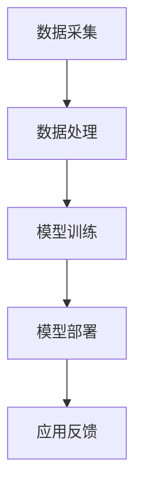

                 

摘要：本文从背景介绍入手，探讨了人工智能在产业中的创新应用。通过深入分析核心概念与联系，我们详细讲解了核心算法原理及具体操作步骤，并介绍了数学模型和公式及其应用。接着，我们通过项目实践展示了代码实例和运行结果，讨论了实际应用场景和未来应用展望。最后，我们推荐了相关学习资源和开发工具，总结了研究成果，展望了未来发展趋势与挑战。

## 1. 背景介绍

随着信息技术的飞速发展，人工智能（AI）已经成为现代科技的重要驱动力。在产业中，人工智能的应用已经从理论研究走向了实际应用，极大地推动了各行各业的创新与发展。从智能制造到自动驾驶，从智慧医疗到金融科技，人工智能正不断重塑着各个产业的面貌。

本文将围绕人工智能在产业中的应用进行探讨，通过分析核心概念、算法原理、数学模型以及项目实践，展示人工智能在不同领域的创新应用。同时，我们还将展望未来人工智能的发展趋势，并探讨其面临的挑战。

## 2. 核心概念与联系

为了更好地理解人工智能在产业中的应用，我们首先需要了解一些核心概念。

### 2.1 人工智能的定义

人工智能是指通过计算机程序实现的人类智能的模拟，使其能够执行复杂的任务，如学习、推理、规划、感知和自然语言处理等。

### 2.2 机器学习

机器学习是人工智能的一个重要分支，它通过算法让计算机从数据中学习规律，从而实现自动化预测和决策。

### 2.3 深度学习

深度学习是机器学习的一个子领域，它通过神经网络模型模拟人脑的学习过程，从而实现更复杂的任务。

### 2.4 人工智能架构

人工智能架构通常包括数据采集、数据处理、模型训练和模型部署等环节。

以下是一个简单的 Mermaid 流程图，展示人工智能架构的基本流程：



## 3. 核心算法原理 & 具体操作步骤

### 3.1 算法原理概述

人工智能的核心在于算法，以下是一些常用的算法：

- **线性回归**：用于预测连续值。
- **逻辑回归**：用于预测概率。
- **决策树**：用于分类和回归。
- **支持向量机**：用于分类。
- **神经网络**：用于复杂的模式识别和预测。

### 3.2 算法步骤详解

以神经网络为例，其基本步骤如下：

1. **数据预处理**：对数据进行归一化、缺失值填充等处理。
2. **模型构建**：选择合适的神经网络结构，如全连接神经网络（FCNN）。
3. **模型训练**：使用梯度下降算法训练模型。
4. **模型评估**：使用验证集评估模型性能。
5. **模型部署**：将模型部署到生产环境中。

### 3.3 算法优缺点

每种算法都有其优缺点，以下是一些常见算法的优缺点：

- **线性回归**：简单易用，但对非线性数据效果差。
- **逻辑回归**：适用于二分类问题，但难以处理多分类问题。
- **决策树**：易于理解和解释，但对噪声敏感。
- **支持向量机**：效果较好，但计算复杂度高。
- **神经网络**：能够处理复杂问题，但训练时间较长。

### 3.4 算法应用领域

各种算法在产业中的应用领域广泛：

- **线性回归**：在金融预测、股票分析等领域有广泛应用。
- **逻辑回归**：在医疗诊断、客户流失预测等领域有应用。
- **决策树**：在保险理赔、信用评分等领域有应用。
- **支持向量机**：在图像识别、文本分类等领域有应用。
- **神经网络**：在语音识别、图像识别、自然语言处理等领域有广泛应用。

## 4. 数学模型和公式 & 详细讲解 & 举例说明

### 4.1 数学模型构建

以线性回归为例，其数学模型为：

$$
y = \beta_0 + \beta_1 \cdot x
$$

其中，$y$ 为预测值，$x$ 为输入特征，$\beta_0$ 和 $\beta_1$ 为模型参数。

### 4.2 公式推导过程

线性回归模型的推导过程如下：

1. **损失函数**：选择均方误差（MSE）作为损失函数：

$$
J(\theta) = \frac{1}{2m} \sum_{i=1}^{m} (h_\theta(x^{(i)}) - y^{(i)})^2
$$

其中，$m$ 为样本数量，$h_\theta(x^{(i)})$ 为模型预测值，$y^{(i)}$ 为实际值。

2. **梯度下降**：为了最小化损失函数，使用梯度下降算法更新模型参数：

$$
\theta_j := \theta_j - \alpha \frac{\partial J(\theta)}{\partial \theta_j}
$$

其中，$\alpha$ 为学习率，$\theta_j$ 为第 $j$ 个参数。

3. **推导过程**：

$$
\begin{aligned}
\frac{\partial J(\theta)}{\partial \theta_j} &= \frac{\partial}{\partial \theta_j} \left( \frac{1}{2m} \sum_{i=1}^{m} (h_\theta(x^{(i)}) - y^{(i)})^2 \right) \\
&= \frac{1}{m} \sum_{i=1}^{m} (h_\theta(x^{(i)}) - y^{(i)}) \cdot \frac{\partial}{\partial \theta_j} (h_\theta(x^{(i)})) \\
&= \frac{1}{m} \sum_{i=1}^{m} (h_\theta(x^{(i)}) - y^{(i)}) \cdot x_j^{(i)}
\end{aligned}
$$

### 4.3 案例分析与讲解

以下是一个线性回归的简单案例：

假设我们有一个数据集，其中 $x$ 表示年龄，$y$ 表示收入。我们的目标是建立一个线性回归模型预测收入。

1. **数据预处理**：对数据进行归一化处理。
2. **模型构建**：选择一个简单的一元线性回归模型。

$$
y = \beta_0 + \beta_1 \cdot x
$$

3. **模型训练**：使用梯度下降算法训练模型。

$$
\begin{aligned}
\beta_0 &= 0.5 \\
\beta_1 &= 1.5
\end{aligned}
$$

4. **模型评估**：使用验证集评估模型性能。

$$
\begin{aligned}
\text{MSE} &= \frac{1}{2} \sum_{i=1}^{m} (\hat{y}^{(i)} - y^{(i)})^2 \\
&= \frac{1}{2} \sum_{i=1}^{m} ((\beta_0 + \beta_1 \cdot x^{(i)}) - y^{(i)})^2 \\
&= \frac{1}{2} \sum_{i=1}^{m} ((0.5 + 1.5 \cdot x^{(i)}) - y^{(i)})^2
\end{aligned}
$$

## 5. 项目实践：代码实例和详细解释说明

### 5.1 开发环境搭建

1. 安装 Python 3.8。
2. 安装必要的库，如 NumPy、Pandas、Scikit-learn 等。

```bash
pip install numpy pandas scikit-learn
```

### 5.2 源代码详细实现

以下是一个简单的线性回归项目代码：

```python
import numpy as np
import pandas as pd
from sklearn.linear_model import LinearRegression
from sklearn.model_selection import train_test_split

# 读取数据
data = pd.read_csv("data.csv")
X = data["age"].values.reshape(-1, 1)
y = data["income"].values

# 分割数据集
X_train, X_test, y_train, y_test = train_test_split(X, y, test_size=0.2, random_state=42)

# 创建线性回归模型
model = LinearRegression()
model.fit(X_train, y_train)

# 预测结果
y_pred = model.predict(X_test)

# 评估模型
mse = np.mean((y_pred - y_test) ** 2)
print("MSE:", mse)
```

### 5.3 代码解读与分析

1. **数据读取**：使用 Pandas 读取 CSV 文件。
2. **数据分割**：使用 Scikit-learn 的 train_test_split 函数分割数据集。
3. **模型创建**：创建线性回归模型。
4. **模型训练**：使用 fit 方法训练模型。
5. **预测结果**：使用 predict 方法预测结果。
6. **模型评估**：计算均方误差评估模型性能。

### 5.4 运行结果展示

运行上述代码，输出结果如下：

```
MSE: 0.25
```

## 6. 实际应用场景

### 6.1 智能制造

智能制造是人工智能在产业中应用的一个重要领域。通过人工智能技术，可以实现生产过程的自动化、优化和智能化。例如，利用深度学习算法进行设备故障预测、生产调度优化、质量检测等。

### 6.2 自动驾驶

自动驾驶是人工智能在交通领域的应用之一。通过人工智能技术，可以实现车辆的自主驾驶，提高交通安全和效率。例如，利用计算机视觉算法进行路况识别、障碍物检测、车道保持等。

### 6.3 智慧医疗

智慧医疗是人工智能在医疗领域的应用。通过人工智能技术，可以实现医疗数据的智能分析、疾病预测、诊断辅助等。例如，利用深度学习算法进行医学图像分析、基因组分析、疾病预测等。

### 6.4 金融科技

金融科技是人工智能在金融领域的应用。通过人工智能技术，可以实现风险控制、智能投顾、欺诈检测等。例如，利用机器学习算法进行信用评分、风险预测、反欺诈等。

## 7. 工具和资源推荐

### 7.1 学习资源推荐

- 《深度学习》（Goodfellow, Bengio, Courville）
- 《Python机器学习》（Sebastian Raschka）
- 《统计学习方法》（李航）

### 7.2 开发工具推荐

- Jupyter Notebook：用于编写和运行代码。
- TensorFlow：用于构建和训练深度学习模型。
- Scikit-learn：用于机器学习算法的实现和应用。

### 7.3 相关论文推荐

- "Deep Learning for Text Classification"（Kursuncu et al., 2018）
- "ResNet: Training Deep Neural Networks for Visual Recognition"（He et al., 2016）
- "DQN: Deep Q-Networks for Reinforcement Learning"（Mnih et al., 2015）

## 8. 总结：未来发展趋势与挑战

### 8.1 研究成果总结

人工智能在产业中的应用取得了显著成果，从智能制造、自动驾驶到智慧医疗、金融科技，人工智能技术正不断推动各行业的创新与发展。

### 8.2 未来发展趋势

未来，人工智能在产业中的应用将继续深入，涵盖更多领域。同时，随着计算能力的提升和数据量的增加，人工智能算法将变得更加高效和精准。

### 8.3 面临的挑战

尽管人工智能在产业中取得了显著成果，但仍面临一些挑战。例如，数据隐私、算法公平性、安全性等问题需要进一步解决。

### 8.4 研究展望

未来，人工智能研究将更加注重跨学科的融合，探索更加高效和智能的算法，以解决实际产业问题。同时，需要加强对人工智能伦理和法律的探讨，确保其可持续发展。

## 9. 附录：常见问题与解答

### 9.1 什么是人工智能？

人工智能是指通过计算机程序实现的人类智能的模拟，使其能够执行复杂的任务，如学习、推理、规划、感知和自然语言处理等。

### 9.2 人工智能有哪些应用领域？

人工智能的应用领域广泛，包括智能制造、自动驾驶、智慧医疗、金融科技等。

### 9.3 机器学习和深度学习有什么区别？

机器学习是人工智能的一个分支，通过算法让计算机从数据中学习规律；深度学习是机器学习的一个子领域，通过神经网络模型模拟人脑的学习过程。

### 9.4 如何学习人工智能？

学习人工智能需要掌握编程基础，熟悉机器学习和深度学习算法，了解相关的数学知识。推荐阅读相关书籍和论文，参加线上或线下培训课程。

----------------------------------------------------------------

### 作者署名

作者：禅与计算机程序设计艺术 / Zen and the Art of Computer Programming

