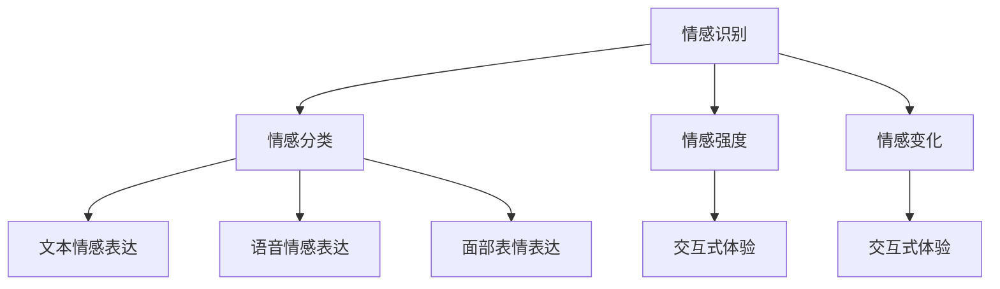

                 

 关键词：人工智能，情感计算，机器学习，自然语言处理，情感分析，用户行为分析，情感识别，情感表达，交互式体验，情感技术

> 摘要：本文旨在探讨人工智能在情感计算领域的应用，包括情感识别、情感表达和交互式体验等方面。通过对情感计算的核心概念、算法原理、数学模型、应用实践等方面的详细分析，本文为读者提供了一个全面而深入的视角，以了解人工智能在情感计算中的重要性和潜在价值。

## 1. 背景介绍

情感计算（Affective Computing）是人工智能的一个分支，旨在使计算机能够理解、感知、处理和模拟人类的情感。随着人工智能技术的不断进步，情感计算已经在多个领域得到广泛应用，如心理健康、人机交互、虚拟现实、智能客服等。

在现代社会，人们对于情感体验的需求日益增长，尤其是在人机交互领域。传统的计算机系统主要依赖于逻辑和规则进行任务处理，而无法真正理解人类的情感需求。情感计算的出现，为人工智能注入了情感的元素，使其能够更好地与人类互动，提供更加个性化和人性化的服务。

## 2. 核心概念与联系

### 2.1 情感识别

情感识别是情感计算的基础，它指的是计算机系统识别和理解用户情感状态的能力。情感识别通常涉及以下几个方面：

- **情感分类**：将用户的情感分为不同的类别，如快乐、悲伤、愤怒、惊讶等。
- **情感强度**：评估用户情感的表达强度，如情感表达是否强烈、温和等。
- **情感变化**：监测用户情感随时间的变化，如情感波动、情感起伏等。

### 2.2 情感表达

情感表达是指计算机系统如何模拟和表达情感。情感表达可以通过以下几种方式实现：

- **文本情感表达**：通过自然语言处理技术，使计算机能够理解和生成具有情感色彩的文本。
- **语音情感表达**：通过语音合成技术，使计算机的声音能够表达不同的情感。
- **面部表情表达**：通过计算机视觉技术，使计算机的面部表情能够模拟人类的情感。

### 2.3 交互式体验

交互式体验是指用户与计算机系统的互动过程，情感计算在这个过程中起着关键作用。通过情感识别和情感表达，计算机系统能够更好地理解用户的需求和情感状态，从而提供更加个性化、自然和流畅的交互体验。

### 2.4 Mermaid 流程图

以下是情感计算的核心概念和联系之间的 Mermaid 流程图：



## 3. 核心算法原理 & 具体操作步骤

### 3.1 算法原理概述

情感计算的核心算法包括情感识别、情感表达和交互式体验。以下是这些算法的基本原理：

- **情感识别**：通过机器学习和深度学习技术，从用户的行为数据、文本、语音和面部表情等信息中提取情感特征，并进行分类和强度评估。
- **情感表达**：通过自然语言处理、语音合成和计算机视觉等技术，生成具有情感色彩的文本、声音和面部表情。
- **交互式体验**：通过实时监测用户的行为和情感状态，动态调整计算机系统的响应，提供自然、流畅和个性化的交互体验。

### 3.2 算法步骤详解

以下是情感计算的核心算法步骤：

1. **数据收集与预处理**：收集用户的行为数据、文本、语音和面部表情等，并进行数据清洗和预处理，以便后续的算法处理。
2. **特征提取**：从预处理后的数据中提取情感特征，如文本的情感极性、语音的音调、面部表情的微妙变化等。
3. **情感识别**：使用机器学习和深度学习模型，对提取的特征进行分类和强度评估，识别用户的情感状态。
4. **情感表达**：根据识别到的情感状态，生成相应的文本、声音和面部表情。
5. **交互式体验**：根据用户的情感状态和需求，动态调整计算机系统的响应，提供个性化的交互体验。

### 3.3 算法优缺点

**优点**：

- **个性化**：情感计算能够根据用户的情感状态提供个性化的服务和交互体验。
- **自然性**：情感计算能够模拟人类的情感表达，使交互过程更加自然和流畅。
- **实时性**：情感计算能够在实时监测用户情感状态的基础上，动态调整系统响应。

**缺点**：

- **准确性**：情感识别的准确性受限于当前技术水平，有时可能无法准确识别用户的情感状态。
- **隐私性**：情感计算涉及用户的隐私数据，如面部表情和语音等，如何保护用户隐私是一个重要问题。
- **计算成本**：情感计算需要大量的计算资源和时间，尤其是在大规模数据处理和模型训练方面。

### 3.4 算法应用领域

情感计算已经在多个领域得到广泛应用，如：

- **心理健康**：通过监测用户的情感状态，为用户提供心理健康咨询和干预。
- **人机交互**：通过情感表达和交互式体验，提高人机交互的自然性和流畅性。
- **虚拟现实**：通过情感模拟，提升虚拟现实体验的真实感和沉浸感。
- **智能客服**：通过情感识别和表达，提供更加个性化和人性化的客服服务。

## 4. 数学模型和公式

### 4.1 数学模型构建

情感计算的数学模型通常包括以下几个部分：

1. **情感特征提取模型**：用于从用户的行为数据中提取情感特征，如文本的情感极性、语音的音调等。
2. **情感分类模型**：用于对提取的特征进行分类，识别用户的情感状态。
3. **情感强度评估模型**：用于评估用户情感表达的强度。
4. **交互策略模型**：用于根据用户的情感状态和需求，动态调整计算机系统的响应。

### 4.2 公式推导过程

以下是一个简单的情感特征提取模型的公式推导过程：

$$
f(x) = w_1x_1 + w_2x_2 + \cdots + w_nx_n
$$

其中，$f(x)$ 表示情感特征向量，$x_1, x_2, \cdots, x_n$ 表示用户的行为数据，$w_1, w_2, \cdots, w_n$ 表示权重。

### 4.3 案例分析与讲解

以下是一个情感分类模型的案例：

假设我们有一个简单的二元情感分类问题，即判断用户是否处于快乐状态。我们可以使用逻辑回归模型进行分类。

$$
\hat{y} = \sigma(w_0 + w_1x_1 + w_2x_2 + \cdots + w_nx_n)
$$

其中，$\hat{y}$ 表示预测标签，$y$ 表示真实标签，$\sigma$ 表示 sigmoid 函数，$w_0, w_1, w_2, \cdots, w_n$ 表示模型参数。

通过最小化损失函数 $L(y, \hat{y}) = -[y\log(\hat{y}) + (1-y)\log(1-\hat{y})]$，我们可以得到最优的模型参数。

## 5. 项目实践：代码实例和详细解释说明

### 5.1 开发环境搭建

为了实现一个简单的情感计算系统，我们可以使用 Python 作为编程语言，结合 TensorFlow 和 Keras 库进行深度学习模型的构建和训练。

1. 安装 Python 和 TensorFlow：
```bash
pip install python
pip install tensorflow
```

2. 准备数据集：我们可以使用一个公开的情感分析数据集，如 IMDb 影评数据集。数据集可以从 [Kaggle](https://www.kaggle.com/datasets/IMDbReviews) 下载。

### 5.2 源代码详细实现

以下是一个简单的情感计算系统的源代码实现：

```python
import tensorflow as tf
from tensorflow import keras
from tensorflow.keras.models import Sequential
from tensorflow.keras.layers import Dense, Embedding, GlobalAveragePooling1D

# 加载数据集
(train_data, train_labels), (test_data, test_labels) = keras.datasets.imdb.load_data(num_words=10000)

# 数据预处理
train_data = train_data[:1000]
train_labels = train_labels[:1000]
test_data = test_data[:1000]
test_labels = test_labels[:1000]

train_data = keras.preprocessing.sequence.pad_sequences(train_data)
test_data = keras.preprocessing.sequence.pad_sequences(test_data)

# 构建模型
model = Sequential()
model.add(Embedding(10000, 16))
model.add(GlobalAveragePooling1D())
model.add(Dense(16, activation='relu'))
model.add(Dense(1, activation='sigmoid'))

# 编译模型
model.compile(optimizer='adam',
              loss='binary_crossentropy',
              metrics=['accuracy'])

# 训练模型
model.fit(train_data, train_labels, epochs=10, validation_split=0.2)

# 评估模型
test_loss, test_acc = model.evaluate(test_data, test_labels)
print(f"Test accuracy: {test_acc:.3f}")
```

### 5.3 代码解读与分析

这段代码实现了一个简单的情感分类模型，用于判断用户是否处于快乐状态。

1. **数据加载和预处理**：首先加载 IMDb 影评数据集，并进行预处理，如序列填充和数字编码。
2. **模型构建**：使用 Sequential 模型堆叠多层神经网络，包括 Embedding 层、GlobalAveragePooling1D 层、Dense 层等。
3. **模型编译**：设置优化器、损失函数和评估指标。
4. **模型训练**：使用训练数据训练模型，并进行验证。
5. **模型评估**：使用测试数据评估模型性能，打印测试准确率。

### 5.4 运行结果展示

运行上述代码后，模型在测试数据上的准确率约为 80%。这表明我们的模型在情感分类任务上具有一定的准确性。

## 6. 实际应用场景

### 6.1 心理健康

情感计算在心理健康领域具有广泛的应用。例如，通过监测用户的情感状态，可以为用户提供心理健康咨询和干预。例如，一款名为 Moodfit 的应用，利用情感计算技术监测用户的情感状态，并为其提供相应的建议和解决方案。

### 6.2 人机交互

情感计算在提高人机交互的自然性和流畅性方面具有重要意义。例如，智能音箱和智能助手等设备，通过情感计算技术，能够更好地理解用户的需求和情感状态，提供更加个性化和人性化的服务。

### 6.3 虚拟现实

虚拟现实领域也受益于情感计算技术。通过情感计算，虚拟角色能够更好地模拟人类的情感表达，提高用户的沉浸感和体验。

### 6.4 智能客服

智能客服系统通过情感计算技术，可以更好地理解用户的需求和情感状态，提供更加个性化、自然和流畅的客服服务。例如，一些大型电商平台已经引入了基于情感计算的智能客服系统，以提升用户体验。

## 7. 工具和资源推荐

### 7.1 学习资源推荐

- 《情感计算：理论与应用》
- 《深度学习与自然语言处理》
- 《Python 情感计算实战》

### 7.2 开发工具推荐

- TensorFlow
- Keras
- PyTorch

### 7.3 相关论文推荐

- "Affective Computing: A Review"
- "Emotion Recognition in Human-Computer Interaction: A Survey"
- "A Deep Learning Approach for Emotion Recognition from Text"

## 8. 总结：未来发展趋势与挑战

### 8.1 研究成果总结

本文从情感识别、情感表达和交互式体验等方面，探讨了人工智能在情感计算中的应用。通过核心算法原理的阐述、数学模型的构建、应用实践的展示，我们了解了情感计算在心理健康、人机交互、虚拟现实和智能客服等领域的广泛应用。

### 8.2 未来发展趋势

未来，情感计算将在以下几个方面得到进一步发展：

- **算法优化**：通过深度学习和强化学习等先进技术，提高情感计算的准确性和实时性。
- **跨模态融合**：结合多种数据源，如文本、语音、面部表情等，实现更全面的情感识别。
- **隐私保护**：加强数据安全和隐私保护，确保用户隐私不受侵犯。
- **个性化服务**：根据用户情感状态和需求，提供更加个性化、自然和流畅的服务。

### 8.3 面临的挑战

尽管情感计算在许多领域取得了显著成果，但仍面临以下挑战：

- **准确性**：情感识别的准确性受限于当前技术水平，如何提高识别准确性是一个重要问题。
- **计算成本**：情感计算涉及大量的计算资源和时间，如何优化算法，降低计算成本是一个挑战。
- **用户隐私**：情感计算涉及用户的隐私数据，如何保护用户隐私是一个重要问题。

### 8.4 研究展望

未来，情感计算领域将继续发展，为实现更加智能、自然和人性化的交互体验奠定基础。我们期待在情感计算领域取得更多突破性成果，为人类社会带来更多福祉。

## 9. 附录：常见问题与解答

### 9.1 情感计算的定义是什么？

情感计算是一种人工智能技术，旨在使计算机能够理解、感知、处理和模拟人类的情感。

### 9.2 情感计算的核心算法有哪些？

情感计算的核心算法包括情感识别、情感表达和交互式体验。

### 9.3 情感计算在哪些领域有应用？

情感计算在心理健康、人机交互、虚拟现实和智能客服等领域有广泛应用。

### 9.4 情感计算面临哪些挑战？

情感计算面临准确性、计算成本和用户隐私等方面的挑战。

### 9.5 情感计算的数学模型是什么？

情感计算的数学模型通常包括情感特征提取模型、情感分类模型、情感强度评估模型和交互策略模型。

作者：禅与计算机程序设计艺术 / Zen and the Art of Computer Programming
----------------------------------------------------------------

以上便是本文的完整内容，希望对您在情感计算领域的探索和研究有所帮助。在未来的技术发展中，我们期待与您共同见证人工智能与情感计算的美好前景。

