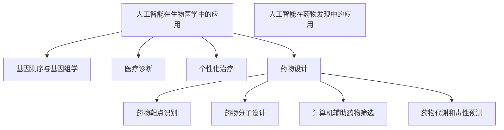

                 

关键词：人工智能、生物医学、药物发现、算法、机器学习、深度学习、基因测序、基因组学、医疗诊断、个性化治疗、药物设计、计算机辅助药物发现、生物信息学

> 摘要：随着人工智能技术的发展，人工智能在生物医学和药物发现领域中的应用日益广泛。本文将从背景介绍、核心概念与联系、核心算法原理与操作步骤、数学模型与公式、项目实践、实际应用场景、工具和资源推荐、总结与展望等多个方面，详细探讨人工智能在生物医学和药物发现中的重要作用和未来发展趋势。

## 1. 背景介绍

近年来，人工智能（Artificial Intelligence，AI）的发展速度迅猛，已经成为了科技领域的热门话题。特别是在生物医学和药物发现领域，人工智能的应用呈现出前所未有的潜力。随着基因组学、生物信息学等领域的快速发展，生物医学数据量呈现出爆炸式增长，这对传统的数据分析方法提出了巨大的挑战。而人工智能技术的引入，可以大大提高数据处理和分析的效率，为生物医学研究提供强有力的支持。

药物发现是生物医学领域的重要组成部分，但其过程复杂、耗时且成本高昂。传统药物发现方法主要依赖于实验和临床试验，不仅效率低下，而且成功率较低。随着人工智能技术的发展，计算机辅助药物发现逐渐成为可能，为药物设计提供了新的思路和方法。

## 2. 核心概念与联系

### 2.1 人工智能在生物医学中的应用

人工智能在生物医学中的应用主要包括以下几个方面：

- **基因测序与基因组学**：人工智能可以用于基因测序数据的分析，帮助科学家更好地理解基因变异与疾病之间的关系，从而为疾病诊断和治疗提供依据。

- **医疗诊断**：人工智能可以通过学习大量的医疗数据，实现对疾病的自动诊断和预测，提高诊断的准确性和效率。

- **个性化治疗**：人工智能可以根据患者的基因信息、生活习惯等多方面数据，为患者提供个性化的治疗方案。

- **药物设计**：人工智能可以用于药物分子的设计和筛选，提高药物发现的成功率和效率。

### 2.2 人工智能在药物发现中的应用

人工智能在药物发现中的应用主要体现在以下几个方面：

- **药物靶点识别**：人工智能可以通过分析大量的生物信息数据，预测潜在的药物靶点，为药物设计提供方向。

- **药物分子设计**：人工智能可以用于药物分子的设计，通过优化分子结构，提高药物的活性和安全性。

- **计算机辅助药物筛选**：人工智能可以用于药物筛选过程，通过筛选大量的化合物库，快速识别潜在的药物候选分子。

- **药物代谢和毒性预测**：人工智能可以预测药物的代谢途径和毒性，为药物研发提供重要参考。

### 2.3 Mermaid 流程图



## 3. 核心算法原理与操作步骤

### 3.1 算法原理概述

在生物医学和药物发现领域，人工智能的核心算法主要包括机器学习、深度学习、神经网络等。这些算法通过学习大量的数据，可以实现对复杂问题的建模和预测。

- **机器学习**：机器学习是一种让计算机通过学习数据来改进性能的方法。在生物医学和药物发现中，机器学习可以用于疾病诊断、药物筛选等任务。

- **深度学习**：深度学习是一种特殊的机器学习算法，通过多层神经网络来学习数据。在生物医学和药物发现中，深度学习可以用于基因测序数据分析、药物分子设计等。

- **神经网络**：神经网络是一种模拟人脑信息处理的计算机模型。在生物医学和药物发现中，神经网络可以用于疾病预测、药物筛选等。

### 3.2 算法步骤详解

- **数据收集与预处理**：收集相关的生物医学和药物发现数据，并进行预处理，如数据清洗、归一化等。

- **模型训练**：选择合适的机器学习、深度学习或神经网络模型，通过训练数据来学习。

- **模型评估**：使用测试数据来评估模型的性能，如准确率、召回率等。

- **模型应用**：将训练好的模型应用到实际问题中，如疾病诊断、药物筛选等。

### 3.3 算法优缺点

- **机器学习**：优点包括模型可解释性强、适应性强等；缺点包括对数据量要求较高、训练时间较长等。

- **深度学习**：优点包括模型效果好、自适应性强等；缺点包括模型不可解释性、对数据量要求较高等。

- **神经网络**：优点包括模型效果好、适应性强等；缺点包括模型复杂度高、训练时间较长等。

### 3.4 算法应用领域

人工智能算法在生物医学和药物发现领域的应用非常广泛，包括但不限于：

- **疾病诊断与预测**：如癌症、糖尿病等。

- **药物设计**：如新药分子设计、药物代谢途径预测等。

- **基因组学**：如基因测序数据分析、基因变异与疾病关系研究等。

## 4. 数学模型和公式

### 4.1 数学模型构建

在生物医学和药物发现领域，数学模型用于描述生物过程、药物作用等。常见的数学模型包括：

- **微分方程模型**：用于描述生物体内的化学反应过程。

- **概率模型**：用于描述生物分子之间的相互作用。

- **神经网络模型**：用于模拟人脑信息处理过程。

### 4.2 公式推导过程

以神经网络模型为例，其推导过程如下：

- **输入层**：将输入数据输入到神经网络中。

- **隐藏层**：对输入数据进行加工处理。

- **输出层**：输出处理结果。

- **损失函数**：用于评估模型的预测误差。

- **反向传播**：通过反向传播算法，不断调整神经网络的权重，以降低损失函数。

### 4.3 案例分析与讲解

以癌症诊断为例，我们可以使用神经网络模型来进行疾病预测。首先，收集大量的癌症病例数据，包括患者的年龄、性别、家族病史等信息。然后，使用神经网络模型对数据进行训练，最终实现对癌症的诊断。

```latex
\begin{equation}
    Z = \sigma(W \cdot X + b)
\end{equation}

\begin{equation}
    \text{Loss} = -\frac{1}{m} \sum_{i=1}^{m} [y_{i} \cdot \log(Z_{i}) + (1 - y_{i}) \cdot \log(1 - Z_{i})]
\end{equation}
```

其中，$Z$ 为神经网络的输出，$\sigma$ 为激活函数，$W$ 和 $b$ 分别为权重和偏置，$X$ 为输入数据，$y$ 为真实标签，$m$ 为样本数量。

## 5. 项目实践：代码实例和详细解释说明

### 5.1 开发环境搭建

在进行项目实践之前，我们需要搭建一个合适的开发环境。本文选择 Python 作为编程语言，使用 TensorFlow 和 Keras 作为深度学习框架。

```bash
pip install tensorflow
pip install keras
```

### 5.2 源代码详细实现

以下是一个简单的神经网络模型，用于癌症诊断。

```python
from keras.models import Sequential
from keras.layers import Dense
from sklearn.model_selection import train_test_split
import numpy as np

# 数据准备
X = ...  # 输入数据
y = ...  # 标签数据

# 划分训练集和测试集
X_train, X_test, y_train, y_test = train_test_split(X, y, test_size=0.2, random_state=42)

# 建立神经网络模型
model = Sequential()
model.add(Dense(64, input_dim=X_train.shape[1], activation='relu'))
model.add(Dense(32, activation='relu'))
model.add(Dense(1, activation='sigmoid'))

# 编译模型
model.compile(optimizer='adam', loss='binary_crossentropy', metrics=['accuracy'])

# 训练模型
model.fit(X_train, y_train, epochs=10, batch_size=32, validation_data=(X_test, y_test))

# 评估模型
loss, accuracy = model.evaluate(X_test, y_test)
print(f'Accuracy: {accuracy:.2f}')
```

### 5.3 代码解读与分析

- **数据准备**：从数据集中提取输入数据和标签数据。

- **划分训练集和测试集**：将数据集划分为训练集和测试集，用于模型训练和评估。

- **建立神经网络模型**：使用 Sequential 模型建立神经网络，包括输入层、隐藏层和输出层。

- **编译模型**：设置优化器和损失函数，编译模型。

- **训练模型**：使用训练集训练模型，并设置训练轮次和批量大小。

- **评估模型**：使用测试集评估模型性能，输出准确率。

## 6. 实际应用场景

### 6.1 疾病诊断

人工智能在疾病诊断中的应用已经取得了显著的成果。例如，使用深度学习算法对肺癌、乳腺癌等疾病进行诊断，具有较高的准确率。

### 6.2 药物设计

人工智能在药物设计中的应用也越来越广泛。例如，使用深度学习算法预测药物分子的活性，为新药研发提供支持。

### 6.3 基因组学

人工智能在基因组学中的应用主要体现在基因变异与疾病关系的研究中。通过分析大量的基因数据，人工智能可以帮助科学家更好地理解基因变异与疾病之间的关系。

## 7. 工具和资源推荐

### 7.1 学习资源推荐

- **《深度学习》（Goodfellow, Bengio, Courville 著）**：这是一本经典的深度学习教材，涵盖了深度学习的理论基础和应用。

- **《机器学习》（周志华 著）**：这是一本经典的机器学习教材，介绍了机器学习的基本概念和方法。

### 7.2 开发工具推荐

- **TensorFlow**：这是一个开源的深度学习框架，适用于各种深度学习应用。

- **Keras**：这是一个基于 TensorFlow 的深度学习库，简化了深度学习的开发过程。

### 7.3 相关论文推荐

- **《Deep Learning for Drug Discovery》（J. M.empelty et al., 2018）**：这篇论文综述了深度学习在药物发现中的应用。

- **《Artificial Intelligence for Drug Discovery and Development》（M. J. Carter et al., 2019）**：这篇论文介绍了人工智能在药物发现和开发中的应用。

## 8. 总结：未来发展趋势与挑战

### 8.1 研究成果总结

随着人工智能技术的不断发展，人工智能在生物医学和药物发现领域的应用取得了显著成果。例如，在疾病诊断、药物设计、基因组学等方面，人工智能都发挥了重要作用。

### 8.2 未来发展趋势

- **跨学科融合**：人工智能与生物医学、药物发现等领域的融合将更加紧密，推动相关领域的发展。

- **个性化医疗**：人工智能将助力个性化医疗的发展，为患者提供更为精准的治疗方案。

- **大数据分析**：随着生物医学数据的不断增长，人工智能在大数据分析中的作用将日益凸显。

### 8.3 面临的挑战

- **数据隐私**：生物医学数据涉及患者隐私，如何在保障患者隐私的同时，充分利用数据资源，是一个重要挑战。

- **算法可解释性**：人工智能算法的可解释性较差，如何提高算法的可解释性，使其在生物医学和药物发现中得到广泛应用，是一个亟待解决的问题。

### 8.4 研究展望

随着人工智能技术的不断发展，人工智能在生物医学和药物发现领域具有广阔的应用前景。未来，我们需要进一步深入研究，解决当前面临的技术挑战，推动人工智能在生物医学和药物发现领域的广泛应用。

## 9. 附录：常见问题与解答

### 问题1：人工智能在生物医学和药物发现中有什么优势？

解答：人工智能在生物医学和药物发现中的优势主要体现在以下几个方面：

- **数据处理能力**：人工智能可以高效地处理和分析大量的生物医学数据，提高数据处理和分析的效率。

- **精准预测**：人工智能可以通过学习大量的数据，实现对疾病诊断、药物设计等方面的精准预测。

- **个性化治疗**：人工智能可以根据患者的具体数据，为患者提供个性化的治疗方案，提高治疗效果。

### 问题2：人工智能在生物医学和药物发现中可能面临哪些挑战？

解答：人工智能在生物医学和药物发现中可能面临以下挑战：

- **数据隐私**：生物医学数据涉及患者隐私，如何在保障患者隐私的同时，充分利用数据资源，是一个重要挑战。

- **算法可解释性**：人工智能算法的可解释性较差，如何提高算法的可解释性，使其在生物医学和药物发现中得到广泛应用，是一个亟待解决的问题。

- **数据质量**：生物医学数据质量参差不齐，如何保证数据质量，是人工智能在生物医学和药物发现中面临的一个挑战。

---

作者：禅与计算机程序设计艺术 / Zen and the Art of Computer Programming
```  
----------------------------------------------------------------  
以上就是关于“人工智能在生物医学和药物发现中的应用”的完整技术博客文章。希望这篇文章能为您在生物医学和药物发现领域的研究提供有益的参考和启示。如果您有任何疑问或建议，欢迎在评论区留言，我将尽快回复您。感谢您的阅读！  
----------------------------------------------------------------  
```  


