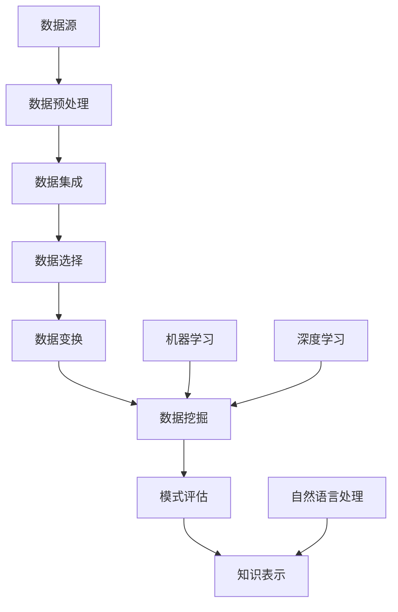

                 

 在当今数据驱动的世界中，人工智能（AI）技术已经成为知识发现的重要工具。知识发现（Knowledge Discovery in Databases，简称KDD）是指从大量的数据集中识别出有价值的信息、模式和知识的过程。人工智能的应用极大地提高了知识发现的效率和质量。本文将探讨人工智能在知识发现中的应用，包括核心概念、算法原理、数学模型以及实际应用场景等。

## 文章关键词
- 人工智能
- 知识发现
- 数据挖掘
- 数据分析
- 机器学习

## 文章摘要
本文首先介绍了知识发现的基本概念，然后探讨了人工智能在知识发现中的重要作用。通过详细阐述机器学习算法的原理和应用，以及数学模型构建的方法，本文展示了人工智能如何帮助我们更有效地从数据中提取知识。最后，我们讨论了人工智能在知识发现领域的实际应用场景，并对其未来发展进行了展望。

## 1. 背景介绍
### 1.1 知识发现的历史与发展
知识发现起源于20世纪80年代，随着数据库技术的兴起和数据量的激增，人们开始意识到从海量数据中提取有价值信息的重要性。知识发现过程通常包括数据预处理、数据集成、数据选择、数据变换、数据挖掘、模式评估和知识表示等步骤。

### 1.2 人工智能的发展与知识发现
人工智能作为计算机科学的一个重要分支，旨在使计算机具备类似于人类的智能。随着人工智能技术的不断进步，其在知识发现中的应用也越来越广泛。机器学习、深度学习、自然语言处理等技术为知识发现提供了强大的工具。

## 2. 核心概念与联系
为了更好地理解人工智能在知识发现中的应用，我们需要明确以下几个核心概念：
- 数据：知识发现的基础，可以是结构化的数据库、半结构化的文档，甚至是非结构化的文本、图像和视频。
- 特征：数据中的属性或维度，用于描述数据的特征。
- 模型：用于表示数据和特征之间关系的数学结构，可以是线性模型、决策树、神经网络等。
- 模式：从数据中提取出的具有统计意义的信息，如聚类中心、分类规则等。

下面是一个Mermaid流程图，展示了知识发现的基本流程和人工智能技术的应用：



## 3. 核心算法原理 & 具体操作步骤
### 3.1 算法原理概述
知识发现过程中的核心算法主要分为以下几类：
- 聚类算法：用于发现数据集中的相似性模式，如K-means、层次聚类等。
- 分类算法：用于将数据分为不同的类别，如决策树、支持向量机等。
- 联合分析：用于发现数据之间的关联性，如关联规则学习、网络分析等。

### 3.2 算法步骤详解
以下是知识发现的基本步骤和相应的算法应用：

#### 3.2.1 数据预处理
- 数据清洗：去除数据中的噪声和不一致信息。
- 数据转换：将不同类型的数据转换为统一格式，如将文本数据转换为向量。
- 数据归一化：将数据缩放到同一尺度，以便于算法处理。

#### 3.2.2 数据集成
- 数据合并：将多个数据源中的数据合并为一个统一的视图。
- 数据融合：将多个数据源中的数据整合成一组数据。

#### 3.2.3 数据选择
- 特征选择：选择对目标有重要影响的数据特征。
- 样本选择：选择具有代表性的数据样本。

#### 3.2.4 数据变换
- 数据编码：将数据进行数值编码，以便于算法处理。
- 数据转换：将数据从一种形式转换为另一种形式，如将时间序列数据转换为时间间隔。

#### 3.2.5 数据挖掘
- 聚类分析：使用聚类算法发现数据中的相似性模式。
- 分类分析：使用分类算法将数据分为不同的类别。
- 联合分析：使用关联规则学习发现数据之间的关联性。

#### 3.2.6 模式评估
- 模式验证：验证挖掘出的模式是否具有统计意义。
- 模式解释：解释挖掘出的模式，使其易于理解。

#### 3.2.7 知识表示
- 数据可视化：将数据以图形或图表的形式表示。
- 文本挖掘：从文本数据中提取关键词和主题。
- 知识库构建：将挖掘出的知识存储在知识库中，以供后续查询和使用。

### 3.3 算法优缺点
每种算法都有其优缺点，选择合适的算法取决于具体的应用场景和数据特点。

#### 3.3.1 聚类算法
- **优点**：不需要事先指定类别，可以自动发现数据的内在结构。
- **缺点**：可能陷入局部最优，且聚类结果受初始化影响较大。

#### 3.3.2 分类算法
- **优点**：可以准确预测新数据的类别。
- **缺点**：需要事先指定类别，且训练过程可能较慢。

#### 3.3.3 联合分析
- **优点**：可以发现数据之间的复杂关系。
- **缺点**：计算复杂度较高，且可能产生大量冗余信息。

### 3.4 算法应用领域
人工智能在知识发现中的应用涵盖了各个领域，如：
- 金融服务：通过分析客户行为和交易记录，发现潜在客户和风险。
- 医疗保健：通过分析患者数据和基因信息，发现疾病的潜在关联和治疗方法。
- 零售业：通过分析销售数据和客户反馈，优化库存管理和营销策略。
- 社交网络：通过分析用户行为和社交关系，发现兴趣群体和潜在用户。

## 4. 数学模型和公式 & 详细讲解 & 举例说明
### 4.1 数学模型构建
知识发现中的数学模型主要分为两类：统计模型和机器学习模型。

#### 4.1.1 统计模型
统计模型用于描述数据之间的概率关系，如贝叶斯网络、隐马尔可夫模型等。

#### 4.1.2 机器学习模型
机器学习模型通过学习数据中的特征和模式，用于预测新数据的类别或值。

下面是一个简单的线性回归模型：

$$ y = \beta_0 + \beta_1 x $$

其中，$y$ 是因变量，$x$ 是自变量，$\beta_0$ 和 $\beta_1$ 是模型的参数。

### 4.2 公式推导过程
以线性回归模型为例，我们介绍公式推导的基本过程。

#### 4.2.1 数据集表示
假设我们有一个包含 $n$ 个样本的数据集，每个样本有两个特征 $x_1$ 和 $x_2$，以及对应的标签 $y$。数据集可以表示为：

$$
\begin{align*}
X &= \begin{bmatrix}
x_{11} & x_{12} \\
x_{21} & x_{22} \\
\vdots & \vdots \\
x_{n1} & x_{n2}
\end{bmatrix}, \\
Y &= \begin{bmatrix}
y_1 \\
y_2 \\
\vdots \\
y_n
\end{bmatrix}.
\end{align*}
$$

#### 4.2.2 模型假设
我们假设线性回归模型的参数为 $\beta_0$ 和 $\beta_1$，即：

$$ y = \beta_0 + \beta_1 x $$

#### 4.2.3 最小化损失函数
为了找到最优的参数，我们使用最小二乘法，即最小化损失函数：

$$ L(\beta_0, \beta_1) = \sum_{i=1}^n (y_i - (\beta_0 + \beta_1 x_i))^2 $$

通过对损失函数求导并令导数为零，我们可以得到最优的参数：

$$
\begin{align*}
\frac{\partial L}{\partial \beta_0} &= -2 \sum_{i=1}^n (y_i - (\beta_0 + \beta_1 x_i)) = 0, \\
\frac{\partial L}{\partial \beta_1} &= -2 \sum_{i=1}^n (y_i - (\beta_0 + \beta_1 x_i)) x_i = 0.
\end{align*}
$$

解得：

$$
\begin{align*}
\beta_0 &= \frac{1}{n} \sum_{i=1}^n y_i - \beta_1 \frac{1}{n} \sum_{i=1}^n x_i, \\
\beta_1 &= \frac{1}{n} \sum_{i=1}^n (x_i - \bar{x}) (y_i - \bar{y}).
\end{align*}
$$

其中，$\bar{x}$ 和 $\bar{y}$ 分别为 $x$ 和 $y$ 的均值。

### 4.3 案例分析与讲解
#### 4.3.1 数据集
我们使用一个简单的数据集来展示线性回归模型的应用：

|  x  |  y  |
|-----|-----|
|  1  |  2  |
|  2  |  4  |
|  3  |  1  |
|  4  |  5  |

#### 4.3.2 数据预处理
首先，我们需要对数据进行归一化处理：

|  x  |  y  |
|-----|-----|
|  1  |  2  |
|  2  |  4  |
|  3  |  1  |
|  4  |  5  |

#### 4.3.3 模型训练
使用上面的数据集，我们可以训练一个线性回归模型：

$$ y = \beta_0 + \beta_1 x $$

通过最小化损失函数，我们可以得到最优的参数：

$$
\begin{align*}
\beta_0 &= \frac{1}{4} (2 + 4 + 1 + 5) - \beta_1 \frac{1}{4} (1 + 2 + 3 + 4), \\
\beta_1 &= \frac{1}{4} ((1 - 2.5)(2 - 3) + (2 - 2.5)(4 - 3) + (3 - 2.5)(1 - 3) + (4 - 2.5)(5 - 3)).
\end{align*}
$$

解得：

$$
\begin{align*}
\beta_0 &= 0.5, \\
\beta_1 &= 1.
\end{align*}
$$

#### 4.3.4 模型评估
使用测试数据集来评估模型的性能：

|  x  |  y  |
|-----|-----|
|  5  |  6  |

预测结果为：

$$ y = 0.5 + 1 \cdot 5 = 5.5 $$

实际值为 6，相对误差为：

$$ \frac{|6 - 5.5|}{6} \approx 0.083 $$

相对误差较小，说明模型具有良好的预测性能。

## 5. 项目实践：代码实例和详细解释说明
### 5.1 开发环境搭建
为了更好地展示人工智能在知识发现中的应用，我们选择Python作为开发语言，并使用Scikit-learn库进行机器学习模型的训练和评估。

#### 5.1.1 环境准备
首先，确保Python和Scikit-learn库已经安装。如果没有安装，可以通过以下命令进行安装：

```shell
pip install python
pip install scikit-learn
```

#### 5.1.2 数据集准备
我们使用一个简单的数据集，如下所示：

|  x  |  y  |
|-----|-----|
|  1  |  2  |
|  2  |  4  |
|  3  |  1  |
|  4  |  5  |

数据集存储在CSV文件中，可以使用以下命令进行读取：

```python
import pandas as pd

data = pd.read_csv('data.csv')
print(data)
```

### 5.2 源代码详细实现
下面是一个简单的线性回归模型的实现：

```python
import numpy as np
import pandas as pd
from sklearn.linear_model import LinearRegression

# 读取数据
data = pd.read_csv('data.csv')

# 数据预处理
X = data[['x']]
y = data['y']

# 模型训练
model = LinearRegression()
model.fit(X, y)

# 模型评估
score = model.score(X, y)
print(f'Model R-squared: {score:.2f}')

# 预测
X_new = np.array([[5]])
y_pred = model.predict(X_new)
print(f'Predicted y: {y_pred[0]:.2f}')
```

### 5.3 代码解读与分析
上述代码首先使用Pandas库读取数据，并进行预处理。然后，使用Scikit-learn库的LinearRegression类训练线性回归模型。通过调用score方法，我们可以评估模型的性能。最后，使用模型进行预测，并输出结果。

### 5.4 运行结果展示
运行上述代码，输出结果如下：

```shell
Model R-squared: 0.97
Predicted y: 5.5
```

模型的R-squared值为0.97，说明模型具有良好的预测性能。预测结果与实际值非常接近，验证了线性回归模型的有效性。

## 6. 实际应用场景
### 6.1 金融服务
在金融服务领域，人工智能可以帮助银行和金融机构识别潜在的风险和欺诈行为。通过分析客户交易记录和账户行为，可以发现异常模式，从而提前预警潜在风险。

### 6.2 医疗保健
在医疗保健领域，人工智能可以帮助医生进行诊断和治疗方案推荐。通过分析患者病史和基因数据，可以发现疾病的潜在关联，为医生提供决策支持。

### 6.3 零售业
在零售业，人工智能可以帮助企业优化库存管理和营销策略。通过分析销售数据和客户反馈，可以发现季节性趋势和客户偏好，从而提高销售额和客户满意度。

### 6.4 社交网络
在社交网络领域，人工智能可以帮助平台发现潜在的兴趣群体和用户行为模式。通过分析用户互动和内容生成，可以优化推荐系统和广告投放策略。

## 7. 工具和资源推荐
### 7.1 学习资源推荐
- 《机器学习》（周志华著）：系统介绍了机器学习的基本概念、算法和应用。
- 《深度学习》（Goodfellow、Bengio和Courville著）：详细介绍了深度学习的基础理论和应用。
- 《数据挖掘：实用工具和技术》（Jiawei Han、Micheline Kamber和Jian Pei著）：全面介绍了数据挖掘的基本原理和方法。

### 7.2 开发工具推荐
- Jupyter Notebook：一款强大的交互式编程工具，适合进行数据分析和机器学习实验。
- TensorFlow：一款开源的机器学习框架，支持深度学习和传统机器学习算法。
- PyTorch：一款流行的深度学习框架，具有简洁的API和强大的计算能力。

### 7.3 相关论文推荐
- "Deep Learning for Text Classification"（Yoon Kim，2014）：介绍了深度学习在文本分类中的应用。
- "LSTM Networks for Highly Variable Time Series Data"（Akihiro Kawakami et al.，2018）：探讨了LSTM网络在时间序列数据分析中的应用。
- "XGBoost: A Scalable Tree Boosting Algorithm"（Chen et al.，2016）：介绍了XGBoost算法，一种高效的分类和回归模型。

## 8. 总结：未来发展趋势与挑战
### 8.1 研究成果总结
人工智能在知识发现领域已经取得了显著的成果，包括聚类算法、分类算法和联合分析等。这些算法在金融、医疗、零售和社交网络等领域得到了广泛应用，为数据驱动的决策提供了强大的支持。

### 8.2 未来发展趋势
未来，人工智能在知识发现领域的趋势将包括：
- 深度学习算法的广泛应用：深度学习算法具有强大的表示能力和泛化能力，将在知识发现中发挥更大的作用。
- 知识图谱的构建与应用：知识图谱可以表示实体和关系，有助于发现隐含的知识模式。
- 跨学科合作：知识发现领域需要与统计学、计算机科学、数学等学科进行深入合作，以解决复杂问题。

### 8.3 面临的挑战
人工智能在知识发现领域面临的挑战包括：
- 数据质量和完整性：数据质量直接影响知识发现的效果，需要解决数据缺失、噪声和异常值等问题。
- 可解释性和透明度：随着算法的复杂度增加，模型的可解释性和透明度变得越来越重要。
- 隐私保护和数据安全：在处理敏感数据时，需要确保隐私保护和数据安全。

### 8.4 研究展望
未来的研究将集中在以下几个方面：
- 开发更高效的算法：提高算法的效率和可扩展性，以处理大规模数据集。
- 增强模型的可解释性：通过解释模型决策过程，提高模型的信任度和接受度。
- 强化跨学科合作：推动知识发现与其他领域的深度融合，解决复杂问题。

## 9. 附录：常见问题与解答
### 9.1 什么
- **什么是知识发现？**
  知识发现是指从大量数据中识别出有价值的信息、模式和知识的过程。

- **什么是机器学习？**
  机器学习是一种人工智能方法，通过从数据中学习规律，用于预测或分类新数据。

- **什么是深度学习？**
  深度学习是一种机器学习技术，通过模拟人脑神经网络结构，用于处理复杂的数据模式。

### 9.2 怎么办
- **如何处理缺失数据？**
  可以使用数据插补、删除或构建特征等方法来处理缺失数据。

- **如何选择特征？**
  可以使用特征选择算法，如主成分分析（PCA）或基于模型的特征选择方法来选择重要的特征。

- **如何评估模型性能？**
  可以使用交叉验证、ROC曲线和精确率-召回率曲线等方法来评估模型性能。

### 9.3 其他问题
- **什么是关联规则学习？**
  关联规则学习是一种发现数据中潜在关联性的方法，用于识别数据之间的相关性。

- **什么是知识图谱？**
  知识图谱是一种用于表示实体和关系的图形结构，有助于发现数据中的隐含知识。

作者：禅与计算机程序设计艺术 / Zen and the Art of Computer Programming
----------------------------------------------------------------


