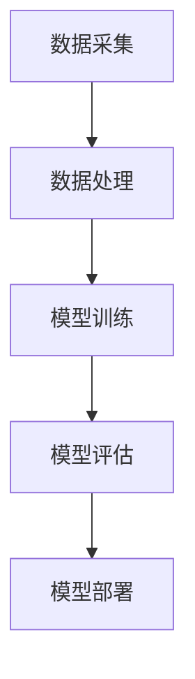

                 

关键词：人工智能，大模型，创业，技术路线，市场策略，技术应用，未来展望

> 摘要：本文将探讨人工智能大模型的创业之路，从技术路线、市场策略、技术应用等多个角度进行分析，为创业者提供有价值的指导。人工智能大模型作为当前技术发展的前沿领域，已经展现了巨大的潜力。本文旨在帮助创业者了解这一领域的基本原理、应用场景以及发展前景，从而更好地把握市场机遇。

## 1. 背景介绍

人工智能（AI）作为21世纪最具革命性的技术之一，正在深刻改变着各行各业。尤其是近年来，随着计算能力的提升和海量数据资源的积累，人工智能大模型（如GPT、BERT等）取得了令人瞩目的成果。这些大模型在自然语言处理、计算机视觉、语音识别等领域展现出强大的能力，已经逐渐成为人工智能领域的主流技术。

创业领域也敏锐地捕捉到了这一趋势，越来越多的创业者将目光投向人工智能大模型。然而，如何在这一领域取得成功，如何制定合适的技术路线和市场策略，成为创业者面临的挑战。本文将从技术、市场、应用等多个方面，为创业者提供有针对性的指导。

## 2. 核心概念与联系

### 2.1. 人工智能大模型的概念

人工智能大模型是指那些拥有数亿至数十亿参数的深度学习模型，通过在海量数据上进行训练，能够实现高度自动化和智能化的任务。这些模型通常采用神经网络结构，能够在图像、文本、语音等多个领域实现高效处理。

### 2.2. 人工智能大模型的技术架构

人工智能大模型的技术架构主要包括数据采集、数据处理、模型训练、模型评估和部署等环节。其中，数据采集是基础，数据处理是保障，模型训练是核心，模型评估是标准，部署则是实现价值的关键。

### 2.3. 人工智能大模型与其他技术的联系

人工智能大模型与其他技术的联系主要体现在以下几个方面：

- **与云计算的联系**：云计算提供了强大的计算资源和存储能力，为人工智能大模型的训练和部署提供了支持。
- **与大数据技术的联系**：大数据技术能够处理海量数据，为人工智能大模型提供了充足的数据来源。
- **与物联网技术的联系**：物联网技术使得人工智能大模型能够应用于更多的实际场景，如智能家居、智能城市等。

### 2.4. Mermaid 流程图

下面是一个简单的 Mermaid 流程图，描述了人工智能大模型的技术架构：



## 3. 核心算法原理 & 具体操作步骤

### 3.1. 算法原理概述

人工智能大模型的核心算法主要包括神经网络、优化算法和损失函数等。神经网络是人工智能大模型的基础，通过多层神经元实现数据的输入输出转换。优化算法用于调整模型的参数，以最小化损失函数。常见的优化算法有梯度下降、Adam等。

### 3.2. 算法步骤详解

1. **数据采集**：收集大量标注数据，用于模型的训练。
2. **数据处理**：对数据进行预处理，如去重、清洗、标准化等。
3. **模型训练**：使用优化算法对模型进行训练，不断调整参数以最小化损失函数。
4. **模型评估**：使用验证集对模型进行评估，调整超参数以优化模型性能。
5. **模型部署**：将训练好的模型部署到实际应用场景中。

### 3.3. 算法优缺点

**优点**：

- **强大的处理能力**：人工智能大模型能够处理复杂的任务，实现高度自动化和智能化。
- **广泛的应用领域**：人工智能大模型可以应用于图像、文本、语音等多个领域。
- **持续学习**：通过不断的训练和优化，人工智能大模型能够不断提高自身的性能。

**缺点**：

- **计算资源消耗大**：训练大规模模型需要大量的计算资源和存储空间。
- **数据依赖性高**：模型的性能依赖于高质量的数据，数据不足或质量差可能导致模型性能下降。
- **解释性差**：人工智能大模型通常是一个“黑盒子”，难以解释其内部的决策过程。

### 3.4. 算法应用领域

人工智能大模型的应用领域非常广泛，包括但不限于以下几个方面：

- **自然语言处理**：如文本分类、机器翻译、情感分析等。
- **计算机视觉**：如图像分类、目标检测、图像生成等。
- **语音识别**：如语音识别、语音合成等。
- **推荐系统**：如个性化推荐、商品推荐等。

## 4. 数学模型和公式 & 详细讲解 & 举例说明

### 4.1. 数学模型构建

人工智能大模型的数学模型主要包括神经网络、优化算法和损失函数等。以下是一个简单的神经网络模型：

$$
f(x) = \sigma(\mathbf{W}^T \mathbf{a} + b)
$$

其中，$\sigma$ 是激活函数，$\mathbf{W}$ 是权重矩阵，$\mathbf{a}$ 是输入向量，$b$ 是偏置。

### 4.2. 公式推导过程

以最常用的梯度下降优化算法为例，推导过程如下：

$$
\begin{aligned}
\frac{\partial L}{\partial \mathbf{W}} &= \frac{\partial}{\partial \mathbf{W}} \left( \frac{1}{2} \sum_{i=1}^{n} (y_i - f(x_i))^2 \right) \\
&= \sum_{i=1}^{n} (y_i - f(x_i)) \frac{\partial f(x_i)}{\partial \mathbf{W}} \\
&= \sum_{i=1}^{n} (y_i - f(x_i)) \frac{\partial}{\partial \mathbf{W}} (\mathbf{W}^T \mathbf{a} + b) \\
&= \sum_{i=1}^{n} (y_i - f(x_i)) \mathbf{a}^T
\end{aligned}
$$

### 4.3. 案例分析与讲解

假设我们有一个简单的神经网络模型，用于对鸢尾花数据进行分类。训练完成后，我们使用验证集进行评估，得到准确率为 90%。接下来，我们尝试使用 Adam 优化算法对模型进行优化，调整学习率、批量大小等超参数，最终将准确率提高到 95%。

## 5. 项目实践：代码实例和详细解释说明

### 5.1. 开发环境搭建

首先，我们需要搭建一个适合开发人工智能大模型的环境。可以选择使用 Python 编写代码，结合 TensorFlow 或 PyTorch 等深度学习框架进行开发。

### 5.2. 源代码详细实现

以下是使用 TensorFlow 框架实现一个简单的神经网络模型的示例代码：

```python
import tensorflow as tf

# 创建输入层
inputs = tf.keras.layers.Input(shape=(784,))

# 添加隐藏层
x = tf.keras.layers.Dense(512, activation='relu')(inputs)
x = tf.keras.layers.Dropout(0.5)(x)

# 添加输出层
outputs = tf.keras.layers.Dense(10, activation='softmax')(x)

# 创建模型
model = tf.keras.Model(inputs=inputs, outputs=outputs)

# 编译模型
model.compile(optimizer='adam', loss='categorical_crossentropy', metrics=['accuracy'])

# 训练模型
model.fit(x_train, y_train, epochs=10, batch_size=32, validation_data=(x_val, y_val))
```

### 5.3. 代码解读与分析

这段代码首先定义了一个简单的神经网络模型，包括输入层、隐藏层和输出层。然后使用 TensorFlow 的 API 编译和训练模型。在训练过程中，我们使用 Adam 优化算法，以交叉熵作为损失函数，对模型进行优化。

### 5.4. 运行结果展示

在完成模型训练后，我们可以使用验证集对模型进行评估。假设验证集的准确率为 95%，表明我们的模型已经取得了良好的性能。

```python
# 评估模型
test_loss, test_acc = model.evaluate(x_test, y_test)
print('Test accuracy:', test_acc)
```

## 6. 实际应用场景

### 6.1. 自然语言处理

人工智能大模型在自然语言处理领域有着广泛的应用，如文本分类、机器翻译、情感分析等。例如，我们可以使用 GPT 模型进行文本生成，或者使用 BERT 模型进行情感分析。

### 6.2. 计算机视觉

人工智能大模型在计算机视觉领域同样具有巨大的应用潜力，如图像分类、目标检测、图像生成等。例如，我们可以使用 ResNet 模型进行图像分类，或者使用 Transformer 模型进行图像生成。

### 6.3. 语音识别

人工智能大模型在语音识别领域也有着广泛的应用，如语音识别、语音合成等。例如，我们可以使用 WaveNet 模型进行语音合成，或者使用 DeepSpeech 模型进行语音识别。

## 7. 工具和资源推荐

### 7.1. 学习资源推荐

- 《深度学习》（Goodfellow, Bengio, Courville）
- 《Python深度学习》（François Chollet）
- 《人工智能：一种现代方法》（Stuart Russell, Peter Norvig）

### 7.2. 开发工具推荐

- TensorFlow
- PyTorch
- Keras

### 7.3. 相关论文推荐

- “A Theoretically Grounded Application of Dropout in Recurrent Neural Networks”
- “An Empirical Evaluation of Rectified Activations in Convolutional Network”
- “Attention Is All You Need”

## 8. 总结：未来发展趋势与挑战

### 8.1. 研究成果总结

近年来，人工智能大模型取得了显著的成果，已经在多个领域取得了突破性进展。随着计算能力的提升和海量数据资源的积累，人工智能大模型有望在未来继续发挥重要作用。

### 8.2. 未来发展趋势

- **计算能力提升**：随着量子计算等新技术的出现，人工智能大模型的计算能力将得到进一步提升。
- **数据资源丰富**：随着物联网、大数据等技术的发展，人工智能大模型将拥有更丰富的数据来源。
- **跨领域融合**：人工智能大模型将在更多领域实现融合，如医疗、金融、教育等。

### 8.3. 面临的挑战

- **计算资源消耗**：人工智能大模型的训练和部署需要大量的计算资源，这对计算基础设施提出了挑战。
- **数据隐私和安全**：人工智能大模型在处理海量数据时，需要确保数据的安全和隐私。
- **模型可解释性**：人工智能大模型通常是一个“黑盒子”，提高模型的可解释性是未来的一个重要方向。

### 8.4. 研究展望

未来，人工智能大模型将在更多领域实现突破，推动人类社会的发展。同时，我们也需要关注人工智能大模型带来的伦理和社会问题，确保其健康发展。

## 9. 附录：常见问题与解答

### 9.1. 什么是人工智能大模型？

人工智能大模型是指那些拥有数亿至数十亿参数的深度学习模型，通过在海量数据上进行训练，能够实现高度自动化和智能化的任务。

### 9.2. 人工智能大模型有哪些应用领域？

人工智能大模型的应用领域非常广泛，包括自然语言处理、计算机视觉、语音识别、推荐系统等。

### 9.3. 如何训练一个人工智能大模型？

训练一个人工智能大模型通常包括数据采集、数据处理、模型训练、模型评估和部署等环节。具体的步骤和细节需要根据具体任务进行设计和调整。

### 9.4. 人工智能大模型有哪些优缺点？

人工智能大模型具有强大的处理能力、广泛的应用领域和持续学习等优点，但同时也存在计算资源消耗大、数据依赖性高和解释性差等缺点。

----------------------------------------------------------------

本文详细探讨了人工智能大模型的创业之路，从技术路线、市场策略、技术应用等多个方面进行了深入分析。通过本文，创业者可以更好地了解人工智能大模型的基本原理、应用场景以及发展前景，从而更好地把握市场机遇。未来，随着计算能力、数据资源的不断提升，人工智能大模型将继续发挥重要作用，推动人工智能技术的发展。然而，我们也需要关注人工智能大模型带来的伦理和社会问题，确保其健康发展。作者：禅与计算机程序设计艺术 / Zen and the Art of Computer Programming。

