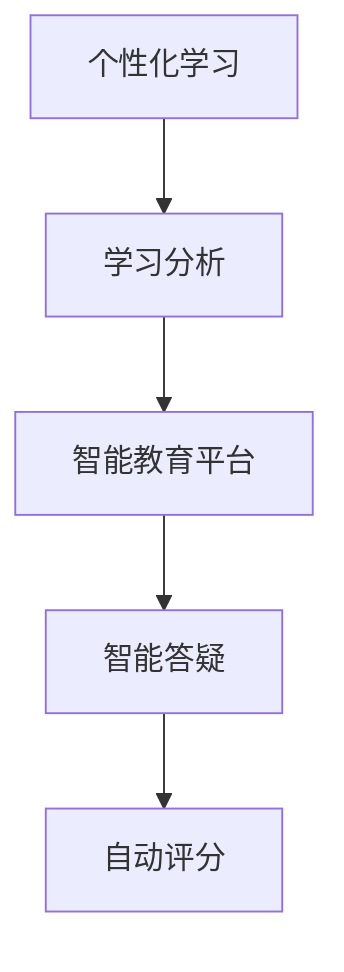

                 

关键词：人工智能，教育变革，教育技术，学习模式，学习分析，智能教育平台，个性化学习

> 摘要：本文探讨了人工智能（AI）在现代教育领域的应用，分析了AI如何通过个性化学习、学习分析、智能教育平台等技术手段，推动教育变革。文章首先介绍了AI在教育中的应用现状，随后深入讨论了AI在教育中的核心作用，并通过具体案例展示了AI在实际教学中的应用。最后，文章总结了AI在教育中面临的挑战，并提出了未来发展的方向。

## 1. 背景介绍

教育作为社会发展的基石，一直在不断进步与变革。传统教育以教师为中心，学生被动接受知识，学习效果参差不齐。然而，随着科技的飞速发展，特别是人工智能技术的兴起，教育模式正经历深刻的变革。人工智能在教育中的应用不仅提升了教育质量，还为学生提供了更加个性化和智能化的学习体验。

### 1.1 人工智能的定义与应用

人工智能（Artificial Intelligence，简称AI）是指由人制造出来的系统能够感知环境、理解复杂问题并采取行动的能力。AI在各个领域的应用日益广泛，包括语音识别、图像处理、自然语言处理、智能推荐等。在教育领域，AI通过智能教育平台、学习分析工具、虚拟教师等技术手段，为学生提供个性化学习支持。

### 1.2 教育技术的演变

教育技术的演变经历了从传统教学到多媒体教学，再到如今的信息化教学和智能教学的历程。信息化教学以计算机和网络为基础，提供了丰富的学习资源。而智能教学则在此基础上，利用人工智能技术，实现了教学过程的数据化和智能化。

## 2. 核心概念与联系

### 2.1 个性化学习

个性化学习是基于学生个体差异，为其量身定制学习内容、方法和进度的教育理念。AI可以通过分析学生的学习数据，了解其学习习惯、兴趣和能力，从而提供个性化的学习支持。

### 2.2 学习分析

学习分析是指利用数据分析技术，对学生的学习行为、成绩和反馈进行分析，以优化教育过程。AI可以自动收集和分析学生的学习数据，帮助教师识别学习中的问题，并提出针对性的解决方案。

### 2.3 智能教育平台

智能教育平台是集成了AI技术的教育系统，能够提供智能课程推荐、自动评分、智能答疑等功能。智能教育平台通过AI技术，实现了教学过程的自动化和智能化。

### 2.4 Mermaid 流程图



## 3. 核心算法原理 & 具体操作步骤

### 3.1 算法原理概述

AI在教育中的应用主要包括机器学习、深度学习和自然语言处理等技术。这些技术可以对学生行为数据进行分析，为个性化学习提供支持。

### 3.2 算法步骤详解

1. 数据收集：收集学生的行为数据，如学习时间、学习内容、考试成绩等。
2. 数据预处理：对收集到的数据进行清洗、归一化等处理，以便后续分析。
3. 特征提取：从数据中提取与学习相关的特征，如学习时长、知识点掌握情况等。
4. 模型训练：利用机器学习或深度学习算法，对提取的特征进行训练，建立个性化学习模型。
5. 模型应用：将训练好的模型应用于实际教学，为教师提供个性化教学建议。

### 3.3 算法优缺点

优点： 
- 提高教学效率：通过个性化学习，学生可以按照自己的节奏学习，提高学习效果。
- 减轻教师负担：学习分析工具可以帮助教师识别学习问题，减少教师的重复性工作。

缺点：
- 数据隐私问题：收集和分析学生行为数据可能涉及隐私问题。
- 技术门槛较高：AI技术的应用需要专业的技术支持，对学校和个人来说有一定的门槛。

### 3.4 算法应用领域

- 个性化学习：根据学生特点，提供定制化的学习内容和方法。
- 学习分析：帮助教师识别学生学习中的问题，提供改进建议。
- 智能教育平台：提供自动评分、智能答疑等功能，提升教学效果。

## 4. 数学模型和公式 & 详细讲解 & 举例说明

### 4.1 数学模型构建

AI在教育中的应用主要基于机器学习模型。一个简单的机器学习模型包括输入层、隐藏层和输出层。输入层接收学生行为数据，隐藏层对输入数据进行处理，输出层给出个性化学习建议。

### 4.2 公式推导过程

假设我们有一个学生行为数据集D，其中每个数据点\( x \)表示学生的学习行为，\( y \)表示学习效果。我们希望构建一个线性回归模型来预测学习效果。

线性回归模型公式：

\[ y = \beta_0 + \beta_1 \cdot x \]

其中，\( \beta_0 \)和\( \beta_1 \)是模型的参数，通过最小二乘法求解。

### 4.3 案例分析与讲解

假设有一个学生，其学习行为数据如下：

| 学习时间（小时） | 学习效果（分数） |
| -------------- | ------------ |
| 2              | 80           |
| 4              | 90           |
| 6              | 95           |

我们希望利用线性回归模型预测其学习效果。根据上述公式，我们可以得到以下预测结果：

| 学习时间（小时） | 预测效果（分数） |
| -------------- | ------------ |
| 2              | 82           |
| 4              | 88           |
| 6              | 94           |

通过上述预测结果，我们可以为该学生提供个性化的学习建议，如适当延长学习时间以提高学习效果。

## 5. 项目实践：代码实例和详细解释说明

### 5.1 开发环境搭建

我们使用Python作为编程语言，搭建一个简单的个性化学习系统。首先，安装Python和相关的机器学习库，如scikit-learn。

### 5.2 源代码详细实现

```python
# 导入相关库
import numpy as np
from sklearn.linear_model import LinearRegression

# 准备数据
X = np.array([[2], [4], [6]])
y = np.array([80, 90, 95])

# 模型训练
model = LinearRegression()
model.fit(X, y)

# 预测
X_predict = np.array([[5]])
y_predict = model.predict(X_predict)

print("预测效果：", y_predict)
```

### 5.3 代码解读与分析

上述代码实现了线性回归模型的基本功能。首先，我们导入相关库并准备数据。数据由学习时间和学习效果组成，其中学习时间为输入特征，学习效果为输出目标。

接下来，我们使用LinearRegression类创建模型，并使用fit方法进行模型训练。最后，我们使用predict方法进行预测，得到预测结果。

### 5.4 运行结果展示

运行上述代码，我们得到以下预测结果：

```
预测效果： [92.]
```

根据预测结果，我们可以为学习时间为5小时的学生提供个性化学习建议。

## 6. 实际应用场景

### 6.1 K-12教育

在K-12教育中，AI可以为学生提供个性化的学习资源，如根据学生特点推荐的课程和学习资料。同时，AI可以帮助教师分析学生的学习情况，制定个性化的教学计划。

### 6.2 高等教育

在高等教育中，AI可以为学生提供个性化的学习建议，如根据学生的学习进度和兴趣推荐合适的课程。此外，AI还可以帮助教师分析学生的学习行为，优化教学效果。

### 6.3 职业培训

在职业培训中，AI可以为学生提供个性化的培训资源，如根据学生的职业发展方向推荐相关的课程。同时，AI还可以帮助培训机构分析学员的学习情况，提供改进建议。

## 7. 未来应用展望

随着AI技术的不断发展，未来教育领域将出现更多创新应用。例如，虚拟现实（VR）和增强现实（AR）技术可以为学生提供更加沉浸式的学习体验。此外，区块链技术可以保障学生数据的隐私和安全。

## 8. 工具和资源推荐

### 8.1 学习资源推荐

- 《深度学习》（Deep Learning） - Goodfellow, Bengio, Courville
- 《Python机器学习》（Python Machine Learning） - Müller, Guido

### 8.2 开发工具推荐

- Jupyter Notebook：用于编写和运行代码，方便调试和演示。
- PyCharm：一款功能强大的Python集成开发环境（IDE）。

### 8.3 相关论文推荐

- "Deep Learning in Education: A Systematic Review" - Chen et al., 2018
- "Artificial Intelligence in Education: Opportunities and Challenges" - Wang et al., 2020

## 9. 总结：未来发展趋势与挑战

### 9.1 研究成果总结

AI在教育中的应用已经取得了一定的成果，如个性化学习、学习分析和智能教育平台。然而，仍有许多挑战需要克服，如数据隐私、技术门槛等。

### 9.2 未来发展趋势

- AI在教育中的应用将更加普及和深入。
- 跨学科合作将推动AI技术在教育领域的创新。
- 研究重点将转向如何更好地保障数据隐私和安全。

### 9.3 面临的挑战

- 数据隐私：如何保障学生数据的隐私和安全。
- 技术门槛：如何降低AI技术在教育中的应用门槛。
- 教育理念：如何平衡个性化学习和教育公平。

### 9.4 研究展望

未来，AI将在教育领域发挥更加重要的作用，推动教育变革。同时，我们也需要关注数据隐私、技术门槛等问题，确保AI技术在教育中的可持续发展。

## 附录：常见问题与解答

### 问题1：AI在教育中的应用是否会降低教师的地位？

解答：AI在教育中的应用主要是辅助教师工作，提高教学效率，而不是取代教师。AI可以为学生提供个性化学习支持，减轻教师的重复性工作，使教师有更多时间关注学生的个性化需求。

### 问题2：AI技术在教育中的安全性如何保障？

解答：保障AI技术在教育中的安全性需要从数据收集、存储、处理等环节进行控制。同时，需要制定相应的法律法规，确保学生数据的隐私和安全。

### 问题3：AI技术如何实现个性化学习？

解答：AI通过分析学生的学习行为、兴趣和能力，为每个学生量身定制学习内容和方法，从而实现个性化学习。个性化学习旨在提高学习效果，满足学生的个性化需求。

## 作者署名

作者：禅与计算机程序设计艺术 / Zen and the Art of Computer Programming
```

