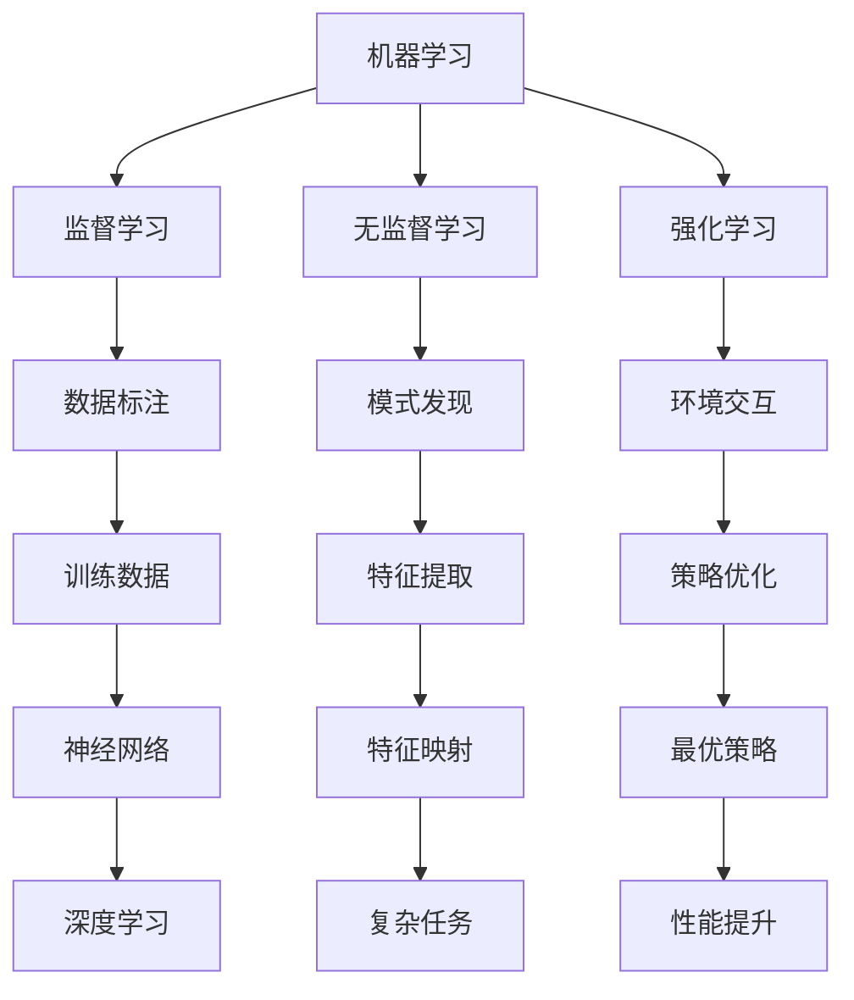

                 

 关键词：人工智能、社会影响、伦理问题、技术发展、未来展望

> 摘要：本文探讨了人工智能对社会的影响，包括伦理问题、技术发展以及未来的展望。通过分析人工智能的核心概念和联系，核心算法原理，数学模型与公式，项目实践，以及实际应用场景，我们试图揭示人工智能的潜力和面临的挑战。

## 1. 背景介绍

人工智能（Artificial Intelligence，简称AI）是计算机科学的一个分支，旨在通过模仿人类智能行为来实现机器的智能。人工智能的研究可以追溯到20世纪50年代，但随着计算能力的提升和数据量的爆发式增长，人工智能在21世纪迎来了新的发展机遇。从最初的符号主义、知识表示到基于统计学习的机器学习，再到深度学习的兴起，人工智能技术不断进步，并迅速应用于各个领域，如语音识别、图像处理、自然语言处理等。

人工智能的发展不仅仅是一个技术进步的过程，更是对社会产生深远影响的过程。从就业市场到教育体系，从医疗健康到社会治理，人工智能正在改变我们生活的方方面面。因此，对人工智能的社会影响进行深入探讨，不仅是科技领域的重要课题，也是社会发展的必然要求。

## 2. 核心概念与联系

在探讨人工智能的核心概念之前，我们需要理解几个基本概念：机器学习、深度学习、神经网络等。

### 2.1 机器学习

机器学习（Machine Learning）是人工智能的一个重要分支，它侧重于通过数据训练模型，使机器能够从经验中学习和提高性能。机器学习模型分为监督学习、无监督学习和强化学习三种类型。监督学习依赖于标注数据进行训练，无监督学习则不依赖标注数据，通过发现数据中的模式进行学习，而强化学习则是通过与环境交互来学习最优策略。

### 2.2 深度学习

深度学习（Deep Learning）是机器学习的一种方法，它使用了多层神经网络来模拟人脑的学习过程。深度学习在图像识别、语音识别和自然语言处理等领域取得了显著成果，其核心思想是通过大量数据进行训练，使神经网络能够自动提取特征，从而实现复杂任务。

### 2.3 神经网络

神经网络（Neural Network）是一种模仿生物神经系统的计算模型，它由大量相互连接的节点（或神经元）组成。每个节点通过加权连接与其他节点相连，并通过激活函数进行非线性变换。神经网络可以通过学习输入输出数据之间的映射关系来完成任务。

### 2.4 核心概念原理与架构的 Mermaid 流程图



## 3. 核心算法原理 & 具体操作步骤

### 3.1 算法原理概述

人工智能的核心在于算法原理，其中机器学习和深度学习是最为关键的算法。机器学习通过训练模型来实现预测和分类，而深度学习通过多层神经网络来实现更加复杂的特征提取和任务处理。

### 3.2 算法步骤详解

#### 3.2.1 机器学习步骤

1. **数据收集与预处理**：收集用于训练的数据，并进行清洗和预处理，如缺失值处理、数据标准化等。
2. **模型选择**：根据任务需求选择合适的机器学习模型，如线性回归、决策树、支持向量机等。
3. **模型训练**：使用预处理后的数据对模型进行训练，通过调整参数来优化模型性能。
4. **模型评估**：使用验证集对训练好的模型进行评估，常用的评估指标包括准确率、召回率、F1值等。
5. **模型应用**：将训练好的模型应用于实际数据，进行预测或分类。

#### 3.2.2 深度学习步骤

1. **数据收集与预处理**：与机器学习相同，收集并预处理数据。
2. **网络设计**：设计神经网络结构，包括层数、神经元数量、激活函数等。
3. **模型训练**：通过反向传播算法对神经网络进行训练，不断调整权重和偏置，优化网络性能。
4. **模型评估**：使用验证集对训练好的网络进行评估。
5. **模型应用**：将训练好的网络应用于实际数据，进行图像识别、语音识别等任务。

### 3.3 算法优缺点

**机器学习的优点**：

- **通用性**：可以用于各种类型的数据和任务。
- **灵活性**：可以根据不同任务需求调整模型结构和参数。
- **自适应性**：可以随着新数据的到来不断优化模型。

**机器学习的缺点**：

- **数据依赖性**：需要大量的标注数据。
- **计算成本**：训练过程需要大量的计算资源。
- **可解释性**：黑箱模型难以解释。

**深度学习的优点**：

- **高效性**：能够在大量数据上实现高效的特征提取。
- **准确性**：在图像识别、语音识别等领域取得了显著成果。
- **自适应性**：能够自动提取数据中的抽象特征。

**深度学习的缺点**：

- **数据需求**：需要大量的训练数据。
- **计算成本**：训练过程需要大量的计算资源。
- **可解释性**：深层网络难以解释。

### 3.4 算法应用领域

机器学习和深度学习在各个领域都有广泛应用，如：

- **计算机视觉**：图像识别、目标检测、图像生成等。
- **自然语言处理**：文本分类、机器翻译、情感分析等。
- **语音识别**：语音识别、语音合成等。
- **推荐系统**：基于用户行为和偏好的商品推荐、新闻推荐等。
- **自动驾驶**：环境感知、路径规划、决策控制等。

## 4. 数学模型和公式 & 详细讲解 & 举例说明

### 4.1 数学模型构建

在人工智能中，数学模型起到了关键作用。以下是一个简单的线性回归模型：

$$
y = \beta_0 + \beta_1 x
$$

其中，$y$ 是因变量，$x$ 是自变量，$\beta_0$ 和 $\beta_1$ 是模型参数。

### 4.2 公式推导过程

线性回归模型的目的是通过最小化误差平方和来估计模型参数。误差平方和（Sum of Squared Errors，简称SSE）可以表示为：

$$
SSE = \sum_{i=1}^{n} (y_i - \hat{y_i})^2
$$

其中，$y_i$ 是实际值，$\hat{y_i}$ 是预测值，$n$ 是样本数量。

为了最小化SSE，我们对参数 $\beta_0$ 和 $\beta_1$ 求导并令导数为零，得到：

$$
\frac{\partial SSE}{\partial \beta_0} = -2 \sum_{i=1}^{n} (y_i - \hat{y_i}) = 0
$$

$$
\frac{\partial SSE}{\partial \beta_1} = -2 \sum_{i=1}^{n} (y_i - \hat{y_i}) x_i = 0
$$

解上述方程组，可以得到：

$$
\beta_0 = \bar{y} - \beta_1 \bar{x}
$$

$$
\beta_1 = \frac{\sum_{i=1}^{n} (x_i - \bar{x})(y_i - \bar{y})}{\sum_{i=1}^{n} (x_i - \bar{x})^2}
$$

其中，$\bar{y}$ 和 $\bar{x}$ 分别是 $y$ 和 $x$ 的平均值。

### 4.3 案例分析与讲解

假设我们有以下数据：

| x | y |
|---|---|
| 1 | 2 |
| 2 | 4 |
| 3 | 6 |
| 4 | 8 |

使用线性回归模型来预测 $x=5$ 时的 $y$ 值。

首先，计算 $x$ 和 $y$ 的平均值：

$$
\bar{x} = \frac{1+2+3+4}{4} = 2.5
$$

$$
\bar{y} = \frac{2+4+6+8}{4} = 5
$$

然后，计算 $\beta_1$：

$$
\beta_1 = \frac{(1-2.5)(2-5) + (2-2.5)(4-5) + (3-2.5)(6-5) + (4-2.5)(8-5)}{(1-2.5)^2 + (2-2.5)^2 + (3-2.5)^2 + (4-2.5)^2}
$$

$$
\beta_1 = \frac{(-1.5)(-3) + (-0.5)(-1) + (0.5)(1) + (1.5)(3)}{2.25 + 0.25 + 0.25 + 2.25}
$$

$$
\beta_1 = \frac{4.5 + 0.5 + 0.5 + 4.5}{5} = 2
$$

接下来，计算 $\beta_0$：

$$
\beta_0 = \bar{y} - \beta_1 \bar{x} = 5 - 2 \times 2.5 = 0
$$

因此，线性回归模型为：

$$
y = 0 + 2x
$$

当 $x=5$ 时，$y=2 \times 5 = 10$。

## 5. 项目实践：代码实例和详细解释说明

### 5.1 开发环境搭建

为了实践线性回归模型，我们需要搭建一个开发环境。以下是使用 Python 进行线性回归的步骤：

1. 安装 Python 解释器。
2. 安装 NumPy 库，用于数值计算。
3. 安装 Matplotlib 库，用于绘图。

在终端执行以下命令：

```
pip install numpy matplotlib
```

### 5.2 源代码详细实现

下面是一个简单的线性回归代码示例：

```python
import numpy as np
import matplotlib.pyplot as plt

# 数据
x = np.array([1, 2, 3, 4])
y = np.array([2, 4, 6, 8])

# 计算平均值
x_mean = np.mean(x)
y_mean = np.mean(y)

# 计算斜率和截距
beta_1 = np.sum((x - x_mean) * (y - y_mean)) / np.sum((x - x_mean)**2)
beta_0 = y_mean - beta_1 * x_mean

# 构建线性回归模型
model = np.polyfit(x, y, 1)

# 绘图
plt.scatter(x, y, label='Data')
plt.plot(x, model[0] * x + model[1], color='red', label='Regression Line')
plt.xlabel('x')
plt.ylabel('y')
plt.legend()
plt.show()
```

### 5.3 代码解读与分析

1. **导入库**：首先导入 NumPy 和 Matplotlib 库。
2. **数据**：定义数据 `x` 和 `y`。
3. **计算平均值**：计算 `x` 和 `y` 的平均值。
4. **计算斜率和截距**：使用公式计算斜率 `beta_1` 和截距 `beta_0`。
5. **构建线性回归模型**：使用 `np.polyfit` 函数构建线性回归模型。
6. **绘图**：使用 `plt.scatter` 和 `plt.plot` 绘制数据点和回归直线。

### 5.4 运行结果展示

运行上述代码后，会显示一个包含数据点和回归直线的图形。这表明我们成功实现了线性回归模型。

## 6. 实际应用场景

人工智能在实际应用场景中有着广泛的应用，以下是一些典型应用案例：

### 6.1 自动驾驶

自动驾驶技术是人工智能在交通运输领域的重要应用。通过使用计算机视觉、深度学习和传感器数据，自动驾驶系统能够实现车辆在复杂道路环境中的自动行驶。这一技术的实现不仅能够提高交通效率，还能减少交通事故，提升道路安全性。

### 6.2 医疗健康

人工智能在医疗健康领域也有着重要应用，如疾病诊断、治疗规划和健康监测。通过深度学习和图像处理技术，人工智能系统能够对医学图像进行分析，帮助医生进行早期诊断和治疗规划。此外，人工智能还能通过健康数据进行分析，提供个性化的健康建议。

### 6.3 教育

人工智能在教育领域中的应用主要体现在个性化学习和教育资源的智能化推荐。通过学习学生的行为数据，人工智能系统能够提供针对性的学习建议，帮助学生提高学习效果。同时，人工智能还能根据学生的学习进度和兴趣，推荐合适的学习资源。

### 6.4 未来应用展望

随着人工智能技术的不断进步，未来其在各个领域的应用将更加广泛和深入。以下是一些未来应用的展望：

- **智能城市**：通过物联网和人工智能技术，实现城市的智能化管理，提高城市运行效率和居民生活质量。
- **智能制造**：通过人工智能技术，实现生产过程的自动化和智能化，提高生产效率和质量。
- **智慧农业**：利用人工智能技术，实现农作物的精准种植和管理，提高农业生产效率。

## 7. 工具和资源推荐

为了更好地学习和实践人工智能技术，以下是一些建议的工具和资源：

### 7.1 学习资源推荐

- 《人工智能：一种现代方法》（第3版）：斯蒂芬·马库斯，迈克尔·布朗
- 《深度学习》（第1卷）：伊恩·古德费洛，约书亚·本吉奥，亚伦·库维尔
- 《Python机器学习》：塞巴斯蒂安·拉姆塞，约书华·布里了

### 7.2 开发工具推荐

- Jupyter Notebook：用于编写和运行代码，支持多种编程语言。
- TensorFlow：用于构建和训练机器学习和深度学习模型。
- PyTorch：用于构建和训练机器学习和深度学习模型。

### 7.3 相关论文推荐

- “Deep Learning” by Yann LeCun, Yosua Bengio, and Geoffrey Hinton
- “A Theoretical Framework for Learning Deep Hierarchical Representations” by Y. LeCun, L. Bottou, Y. Bengio, and P. Haffner
- “Stochastic Gradient Descent” by S. Haykin

## 8. 总结：未来发展趋势与挑战

### 8.1 研究成果总结

人工智能技术在过去几十年取得了显著成果，从简单的规则系统到复杂的深度学习模型，人工智能在多个领域都实现了突破。随着计算能力的提升和算法的优化，人工智能的应用前景将更加广阔。

### 8.2 未来发展趋势

- **跨学科融合**：人工智能将与其他领域（如生物学、心理学、社会学等）进行深度融合，产生新的交叉学科。
- **增强现实与虚拟现实**：人工智能将广泛应用于增强现实和虚拟现实技术，提升用户体验。
- **自主决策**：人工智能系统将具备更强的自主决策能力，能够在复杂环境中进行智能操作。

### 8.3 面临的挑战

- **数据隐私与安全**：随着人工智能的广泛应用，数据隐私和安全问题将成为关键挑战。
- **算法公平性与透明性**：确保人工智能算法的公平性和透明性，避免偏见和歧视。
- **人工智能伦理**：人工智能的发展带来了伦理问题，如机器人伦理、自动驾驶伦理等。

### 8.4 研究展望

未来的研究应重点关注以下几个方面：

- **人工智能安全**：研究人工智能的安全性和鲁棒性，确保其在复杂环境中的可靠运行。
- **人工智能伦理**：探索人工智能伦理问题，制定相关规范和标准。
- **人工智能教育**：推动人工智能教育的发展，培养更多人工智能专业人才。

## 9. 附录：常见问题与解答

### 9.1 人工智能是什么？

人工智能是计算机科学的一个分支，旨在通过模拟人类智能行为来实现机器的智能。

### 9.2 人工智能有哪些应用领域？

人工智能广泛应用于计算机视觉、自然语言处理、语音识别、推荐系统、自动驾驶等领域。

### 9.3 深度学习与机器学习有什么区别？

深度学习是机器学习的一种方法，它使用了多层神经网络来模拟人脑的学习过程。机器学习是更广泛的概念，包括深度学习和其他学习方式。

### 9.4 人工智能的发展前景如何？

人工智能的发展前景非常广阔，预计将在未来几十年内深刻改变人类社会生活的方方面面。

## 作者署名

作者：禅与计算机程序设计艺术 / Zen and the Art of Computer Programming
----------------------------------------------------------------

