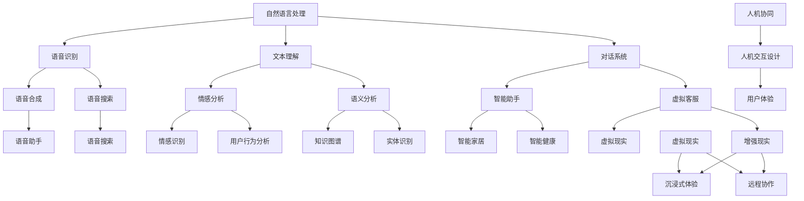

                 

关键词：人机交互、人工智能、自然语言处理、虚拟现实、增强现实、智能助手、用户体验、人机协同、未来科技、技术创新

> 摘要：本文将深入探讨人机交互领域的发展趋势与未来展望。通过分析当前技术进展、核心概念、算法原理、数学模型以及实际应用，我们将揭示人机交互在虚拟现实、智能助手、人机协同等方面的重要作用，并提出未来面临的挑战和机遇。本文旨在为读者提供一个全面而深入的视角，帮助理解人机交互技术的现状与未来发展。

## 1. 背景介绍

人机交互（Human-Computer Interaction，简称HCI）是研究人类与计算机之间交互的学科。它的目标是设计易于使用、高效和愉悦的计算机界面，使得用户能够更加轻松地与计算机系统进行互动。人机交互的历史可以追溯到1960年代，早期的计算机界面主要是基于命令行的，用户需要通过输入一系列复杂的命令来进行操作。随着图形用户界面（Graphical User Interface，简称GUI）的出现，人机交互变得更加直观和用户友好。

近年来，随着人工智能（Artificial Intelligence，简称AI）技术的快速发展，人机交互进入了一个全新的阶段。人工智能技术，尤其是自然语言处理（Natural Language Processing，简称NLP）和机器学习（Machine Learning，简称ML），为人机交互带来了前所未有的可能性。通过理解和生成自然语言，计算机能够更好地理解用户的需求，提供更加个性化的服务。虚拟现实（Virtual Reality，简称VR）和增强现实（Augmented Reality，简称AR）技术的进步，使得人机交互环境更加沉浸和互动。

### 1.1 当前技术进展

目前，人机交互技术在多个领域取得了显著进展。例如，智能助手（如Siri、Alexa、Google Assistant）已经成为许多人日常生活的一部分。这些智能助手能够通过语音识别和自然语言理解，帮助用户完成各种任务，从设定提醒、播放音乐到提供天气预报。虚拟现实和增强现实技术也在游戏、教育、医疗等领域得到了广泛应用，提供了更加沉浸式的交互体验。

此外，手势识别、眼动追踪、脑机接口（Brain-Computer Interface，简称BCI）等技术正在不断发展，为非传统的人机交互方式提供了新的可能性。这些技术的发展不仅拓宽了人机交互的应用场景，也为设计更加自然和高效的用户界面提供了新的思路。

### 1.2 历史发展

人机交互的历史可以追溯到20世纪中期。最早的计算机界面是基于命令行的，用户需要通过输入一系列复杂的命令来进行操作。随着图形用户界面的出现，人机交互变得更加直观和用户友好。1980年代，鼠标和图形界面的普及使得计算机操作变得更加简单和高效。

进入21世纪，互联网的普及和移动设备的兴起，使得人机交互进入了一个新的阶段。触摸屏、语音识别、手势识别等技术逐渐成熟，使得用户可以通过更加自然的方式与计算机进行交互。

近年来，人工智能和虚拟现实、增强现实技术的发展，使得人机交互进入了一个全新的领域。计算机不再仅仅是被动地响应用户的指令，而是能够主动理解用户的需求，提供个性化的服务。

## 2. 核心概念与联系

在人机交互领域，有几个核心概念和技术是至关重要的。这些概念包括自然语言处理、虚拟现实、增强现实、智能助手和人机协同。以下是一个简化的Mermaid流程图，用于描述这些核心概念之间的联系：



### 2.1 自然语言处理

自然语言处理是人工智能的一个重要分支，旨在使计算机能够理解和生成人类语言。自然语言处理包括语音识别、文本理解、对话系统等多个子领域。语音识别技术使得计算机能够将语音转换为文本，从而实现语音交互。文本理解技术则帮助计算机理解文本中的含义，进行情感分析、语义分析等。对话系统能够与用户进行自然语言对话，提供个性化的服务和帮助。

### 2.2 虚拟现实

虚拟现实是一种计算机技术，通过模拟出一个完全虚拟的环境，使用户能够沉浸其中。虚拟现实技术通常包括头戴显示器、追踪设备、音频设备等，以提供身临其境的体验。虚拟现实在游戏、教育、医疗等领域有广泛的应用。例如，医生可以通过虚拟现实进行手术模拟，学生可以通过虚拟现实进行历史场景的体验。

### 2.3 增强现实

增强现实是一种将虚拟信息叠加到现实世界中的技术。与虚拟现实不同，增强现实是在现实世界中添加虚拟元素，而不是完全替代现实。增强现实技术通常使用智能手机或特殊眼镜来显示虚拟信息。增强现实在零售、教育、设计等领域有广泛的应用。例如，零售商可以使用增强现实技术来为顾客提供虚拟试衣服务，设计师可以使用增强现实技术进行产品设计和展示。

### 2.4 智能助手

智能助手是一种基于人工智能的交互系统，能够通过语音或文本与用户进行对话，帮助用户完成各种任务。智能助手通常具备语音识别、文本理解、自然语言生成等技术，能够理解用户的需求，并提供相应的服务。智能助手已经成为智能家居、智能健康等领域的重要组成部分。

### 2.5 人机协同

人机协同是一种将人类和计算机系统结合起来，共同完成任务的交互方式。人机协同旨在充分发挥人类和计算机的优势，实现更加高效和智能的交互。人机协同在许多领域有广泛的应用，例如智能工厂、自动驾驶、医疗诊断等。

## 3. 核心算法原理 & 具体操作步骤

在人机交互领域，核心算法的原理和操作步骤对于实现高效的交互体验至关重要。以下我们将介绍几个关键算法的原理和步骤。

### 3.1 算法原理概述

#### 3.1.1 语音识别

语音识别是一种将语音信号转换为文本的技术。其基本原理包括声学模型、语言模型和声学-语言模型。声学模型用于捕捉语音信号的特征，语言模型用于预测语音对应的文本，声学-语言模型则将这两者结合起来，实现语音到文本的转换。

#### 3.1.2 文本理解

文本理解是一种将文本转换为计算机可理解的形式的技术。其基本原理包括词向量表示、句法分析和语义分析。词向量表示用于捕捉词汇的含义，句法分析用于解析句子的结构，语义分析则用于理解句子的含义。

#### 3.1.3 对话系统

对话系统是一种能够与用户进行自然语言对话的技术。其基本原理包括对话管理、语言理解和自然语言生成。对话管理用于控制对话流程，语言理解用于理解用户的意图，自然语言生成则用于生成回应。

#### 3.1.4 增强现实

增强现实是一种将虚拟信息叠加到现实世界中的技术。其基本原理包括图像识别、场景理解和信息叠加。图像识别用于识别现实世界中的物体，场景理解用于理解场景的布局和关系，信息叠加则用于在现实世界中添加虚拟信息。

### 3.2 算法步骤详解

#### 3.2.1 语音识别

1. **预处理**：对语音信号进行降噪、分帧和特征提取，如MFCC（梅尔频率倒谱系数）。
2. **声学模型**：使用神经网络或隐马尔可夫模型（HMM）对语音特征进行建模。
3. **语言模型**：构建语言模型，如n-gram模型或神经网络语言模型。
4. **声学-语言模型**：结合声学模型和语言模型，使用神经网络或基于梯度的优化算法进行训练和预测。

#### 3.2.2 文本理解

1. **词向量表示**：使用词袋模型、Word2Vec或BERT等方法对文本中的词汇进行向量表示。
2. **句法分析**：使用依存句法分析或转移句法分析对句子进行结构解析。
3. **语义分析**：使用实体识别、关系抽取或语义角色标注等方法对句子进行语义分析。

#### 3.2.3 对话系统

1. **对话管理**：设计对话管理策略，如基于状态转移图或强化学习的方法。
2. **语言理解**：使用NLP技术理解用户输入的意图和上下文。
3. **自然语言生成**：根据用户输入和对话状态生成自然语言回应。

#### 3.2.4 增强现实

1. **图像识别**：使用卷积神经网络（CNN）或目标检测算法对现实世界中的物体进行识别。
2. **场景理解**：使用深度学习模型理解场景布局和关系。
3. **信息叠加**：根据识别的结果，在现实世界中添加虚拟信息。

### 3.3 算法优缺点

#### 3.3.1 语音识别

**优点**：
- 能够解放双手，实现语音交互。
- 对于一些高频应用（如智能助手）非常有效。

**缺点**：
- 对于背景噪声敏感。
- 对于特定说话人识别效果可能较差。

#### 3.3.2 文本理解

**优点**：
- 对于结构化文本具有很好的理解能力。
- 对于复杂的文本语义分析效果较好。

**缺点**：
- 对于非结构化文本处理能力有限。
- 对于多语言文本处理困难。

#### 3.3.3 对话系统

**优点**：
- 能够实现自然语言交互。
- 能够根据上下文进行对话管理。

**缺点**：
- 对于复杂对话场景处理能力有限。
- 对用户意图理解存在误差。

#### 3.3.4 增强现实

**优点**：
- 能够提供沉浸式的交互体验。
- 能够在现实世界中添加虚拟信息。

**缺点**：
- 对硬件要求较高。
- 对场景理解存在困难。

### 3.4 算法应用领域

#### 3.4.1 语音识别

应用领域包括智能助手、语音搜索、语音控制等。

#### 3.4.2 文本理解

应用领域包括智能客服、文本分类、情感分析等。

#### 3.4.3 对话系统

应用领域包括智能客服、智能助手、虚拟客服等。

#### 3.4.4 增强现实

应用领域包括游戏、教育、设计、医疗等。

## 4. 数学模型和公式 & 详细讲解 & 举例说明

在人机交互领域，数学模型和公式是理解和设计各种算法的重要工具。以下我们将介绍几个关键的数学模型和公式，并对其进行详细讲解和举例说明。

### 4.1 数学模型构建

#### 4.1.1 语音识别

在语音识别中，常用的数学模型包括声学模型和语言模型。

1. **声学模型**：声学模型用于捕捉语音信号的特征。其常用的模型包括高斯混合模型（Gaussian Mixture Model，GMM）和深度神经网络（Deep Neural Network，DNN）。

   **公式**：
   $$ 
   p(x|\theta) = \sum_{i=1}^{k} \pi_i \cdot \mathcal{N}(x|\mu_i, \Sigma_i)
   $$
   其中，$x$ 表示语音特征向量，$\theta$ 表示模型参数，$\pi_i$ 表示高斯分布的权重，$\mu_i$ 和 $\Sigma_i$ 分别表示高斯分布的均值和协方差矩阵。

2. **语言模型**：语言模型用于预测语音对应的文本。其常用的模型包括n-gram模型和神经网络语言模型（Neural Network Language Model，NNLM）。

   **公式**：
   $$
   P(w_n | w_{n-1}, w_{n-2}, ..., w_1) = \prod_{i=1}^{n} p(w_i | w_{i-1}, w_{i-2}, ..., w_1)
   $$
   其中，$w_n$ 表示第n个单词，$p(w_i | w_{i-1}, w_{i-2}, ..., w_1)$ 表示在给定前n-1个单词的情况下，第n个单词的概率。

#### 4.1.2 文本理解

在文本理解中，常用的数学模型包括词向量表示、句法分析和语义分析。

1. **词向量表示**：词向量表示用于捕捉词汇的含义。常用的模型包括Word2Vec和BERT。

   **公式**：
   $$
   \mathbf{v}_w = \text{Word2Vec}(\mathbf{X}, \mathbf{Y})
   $$
   其中，$\mathbf{v}_w$ 表示单词w的词向量，$\mathbf{X}$ 和 $\mathbf{Y}$ 分别表示输入数据和标签数据。

2. **句法分析**：句法分析用于解析句子的结构。常用的模型包括依存句法分析和转移句法分析。

   **公式**：
   $$
   \text{Dependency Parsing}(\mathbf{X}, \mathbf{Y}) = \theta
   $$
   其中，$\mathbf{X}$ 和 $\mathbf{Y}$ 分别表示输入数据和标签数据，$\theta$ 表示句法分析模型。

3. **语义分析**：语义分析用于理解句子的含义。常用的模型包括实体识别、关系抽取和语义角色标注。

   **公式**：
   $$
   \text{Semantic Analysis}(\mathbf{X}, \mathbf{Y}) = \theta
   $$
   其中，$\mathbf{X}$ 和 $\mathbf{Y}$ 分别表示输入数据和标签数据，$\theta$ 表示语义分析模型。

#### 4.1.3 对话系统

在对话系统中，常用的数学模型包括对话管理、语言理解和自然语言生成。

1. **对话管理**：对话管理用于控制对话流程。常用的模型包括基于状态转移图和基于强化学习的方法。

   **公式**：
   $$
   \text{Dialogue Management}(\mathbf{X}, \mathbf{Y}) = \theta
   $$
   其中，$\mathbf{X}$ 和 $\mathbf{Y}$ 分别表示输入数据和标签数据，$\theta$ 表示对话管理模型。

2. **语言理解**：语言理解用于理解用户的意图和上下文。常用的模型包括序列到序列模型和变压器模型。

   **公式**：
   $$
   \text{Language Understanding}(\mathbf{X}, \mathbf{Y}) = \theta
   $$
   其中，$\mathbf{X}$ 和 $\mathbf{Y}$ 分别表示输入数据和标签数据，$\theta$ 表示语言理解模型。

3. **自然语言生成**：自然语言生成用于生成回应。常用的模型包括基于规则的方法和基于生成对抗网络的方法。

   **公式**：
   $$
   \text{Natural Language Generation}(\mathbf{X}, \mathbf{Y}) = \theta
   $$
   其中，$\mathbf{X}$ 和 $\mathbf{Y}$ 分别表示输入数据和标签数据，$\theta$ 表示自然语言生成模型。

#### 4.1.4 增强现实

在增强现实中，常用的数学模型包括图像识别、场景理解和信息叠加。

1. **图像识别**：图像识别用于识别现实世界中的物体。常用的模型包括卷积神经网络（CNN）和目标检测算法。

   **公式**：
   $$
   \text{Image Recognition}(\mathbf{X}, \mathbf{Y}) = \theta
   $$
   其中，$\mathbf{X}$ 和 $\mathbf{Y}$ 分别表示输入数据和标签数据，$\theta$ 表示图像识别模型。

2. **场景理解**：场景理解用于理解场景布局和关系。常用的模型包括深度学习模型和图论算法。

   **公式**：
   $$
   \text{Scene Understanding}(\mathbf{X}, \mathbf{Y}) = \theta
   $$
   其中，$\mathbf{X}$ 和 $\mathbf{Y}$ 分别表示输入数据和标签数据，$\theta$ 表示场景理解模型。

3. **信息叠加**：信息叠加用于在现实世界中添加虚拟信息。常用的模型包括基于图像的渲染和基于物理的仿真。

   **公式**：
   $$
   \text{Information Overlay}(\mathbf{X}, \mathbf{Y}) = \theta
   $$
   其中，$\mathbf{X}$ 和 $\mathbf{Y}$ 分别表示输入数据和标签数据，$\theta$ 表示信息叠加模型。

### 4.2 公式推导过程

#### 4.2.1 语音识别中的高斯混合模型

高斯混合模型是一种用于表示语音特征的统计模型。它的基本思想是将语音信号分解为多个高斯分布的加权和。

1. **概率分布函数**：

   对于一个高斯分布，其概率密度函数为：

   $$
   p(x|\theta) = \mathcal{N}(x|\mu, \Sigma)
   $$

   其中，$x$ 表示特征向量，$\mu$ 表示均值，$\Sigma$ 表示协方差矩阵。

2. **高斯混合模型**：

   高斯混合模型将多个高斯分布组合起来，其概率密度函数为：

   $$
   p(x|\theta) = \sum_{i=1}^{k} \pi_i \cdot \mathcal{N}(x|\mu_i, \Sigma_i)
   $$

   其中，$\pi_i$ 表示第i个高斯分布的权重，$\mu_i$ 和 $\Sigma_i$ 分别表示第i个高斯分布的均值和协方差矩阵。

#### 4.2.2 语言模型中的n-gram模型

n-gram模型是一种用于预测文本的统计模型。它的基本思想是根据前n个单词预测下一个单词。

1. **n-gram概率**：

   对于一个n-gram模型，其概率为：

   $$
   p(w_n | w_{n-1}, w_{n-2}, ..., w_1) = \prod_{i=1}^{n} p(w_i | w_{i-1}, w_{i-2}, ..., w_1)
   $$

   其中，$w_n$ 表示第n个单词，$p(w_i | w_{i-1}, w_{i-2}, ..., w_1)$ 表示在给定前n-1个单词的情况下，第n个单词的概率。

2. **n-gram计数**：

   在构建n-gram模型时，需要对文本进行分词和计数。假设文本中有$N$个单词，我们可以计算每个n-gram的频次。

   $$
   C_{n-gram} = \sum_{i=1}^{N-n+1} \text{count}(w_i, w_{i+1}, ..., w_{i+n-1})
   $$

   其中，$C_{n-gram}$ 表示n-gram的频次，$\text{count}(w_i, w_{i+1}, ..., w_{i+n-1})$ 表示单词$w_i, w_{i+1}, ..., w_{i+n-1}$同时出现的次数。

#### 4.2.3 对话系统中的序列到序列模型

序列到序列（Sequence-to-Sequence，Seq2Seq）模型是一种用于生成序列的模型。它通常用于机器翻译、对话系统等任务。

1. **编码器**：

   编码器用于将输入序列编码为一个固定长度的向量。假设输入序列为$x_1, x_2, ..., x_T$，编码器输出为$s_t$。

   $$
   s_t = \text{Encoder}(x_1, x_2, ..., x_T)
   $$

2. **解码器**：

   解码器用于生成输出序列。假设输出序列为$y_1, y_2, ..., y_S$，解码器输出为$\hat{y_t}$。

   $$
   \hat{y_t} = \text{Decoder}(s_1, s_2, ..., s_T, y_1, y_2, ..., y_{t-1})
   $$

3. **注意力机制**：

   注意力机制用于将编码器的输出向量加权，以便更好地关注输入序列的重要部分。假设注意力权重为$a_t$。

   $$
   a_t = \text{Attention}(s_t, s_1, s_2, ..., s_T)
   $$

### 4.3 案例分析与讲解

#### 4.3.1 语音识别案例

假设我们有一个语音信号$x_1, x_2, ..., x_T$，我们需要将其转换为文本。我们可以使用高斯混合模型（GMM）进行声学建模，并使用n-gram模型进行语言建模。

1. **声学建模**：

   假设我们使用三个高斯分布来建模语音信号，其概率密度函数为：

   $$
   p(x|\theta) = \sum_{i=1}^{3} \pi_i \cdot \mathcal{N}(x|\mu_i, \Sigma_i)
   $$

   其中，$\theta = (\pi_1, \pi_2, \pi_3, \mu_1, \Sigma_1, \mu_2, \Sigma_2, \mu_3, \Sigma_3)$ 是模型参数。

2. **语言建模**：

   假设我们使用三元语法（trigram）模型来预测文本，其概率为：

   $$
   P(w_n | w_{n-1}, w_{n-2}) = \frac{C_{n-1, n-2}}{C_{n-2}}
   $$

   其中，$C_{n-1, n-2}$ 是三元组$(w_{n-2}, w_{n-1}, w_n)$ 的频次，$C_{n-2}$ 是所有长度为n-2的三元组的频次之和。

3. **解码**：

   假设我们已经获得了语音信号的声学特征$x_1, x_2, ..., x_T$，我们需要使用声学模型和语言模型进行解码，以生成文本。

   首先，计算每个状态的概率：

   $$
   p(s_t | x_1, x_2, ..., x_T) = \sum_{i=1}^{3} \pi_i \cdot \mathcal{N}(x_t|\mu_i, \Sigma_i)
   $$

   然后，计算每个单词的概率：

   $$
   P(w_n | s_1, s_2, ..., s_T) = \frac{C_{n-1, n-2}}{C_{n-2}}
   $$

   最后，使用Viterbi算法找到最可能的文本序列。

#### 4.3.2 对话系统案例

假设我们有一个对话系统，需要与用户进行自然语言对话。我们可以使用序列到序列（Seq2Seq）模型进行对话管理、语言理解和自然语言生成。

1. **对话管理**：

   假设我们使用基于状态转移图的方法进行对话管理。状态转移图包括状态和动作，每个状态都有多个动作可供选择。

2. **语言理解**：

   假设我们使用变压器（Transformer）模型进行语言理解。输入为用户输入的文本，输出为用户的意图和上下文信息。

3. **自然语言生成**：

   假设我们使用基于生成对抗网络（GAN）的方法进行自然语言生成。输入为用户的意图和上下文信息，输出为自然语言回应。

## 5. 项目实践：代码实例和详细解释说明

为了更好地理解人机交互技术在实际应用中的实现，我们选择一个简单的项目实例——一个基于Python的语音助手。我们将介绍如何搭建开发环境、实现源代码，并对代码进行解读与分析。

### 5.1 开发环境搭建

在开始项目之前，我们需要搭建一个合适的技术栈。以下是我们推荐的开发环境：

- 编程语言：Python 3.x
- 语音识别库：SpeechRecognition
- 自然语言处理库：NLTK
- 对话系统库：ChatterBot

#### 安装Python 3.x

确保您的计算机上已经安装了Python 3.x版本。您可以通过Python官方网站下载并安装Python。

#### 安装语音识别库

使用pip命令安装SpeechRecognition库：

```
pip install SpeechRecognition
```

#### 安装自然语言处理库

使用pip命令安装NLTK库：

```
pip install nltk
```

#### 安装对话系统库

使用pip命令安装ChatterBot库：

```
pip install chatterbot
```

### 5.2 源代码详细实现

以下是一个简单的语音助手项目的源代码示例：

```python
import speech_recognition as sr
from chatterbot import ChatBot
from chatterbot.trainers import ChatterBotCorpusTrainer

# 初始化语音识别器
recognizer = sr.Recognizer()

# 初始化对话机器人
chatbot = ChatBot('SmartAssistant')
trainer = ChatterBotCorpusTrainer(chatbot)

# 训练对话机器人
trainer.train('chatterbot.corpus.english')

# 循环接收用户输入
while True:
    try:
        # 使用麦克风捕获语音
        with sr.Microphone() as source:
            print(" Listening...")
            audio = recognizer.listen(source)

            # 将语音转换为文本
            text = recognizer.recognize_google(audio)

            # 回答用户的问题
            response = chatbot.get_response(text)
            print("Assistant:", response)
    except sr.UnknownValueError:
        print("Sorry, I did not understand that.")
    except sr.RequestError as e:
        print("API unavailable; {0}".format(e))
```

### 5.3 代码解读与分析

#### 5.3.1 引入库

在代码的开头，我们引入了必要的库：

- `speech_recognition`：用于语音识别。
- `chatterbot`：用于构建对话机器人。
- `chatterbot.trainers`：用于训练对话机器人。

#### 5.3.2 初始化语音识别器

```python
recognizer = sr.Recognizer()
```

这里，我们创建了一个`Recognizer`对象，用于处理语音识别任务。

#### 5.3.3 初始化对话机器人

```python
chatbot = ChatBot('SmartAssistant')
trainer = ChatterBotCorpusTrainer(chatbot)
```

我们创建了一个名为`SmartAssistant`的对话机器人，并使用`ChatterBotCorpusTrainer`来训练它。

#### 5.3.4 训练对话机器人

```python
trainer.train('chatterbot.corpus.english')
```

这里，我们使用一个英文语料库来训练对话机器人。根据实际需求，您可以选择其他语言或自定义语料库。

#### 5.3.5 循环接收用户输入

```python
while True:
    try:
        # 使用麦克风捕获语音
        with sr.Microphone() as source:
            print(" Listening...")
            audio = recognizer.listen(source)

            # 将语音转换为文本
            text = recognizer.recognize_google(audio)

            # 回答用户的问题
            response = chatbot.get_response(text)
            print("Assistant:", response)
    except sr.UnknownValueError:
        print("Sorry, I did not understand that.")
    except sr.RequestError as e:
        print("API unavailable; {0}".format(e))
```

这里，我们使用一个无限循环来接收用户的语音输入。每次循环中，我们首先使用麦克风捕获语音，然后使用Google语音识别API将语音转换为文本。最后，我们使用对话机器人回答用户的问题。

## 6. 实际应用场景

### 6.1 虚拟现实

虚拟现实技术在人机交互中的应用正在不断扩展。例如，在游戏行业中，虚拟现实头戴设备（如Oculus Rift、HTC Vive）提供了沉浸式的游戏体验。用户可以进入一个完全虚拟的游戏世界，与虚拟角色互动，甚至与其他玩家共同参与多人游戏。此外，虚拟现实在教育中的应用也非常广泛，学生可以通过虚拟现实技术进行历史场景的体验、化学实验的模拟等。

### 6.2 智能助手

智能助手是人工智能和人机交互技术结合的典型应用。智能助手可以理解用户的语音指令，执行各种任务，如设定提醒、播放音乐、提供天气预报等。这些智能助手不仅提高了用户的日常生活效率，还提供了个性化的服务。例如，亚马逊的Alexa、谷歌的Google Assistant和苹果的Siri等，已经成为许多人不可或缺的智能助手。

### 6.3 人机协同

人机协同是人机交互的高级形式，它将人类的智慧和计算机的精确性结合起来，实现更加高效的工作。例如，在医疗领域，医生可以通过人机协同系统进行手术模拟和实时诊断。在制造业中，人机协同系统可以帮助工人进行精确的操作，提高生产效率。此外，在人机协同的远程协作中，人们可以通过虚拟现实或增强现实技术进行异地协作，实现高效的团队工作。

### 6.4 未来应用展望

随着人工智能和人机交互技术的不断发展，未来将出现更多创新的应用场景。例如，智能交通系统可以通过人机交互技术实现智能导航、实时路况预测等，提高交通效率。在智能家居中，人机交互技术将使家居设备更加智能，实现语音控制、远程监控等功能。此外，人机交互技术还将推动虚拟现实、增强现实等技术的发展，为人们提供更加丰富和多样化的互动体验。

## 7. 工具和资源推荐

为了帮助读者深入了解人机交互技术，我们推荐以下工具和资源：

### 7.1 学习资源推荐

- 《人工智能：一种现代方法》（Peter Norvig & Stuart J. Russell）
- 《自然语言处理综论》（Daniel Jurafsky & James H. Martin）
- 《虚拟现实与增强现实技术》（Daniel Thalmann & Hans-Peter Seifert）

### 7.2 开发工具推荐

- Python：一种广泛使用的编程语言，适用于自然语言处理、机器学习等应用。
- TensorFlow：一种开源机器学习框架，适用于构建和训练复杂的深度学习模型。
- Keras：一种基于TensorFlow的高级神经网络API，简化了深度学习模型的构建过程。

### 7.3 相关论文推荐

- "A Neural Conversation Model"（Noam Shazeer等，2017）
- "Speech Recognition with Deep Neural Networks"（Geoffrey Hinton等，2012）
- "Unsupervised Pretraining for Natural Language Processing"（Tom B. Brown等，2020）

## 8. 总结：未来发展趋势与挑战

### 8.1 研究成果总结

过去几十年，人机交互技术在语音识别、文本理解、对话系统和虚拟现实等方面取得了显著进展。人工智能技术的快速发展，使得计算机能够更好地理解用户的需求，提供个性化的服务。虚拟现实和增强现实技术的进步，为用户提供了更加沉浸和互动的交互体验。

### 8.2 未来发展趋势

未来，人机交互技术将继续朝着更加智能化、自然化和个性化的方向发展。以下是几个可能的发展趋势：

1. **多模态交互**：将语音、视觉、触觉等多种交互方式结合起来，提供更加丰富和自然的交互体验。
2. **智能情感交互**：通过理解用户的情感状态，提供更加人性化和服务化的交互体验。
3. **可解释性和可扩展性**：开发更加透明和易于理解的交互系统，提高系统的可扩展性和适应性。
4. **隐私保护和安全性**：在保障用户隐私和安全的前提下，提供高效和可靠的交互服务。

### 8.3 面临的挑战

尽管人机交互技术在不断发展，但仍面临一些挑战：

1. **技术成熟度**：许多新兴技术尚未完全成熟，需要进一步的研究和开发。
2. **用户适应性**：用户对新技术的接受度不高，需要通过教育和培训提高用户的使用体验。
3. **隐私和安全**：用户隐私和数据安全是至关重要的问题，需要制定相应的法律法规和技术措施。
4. **跨领域应用**：人机交互技术需要在不同领域得到广泛应用，需要解决跨领域的技术整合和兼容性问题。

### 8.4 研究展望

未来，人机交互技术将在多个领域得到广泛应用，如智能医疗、智能教育、智能交通和智能家居等。随着人工智能技术的不断进步，人机交互将变得更加智能和高效。同时，人机交互技术也将推动虚拟现实和增强现实的发展，为人们提供更加丰富和多样化的互动体验。

## 9. 附录：常见问题与解答

### 9.1 什么是人机交互？

人机交互（HCI）是研究人类与计算机之间交互的学科。它的目标是设计易于使用、高效和愉悦的计算机界面，使得用户能够更加轻松地与计算机系统进行互动。

### 9.2 虚拟现实和增强现实有什么区别？

虚拟现实（VR）是一种完全虚拟的环境，用户可以通过头戴显示器等设备进入一个沉浸式的虚拟世界。增强现实（AR）则是在现实世界中叠加虚拟信息，用户可以看到虚拟元素与现实世界的互动。

### 9.3 智能助手如何工作？

智能助手是通过自然语言处理和机器学习技术实现的人机交互系统。它们可以理解用户的语音指令，执行相应的任务，如设定提醒、播放音乐、提供天气预报等。

### 9.4 人机协同是什么？

人机协同是一种将人类和计算机系统结合起来，共同完成任务的交互方式。它旨在充分发挥人类和计算机的优势，实现更加高效和智能的交互。

### 9.5 语音识别准确率有多高？

语音识别的准确率取决于多种因素，如语音质量、说话人、环境噪音等。在理想条件下，语音识别的准确率可以达到90%以上。然而，在复杂和嘈杂的环境中，准确率可能会降低。

## 作者署名

作者：禅与计算机程序设计艺术 / Zen and the Art of Computer Programming

