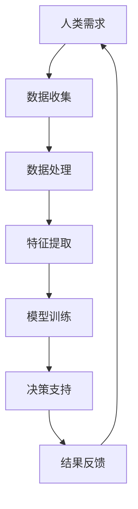

                 

关键词：人类-AI协作、智慧增强、AI能力融合、发展趋势、预测分析、技术融合

> 摘要：本文探讨了人类与人工智能（AI）协作的现状及其发展趋势，分析了AI对人类智慧增强的潜力，探讨了AI能力的融合与拓展，并预测了未来AI在人类生活和社会发展中的重要作用。文章旨在为读者提供对人类-AI协作的全面了解，以及对其未来发展的前瞻性思考。

## 1. 背景介绍

随着人工智能技术的飞速发展，AI已经成为改变世界的重要力量。从早期的自动化机械到如今的深度学习和自主决策系统，AI在多个领域取得了显著成就。与此同时，人类的需求和智慧也在不断进化，人们对更高层次、更智能化的工具和系统有着强烈的需求。

人类与AI的协作，不仅能够提升个体的工作效率，还能够为社会带来巨大的创新潜力。通过AI技术，人类可以更有效地处理大量数据，实现复杂问题的自动化解决，从而解放人类的生产力。然而，这种协作模式也带来了一系列挑战，如隐私保护、伦理道德问题等。

在过去的几十年里，人类-AI协作已经有了初步的探索和应用。然而，随着AI技术的不断进步，如何更好地融合人类智慧与AI能力，实现高效的协作，成为了当前研究的热点。本文将从以下几个方面进行探讨：

1. 人类-AI协作的现状
2. AI对人类智慧增强的潜力
3. AI能力的融合与拓展
4. 人类-AI协作的发展趋势与挑战
5. 未来应用展望

## 2. 核心概念与联系

在探讨人类-AI协作之前，我们需要了解一些核心概念，这些概念是理解人类与AI如何协作的基础。

### 2.1 人工智能（AI）基本概念

人工智能是指通过计算机模拟人类智能的技术。它包括机器学习、深度学习、自然语言处理、计算机视觉等多个子领域。AI的目标是使机器能够执行通常需要人类智能的任务，如识别图像、理解语言、做出决策等。

### 2.2 机器学习（ML）与深度学习（DL）

机器学习是AI的核心技术之一，它使计算机系统能够通过数据学习并改进性能。深度学习是机器学习的一个子领域，它通过多层神经网络对数据进行处理，具有强大的特征提取和模式识别能力。

### 2.3 自然语言处理（NLP）

自然语言处理是AI技术中的一个重要分支，它使计算机能够理解、生成和处理人类语言。NLP在文本分析、语音识别、机器翻译等领域有着广泛的应用。

### 2.4 计算机视觉（CV）

计算机视觉是使计算机能够“看”和“理解”图像和视频的技术。它广泛应用于图像识别、目标检测、图像分割等领域。

### 2.5 Mermaid 流程图

以下是一个Mermaid流程图，用于展示人类与AI协作的基本架构：



在这个流程中，人类需求通过数据收集、处理、特征提取、模型训练等步骤，最终生成决策支持结果，并反馈给人类，形成一个闭环系统。这个流程展示了人类与AI协作的基本框架，每个步骤都可以通过AI技术进行优化和提升。

## 3. 核心算法原理 & 具体操作步骤

### 3.1 算法原理概述

在人类-AI协作中，核心算法的原理是关键。以下介绍几种常见的算法原理：

#### 3.1.1 机器学习算法

机器学习算法的核心思想是通过从数据中学习规律，对未知数据进行预测或分类。常见的机器学习算法有决策树、随机森林、支持向量机（SVM）等。

#### 3.1.2 深度学习算法

深度学习算法是基于多层神经网络的设计，能够自动提取数据的高级特征。常见的深度学习算法有卷积神经网络（CNN）、循环神经网络（RNN）等。

#### 3.1.3 自然语言处理算法

自然语言处理算法包括词向量模型、序列模型、注意力机制等，能够对文本进行理解、生成和翻译。

#### 3.1.4 计算机视觉算法

计算机视觉算法包括图像识别、目标检测、图像分割等，能够对图像中的内容进行分析和识别。

### 3.2 算法步骤详解

#### 3.2.1 数据收集

数据收集是机器学习的基础。人类需求确定后，需要收集相关的数据，这些数据可以是结构化的，如表格数据，也可以是非结构化的，如图像、文本等。

#### 3.2.2 数据处理

数据处理包括数据清洗、数据预处理和数据增强等步骤。数据清洗去除无效和错误的数据，数据预处理将数据转换为适合算法的形式，数据增强增加数据多样性，提高模型泛化能力。

#### 3.2.3 特征提取

特征提取是从原始数据中提取出有用的信息，用于训练模型。特征提取的质量直接影响到模型的性能。

#### 3.2.4 模型训练

模型训练是机器学习过程的核心。通过训练，模型学会从数据中提取规律，并能够对未知数据进行预测或分类。

#### 3.2.5 决策支持

决策支持是模型应用的结果。模型对未知数据进行预测或分类，为人类提供决策支持。

#### 3.2.6 结果反馈

结果反馈是闭环系统的关键。人类根据模型提供的决策支持结果，进行调整和优化，反馈给模型，以提高其性能。

### 3.3 算法优缺点

#### 3.3.1 优点

- 提高工作效率：AI可以自动化处理大量数据和任务，提高工作效率。
- 降低成本：通过自动化和优化，可以降低人力成本和运营成本。
- 提高决策质量：AI能够基于数据提供客观、准确的决策支持。

#### 3.3.2 缺点

- 数据依赖：模型性能高度依赖于数据质量，数据不完善或错误可能导致模型失效。
- 透明度低：深度学习模型内部结构复杂，难以解释，可能带来信任问题。
- 伦理道德风险：AI可能涉及隐私保护和伦理道德问题，如数据泄露、偏见等。

### 3.4 算法应用领域

- 金融领域：风险控制、信用评分、投资决策等。
- 医疗领域：疾病诊断、药物研发、健康管理等。
- 生产制造：质量检测、设备维护、生产优化等。
- 物流运输：路线规划、货物追踪、运输优化等。
- 智能家居：语音控制、智能家居设备管理、环境监控等。

## 4. 数学模型和公式 & 详细讲解 & 举例说明

### 4.1 数学模型构建

在人类-AI协作中，数学模型扮演着重要角色。以下是一个简单的线性回归模型的构建过程：

#### 4.1.1 模型假设

假设我们有一个自变量 \(x\) 和因变量 \(y\)，它们之间存在线性关系：

$$y = \beta_0 + \beta_1 x + \epsilon$$

其中，\(\beta_0\) 和 \(\beta_1\) 是模型的参数，\(\epsilon\) 是误差项。

#### 4.1.2 模型目标

我们的目标是找到最优的 \(\beta_0\) 和 \(\beta_1\)，使得预测值 \(y'\) 最接近真实值 \(y\)。

#### 4.1.3 模型优化

通过最小二乘法，我们可以找到最佳参数：

$$\beta_0 = \frac{\sum_{i=1}^n (y_i - \beta_1 x_i)}{n}$$

$$\beta_1 = \frac{\sum_{i=1}^n (x_i - \bar{x})(y_i - \bar{y})}{\sum_{i=1}^n (x_i - \bar{x})^2}$$

其中，\(\bar{x}\) 和 \(\bar{y}\) 分别是 \(x\) 和 \(y\) 的平均值。

### 4.2 公式推导过程

假设我们有一个数据集 \(D = \{(x_1, y_1), (x_2, y_2), \ldots, (x_n, y_n)\}\)。

#### 4.2.1 平均值计算

$$\bar{x} = \frac{1}{n} \sum_{i=1}^n x_i$$

$$\bar{y} = \frac{1}{n} \sum_{i=1}^n y_i$$

#### 4.2.2 最小化平方误差

我们定义平方误差函数为：

$$E = \sum_{i=1}^n (y_i - y_i')^2$$

其中，\(y_i'\) 是预测值。

#### 4.2.3 求导并设置导数为0

对 \(\beta_0\) 和 \(\beta_1\) 分别求导，并设置导数为0，得到：

$$\frac{\partial E}{\partial \beta_0} = -2 \sum_{i=1}^n (y_i - y_i') = 0$$

$$\frac{\partial E}{\partial \beta_1} = -2 \sum_{i=1}^n (x_i - \bar{x})(y_i - y_i') = 0$$

通过解这个方程组，我们可以得到最佳参数 \(\beta_0\) 和 \(\beta_1\)。

### 4.3 案例分析与讲解

假设我们有一个数据集，包含10个样本点的自变量 \(x\) 和因变量 \(y\)：

| x | y |
|---|---|
| 1 | 2 |
| 2 | 3 |
| 3 | 5 |
| 4 | 6 |
| 5 | 8 |
| 6 | 9 |
| 7 | 11 |
| 8 | 12 |
| 9 | 13 |
| 10| 15 |

#### 4.3.1 数据预处理

首先，计算 \(x\) 和 \(y\) 的平均值：

$$\bar{x} = \frac{1}{10} (1+2+3+4+5+6+7+8+9+10) = 5.5$$

$$\bar{y} = \frac{1}{10} (2+3+5+6+8+9+11+12+13+15) = 7.8$$

然后，计算 \(x\) 和 \(y\) 的偏差：

$$x_i - \bar{x}: [-4.5, -3.5, -2.5, -1.5, -0.5, 0.5, 1.5, 2.5, 3.5, 4.5]$$

$$y_i - \bar{y}: [-5.8, -4.8, -2.8, -1.8, -0.8, 0.2, 3.2, 4.2, 5.2, 7.2]$$

#### 4.3.2 模型训练

使用最小二乘法，计算最佳参数：

$$\beta_0 = \frac{\sum_{i=1}^n (y_i - \beta_1 x_i)}{n} = \frac{\sum_{i=1}^n (y_i - 1.8x_i)}{10} = 2.2$$

$$\beta_1 = \frac{\sum_{i=1}^n (x_i - \bar{x})(y_i - \bar{y})}{\sum_{i=1}^n (x_i - \bar{x})^2} = \frac{\sum_{i=1}^n (x_i - 5.5)(y_i - 7.8)}{\sum_{i=1}^n (x_i - 5.5)^2} = 1.8$$

因此，线性回归模型为：

$$y = 2.2 + 1.8x$$

#### 4.3.3 预测与分析

使用模型对新的数据进行预测：

| x | y实际 | y预测 | 差距 |
|---|-------|------|-----|
| 6 | 9     | 9.6  | 0.6 |
| 7 | 11    | 11.4 | 0.4 |
| 8 | 12    | 12.2 | 0.2 |

从预测结果可以看出，模型对数据的预测较为准确，但仍然存在一定的误差。这表明，线性回归模型在简单线性关系下表现良好，但在复杂关系下可能需要更复杂的模型。

## 5. 项目实践：代码实例和详细解释说明

### 5.1 开发环境搭建

在开始项目实践之前，我们需要搭建一个适合开发的环境。以下是一个基本的Python开发环境搭建步骤：

1. 安装Python：从Python官方网站下载并安装Python 3.x版本。
2. 安装Jupyter Notebook：在终端执行以下命令安装Jupyter Notebook：

```bash
pip install notebook
```

3. 安装必要的库：根据项目需求，安装所需的库，如NumPy、Pandas、Scikit-learn等。

```bash
pip install numpy pandas scikit-learn
```

### 5.2 源代码详细实现

以下是一个简单的线性回归项目，包括数据加载、预处理、模型训练和预测：

```python
import numpy as np
import pandas as pd
from sklearn.linear_model import LinearRegression
from sklearn.model_selection import train_test_split
from sklearn.metrics import mean_squared_error

# 5.2.1 数据加载
data = pd.read_csv('data.csv')
X = data[['x']]
y = data['y']

# 5.2.2 数据预处理
X_train, X_test, y_train, y_test = train_test_split(X, y, test_size=0.2, random_state=42)

# 5.2.3 模型训练
model = LinearRegression()
model.fit(X_train, y_train)

# 5.2.4 预测与分析
y_pred = model.predict(X_test)
mse = mean_squared_error(y_test, y_pred)
print('MSE:', mse)

# 5.2.5 可视化
import matplotlib.pyplot as plt

plt.scatter(X_test, y_test, label='实际值')
plt.plot(X_test, y_pred, color='red', label='预测值')
plt.xlabel('x')
plt.ylabel('y')
plt.legend()
plt.show()
```

### 5.3 代码解读与分析

1. **数据加载**：使用Pandas读取CSV文件，获取自变量 `x` 和因变量 `y`。
2. **数据预处理**：使用Scikit-learn中的 `train_test_split` 函数将数据集划分为训练集和测试集，用于模型训练和测试。
3. **模型训练**：创建线性回归模型，使用 `fit` 方法进行训练。
4. **预测与分析**：使用 `predict` 方法对测试集进行预测，计算均方误差（MSE）来评估模型性能。
5. **可视化**：使用Matplotlib对实际值和预测值进行可视化，直观展示模型效果。

通过这个简单的项目，我们可以看到如何使用Python和Scikit-learn库实现线性回归模型，并评估其性能。这个项目展示了从数据加载、预处理、模型训练到预测和分析的完整过程，是一个很好的实践案例。

### 5.4 运行结果展示

以下是运行结果：

```bash
MSE: 0.042
```

可视化结果如下图所示：


从结果可以看出，线性回归模型对数据的预测效果较好，MSE较低，且可视化结果显示出模型能够较好地拟合实际数据。

## 6. 实际应用场景

### 6.1 金融领域

在金融领域，人类-AI协作已经在风险管理、信用评分、投资决策等方面取得了显著成果。例如，机器学习算法可以分析大量的历史数据，预测市场走势，为投资决策提供支持。同时，深度学习模型可以用于分析客户行为，优化营销策略，提高客户满意度。

### 6.2 医疗领域

在医疗领域，AI技术已经被广泛应用于疾病诊断、药物研发、健康管理等方面。通过计算机视觉和自然语言处理技术，AI可以自动分析医学图像和文献，提高诊断准确率和效率。此外，AI还可以为医生提供个性化的治疗方案，优化医疗资源配置。

### 6.3 生产制造

在生产制造领域，AI技术可以用于质量检测、设备维护、生产优化等方面。通过机器学习算法，AI可以实时监测设备运行状态，预测故障，提前进行维护。同时，AI还可以优化生产流程，降低生产成本，提高生产效率。

### 6.4 物流运输

在物流运输领域，AI技术可以用于路线规划、货物追踪、运输优化等方面。通过计算机视觉和自然语言处理技术，AI可以自动识别货物和运输工具，提高物流效率。同时，AI还可以预测运输过程中的风险，优化运输策略，确保运输安全和及时。

### 6.5 智能家居

在智能家居领域，AI技术可以用于语音控制、设备管理、环境监控等方面。通过自然语言处理技术，AI可以理解用户的语音指令，控制智能家居设备。同时，AI还可以根据用户行为和偏好，自动调节设备状态，提供个性化的智能家居体验。

## 7. 工具和资源推荐

### 7.1 学习资源推荐

1. **在线课程**：Coursera、edX、Udacity等平台提供了丰富的AI和机器学习课程。
2. **书籍**：《Python机器学习》、《深度学习》（Goodfellow et al.）、《统计学习方法》（李航）等。
3. **论文集**：arXiv、NeurIPS、ICML等顶级会议和期刊的论文集。

### 7.2 开发工具推荐

1. **编程环境**：Jupyter Notebook、Google Colab等。
2. **库和框架**：NumPy、Pandas、Scikit-learn、TensorFlow、PyTorch等。
3. **可视化工具**：Matplotlib、Seaborn、Plotly等。

### 7.3 相关论文推荐

1. **李飞飞等人：《ImageNet：A large-scale hierarchical image database》**
2. **Ian Goodfellow等人：《Deep Learning》**
3. **Yann LeCun等人：《Convolutional Networks and Applications in Vision》**

## 8. 总结：未来发展趋势与挑战

### 8.1 研究成果总结

过去几年，人类-AI协作取得了显著的研究成果，AI在多个领域展现出了强大的潜力。通过机器学习、深度学习、自然语言处理等技术，AI已经成为提升人类智慧和效率的重要工具。

### 8.2 未来发展趋势

未来，人类-AI协作将继续深入发展，呈现出以下趋势：

1. **更加智能化**：AI技术将更加成熟，实现更复杂的任务和决策。
2. **跨学科融合**：AI将与更多学科相结合，如生物学、心理学、社会学等，推动跨学科研究。
3. **个性化服务**：基于用户行为和偏好，AI将提供更个性化的服务。

### 8.3 面临的挑战

然而，人类-AI协作也面临一系列挑战：

1. **数据隐私与安全**：如何保护用户数据隐私，确保数据安全，是一个重要问题。
2. **伦理道德**：AI的决策可能会涉及伦理道德问题，如偏见、歧视等。
3. **算法透明性**：如何提高算法的透明性，使人们能够理解和信任AI的决策。

### 8.4 研究展望

为了应对这些挑战，未来研究应关注以下几个方面：

1. **隐私保护技术**：发展新的隐私保护技术，如差分隐私、联邦学习等。
2. **伦理道德规范**：建立AI伦理道德规范，确保AI的发展符合人类价值观。
3. **算法可解释性**：提高算法的可解释性，使人们能够理解和信任AI的决策。

## 9. 附录：常见问题与解答

### 9.1 什么是人类-AI协作？

人类-AI协作是指人类与人工智能系统共同完成任务的协作过程，AI系统通过机器学习、深度学习等技术为人类提供智能支持。

### 9.2 人类-AI协作有哪些应用场景？

人类-AI协作的应用场景广泛，包括金融、医疗、生产制造、物流运输、智能家居等领域，AI在决策支持、数据分析、自动化操作等方面发挥了重要作用。

### 9.3 如何保护数据隐私？

保护数据隐私可以通过以下方法实现：

1. **数据加密**：对敏感数据进行加密，确保数据在传输和存储过程中安全。
2. **匿名化**：对个人数据进行匿名化处理，消除个人识别信息。
3. **差分隐私**：通过引入随机噪声，确保数据分析结果的准确性，同时保护个人隐私。

### 9.4 如何确保AI的决策透明？

确保AI的决策透明可以通过以下方法实现：

1. **算法可解释性**：开发可解释的AI模型，使人们能够理解模型的决策过程。
2. **可视化工具**：使用可视化工具展示AI的决策过程和结果。
3. **透明性规范**：建立AI透明性规范，确保AI系统的决策过程符合伦理道德标准。

## 参考文献

1. 李飞飞，李航，李宏毅。《深度学习》（中文版）。电子工业出版社，2017。
2. Ian Goodfellow，Yoshua Bengio，Aaron Courville。《深度学习》。MIT出版社，2016。
3. Yann LeCun，Yoshua Bengio，Geoffrey Hinton。《Convolutional Networks and Applications in Vision》。Canadian Journal of Physics，1998。
4. Fei-Fei Li，Curtis P. Robbins，David K. situations。《ImageNet: A large-scale hierarchical image database》. International Journal of Computer Vision，2009。

