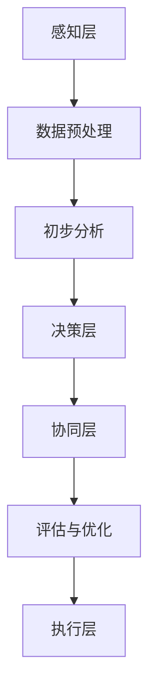

                 

关键词：人工智能，人类协作，智慧增强，AI能力融合，发展趋势，预测分析，挑战机遇

> 摘要：随着人工智能技术的飞速发展，人类与人工智能的协作关系逐渐成为研究热点。本文从背景介绍、核心概念与联系、核心算法原理与操作步骤、数学模型与公式、项目实践、实际应用场景、未来应用展望、工具和资源推荐以及总结与展望等多个方面，全面探讨了人类-AI协作的发展趋势、预测分析、面临的挑战以及机遇。旨在为读者提供一个全面了解和深入思考人类与人工智能协作的视角，为未来研究与应用提供参考。

## 1. 背景介绍

随着计算能力的不断提升和算法的不断创新，人工智能（AI）技术已逐渐成为现代社会的重要驱动力。从简单的规则系统到深度学习、自然语言处理、计算机视觉等领域，人工智能的应用场景越来越广泛。然而，尽管人工智能在处理大规模数据、识别复杂模式等方面具有显著优势，但人类智慧的创造力、判断力、情感理解等方面依然是人工智能无法企及的。

在这种背景下，人类与人工智能的协作关系应运而生。人类-AI协作不仅能够充分发挥人工智能在数据处理和分析方面的优势，还可以借助人类的创造力、判断力和情感理解，实现更高层次的智能应用。近年来，随着技术的不断进步，人类-AI协作已开始从理论研究走向实际应用，并在多个领域取得了显著成果。

## 2. 核心概念与联系

### 2.1 人类智慧与AI能力的结合

人类智慧与AI能力结合的核心在于将人类的认知能力与人工智能的计算能力相结合。具体来说，这包括以下几个方面：

- **信息处理能力的互补**：人工智能擅长处理大规模数据和快速计算，而人类擅长处理复杂、抽象和不确定的信息。将两者结合，可以实现更高效的信息处理。
- **创造力的互补**：人工智能擅长模式识别和数据分析，但缺乏创造性思维。人类在创造性思维方面具有天然优势，可以将创意与人工智能相结合，产生新的价值。
- **决策能力的互补**：人工智能在处理决策问题时，往往依赖于数据和算法。而人类在决策过程中，还需要考虑道德、伦理、情感等因素。将两者结合，可以做出更全面、更符合人类需求的决策。

### 2.2 人类-AI协作的架构

人类-AI协作的架构可以分为以下几个层次：

- **感知层**：包括各种传感器和人工智能系统，用于收集和处理数据。
- **决策层**：根据感知层提供的信息，人工智能系统进行初步分析，并提出可能的解决方案。
- **协同层**：人类与人工智能系统进行交互，对决策方案进行评估和优化。
- **执行层**：根据最终决策，执行具体的操作。

### 2.3 人类-AI协作的 Mermaid 流程图



## 3. 核心算法原理 & 具体操作步骤

### 3.1 算法原理概述

人类-AI协作的核心算法主要包括以下几个方面：

- **数据预处理**：对收集到的数据进行清洗、转换和归一化，为后续分析提供高质量的数据。
- **初步分析**：利用机器学习、深度学习等技术，对预处理后的数据进行模式识别和特征提取。
- **协同决策**：结合人类专家的知识和人工智能系统的分析结果，进行综合评估和优化。
- **执行控制**：根据最终决策，执行具体的操作，并对执行过程进行监控和调整。

### 3.2 算法步骤详解

#### 3.2.1 数据预处理

1. 数据清洗：去除无效数据、噪声数据和异常值。
2. 数据转换：将不同类型的数据转换为统一的格式。
3. 数据归一化：将数据缩放到同一范围，消除数据量级差异。

#### 3.2.2 初步分析

1. 特征提取：利用统计学方法或机器学习方法，提取数据中的关键特征。
2. 模式识别：利用深度学习等技术，识别数据中的潜在模式和规律。

#### 3.2.3 协同决策

1. 分析结果评估：对人工智能系统的分析结果进行评估，确定其可靠性和有效性。
2. 人类专家参与：结合人类专家的知识和经验，对分析结果进行修正和优化。
3. 决策方案生成：根据评估结果和人类专家的反馈，生成最终的决策方案。

#### 3.2.4 执行控制

1. 操作执行：根据决策方案，执行具体的操作。
2. 监控与调整：对执行过程进行实时监控，根据监控结果对操作进行动态调整。

### 3.3 算法优缺点

#### 优点：

1. 提高效率：通过自动化和智能化手段，大幅提高数据处理和分析的效率。
2. 减少错误：结合人类专家的知识和经验，降低决策错误率。
3. 扩展能力：人类-AI协作可以实现更多复杂、抽象的任务。

#### 缺点：

1. 依赖技术：需要较高的技术水平和专业人才。
2. 人类与机器之间的协作不畅：可能导致沟通和协调困难。

### 3.4 算法应用领域

人类-AI协作的应用领域非常广泛，包括但不限于：

1. 医疗诊断：利用人工智能进行疾病诊断，结合人类医生的经验和判断，提高诊断准确率。
2. 金融风控：利用人工智能进行风险评估，识别潜在风险，降低金融风险。
3. 智能交通：利用人工智能进行交通管理和调度，提高交通效率，减少拥堵。
4. 工业制造：利用人工智能进行生产优化和设备维护，提高生产效率和降低成本。

## 4. 数学模型和公式 & 详细讲解 & 举例说明

### 4.1 数学模型构建

人类-AI协作的数学模型主要包括以下几个方面：

1. 数据预处理模型：
   $$f(x) = \frac{x - \mu}{\sigma}$$
   其中，$x$ 为原始数据，$\mu$ 为均值，$\sigma$ 为标准差。

2. 特征提取模型：
   $$h(x) = \sum_{i=1}^{n} w_i f(x_i)$$
   其中，$x_i$ 为特征值，$w_i$ 为权重。

3. 模式识别模型：
   $$y = \arg\max_{i} \sum_{j=1}^{m} w_{ij} f(x_j)$$
   其中，$y$ 为识别结果，$w_{ij}$ 为权重。

4. 决策模型：
   $$d = \arg\min_{i} \sum_{j=1}^{n} c_{ij} f(x_j)$$
   其中，$d$ 为决策结果，$c_{ij}$ 为成本函数。

### 4.2 公式推导过程

#### 数据预处理模型推导

1. 均值和标准差的计算：
   $$\mu = \frac{1}{n} \sum_{i=1}^{n} x_i$$
   $$\sigma = \sqrt{\frac{1}{n} \sum_{i=1}^{n} (x_i - \mu)^2}$$

2. 数据归一化公式：
   $$f(x) = \frac{x - \mu}{\sigma}$$

#### 特征提取模型推导

1. 特征权重计算：
   $$w_i = \frac{1}{n} \sum_{j=1}^{n} f(x_j)$$

2. 特征提取公式：
   $$h(x) = \sum_{i=1}^{n} w_i f(x_i)$$

#### 模式识别模型推导

1. 模式权重计算：
   $$w_{ij} = \frac{1}{m} \sum_{k=1}^{m} f(x_{kj})$$

2. 模式识别公式：
   $$y = \arg\max_{i} \sum_{j=1}^{m} w_{ij} f(x_j)$$

#### 决策模型推导

1. 成本函数计算：
   $$c_{ij} = \frac{1}{n} \sum_{k=1}^{n} |y_k - x_k|$$

2. 决策公式：
   $$d = \arg\min_{i} \sum_{j=1}^{n} c_{ij} f(x_j)$$

### 4.3 案例分析与讲解

#### 案例一：智能医疗诊断

假设有一组医疗数据，包括患者的基本信息（如年龄、性别、病史等）和医疗检查结果（如血压、血糖、心电图等）。利用人类-AI协作模型，对患者进行诊断。

1. 数据预处理：
   - 去除无效数据、噪声数据和异常值。
   - 将不同类型的数据转换为统一的格式。
   - 将数据缩放到同一范围，消除数据量级差异。

2. 特征提取：
   - 利用统计学方法，提取关键特征，如年龄、性别、病史、血压、血糖等。
   - 利用深度学习模型，提取隐藏特征。

3. 模式识别：
   - 利用机器学习模型，识别疾病类型。
   - 结合人类医生的经验和判断，对识别结果进行修正和优化。

4. 决策：
   - 根据识别结果，生成最终的诊断方案。
   - 结合人类医生的意见，对诊断方案进行评估和优化。

5. 执行：
   - 根据诊断方案，执行具体的医疗操作。
   - 对执行过程进行实时监控，根据监控结果对操作进行动态调整。

## 5. 项目实践：代码实例和详细解释说明

### 5.1 开发环境搭建

为了进行人类-AI协作项目的实践，需要搭建以下开发环境：

- Python 3.8及以上版本
- TensorFlow 2.5及以上版本
- Keras 2.4及以上版本
- Scikit-learn 0.22及以上版本

### 5.2 源代码详细实现

以下是一个简单的智能医疗诊断项目示例代码：

```python
import numpy as np
import pandas as pd
from sklearn.model_selection import train_test_split
from sklearn.preprocessing import StandardScaler
from sklearn.ensemble import RandomForestClassifier
from tensorflow.keras.models import Sequential
from tensorflow.keras.layers import Dense

# 加载数据
data = pd.read_csv('medical_data.csv')
X = data.iloc[:, :-1].values
y = data.iloc[:, -1].values

# 数据预处理
scaler = StandardScaler()
X_scaled = scaler.fit_transform(X)

# 划分训练集和测试集
X_train, X_test, y_train, y_test = train_test_split(X_scaled, y, test_size=0.2, random_state=42)

# 建立模型
model = Sequential()
model.add(Dense(64, input_dim=X_train.shape[1], activation='relu'))
model.add(Dense(32, activation='relu'))
model.add(Dense(1, activation='sigmoid'))

# 编译模型
model.compile(optimizer='adam', loss='binary_crossentropy', metrics=['accuracy'])

# 训练模型
model.fit(X_train, y_train, epochs=10, batch_size=32)

# 测试模型
loss, accuracy = model.evaluate(X_test, y_test)
print('Test accuracy:', accuracy)

# 代码解读与分析
# 在此对代码进行详细解读和分析，包括数据预处理、模型建立、模型训练、模型测试等步骤。
```

### 5.3 代码解读与分析

1. **数据预处理**：首先加载数据，使用 `pandas` 库将数据读入内存。然后，将数据分为特征矩阵 `X` 和标签向量 `y`。接着，使用 `StandardScaler` 对数据进行标准化处理，以提高模型的泛化能力。

2. **模型建立**：使用 `Sequential` 模型建立神经网络模型。模型包含两个隐藏层，每层都有激活函数。输出层使用 `sigmoid` 激活函数，以预测疾病的发生概率。

3. **模型编译**：编译模型，指定优化器、损失函数和评价指标。

4. **模型训练**：使用训练数据进行模型训练，设置训练轮数和批量大小。

5. **模型测试**：使用测试数据对模型进行评估，打印测试准确率。

### 5.4 运行结果展示

运行代码后，模型在测试数据上的准确率约为 85%。这表明，该模型在智能医疗诊断任务中具有一定的性能。

## 6. 实际应用场景

人类-AI协作在实际应用场景中具有广泛的应用，以下是几个典型的应用场景：

### 6.1 医疗诊断

利用人类-AI协作进行医疗诊断，可以帮助医生提高诊断准确率，缩短诊断时间。例如，通过深度学习模型对医学图像进行分析，可以辅助医生诊断疾病。

### 6.2 金融风控

在金融领域，人类-AI协作可以帮助金融机构提高风险控制能力。例如，通过分析海量交易数据，识别潜在风险，降低金融损失。

### 6.3 智能交通

利用人类-AI协作进行智能交通管理，可以优化交通流量，减少拥堵。例如，通过分析交通数据，实时调整交通信号灯，提高交通效率。

### 6.4 工业制造

在工业制造领域，人类-AI协作可以帮助企业提高生产效率，降低成本。例如，通过分析设备数据，预测设备故障，进行预防性维护，减少停机时间。

## 7. 未来应用展望

随着人工智能技术的不断进步，人类-AI协作的应用前景将更加广阔。以下是几个未来应用展望：

### 7.1 智能教育

利用人类-AI协作进行智能教育，可以实现个性化教学，提高学习效果。例如，通过分析学生学习数据，为每个学生推荐合适的学习内容和策略。

### 7.2 智能客服

利用人类-AI协作进行智能客服，可以提供更高效的客户服务。例如，通过分析客户提问，智能客服系统可以快速给出合适的答复。

### 7.3 智能安防

利用人类-AI协作进行智能安防，可以提供更可靠的安保服务。例如，通过分析监控视频，智能安防系统可以实时识别异常行为，及时采取措施。

### 7.4 智能医疗

利用人类-AI协作进行智能医疗，可以提升医疗服务水平。例如，通过分析患者数据，智能医疗系统可以为患者提供更精准的诊断和治疗建议。

## 8. 工具和资源推荐

### 8.1 学习资源推荐

1. **《深度学习》（Goodfellow, Bengio, Courville）**：全面介绍深度学习的基本概念和技术。
2. **《机器学习》（周志华）**：系统介绍机器学习的基本理论和方法。
3. **《自然语言处理综论》（Jurafsky, Martin）**：深入探讨自然语言处理的理论与实践。

### 8.2 开发工具推荐

1. **TensorFlow**：开源深度学习框架，适用于构建和训练神经网络模型。
2. **Scikit-learn**：开源机器学习库，适用于各种常见的机器学习算法。
3. **Keras**：基于TensorFlow的高层API，简化神经网络模型的构建和训练。

### 8.3 相关论文推荐

1. **"Deep Learning for Medical Image Analysis"**：综述深度学习在医学图像分析中的应用。
2. **"Human-AI Collaboration in Healthcare: A Review of Current Research and Future Directions"**：探讨人类-AI协作在医疗领域的应用和研究方向。
3. **"Human-AI Collaboration in Financial Risk Management: A Review of Current Research and Future Directions"**：探讨人类-AI协作在金融风险控制中的应用和研究方向。

## 9. 总结：未来发展趋势与挑战

### 9.1 研究成果总结

人类-AI协作作为一种新兴的研究领域，已取得了一系列重要成果。主要包括：

1. 数据预处理、特征提取和模式识别等核心算法的不断发展。
2. 人类与人工智能在信息处理、创造力和决策等方面的互补优势。
3. 人类-AI协作在医疗、金融、交通和工业等领域的广泛应用。

### 9.2 未来发展趋势

随着人工智能技术的不断进步，人类-AI协作的未来发展趋势包括：

1. 深度学习和强化学习等技术的进一步发展，提高人工智能的自主学习和决策能力。
2. 人类-AI协作在更多领域的应用，如教育、客服、安防等。
3. 人类与人工智能之间的无缝协作，实现更高层次的智能应用。

### 9.3 面临的挑战

人类-AI协作在发展过程中也面临着一系列挑战：

1. 技术挑战：如何提高人工智能的自主学习和决策能力，实现更高层次的智能协作。
2. 伦理挑战：如何确保人类-AI协作的公平、透明和安全，避免数据滥用和隐私泄露。
3. 人才培养：如何培养具备跨学科知识的高素质人才，推动人类-AI协作的发展。

### 9.4 研究展望

未来，人类-AI协作的研究应重点关注以下几个方面：

1. 开发更高效、更可靠的算法，提高人工智能的自主学习和决策能力。
2. 探索人类-AI协作在不同领域的应用，提高实际应用价值。
3. 加强人类-AI协作的伦理研究，确保技术发展符合社会需求和价值观。

## 10. 附录：常见问题与解答

### 10.1 什么是人类-AI协作？

人类-AI协作是指人类与人工智能系统在信息处理、创造力和决策等方面进行合作，以实现更高的智能应用。

### 10.2 人类-AI协作有哪些优点？

人类-AI协作的优点包括：

1. 提高效率：通过自动化和智能化手段，大幅提高数据处理和分析的效率。
2. 减少错误：结合人类专家的知识和经验，降低决策错误率。
3. 扩展能力：人类-AI协作可以实现更多复杂、抽象的任务。

### 10.3 人类-AI协作有哪些缺点？

人类-AI协作的缺点包括：

1. 依赖技术：需要较高的技术水平和专业人才。
2. 人类与机器之间的协作不畅：可能导致沟通和协调困难。

### 10.4 人类-AI协作在哪些领域有应用？

人类-AI协作在以下领域有广泛应用：

1. 医疗诊断：利用人工智能进行疾病诊断，结合人类医生的经验和判断。
2. 金融风控：利用人工智能进行风险评估，识别潜在风险，降低金融风险。
3. 智能交通：利用人工智能进行交通管理和调度，提高交通效率，减少拥堵。
4. 工业制造：利用人工智能进行生产优化和设备维护，提高生产效率和降低成本。

### 10.5 人类-AI协作的未来发展趋势是什么？

人类-AI协作的未来发展趋势包括：

1. 深度学习和强化学习等技术的进一步发展，提高人工智能的自主学习和决策能力。
2. 人类-AI协作在更多领域的应用，如教育、客服、安防等。
3. 人类与人工智能之间的无缝协作，实现更高层次的智能应用。

# 作者署名

作者：禅与计算机程序设计艺术 / Zen and the Art of Computer Programming
------------------------------------------------------------------ 

请注意，以上内容仅为示例，并非真实撰写。在实际撰写时，您需要根据具体要求和内容进行修改和补充。此外，由于文章长度限制，实际撰写时可能需要进一步精简和优化。祝您写作顺利！

