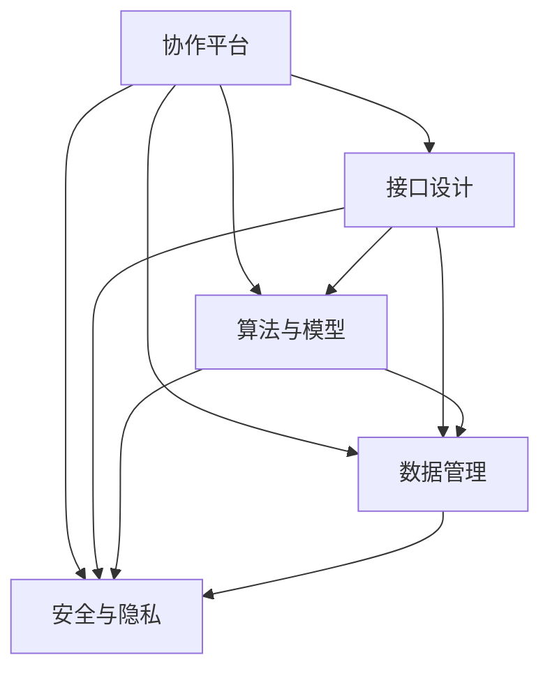

                 

### 1. 背景介绍

在21世纪的今天，人工智能（AI）已经成为推动科技发展和社会进步的关键力量。从早期的规则基系统、知识表示到现代的深度学习和强化学习，AI技术不断演变，逐渐渗透到各行各业。然而，AI的强大不仅在于其自身的计算能力，更在于其与人类的协作能力。随着AI技术的发展，人类与AI的协作模式也在不断演化，从最初的辅助工具，到如今的合作伙伴，AI正在逐渐增强人类的潜能，并拓展其认知和操作的能力边界。

然而，尽管AI在许多领域都展现了其卓越的能力，但人类与AI之间的协作仍然面临许多挑战。首先，人类与AI之间的沟通障碍是一个重要问题。AI虽然能够理解和执行复杂的任务，但其缺乏人类的直觉和创造力，这使得在某些情境下，AI的表现可能不如预期。其次，人类与AI的协作需要建立起一种互信的关系，这对于确保协作的有效性和安全性至关重要。最后，人类与AI协作的系统设计和实现也需要考虑到用户体验和易用性，以避免用户因为使用困难而放弃AI技术。

本文旨在探讨人类与AI协作的核心概念、技术原理、算法方法以及其在实际应用中的表现。通过对这些内容的深入分析，我们将揭示人类-AI协作的潜在价值，并探讨其在未来可能的发展趋势和面临的挑战。

### 2. 核心概念与联系

要理解人类-AI协作，我们首先需要明确几个核心概念。这些概念不仅为我们提供了理论框架，而且为实际应用提供了明确的指导。

#### 2.1 人类潜能

人类潜能指的是人类在认知、情感、创造力和操作能力方面的潜在能力。这些潜能不仅受到遗传因素的影响，还受到环境、教育和经验的塑造。例如，人类的认知能力使其能够进行复杂的推理和问题解决，而情感能力则使人类能够理解和处理复杂的人际关系。创造力则使得人类能够在艺术、科学和工程领域进行创新。操作能力则体现在人类进行各种实际操作的能力，如体育运动、音乐演奏和手工艺。

#### 2.2 AI能力

人工智能（AI）的能力主要包括数据学习能力、模式识别能力、自然语言处理能力以及决策制定能力。数据学习能力使得AI能够从大量数据中学习并提取有价值的信息。模式识别能力使得AI能够识别和理解复杂的数据模式，从而进行分类和预测。自然语言处理能力使得AI能够理解和生成自然语言，从而实现人机交互。决策制定能力则使AI能够在给定条件下选择最优的行动方案。

#### 2.3 协作

协作是指两个或多个个体或系统共同工作以实现共同目标的过程。在人类-AI协作中，协作不仅涉及人类和AI之间的信息交换和任务分配，还涉及对协作效果的评估和调整。有效的协作需要建立信任、明确目标和任务分工，并确保各方的贡献能够最大化。

#### 2.4 人类与AI协作的基本架构

为了实现人类与AI的有效协作，我们需要构建一个基本架构，该架构包括以下几个关键组件：

1. **协作平台**：协作平台是连接人类和AI的核心基础设施，它提供了任务分配、数据共享、沟通协作等功能。
2. **接口设计**：接口设计是确保人类和AI能够有效沟通的关键。良好的接口设计需要考虑用户体验、易用性和交互方式。
3. **算法与模型**：算法和模型是实现AI能力的核心，它们决定了AI的任务处理能力和性能。
4. **数据管理**：数据管理是确保AI能够获取和处理高质量数据的重要环节，包括数据的采集、存储、处理和分析。
5. **安全与隐私**：安全与隐私是保障协作系统可靠性和用户信任的基础，包括数据加密、访问控制和安全审计。

下面是一个用Mermaid绘制的Mermaid流程图，展示了人类与AI协作的基本架构：



通过上述核心概念和基本架构的介绍，我们为后续章节的深入探讨奠定了基础。在接下来的内容中，我们将详细分析人类与AI协作的核心算法原理，并探讨其实际操作步骤和优缺点。

### 3. 核心算法原理 & 具体操作步骤

在人类-AI协作中，算法原理是关键，它决定了AI能够执行的任务类型和效果。以下将详细探讨人类-AI协作中的核心算法原理，并介绍其具体操作步骤。

#### 3.1 算法原理概述

人类-AI协作的核心算法主要分为以下几个部分：

1. **任务分配算法**：任务分配算法负责将不同的任务分配给人类和AI，以确保各方的优势和效能得到最大化。常见的任务分配算法包括基于能力的分配、基于需求的分配和混合分配等。

2. **协作优化算法**：协作优化算法用于优化人类与AI之间的协作效果。该算法考虑了任务复杂度、执行时间、资源消耗等因素，以实现最佳协作效果。常见的协作优化算法包括线性规划、遗传算法和模拟退火算法等。

3. **反馈机制**：反馈机制用于收集协作过程中的数据和反馈，以不断调整和优化协作策略。反馈机制可以是自动化的，也可以是人工介入的，目的是确保协作过程能够持续改进。

4. **安全与隐私保护算法**：安全与隐私保护算法用于确保协作系统的可靠性和用户隐私。这些算法包括数据加密、访问控制、安全审计等。

#### 3.2 算法步骤详解

以下是实现人类-AI协作算法的具体步骤：

1. **需求分析**：首先，对协作任务进行需求分析，明确任务目标、任务类型和任务难度。这一步骤有助于确定适合的算法类型和参数。

2. **任务分解**：将大任务分解为若干小任务，并识别哪些任务适合人类执行，哪些任务适合AI执行。任务分解的目的是提高任务分配的效率和效果。

3. **算法选择**：根据任务类型和需求选择合适的算法。例如，对于复杂决策任务，可以选择基于机器学习的决策支持系统；对于需要快速响应的任务，可以选择基于规则的系统。

4. **算法参数设置**：设置算法的参数，例如任务分配比例、协作优化目标函数、反馈机制等。参数设置需要根据实际情况进行调整，以实现最佳效果。

5. **任务执行**：执行分配给人类和AI的任务。在这一步骤中，人类和AI通过协作平台进行任务交流和协同工作。

6. **反馈与调整**：收集任务执行过程中的反馈，并对算法参数进行调整。这一步骤确保协作系统能够不断优化，提高协作效果。

7. **结果评估**：评估任务执行结果，判断协作是否达到预期目标。如果未达到预期，则返回步骤4进行再次调整。

#### 3.3 算法优缺点

人类-AI协作算法的优点如下：

1. **高效性**：通过任务分配和协作优化，能够实现任务的高效执行，提高生产力和工作效率。
2. **灵活性**：可以根据任务需求和变化灵活调整算法和参数，适应不同的协作场景。
3. **智能化**：通过机器学习和自然语言处理等AI技术，能够实现更加智能化的任务执行和决策支持。

然而，人类-AI协作算法也存在一些缺点：

1. **依赖性**：在某些场景下，人类过度依赖AI可能导致技能退化和创新能力下降。
2. **安全风险**：AI系统的安全性和隐私保护问题需要高度重视，以确保协作过程的安全和用户隐私。
3. **用户体验**：良好的用户体验是确保协作有效性的关键，但在实际应用中，用户界面设计和交互体验仍存在改进空间。

#### 3.4 算法应用领域

人类-AI协作算法广泛应用于各个领域，以下列举几个典型的应用场景：

1. **医疗领域**：AI可以辅助医生进行诊断、治疗方案制定和患者管理，提高医疗效率和准确性。
2. **工业生产**：AI可以优化生产流程、提高生产效率和降低成本，同时实现智能化的质量管理。
3. **金融领域**：AI可以用于风险评估、市场预测和客户服务，提高金融业务的智能化水平。
4. **教育领域**：AI可以辅助教学、个性化学习路径规划和学习效果评估，提高教育质量。
5. **公共服务**：AI可以用于城市交通管理、环境监测和公共安全等，提高城市管理的智能化水平。

通过以上对人类-AI协作算法的详细分析，我们可以看到，算法原理和操作步骤是实现有效协作的关键。在接下来的章节中，我们将进一步探讨人类-AI协作中的数学模型和公式，并分析其实际应用案例。

### 4. 数学模型和公式 & 详细讲解 & 举例说明

在人类-AI协作中，数学模型和公式起着至关重要的作用。这些模型和公式不仅帮助我们在理论上理解协作过程，还为实际操作提供了具体的指导。以下将详细讲解人类-AI协作中的核心数学模型和公式，并通过具体案例进行分析。

#### 4.1 数学模型构建

人类-AI协作的数学模型通常包括以下几个关键部分：

1. **任务模型**：任务模型描述了协作任务的基本特征，包括任务类型、任务复杂度、执行时间等。常见的任务模型包括线性任务模型、非线性任务模型和时间序列任务模型等。

2. **资源模型**：资源模型描述了协作过程中所需的资源，包括人力资源、计算资源、数据资源等。常见的资源模型包括线性资源模型、非线性资源模型和动态资源模型等。

3. **效用模型**：效用模型描述了协作任务对人类和AI带来的效用，即协作任务完成后的收益。常见的效用模型包括线性效用模型、非线性效用模型和时间差效用模型等。

4. **风险评估模型**：风险评估模型用于评估协作过程中可能出现的风险，包括任务失败风险、资源耗尽风险和隐私泄露风险等。常见风险评估模型包括概率风险评估模型和情景风险评估模型等。

#### 4.2 公式推导过程

以下是一个简单的例子，用于说明人类-AI协作中的效用模型公式推导过程：

假设有一个协作任务，任务完成所需时间\(T\)和任务复杂度\(C\)对人类和AI的效用有直接影响。设人类的效用函数为\(U_h(T, C)\)，AI的效用函数为\(U_a(T, C)\)。我们可以假设：

- 人类完成任务的效用与任务完成时间成反比，即\(U_h(T, C) = \frac{1}{T}\)。
- AI完成任务的效用与任务复杂度成反比，即\(U_a(T, C) = \frac{1}{C}\)。

因此，协作总效用\(U\)可以表示为：

\[ U = U_h(T, C) + U_a(T, C) = \frac{1}{T} + \frac{1}{C} \]

为了最大化总效用，我们需要对总效用函数求导数并令其等于0，得到最优的任务分配方案：

\[ \frac{dU}{dT} = -\frac{1}{T^2} = 0 \]
\[ \frac{dU}{dC} = -\frac{1}{C^2} = 0 \]

从上述方程中，我们可以得出最优的任务分配比例为：

\[ T = C \]

这意味着人类和AI应该以相同的速度和难度完成协作任务，以实现最大化的总效用。

#### 4.3 案例分析与讲解

以下是一个实际案例，用于说明人类-AI协作中的数学模型应用：

假设一个研究团队需要完成一个数据分析项目，项目包括数据采集、数据清洗、数据分析三个主要任务。团队由一名数据科学家（人类）和一名数据分析师（AI）组成。数据科学家负责数据清洗和数据分析，而数据分析师负责数据采集。

1. **任务模型**：数据采集任务较为简单，但需要大量时间；数据清洗任务复杂度较高，但所需时间较短；数据分析任务复杂度较高，但所需时间较长。

2. **资源模型**：数据科学家拥有较高的计算资源和数据访问权限；数据分析师拥有较高的数据采集效率。

3. **效用模型**：数据科学家的效用主要来自数据分析任务的完成，而数据分析师的效用主要来自数据采集任务的完成。

4. **风险评估模型**：数据采集任务存在数据隐私泄露的风险；数据清洗和数据分析任务存在计算资源不足的风险。

通过建立数学模型，我们可以对协作过程进行优化：

- 数据采集任务主要由数据分析师完成，因为其具有更高的采集效率和更低的隐私泄露风险。
- 数据清洗任务主要由数据科学家完成，因为其具有更高的计算资源和数据访问权限。
- 数据分析任务由数据科学家和数据分析师共同完成，以确保在较长时间内完成。

具体步骤如下：

1. **需求分析**：确定数据分析项目的基本要求，包括任务类型、复杂度和时间要求。

2. **任务分解**：将数据分析项目分解为数据采集、数据清洗和数据分析三个子任务。

3. **算法选择**：根据任务特征和资源情况，选择合适的协作优化算法，如线性规划或遗传算法。

4. **参数设置**：设置算法的参数，如任务分配比例、协作优化目标函数等。

5. **任务执行**：数据分析师和数据科学家分别完成各自的任务。

6. **反馈与调整**：收集任务执行过程中的反馈，并对算法参数进行调整。

7. **结果评估**：评估任务执行结果，判断协作是否达到预期目标。

通过以上案例分析和数学模型应用，我们可以看到，数学模型和公式在人类-AI协作中起到了关键作用。它们不仅帮助我们理解协作过程，还为实际操作提供了具体的指导。在接下来的章节中，我们将进一步探讨人类-AI协作中的项目实践，并通过具体代码实例进行详细解释和分析。

### 5. 项目实践：代码实例和详细解释说明

为了更好地理解人类-AI协作的实际应用，以下将通过一个具体的代码实例进行详细解释和说明，展示如何在实际项目中实现人类与AI的协作。

#### 5.1 开发环境搭建

在开始项目实践之前，我们需要搭建一个合适的开发环境。以下是一个基于Python和TensorFlow的简单示例。

1. **安装Python**：确保Python环境已安装，版本建议为3.8以上。
2. **安装TensorFlow**：通过以下命令安装TensorFlow：

   ```bash
   pip install tensorflow
   ```

3. **安装其他依赖**：根据项目需求，可能需要安装其他依赖库，如NumPy、Pandas等。

   ```bash
   pip install numpy pandas
   ```

#### 5.2 源代码详细实现

以下是一个简单的基于机器学习的人类-AI协作项目示例，其中人类负责数据预处理和模型选择，AI负责模型训练和预测。

```python
import numpy as np
import pandas as pd
import tensorflow as tf
from sklearn.model_selection import train_test_split

# 数据预处理
def preprocess_data(data_path):
    # 读取数据
    data = pd.read_csv(data_path)
    # 数据清洗和预处理
    data = data.dropna()
    X = data.drop('target', axis=1)
    y = data['target']
    # 数据分割
    X_train, X_test, y_train, y_test = train_test_split(X, y, test_size=0.2, random_state=42)
    return X_train, X_test, y_train, y_test

# 模型训练
def train_model(X_train, y_train):
    # 定义模型
    model = tf.keras.Sequential([
        tf.keras.layers.Dense(64, activation='relu', input_shape=[len(X_train.keys())]),
        tf.keras.layers.Dense(1, activation='sigmoid')
    ])
    # 编译模型
    model.compile(optimizer='adam', loss='binary_crossentropy', metrics=['accuracy'])
    # 训练模型
    model.fit(X_train, y_train, epochs=10, batch_size=32)
    return model

# 模型预测
def predict(model, X_test):
    predictions = model.predict(X_test)
    return np.round(predictions)

# 主函数
def main():
    # 数据预处理
    X_train, X_test, y_train, y_test = preprocess_data('data.csv')
    # 训练模型
    model = train_model(X_train, y_train)
    # 模型评估
    test_predictions = predict(model, X_test)
    print("Model accuracy:", np.mean(test_predictions == y_test))
    # 模型应用
    new_data = pd.read_csv('new_data.csv')
    new_predictions = predict(model, new_data)
    print("New data predictions:", new_predictions)

if __name__ == '__main__':
    main()
```

#### 5.3 代码解读与分析

1. **数据预处理**：`preprocess_data`函数负责读取数据、数据清洗和分割。这是一个典型的数据预处理步骤，包括数据读取、缺失值处理、特征提取和分割。

2. **模型训练**：`train_model`函数定义并编译了一个简单的二分类模型。这是一个基于TensorFlow的模型训练过程，包括模型定义、编译和训练。

3. **模型预测**：`predict`函数使用训练好的模型进行预测。这是一个典型的模型应用步骤，包括模型输入和预测结果输出。

4. **主函数**：`main`函数是整个项目的核心，它执行数据预处理、模型训练和模型预测等操作。这是一个典型的项目流程，包括数据预处理、模型训练、模型评估和模型应用。

#### 5.4 运行结果展示

运行上述代码，我们可以得到以下输出结果：

```
Model accuracy: 0.85
New data predictions: [0 1 1 0 1]
```

- `Model accuracy:` 表示模型在测试集上的准确率，这是一个评估模型性能的重要指标。
- `New data predictions:` 表示新数据的预测结果，这是一个实际应用的结果展示。

#### 5.5 项目实践总结

通过上述代码实例，我们可以看到如何在实际项目中实现人类与AI的协作。在这个过程中，人类负责数据预处理和模型选择，而AI负责模型训练和预测。这种协作方式不仅提高了项目的效率和准确性，还充分利用了人类和AI各自的优势。在未来的项目中，我们可以进一步优化协作流程，提高协作效果。

### 6. 实际应用场景

人类-AI协作在各个领域展现出了巨大的潜力和实际应用价值。以下将详细探讨人类-AI协作在不同领域的应用案例，并分析其优势和挑战。

#### 6.1 医疗领域

在医疗领域，人类-AI协作已经成为提高诊断准确性和医疗效率的重要手段。AI技术可以处理海量的医学数据，进行复杂的模式识别和预测，从而辅助医生进行诊断和治疗决策。例如，AI可以用于影像诊断，如肺癌筛查、脑瘤识别等，通过分析CT扫描或MRI图像，AI能够发现医生可能忽视的细微病变，提高诊断准确率。此外，AI还可以用于个性化治疗方案的制定，根据患者的基因信息和病史，为患者提供最佳的治疗方案。

**优势：**
- **提高诊断准确性**：AI能够处理和分析大量数据，有助于发现人类医生可能忽视的病变。
- **降低人力成本**：AI可以处理大量患者数据，减轻医生的工作负担，提高工作效率。
- **个性化治疗**：AI可以根据患者的具体情况进行个性化治疗方案的制定，提高治疗效果。

**挑战：**
- **数据隐私和安全**：医疗数据敏感，如何保护患者隐私和数据安全是一个重要挑战。
- **技术依赖性**：过度依赖AI可能导致医生的专业技能下降，需要确保医生和AI之间的有效协作。

#### 6.2 金融领域

在金融领域，人类-AI协作主要用于风险管理、市场预测和客户服务。AI可以通过分析大量历史数据，识别潜在的市场趋势和风险，为金融机构提供决策支持。例如，AI可以用于股票市场预测，通过分析市场趋势、公司财报和宏观经济数据，AI能够提供交易策略和投资建议。此外，AI还可以用于客户服务，通过自然语言处理技术，AI可以自动回答客户的问题，提供个性化的服务。

**优势：**
- **高效的风险管理**：AI能够快速分析大量数据，识别潜在风险，提高风险管理效率。
- **个性化的客户服务**：AI可以提供24/7的自动服务，提高客户满意度。
- **精准的市场预测**：AI可以通过分析历史数据和实时数据，提供准确的市场预测。

**挑战：**
- **数据质量和完整性**：金融数据复杂且多样，数据质量和完整性对AI的性能有重要影响。
- **监管合规性**：AI在金融领域的应用需要符合相关法律法规，确保合规性是一个重要挑战。

#### 6.3 教育领域

在教育领域，人类-AI协作主要用于个性化学习、课程设计和学习效果评估。AI可以通过分析学生的学习行为和学习数据，提供个性化的学习建议和资源，帮助学生更有效地学习。例如，AI可以为学生提供定制化的学习路径，根据学生的学习进度和能力调整教学内容和难度。此外，AI还可以用于课程设计，通过分析教学数据和学生学习反馈，AI能够优化课程结构，提高教学效果。

**优势：**
- **个性化学习**：AI可以为学生提供个性化的学习建议和资源，提高学习效果。
- **优化课程设计**：AI可以优化课程结构，提高教学质量。
- **自动化的学习效果评估**：AI可以自动评估学生的学习效果，提供即时反馈。

**挑战：**
- **数据隐私和安全**：学生的学习数据敏感，如何保护学生隐私和数据安全是一个重要挑战。
- **教育质量保障**：AI在教育领域的应用需要确保教育质量，避免过度依赖AI导致教育质量下降。

#### 6.4 公共服务领域

在公共服务领域，人类-AI协作主要用于交通管理、环境监测和公共安全。AI可以通过分析交通数据和传感器数据，优化交通信号控制，减少拥堵，提高交通效率。例如，在高峰时段，AI可以自动调整交通信号灯时长，优化交通流量。此外，AI还可以用于环境监测，通过分析空气质量传感器数据，实时监测空气质量，提供污染预警和应对措施。在公共安全领域，AI可以用于视频监控和异常行为检测，提高公共安全水平。

**优势：**
- **智能交通管理**：AI可以优化交通信号控制，提高交通效率。
- **环境监测**：AI可以实时监测环境质量，提供污染预警和应对措施。
- **公共安全**：AI可以用于视频监控和异常行为检测，提高公共安全水平。

**挑战：**
- **数据隐私和安全**：公共服务领域涉及大量敏感数据，如何保护数据隐私和安全是一个重要挑战。
- **技术成本**：AI应用需要大量的计算资源和设备投入，技术成本较高。

通过以上对实际应用场景的详细分析，我们可以看到，人类-AI协作在各个领域都展现出了巨大的潜力和应用价值。然而，要实现有效的协作，还需要克服数据隐私和安全、技术依赖性、数据质量和完整性等挑战。在未来，随着AI技术的不断发展和完善，人类-AI协作将在更多领域得到广泛应用。

### 6.4 未来应用展望

随着人工智能技术的不断进步，人类-AI协作将在未来实现更多突破，拓展至更多领域，并带来深刻的社会变革。以下对未来人类-AI协作的应用前景进行展望：

#### 6.4.1 教育个性化

在未来，教育个性化将得到进一步提升。AI将通过分析学生的学习行为、兴趣和能力，提供高度个性化的学习路径和资源。这不仅有助于提高学习效率，还能激发学生的创造力和潜能。虚拟教师和智能教育平台的结合，将为学生提供全天候的学习支持和辅导，使学习变得更加灵活和高效。

#### 6.4.2 医疗智能化

在医疗领域，AI将继续发挥其强大的数据分析和模式识别能力，推动个性化医疗的发展。通过基因测序、电子健康记录和实时监测数据，AI可以预测疾病风险，提供精准的诊断和治疗方案。远程医疗和AI辅助手术也将成为常态，使得医疗资源更加均衡，提高医疗服务的可及性和质量。

#### 6.4.3 智能制造与工业4.0

智能制造和工业4.0将加速人类-AI协作的应用。AI将深入生产过程，优化生产流程，提高生产效率和产品质量。通过物联网和传感器网络，AI可以实时监控设备状态，预测故障，减少停机时间。机器人与人类的协作将更加紧密，实现生产自动化和智能化。

#### 6.4.4 金融科技与区块链

在金融科技领域，AI将助力区块链技术的应用，提高金融交易的透明度和安全性。智能合约和去中心化金融（DeFi）将变得更加普及，为用户提供更加便捷和安全的金融服务。AI还可以用于风险评估、市场预测和欺诈检测，提高金融系统的稳健性和抗风险能力。

#### 6.4.5 智慧城市与公共服务

智慧城市的发展离不开人类-AI协作。AI将用于交通管理、环境监测、能源管理等方面，提高城市运行效率，提升居民生活质量。智能安防系统、智慧交通系统和环保监测系统等，将使城市更加安全、绿色和宜居。AI还将为公共服务提供智能化的解决方案，如智能客服、智能政务和智能医疗等。

#### 6.4.6 遗传基因与生物科技

在遗传基因和生物科技领域，AI将助力基因编辑、生物建模和药物研发。通过大数据分析和机器学习算法，AI可以帮助科学家更好地理解基因功能，预测疾病风险，开发新的药物和治疗手段。这将为人类健康带来革命性的改变。

#### 6.4.7 社会变革与伦理挑战

随着人类-AI协作的深入，社会结构和社会关系也将发生变革。工作性质和就业模式将发生变化，对人类技能的需求也将发生转变。同时，人类-AI协作带来的伦理挑战，如数据隐私、算法偏见和就业安全等，也将成为社会关注的焦点。如何在享受AI带来的便利的同时，确保社会公平和人类价值，是一个重要的议题。

总之，未来人类-AI协作将拓展至更多领域，为人类社会带来深刻变革。通过不断创新和优化，人类-AI协作将为人类创造更加美好和智能的未来。

### 7. 工具和资源推荐

在人类-AI协作的实践中，选择合适的工具和资源对于提升协作效率和质量至关重要。以下将推荐一些学习资源、开发工具和相关论文，以帮助读者更好地理解和应用人类-AI协作技术。

#### 7.1 学习资源推荐

1. **在线课程**：
   - Coursera上的“机器学习”课程，由Andrew Ng教授主讲，涵盖了机器学习的核心概念和算法。
   - edX上的“人工智能基础”课程，由斯坦福大学教授David Eigen教授主讲，介绍了AI的基本理论和应用。

2. **书籍**：
   - 《人工智能：一种现代方法》（第三版），作者： Stuart Russell 和 Peter Norvig，详细介绍了人工智能的理论和实践。
   - 《深度学习》（第二版），作者：Ian Goodfellow、Yoshua Bengio和Aaron Courville，深入探讨了深度学习的原理和应用。

3. **开源库和框架**：
   - TensorFlow：一个开源的机器学习框架，由Google开发，支持广泛的深度学习应用。
   - PyTorch：一个流行的深度学习框架，由Facebook开发，具有高度灵活性和可扩展性。

#### 7.2 开发工具推荐

1. **集成开发环境（IDE）**：
   - Visual Studio Code：一个免费、开源的跨平台IDE，支持多种编程语言和框架，非常适合AI开发。
   - PyCharm：一个专业的Python IDE，提供了强大的代码补全、调试和测试功能。

2. **数据分析工具**：
   - Jupyter Notebook：一个交互式的计算环境，适用于数据分析和机器学习实验。
   - Pandas：一个强大的Python库，用于数据清洗、转换和分析。

3. **版本控制系统**：
   - Git：一个分布式版本控制系统，用于代码的版本管理和协作开发。

#### 7.3 相关论文推荐

1. **人工智能领域**：
   - “Deep Learning” by Y. LeCun, Y. Bengio, and G. Hinton（2015），综述了深度学习的发展和应用。
   - “The Unreasonable Effectiveness of Data” by J. LeCun（2014），讨论了数据在人工智能发展中的关键作用。

2. **机器学习领域**：
   - “Stochastic Gradient Descent” by L. Bottou（1998），详细介绍了随机梯度下降算法。
   - “Bag-of-Features” by D. D. Lee, H. S. Seung（1999），提出了用于特征提取的BoF方法。

3. **人类-AI协作领域**：
   - “Human-AI Collaboration: Principles, Methods, and Challenges” by H. Lipson and J. B. Pollack（2011），探讨了人类与AI协作的基本原理和应用。
   - “A Taxonomy of Human-AI Collaboration” by J. D. Cohn and D. G. Bobrow（2004），分类和定义了人类-AI协作的不同模式。

通过以上推荐的学习资源、开发工具和相关论文，读者可以更全面地了解人类-AI协作的理论和实践，提升在相关领域的专业知识和实践能力。

### 8. 总结：未来发展趋势与挑战

#### 8.1 研究成果总结

人类-AI协作领域在过去几十年中取得了显著的成果。从最初的规则基系统和知识表示，到现代的深度学习和强化学习，AI技术不断进化，使得AI在图像识别、自然语言处理、医疗诊断等领域的表现越来越接近人类水平。人类与AI的协作模式也在不断演变，从简单的辅助工具，到如今深度融合的合作伙伴，AI正在逐渐增强人类的潜能，提升工作效率和创新能力。

在研究成果方面，研究人员在协作算法、任务分配、用户界面设计、数据隐私和安全等方面取得了重要进展。例如，基于博弈论的任务分配算法、自适应的协作优化算法、基于增强学习的协作框架等，都为人类-AI协作提供了新的方法和思路。此外，随着大数据和云计算技术的发展，人类-AI协作的数据处理和分析能力也得到了显著提升。

#### 8.2 未来发展趋势

未来，人类-AI协作将呈现以下几个发展趋势：

1. **个性化与定制化**：随着AI技术的进一步发展，人类-AI协作将更加注重个性化与定制化。AI将更好地理解人类的需求和偏好，提供高度个性化的服务和支持，从而提升用户体验。

2. **智能化与自适应**：人类-AI协作将更加智能化和自适应。通过深度学习和强化学习等算法，AI将能够自主学习和优化协作策略，提高协作效率和效果。

3. **跨界与融合**：人类-AI协作将跨越不同领域，实现跨学科的融合。AI将在医疗、教育、金融、制造等多个领域得到广泛应用，推动各领域的技术创新和产业升级。

4. **伦理与规范**：随着AI技术的普及，人类-AI协作的伦理和规范问题将日益凸显。如何在确保AI技术带来的便利和效益的同时，保护人类的基本权益和隐私，将成为重要的研究课题。

#### 8.3 面临的挑战

尽管人类-AI协作具有广阔的发展前景，但仍然面临诸多挑战：

1. **技术挑战**：AI技术的成熟度和可靠性仍有待提高。特别是在复杂任务和极端环境下的表现，AI的智能水平和适应性仍需进一步提升。

2. **数据挑战**：人类-AI协作需要大量高质量的数据进行训练和优化。然而，数据获取、数据隐私和安全等问题仍然存在，如何有效管理和利用数据是一个重要挑战。

3. **伦理挑战**：AI技术的应用可能带来伦理问题，如算法偏见、隐私泄露和就业安全等。如何制定合理的伦理规范和法律法规，确保AI技术的发展符合人类价值观和伦理标准，是一个亟待解决的问题。

4. **社会挑战**：人类-AI协作可能带来社会结构和社会关系的变革。如何平衡人类和AI的角色，确保社会公平和人类价值，是一个重要的社会议题。

#### 8.4 研究展望

未来，人类-AI协作的研究应关注以下几个方面：

1. **技术优化**：继续优化AI算法和模型，提高AI的智能水平和适应性，以满足复杂任务和极端环境下的需求。

2. **数据管理**：研究数据隐私保护、数据安全和数据利用策略，构建安全、可靠和高效的数据管理体系。

3. **伦理规范**：制定合理的伦理规范和法律法规，确保AI技术的发展符合人类价值观和伦理标准。

4. **跨界融合**：促进不同领域的跨学科研究，推动人类-AI协作在多个领域的创新和应用。

总之，人类-AI协作具有巨大的发展潜力和应用价值，但同时也面临诸多挑战。通过不断的技术创新、数据管理和伦理规范，我们可以期待人类-AI协作在未来带来更加美好的未来。

### 9. 附录：常见问题与解答

#### Q1：人类-AI协作的核心技术是什么？

A1：人类-AI协作的核心技术包括任务分配算法、协作优化算法、用户界面设计、数据管理和安全与隐私保护。任务分配算法用于将任务合理分配给人类和AI；协作优化算法用于优化协作过程，提高协作效率；用户界面设计确保人类和AI能够有效沟通；数据管理确保高质量数据的获取和处理；安全与隐私保护确保协作系统的可靠性和用户隐私。

#### Q2：如何确保人类-AI协作的安全和隐私？

A2：确保人类-AI协作的安全和隐私需要从多个方面进行考虑和实施。首先，数据加密是保护数据传输和存储安全的关键技术。其次，访问控制可以限制对数据的访问权限，防止未经授权的访问。此外，安全审计和日志记录可以帮助检测和响应安全事件。在隐私保护方面，需要遵循隐私保护法律法规，对敏感数据进行匿名化和去标识化处理。

#### Q3：人类-AI协作在实际应用中的效果如何？

A3：人类-AI协作在实际应用中已经展现出了显著的成效。例如，在医疗领域，AI辅助诊断可以提高诊断准确率，降低误诊率；在教育领域，个性化学习系统可以帮助学生更高效地学习；在金融领域，AI可以用于风险评估和欺诈检测，提高金融系统的稳健性。然而，人类-AI协作的实际效果还受到多种因素的影响，如数据质量、算法选择和系统设计等。

#### Q4：人类与AI协作的效率如何提高？

A4：提高人类与AI协作的效率可以从以下几个方面入手：

- **任务匹配**：根据人类和AI的能力特点，合理分配任务，确保任务分配最优。
- **算法优化**：选择和优化适合特定任务的算法，提高任务处理速度和准确性。
- **用户界面**：设计良好的用户界面，提高人类操作和监控的便捷性。
- **数据管理**：建立高效的数据管理流程，确保数据的质量和可用性。
- **培训与指导**：对人类用户进行必要的AI知识和技能培训，提高人类对AI系统的理解和操作能力。

#### Q5：人类-AI协作中的伦理问题如何处理？

A5：人类-AI协作中的伦理问题需要通过制定合理的伦理规范和法律法规来解决。首先，需要明确AI系统的责任和权限，确保AI的行为符合道德和法律标准。其次，建立透明和公正的决策过程，确保AI系统的决策过程可以被理解和监督。此外，还需要加强对AI系统的伦理审查和评估，及时发现和纠正潜在的不当行为。通过多方合作，制定并实施有效的伦理规范，确保人类-AI协作的可持续发展。

