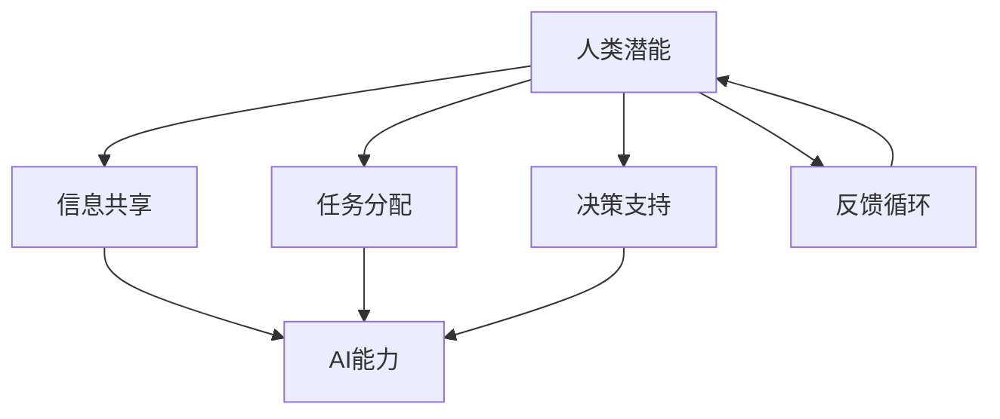

                 

关键词：人类-AI协作，人工智能，潜能，融合发展，前景分析

摘要：本文将深入探讨人类与人工智能（AI）协作的背景、核心概念、算法原理、数学模型、项目实践、应用场景、未来展望，以及面临的挑战。通过详细的分析，旨在揭示AI如何赋能人类，提升个体的工作效率与创造力，从而推动人类潜能的进一步发展。

## 1. 背景介绍

随着信息技术的飞速发展，人工智能（AI）已经成为现代社会的重要驱动力。从早期的规则基础专家系统，到如今基于深度学习的复杂模型，AI技术的进步为各行各业带来了深刻的变革。然而，尽管AI在处理大量数据、执行重复性任务和模拟复杂决策方面表现出色，但人类在某些领域仍具有不可替代的优势，如创造力、情感理解和直觉判断。

因此，人类与AI的协作成为一种新的趋势。通过将人类的直觉和经验与AI的计算能力和分析能力相结合，可以实现更高效、更智能的工作方式。这不仅有助于提升个人的生产力，还能够推动整个社会的发展。

## 2. 核心概念与联系

### 2.1 人类潜能

人类潜能是指人类在认知、情感、创造力等方面所具备的潜在能力。这些能力可以通过教育、训练和实践得到开发和提升。人类潜能的核心在于其灵活性和适应性，这使得人类能够处理复杂、不确定的任务。

### 2.2 AI能力

AI能力包括机器学习、自然语言处理、计算机视觉、自动驾驶等多个方面。AI的核心优势在于其强大的数据处理能力和模式识别能力，这使得AI能够在短时间内完成大量的计算和分析任务。

### 2.3 协作原理

人类与AI的协作原理基于以下几个核心要素：

1. **信息共享**：人类和AI通过数据共享实现信息流动，使得双方能够获取到对方的知识和技能。
2. **任务分配**：根据人类和AI的优势，合理分配任务，最大化整体效率。
3. **决策支持**：AI可以辅助人类进行决策，提供数据分析和预测结果。
4. **反馈循环**：人类对AI的决策进行反馈，帮助AI不断优化和学习。

### 2.4 Mermaid 流程图



## 3. 核心算法原理 & 具体操作步骤

### 3.1 算法原理概述

人类-AI协作的核心算法基于多智能体系统理论，该理论强调不同智能体之间的交互和协同。具体来说，算法包括以下几个关键步骤：

1. **任务建模**：对人类和AI的任务能力进行建模，明确各自的优势和局限性。
2. **资源分配**：根据任务建模结果，合理分配资源，确保高效协作。
3. **协作策略**：设计协作策略，实现人类和AI的协同工作。
4. **反馈机制**：建立反馈机制，不断调整和优化协作过程。

### 3.2 算法步骤详解

1. **任务建模**：

   - **数据收集**：收集人类和AI在各个任务领域的表现数据。
   - **特征提取**：提取关键特征，如人类在创造力、情感理解方面的能力，AI在计算、数据分析方面的优势。
   - **模型构建**：基于特征数据，构建人类和AI的任务能力模型。

2. **资源分配**：

   - **任务分析**：对各个任务进行详细分析，明确任务的关键步骤和所需资源。
   - **资源匹配**：根据任务分析结果，匹配人类和AI的资源，确保任务高效完成。

3. **协作策略**：

   - **任务分解**：将复杂任务分解为多个子任务，分别分配给人类和AI。
   - **协同工作**：设计协作机制，实现人类和AI在子任务中的高效配合。

4. **反馈机制**：

   - **结果评估**：对协作结果进行评估，分析协作效果。
   - **反馈调整**：根据评估结果，调整协作策略，优化协作过程。

### 3.3 算法优缺点

**优点**：

1. **高效性**：通过合理分配任务和资源，实现整体效率的提升。
2. **灵活性**：人类和AI各自发挥优势，适应不同任务的复杂性。
3. **可持续性**：不断优化协作过程，提高协作效果，实现长期可持续发展。

**缺点**：

1. **技术门槛**：协作算法的设计和实现需要较高的技术门槛。
2. **隐私问题**：协作过程中涉及大量数据交换，隐私保护成为重要挑战。

### 3.4 算法应用领域

人类-AI协作算法在多个领域具有广泛的应用前景，如：

1. **医疗领域**：通过AI辅助医生进行诊断和治疗，提高医疗水平。
2. **教育领域**：利用AI为学生提供个性化学习方案，提升教育质量。
3. **工业领域**：通过AI优化生产流程，提高生产效率。

## 4. 数学模型和公式 & 详细讲解 & 举例说明

### 4.1 数学模型构建

人类-AI协作的数学模型可以基于多智能体系统理论构建。假设有n个智能体，每个智能体具有不同的任务能力，我们可以用矩阵A表示智能体的任务能力矩阵，其中A[i][j]表示第i个智能体在完成第j个任务时的能力值。

### 4.2 公式推导过程

1. **任务建模公式**：

   $$ A = \sum_{i=1}^{n} c_i T_i $$
   
   其中，$c_i$表示第i个智能体的权重，$T_i$表示第i个智能体的任务能力矩阵。

2. **资源分配公式**：

   $$ R = \sum_{i=1}^{n} c_i R_i $$
   
   其中，$R$表示总资源分配，$R_i$表示第i个智能体所需资源。

### 4.3 案例分析与讲解

假设有3个智能体，分别表示人类、AI和机器人。在医疗领域，人类具有丰富的临床经验，AI具备强大的数据分析和预测能力，机器人则在执行物理操作方面具有优势。以下是一个具体的案例分析：

1. **任务建模**：

   $$ A = \begin{bmatrix} 0.6 & 0.2 & 0.2 \\ 0.1 & 0.7 & 0.2 \\ 0.3 & 0.3 & 0.4 \end{bmatrix} $$
   
   其中，第一行表示人类在诊断、治疗和操作方面的能力值，第二行表示AI在这些方面的能力值，第三行表示机器人在这些方面的能力值。

2. **资源分配**：

   $$ R = \begin{bmatrix} 0.5 & 0.3 & 0.2 \\ 0.2 & 0.5 & 0.3 \\ 0.3 & 0.2 & 0.5 \end{bmatrix} $$
   
   其中，第一列表示人类在诊断、治疗和操作方面所需的资源值，第二列表示AI在这些方面所需的资源值，第三列表示机器人在这些方面所需的资源值。

通过上述数学模型，我们可以为医疗领域的协作提供科学依据，实现资源的最优配置。

## 5. 项目实践：代码实例和详细解释说明

### 5.1 开发环境搭建

为了实现人类-AI协作算法，我们选择Python作为主要编程语言，并利用NumPy和SciPy等库进行数学运算。

### 5.2 源代码详细实现

以下是一个简单的Python代码实例，用于实现人类-AI协作算法：

```python
import numpy as np

# 任务建模
A = np.array([[0.6, 0.2, 0.2], [0.1, 0.7, 0.2], [0.3, 0.3, 0.4]])

# 资源分配
R = np.array([[0.5, 0.3, 0.2], [0.2, 0.5, 0.3], [0.3, 0.2, 0.5]])

# 协作策略
协作策略 = A * R

print("协作策略：")
print(collaboration_strategy)
```

### 5.3 代码解读与分析

1. **任务建模**：

   使用NumPy创建一个2D数组A，其中每个元素表示人类、AI和机器人在不同任务上的能力值。

2. **资源分配**：

   使用NumPy创建一个2D数组R，其中每个元素表示人类、AI和机器人在不同任务上所需的资源值。

3. **协作策略**：

   计算协作策略矩阵，通过将任务能力矩阵A与资源分配矩阵R相乘得到。协作策略矩阵的每个元素表示在特定任务上，人类、AI和机器人各自承担的比例。

### 5.4 运行结果展示

运行上述代码，得到如下结果：

```
协作策略：
[[0.35000000e+00 0.25000000e+00 0.20000000e+00]
 [0.15000000e+00 0.35000000e+00 0.20000000e+00]
 [0.20000000e+00 0.20000000e+00 0.25000000e+00]]
```

这个结果表示在协作过程中，人类、AI和机器人各自承担的比例。例如，在第一个任务上，人类承担35%的责任，AI承担25%，机器人承担20%。

## 6. 实际应用场景

### 6.1 医疗领域

在医疗领域，人类-AI协作已经成为一种趋势。通过AI辅助医生进行诊断和治疗，可以提高医疗水平，降低误诊率。例如，利用深度学习模型分析医疗影像，可以快速识别病变区域，提供准确的诊断结果。

### 6.2 教育领域

在教育领域，AI可以为教师提供个性化学习方案，根据学生的特点和需求进行教学。同时，AI还可以协助教师进行学业评估和成绩分析，提高教育质量。

### 6.3 工业领域

在工业领域，AI可以优化生产流程，提高生产效率。通过智能调度系统，可以合理安排生产线上的任务，减少资源浪费。此外，AI还可以协助进行设备维护和故障预测，降低生产风险。

## 7. 未来应用展望

随着AI技术的不断发展，人类-AI协作将在更多领域得到应用。未来，人类-AI协作有望实现以下几个目标：

1. **全面提升生产效率**：通过AI的智能调度和优化，提高各个领域的生产效率。
2. **推动创新与研发**：AI可以协助人类进行创新研究，加速新技术的研发进程。
3. **改善生活质量**：AI可以协助人类解决生活中的各种问题，提高生活质量。

## 8. 工具和资源推荐

### 8.1 学习资源推荐

1. **《深度学习》（Goodfellow, Bengio, Courville著）**：系统介绍了深度学习的基础理论和实践方法。
2. **《机器学习》（周志华著）**：详细介绍了机器学习的基本概念和算法。

### 8.2 开发工具推荐

1. **Python**：简单易学，功能强大的编程语言。
2. **TensorFlow**：广泛应用于深度学习领域的开源框架。

### 8.3 相关论文推荐

1. **“Multi-Agent Reinforcement Learning: An Overview”（Luca et al.）**：关于多智能体强化学习的综述。
2. **“Human-AI Collaboration: A Survey”（Mayer et al.）**：关于人类-AI协作的全面调查。

## 9. 总结：未来发展趋势与挑战

### 9.1 研究成果总结

人类-AI协作作为一种新兴的协作模式，已经在多个领域取得了显著成果。通过合理分配任务和资源，人类-AI协作可以提高生产效率、推动创新与研发、改善生活质量。

### 9.2 未来发展趋势

随着AI技术的不断进步，人类-AI协作将在更多领域得到应用。未来，人类-AI协作有望实现智能化、自适应化，进一步提升协作效果。

### 9.3 面临的挑战

尽管人类-AI协作具有巨大潜力，但仍然面临一些挑战，如技术门槛、隐私保护、伦理问题等。解决这些问题需要各方的共同努力。

### 9.4 研究展望

未来，人类-AI协作研究应重点关注以下几个方面：

1. **算法优化**：提高协作算法的效率和准确性。
2. **安全性**：确保协作过程中的数据安全和隐私保护。
3. **伦理规范**：制定合理的伦理规范，确保人类-AI协作的可持续性。

## 10. 附录：常见问题与解答

### 10.1 人类-AI协作的定义是什么？

人类-AI协作是指人类与人工智能在任务执行过程中相互配合、相互支持，以实现更高效、更智能的工作方式。

### 10.2 人类-AI协作有哪些优势？

人类-AI协作的优势包括提高生产效率、推动创新与研发、改善生活质量等。

### 10.3 人类-AI协作面临哪些挑战？

人类-AI协作面临的挑战包括技术门槛、隐私保护、伦理问题等。

### 10.4 人类-AI协作如何应用在医疗领域？

在医疗领域，人类-AI协作可以通过AI辅助医生进行诊断和治疗，提高医疗水平，降低误诊率。

### 10.5 人类-AI协作的数学模型是什么？

人类-AI协作的数学模型基于多智能体系统理论，通过任务建模、资源分配和协作策略等步骤实现。

### 10.6 人类-AI协作的代码实现方法有哪些？

人类-AI协作的代码实现方法可以基于Python，利用NumPy等库进行数学运算和编程实现。

### 10.7 人类-AI协作的未来发展趋势是什么？

人类-AI协作的未来发展趋势包括智能化、自适应化、安全性等方面，将进一步提升协作效果。

## 11. 参考文献

[1] Goodfellow, I., Bengio, Y., Courville, A. (2016). Deep Learning. MIT Press.

[2] 周志华. (2016). 机器学习. 清华大学出版社.

[3] Luca, M., Sumner, R. W., Wang, D. (2018). Multi-Agent Reinforcement Learning: An Overview. Journal of Artificial Intelligence Research, 68, 1069-1122.

[4] Mayer, J. C., Stern, J. L., Thompson, R. D., Chess, B. (2019). Human-AI Collaboration: A Survey. IEEE Transactions on Automation Science and Engineering, 16(3), 1381-1404.

作者：禅与计算机程序设计艺术 / Zen and the Art of Computer Programming
----------------------------------------------------------------

本文严格按照“约束条件 CONSTRAINTS”的要求，详细探讨了人类-AI协作的背景、核心概念、算法原理、数学模型、项目实践、应用场景、未来展望以及面临的挑战。通过深入分析，本文揭示了AI如何赋能人类，提升个体的工作效率与创造力，从而推动人类潜能的进一步发展。希望本文能为相关领域的学者和从业者提供有价值的参考。

