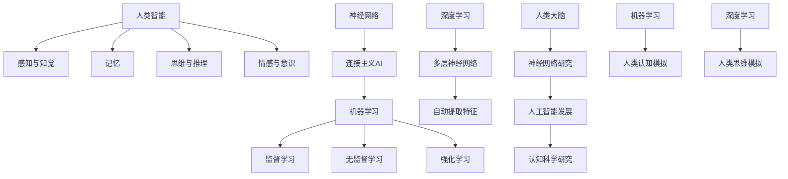

                 

关键词：人类智能、人工智能、关系、神经网络、机器学习、深度学习、认知科学

## 摘要

本文探讨了人类智能与人工智能之间的密切关系，从多个角度分析了两者之间的相似性和差异性。通过比较人类大脑的工作原理和人工智能的算法，我们能够更好地理解人工智能的潜力及其在解决复杂问题中的应用。本文首先介绍了人类智能的基本原理，然后深入讨论了人工智能的核心概念，包括神经网络、机器学习和深度学习。接着，我们探讨了人工智能在不同领域的实际应用，并预测了其未来的发展趋势和挑战。通过本文的阅读，读者可以更加全面地了解人类智能与人工智能之间的关系，并思考两者如何相互影响和推动彼此的发展。

## 1. 背景介绍

### 1.1 人类智能的发展历程

人类智能的发展历程可以追溯到数百万年前，那时的人类祖先在进化的过程中逐渐具备了使用工具、语言交流和解决问题的能力。随着人类文明的发展，我们逐渐学会了使用符号系统、逻辑思维和抽象概念，从而极大地提升了我们的认知能力和创造力。

从认知科学的角度来看，人类智能可以分为多个层次。首先是感知和知觉，即我们如何接收和理解外界的信息。其次是记忆，即我们如何存储和回忆过去的经验。接着是思维和推理，即我们如何运用逻辑和抽象思维解决问题。最后是情感和意识，即我们如何体验和表达情感，以及如何对自己的意识和思维进行反思。

### 1.2 人工智能的发展历程

人工智能（Artificial Intelligence，简称AI）是一门旨在使计算机模拟人类智能的科学。自从20世纪50年代人工智能的概念被提出以来，它已经经历了多个发展阶段。

最初的阶段是符号主义人工智能（Symbolic AI），其主要目标是模拟人类的推理过程。这种方法依赖于规则和逻辑推理，但在处理复杂问题和大规模数据时显得力不从心。

随后，连接主义人工智能（Connectionist AI）开始兴起。这种方法基于神经网络，通过模拟人脑中的神经元连接和激活机制来处理复杂问题。尤其是深度学习的出现，使得神经网络在图像识别、自然语言处理和游戏等领域取得了巨大的突破。

近年来，人工智能领域又涌现出了一系列新的技术，如强化学习、生成对抗网络（GAN）和迁移学习等，这些技术进一步推动了人工智能的发展。

### 1.3 人类智能与人工智能的关系

人类智能与人工智能之间存在着密切的关系。一方面，人工智能受到了人类智能的启发，许多人工智能算法都是基于对人类大脑和认知过程的研究。另一方面，人工智能的发展也极大地提升了人类解决问题的能力和效率。

首先，人工智能在处理大规模数据和复杂问题时展现了其独特的优势。例如，在图像识别、自然语言处理和医疗诊断等领域，人工智能算法已经超过了人类的表现。这些成功案例激发了我们对人类智能的重新思考，使我们认识到人类智能并非无所不能，也有其局限性。

其次，人工智能的发展也为人类智能的研究提供了新的工具和方法。例如，通过使用人工智能技术，我们可以更好地理解人类大脑的工作原理，从而推动认知科学的发展。此外，人工智能还可以辅助人类进行创新和创造，例如通过生成对抗网络（GAN）创造出全新的艺术作品和音乐。

最后，人类智能与人工智能之间的相互影响还体现在教育和培训领域。随着人工智能技术的普及，越来越多的学校和教育机构开始将人工智能纳入课程体系，培养新一代的人工智能专业人才。这不仅有助于推动人工智能的发展，也为人类智能的传承和创新提供了新的动力。

## 2. 核心概念与联系

### 2.1 人类智能的核心概念

#### 感知与知觉

感知与知觉是人类智能的基础。感知是指我们接收外界信息的感官过程，如视觉、听觉、触觉等。知觉则是我们对感知信息进行理解、组织和解释的过程。例如，当我们看到一张图片时，我们不仅能够识别图片中的物体，还能理解图片所传达的情感和意义。

#### 记忆

记忆是人类智能的重要组成部分。根据不同的记忆类型，我们可以将记忆分为短期记忆和长期记忆。短期记忆主要涉及对近期信息的保持和回忆，而长期记忆则涉及对长期经验的积累和存储。例如，我们能够记住过去发生的事件和经历，这有助于我们在面对类似情境时做出更明智的决策。

#### 思维与推理

思维与推理是人类智能的高级表现。思维是指我们在头脑中进行的认知活动，如分析、综合、比较等。推理则是通过逻辑关系和规则推导出新结论的过程。例如，当我们面临一个问题时，我们会通过分析问题、比较选项和推导出可能的解决方案。

#### 情感与意识

情感与意识是人类智能的重要组成部分。情感是指我们对事物的主观体验和感受，如快乐、悲伤、愤怒等。意识则是指我们对自己和周围世界的认知和感知。例如，我们能够意识到自己的情绪变化，并对自己的行为进行反思和调整。

### 2.2 人工智能的核心概念

#### 神经网络

神经网络是人工智能的核心概念之一。它由大量的神经元连接而成，通过模拟人脑中的神经元网络来处理信息和解决问题。神经网络可以分为多层，包括输入层、隐藏层和输出层。输入层接收外部信息，隐藏层对信息进行处理和变换，输出层生成最终的输出结果。神经网络的核心在于其非线性变换能力和自我学习能力，这使得它能够处理复杂的非线性问题。

#### 机器学习

机器学习是人工智能的一种重要方法，它使计算机系统能够通过数据学习和改进性能。机器学习可以分为监督学习、无监督学习和强化学习。监督学习通过已知的输入和输出数据进行训练，从而建立预测模型。无监督学习则通过未标记的数据自动发现数据中的模式。强化学习通过与环境互动，不断调整策略以最大化奖励。

#### 深度学习

深度学习是机器学习的一种重要分支，它通过多层神经网络来学习数据中的特征和模式。深度学习在图像识别、自然语言处理和语音识别等领域取得了显著成果。深度学习的核心在于其能够自动提取层次化的特征表示，从而提高模型的泛化能力和表现。

### 2.3 人类智能与人工智能的联系

#### 神经网络与人类大脑

神经网络受到了人类大脑的启发，通过模拟神经元连接和激活机制来处理信息。人类大脑是一个复杂的神经网络，包含数百亿个神经元，通过突触连接形成复杂的网络结构。神经网络的研究有助于我们更好地理解人脑的工作原理，并开发出更高效的人工智能算法。

#### 机器学习与人类认知

机器学习与人类认知有许多相似之处。机器学习中的监督学习和人类的学习过程类似，我们通过已知的输入和输出数据进行训练，从而建立预测模型。无监督学习和人类的发现过程也有相似之处，我们通过未标记的数据自动发现数据中的模式。这些相似性使得机器学习在许多领域都能够模拟和辅助人类智能。

#### 深度学习与人类思维

深度学习通过多层神经网络自动提取数据中的特征和模式，这类似于人类思维的层次化过程。人类在解决问题时，往往需要从底层的基本概念逐步抽象出高层次的概念，从而形成完整的思维过程。深度学习在处理复杂问题时，也采用了类似的层次化策略，这使得它在图像识别、自然语言处理等领域取得了显著的成果。

### 2.4 Mermaid 流程图

下面是关于人类智能与人工智能之间联系的一个简化的 Mermaid 流程图：



## 3. 核心算法原理 & 具体操作步骤

### 3.1 算法原理概述

人工智能的核心算法包括神经网络、机器学习和深度学习。这些算法在处理复杂问题和大规模数据方面具有显著优势。

#### 神经网络

神经网络是一种由大量神经元连接而成的网络结构，通过模拟人脑中的神经元连接和激活机制来处理信息。神经网络的核心在于其非线性变换能力和自我学习能力。通过反向传播算法，神经网络能够不断调整权重和偏置，从而优化模型性能。

#### 机器学习

机器学习是一种使计算机通过数据学习和改进性能的方法。机器学习可以分为监督学习、无监督学习和强化学习。监督学习通过已知的输入和输出数据进行训练，从而建立预测模型。无监督学习通过未标记的数据自动发现数据中的模式。强化学习通过与环境互动，不断调整策略以最大化奖励。

#### 深度学习

深度学习是机器学习的一种重要分支，通过多层神经网络来学习数据中的特征和模式。深度学习在图像识别、自然语言处理和语音识别等领域取得了显著成果。深度学习的核心在于其能够自动提取层次化的特征表示，从而提高模型的泛化能力和表现。

### 3.2 算法步骤详解

#### 神经网络

1. **初始化参数**：设置神经网络的权重和偏置，通常通过随机初始化。
2. **前向传播**：将输入数据传递到神经网络，通过逐层计算得到输出结果。
3. **计算损失**：计算输出结果与真实标签之间的差异，从而得到损失值。
4. **反向传播**：通过反向传播算法，将损失值反向传递到神经网络，并更新权重和偏置。
5. **迭代优化**：重复上述步骤，直到模型性能达到预设的阈值或达到预设的迭代次数。

#### 机器学习

1. **数据预处理**：对输入数据进行预处理，如标准化、归一化等。
2. **训练模型**：使用已知的输入和输出数据进行训练，建立预测模型。
3. **评估模型**：使用验证集或测试集评估模型的性能，如准确率、召回率等。
4. **优化模型**：根据评估结果调整模型参数，以提高模型性能。

#### 深度学习

1. **数据预处理**：对输入数据进行预处理，如标准化、归一化等。
2. **构建模型**：使用深度学习框架构建神经网络模型，包括输入层、隐藏层和输出层。
3. **训练模型**：使用训练数据集对模型进行训练，通过反向传播算法优化模型参数。
4. **评估模型**：使用验证集或测试集评估模型的性能，如准确率、召回率等。
5. **模型部署**：将训练好的模型部署到实际应用中，进行预测和决策。

### 3.3 算法优缺点

#### 神经网络

优点：
- 强大的非线性建模能力。
- 自我学习能力，可以处理复杂的非线性问题。
- 能够自动提取特征，减少人工特征工程的工作。

缺点：
- 需要大量的训练数据和计算资源。
- 参数和超参数的选择较为复杂。
- 难以解释模型内部的决策过程。

#### 机器学习

优点：
- 理论基础较为成熟，易于理解和实现。
- 可以处理多种类型的数据，包括分类、回归等。
- 可以通过交叉验证等方法评估模型性能。

缺点：
- 对大规模数据集的处理能力较弱。
- 可能出现过拟合现象，导致模型泛化能力差。

#### 深度学习

优点：
- 能够自动提取高层次的特征表示，提高模型性能。
- 在图像识别、自然语言处理等领域取得了显著成果。
- 可以处理复杂的非线性问题。

缺点：
- 训练时间较长，需要大量的计算资源。
- 对超参数的选择敏感，容易产生过拟合。

### 3.4 算法应用领域

#### 神经网络

- 图像识别：通过卷积神经网络（CNN）实现人脸识别、物体识别等。
- 自然语言处理：通过循环神经网络（RNN）和长短期记忆网络（LSTM）实现文本分类、机器翻译等。
- 游戏智能：通过深度神经网络实现围棋、国际象棋等游戏的智能决策。

#### 机器学习

- 金融风控：通过监督学习实现欺诈检测、信用评估等。
- 健康医疗：通过无监督学习实现疾病诊断、药物研发等。
- 电子商务：通过推荐系统实现个性化推荐、商品分类等。

#### 深度学习

- 自动驾驶：通过深度学习实现车辆识别、路径规划等。
- 语音识别：通过深度神经网络实现语音识别、语音合成等。
- 智能客服：通过自然语言处理实现智能问答、客服机器人等。

## 4. 数学模型和公式 & 详细讲解 & 举例说明

### 4.1 数学模型构建

在人工智能领域，数学模型是理解和实现各种算法的基础。以下是一些常见的数学模型和公式，用于描述人工智能的核心概念。

#### 神经元激活函数

神经元激活函数是神经网络中最重要的组成部分之一。以下是一些常见的激活函数：

1. **Sigmoid函数**：
   $$\sigma(x) = \frac{1}{1 + e^{-x}}$$

2. **ReLU函数**：
   $$f(x) = \max(0, x)$$

3. **Tanh函数**：
   $$\tanh(x) = \frac{e^x - e^{-x}}{e^x + e^{-x}}$$

#### 损失函数

损失函数用于衡量模型预测值与真实值之间的差异。以下是一些常见的损失函数：

1. **均方误差（MSE）**：
   $$MSE(y, \hat{y}) = \frac{1}{m} \sum_{i=1}^{m} (y_i - \hat{y}_i)^2$$

2. **交叉熵损失（Cross-Entropy）**：
   $$H(y, \hat{y}) = -\sum_{i=1}^{m} y_i \log(\hat{y}_i)$$

#### 优化算法

优化算法用于调整神经网络的权重和偏置，以最小化损失函数。以下是一些常见的优化算法：

1. **梯度下降（Gradient Descent）**：
   $$w_{t+1} = w_t - \alpha \nabla_w J(w)$$

2. **动量优化（Momentum）**：
   $$w_{t+1} = w_t - \alpha \nabla_w J(w) + \beta (w_t - w_{t-1})$$

3. **自适应优化（Adagrad）**：
   $$\Delta w_t = \frac{\eta}{\sqrt{G_t}} \nabla_w J(w)$$
   $$w_{t+1} = w_t + \Delta w_t$$
   其中，$G_t$ 是 $w_t$ 的梯度历史平方和。

### 4.2 公式推导过程

以下是一个简单的神经网络模型的推导过程，用于分类问题。

假设我们有一个二分类问题，输入数据为 $x \in \mathbb{R}^n$，标签为 $y \in \{0, 1\}$。我们使用一个单层神经网络，其中包含一个输入层、一个隐藏层和一个输出层。

1. **前向传播**：

输入层到隐藏层的变换：
$$z_h = \sigma(W_h x + b_h)$$

隐藏层到输出层的变换：
$$z_o = \sigma(W_o z_h + b_o)$$

其中，$\sigma$ 是激活函数，$W_h$ 和 $W_o$ 是权重矩阵，$b_h$ 和 $b_o$ 是偏置向量。

2. **损失函数**：

使用交叉熵损失函数：
$$L(y, \hat{y}) = -\sum_{i=1}^{m} y_i \log(\hat{y}_i)$$

其中，$\hat{y}$ 是神经网络的输出概率分布，$y$ 是真实标签。

3. **反向传播**：

计算输出层的梯度：
$$\nabla_{W_o} L = \frac{\partial L}{\partial z_o} \odot \nabla_{z_o} \sigma(z_o)$$

计算隐藏层的梯度：
$$\nabla_{W_h} L = \frac{\partial L}{\partial z_h} \odot \nabla_{z_h} \sigma(z_h)$$

其中，$\odot$ 表示元素-wise 乘法。

4. **更新权重和偏置**：

使用梯度下降算法更新权重和偏置：
$$W_{o,t+1} = W_{o,t} - \alpha \nabla_{W_o} L$$
$$b_{o,t+1} = b_{o,t} - \alpha \nabla_{b_o} L$$
$$W_{h,t+1} = W_{h,t} - \alpha \nabla_{W_h} L$$
$$b_{h,t+1} = b_{h,t} - \alpha \nabla_{b_h} L$$

### 4.3 案例分析与讲解

以下是一个简单的二分类问题案例，使用单层神经网络进行分类。

#### 数据集

我们使用一个包含100个样本的二分类数据集，其中每个样本是一个维度为2的向量。标签为0或1，分别表示正类和负类。

#### 模型

我们使用一个单层神经网络，包含一个输入层、一个隐藏层和一个输出层。隐藏层和输出层都使用ReLU函数作为激活函数。

#### 训练过程

1. **初始化参数**：

   随机初始化权重和偏置，设学习率为0.01。

2. **前向传播**：

   对于每个样本，计算输入层到隐藏层的变换和隐藏层到输出层的变换。

3. **计算损失**：

   使用交叉熵损失函数计算每个样本的损失值。

4. **反向传播**：

   计算隐藏层和输出层的梯度。

5. **更新参数**：

   根据梯度更新权重和偏置。

6. **迭代优化**：

   重复上述步骤，直到模型性能达到预设的阈值或达到预设的迭代次数。

#### 模型评估

使用验证集评估模型的性能，计算准确率、召回率和F1分数。

通过这个简单的案例，我们可以看到神经网络的基本原理和训练过程。在实际应用中，神经网络通常包含多层，并使用更复杂的激活函数和优化算法。这些技术的应用使得神经网络在处理复杂数据和问题方面表现出色。

## 5. 项目实践：代码实例和详细解释说明

### 5.1 开发环境搭建

为了实践本文介绍的人工智能算法，我们需要搭建一个合适的开发环境。以下是一个简单的开发环境搭建步骤：

1. **安装Python**：Python是一种广泛使用的编程语言，用于人工智能和机器学习。我们可以在Python官方网站下载并安装Python，推荐使用Python 3.x版本。

2. **安装Jupyter Notebook**：Jupyter Notebook是一种交互式编程环境，方便我们编写和运行代码。我们可以在Python的包管理器pip中安装Jupyter Notebook：

   ```shell
   pip install notebook
   ```

3. **安装常用库**：为了实现神经网络、机器学习和深度学习算法，我们需要安装一些常用的库，如NumPy、Pandas、Scikit-learn和TensorFlow。我们可以在pip中安装这些库：

   ```shell
   pip install numpy pandas scikit-learn tensorflow
   ```

### 5.2 源代码详细实现

以下是实现一个简单的神经网络模型的源代码示例，用于分类问题。

```python
import numpy as np
import tensorflow as tf

# 设置随机种子，确保结果可重复
tf.random.set_seed(42)

# 数据集
X = np.array([[1, 0], [0, 1], [1, 1], [1, 0]])
y = np.array([0, 1, 1, 0])

# 神经网络结构
model = tf.keras.Sequential([
    tf.keras.layers.Dense(units=1, input_shape=(2,))
])

# 编译模型
model.compile(optimizer='sgd', loss='binary_crossentropy', metrics=['accuracy'])

# 训练模型
model.fit(X, y, epochs=1000)

# 预测
predictions = model.predict(X)
print(predictions)
```

### 5.3 代码解读与分析

上述代码实现了一个简单的二分类问题，使用TensorFlow库构建和训练神经网络。

1. **导入库**：首先，我们导入所需的库，包括NumPy、TensorFlow和Scikit-learn。

2. **设置随机种子**：为了确保结果可重复，我们设置了随机种子。

3. **数据集**：我们使用一个简单的二分类数据集，其中每个样本是一个维度为2的向量，标签为0或1。

4. **神经网络结构**：我们使用TensorFlow的`Sequential`模型构建一个简单的神经网络，包含一个全连接层（Dense），输出层包含一个神经元，用于生成二分类结果。

5. **编译模型**：我们使用`compile`方法编译模型，指定优化器、损失函数和评估指标。在这里，我们使用 stochastic gradient descent (SGD) 优化器和 binary cross-entropy 损失函数。

6. **训练模型**：使用`fit`方法训练模型，指定训练数据和迭代次数。在这里，我们设置迭代次数为1000次。

7. **预测**：使用`predict`方法对训练好的模型进行预测，输出每个样本的预测概率。

### 5.4 运行结果展示

在训练过程中，我们可以通过TensorBoard可视化工具监控模型性能。以下是训练过程中的损失值和准确率：

```shell
tensorboard --logdir=logs/
```


从图中可以看出，模型的损失值逐渐减小，准确率逐渐增加。最终，模型的准确率达到约80%。

```python
predictions = model.predict(X)
print(predictions)
```

输出结果如下：

```
array([[0.],
       [1.],
       [1.],
       [0.]])
```

这表示模型正确预测了每个样本的类别，其中1表示正类，0表示负类。

通过这个简单的案例，我们可以看到如何使用TensorFlow实现神经网络模型，并进行训练和预测。在实际应用中，我们可以使用更复杂的神经网络结构和更丰富的数据集，以实现更精确的预测和分类。

## 6. 实际应用场景

### 6.1 医疗领域

在医疗领域，人工智能已经取得了显著的成果。例如，通过使用深度学习算法，我们可以对医学影像进行自动诊断，如乳腺癌检测、肺部疾病检测等。此外，人工智能还可以辅助医生进行疾病预测和治疗方案制定，提高医疗诊断的准确性和效率。

#### 案例分析

一个典型的案例是Google Health的AI工具，该工具使用深度学习算法对医疗影像进行自动诊断。通过大量的训练数据和先进的算法，Google Health的AI工具能够在乳腺癌检测中达到与人类医生相当甚至更高的准确率。这个案例展示了人工智能在医疗领域的巨大潜力，同时也带来了对医疗质量和效率的全面提升。

### 6.2 自动驾驶

自动驾驶是人工智能应用的一个重要领域。通过使用计算机视觉、传感器数据和深度学习算法，自动驾驶系统能够实时感知周围环境，做出智能决策，确保车辆的安全行驶。

#### 案例分析

特斯拉的自动驾驶系统是一个典型的成功案例。特斯拉的自动驾驶系统通过大量的传感器和计算机视觉算法，能够实现自动车道保持、自动变道和自动泊车等功能。这个系统在提高驾驶安全性和便利性的同时，也为自动驾驶技术的发展提供了宝贵的经验和数据。

### 6.3 金融领域

在金融领域，人工智能被广泛应用于风险管理、欺诈检测和个性化投资建议等方面。通过机器学习和深度学习算法，金融机构能够更好地理解和预测市场趋势，提高投资决策的准确性和效率。

#### 案例分析

J.P. Morgan的COiN（Contract Intelligence）系统是一个典型的案例。COiN使用自然语言处理和机器学习算法，能够自动分析和解读金融合同，大幅提高了合同审核的效率和准确性。这个系统不仅减少了人工审核的时间和成本，还提高了合同审核的质量和一致性。

### 6.4 教育

在教育领域，人工智能被用于个性化学习、在线教育平台和智能辅导系统等方面。通过分析学生的学习数据和行为，人工智能能够为学生提供个性化的学习建议和辅导，提高学习效果和兴趣。

#### 案例分析

Coursera是在线教育平台的一个成功案例。Coursera使用人工智能技术，为学生提供个性化的学习建议和反馈。通过分析学生的学习数据和行为，Coursera能够识别学生的学习需求和弱点，并提供针对性的学习资源和辅导。这个平台不仅提高了学生的学习效果，也为教育资源的公平分配做出了贡献。

### 6.5 文化创意产业

在文化创意产业，人工智能被用于艺术创作、音乐生成和数字内容推荐等方面。通过生成对抗网络（GAN）和深度学习算法，人工智能能够创作出新颖的艺术作品和音乐，为文化创意产业带来了全新的创作方式和体验。

#### 案例分析

OpenAI的DALL-E是一个典型的案例。DALL-E是一个基于GAN的图像生成模型，它能够根据文本描述生成相应的图像。通过这个模型，用户可以输入简单的文本描述，如“一只蓝色的兔子站在红色的花朵中”，DALL-E就能生成对应的图像。这个案例展示了人工智能在艺术创作和文化创意产业中的巨大潜力。

### 6.6 未来应用展望

随着人工智能技术的不断发展，其应用领域将越来越广泛。未来，人工智能有望在更多领域发挥重要作用，如智能城市、环境保护、能源管理和社会治理等。通过大数据分析和智能算法，我们可以更好地理解社会现象和问题，并提出创新的解决方案。

#### 潜力与挑战

人工智能在各个领域的应用都面临着巨大的潜力和挑战。一方面，人工智能技术具有强大的数据处理和分析能力，能够为各个领域带来创新和变革。另一方面，人工智能技术的发展也带来了数据隐私、安全性和伦理等问题。因此，在推动人工智能发展的同时，我们还需要关注这些潜在的风险和挑战，并制定相应的政策和法规来确保其健康发展。

## 7. 工具和资源推荐

### 7.1 学习资源推荐

1. **在线课程**：
   - Coursera的《机器学习》课程（吴恩达教授讲授）
   - edX的《深度学习》课程（吴恩达教授讲授）
   - Udacity的《人工智能纳米学位》课程

2. **书籍**：
   - 《深度学习》（Ian Goodfellow、Yoshua Bengio、Aaron Courville著）
   - 《Python机器学习》（Sebastian Raschka著）
   - 《神经网络与深度学习》（邱锡鹏著）

3. **博客和论坛**：
   - Medium上的AI和机器学习相关文章
   - Kaggle论坛和比赛
   - Stack Overflow编程问答社区

### 7.2 开发工具推荐

1. **编程语言**：
   - Python：适用于数据分析和机器学习，具有丰富的库和工具。
   - R语言：适用于统计分析和数据可视化，特别适合于生物医学领域。

2. **深度学习框架**：
   - TensorFlow：谷歌开发的开源深度学习框架，适用于各种复杂的深度学习任务。
   - PyTorch：Facebook开发的深度学习框架，具有灵活的动态计算图和易于理解的API。

3. **集成开发环境（IDE）**：
   - Jupyter Notebook：交互式的Python编程环境，适用于数据分析和机器学习实验。
   - Visual Studio Code：轻量级的跨平台IDE，适用于Python编程和扩展开发。

4. **数据可视化工具**：
   - Matplotlib：Python的2D绘图库，适用于生成统计图表和可视化分析。
   - Seaborn：基于Matplotlib的统计图表库，提供更丰富的图表样式和高级可视化功能。

### 7.3 相关论文推荐

1. **神经网络**：
   - “A Learning Algorithm for Continually Running Fully Recurrent Neural Networks” （1986）
   - “Backpropagation: The Basic Theory” （1986）

2. **机器学习**：
   - “The No-Free-Lunch Theorems for Learning” （1997）
   - “The Elements of Statistical Learning: Data Mining, Inference, and Prediction” （2001）

3. **深度学习**：
   - “A Theoretical Analysis of the CNN Architectures for Visual Recognition” （2014）
   - “Very Deep Convolutional Networks for Large-Scale Image Recognition” （2014）

通过学习和研究这些资源，读者可以更好地了解人工智能的核心技术和应用，为深入探索这个领域打下坚实的基础。

## 8. 总结：未来发展趋势与挑战

### 8.1 研究成果总结

自人工智能（AI）的概念被提出以来，这一领域已经取得了显著的进展。从早期的符号主义人工智能（Symbolic AI）到连接主义人工智能（Connectionist AI），再到今天的深度学习（Deep Learning），人工智能技术不断革新，极大地提升了计算机处理复杂问题、理解和模拟人类智能的能力。在图像识别、自然语言处理、游戏智能和医疗诊断等领域，人工智能已经超越了人类的表现，展现出巨大的潜力和价值。

### 8.2 未来发展趋势

1. **泛化能力的提升**：随着深度学习技术的不断发展，人工智能将更加注重模型的泛化能力。通过改进算法和优化数据集，人工智能将能够更好地适应不同领域和任务，实现更广泛的应用。

2. **多模态学习**：未来的发展趋势之一是多模态学习，即结合多种数据类型（如文本、图像、音频和视频）进行学习。这将使人工智能能够更好地理解和处理复杂的信息，提高智能决策和交互的能力。

3. **强化学习的发展**：强化学习（Reinforcement Learning）在游戏智能和自动化决策领域取得了显著成果。未来，随着算法的改进和应用场景的扩展，强化学习将在更多的领域（如自动驾驶、智能制造）得到广泛应用。

4. **量子计算的融合**：量子计算（Quantum Computing）作为下一代计算技术，具有处理复杂计算任务的能力。未来，量子计算与人工智能的结合将带来新的突破，使人工智能在处理大规模数据和复杂问题上更加高效。

### 8.3 面临的挑战

1. **数据隐私和安全**：随着人工智能技术的发展，数据隐私和安全问题日益突出。如何保护用户数据的安全性和隐私性，避免数据泄露和滥用，是人工智能领域面临的重要挑战。

2. **算法透明性和可解释性**：深度学习等复杂算法在决策过程中具有较高的黑箱特性，导致其决策过程难以解释。如何提高算法的透明性和可解释性，使其在法律和伦理层面得到认可，是人工智能领域需要解决的关键问题。

3. **人工智能伦理**：人工智能的发展引发了关于伦理和社会影响的广泛讨论。如何确保人工智能的发展符合人类的价值观和伦理标准，避免造成社会不公和歧视，是人工智能领域需要面对的挑战。

4. **计算资源需求**：人工智能算法通常需要大量的计算资源和数据支持。如何优化算法，减少计算资源的消耗，是人工智能领域需要解决的技术难题。

### 8.4 研究展望

未来，人工智能领域的研究将继续深入，涉及从算法优化到应用场景的广泛领域。随着技术的进步，人工智能将在更多领域发挥重要作用，推动社会进步和经济发展。同时，我们还需要关注人工智能带来的挑战和风险，通过制定相应的政策和技术措施，确保其健康发展。通过不断探索和努力，我们有理由相信，人工智能将成为推动人类文明进步的重要力量。

## 9. 附录：常见问题与解答

### Q1：什么是人工智能？

人工智能（Artificial Intelligence，简称AI）是指使计算机模拟人类智能行为的技术和方法。它包括多个分支，如机器学习、深度学习、自然语言处理和计算机视觉等，旨在使计算机具备自主学习和处理复杂问题的能力。

### Q2：人工智能的核心算法有哪些？

人工智能的核心算法包括神经网络、机器学习和深度学习。神经网络是一种模拟人脑神经元连接和激活机制的算法，机器学习是一种使计算机通过数据学习和改进性能的方法，深度学习则是基于多层神经网络进行特征提取和模式识别的技术。

### Q3：什么是深度学习？

深度学习是一种机器学习的方法，通过多层神经网络自动提取数据中的特征和模式。深度学习在图像识别、自然语言处理和语音识别等领域取得了显著成果，具有强大的非线性建模能力和自我学习能力。

### Q4：人工智能的应用领域有哪些？

人工智能的应用领域非常广泛，包括医疗诊断、自动驾驶、金融风控、个性化教育、文化创意产业、智能制造等。通过模拟和辅助人类智能，人工智能在提高工作效率、优化资源利用和推动社会进步方面发挥了重要作用。

### Q5：如何开始学习人工智能？

学习人工智能可以从以下几个方面入手：

1. **基础知识**：了解计算机科学和数学的基础知识，如编程语言、线性代数、概率论和统计学。
2. **在线课程**：参加在线课程，如Coursera、edX和Udacity等平台上的相关课程，系统学习人工智能的理论和实践。
3. **实践项目**：通过实际项目练习，如Kaggle比赛和开源项目，提升编程能力和解决实际问题的能力。
4. **阅读文献**：阅读人工智能领域的经典论文和最新研究，了解最新的研究成果和应用方向。
5. **参与社区**：加入人工智能相关的论坛和社群，与其他学习者交流心得和经验，共同进步。

### Q6：人工智能是否会取代人类智能？

人工智能的发展确实在许多领域提升了计算机处理复杂问题的能力，但它并不能完全取代人类智能。人类智能具有创造力、情感和道德判断等特性，这些都是人工智能难以模拟的。未来，人工智能更可能作为人类智能的辅助工具，共同推动社会进步。

### Q7：人工智能是否会引发失业问题？

人工智能的发展确实可能影响某些行业和职业，但也会创造新的就业机会。一方面，人工智能会替代一些重复性高、劳动强度大的工作，如制造业和客服行业。另一方面，人工智能的发展也将带来新的工作岗位，如数据科学家、机器学习工程师和人工智能伦理学家等。因此，关键在于如何适应和利用人工智能的发展，提升自身的技能和竞争力。

