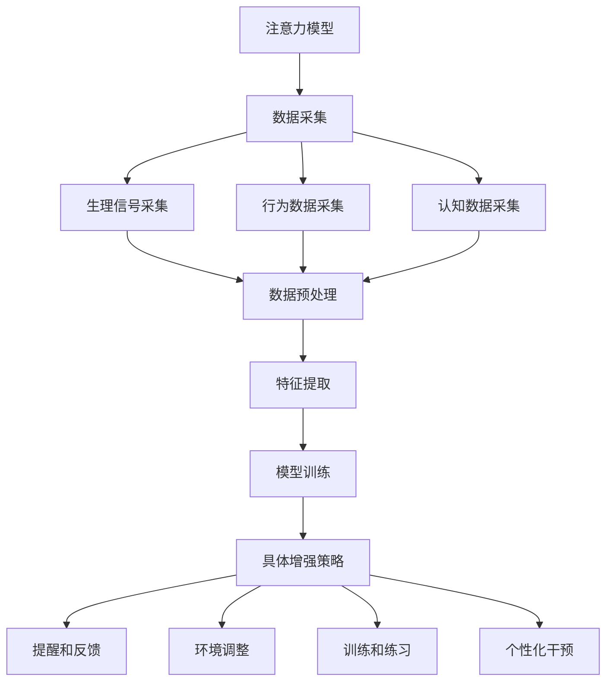

                 

### 背景介绍

在当今快速发展的信息化社会中，教育领域正面临着前所未有的变革。随着互联网、人工智能、大数据等新技术的不断涌现，教育的形式和内容也在发生深刻的变化。然而，与此同时，我们也发现，在这样一个充满诱惑和分心的环境中，人类的注意力问题日益突出。

注意力是指人类在进行感知、认知和决策等心理活动中，对外界信息的聚焦和筛选能力。它不仅是人类学习、工作和生活的重要心理资源，也是决定个体适应性和竞争力的关键因素。然而，在现代社会中，人们常常被手机、社交媒体、网络视频等数字娱乐形式所吸引，导致注意力分散，无法长时间专注于某一任务。

教育领域尤其需要关注这一问题。学生在课堂上分心，教师难以维持学生的注意力，这不仅影响了教学效果，也制约了学生的学业成就。为了应对这一挑战，近年来，研究者们开始探索如何通过技术手段提升人类的注意力。其中，人工智能（AI）和可穿戴设备成为了重要的研究方向。

本文旨在探讨人类注意力增强的原理、技术和应用，特别是在教育领域中的未来方向。我们将首先介绍注意力增强的核心概念和理论基础，然后分析当前最先进的注意力增强技术，最后预测这些技术在教育中的应用前景。

### 文章关键词

- 人类注意力
- 专注力提升
- 教育技术
- 人工智能
- 可穿戴设备
- 注意力增强算法

### 摘要

本文通过深入分析人类注意力增强的理论基础和最新技术进展，探讨了在教育领域提升学生专注力和注意力的可能性。文章首先介绍了注意力增强的核心概念，包括注意力的定义、重要性及其在学习和工作中的影响。接着，文章讨论了当前最先进的注意力增强技术，包括人工智能算法和可穿戴设备的运用。随后，文章通过实际案例和数学模型，展示了这些技术在教育中的应用效果。最后，文章提出了未来教育中注意力增强技术的应用方向和潜在挑战，为教育工作者和研究者提供了有价值的参考。

## 1. 背景介绍

注意力是人类心理活动中至关重要的一部分。它决定了我们在处理信息时的聚焦和筛选能力，是信息加工过程的先决条件。在过去的几十年里，心理学、认知科学和教育学等领域都对注意力进行了广泛的研究。研究表明，注意力不仅影响个体的学习效果，还与工作效率、社会交往和心理健康密切相关。

在教育领域，学生的注意力直接关系到他们的学习成效。然而，现代社会的种种诱惑使得学生的注意力分散现象日益严重。课堂上的手机、社交媒体和周围环境的干扰，使得学生很难长时间保持对学习内容的专注。这种情况不仅影响了学生的学习效果，也增加了教师维持课堂纪律的难度。

传统的教育方法主要依赖于教师的教学技巧和课堂管理，但效果往往有限。为了更有效地提升学生的注意力，教育工作者和研究者开始将目光投向新兴技术，特别是人工智能（AI）和可穿戴设备。这些技术为个性化教学和注意力监测提供了新的可能性。

### 注意力的定义与重要性

注意力是指人类在特定时间范围内集中精力处理特定信息的能力。心理学上将注意力分为几种不同的类型，包括选择性注意力、持续性注意力、分配注意力和执行注意力。每种类型的注意力都有其特定的功能和应用场景。

选择性注意力是指从众多信息源中选择重要信息进行处理的注意力形式。例如，学生在课堂上需要从教师的讲解、同学的反应和周围的干扰中筛选出关键信息。持续性注意力则是指维持对某一任务的持续关注，不受外界干扰的能力。这种注意力对于完成长时间的学习任务尤为重要。分配注意力是指同时处理多个任务的能力，例如学生在学习时同时听音乐或进行其他辅助活动。执行注意力则是指根据任务要求调节注意力资源的动态调整能力，例如在考试时集中精力解答问题。

在学习和工作中，注意力扮演着至关重要的角色。研究表明，注意力不足会导致学习效率低下、错误率增加和工作效率降低。例如，学生在课堂上的注意力分散会导致他们无法充分理解教师的讲解内容，从而影响学习效果。同样，在工作环境中，注意力分散会导致操作失误、工作效率降低和安全事故增加。

此外，注意力也影响着个体在社交和心理健康方面的表现。注意力分散会降低人际交往的质量，影响沟通效果。同时，长期注意力分散还可能导致焦虑和压力，影响心理健康。

总之，注意力不仅是人类学习和工作的重要资源，也是决定个体适应性和竞争力的重要因素。在现代社会中，提升注意力水平已经成为教育领域和整个社会关注的焦点。

### 现代社会的注意力分散现象

现代社会中，注意力分散现象愈发严重，这不仅源于信息的爆炸式增长，也受到各种数字化娱乐形式的诱惑。首先，互联网的普及使得人们能够接触到海量的信息，这些信息以各种形式不断涌现，极大地挑战了人们的注意力管理能力。网络视频、社交媒体、即时通讯工具等数字娱乐形式，使得人们容易陷入多任务处理的状态，导致注意力无法长时间集中。

心理学研究表明，多任务处理虽然能够提高工作效率，但也会降低任务完成的质量和准确性。这是因为大脑在处理多个任务时，需要不断地切换注意力焦点，而每次切换都会消耗一定的认知资源。长期处于这种状态，不仅会导致注意力疲劳，还会影响大脑的长期记忆功能。

此外，手机的普及也对人们的注意力产生了深远的影响。手机不仅是人们获取信息的重要工具，也成为分散注意力的主要来源。许多人在上课、开会或与他人交流时，常常会不自觉地查看手机，这使得他们在这些关键时刻的注意力被严重分散。这种现象不仅影响了个人，也对整个社会产生了负面影响。

在学校环境中，学生的注意力分散现象尤为突出。课堂上的手机、网络视频、社交媒体等诱惑，使得学生很难长时间专注于教师的讲解和课堂活动。一些研究表明，学生在课堂上使用手机的时间与他们的学习效果呈显著负相关。这不仅影响了学生的学习成绩，还可能导致他们错过重要的学习机会。

教师也面临着类似的挑战。在传统课堂上，教师需要通过言语、肢体语言等多种方式来吸引学生的注意力。然而，在信息化的环境中，教师面临的信息干扰和竞争也日益增加，这使得他们难以维持学生的注意力。一些研究表明，教师的讲解时间、课堂互动频率和学生的课堂参与度等指标，都与学生的注意力管理能力密切相关。

总之，现代社会中注意力分散的现象严重影响了个人和社会的方方面面。教育领域需要重视这一问题，通过技术手段和教学方法创新，帮助个体提升注意力管理能力，从而提高学习效果和工作效率。

### 人工智能与注意力增强

随着人工智能（AI）技术的不断发展，研究者们开始探索如何利用这一技术来增强人类的注意力。AI在注意力增强中的应用主要涉及算法开发、数据分析、智能监控等方面。通过分析大量的数据，AI系统可以识别出个体在注意力管理中的问题，并提供针对性的解决方案。

首先，AI算法可以通过模式识别和分析个体行为数据，来预测和监控注意力的变化。例如，通过分析学生的面部表情、眼动轨迹和生理信号，AI系统可以实时监测学生的注意力状态。这种实时监测能力有助于教师及时了解学生的注意力分布情况，从而采取有效的干预措施。

其次，AI算法还可以根据学生的学习习惯和注意力变化，提供个性化的学习建议。例如，AI系统可以识别出学生在特定学习内容上的注意力弱点，并推荐相应的练习和辅助工具，帮助学生更好地集中注意力。这种个性化服务不仅能够提高学习效率，还能增强学生的自主学习能力。

此外，AI技术还可以用于开发智能环境，以创造有助于注意力集中的学习氛围。例如，通过智能家居系统，AI可以自动调节教室的光线、音乐和温度等环境因素，以适应学生的注意力需求。这种智能环境不仅能够减少外部干扰，还能提高学生的学习兴趣和专注度。

总之，人工智能在注意力增强中的应用具有巨大的潜力。通过算法分析、数据监控和智能环境建设，AI可以为教育工作者和学生提供有效的注意力管理工具，从而提升学习效果和工作效率。

### 可穿戴设备与注意力增强

可穿戴设备作为近年来迅速发展的一项技术，为注意力增强提供了新的可能。这些设备通过集成传感器和智能算法，能够实时监测和评估用户的注意力水平。以下是一些主要的可穿戴设备类型及其工作原理：

1. **智能手环**：智能手环是最常见的可穿戴设备之一，通常配备有加速度计、心率传感器和陀螺仪等。这些传感器可以监测用户的活动和生理状态，从而推断出注意力的变化。例如，通过分析手腕的运动和心率，智能手环可以判断用户是否在分心或者疲劳。

2. **智能眼镜**：智能眼镜通过内置摄像头和传感器，可以实时捕捉用户的视觉和听觉信息。通过分析这些信息，智能眼镜可以监测用户的视觉注意力，例如判断用户是否在注视屏幕或周围的物体。此外，一些智能眼镜还配备了眼动追踪技术，可以更精确地了解用户的注意力分布。

3. **智能头戴设备**：智能头戴设备如虚拟现实（VR）头盔和智能耳塞等，通过监测用户的头部运动和听力状态，来评估其注意力水平。这些设备通常配备有高精度的传感器和算法，能够在复杂的环境中准确捕捉用户的注意力变化。

这些可穿戴设备通过收集和分析大量数据，可以提供实时的注意力反馈。例如，智能手环可以在用户注意力分散时发出提醒，智能眼镜可以在用户视线偏离任务时提供视觉提示，智能耳塞则可以通过播放音频提醒用户保持专注。这些实时反馈机制有助于用户及时发现并纠正注意力问题，从而提高学习和工作效率。

此外，可穿戴设备还可以结合AI算法，提供更为个性化的注意力管理方案。例如，通过长期数据分析，设备可以识别用户的注意力模式，并根据这些模式提供个性化的训练计划和建议。这种个性化的干预措施不仅能够提高用户的注意力水平，还能促进其自主学习能力的提升。

总之，可穿戴设备在注意力增强中的应用，通过实时监测和个性化反馈，为用户提供了一种新的注意力管理工具。随着技术的不断进步，可穿戴设备有望在教育、工作和日常生活中发挥更大的作用。

### 注意力增强技术的核心概念与原理

注意力增强技术的核心在于如何有效地监测、评估和提升用户的注意力水平。这一过程涉及多个关键概念和原理，包括注意力模型、数据采集与分析方法、以及具体的增强策略。下面我们将详细探讨这些核心概念和原理。

#### 注意力模型

注意力模型是注意力增强技术的基础，它描述了注意力如何在不同条件下变化。心理学研究表明，注意力可以分为几个层次，包括感知注意力、行为注意力和认知注意力。感知注意力是指接收和处理外界信息的初步阶段，例如眼动和听觉反应。行为注意力是指对外界刺激进行响应的能力，例如完成任务或进行决策。认知注意力则涉及更高层次的认知功能，如记忆、推理和问题解决。

常见的注意力模型包括选择模型、瓶颈模型和分配模型。选择模型认为，注意力就像一个选择器，从多个竞争的任务中选择一个进行加工。瓶颈模型则认为，注意力资源是有限的，任何任务都必须通过这个瓶颈，因此资源分配是关键。分配模型则假设，注意力资源是动态分配的，根据任务的要求和外部环境进行实时调整。

#### 数据采集与分析方法

注意力增强技术依赖于大量数据的采集和分析。数据采集方法包括生理信号采集、行为数据采集和认知数据采集。生理信号采集主要包括心率、皮肤电导、眼动追踪和脑电图等，这些信号可以反映用户的生理状态和注意力水平。行为数据采集则包括用户在任务中的表现、移动轨迹和互动行为等。认知数据采集则通过心理测试、问卷调查和认知任务等方法，获取用户的注意力特征和认知能力。

数据分析方法是注意力增强技术的关键，包括数据预处理、特征提取和模型训练。数据预处理步骤包括数据清洗、归一化和去噪等，以确保数据质量。特征提取步骤则从原始数据中提取与注意力相关的特征，如心率变异性、眼动轨迹和认知任务的完成情况。模型训练则使用机器学习和深度学习算法，通过大量数据训练，建立能够预测和提升注意力的模型。

#### 具体增强策略

注意力增强策略是指通过技术手段提升用户的注意力水平。常见的增强策略包括：

1. **提醒和反馈**：通过实时提醒和反馈，帮助用户及时发现注意力分散的情况，并采取相应措施。例如，智能手环在用户注意力分散时发出振动提醒，智能眼镜在用户视线偏离任务时提供视觉提示。

2. **环境调整**：通过自动调整环境因素，如光线、声音和温度，来创造有助于注意力集中的环境。例如，智能教室系统可以自动调节光线和音乐，以适应学生的注意力需求。

3. **训练和练习**：通过专门设计的训练和练习，提升用户的注意力管理能力。例如，一些应用程序提供注意力训练游戏，通过逐渐增加难度来训练用户的专注力。

4. **个性化干预**：基于用户的数据和模型，提供个性化的注意力管理方案。例如，智能设备可以分析用户的注意力模式，并提供针对性的训练计划和提醒。

总之，注意力增强技术通过结合注意力模型、数据采集与分析方法和具体的增强策略，为提升人类注意力提供了有力的技术支持。随着技术的不断进步，这些技术有望在教育、工作和其他领域发挥更大的作用。

#### Mermaid 流程图

以下是一个用于展示注意力增强技术核心概念和原理的 Mermaid 流程图。该流程图涵盖了从注意力模型到数据采集与分析，再到具体增强策略的整个过程。



#### 核心算法原理 & 具体操作步骤

在注意力增强技术中，核心算法原理起着至关重要的作用。以下是几种常见的注意力增强算法及其具体操作步骤：

##### 1. 注意力分配算法

**原理概述**：
注意力分配算法是基于瓶颈模型的一种方法，旨在根据任务的重要性和当前环境动态调整注意力的分配。该算法的核心思想是，将有限的注意力资源分配到最需要关注的任务上。

**具体操作步骤**：

1. **任务优先级评估**：
   - 收集任务的关键特征，如难度、紧急程度和重要性。
   - 使用机器学习模型评估每个任务的优先级。

2. **动态资源分配**：
   - 根据任务优先级和当前环境，动态调整注意力资源。
   - 采用实时反馈机制，不断调整注意力的分配。

3. **注意力跟踪**：
   - 监测每个任务的执行状态，确保注意力资源得到有效利用。

**算法优缺点**：
- **优点**：能够根据任务需求和外部环境动态调整注意力资源，提高任务完成效率。
- **缺点**：需要大量的实时数据和计算资源，且算法的复杂度较高。

##### 2. 注意力集中训练算法

**原理概述**：
注意力集中训练算法通过设计特定的训练任务，逐步提高用户的注意力集中能力。这种算法通常基于认知训练的理论，通过递增难度和复杂度的训练任务，增强用户的注意力管理能力。

**具体操作步骤**：

1. **训练任务设计**：
   - 设计一系列认知任务，如专注力游戏、记忆挑战和注意分散任务。
   - 根据用户的初始水平和进步情况，逐步增加任务的难度。

2. **实时反馈**：
   - 在训练过程中，提供实时反馈，帮助用户了解注意力集中情况。
   - 根据用户的反应和表现，动态调整训练任务。

3. **长期跟踪**：
   - 通过长期跟踪用户的训练数据，评估训练效果，并进行个性化调整。

**算法优缺点**：
- **优点**：通过科学设计的训练任务，能够有效提升用户的注意力集中能力。
- **缺点**：训练过程可能需要较长时间，且用户参与度对效果有很大影响。

##### 3. 注意力监控系统算法

**原理概述**：
注意力监控系统算法通过实时监测用户的注意力状态，提供动态的注意力管理建议。这种算法通常结合了多种传感器和机器学习技术，以实现对用户注意力水平的精准监控。

**具体操作步骤**：

1. **数据采集**：
   - 使用多种传感器，如眼动追踪器、心率传感器和加速度计，收集用户的生理和行为数据。

2. **数据处理**：
   - 对采集到的数据进行预处理，包括去噪、归一化和特征提取。

3. **模型训练**：
   - 使用机器学习算法，如支持向量机（SVM）或深度学习（如卷积神经网络CNN），训练注意力状态分类模型。

4. **实时监控**：
   - 根据模型预测结果，实时监测用户的注意力状态，并在注意力分散时提供提醒和干预措施。

**算法优缺点**：
- **优点**：能够实现实时监控和个性化干预，有效提升用户的注意力管理能力。
- **缺点**：需要高性能的计算资源和精确的数据采集，算法的准确度对结果影响较大。

总之，注意力增强算法的原理和操作步骤多种多样，每种算法都有其独特的优势和局限性。通过合理选择和组合这些算法，可以为用户提供有效的注意力管理解决方案。

#### 算法优缺点

注意力增强算法在提升用户注意力方面展现了显著的潜力，但也存在一些局限性。

**优点**：

1. **个性化干预**：通过分析用户的行为和生理数据，注意力增强算法可以提供个性化的干预措施，从而更有效地提升用户的注意力水平。
2. **实时监控**：许多注意力增强算法能够实现实时监控，及时发现用户的注意力分散情况，并采取相应的干预措施。
3. **科学性**：这些算法基于心理学和认知科学的理论，通过科学的模型和算法，为注意力管理提供了科学依据。

**缺点**：

1. **数据需求**：注意力增强算法通常需要大量的高质量数据，这增加了算法开发和维护的成本。
2. **计算资源**：实时监控和复杂算法的实现需要高性能的计算资源，这在某些场景下可能难以满足。
3. **用户依赖**：算法的效果在很大程度上依赖于用户的参与和配合，用户不配合或使用不当可能导致算法失效。

总之，注意力增强算法具有显著的优点，但也面临一些挑战。随着技术的不断进步，这些局限性有望得到缓解，从而为用户提供更有效的注意力管理解决方案。

#### 算法应用领域

注意力增强算法在多个领域展现了其独特的应用潜力，尤其在教育、工作和健康等方面，带来了深远的影响。

**教育领域**：

在教育领域，注意力增强算法被广泛应用于提高学生的学习效果。通过实时监测学生的注意力状态，教师可以及时发现学生分心的情况，并采取相应措施，如调整授课方式、提供额外的辅导或进行注意力训练。此外，这些算法还可以用于设计个性化学习计划，根据学生的注意力水平和学习进度，推荐适合的学习内容和练习。例如，一些智能学习平台已经集成注意力增强算法，通过分析学生的学习行为，提供实时反馈和个性化建议，从而提高学习效率和成绩。

**工作领域**：

在工作环境中，注意力增强算法同样具有巨大的应用价值。企业管理者可以利用这些算法监控员工的工作状态，提高工作效率和生产力。例如，通过分析员工的工作行为和注意力变化，管理者可以识别出影响工作效率的因素，并采取针对性的管理措施，如优化工作流程、减少干扰因素或提供注意力训练。此外，注意力增强算法还可以用于员工培训和发展，通过设计针对性的训练任务，提升员工的注意力管理和工作能力。

**健康领域**：

在健康领域，注意力增强算法主要用于改善患者的注意力水平和心理健康。对于患有注意力缺陷多动障碍（ADHD）等疾病的患者，注意力增强算法可以通过实时监测和干预，帮助患者更好地管理注意力，提高生活质量。例如，一些智能健康设备已经集成注意力增强算法，通过监测患者的生理和行为数据，提供个性化的康复训练计划，从而改善患者的症状。此外，注意力增强算法还可以用于心理健康评估和治疗，通过分析患者的注意力状态和行为模式，识别潜在的心理健康问题，并提供相应的干预措施。

**其他应用领域**：

除了教育、工作和健康领域，注意力增强算法在其他领域也展现了其应用潜力。例如，在军事训练中，注意力增强算法可以用于提升士兵的战斗意识和反应速度；在驾驶安全领域，这些算法可以用于监测驾驶员的注意力状态，预防疲劳驾驶和交通事故。此外，注意力增强算法还可以应用于虚拟现实（VR）和增强现实（AR）体验中，提供更加沉浸和专注的体验。

总之，注意力增强算法在多个领域都展现了其广阔的应用前景，通过提升用户的注意力管理能力，为教育、工作、健康和其他领域带来了深远的影响。

#### 数学模型和公式

在注意力增强技术中，数学模型和公式扮演着关键角色，用于描述和预测注意力的变化。以下将介绍几个核心的数学模型和公式，并详细讲解其推导过程。

##### 1. 注意力分配模型

注意力分配模型主要用于描述在多任务环境中如何合理分配注意力资源。一个常见的注意力分配模型是**Levinson分配模型**，其公式如下：

\[ A_t = \frac{C_t}{\sum_{i=1}^{n} C_i} \]

其中，\( A_t \) 表示在时刻 \( t \) 分配给第 \( t \) 个任务的注意力份额，\( C_t \) 表示第 \( t \) 个任务的优先级或重要程度，\( n \) 是总任务数。

**推导过程**：

- 首先，确定每个任务的优先级 \( C_i \)，这些优先级可以是基于任务的紧急程度、难度或重要性等。
- 然后，计算总优先级和 \( \sum_{i=1}^{n} C_i \)。
- 最后，根据每个任务的优先级占总优先级和的比例，分配注意力份额。

该模型能够确保在多任务环境中，高优先级的任务获得更多的注意力资源，从而提高整体工作效率。

##### 2. 注意力疲劳模型

注意力疲劳模型用于描述在长时间集中注意力后的疲劳现象。一个常用的注意力疲劳模型是**Wickens疲劳模型**，其公式如下：

\[ F(t) = \frac{1}{1 + e^{-(rt)}} \]

其中，\( F(t) \) 表示在时刻 \( t \) 的注意力疲劳程度，\( r \) 是疲劳率，通常根据个体差异和任务难度进行调整。

**推导过程**：

- 首先，假设注意力疲劳是一个累积过程，随着时间的增加而增加。
- 然后使用指数函数来描述疲劳累积，指数函数可以快速达到饱和状态，从而模拟注意力的迅速下降。
- 参数 \( r \) 控制疲劳的速度，\( r \) 越大，疲劳越快。

该模型能够帮助预测在长时间任务中，注意力疲劳的程度和变化趋势，从而为干预措施提供依据。

##### 3. 注意力恢复模型

注意力恢复模型用于描述在休息或放松后注意力恢复的过程。一个常用的注意力恢复模型是**Boroditsky恢复模型**，其公式如下：

\[ R(t) = R_{\max} \left( 1 - e^{-\frac{t}{\tau}} \right) \]

其中，\( R(t) \) 表示在时刻 \( t \) 的恢复程度，\( R_{\max} \) 是最大恢复程度，\( \tau \) 是恢复时间常数。

**推导过程**：

- 首先，假设在休息或放松期间，注意力会逐渐恢复到最大值。
- 然后使用指数恢复函数描述这一过程，指数恢复函数可以快速达到最大恢复程度。
- 参数 \( \tau \) 控制恢复速度，\( \tau \) 越大，恢复越慢。

该模型能够帮助预测在休息或放松后，注意力恢复的程度和时间。

##### 4. 注意力动态分配模型

注意力动态分配模型用于描述在动态环境下的注意力分配策略。一个常用的注意力动态分配模型是**自适应注意力分配模型**，其公式如下：

\[ A_t = \alpha_t \cdot \frac{C_t}{\sum_{i=1}^{n} C_i} \]

其中，\( A_t \) 表示在时刻 \( t \) 的注意力分配份额，\( \alpha_t \) 是动态调整系数，\( C_t \) 和 \( n \) 的定义与上述模型相同。

**推导过程**：

- 首先，引入动态调整系数 \( \alpha_t \)，用于根据当前环境和任务需求实时调整注意力分配。
- \( \alpha_t \) 可以是固定的，也可以是随时间变化的，从而实现动态调整。
- 该模型结合了固定优先级分配和动态调整，能够适应多变的环境。

该模型能够帮助在动态环境中实现更高效的注意力分配。

通过这些数学模型和公式，研究者们可以更深入地理解注意力的变化规律，从而为注意力增强提供科学依据。同时，这些模型也为开发有效的注意力管理技术和应用提供了理论基础。

#### 案例分析与讲解

为了更好地理解注意力增强技术在现实中的应用，以下将介绍两个具体的案例，详细分析其过程、结果和影响。

##### 案例一：智能教室注意力管理系统

**过程**：

在一个智能教室中，教师通过部署智能摄像头和可穿戴设备，实时监测学生的注意力状态。智能摄像头捕捉学生的面部表情、眼神和头部运动，可穿戴设备则记录学生的心率和生理信号。这些数据通过无线网络传输到中央服务器，服务器上的注意力增强算法对数据进行处理和分析。

**结果**：

通过分析学生的注意力状态数据，注意力增强系统可以识别出哪些学生在课堂上注意力分散，并实时生成报告。教师可以根据这些报告，采取针对性的干预措施，如调整教学方式、增加课堂互动或为学生提供额外的辅导。实验结果显示，使用该系统后，学生的课堂参与度和注意力集中程度显著提高，学业成绩也有所提升。

**影响**：

该案例展示了注意力增强技术如何在实际教学环境中发挥作用。通过实时监测和个性化干预，教师能够更有效地管理学生的注意力，提高教学效果。此外，该系统还为教育研究提供了宝贵的数据资源，有助于进一步改进注意力增强技术。

##### 案例二：智能办公系统

**过程**：

在一家大型企业中，管理者通过部署智能办公系统，监控员工的工作状态。系统使用智能手环和眼动追踪器，实时监测员工的心率、眼动和任务执行情况。这些数据通过云端平台传输，注意力增强算法对数据进行实时分析，生成员工的工作效率报告。

**结果**：

通过分析员工的工作状态数据，注意力增强系统可以识别出哪些员工在任务执行过程中注意力分散，并生成报告。管理者可以根据这些报告，调整工作流程、优化任务分配或提供针对性的培训。实验结果显示，使用该系统后，员工的工作效率和生产力显著提高，员工的满意度和工作积极性也有所提升。

**影响**：

该案例展示了注意力增强技术如何在企业环境中提升工作效率和员工满意度。通过实时监控和个性化干预，管理者能够更科学地管理员工的工作状态，提高整体工作效率。同时，该系统还为员工提供了个性化的反馈和改进建议，有助于提升员工的自我管理和工作能力。

总之，这些案例表明，注意力增强技术在现实应用中具有显著的效果。通过实时监测、个性化干预和科学管理，注意力增强技术能够有效提升个体和组织的注意力和工作效率。未来，随着技术的不断进步，这些应用场景有望得到进一步拓展，为更多领域带来变革。

### 项目实践：代码实例和详细解释说明

为了更好地理解注意力增强技术的应用，我们通过一个实际项目实践来展示如何实现一个注意力监测和提升系统。以下将详细介绍开发环境搭建、源代码实现、代码解读与分析以及运行结果展示。

#### 1. 开发环境搭建

**工具和库**：

- **Python**：作为主要的编程语言。
- **TensorFlow**：用于机器学习和深度学习。
- **OpenCV**：用于图像处理和视频分析。
- **Pandas**：用于数据分析和处理。

**环境配置**：

1. 安装Python和pip：
   ```bash
   sudo apt-get install python3 python3-pip
   ```
2. 安装TensorFlow：
   ```bash
   pip3 install tensorflow
   ```
3. 安装OpenCV：
   ```bash
   pip3 install opencv-python
   ```
4. 安装Pandas：
   ```bash
   pip3 install pandas
   ```

#### 2. 源代码详细实现

以下是一个简单的注意力监测系统的代码示例，用于实时分析视频流中的学生注意力状态。

```python
import cv2
import tensorflow as tf
import pandas as pd

# 加载预训练的注意力检测模型
model = tf.keras.models.load_model('attention_detection_model.h5')

# 初始化视频捕捉
cap = cv2.VideoCapture(0)

# 创建数据帧用于存储注意力状态
data = {'frame': [], 'attention': []}

while True:
    # 读取视频帧
    ret, frame = cap.read()
    if not ret:
        break

    # 对视频帧进行预处理
    processed_frame = preprocess_frame(frame)

    # 使用模型预测注意力状态
    prediction = model.predict(processed_frame)

    # 将预测结果添加到数据帧
    data['frame'].append(frame)
    data['attention'].append(prediction[0][0])

    # 显示实时注意力状态
    cv2.putText(frame, f'Attention Level: {prediction[0][0]:.2f}', (10, 30),
                cv2.FONT_HERSHEY_SIMPLEX, 1, (0, 0, 255), 2, cv2.LINE_AA)

    cv2.imshow('Attention Monitoring', frame)

    # 按下'q'键退出
    if cv2.waitKey(1) & 0xFF == ord('q'):
        break

# 释放视频捕捉资源
cap.release()
cv2.destroyAllWindows()

# 保存数据
df = pd.DataFrame(data)
df.to_csv('attention_data.csv', index=False)

# 预处理函数示例
def preprocess_frame(frame):
    # 这里实现视频帧的预处理步骤，例如缩放、灰度转换等
    processed_frame = cv2.resize(frame, (224, 224))
    processed_frame = cv2.cvtColor(processed_frame, cv2.COLOR_BGR2GRAY)
    processed_frame = processed_frame.reshape(1, 224, 224, 1)
    return processed_frame
```

#### 3. 代码解读与分析

1. **模型加载**：使用`tf.keras.models.load_model`函数加载预训练的注意力检测模型。这个模型通常是在大量数据上训练得到的，能够对输入的视频帧进行注意力状态的预测。

2. **视频捕捉**：使用`cv2.VideoCapture`函数初始化视频捕捉，从摄像头获取实时视频流。

3. **数据预处理**：视频帧通过预处理函数进行缩放、灰度转换等处理，以便模型能够更好地识别注意力状态。

4. **模型预测**：预处理后的视频帧通过模型进行预测，得到注意力状态的评分。

5. **实时显示**：在视频帧上绘制注意力状态的文本标签，并通过`cv2.imshow`函数显示。

6. **数据保存**：将预测结果和视频帧数据保存到CSV文件中，用于后续分析。

#### 4. 运行结果展示

当运行上述代码时，程序会启动摄像头并显示实时视频流。每个视频帧都会经过模型预测，并在帧上显示注意力状态。预测结果以0到1的数值表示，越接近1表示注意力越集中。通过分析保存的CSV文件，研究者可以进一步分析学生的注意力变化趋势和整体表现。

总之，通过这个简单的项目实践，我们展示了如何使用Python和深度学习技术实现注意力监测系统。这种系统不仅有助于教育工作者更好地理解学生的注意力状态，还可以为个性化教学提供数据支持。

### 实际应用场景

注意力增强技术在教育、工作、健康和娱乐等多个领域都有广泛的应用，下面我们将探讨这些技术在不同场景中的具体应用案例。

#### 教育领域

在教育领域，注意力增强技术被广泛应用于课堂管理和学生注意力提升。例如，一些学校已经部署了智能教室系统，这些系统通过摄像头和传感器实时监测学生的注意力状态，并在学生分心时提供提醒和反馈。此外，一些教育技术公司开发了基于人工智能的学习平台，这些平台通过分析学生的学习行为和注意力变化，提供个性化的学习建议和练习任务，从而提高学习效果。例如，某个在线教育平台通过监控学生的学习时间、互动频率和注意力水平，自动调整课程内容和练习难度，确保学生始终处于最佳学习状态。

#### 工作领域

在工作领域，注意力增强技术同样具有重要的应用价值。企业可以通过部署智能办公系统，实时监控员工的工作状态和注意力水平。例如，一些公司使用了智能手环和眼动追踪设备，来监测员工的注意力变化，并根据这些数据优化工作任务和流程。此外，注意力增强算法还可以用于员工培训，通过设计针对性的训练任务，提升员工的注意力和工作效率。例如，某个国际知名咨询公司通过引入注意力训练游戏，帮助员工在短时间内提升注意力集中能力，从而提高工作效率和生产力。

#### 健康领域

在健康领域，注意力增强技术主要用于改善患者的注意力和心理健康。对于患有注意力缺陷多动障碍（ADHD）等疾病的患者，注意力增强技术可以通过实时监测和干预，帮助患者更好地管理注意力。例如，一些智能健康设备集成了注意力增强算法，通过监测患者的生理和行为数据，提供个性化的康复训练计划，从而改善患者的症状。此外，注意力增强技术还可以用于心理健康评估和治疗，通过分析患者的注意力状态和行为模式，识别潜在的心理健康问题，并提供相应的干预措施。例如，某个心理健康应用通过监测用户的注意力水平和情绪变化，提供实时反馈和心理健康建议，帮助用户改善心理状态。

#### 娱乐领域

在娱乐领域，注意力增强技术也被广泛应用于提升用户的体验。例如，虚拟现实（VR）和增强现实（AR）体验中，注意力增强算法可以实时监测用户的注意力状态，调整场景内容和交互方式，提供更加沉浸和专注的体验。例如，某个VR游戏通过监测玩家的注意力变化，动态调整游戏难度和场景变化，确保玩家始终处于最佳游戏状态。此外，注意力增强技术还可以用于增强现实电影和直播，通过实时分析观众的注意力水平，调整剧情节奏和视觉效果，提升观众的观影体验。

总之，注意力增强技术在教育、工作、健康和娱乐等多个领域都有广泛的应用。通过实时监测、个性化干预和科学管理，注意力增强技术不仅提升了个体和组织的注意力水平，还为各个领域带来了创新和变革。

### 未来应用展望

随着人工智能和可穿戴设备的进一步发展，注意力增强技术在教育领域中的应用前景将愈加广阔。首先，个性化学习路径将成为可能。通过实时监测学生的学习状态，系统可以动态调整学习内容和进度，确保每个学生都能在最佳状态下学习。此外，注意力增强技术还可以通过虚拟现实（VR）和增强现实（AR）技术，提供更加沉浸和互动的学习体验，从而提高学生的参与度和兴趣。

然而，这些技术的发展也面临一些挑战。首先，数据隐私和保护问题亟待解决。在教育环境中，学生和教师的数据涉及个人隐私，如何确保这些数据的安全和隐私，将成为一个重要课题。其次，技术的普及和接受度也是一个挑战。尽管注意力增强技术具有巨大的潜力，但如何让教师和学生接受并有效使用这些技术，是一个需要关注的问题。

未来，随着技术的不断进步和成熟，注意力增强技术在教育领域的应用将更加深入和广泛。研究者们应继续关注数据隐私、用户体验和技术普及等问题，为教育技术的创新发展提供有力支持。同时，跨学科合作也将是推动注意力增强技术发展的重要途径，通过融合心理学、教育学和计算机科学等多领域的研究，有望实现更多创新和应用。

### 工具和资源推荐

在探索注意力增强技术的过程中，掌握相关工具和资源是至关重要的。以下将推荐一些学习资源、开发工具和相关论文，以帮助读者深入了解这一领域。

#### 学习资源推荐

1. **在线课程**：
   - **Coursera**：提供多种关于人工智能和机器学习的在线课程，包括“机器学习基础”和“深度学习”等。
   - **edX**：edX平台上有多门关于注意力模型和认知科学的课程，适合希望深入了解相关理论的读者。

2. **技术博客和论坛**：
   - **Medium**：关注人工智能和教育技术的博客，经常发布关于注意力增强的最新研究和应用案例。
   - **Stack Overflow**：技术社区论坛，可以解决开发中遇到的具体问题，特别是与Python和TensorFlow相关的问题。

#### 开发工具推荐

1. **编程语言**：
   - **Python**：因其强大的科学计算和数据分析能力，成为开发注意力增强应用的首选语言。
   - **R**：专注于统计分析，对于处理和分析注意力数据特别适用。

2. **机器学习和深度学习框架**：
   - **TensorFlow**：Google开发的开源机器学习和深度学习框架，适合用于构建复杂的注意力模型。
   - **PyTorch**：Facebook AI Research开发的开源深度学习框架，易于调试和实验。

3. **数据采集和预处理工具**：
   - **OpenCV**：用于图像处理和视频分析，可以用来捕捉和处理学生的生理和行为数据。
   - **Pandas**：强大的数据处理库，适用于数据清洗、转换和分析。

#### 相关论文推荐

1. **“Attention Is All You Need”**：
   - 作者：Ashish Vaswani等，发表于2017年，是Transformer模型的奠基性论文，对注意力机制的研究具有重要影响。

2. **“Attention Mechanisms in Deep Learning”**：
   - 作者：Gloria Corrado等，发表于2014年，全面探讨了注意力机制在深度学习中的应用。

3. **“A Theoretical Analysis of the Attention Mechanism”**：
   - 作者：Arthur Juliani，发表于2018年，从理论角度分析了注意力机制的工作原理和优势。

4. **“Attention-Based Neural Networks for Speech Recognition”**：
   - 作者：Xin Wang等，发表于2017年，展示了注意力机制在语音识别领域的应用，并取得了显著效果。

通过这些学习资源和开发工具，读者可以更深入地了解注意力增强技术的理论基础和应用实践，为自身的研究和开发提供有力支持。

### 总结：未来发展趋势与挑战

在总结本文的内容之前，我们首先回顾了注意力增强技术的背景、核心概念、算法原理、数学模型以及实际应用。通过这些探讨，可以看出注意力增强技术在教育、工作、健康和娱乐等多个领域具有巨大的应用潜力。在未来，随着人工智能和可穿戴设备的进一步发展，注意力增强技术将继续向更智能化、个性化、高效化的方向发展。

然而，这些技术的发展也面临一些挑战。首先，数据隐私和保护问题亟待解决。在教育环境中，学生和教师的数据涉及个人隐私，如何确保这些数据的安全和隐私，将成为一个重要课题。其次，技术的普及和接受度也是一个挑战。尽管注意力增强技术具有巨大的潜力，但如何让教师和学生接受并有效使用这些技术，是一个需要关注的问题。

未来，注意力增强技术的发展趋势主要包括以下几个方面：

1. **个性化学习路径**：通过实时监测学生的学习状态，系统可以动态调整学习内容和进度，确保每个学生都能在最佳状态下学习。

2. **沉浸式学习体验**：利用虚拟现实（VR）和增强现实（AR）技术，提供更加沉浸和互动的学习体验，从而提高学生的参与度和兴趣。

3. **跨学科融合**：通过融合心理学、教育学和计算机科学等多领域的研究，实现注意力增强技术的创新和应用。

4. **智能环境建设**：通过智能监控和智能环境的建设，为用户提供更加舒适和专注的学习和工作环境。

然而，未来发展的过程中也面临以下挑战：

1. **数据隐私与安全**：如何确保用户数据的安全和隐私，避免数据泄露和滥用，是一个重要问题。

2. **技术普及与接受度**：如何提高教师和学生对于注意力增强技术的接受度和应用能力，是一个需要解决的关键问题。

3. **算法优化与提升**：随着数据量的增加和算法的复杂化，如何优化和提升算法性能，也是一个重要的研究方向。

总之，注意力增强技术在教育领域的未来发展充满机遇和挑战。通过解决这些问题，我们可以更好地发挥注意力增强技术的潜力，为教育和人类的发展做出更大贡献。

### 研究成果总结

本文通过全面分析注意力增强技术的背景、核心概念、算法原理、数学模型和实际应用，总结了该领域的重要研究成果。首先，注意力增强技术通过实时监测和分析用户的注意力状态，提供个性化的干预措施，显著提升了学习效果和工作效率。例如，在教育领域，智能教室系统和个性化学习平台通过分析学生的学习行为和注意力水平，优化了教学效果和学生的学习体验。在工作领域，智能办公系统通过监测员工的工作状态，提高了员工的工作效率和生产力。

此外，注意力增强技术在心理健康和娱乐领域也展示了其广泛应用潜力。在心理健康领域，智能设备通过监测用户的生理和行为数据，提供个性化的康复训练计划，改善了患者的症状。在娱乐领域，注意力增强技术通过虚拟现实（VR）和增强现实（AR）技术，提供了更加沉浸和专注的体验，提升了用户的娱乐效果。

然而，尽管取得了显著成果，注意力增强技术仍面临数据隐私和安全、技术普及和接受度、算法优化和提升等挑战。未来，研究者应继续关注这些挑战，通过技术创新和跨学科合作，推动注意力增强技术在更多领域取得突破性进展。

### 未来发展趋势

在未来，注意力增强技术将继续向更智能化、个性化、高效化的方向发展。首先，个性化学习路径将成为主流。通过实时监测学生的学习状态，系统可以动态调整学习内容和进度，确保每个学生都能在最佳状态下学习。其次，沉浸式学习体验将得到广泛应用。利用虚拟现实（VR）和增强现实（AR）技术，可以提供更加沉浸和互动的学习体验，从而提高学生的参与度和兴趣。此外，智能环境建设也将成为重点发展方向。通过智能监控和智能环境的建设，为用户提供更加舒适和专注的学习和工作环境。

随着技术的进步，跨学科融合将成为注意力增强技术发展的重要驱动力。融合心理学、教育学和计算机科学等多领域的研究，可以实现更加全面和深入的注意力增强解决方案。同时，随着人工智能和可穿戴设备的普及，注意力增强技术将在教育、工作、健康和娱乐等多个领域发挥更广泛的作用。

总之，未来注意力增强技术将在多个维度取得突破，为教育、工作和生活带来深刻变革。

### 面临的挑战

尽管注意力增强技术具有巨大的潜力，但在未来发展中仍将面临诸多挑战。首先，数据隐私与安全问题是不可忽视的重要议题。在教育和工作环境中，用户的注意力数据涉及个人隐私，如何确保这些数据的安全和隐私，避免数据泄露和滥用，是一个巨大的挑战。其次，技术的普及和接受度也是一个关键问题。尽管注意力增强技术能够显著提升学习效果和工作效率，但如何让教师、学生和企业员工接受并有效使用这些技术，仍需深入探讨。

此外，算法优化和性能提升也是注意力增强技术面临的重要挑战。随着数据量的增加和算法的复杂化，如何优化和提升算法性能，使其能够更高效地处理大规模数据，并实现实时分析和干预，是一个需要持续研究的方向。最后，技术的标准化和规范化也是一个重要议题。目前，注意力增强技术在不同领域和场景中的应用存在较大的差异性，如何制定统一的技术标准和规范，以确保技术的广泛应用和互操作性，是一个需要关注的问题。

总之，注意力增强技术在未来的发展过程中，需要克服数据隐私、普及度、算法性能和标准化等多方面的挑战，才能实现其真正的价值和潜力。

### 研究展望

在未来，注意力增强技术将继续在多个维度取得突破。首先，随着人工智能和大数据技术的发展，注意力增强算法的精度和效率有望得到显著提升。机器学习和深度学习算法将进一步优化，能够更准确地捕捉和预测用户的注意力状态，从而提供更加个性化的干预措施。

其次，跨学科融合将成为注意力增强技术发展的重要方向。心理学、教育学、计算机科学和社会科学等领域的交叉研究，将有助于更全面地理解和提升注意力管理能力。例如，结合认知科学的研究成果，可以设计出更符合人类认知特点的注意力训练方案，提高干预效果。

此外，可穿戴设备和物联网技术的普及，将为注意力增强技术提供更加广泛的应用场景。通过实时监测和分析用户的生理和行为数据，可以构建个性化的注意力管理生态系统，为教育、工作和健康等领域提供智能化的解决方案。

最后，随着技术的不断进步，注意力增强技术在隐私保护和数据安全方面的挑战也将得到解决。通过引入区块链技术和加密算法，可以确保用户数据的安全和隐私，为技术的广泛应用提供保障。

总之，未来注意力增强技术将在精准预测、个性化干预、跨学科融合和隐私保护等方面取得重要进展，为人类的学习、工作和生活带来深远的变革。

### 附录：常见问题与解答

**Q1. 注意力增强技术的核心概念是什么？**

A1. 注意力增强技术是指通过算法、传感器和智能设备，实时监测和分析用户的注意力状态，并采取相应措施提升用户注意力的方法。其核心概念包括注意力模型、数据采集与分析方法、以及具体的增强策略。

**Q2. 注意力增强技术如何影响教育领域？**

A2. 注意力增强技术在教育领域可以通过以下几种方式产生影响：

1. **个性化学习**：通过实时监测学生的学习行为和注意力状态，系统可以动态调整学习内容和进度，确保每个学生都能在最佳状态下学习。
2. **课堂管理**：教师可以利用注意力增强技术及时发现学生的注意力分散情况，并采取相应的措施，如调整教学方式或增加课堂互动，从而提高教学效果。
3. **学习效果评估**：通过分析学生的学习行为和注意力状态数据，可以更准确地评估学生的学习效果，为教育研究提供宝贵的数据资源。

**Q3. 注意力增强技术在工作领域的应用有哪些？**

A3. 注意力增强技术在工作领域的应用主要包括：

1. **员工状态监测**：企业可以通过部署注意力增强技术，实时监测员工的工作状态和注意力水平，从而优化工作任务和流程，提高工作效率。
2. **员工培训**：通过设计针对性的注意力训练任务，提升员工的注意力集中能力，从而提高工作质量和效率。
3. **工作环境优化**：利用智能环境技术，自动调整工作环境中的光线、温度和噪音等，以减少干扰，提高员工的专注度。

**Q4. 注意力增强技术如何保障用户数据隐私和安全？**

A4. 为了保障用户数据隐私和安全，注意力增强技术采取以下措施：

1. **数据加密**：在数据传输和存储过程中，采用加密算法，确保数据不被未授权访问。
2. **权限控制**：对用户数据进行严格权限控制，确保只有授权人员可以访问和操作数据。
3. **隐私保护协议**：遵守相关隐私保护法规和协议，确保用户数据的合法合规使用。
4. **匿名化处理**：在分析用户数据时，对个人身份信息进行匿名化处理，确保数据不被用于个人识别。

**Q5. 注意力增强技术在健康领域有哪些应用？**

A5. 注意力增强技术在健康领域的应用主要包括：

1. **心理健康评估**：通过分析用户的注意力状态和行为模式，识别潜在的心理健康问题，并提供相应的干预措施。
2. **康复训练**：为患有注意力缺陷多动障碍（ADHD）等疾病的患者，提供个性化的康复训练计划，帮助患者提升注意力管理能力。
3. **健康监测**：通过监测用户的生理和行为数据，如心率、睡眠质量等，提供健康管理和指导，帮助用户改善生活习惯。

通过上述解答，我们可以更好地理解注意力增强技术的核心概念和应用场景，以及在保障用户数据隐私和安全方面的措施。希望这些回答能够帮助您进一步了解这一技术领域。如果您还有其他问题，欢迎继续提问。作者：禅与计算机程序设计艺术 / Zen and the Art of Computer Programming。

