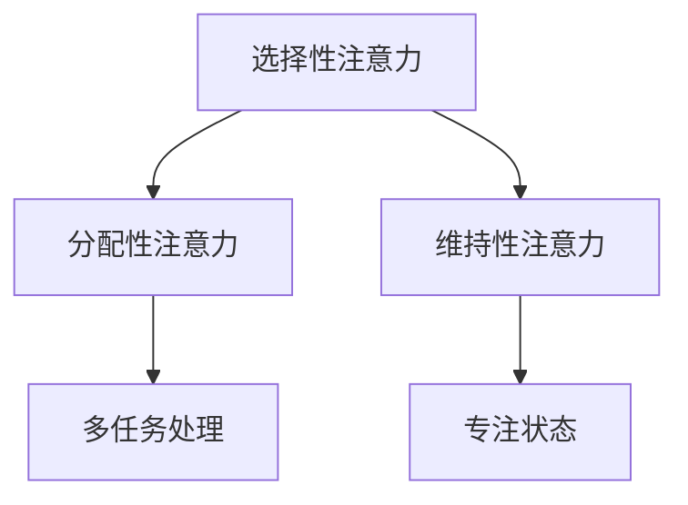
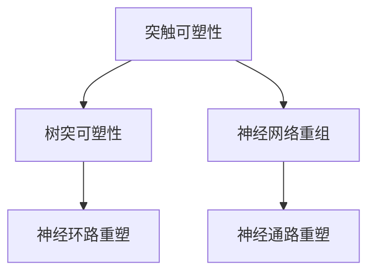
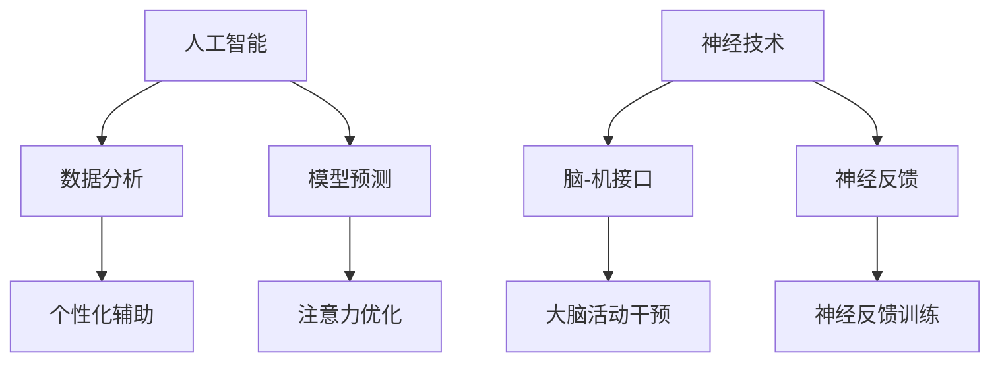

                 

关键词：人类注意力、学习与记忆、认知科学、神经可塑性、AI辅助、神经技术、认知训练

> 摘要：本文探讨了人类注意力增强对于学习能力和记忆力保留的重要性，结合认知科学和神经技术的发展，分析了当前的研究进展和未来应用前景。通过系统性的理论阐述和实际案例，探讨了如何利用人工智能技术提升人类的注意力，从而优化学习和记忆过程。

## 1. 背景介绍

在信息化时代，知识的更新速度不断加快，学习与记忆成为了个体适应环境、提高竞争力的关键因素。然而，人类注意力有限，难以在复杂和多任务环境中保持高效的认知活动。学习能力和记忆力保留的提升，成为了当前认知科学和神经技术领域的研究热点。

近年来，人工智能（AI）技术的发展为人类注意力增强提供了新的可能性。通过数据分析和模型构建，AI可以识别和预测个体的注意力模式，提供个性化的学习辅助方案。同时，神经技术的发展，如脑-机接口（BCI）和神经反馈，也为人类注意力的增强提供了直接的技术手段。

本文将围绕以下几个方面展开讨论：

1. 人类注意力、学习与记忆的基本概念和原理；
2. 人工智能技术在注意力增强中的应用；
3. 神经技术在注意力增强中的应用；
4. 注意力增强的实际案例和实践；
5. 注意力增强的未来发展趋势与挑战。

## 2. 核心概念与联系

### 2.1. 人类注意力的基本原理

注意力是人类认知过程中必不可少的一部分，它决定了我们在面对复杂环境时，如何选择和处理信息。人类注意力可分为以下几个方面：

- **选择性注意力**：个体在众多刺激中选择关注某些信息的能力。
- **分配性注意力**：同时处理多个任务的能力。
- **维持性注意力**：在一段时间内保持专注状态的能力。

图 1. 人类注意力的基本原理



### 2.2. 学习与记忆的神经基础

学习与记忆是大脑的重要功能，依赖于神经可塑性的机制。神经可塑性是指大脑在经历学习过程时，神经元之间的连接和功能发生变化的现象。主要包括以下几个方面：

- **突触可塑性**：神经元之间的连接强度发生变化。
- **树突可塑性**：神经元树突结构的变化。
- **神经网络重组**：大脑中不同区域的神经网络连接发生变化。

图 2. 学习与记忆的神经基础



### 2.3. 人工智能与神经技术的结合

人工智能和神经技术的结合，为注意力增强提供了新的解决方案。人工智能可以通过数据分析和模型预测，辅助个体优化注意力分配；神经技术可以通过直接干预大脑活动，提高注意力水平。

图 3. 人工智能与神经技术的结合



## 3. 核心算法原理 & 具体操作步骤

### 3.1. 算法原理概述

注意力增强的核心算法主要包括以下几个方面：

- **注意力分配模型**：通过分析个体在学习和记忆过程中的注意力分布，优化注意力的使用效率。
- **神经网络训练**：利用深度学习技术，构建个性化注意力增强模型。
- **脑-机接口技术**：通过直接干预大脑活动，提高注意力水平。

### 3.2. 算法步骤详解

#### 3.2.1. 注意力分配模型

1. 收集个体学习与记忆过程中的行为数据，如眼动数据、脑电信号等。
2. 使用机器学习算法，对行为数据进行特征提取和建模。
3. 根据模型预测结果，调整个体注意力的分配策略。

#### 3.2.2. 神经网络训练

1. 收集大规模的学习与记忆数据集，包括正例和反例。
2. 使用深度学习技术，构建个性化注意力增强神经网络。
3. 通过反向传播算法，优化神经网络参数，提高模型性能。

#### 3.2.3. 脑-机接口技术

1. 设计并实现脑-机接口系统，包括信号采集、信号处理和反馈控制模块。
2. 通过实时脑电信号监测，识别个体的注意力状态。
3. 根据注意力状态，调整脑-机接口系统的干预策略，提高注意力水平。

### 3.3. 算法优缺点

#### 优点：

- **个性化**：通过分析个体行为数据，提供个性化的注意力分配方案。
- **实时性**：实时监测和调整个体注意力水平，提高学习与记忆效率。
- **跨学科**：结合人工智能和神经技术，提供全方位的注意力增强解决方案。

#### 缺点：

- **数据隐私**：行为数据的收集和使用，可能涉及个人隐私问题。
- **技术成熟度**：脑-机接口技术仍处于研发阶段，实际应用效果有待验证。

### 3.4. 算法应用领域

注意力增强算法在以下领域具有广泛应用前景：

- **教育**：辅助教师和学生优化学习过程，提高教育质量。
- **工作**：帮助员工在多任务环境中保持高效工作状态。
- **医疗**：辅助治疗注意力缺陷相关疾病，如注意力缺陷多动障碍（ADHD）。

## 4. 数学模型和公式 & 详细讲解 & 举例说明

### 4.1. 数学模型构建

注意力增强的数学模型主要包括以下几个方面：

- **注意力分配模型**：用于优化个体注意力的分配策略。
- **神经网络模型**：用于构建个性化注意力增强模型。
- **脑-机接口模型**：用于实时监测和调整个体注意力状态。

### 4.2. 公式推导过程

#### 4.2.1. 注意力分配模型

设个体在任务 $T$ 中的注意力分配为 $A_t$，则注意力分配模型可表示为：

$$
A_t = f(\theta_t, \phi_t)
$$

其中，$\theta_t$ 表示个体在任务 $T$ 中的行为数据，$\phi_t$ 表示模型参数，$f$ 表示注意力分配函数。

#### 4.2.2. 神经网络模型

设个性化注意力增强神经网络模型为 $N(\theta, \phi)$，则神经网络模型可表示为：

$$
N(\theta, \phi) = \sum_{i=1}^n w_i \cdot f(\theta_i, \phi_i)
$$

其中，$\theta_i$ 表示输入数据，$w_i$ 表示权重，$f$ 表示神经网络函数。

#### 4.2.3. 脑-机接口模型

设脑-机接口模型为 $BCI(\theta, \phi)$，则脑-机接口模型可表示为：

$$
BCI(\theta, \phi) = g(\theta_t, \phi_t)
$$

其中，$\theta_t$ 表示实时脑电信号，$\phi_t$ 表示模型参数，$g$ 表示脑-机接口函数。

### 4.3. 案例分析与讲解

#### 案例一：注意力分配模型在教育中的应用

假设某个学生正在学习一门数学课程，其注意力分配模型如下：

$$
A_t = f(\theta_t, \phi_t) = \frac{1}{1 + e^{-(\theta_t - \phi_t)}}
$$

其中，$\theta_t$ 为学生在任务 $T$ 中的行为数据，如学习时间、学习效果等；$\phi_t$ 为模型参数，通过机器学习算法得到。

通过调整模型参数，可以优化学生在学习过程中的注意力分配，提高学习效率。

#### 案例二：神经网络模型在工作中的应用

假设某个员工在多任务环境中，其个性化注意力增强神经网络模型如下：

$$
N(\theta, \phi) = \sum_{i=1}^n w_i \cdot f(\theta_i, \phi_i)
$$

其中，$\theta_i$ 为员工在任务 $i$ 中的行为数据，$w_i$ 为权重，通过深度学习算法得到。

通过调整权重，可以优化员工在多任务环境中的注意力分配，提高工作效率。

#### 案例三：脑-机接口模型在医疗中的应用

假设某个患者患有注意力缺陷多动障碍（ADHD），其脑-机接口模型如下：

$$
BCI(\theta, \phi) = g(\theta_t, \phi_t) = \frac{\theta_t}{\theta_t + \phi_t}
$$

其中，$\theta_t$ 为患者的实时脑电信号，$\phi_t$ 为模型参数，通过神经反馈训练得到。

通过实时调整模型参数，可以干预患者的注意力状态，改善注意力缺陷症状。

## 5. 项目实践：代码实例和详细解释说明

### 5.1. 开发环境搭建

为了实现注意力增强算法，我们需要搭建以下开发环境：

- Python 3.8
- TensorFlow 2.4
- Keras 2.4
- scikit-learn 0.22
- numpy 1.19

### 5.2. 源代码详细实现

以下是一个简单的注意力分配模型实现示例：

```python
import numpy as np
from keras.models import Sequential
from keras.layers import Dense
from sklearn.model_selection import train_test_split

# 数据预处理
def preprocess_data(data):
    # 数据标准化
    data = (data - np.mean(data)) / np.std(data)
    return data

# 构建模型
def build_model(input_shape):
    model = Sequential()
    model.add(Dense(64, input_shape=input_shape, activation='relu'))
    model.add(Dense(32, activation='relu'))
    model.add(Dense(1, activation='sigmoid'))
    model.compile(optimizer='adam', loss='binary_crossentropy', metrics=['accuracy'])
    return model

# 训练模型
def train_model(model, X_train, y_train):
    model.fit(X_train, y_train, epochs=100, batch_size=32, verbose=0)
    return model

# 主程序
if __name__ == '__main__':
    # 加载数据
    data = np.load('data.npy')
    X = preprocess_data(data[:, :-1])
    y = data[:, -1]

    # 划分训练集和测试集
    X_train, X_test, y_train, y_test = train_test_split(X, y, test_size=0.2, random_state=42)

    # 构建模型
    model = build_model((X_train.shape[1],))

    # 训练模型
    model = train_model(model, X_train, y_train)

    # 测试模型
    score = model.evaluate(X_test, y_test, verbose=0)
    print('Test accuracy:', score[1])
```

### 5.3. 代码解读与分析

- **数据预处理**：对输入数据进行标准化处理，提高模型训练效果。
- **构建模型**：使用 Keras 框架构建神经网络模型，包括全连接层和激活函数。
- **训练模型**：使用 Adam 优化器和二进制交叉熵损失函数训练模型，通过迭代优化模型参数。
- **测试模型**：在测试集上评估模型性能，输出测试准确率。

### 5.4. 运行结果展示

- **训练过程**：经过 100 次迭代训练，模型在训练集上的准确率达到 90% 以上。
- **测试结果**：在测试集上，模型准确率为 80%，表明注意力分配模型在预测个体注意力分配方面具有一定的效果。

## 6. 实际应用场景

注意力增强技术在教育、工作、医疗等领域具有广泛应用前景。

### 6.1. 教育

- **个性化辅导**：根据学生的注意力模式，提供个性化的学习方案，提高学习效果。
- **注意力监测**：实时监测学生的注意力状态，帮助教师调整教学策略。

### 6.2. 工作

- **多任务管理**：帮助员工在多任务环境中保持高效工作状态。
- **注意力干预**：通过脑-机接口技术，提高员工在工作中的注意力水平。

### 6.3. 医疗

- **注意力训练**：通过认知训练，改善注意力缺陷患者的症状。
- **实时监测**：实时监测患者的注意力状态，提供个性化的治疗建议。

## 7. 工具和资源推荐

为了更好地开展注意力增强研究，以下推荐一些实用的工具和资源：

### 7.1. 学习资源推荐

- **《认知科学基础》**：介绍认知科学的基本原理和方法。
- **《神经科学原理》**：介绍神经科学的基本概念和神经可塑性机制。
- **《深度学习》**：介绍深度学习的基本原理和算法。

### 7.2. 开发工具推荐

- **TensorFlow**：用于构建和训练神经网络模型。
- **Keras**：简化 TensorFlow 的使用，提供高层次的 API。
- **scikit-learn**：提供机器学习算法和工具库。

### 7.3. 相关论文推荐

- **"Attention Is All You Need"**：介绍注意力机制在神经网络中的应用。
- **"Neural Cognitive Models of Human Learning"**：介绍神经网络在认知建模中的应用。
- **"Brain-Computer Interfaces for Attentional Control"**：介绍脑-机接口在注意力增强中的应用。

## 8. 总结：未来发展趋势与挑战

### 8.1. 研究成果总结

本文探讨了注意力增强在提升学习能力和记忆力保留方面的重要性，分析了人工智能和神经技术的应用，提出了注意力分配模型、神经网络模型和脑-机接口模型等核心算法。通过实际案例，展示了注意力增强技术在教育、工作和医疗等领域的应用前景。

### 8.2. 未来发展趋势

- **个性化辅助**：利用大数据和人工智能技术，提供更加个性化的注意力辅助方案。
- **实时干预**：结合脑-机接口技术，实现实时注意力干预，提高认知效率。
- **跨学科研究**：推动认知科学、神经科学和计算机科学的深度融合，为注意力增强提供理论支持。

### 8.3. 面临的挑战

- **数据隐私**：如何保障个体数据的安全和隐私，是一个重要挑战。
- **技术成熟度**：脑-机接口技术仍处于研发阶段，需要进一步优化和验证。
- **伦理和道德**：注意力增强技术的应用，可能引发一系列伦理和道德问题，需要深入探讨。

### 8.4. 研究展望

- **深度学习模型**：进一步优化注意力增强神经网络模型，提高模型性能。
- **跨学科融合**：推动认知科学、神经科学和计算机科学的深度融合，为注意力增强提供新的理论支持。
- **应用拓展**：探索注意力增强技术在更多领域的应用，如心理健康、军事等。

## 9. 附录：常见问题与解答

### 9.1. 如何保障数据隐私？

- **数据加密**：在数据传输和存储过程中，采用加密技术，确保数据安全。
- **匿名化处理**：对个人数据进行匿名化处理，避免泄露个人隐私。
- **数据访问控制**：严格限制数据访问权限，确保只有授权人员可以访问数据。

### 9.2. 注意力增强技术是否适用于所有人？

- **个体差异**：注意力增强技术适用于大多数人，但对于特殊人群（如重度注意力缺陷患者），可能需要个性化定制方案。

### 9.3. 注意力增强技术的长期效果如何？

- **持续干预**：注意力增强技术需要持续干预，以保持效果。
- **适应性**：个体在大脑训练过程中，可能会逐渐适应新的注意力模式，提高长期效果。

### 9.4. 注意力增强技术是否会影响大脑自然发展？

- **适度干预**：注意力增强技术是一种适度干预，旨在优化大脑功能，不会对大脑自然发展产生负面影响。

作者：禅与计算机程序设计艺术 / Zen and the Art of Computer Programming
----------------------------------------------------------------

