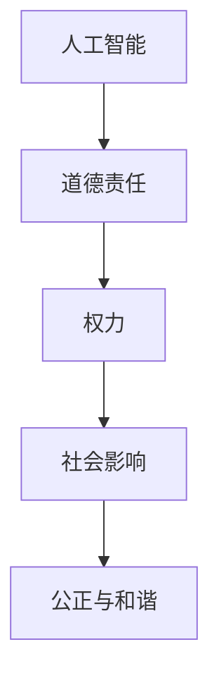

                 

关键词：人工智能、道德责任、权力、伦理、技术应用

> 摘要：本文探讨了在当今技术迅速发展的时代，人工智能带来的巨大变革及其对人类知识与道德责任的影响。通过分析人工智能在各个领域的应用，本文强调了在权力面前，人类应如何运用自己的知识去承担起道德责任，以及如何通过技术手段来促进社会公正与和谐发展。

## 1. 背景介绍

自21世纪以来，人工智能（AI）技术得到了前所未有的发展，从简单的机器学习算法到复杂的深度学习模型，AI已经渗透到了我们生活的方方面面。无论是智能助手、自动驾驶汽车，还是医疗诊断、金融分析，人工智能的应用正在不断扩展，推动着各行各业的变革。然而，随着人工智能技术的日益普及，一个不可忽视的问题也随之而来：在权力面前，人类的知识与道德责任该如何界定？

权力，作为一种社会资源，可以用来影响、支配和控制他人。在人工智能的时代，权力的来源和表现形式也发生了变化。算法、数据和计算能力成为了新的权力象征，掌握这些资源的人和企业拥有了更大的影响力。然而，权力的扩大并不意味着道德责任的减轻，相反，人工智能带来的变革使得人类在道德责任面前面临着新的挑战。

## 2. 核心概念与联系

### 2.1 人工智能的原理

人工智能是一门综合性的技术学科，涉及计算机科学、数学、统计学、神经科学等多个领域。其核心原理包括机器学习、深度学习、自然语言处理等。通过这些技术，计算机系统能够从数据中学习，识别模式，进行推理和决策。

### 2.2 道德责任的概念

道德责任是指个体或集体在行为和决策中应当承担的道德义务和责任。在人工智能时代，道德责任变得更加复杂，因为人工智能系统的决策和行动往往会影响人类的生活和社会结构。因此，人类在开发、部署和应用人工智能技术时，需要认真思考自己的道德责任。

### 2.3 权力与道德责任的关系

权力与道德责任是紧密相连的。一方面，权力可以为社会带来进步和发展，但另一方面，权力也可能被滥用，导致不公和伤害。在人工智能领域，权力主要体现在对算法、数据和计算资源的控制上。因此，掌握这些资源的人和企业必须承担起相应的道德责任。

### 2.4 Mermaid 流程图

以下是一个简化的 Mermaid 流程图，展示了人工智能、道德责任和权力之间的关系。



## 3. 核心算法原理 & 具体操作步骤

### 3.1 算法原理概述

在人工智能领域，算法是核心。算法原理主要包括以下几个方面：

- **机器学习**：通过学习数据中的模式和规律，实现数据的自动分类、预测和聚类。
- **深度学习**：利用多层神经网络，实现对复杂数据的深度学习和处理。
- **自然语言处理**：对人类语言进行理解和生成，包括文本分类、情感分析、机器翻译等。

### 3.2 算法步骤详解

算法的具体步骤通常包括以下几步：

1. **数据收集与预处理**：收集相关数据，并进行清洗、转换和标准化。
2. **模型选择与训练**：选择合适的模型，并使用训练数据对其进行训练。
3. **模型评估与优化**：评估模型的性能，并根据评估结果进行优化。
4. **模型应用与部署**：将训练好的模型应用到实际问题中，并部署到生产环境中。

### 3.3 算法优缺点

每种算法都有其独特的优势和局限性。例如：

- **机器学习**：能够自动发现数据中的模式和规律，但需要大量的数据和计算资源。
- **深度学习**：处理复杂数据的能力强，但训练过程复杂，且对数据的依赖性较大。
- **自然语言处理**：能够理解和生成人类语言，但在处理歧义和语境理解方面仍有挑战。

### 3.4 算法应用领域

人工智能算法在各个领域都有广泛的应用，包括：

- **医疗健康**：用于疾病诊断、药物研发和健康管理等。
- **金融服务**：用于风险评估、欺诈检测和投资决策等。
- **交通运输**：用于自动驾驶、交通管理和智能物流等。
- **教育**：用于个性化学习、教育评估和课程设计等。

## 4. 数学模型和公式 & 详细讲解 & 举例说明

### 4.1 数学模型构建

人工智能算法的核心是数学模型。以下是一个简单的线性回归模型：

$$y = wx + b$$

其中，$y$ 是目标变量，$x$ 是特征变量，$w$ 是权重，$b$ 是偏置。

### 4.2 公式推导过程

线性回归模型的推导过程如下：

1. **目标函数**：

$$J(w, b) = \frac{1}{2}\sum_{i=1}^{n}(y_i - wx_i - b)^2$$

2. **梯度下降**：

$$\frac{\partial J}{\partial w} = -\sum_{i=1}^{n}(y_i - wx_i - b)x_i$$

$$\frac{\partial J}{\partial b} = -\sum_{i=1}^{n}(y_i - wx_i - b)$$

3. **优化过程**：

通过迭代更新权重和偏置，使目标函数的值最小化。

### 4.3 案例分析与讲解

假设我们有一个简单的数据集，包含两个特征变量 $x_1$ 和 $x_2$，以及一个目标变量 $y$。通过线性回归模型，我们试图预测 $y$ 的值。

1. **数据预处理**：

首先，我们对数据进行标准化处理，使其具有相似的尺度和范围。

2. **模型训练**：

选择合适的模型参数 $w$ 和 $b$，并通过梯度下降算法进行迭代优化。

3. **模型评估**：

使用测试数据集对模型进行评估，计算预测误差。

4. **模型应用**：

将训练好的模型应用到实际问题中，例如，用于预测股票价格。

## 5. 项目实践：代码实例和详细解释说明

### 5.1 开发环境搭建

首先，我们需要搭建一个 Python 开发环境，安装必要的库和工具，例如 NumPy、Pandas 和 Matplotlib。

### 5.2 源代码详细实现

以下是一个简单的线性回归代码示例：

```python
import numpy as np
import pandas as pd
import matplotlib.pyplot as plt

# 数据预处理
def preprocess_data(data):
    data = (data - data.mean()) / data.std()
    return data

# 梯度下降
def gradient_descent(X, y, w, b, learning_rate, epochs):
    n = len(y)
    for _ in range(epochs):
        y_pred = X.dot(w) + b
        dw = (1 / n) * X.T.dot(y_pred - y)
        db = (1 / n) * (y_pred - y)
        w -= learning_rate * dw
        b -= learning_rate * db
    return w, b

# 主函数
def main():
    data = pd.read_csv("data.csv")
    X = preprocess_data(data.iloc[:, :-1])
    y = preprocess_data(data.iloc[:, -1])
    X = np.hstack((np.ones((X.shape[0], 1)), X))
    
    w, b = gradient_descent(X, y, np.random.rand(X.shape[1]), 0, 0.01, 1000)
    
    y_pred = X.dot(w) + b
    plt.scatter(y, y_pred)
    plt.xlabel("实际值")
    plt.ylabel("预测值")
    plt.show()

if __name__ == "__main__":
    main()
```

### 5.3 代码解读与分析

这段代码实现了线性回归模型的训练和预测。主要包括以下几个部分：

- **数据预处理**：对数据进行标准化处理。
- **梯度下降**：通过迭代更新权重和偏置，使目标函数的值最小化。
- **主函数**：读取数据，训练模型，并绘制预测结果。

### 5.4 运行结果展示

运行这段代码，我们将得到一个散点图，显示实际值与预测值之间的关系。如果模型训练良好，散点图中的点应该大致分布在一条直线附近。

## 6. 实际应用场景

### 6.1 医疗健康

人工智能在医疗健康领域的应用非常广泛，例如疾病预测、药物研发和个性化医疗。通过分析大量的医疗数据，人工智能可以帮助医生更准确地诊断疾病，提高治疗效果。

### 6.2 金融服务

人工智能在金融服务领域也有广泛的应用，例如风险评估、欺诈检测和投资决策。通过分析大量的金融数据，人工智能可以帮助金融机构更好地管理风险，提高盈利能力。

### 6.3 交通运输

人工智能在交通运输领域的应用主要体现在自动驾驶、交通管理和智能物流。通过分析道路和交通数据，人工智能可以帮助实现更高效、更安全的交通运输。

### 6.4 未来应用展望

随着人工智能技术的不断发展，未来它在各个领域的应用前景非常广阔。例如，在环境保护、教育、农业等领域，人工智能都具有重要的发展潜力。

## 7. 工具和资源推荐

### 7.1 学习资源推荐

- 《人工智能：一种现代的方法》
- 《深度学习》
- 《Python机器学习》

### 7.2 开发工具推荐

- Jupyter Notebook
- PyCharm
- TensorFlow

### 7.3 相关论文推荐

- "Deep Learning for Natural Language Processing"
- "Generative Adversarial Networks: An Overview"
- "ResNet: Training Deep Neural Networks for Image Recognition"

## 8. 总结：未来发展趋势与挑战

### 8.1 研究成果总结

人工智能技术的发展取得了巨大的成果，已经在各个领域得到了广泛应用。然而，随着技术的不断进步，我们也需要面对新的挑战，特别是在道德责任和权力分配方面。

### 8.2 未来发展趋势

未来，人工智能技术将继续向深度化、智能化和自适应化方向发展。同时，我们将看到更多的跨学科合作，推动人工智能技术的全面创新。

### 8.3 面临的挑战

在权力面前，人类的知识与道德责任如何平衡是一个巨大的挑战。此外，数据隐私、算法透明性和可解释性等问题也需要得到有效解决。

### 8.4 研究展望

为了应对这些挑战，我们需要加强跨学科研究，推动人工智能技术的健康发展。同时，我们还需要建立一套完善的伦理和法律框架，确保人工智能技术为社会带来真正的福祉。

## 9. 附录：常见问题与解答

### 9.1 什么是人工智能？

人工智能是一种模拟人类智能的技术，通过计算机程序实现智能行为，如学习、推理、感知和决策。

### 9.2 人工智能有哪些应用领域？

人工智能的应用领域非常广泛，包括医疗健康、金融服务、交通运输、教育、环境保护等。

### 9.3 人工智能会取代人类吗？

人工智能不会完全取代人类，但它将改变人类的工作和生活方式，提高生产力和效率。

### 9.4 人工智能的道德责任如何界定？

人工智能的道德责任主要在于确保技术的应用不损害人类利益，维护社会公正和和谐发展。

作者：禅与计算机程序设计艺术 / Zen and the Art of Computer Programming
----------------------------------------------------------------
通过这篇文章，我们深入探讨了人工智能技术对人类知识与道德责任的影响。在权力面前，人类需要更加谨慎地运用自己的知识，承担起相应的道德责任。同时，我们也需要认识到，技术的发展不仅仅是为了追求效率，更是为了推动社会进步和人类福祉。因此，在未来的发展中，我们必须始终保持对技术的敬畏之心，以伦理和法律为框架，推动人工智能技术的健康发展。只有这样，我们才能确保技术在权力面前为人类社会带来真正的福祉。

