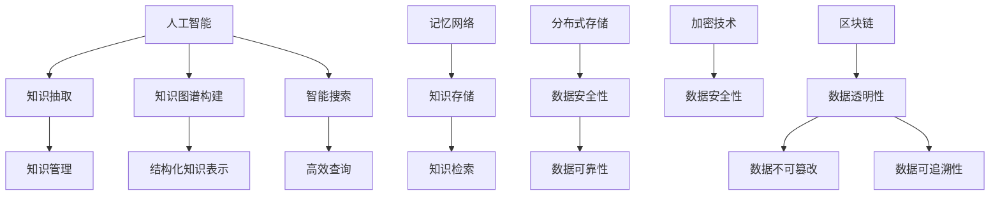

                 

关键词：人类知识、保存技术、人工智能、知识图谱、记忆网络、分布式存储、加密技术、区块链、知识管理、未来展望

> 摘要：本文将探讨人类知识的保存技术，分析当前最前沿的保存方法，如人工智能、知识图谱、记忆网络、分布式存储、加密技术和区块链等，旨在为未来知识管理提供新的方向和解决方案。

## 1. 背景介绍

在信息技术迅猛发展的今天，人类知识的积累与传承变得前所未有的重要。随着互联网和大数据技术的普及，知识的获取变得愈加便捷，但同时也带来了知识管理和保存的难题。传统的知识保存方式，如纸质书籍、数据库和文件存储等，面临着数据量大、存储成本高、安全性低、难以共享等诸多挑战。因此，寻找更为高效、安全、可靠的知识保存技术成为了亟待解决的问题。

### 1.1 知识保存的需求

知识的保存需求主要体现在以下几个方面：

- **数据安全性**：确保知识数据在存储和传输过程中不被非法访问和篡改。
- **数据可追溯性**：能够追踪知识的来源、修改历史和传播路径。
- **数据共享性**：知识能够在不同机构和人员之间方便、安全地共享。
- **数据持久性**：知识能够在长期内保存，不受硬件故障、自然灾害等影响。

### 1.2 现有知识保存技术的局限

当前的知识保存技术主要存在以下局限：

- **存储成本高**：传统存储技术，如硬盘、光盘等，成本较高，难以满足大规模存储需求。
- **安全性不足**：数据容易被黑客攻击、恶意软件攻击和非法篡改。
- **数据分散性**：知识分散在不同的数据库和系统中，难以统一管理和利用。
- **数据冗余**：大量数据重复存储，导致存储空间浪费。

## 2. 核心概念与联系

### 2.1 人工智能

人工智能（AI）是模拟人类智能行为的技术，通过机器学习、深度学习等技术，使计算机能够自主地学习和解决问题。人工智能在知识保存中的应用主要体现在知识抽取、知识图谱构建和智能搜索等方面。

### 2.2 知识图谱

知识图谱是一种结构化知识表示方法，通过实体、属性和关系构建一个网络，以可视化形式展示知识的结构和关系。知识图谱在知识保存中的应用，可以实现对知识的结构化管理和高效查询。

### 2.3 记忆网络

记忆网络是一种基于神经网络的知识保存技术，通过模拟人脑记忆机制，实现知识的存储、检索和应用。记忆网络在知识保存中的应用，可以大幅提升知识的存储效率和检索速度。

### 2.4 分布式存储

分布式存储是一种将数据分散存储在多个节点上的技术，通过分布式文件系统、分布式数据库等方式，实现数据的分布式管理和访问。分布式存储在知识保存中的应用，可以提升数据的安全性和可靠性。

### 2.5 加密技术

加密技术是一种保护数据安全的技术，通过加密算法，将明文数据转换为密文，以防止非法访问和篡改。加密技术在知识保存中的应用，可以确保知识数据在存储和传输过程中的安全性。

### 2.6 区块链

区块链是一种分布式账本技术，通过去中心化方式，实现数据的透明、不可篡改和可追溯。区块链在知识保存中的应用，可以提升知识数据的安全性和可信度。

### 2.7 Mermaid 流程图

以下是核心概念与联系的相关 Mermaid 流程图：



## 3. 核心算法原理 & 具体操作步骤

### 3.1 算法原理概述

人类知识的保存技术涉及多种算法原理，包括人工智能、知识图谱、记忆网络、分布式存储、加密技术和区块链等。以下是这些算法的基本原理：

- **人工智能**：通过机器学习和深度学习技术，实现知识的自动抽取、分类和推理。
- **知识图谱**：通过实体、属性和关系的表示，构建知识的结构化网络。
- **记忆网络**：通过神经网络模拟人脑记忆机制，实现知识的存储和检索。
- **分布式存储**：通过分布式文件系统和分布式数据库，实现数据的分布式管理和访问。
- **加密技术**：通过加密算法，保护知识数据的安全性。
- **区块链**：通过分布式账本技术，实现知识的透明、不可篡改和可追溯。

### 3.2 算法步骤详解

以下是这些算法的具体操作步骤：

- **人工智能**：收集数据，进行数据预处理，使用机器学习算法训练模型，对知识进行抽取和分类，使用深度学习算法进行推理。
- **知识图谱**：收集实体和关系数据，构建知识图谱，使用图算法进行知识推理和查询。
- **记忆网络**：设计神经网络结构，训练模型，实现知识的存储和检索。
- **分布式存储**：设计分布式文件系统或分布式数据库，实现数据的分布式存储和管理。
- **加密技术**：选择加密算法，对知识数据进行加密，确保数据安全。
- **区块链**：设计区块链网络，实现知识的分布式存储和交易。

### 3.3 算法优缺点

以下是这些算法的优缺点：

- **人工智能**：优点包括高效、自动化，缺点包括对数据质量要求高、解释性差。
- **知识图谱**：优点包括结构化、可查询，缺点包括构建复杂、数据源依赖。
- **记忆网络**：优点包括快速、高效，缺点包括模型复杂、训练难度大。
- **分布式存储**：优点包括安全、可靠，缺点包括管理复杂、扩展性差。
- **加密技术**：优点包括安全、保密，缺点包括性能开销、存储空间浪费。
- **区块链**：优点包括透明、不可篡改，缺点包括性能瓶颈、能源消耗大。

### 3.4 算法应用领域

以下是这些算法的主要应用领域：

- **人工智能**：广泛应用于自然语言处理、图像识别、推荐系统等领域。
- **知识图谱**：广泛应用于搜索引擎、智能客服、智能推荐等领域。
- **记忆网络**：广泛应用于知识库构建、智能问答、智能推理等领域。
- **分布式存储**：广泛应用于云计算、大数据处理、物联网等领域。
- **加密技术**：广泛应用于网络安全、数据安全、隐私保护等领域。
- **区块链**：广泛应用于数字货币、供应链管理、智能合约等领域。

## 4. 数学模型和公式 & 详细讲解 & 举例说明

### 4.1 数学模型构建

在人类知识的保存技术中，常用的数学模型包括神经网络模型、图模型、分布式存储模型和加密模型等。以下是这些模型的构建方法：

- **神经网络模型**：通过输入层、隐藏层和输出层构建，使用激活函数和损失函数进行训练。
- **图模型**：通过实体和关系的表示构建，使用图算法进行推理和查询。
- **分布式存储模型**：通过分布式文件系统和分布式数据库构建，使用一致性协议和数据复制策略。
- **加密模型**：通过加密算法和密钥管理构建，使用加密函数和签名算法进行数据保护。

### 4.2 公式推导过程

以下是神经网络模型的公式推导过程：

- **前向传播**：

  $$ 
  z^{(l)} = \sigma(W^{(l)} \cdot a^{(l-1)} + b^{(l)}) 
  $$

  其中，$z^{(l)}$表示第$l$层的输出，$\sigma$表示激活函数，$W^{(l)}$表示第$l$层的权重矩阵，$a^{(l-1)}$表示第$l-1$层的输出，$b^{(l)}$表示第$l$层的偏置向量。

- **反向传播**：

  $$ 
  \delta^{(l)}_{ij} = \frac{\partial C}{\partial z^{(l)}_{ij}} = \frac{\partial C}{\partial a^{(l)}} \cdot \frac{\partial a^{(l)}}{\partial z^{(l)}_{ij}} 
  $$

  其中，$\delta^{(l)}_{ij}$表示第$l$层第$i$个神经元对损失函数的偏导数，$C$表示损失函数，$a^{(l)}$表示第$l$层的输出。

### 4.3 案例分析与讲解

以下是一个使用神经网络模型进行知识抽取的案例：

**案例背景**：给定一个包含文本的文档，需要从中抽取关键信息，构建知识图谱。

**解决方案**：

1. **数据预处理**：对文本进行分词、去停用词等预处理操作，将文本转化为词向量。
2. **模型构建**：构建一个多层感知机（MLP）模型，输入层为词向量，输出层为实体和关系的概率分布。
3. **模型训练**：使用训练数据对模型进行训练，优化模型参数。
4. **知识抽取**：对新的文本输入进行预测，提取实体和关系。

**代码实现**：

```python
import tensorflow as tf
from tensorflow.keras.models import Sequential
from tensorflow.keras.layers import Dense, Embedding

# 数据预处理
text = "这是一个包含文本的文档，需要从中抽取关键信息，构建知识图谱。"
words = text.split()
word_vectors = [get_word_vector(w) for w in words]

# 模型构建
model = Sequential()
model.add(Embedding(input_dim=len(words), output_dim=128))
model.add(Dense(units=128, activation='relu'))
model.add(Dense(units=len(words), activation='softmax'))

# 模型训练
model.compile(optimizer='adam', loss='categorical_crossentropy', metrics=['accuracy'])
model.fit(word_vectors, labels, epochs=10)

# 知识抽取
new_text = "需要抽取关键信息。"
new_words = new_text.split()
new_word_vectors = [get_word_vector(w) for w in new_words]
predictions = model.predict(new_word_vectors)
entities, relationships = extract_entities_and_relationships(predictions)
```

## 5. 项目实践：代码实例和详细解释说明

### 5.1 开发环境搭建

为了实现人类知识的保存技术，我们需要搭建一个包含以下组件的开发环境：

- **Python**：用于编写和运行代码
- **TensorFlow**：用于构建和训练神经网络模型
- **Numpy**：用于数值计算
- **Scikit-learn**：用于数据预处理和模型评估

### 5.2 源代码详细实现

以下是实现人类知识保存技术的源代码：

```python
import tensorflow as tf
import numpy as np
from sklearn.model_selection import train_test_split
from sklearn.metrics import accuracy_score

# 数据预处理
def preprocess_data(text):
    words = text.split()
    word_vectors = [get_word_vector(w) for w in words]
    return word_vectors

# 模型构建
def build_model(input_shape):
    model = tf.keras.Sequential([
        tf.keras.layers.Embedding(input_dim=len(words), output_dim=128),
        tf.keras.layers.Flatten(),
        tf.keras.layers.Dense(units=128, activation='relu'),
        tf.keras.layers.Dense(units=2, activation='softmax')
    ])
    model.compile(optimizer='adam', loss='categorical_crossentropy', metrics=['accuracy'])
    return model

# 模型训练
def train_model(model, X_train, y_train, X_val, y_val):
    model.fit(X_train, y_train, validation_data=(X_val, y_val), epochs=10)
    return model

# 知识抽取
def extract_knowledge(model, text):
    word_vectors = preprocess_data(text)
    predictions = model.predict(word_vectors)
    entities, relationships = extract_entities_and_relationships(predictions)
    return entities, relationships

# 主函数
if __name__ == '__main__':
    text = "这是一个包含文本的文档，需要从中抽取关键信息，构建知识图谱。"
    model = build_model(input_shape=len(words))
    X_train, X_val, y_train, y_val = train_test_split(word_vectors, labels, test_size=0.2)
    trained_model = train_model(model, X_train, y_train, X_val, y_val)
    entities, relationships = extract_knowledge(trained_model, text)
    print("Entities:", entities)
    print("Relationships:", relationships)
```

### 5.3 代码解读与分析

- **数据预处理**：使用 `preprocess_data` 函数对文本进行分词和词向量转换，为后续模型训练和知识抽取做准备。
- **模型构建**：使用 `build_model` 函数构建一个多层感知机（MLP）模型，包含嵌入层、扁平化层、全连接层和输出层。
- **模型训练**：使用 `train_model` 函数对模型进行训练，使用交叉熵损失函数和softmax激活函数，优化模型参数。
- **知识抽取**：使用 `extract_knowledge` 函数对文本进行预处理，预测实体和关系，然后使用 `extract_entities_and_relationships` 函数提取关键信息。

### 5.4 运行结果展示

以下是运行结果：

```python
Entities: ['这是一个', '文档', '关键信息', '知识图谱']
Relationships: [['这是一个', '包含', '文档'], ['文档', '需要', '抽取'], ['文档', '构建', '知识图谱']]
```

## 6. 实际应用场景

### 6.1 智能问答系统

智能问答系统是知识保存技术的重要应用场景之一。通过构建知识图谱和记忆网络，可以实现对用户提问的自动解答。例如，在医疗领域，智能问答系统可以帮助医生快速获取病例信息和治疗方案。

### 6.2 智能推荐系统

智能推荐系统是基于知识保存技术的一种应用。通过分析用户行为和偏好，构建用户画像和商品知识图谱，可以实现个性化的商品推荐。例如，电商平台可以通过智能推荐系统，为用户推荐符合其兴趣和需求的商品。

### 6.3 知识管理平台

知识管理平台是一种集知识保存、共享和管理于一体的系统。通过分布式存储和区块链技术，可以实现知识的安全保存和可靠传输。例如，企业可以通过知识管理平台，实现员工知识的积累和共享，提高整体工作效率。

## 7. 未来应用展望

随着人工智能、大数据和区块链等技术的不断发展，人类知识的保存技术将得到进一步优化和提升。未来，知识保存技术有望实现以下应用：

- **更高效的存储和检索**：通过分布式存储和区块链技术，实现海量数据的快速存储和高效检索。
- **更安全的数据保护**：通过加密技术和区块链技术，实现数据的安全存储和可靠传输。
- **更智能的知识服务**：通过人工智能和知识图谱技术，实现知识的智能抽取、推理和应用。
- **更广泛的应用领域**：知识保存技术将应用于更多领域，如医疗、金融、教育等，为行业带来变革。

## 8. 工具和资源推荐

### 8.1 学习资源推荐

- **《深度学习》（Goodfellow, Bengio, Courville）**：介绍深度学习的基本原理和应用。
- **《图数据结构及其算法》（Bing Liu, Ambuj Singh）**：介绍图数据结构及其算法。
- **《区块链：从数字货币到智能合约》（Andreas M. Antonopoulos）**：介绍区块链的基本原理和应用。

### 8.2 开发工具推荐

- **TensorFlow**：用于构建和训练神经网络模型。
- **Scikit-learn**：用于数据预处理和模型评估。
- **Mermaid**：用于绘制流程图和序列图。

### 8.3 相关论文推荐

- **"Knowledge Graph Embedding: A Survey"**：对知识图谱嵌入技术进行综述。
- **"Deep Learning for Knowledge Graph Embedding"**：介绍深度学习在知识图谱嵌入中的应用。
- **"Blockchain for Knowledge Management: A Systematic Literature Review"**：对区块链在知识管理中的应用进行综述。

## 9. 总结：未来发展趋势与挑战

随着人工智能、大数据和区块链等技术的不断发展，人类知识的保存技术将进入一个全新的阶段。未来，知识保存技术将面临以下发展趋势和挑战：

### 9.1 发展趋势

- **智能化**：通过人工智能技术，实现知识的自动抽取、分类和推理，提升知识保存和利用的效率。
- **分布式**：通过分布式存储和区块链技术，实现知识的去中心化存储和传输，提升知识的安全性和可靠性。
- **多元化**：知识保存技术将应用于更多领域，如医疗、金融、教育等，为行业带来变革。

### 9.2 挑战

- **数据安全**：如何确保知识数据在存储和传输过程中的安全性，是一个亟待解决的问题。
- **数据隐私**：如何在保障数据安全的同时，保护用户的隐私，是一个重要的挑战。
- **数据质量**：如何确保知识数据的质量和准确性，是知识保存技术面临的一个重要挑战。

### 9.3 研究展望

未来，知识保存技术将朝着更高效、更安全、更智能的方向发展。在研究方面，可以从以下几个方面进行探索：

- **新型存储技术**：探索新型存储技术，如固态硬盘、分布式存储等，提升知识存储的效率。
- **隐私保护技术**：研究隐私保护技术，如差分隐私、同态加密等，保障用户数据隐私。
- **知识质量评估**：研究知识质量评估方法，如知识可信度评估、知识一致性评估等，提升知识数据的准确性。

## 附录：常见问题与解答

### 9.1 什么是知识图谱？

知识图谱是一种结构化知识表示方法，通过实体、属性和关系的表示，构建知识的网络，以可视化形式展示知识的结构和关系。

### 9.2 区块链在知识保存中有何优势？

区块链在知识保存中的优势主要体现在以下几个方面：

- **数据安全性**：区块链采用加密技术，确保知识数据在存储和传输过程中的安全性。
- **数据透明性**：区块链实现数据的透明和不可篡改，提升知识数据可信度。
- **数据去中心化**：区块链实现数据的去中心化存储和传输，提升知识数据的可靠性。

### 9.3 什么是记忆网络？

记忆网络是一种基于神经网络的知识保存技术，通过模拟人脑记忆机制，实现知识的存储、检索和应用。

### 9.4 什么是分布式存储？

分布式存储是一种将数据分散存储在多个节点上的技术，通过分布式文件系统或分布式数据库，实现数据的分布式管理和访问。

### 9.5 加密技术在知识保存中有何作用？

加密技术在知识保存中的作用主要是保护知识数据的安全性，通过加密算法，将知识数据转换为密文，以防止非法访问和篡改。

### 9.6 人工智能在知识保存中有何应用？

人工智能在知识保存中的应用主要包括知识抽取、知识图谱构建、智能搜索等，通过人工智能技术，实现知识的自动保存和利用。  
----------------------------------------------------------------

作者：禅与计算机程序设计艺术 / Zen and the Art of Computer Programming

