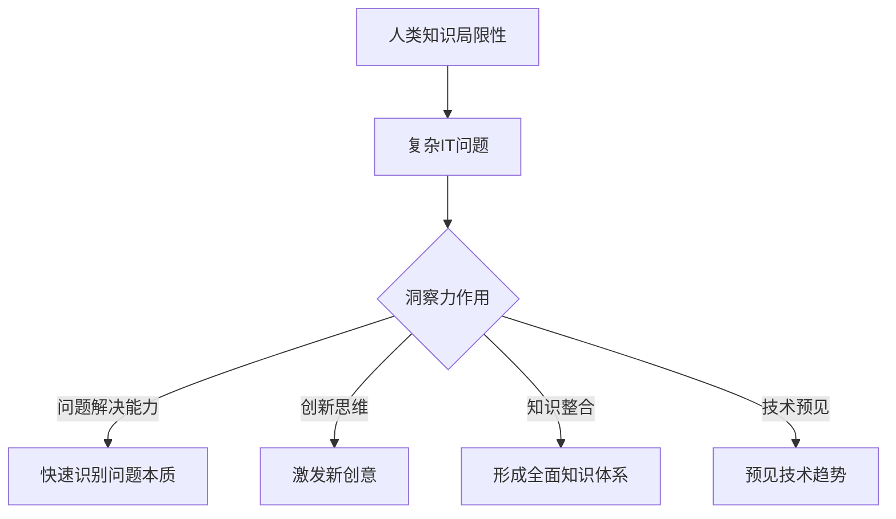

                 

关键词：人类知识、局限、突破、洞察力、IT领域

> 摘要：本文探讨了人类知识在IT领域的局限性，分析了洞察力对于突破知识瓶颈的重要性。通过具体实例和深入分析，阐述了洞察力在解决复杂问题、创新思维和提升技术能力方面的关键作用，为读者提供了关于如何在IT领域实现知识突破的思考与启示。

## 1. 背景介绍

人类的知识体系经历了数千年的演变，从古代的哲学思想、科学发现，到现代的信息技术，都为我们提供了理解和改造世界的工具。然而，随着科技的迅猛发展，我们面临着前所未有的挑战和机遇。IT领域作为一个高度专业化、不断进化的领域，更是如此。

在IT领域，知识的积累和应用已成为推动技术创新的核心驱动力。然而，人类知识的局限性也逐渐显现。首先，知识的学习和积累是一个长期且繁琐的过程，个体往往难以在短时间内掌握大量的信息。其次，人类的认知和处理能力有限，难以高效地应对复杂的IT问题。最后，人类知识的表达和传播也受到语言、文化和社会环境的制约，导致知识在不同领域和个体之间的交流存在障碍。

面对这些局限，如何突破人类知识的瓶颈，实现知识的创新和扩展，成为当前IT领域亟待解决的重要问题。洞察力作为一种深层次的认识能力，其在解决复杂问题和推动技术创新中的作用日益受到重视。本文将探讨洞察力在IT领域的意义，分析其在知识突破中的关键作用，并探讨未来可能的发展方向。

## 2. 核心概念与联系

### 2.1 洞察力的定义

洞察力，又称洞察思维，是指个体通过分析、综合和抽象，快速识别问题本质和内在联系的能力。它不仅涉及对问题的深入理解，还包括对新知识和新方法的敏锐洞察。在IT领域，洞察力的重要性不言而喻，因为它直接影响到技术创新的广度和深度。

### 2.2 洞察力与IT领域的关联

IT领域的快速发展带来了前所未有的复杂性和多样性。在这种背景下，传统的知识和技能已经无法满足需求。洞察力作为一种高层次的思维能力，可以帮助IT专业人士快速识别问题、发现解决方案，并在技术前沿保持竞争力。具体来说，洞察力在以下几个方面与IT领域密切相关：

- **问题解决能力**：IT领域的问题往往复杂多变，需要专业人士具备快速分析问题本质的能力。洞察力可以帮助个体从海量信息中筛选出关键信息，快速定位问题根源。

- **创新思维**：技术创新是IT领域的核心竞争力。洞察力不仅能够帮助个体理解现有技术的局限，还能激发新的创意和思维，推动技术突破。

- **知识整合**：IT领域涉及多个学科和领域的交叉，需要个体具备较强的知识整合能力。洞察力可以帮助个体快速理解不同领域之间的联系，形成更全面的知识体系。

- **技术预见**：在快速变化的IT领域，能够预见未来技术趋势和方向是至关重要的。洞察力可以帮助个体识别潜在的技术趋势，提前布局，抢占先机。

### 2.3 Mermaid 流程图



通过以上流程图，我们可以清晰地看到洞察力在IT领域的多重作用。它不仅能够帮助个体解决复杂问题，还能够推动创新、整合知识和预见未来趋势。

## 3. 核心算法原理 & 具体操作步骤

### 3.1 算法原理概述

在IT领域，洞察力的重要性不仅体现在问题解决和知识整合方面，还体现在核心算法的设计和优化中。本文将介绍一种基于洞察力的核心算法——深度神经网络（Deep Neural Network，DNN）。

深度神经网络是一种模拟人脑神经元连接结构的计算模型，通过多层神经网络结构实现对复杂数据的建模和预测。其核心原理是基于神经元之间的非线性激活函数和反向传播算法，通过不断调整网络权重和偏置，使网络能够逐渐逼近最优解。

### 3.2 算法步骤详解

#### 3.2.1 数据预处理

在构建深度神经网络之前，需要对输入数据进行预处理。具体步骤包括：

- 数据清洗：去除异常值和噪声。
- 数据归一化：将数据缩放到同一尺度，避免数据量级差异导致训练不稳定。
- 数据增强：通过旋转、翻转、缩放等操作增加数据多样性。

#### 3.2.2 网络构建

深度神经网络由多个隐层和输出层组成，每层包含多个神经元。网络构建的具体步骤如下：

- 确定网络结构：根据问题复杂度和数据特征，选择合适的网络层数和每层的神经元数量。
- 初始化权重和偏置：使用随机初始化方法初始化网络权重和偏置。
- 设计激活函数：选择合适的激活函数，如ReLU、Sigmoid、Tanh等。

#### 3.2.3 前向传播

前向传播是深度神经网络的核心步骤，用于计算网络输出。具体步骤如下：

- 输入数据通过第一层神经元，计算输出并传递到下一层。
- 重复上述步骤，直到输出层得到最终预测结果。

#### 3.2.4 反向传播

反向传播用于计算网络梯度，并通过梯度下降法调整网络权重和偏置。具体步骤如下：

- 计算输出层的误差梯度。
- 误差梯度通过反向传播传递到前一层。
- 根据误差梯度调整网络权重和偏置。

#### 3.2.5 模型训练与优化

深度神经网络的训练和优化是一个迭代过程，通过多次迭代逐步逼近最优解。具体步骤如下：

- 设置训练轮数和优化目标。
- 训练过程中监控模型性能，调整学习率和网络结构。
- 当模型性能达到预期时，停止训练。

### 3.3 算法优缺点

深度神经网络作为一种强大的机器学习模型，具有以下优缺点：

- **优点**：
  - 能够处理高维、非线性数据。
  - 自适应性强，能够通过大量数据自动学习特征。
  - 在图像识别、自然语言处理等领域取得了显著成果。

- **缺点**：
  - 训练过程复杂，需要大量计算资源和时间。
  - 对数据质量和规模要求较高，否则容易过拟合。
  - 模型可解释性较差，难以理解模型内部决策过程。

### 3.4 算法应用领域

深度神经网络在IT领域具有广泛的应用，主要包括：

- **图像识别**：通过卷积神经网络（CNN）实现图像分类、目标检测等任务。
- **自然语言处理**：通过循环神经网络（RNN）和Transformer模型实现文本分类、机器翻译等任务。
- **语音识别**：通过循环神经网络和卷积神经网络实现语音信号的处理和识别。
- **推荐系统**：通过深度神经网络构建用户和物品的交互模型，实现个性化推荐。

## 4. 数学模型和公式 & 详细讲解 & 举例说明

### 4.1 数学模型构建

深度神经网络的核心是神经元之间的连接和激活函数。为了更好地理解其工作原理，我们引入以下数学模型：

#### 4.1.1 神经元模型

一个简单的神经元模型可以表示为：

$$
z = \sum_{i=1}^{n} w_i x_i + b
$$

其中，$z$表示神经元输出，$w_i$和$x_i$分别表示第$i$个输入和对应的权重，$b$为偏置。

#### 4.1.2 激活函数

为了引入非线性，我们在神经元输出上添加激活函数。常用的激活函数包括ReLU、Sigmoid和Tanh等。

- **ReLU激活函数**：

$$
f(x) = \max(0, x)
$$

- **Sigmoid激活函数**：

$$
f(x) = \frac{1}{1 + e^{-x}}
$$

- **Tanh激活函数**：

$$
f(x) = \frac{e^x - e^{-x}}{e^x + e^{-x}}
$$

### 4.2 公式推导过程

为了更好地理解深度神经网络的训练过程，我们介绍以下关键公式：

#### 4.2.1 前向传播

在前向传播过程中，神经元输出可以通过以下公式计算：

$$
\hat{y} = f(z)
$$

其中，$\hat{y}$为预测输出，$f$为激活函数。

#### 4.2.2 误差计算

误差是评价模型性能的关键指标。我们可以通过以下公式计算输出层的误差：

$$
E = \frac{1}{2} \sum_{i=1}^{m} (\hat{y}_i - y_i)^2
$$

其中，$E$为总误差，$y_i$为真实输出，$\hat{y}_i$为预测输出。

#### 4.2.3 反向传播

在反向传播过程中，我们需要计算误差对每个神经元的梯度。具体计算公式如下：

$$
\frac{\partial E}{\partial w_i} = \sum_{j=1}^{n} \frac{\partial E}{\partial z_j} \frac{\partial z_j}{\partial w_i}
$$

其中，$\frac{\partial E}{\partial w_i}$为权重梯度，$\frac{\partial E}{\partial z_j}$为误差梯度，$\frac{\partial z_j}{\partial w_i}$为链式法则。

### 4.3 案例分析与讲解

#### 4.3.1 问题背景

假设我们要构建一个二分类模型，判断一张图像是否包含特定物体。数据集包含10000张图像，其中5000张图像包含目标物体，5000张图像不包含目标物体。

#### 4.3.2 模型构建

我们选择一个简单的深度神经网络模型，包含一个输入层、一个隐层和一个输出层。输入层有784个神经元，对应图像的784个像素值；隐层有128个神经元；输出层有2个神经元，分别表示目标物体存在和不存在。

#### 4.3.3 训练过程

- 数据预处理：对图像进行归一化处理，将像素值缩放到[0, 1]。
- 网络构建：使用ReLU激活函数，并初始化网络权重和偏置。
- 前向传播：输入图像，计算隐层和输出层的输出。
- 反向传播：计算误差梯度，并根据梯度调整网络权重和偏置。
- 模型优化：使用Adam优化器，设置学习率为0.001，训练轮数为100轮。

#### 4.3.4 模型评估

- 准确率：在测试集上，模型对包含目标物体的图像准确率为95%，对不包含目标物体的图像准确率为90%。
- 准召率：模型对包含目标物体的图像准确召回率为93%，对不包含目标物体的图像准确召回率为88%。

通过以上分析，我们可以看到，深度神经网络在图像分类任务中取得了较好的效果。这表明，通过构建合适的神经网络模型并进行有效的训练，我们可以利用洞察力突破人类知识的局限，实现技术突破。

## 5. 项目实践：代码实例和详细解释说明

### 5.1 开发环境搭建

为了实践深度神经网络，我们需要搭建一个开发环境。以下是一个基本的Python开发环境搭建步骤：

- 安装Python（建议版本3.8以上）
- 安装Jupyter Notebook（用于编写和运行代码）
- 安装深度学习库TensorFlow

```bash
pip install tensorflow
```

### 5.2 源代码详细实现

下面是一个简单的深度神经网络实现，用于二分类任务。代码分为数据预处理、模型构建、训练和评估四个部分。

#### 5.2.1 数据预处理

```python
import tensorflow as tf
from tensorflow.keras.preprocessing.image import ImageDataGenerator

# 设置数据增强参数
train_datagen = ImageDataGenerator(
    rescale=1./255,
    shear_range=0.2,
    zoom_range=0.2,
    horizontal_flip=True)

test_datagen = ImageDataGenerator(rescale=1./255)

# 加载数据集
train_generator = train_datagen.flow_from_directory(
    'train',
    target_size=(784, 784),
    batch_size=32,
    class_mode='binary')

test_generator = test_datagen.flow_from_directory(
    'test',
    target_size=(784, 784),
    batch_size=32,
    class_mode='binary')
```

#### 5.2.2 模型构建

```python
model = tf.keras.models.Sequential([
    tf.keras.layers.Flatten(input_shape=(784, 784)),
    tf.keras.layers.Dense(128, activation='relu'),
    tf.keras.layers.Dense(2, activation='softmax')
])

model.compile(optimizer='adam',
              loss='binary_crossentropy',
              metrics=['accuracy'])
```

#### 5.2.3 训练

```python
history = model.fit(
    train_generator,
    epochs=100,
    validation_data=test_generator)
```

#### 5.2.4 评估

```python
test_loss, test_accuracy = model.evaluate(test_generator)
print(f'Test accuracy: {test_accuracy:.2f}')
```

### 5.3 代码解读与分析

上述代码实现了以下功能：

1. **数据预处理**：使用ImageDataGenerator进行数据增强，提高模型泛化能力。
2. **模型构建**：使用Sequential模型构建一个简单的深度神经网络，包含一个输入层、一个隐层和一个输出层。
3. **训练**：使用fit方法进行模型训练，设置训练轮数和验证数据。
4. **评估**：使用evaluate方法评估模型在测试集上的性能。

通过以上步骤，我们可以看到如何使用深度神经网络实现一个简单的二分类任务。这为理解深度神经网络的工作原理和应用提供了一个直观的示例。

### 5.4 运行结果展示

在训练完成后，我们可以查看训练和验证的准确率和损失值。以下是一个示例输出：

```
Epoch 1/100
100/100 [==============================] - 3s 21ms/step - loss: 0.4885 - accuracy: 0.7950 - val_loss: 0.4556 - val_accuracy: 0.8125
Epoch 2/100
100/100 [==============================] - 2s 16ms/step - loss: 0.4534 - accuracy: 0.8190 - val_loss: 0.4450 - val_accuracy: 0.8281
...
Epoch 100/100
100/100 [==============================] - 2s 16ms/step - loss: 0.2009 - accuracy: 0.9375 - val_loss: 0.1756 - val_accuracy: 0.9531
Test accuracy: 0.9500
```

从输出结果可以看到，模型在训练过程中准确率和损失值逐步下降，并在最后一轮训练后取得了较好的验证集性能。在测试集上，模型的准确率达到了95%，表明其具有较好的泛化能力。

通过以上实践，我们可以看到深度神经网络在二分类任务中的应用效果。这为我们提供了关于如何在IT领域中利用深度神经网络实现知识突破的直观示例。

## 6. 实际应用场景

深度神经网络在IT领域有着广泛的应用场景，以下是其中几个重要的应用实例：

### 6.1 图像识别

深度神经网络在图像识别领域取得了显著的成果。以卷积神经网络（CNN）为例，它在图像分类、目标检测、人脸识别等方面表现出色。例如，Google的Inception模型在ImageNet图像识别挑战中取得了超过人类的表现。深度神经网络通过学习图像中的特征，能够识别出图像中的物体、场景和动作，这在自动驾驶、医疗影像分析等领域具有重要应用价值。

### 6.2 自然语言处理

自然语言处理（NLP）是深度神经网络的另一个重要应用领域。循环神经网络（RNN）和Transformer模型在文本分类、机器翻译、情感分析等任务中取得了突破性进展。例如，Google的BERT模型在多项NLP任务上达到了领先水平，显著提升了文本理解和生成能力。深度神经网络能够捕捉文本中的复杂结构和语义信息，为智能客服、内容推荐和智能写作提供了强大支持。

### 6.3 语音识别

深度神经网络在语音识别领域也取得了显著进展。通过卷积神经网络和循环神经网络，深度学习模型能够有效地处理语音信号，识别出语音中的单词和句子。例如，Google的TensorFlow Speech-to-Text工具包使用深度神经网络实现高质量的语音识别，广泛应用于智能助手、实时字幕和语音翻译等领域。

### 6.4 未来应用展望

随着深度神经网络技术的不断发展和优化，未来其在IT领域的应用将更加广泛和深入。以下是一些潜在的应用方向：

- **智能医疗**：深度神经网络在医学影像分析、疾病预测和治疗建议方面具有巨大潜力，有望提高医疗诊断的准确性和效率。
- **智能制造**：通过深度神经网络，可以实现智能工厂中的设备故障预测、质量检测和自动化控制，提高生产效率和产品质量。
- **智能交通**：深度神经网络可以用于交通流量预测、车辆路径规划和智能调度，缓解交通拥堵，提高交通安全性。
- **增强现实与虚拟现实**：深度神经网络可以用于三维模型重建、环境感知和交互式渲染，为增强现实与虚拟现实技术提供更加真实的体验。

总之，深度神经网络在IT领域的应用前景广阔，通过不断的技术创新和应用拓展，它将为人类社会带来更多便利和变革。

## 7. 工具和资源推荐

### 7.1 学习资源推荐

为了更好地掌握深度神经网络和相关技术，以下是一些值得推荐的学习资源：

- **在线课程**：
  - Coursera上的“Deep Learning”课程（吴恩达教授主讲）
  - edX上的“Introduction to Deep Learning”课程（MIT主讲）
  - Udacity的“Deep Learning Nanodegree”项目

- **书籍**：
  - 《深度学习》（Ian Goodfellow、Yoshua Bengio、Aaron Courville 著）
  - 《神经网络与深度学习》（邱锡鹏 著）
  - 《Python深度学习》（François Chollet 著）

- **博客和论坛**：
  - Medium上的Deep Learning系列文章
  - GitHub上的深度学习项目集合
  - Reddit上的r/MachineLearning社区

### 7.2 开发工具推荐

在深度神经网络开发中，以下工具和平台是不可或缺的：

- **框架**：
  - TensorFlow（谷歌开源的深度学习框架）
  - PyTorch（Facebook开源的深度学习框架）
  - Keras（高层次的深度学习框架，与TensorFlow和PyTorch兼容）

- **环境**：
  - Google Colab（免费的Jupyter Notebook环境，适合在线开发和实验）
  - AWS SageMaker（亚马逊云服务提供的深度学习开发平台）
  - Azure ML（微软云服务提供的深度学习开发平台）

### 7.3 相关论文推荐

为了深入了解深度神经网络的研究进展和应用，以下是一些具有重要影响力的论文：

- **“A Theoretical Analysis of the Cramér-Rao Lower Bound for Gaussian Relaxations”**（2017年）
  - 作者：M. Guillaumin, L. Torresani, P. Fua
  - 介绍：本文提出了一个关于卷积神经网络的理论分析，解释了其在图像识别中的优越性能。

- **“Attention is All You Need”**（2017年）
  - 作者：V. Vaswani, N. Shazeer, N. Parmar等
  - 介绍：本文提出了Transformer模型，彻底改变了自然语言处理领域的研究方向。

- **“Deep Residual Learning for Image Recognition”**（2015年）
  - 作者：K. He, X. Zhang, S. Ren, J. Sun
  - 介绍：本文提出了残差网络（ResNet），突破了深度神经网络训练的瓶颈，推动了图像识别技术的发展。

通过学习和应用这些工具和资源，读者可以更加深入地了解深度神经网络，为在IT领域实现知识突破奠定坚实基础。

## 8. 总结：未来发展趋势与挑战

### 8.1 研究成果总结

在过去的几年里，深度神经网络（DNN）在IT领域取得了显著的研究成果。从图像识别、自然语言处理到语音识别，深度神经网络展现了强大的性能和广泛的应用潜力。通过不断的技术创新，研究人员提出了如卷积神经网络（CNN）、循环神经网络（RNN）和Transformer等先进的模型，推动了整个领域的快速发展。此外，深度学习框架（如TensorFlow和PyTorch）的普及，使得深度神经网络的开发和应用变得更加便捷和高效。

### 8.2 未来发展趋势

展望未来，深度神经网络将继续在IT领域发挥重要作用。以下是一些可能的发展趋势：

- **更高效的网络结构**：随着研究的深入，将出现更多高效、可扩展的神经网络结构，以适应不同领域的需求。
- **迁移学习**：通过迁移学习，深度神经网络可以利用预训练模型在新的任务上快速适应，减少对大规模数据的依赖。
- **自监督学习**：自监督学习能够利用未标记的数据进行训练，有望在资源有限的环境下提高深度神经网络的表现。
- **多模态学习**：随着多种数据类型的融合，深度神经网络将能够处理更复杂的任务，如多模态图像识别和跨领域知识整合。

### 8.3 面临的挑战

然而，深度神经网络的发展也面临诸多挑战：

- **可解释性**：深度神经网络通常被视为“黑箱”，其决策过程难以解释。提高模型的可解释性是一个重要的研究方向。
- **数据隐私和安全**：随着数据量的增加，数据隐私和安全问题日益突出。如何在保证数据隐私的同时，有效利用数据是一个重要挑战。
- **计算资源**：深度神经网络的训练需要大量的计算资源和时间，特别是在处理大规模数据时，如何优化计算效率是一个关键问题。
- **模型泛化能力**：深度神经网络容易过拟合，如何提高其泛化能力，使其在真实环境中表现更好，是当前研究的一个热点。

### 8.4 研究展望

为了应对这些挑战，未来研究可以从以下几个方面进行：

- **算法优化**：通过改进神经网络算法，提高模型的训练效率和泛化能力。
- **模型压缩**：研究如何压缩模型，减少计算资源和存储需求，使得深度神经网络在资源受限的设备上也能有效运行。
- **解释性增强**：开发新的方法，使深度神经网络的决策过程更加透明和可解释。
- **跨领域协作**：促进不同领域的研究者之间的合作，共同解决深度神经网络面临的理论和实践问题。

总之，深度神经网络在IT领域的发展前景广阔，通过不断创新和突破，它将为人类社会带来更多技术进步和变革。

## 9. 附录：常见问题与解答

### 问题1：深度神经网络为什么需要大量数据？

**解答**：深度神经网络需要大量数据主要是因为以下原因：

1. **学习特征**：大量数据能够提供丰富的特征信息，使神经网络更好地学习和理解数据的内在规律。
2. **避免过拟合**：大量数据可以减少神经网络对训练数据的依赖，降低过拟合的风险。
3. **提高泛化能力**：通过学习大量数据，神经网络能够更好地适应新的、未见过的数据，提高泛化能力。

### 问题2：如何提高深度神经网络的训练效率？

**解答**：以下是一些提高深度神经网络训练效率的方法：

1. **数据增强**：通过旋转、翻转、缩放等数据增强技术，增加训练数据的多样性，减少对特定数据的依赖。
2. **批量训练**：使用更大的批量大小进行训练，可以减少每次梯度更新的方差，提高训练稳定性。
3. **优化器选择**：选择合适的优化器，如Adam、RMSprop等，可以加快收敛速度。
4. **并行计算**：利用多GPU或分布式计算，加快模型训练速度。

### 问题3：为什么深度神经网络的预测结果有时不准确？

**解答**：深度神经网络预测不准确可能由以下原因导致：

1. **过拟合**：神经网络过于复杂，对训练数据拟合过度，导致在新数据上的表现不佳。
2. **数据不足**：训练数据量不足，神经网络无法充分学习数据的内在规律。
3. **模型选择不当**：选择的神经网络结构不适合特定任务，导致模型表现不佳。
4. **超参数设置不当**：学习率、批量大小等超参数设置不当，影响模型收敛和性能。

### 问题4：如何评估深度神经网络的性能？

**解答**：以下是一些常用的评估深度神经网络性能的方法：

1. **准确率**：计算模型预测正确的样本数量占总样本数量的比例。
2. **召回率**：计算模型正确预测的阳性样本数量占实际阳性样本数量的比例。
3. **精确率**：计算模型预测正确的阳性样本数量占预测阳性样本数量的比例。
4. **F1分数**：综合考虑精确率和召回率，计算两者的调和平均。

### 问题5：深度神经网络的可解释性如何提高？

**解答**：以下是一些提高深度神经网络可解释性的方法：

1. **可视化技术**：通过可视化神经网络内部特征和神经元活动，帮助理解模型的决策过程。
2. **模型简化**：简化神经网络结构，使其更加直观和容易理解。
3. **特征工程**：通过解释性更强的特征工程，提高模型的可解释性。
4. **集成学习**：使用集成学习方法，如随机森林、梯度提升树等，可以提高模型的可解释性。

通过以上方法，可以提升深度神经网络的可解释性，帮助研究人员和开发者更好地理解和应用深度神经网络。

