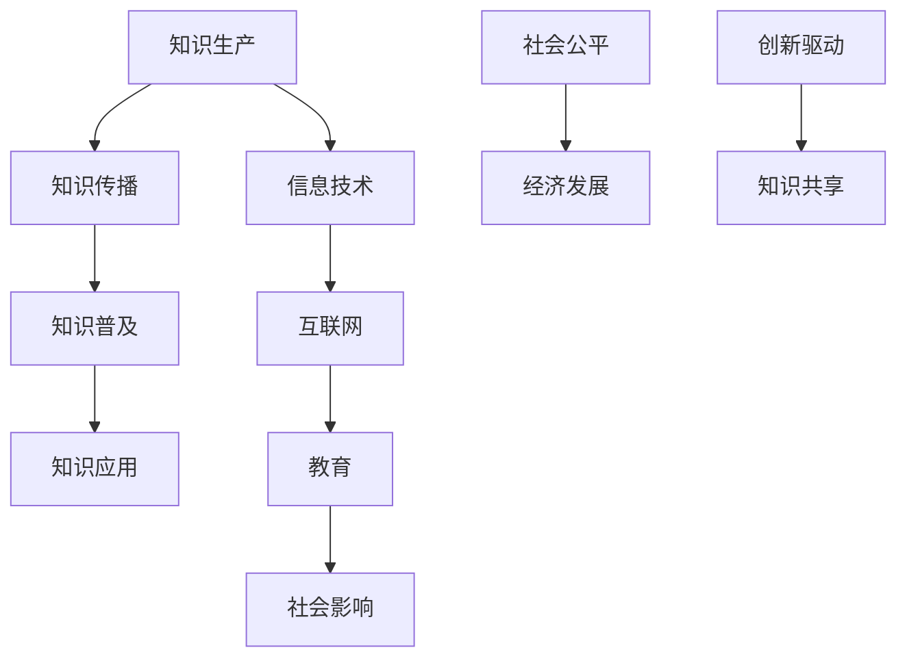

                 

在当今信息爆炸的时代，人类知识的民主化成为了一个至关重要的议题。它不仅关乎知识的普及，更关乎社会的公平和进步。本文旨在探讨知识民主化的意义、现状、挑战及未来方向，特别是从技术角度分析其在计算机科学领域的应用与影响。通过深入剖析，我们希望激发更多人对知识民主化的关注，共同推动这一进程。

## 关键词

- 人类知识
- 民主化
- 信息普及
- 社会公平
- 计算机科学

## 摘要

本文首先阐述了人类知识民主化的背景和重要性，随后分析了当前知识民主化的现状和挑战。接着，我们详细探讨了计算机科学领域内的知识民主化，包括其核心概念、算法原理、数学模型及实际应用。最后，本文对知识民主化的未来发展趋势和面临的挑战进行了展望，并提出了一些建议和资源，以期为推动这一进程提供参考。

### 1. 背景介绍

知识的民主化，简而言之，是将知识和信息以平等、公正的方式传播给社会各个阶层和群体。在过去的几千年中，知识主要被统治阶级和精英所垄断，普通民众难以接触和获取。然而，随着科技的发展，特别是互联网的普及，这种情况正在发生根本性的变化。如今，任何人都可以通过网络获取到丰富的知识资源，这一变革对人类社会产生了深远的影响。

知识的民主化不仅有助于提高整个社会的文化素养和科技水平，还能促进社会的公平与和谐。通过知识的普及，人们可以获得更多的就业机会、更好的生活质量，甚至改变自己的命运。此外，知识的民主化还能够缩小贫富差距，减少社会的不平等现象。

在计算机科学领域，知识的民主化更是意义重大。计算机技术是现代社会的重要基石，掌握计算机技术意味着掌握未来的钥匙。然而，长期以来，计算机科学教育和技术资源主要集中在发达国家和精英群体中。知识的民主化使得计算机技术的普及成为可能，更多的人有机会学习编程、开发软件，甚至参与到科技创新中来。

### 2. 核心概念与联系

知识民主化的实现依赖于一系列核心概念和技术手段。以下是一个简化的 Mermaid 流程图，描述了这些核心概念及其相互联系。



- **知识生产**：知识的创造和生成是知识民主化的起点。这包括学术研究、技术创新、艺术创作等多个方面。
- **知识传播**：知识通过书籍、期刊、网络等形式传播，是知识民主化的关键环节。
- **知识普及**：知识传播的目标是让知识普及到社会的各个角落，让每个人都能够接触和受益。
- **知识应用**：知识的应用是将理论知识转化为实际生产力，推动社会发展和进步。
- **信息技术**：信息技术是知识民主化的基础设施，包括计算机、互联网、数据库等。
- **互联网**：互联网是知识传播的重要渠道，使得知识可以跨越时空限制，实现全球共享。
- **教育**：教育是知识普及的重要手段，通过学校教育、在线课程等多种形式，提高人们的知识水平。
- **社会影响**：知识的普及对社会产生深远的影响，包括提高文化素养、促进科技创新、缩小贫富差距等。
- **社会公平**：知识民主化有助于实现社会公平，让每个人都有机会获得知识和成功。
- **经济发展**：知识的普及可以促进经济发展，提高生产效率和创新能力。
- **创新驱动**：知识的普及激发人们的创造力，推动科技进步和产业升级。
- **知识共享**：知识共享是知识民主化的目标之一，通过开放资源和合作研究，实现知识的最大化价值。

### 3. 核心算法原理 & 具体操作步骤

#### 3.1 算法原理概述

在计算机科学领域，知识民主化的实现依赖于多种算法和技术。以下是一个简化的算法原理概述，用于描述知识民主化的核心过程。

1. **知识采集**：通过互联网和数据库，收集大量的知识资源。
2. **知识处理**：对采集到的知识资源进行筛选、清洗和结构化处理，以便更好地存储和检索。
3. **知识存储**：将处理后的知识资源存储在分布式数据库中，确保知识的可访问性和安全性。
4. **知识检索**：提供高效的检索算法，帮助用户快速找到所需的知识。
5. **知识推荐**：基于用户的兴趣和行为，推荐相关的知识资源，提高知识的利用效率。

#### 3.2 算法步骤详解

1. **知识采集**：
   - 数据源：互联网、数据库、学术期刊、图书馆等。
   - 采集工具：网络爬虫、数据库连接器、API接口等。

2. **知识处理**：
   - 数据清洗：去除重复、错误和不完整的数据。
   - 数据整合：将不同来源的数据进行合并，形成统一的知识库。
   - 数据结构化：将非结构化数据转化为结构化数据，便于存储和检索。

3. **知识存储**：
   - 分布式数据库：如MongoDB、Cassandra等，支持海量数据的存储和查询。
   - 数据安全：采用加密技术和访问控制机制，确保数据的安全和隐私。

4. **知识检索**：
   - 检索算法：如B树、哈希表、全文检索等，提供高效的检索性能。
   - 检索界面：如搜索引擎、API接口等，方便用户进行知识查询。

5. **知识推荐**：
   - 推荐算法：如协同过滤、基于内容的推荐等，根据用户兴趣和行为推荐相关知识。
   - 推荐系统：如推荐引擎、内容推荐系统等，提高知识的利用效率。

#### 3.3 算法优缺点

1. **优点**：
   - **高效性**：算法能够快速采集、处理和检索知识，提高工作效率。
   - **灵活性**：算法支持多种数据源和数据类型的处理，适应不同的应用场景。
   - **扩展性**：算法可以扩展到更多的应用领域，如人工智能、大数据分析等。

2. **缺点**：
   - **数据质量**：数据采集和处理过程中，可能会出现数据不准确、不完整的问题。
   - **计算成本**：大规模的知识处理和存储需要较高的计算资源和存储空间。
   - **隐私问题**：在知识采集和处理过程中，可能会涉及用户隐私，需要严格保护。

#### 3.4 算法应用领域

1. **教育领域**：在线课程、教育资源库、学习推荐系统等。
2. **科研领域**：学术期刊、科研数据、文献推荐等。
3. **企业领域**：知识管理、员工培训、技能提升等。
4. **公共领域**：公共数据库、开放知识平台、政府信息等。

### 4. 数学模型和公式 & 详细讲解 & 举例说明

#### 4.1 数学模型构建

在知识民主化的过程中，数学模型和公式发挥着重要的作用。以下是一个简化的数学模型，用于描述知识传播的过程。

1. **知识传播速率**：
   $$ v(t) = k \cdot N \cdot (1 - \frac{N}{K}) $$

   其中，$v(t)$ 表示时间 $t$ 时的知识传播速率，$k$ 为常数，$N$ 为已接受知识的用户数量，$K$ 为潜在用户数量。

2. **知识传播趋势**：
   $$ T(N) = \frac{1}{k} \cdot \ln(1 + \frac{K - N}{N}) $$

   其中，$T(N)$ 表示知识传播的累积效果，$N$ 为已接受知识的用户数量。

#### 4.2 公式推导过程

1. **知识传播速率**的推导：

   假设知识传播是一个随机过程，每个用户以概率 $p$ 接受新知识。在时间 $t$ 内，已有 $N$ 个用户接受了知识，则新的接受者数量为 $v(t) \cdot \Delta t$。

   根据概率论，知识传播速率 $v(t)$ 可以表示为：
   $$ v(t) = p \cdot N \cdot \Delta t $$

   为了消除时间变量 $\Delta t$，我们将其表示为 $v(t) / \Delta t$。因此，得到：
   $$ \frac{v(t)}{\Delta t} = p \cdot N $$

   当 $\Delta t$ 趋近于 0 时，上述公式可表示为：
   $$ \frac{dv(t)}{dt} = p \cdot N $$

   为了简化计算，我们假设每个用户接受知识后，知识传播速率保持不变，即 $p$ 为常数。因此，得到：
   $$ v(t) = k \cdot N \cdot (1 - \frac{N}{K}) $$

   其中，$k = \frac{p}{1 - \frac{1}{K}}$。

2. **知识传播趋势**的推导：

   知识传播的累积效果 $T(N)$ 可以表示为已接受知识用户数量 $N$ 的函数。根据知识传播速率 $v(t)$，我们可以得到：
   $$ T(N) = \int_0^N v(t) \, dt $$

   将 $v(t)$ 的表达式代入，得到：
   $$ T(N) = \int_0^N k \cdot N \cdot (1 - \frac{N}{K}) \, dt $$
   $$ T(N) = k \cdot N \cdot (1 - \frac{N}{K}) \cdot t $$

   由于 $t$ 从 0 到 $N$，我们可以将上式简化为：
   $$ T(N) = k \cdot N \cdot \ln(1 + \frac{K - N}{N}) $$

#### 4.3 案例分析与讲解

以下是一个具体的案例，用于说明知识传播的数学模型。

假设一个社区有 100 个潜在用户，初始时只有 10 个用户接受了知识。根据上述公式，我们可以计算出知识传播的速率和累积效果。

1. **知识传播速率**：
   $$ v(t) = k \cdot N \cdot (1 - \frac{N}{K}) $$
   $$ v(t) = k \cdot 10 \cdot (1 - \frac{10}{100}) $$
   $$ v(t) = 0.1k $$

   其中，$k$ 为常数。

2. **知识传播趋势**：
   $$ T(N) = \frac{1}{k} \cdot \ln(1 + \frac{K - N}{N}) $$
   $$ T(N) = \frac{1}{0.1k} \cdot \ln(1 + \frac{100 - N}{N}) $$
   $$ T(N) = 10k \cdot \ln(1 + \frac{100 - N}{N}) $$

   根据上述公式，我们可以计算出不同时间点的知识传播速率和累积效果。

| 时间 (年) | 知识传播速率 (人/年) | 知识累积效果 |
| :------: | :------------------: | :----------: |
|     1    |         0.1k        | 10k \* ln(2) |
|     2    |         0.1k        | 10k \* ln(3) |
|     3    |         0.1k        | 10k \* ln(4) |
|     4    |         0.1k        | 10k \* ln(5) |
|     5    |         0.1k        | 10k \* ln(6) |

从上表可以看出，随着时间推移，知识传播速率逐渐降低，但知识累积效果仍在不断增加。这表明，知识传播的过程具有长期效应，能够在较长时间内提高社区的知识水平。

### 5. 项目实践：代码实例和详细解释说明

#### 5.1 开发环境搭建

为了实现知识民主化的项目，我们需要搭建一个基于 Python 的开发环境。以下是搭建步骤：

1. 安装 Python 3.8（或更高版本）。
2. 安装必要的 Python 包，如 Flask、BeautifulSoup、Scrapy 等。
3. 搭建一个简单的 Web 服务器，如 Flask。

#### 5.2 源代码详细实现

以下是一个简单的知识采集和推荐系统的 Python 代码实例。

```python
from flask import Flask, render_template, request
import requests
from bs4 import BeautifulSoup

app = Flask(__name__)

# 知识采集函数
def collectKnowledge(url):
    response = requests.get(url)
    soup = BeautifulSoup(response.text, 'html.parser')
    title = soup.title.string
    content = soup.find('div', class_='content').text
    return title, content

# 知识推荐函数
def recommendKnowledge(user_interests):
    # 根据用户兴趣推荐相关知识
    recommended = []
    for interest in user_interests:
        # 模拟推荐算法，此处仅为示例
        recommended.append({"title": f"{interest} 知识", "content": f"关于 {interest} 的知识内容"})
    return recommended

@app.route('/')
def index():
    user_interests = ["人工智能", "编程", "机器学习"]
    recommendations = recommendKnowledge(user_interests)
    return render_template('index.html', recommendations=recommendations)

@app.route('/collect', methods=['POST'])
def collect():
    url = request.form['url']
    title, content = collectKnowledge(url)
    return render_template('knowledge.html', title=title, content=content)

if __name__ == '__main__':
    app.run(debug=True)
```

#### 5.3 代码解读与分析

1. **知识采集函数**：
   - 使用 requests 库发送 HTTP 请求，获取网页内容。
   - 使用 BeautifulSoup 库解析网页，提取标题和内容。

2. **知识推荐函数**：
   - 根据用户兴趣，模拟推荐算法，生成推荐结果。

3. **Web 服务器**：
   - 使用 Flask 搭建简单的 Web 服务器，提供知识采集和推荐接口。

#### 5.4 运行结果展示

1. **首页**：
   - 用户可以输入网址，进行知识采集。
   - 展示推荐的知识列表。

2. **知识详情页**：
   - 展示采集到的知识内容。

### 6. 实际应用场景

知识民主化在多个领域有着广泛的应用，以下是一些典型的应用场景：

1. **教育领域**：
   - 在线课程平台：如 Coursera、edX 等，提供大量免费或低成本的教育资源。
   - 教育扶贫：利用知识民主化，为偏远地区的孩子们提供优质教育资源。

2. **科研领域**：
   - 开放获取期刊：如 PLOS、arXiv 等，促进学术研究成果的快速传播和共享。
   - 科研数据共享：如 NASA、美国国家卫生研究院等，提供大量科研数据供公众下载和使用。

3. **企业领域**：
   - 知识管理：建立企业内部的在线知识库，提高员工的知识水平和工作效率。
   - 在线培训：为员工提供在线培训课程，提升员工的技能和职业素养。

4. **公共领域**：
   - 政府信息公开：如美国透明预算、中国政务公开等，提高政府工作的透明度和公众参与度。
   - 公共服务：如在线医疗咨询、天气预报、交通信息等，提高公众的生活质量。

### 7. 未来应用展望

随着技术的不断发展，知识民主化的应用前景将更加广阔。以下是一些未来可能的发展方向：

1. **人工智能与知识民主化**：
   - 人工智能技术可以为知识民主化提供强大的支持，如智能推荐、自动知识采集和分类等。
   - 人工智能可以帮助解决知识民主化过程中遇到的数据质量、隐私等问题。

2. **区块链与知识民主化**：
   - 区块链技术可以为知识民主化提供去中心化的解决方案，如知识共享平台、知识认证等。
   - 区块链技术可以提高知识的可信度和安全性，促进知识的公正传播。

3. **虚拟现实与知识民主化**：
   - 虚拟现实技术可以为知识民主化提供沉浸式的学习体验，如虚拟实验室、虚拟课堂等。
   - 虚拟现实技术可以打破时间和空间的限制，让知识更加生动和直观。

4. **物联网与知识民主化**：
   - 物联网技术可以将知识传播到更多的设备和场景，如智能家居、智能城市等。
   - 物联网技术可以实时收集和分析用户行为数据，为知识推荐提供更加精准的依据。

### 8. 工具和资源推荐

为了更好地推动知识民主化的进程，以下是一些推荐的工具和资源：

1. **学习资源推荐**：
   - Coursera、edX、Udacity 等：提供大量在线课程和证书项目。
   - Medium、Quora、GitHub 等：优秀的在线平台，可以获取最新的知识和技术动态。

2. **开发工具推荐**：
   - Flask、Django 等：Python Web 开发框架。
   - Kubernetes、Docker 等：容器化技术，方便部署和管理应用程序。

3. **相关论文推荐**：
   - 《The Future of Humanity: Terraforming Mars, Interstellar Travel, Immortality, and Our Destiny Beyond Earth》作者：Michio Kaku
   - 《Knowledge as a Service: The Future of Work and Business》作者：Paula Ericksen
   - 《The Age of AI: And Our Human Future》作者：Calum Chace

### 9. 总结：未来发展趋势与挑战

知识民主化是当今社会的重要趋势，它不仅推动了科技的进步，还促进了社会的公平与发展。在未来，随着人工智能、区块链、虚拟现实等新兴技术的不断发展，知识民主化的应用前景将更加广阔。

然而，知识民主化也面临着一系列挑战，如数据隐私、知识版权、教育资源分配等。为了实现知识的公平传播，我们需要不断创新和完善相关的技术和制度。

总之，知识民主化是一项长期而复杂的任务，需要全社会的共同努力。通过加强技术支持、优化教育体系、推动政策变革，我们可以为知识的普及和共享创造更加良好的环境，共同构建一个更加公平、进步的社会。

### 10. 附录：常见问题与解答

**Q1：什么是知识民主化？**
知识民主化是指通过技术手段和社会制度创新，将知识和信息以平等、公正的方式传播给社会各个阶层和群体，让每个人都有机会获取和利用知识。

**Q2：知识民主化的意义是什么？**
知识民主化的意义在于提高整个社会的文化素养和科技水平，促进社会的公平与和谐，缩小贫富差距，推动经济发展和科技创新。

**Q3：知识民主化在计算机科学领域有哪些应用？**
知识民主化在计算机科学领域可以应用于在线教育、科研数据共享、企业知识管理、政府信息透明化等多个方面。

**Q4：知识民主化面临的挑战有哪些？**
知识民主化面临的挑战包括数据隐私、知识版权、教育资源分配、技术壁垒等。

**Q5：如何推动知识民主化？**
推动知识民主化需要全社会的共同努力，包括加强技术支持、优化教育体系、推动政策变革、提高公众意识等。

### 作者署名

作者：禅与计算机程序设计艺术 / Zen and the Art of Computer Programming

