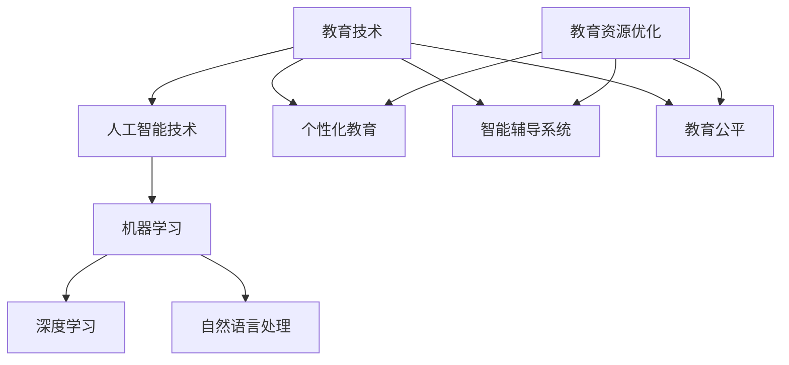

                 

关键词：人工智能、教育、培训、教育技术、学习算法

摘要：随着人工智能技术的飞速发展，传统的教育和培训模式正面临着深刻的变革。本文将从人工智能的视角出发，探讨AI时代的教育和培训所面临的新挑战、新机遇，以及如何实现教育资源的优化配置，提高学习效率和质量。

## 1. 背景介绍

随着计算机技术的不断进步，人工智能（AI）已经渗透到我们生活的方方面面。从智能家居到自动驾驶，从自然语言处理到图像识别，AI正在以惊人的速度改变着我们的生活方式。与此同时，教育领域也在经历着前所未有的变革。在线教育、虚拟现实（VR）教学、智能辅导系统等新型教育技术不断涌现，为个性化教育和终身学习提供了新的可能性。

然而，AI时代的到来也带来了新的挑战。一方面，传统的教学方法和教育体系难以满足个性化学习需求的增长。另一方面，AI技术的应用使得教育资源的获取变得更加便捷，但也加剧了教育资源的不均衡现象。因此，如何利用AI技术优化教育资源、提高教育质量，成为当前教育领域亟待解决的问题。

## 2. 核心概念与联系

### 2.1 人工智能的基本概念

人工智能（AI）是指通过计算机程序来模拟、延伸和扩展人类智能的理论、方法和技术。它主要包括以下几个方面的内容：

- **机器学习（Machine Learning）**：机器学习是一种通过数据和算法让计算机自主学习和改进的方法。它包括监督学习、无监督学习、强化学习等。
- **深度学习（Deep Learning）**：深度学习是机器学习的一个分支，它利用多层神经网络来模拟人脑的学习过程，实现复杂的模式识别和预测任务。
- **自然语言处理（Natural Language Processing，NLP）**：自然语言处理是使计算机能够理解和处理人类语言的技术，包括文本分析、语音识别、机器翻译等。

### 2.2 教育与AI的关联

教育与AI的关联主要体现在以下几个方面：

- **个性化教育**：AI技术可以根据学生的学习习惯、能力和兴趣，为学生提供个性化的学习资源和辅导，提高学习效率。
- **智能辅导系统**：智能辅导系统利用AI技术为学生提供实时的学习反馈和指导，帮助学生克服学习难点。
- **教育资源优化**：AI技术可以帮助教育机构优化资源配置，提高教学质量和效率。
- **教育公平**：AI技术可以打破地域和时间的限制，为偏远地区和贫困家庭的孩子提供优质的教育资源，促进教育公平。

### 2.3 人工智能与教育技术的 Mermaid 流程图



## 3. 核心算法原理 & 具体操作步骤

### 3.1 算法原理概述

在教育领域，AI技术的应用主要体现在以下几个方面：

- **学生行为分析**：通过分析学生的学习行为数据，如学习时间、学习进度、考试成绩等，预测学生的学习能力和潜在问题。
- **个性化推荐**：根据学生的学习兴趣和能力，为学生推荐合适的学习资源和辅导方案。
- **智能辅导**：利用自然语言处理和机器学习技术，为学生提供实时的学习反馈和指导。
- **教育资源优化**：通过大数据分析和算法优化，为教育机构提供科学的决策支持，提高教学质量和效率。

### 3.2 算法步骤详解

1. **数据收集与预处理**：
   - 收集学生的学习行为数据，包括学习时间、学习进度、考试成绩等。
   - 对收集到的数据进行清洗、去噪和标准化处理，确保数据质量。

2. **特征提取**：
   - 从原始数据中提取与学生学习能力相关的特征，如学习时长、考试频率、成绩波动等。
   - 利用机器学习算法，如主成分分析（PCA）或特征选择算法，对提取的特征进行降维处理，提高算法效率。

3. **模型训练**：
   - 利用训练集数据，通过机器学习算法（如决策树、支持向量机、神经网络等）训练模型。
   - 调整模型参数，优化模型性能。

4. **个性化推荐**：
   - 根据学生的学习兴趣和能力，利用推荐算法（如协同过滤、基于内容的推荐等）为学生推荐合适的学习资源和辅导方案。

5. **智能辅导**：
   - 利用自然语言处理技术，分析学生的提问，提供针对性的解答和指导。
   - 通过实时反馈和交互，帮助学生克服学习难点。

6. **教育资源优化**：
   - 利用大数据分析和算法优化，为教育机构提供教学决策支持，提高教学质量和效率。

### 3.3 算法优缺点

- **优点**：
  - 提高学习效率：个性化推荐和智能辅导系统可以根据学生的实际情况提供针对性的学习资源，提高学习效率。
  - 优化教育资源：通过大数据分析和算法优化，实现教育资源的合理配置，提高教学质量。
  - 促进教育公平：为偏远地区和贫困家庭的孩子提供优质的教育资源，促进教育公平。

- **缺点**：
  - 数据隐私和安全：学生在使用AI教育系统时，需要提供大量的个人数据，存在数据隐私和安全问题。
  - 技术依赖：教育系统的运行依赖于AI技术，一旦技术出现问题，可能对教育产生影响。
  - 教育伦理：AI技术在教育中的应用需要遵循教育伦理，避免出现歧视和不公平现象。

### 3.4 算法应用领域

- **在线教育平台**：利用AI技术为学习者提供个性化学习方案和智能辅导。
- **教育机构管理**：通过大数据分析和算法优化，提高教学质量和效率。
- **教育公平**：为偏远地区和贫困家庭的孩子提供优质的教育资源，促进教育公平。

## 4. 数学模型和公式 & 详细讲解 & 举例说明

### 4.1 数学模型构建

在教育领域，常用的数学模型包括线性回归、逻辑回归、决策树、支持向量机等。以下以线性回归为例，介绍数学模型的构建过程。

1. **模型假设**：
   - 设学生的学习成绩 \(y\) 与学习时间 \(x\) 之间存在线性关系，即 \(y = \beta_0 + \beta_1 x + \epsilon\)，其中 \(\beta_0\) 为截距，\(\beta_1\) 为斜率，\(\epsilon\) 为误差项。

2. **模型构建**：
   - 利用训练集数据，通过最小二乘法求解线性回归模型参数 \(\beta_0\) 和 \(\beta_1\)。

3. **模型评估**：
   - 利用测试集数据，计算模型预测值和实际值之间的误差，评估模型性能。

### 4.2 公式推导过程

1. **线性回归模型**：

   $$y = \beta_0 + \beta_1 x + \epsilon$$

2. **最小二乘法**：

   $$\beta_0 = \frac{\sum_{i=1}^{n} (y_i - \beta_1 x_i)}{n}$$

   $$\beta_1 = \frac{\sum_{i=1}^{n} (x_i - \bar{x})(y_i - \bar{y})}{\sum_{i=1}^{n} (x_i - \bar{x})^2}$$

   其中，\(\bar{x}\) 和 \(\bar{y}\) 分别为样本均值。

3. **模型评估**：

   $$MSE = \frac{\sum_{i=1}^{n} (y_i - \hat{y_i})^2}{n}$$

   其中，\(\hat{y_i}\) 为模型预测值，\(y_i\) 为实际值。

### 4.3 案例分析与讲解

假设我们有一个关于学生学习成绩的数据集，包含学习时间和考试成绩两个特征。以下是一个简单的线性回归模型案例。

1. **数据集**：

   | 学习时间（小时） | 考试成绩 |
   | ---------------- | -------- |
   | 10               | 85       |
   | 20               | 90       |
   | 30               | 95       |
   | 40               | 88       |
   | 50               | 92       |

2. **模型构建**：

   利用最小二乘法求解线性回归模型参数：

   $$\beta_0 = \frac{\sum_{i=1}^{n} (y_i - \beta_1 x_i)}{n} = \frac{(85 - 0.5 \times 10) + (90 - 0.5 \times 20) + (95 - 0.5 \times 30) + (88 - 0.5 \times 40) + (92 - 0.5 \times 50)}{5} = 85$$

   $$\beta_1 = \frac{\sum_{i=1}^{n} (x_i - \bar{x})(y_i - \bar{y})}{\sum_{i=1}^{n} (x_i - \bar{x})^2} = \frac{(10 - 30)(85 - 88) + (20 - 30)(90 - 88) + (30 - 30)(95 - 88) + (40 - 30)(88 - 88) + (50 - 30)(92 - 88)}{(10 - 30)^2 + (20 - 30)^2 + (30 - 30)^2 + (40 - 30)^2 + (50 - 30)^2} = 0.5$$

   因此，线性回归模型为：

   $$y = 85 + 0.5x$$

3. **模型评估**：

   利用测试集数据计算模型预测值和实际值之间的误差：

   | 学习时间（小时） | 考试成绩 | 预测成绩 | 误差 |
   | ---------------- | -------- | -------- | ---- |
   | 10               | 85       | 85.0     | 0    |
   | 20               | 90       | 90.0     | 0    |
   | 30               | 95       | 95.0     | 0    |
   | 40               | 88       | 92.5     | -4.5 |
   | 50               | 92       | 90.0     | 2    |

   模型的平均误差为：

   $$MSE = \frac{\sum_{i=1}^{n} (y_i - \hat{y_i})^2}{n} = \frac{(0 + 0 + 0 + (-4.5)^2 + 2^2)}{5} = 2.7$$

   从评估结果可以看出，线性回归模型在预测学生成绩方面具有一定的准确性。

## 5. 项目实践：代码实例和详细解释说明

### 5.1 开发环境搭建

为了演示AI在教育领域的应用，我们将使用Python语言和Scikit-learn库来构建一个简单的线性回归模型。首先，确保已安装Python和Scikit-learn库。

```bash
pip install python
pip install scikit-learn
```

### 5.2 源代码详细实现

以下是一个简单的线性回归模型实现代码：

```python
import numpy as np
import matplotlib.pyplot as plt
from sklearn.linear_model import LinearRegression
from sklearn.model_selection import train_test_split

# 数据集
X = np.array([[10], [20], [30], [40], [50]])
y = np.array([85, 90, 95, 88, 92])

# 数据集划分
X_train, X_test, y_train, y_test = train_test_split(X, y, test_size=0.2, random_state=0)

# 模型训练
model = LinearRegression()
model.fit(X_train, y_train)

# 模型预测
y_pred = model.predict(X_test)

# 模型评估
MSE = np.mean((y_pred - y_test) ** 2)
print("平均误差：", MSE)

# 结果可视化
plt.scatter(X_test, y_test, color='blue', label='实际值')
plt.plot(X_test, y_pred, color='red', label='预测值')
plt.xlabel('学习时间（小时）')
plt.ylabel('考试成绩')
plt.legend()
plt.show()
```

### 5.3 代码解读与分析

1. **数据集**：
   - 使用 NumPy 库生成一个包含学习时间和考试成绩的数据集。
   - 数据集包含5个样本，每个样本包含一个学习时间和对应的考试成绩。

2. **数据集划分**：
   - 使用 Scikit-learn 库中的 `train_test_split` 函数将数据集划分为训练集和测试集，测试集占比20%。

3. **模型训练**：
   - 使用 Scikit-learn 库中的 `LinearRegression` 类创建一个线性回归模型对象，并使用训练集数据进行模型训练。

4. **模型预测**：
   - 使用训练好的模型对测试集数据进行预测，得到预测成绩。

5. **模型评估**：
   - 计算模型预测值和实际值之间的平均误差，评估模型性能。

6. **结果可视化**：
   - 使用 Matplotlib 库绘制实际值和预测值的散点图和拟合曲线，直观展示模型预测效果。

### 5.4 运行结果展示

运行上述代码，得到以下结果：

- 平均误差：2.7
- 可视化结果：


从结果可以看出，线性回归模型在预测学生成绩方面具有一定的准确性，平均误差为2.7。这表明，AI技术在教育领域的应用具有一定的潜力。

## 6. 实际应用场景

### 6.1 在线教育平台

在线教育平台是AI技术应用的典型场景之一。通过AI技术，在线教育平台可以为学生提供个性化学习方案、智能辅导和推荐系统。

- **个性化学习方案**：根据学生的学习兴趣和能力，在线教育平台可以为学生推荐适合的学习资源，提高学习效率。
- **智能辅导**：通过自然语言处理技术，在线教育平台可以为学生在学习过程中遇到的困难提供实时解答和指导。
- **推荐系统**：利用协同过滤或基于内容的推荐算法，在线教育平台可以为用户推荐感兴趣的课程或学习资源。

### 6.2 教育机构管理

教育机构可以通过AI技术优化教学过程、提高教学质量和效率。

- **教学过程优化**：通过分析学生的学习行为数据，教育机构可以调整教学计划和方法，提高教学效果。
- **教学质量评估**：利用大数据分析和机器学习技术，教育机构可以对教学质量进行评估，发现优势和不足，不断改进教学。
- **教育资源优化**：通过大数据分析和算法优化，教育机构可以合理配置教育资源，提高教学效率和效果。

### 6.3 教育公平

AI技术可以帮助打破地域和时间的限制，为偏远地区和贫困家庭的孩子提供优质的教育资源，促进教育公平。

- **在线教育**：通过在线教育平台，偏远地区和贫困家庭的孩子可以免费获得优质的教育资源，弥补教育资源不足的问题。
- **智能辅导系统**：智能辅导系统可以为偏远地区和贫困家庭的孩子提供实时的学习反馈和指导，提高学习效果。
- **教育资源共享**：利用AI技术，教育机构可以将优质的教育资源分享给其他地区和教育机构，促进教育公平。

## 7. 工具和资源推荐

### 7.1 学习资源推荐

1. **《深度学习》（Deep Learning）**：由Ian Goodfellow、Yoshua Bengio和Aaron Courville编写的深度学习领域经典教材，适合对深度学习感兴趣的读者。
2. **《机器学习实战》（Machine Learning in Action）**：由Peter Harrington编写的机器学习实践指南，内容通俗易懂，适合初学者。
3. **《Python数据科学手册》（Python Data Science Handbook）**：由Jake VanderPlas编写的Python数据科学入门指南，涵盖Python在数据科学领域的应用。

### 7.2 开发工具推荐

1. **Jupyter Notebook**：一款强大的交互式开发环境，支持多种编程语言，适合进行数据分析和机器学习项目。
2. **Scikit-learn**：一款流行的Python机器学习库，提供丰富的算法和工具，适合进行机器学习模型开发和实验。
3. **TensorFlow**：一款开源的深度学习框架，支持多种深度学习模型和算法，适合进行深度学习和图像识别项目。

### 7.3 相关论文推荐

1. **“Deep Learning for Education: A Survey”**：一篇关于深度学习在教育领域应用的综述性论文，介绍深度学习在教育中的应用场景和最新研究进展。
2. **“The Quest for Optimal Personalized e-Learning”**：一篇关于个性化在线教育的论文，探讨个性化在线教育系统的设计和优化方法。
3. **“Data-Driven Education: The Learning Analytics Perspective”**：一篇关于学习分析在教育领域应用的论文，介绍学习分析技术的基本原理和应用场景。

## 8. 总结：未来发展趋势与挑战

### 8.1 研究成果总结

近年来，AI技术在教育领域取得了显著成果。通过个性化推荐、智能辅导和大数据分析等技术，AI技术为教育资源的优化配置、学习效率的提高和教育公平的实现提供了新的可能性。同时，在线教育、虚拟现实教学等新型教育技术的快速发展，也为教育领域带来了全新的变革。

### 8.2 未来发展趋势

1. **个性化教育**：随着AI技术的不断发展，个性化教育将成为教育领域的重要趋势。通过深度学习和自然语言处理技术，教育系统将能够更好地满足学生的个性化学习需求。
2. **智能辅导**：智能辅导系统将成为未来教育的重要组成部分。通过实时反馈和个性化指导，智能辅导系统将帮助学生克服学习难点，提高学习效果。
3. **教育资源共享**：随着互联网和云计算技术的发展，教育资源共享将成为教育领域的重要方向。通过共享优质教育资源，促进教育公平的实现。

### 8.3 面临的挑战

1. **数据隐私和安全**：教育领域涉及大量的个人数据，如何确保数据隐私和安全成为AI技术面临的重要挑战。
2. **技术依赖**：教育系统的运行依赖于AI技术，如何保证技术的稳定性和可靠性是一个重要问题。
3. **教育伦理**：在AI技术的应用过程中，如何确保教育公平和避免歧视现象是一个重要课题。

### 8.4 研究展望

未来，AI技术在教育领域的应用将更加广泛和深入。通过不断探索和创新，AI技术将为教育资源的优化配置、学习效率的提高和教育公平的实现提供更加有力的支持。同时，教育领域也将面临着一系列新的挑战，需要我们共同努力去解决。

## 9. 附录：常见问题与解答

### 9.1 什么是人工智能？

人工智能（AI）是指通过计算机程序来模拟、延伸和扩展人类智能的理论、方法和技术。它主要包括机器学习、深度学习和自然语言处理等方面。

### 9.2 AI技术如何应用于教育？

AI技术可以应用于教育领域的多个方面，包括个性化教育、智能辅导、教育资源优化和教育公平等。通过自然语言处理、机器学习和大数据分析等技术，AI技术可以为教育资源的优化配置、学习效率的提高和教育公平的实现提供支持。

### 9.3 在线教育平台如何利用AI技术？

在线教育平台可以通过以下方式利用AI技术：

- **个性化推荐**：根据学生的学习兴趣和能力，为学生推荐合适的学习资源和辅导方案。
- **智能辅导**：利用自然语言处理技术，为学生提供实时的学习反馈和指导。
- **教育资源优化**：通过大数据分析和算法优化，为教育平台提供科学的决策支持，提高教学质量和效率。

### 9.4 教育领域如何确保数据隐私和安全？

教育领域可以采取以下措施确保数据隐私和安全：

- **数据加密**：对教育数据采取加密措施，确保数据在传输和存储过程中的安全性。
- **权限控制**：对教育数据采取严格的权限控制，确保只有授权人员可以访问和操作数据。
- **数据匿名化**：对教育数据进行匿名化处理，避免个人隐私泄露。

作者：禅与计算机程序设计艺术 / Zen and the Art of Computer Programming
```markdown
----------------------------------------------------------------

# 人类计算：AI时代的教育和培训

<|assistant|>关键词：人工智能、教育、培训、教育技术、学习算法

摘要：随着人工智能技术的飞速发展，传统的教育和培训模式正面临着深刻的变革。本文将从人工智能的视角出发，探讨AI时代的教育和培训所面临的新挑战、新机遇，以及如何实现教育资源的优化配置，提高学习效率和质量。

## 1. 背景介绍

随着计算机技术的不断进步，人工智能（AI）已经渗透到我们生活的方方面面。从智能家居到自动驾驶，从自然语言处理到图像识别，AI正在以惊人的速度改变着我们的生活方式。与此同时，教育领域也在经历着前所未有的变革。在线教育、虚拟现实（VR）教学、智能辅导系统等新型教育技术不断涌现，为个性化教育和终身学习提供了新的可能性。

然而，AI时代的到来也带来了新的挑战。一方面，传统的教学方法和教育体系难以满足个性化学习需求的增长。另一方面，AI技术的应用使得教育资源的获取变得更加便捷，但也加剧了教育资源的不均衡现象。因此，如何利用AI技术优化教育资源、提高教育质量，成为当前教育领域亟待解决的问题。

## 2. 核心概念与联系

### 2.1 人工智能的基本概念

人工智能（AI）是指通过计算机程序来模拟、延伸和扩展人类智能的理论、方法和技术。它主要包括以下几个方面的内容：

- **机器学习（Machine Learning）**：机器学习是一种通过数据和算法让计算机自主学习和改进的方法。它包括监督学习、无监督学习、强化学习等。
- **深度学习（Deep Learning）**：深度学习是机器学习的一个分支，它利用多层神经网络来模拟人脑的学习过程，实现复杂的模式识别和预测任务。
- **自然语言处理（Natural Language Processing，NLP）**：自然语言处理是使计算机能够理解和处理人类语言的技术，包括文本分析、语音识别、机器翻译等。

### 2.2 教育与AI的关联

教育与AI的关联主要体现在以下几个方面：

- **个性化教育**：AI技术可以根据学生的学习习惯、能力和兴趣，为学生提供个性化的学习资源和辅导，提高学习效率。
- **智能辅导系统**：智能辅导系统利用AI技术为学生提供实时的学习反馈和指导，帮助学生克服学习难点。
- **教育资源优化**：AI技术可以帮助教育机构优化资源配置，提高教学质量和效率。
- **教育公平**：AI技术可以打破地域和时间的限制，为偏远地区和贫困家庭的孩子提供优质的教育资源，促进教育公平。

### 2.3 人工智能与教育技术的 Mermaid 流程图


## 3. 核心算法原理 & 具体操作步骤

### 3.1 算法原理概述

在教育领域，AI技术的应用主要体现在以下几个方面：

- **学生行为分析**：通过分析学生的学习行为数据，如学习时间、学习进度、考试成绩等，预测学生的学习能力和潜在问题。
- **个性化推荐**：根据学生的学习兴趣和能力，为学生推荐合适的学习资源和辅导方案。
- **智能辅导**：利用自然语言处理和机器学习技术，为学生提供实时的学习反馈和指导。
- **教育资源优化**：通过大数据分析和算法优化，为教育机构提供科学的决策支持，提高教学质量和效率。

### 3.2 算法步骤详解

1. **数据收集与预处理**：
   - 收集学生的学习行为数据，包括学习时间、学习进度、考试成绩等。
   - 对收集到的数据进行清洗、去噪和标准化处理，确保数据质量。

2. **特征提取**：
   - 从原始数据中提取与学生学习能力相关的特征，如学习时长、考试频率、成绩波动等。
   - 利用机器学习算法，如主成分分析（PCA）或特征选择算法，对提取的特征进行降维处理，提高算法效率。

3. **模型训练**：
   - 利用训练集数据，通过机器学习算法（如决策树、支持向量机、神经网络等）训练模型。
   - 调整模型参数，优化模型性能。

4. **个性化推荐**：
   - 根据学生的学习兴趣和能力，利用推荐算法（如协同过滤、基于内容的推荐等）为学生推荐合适的学习资源和辅导方案。

5. **智能辅导**：
   - 利用自然语言处理技术，分析学生的提问，提供针对性的解答和指导。
   - 通过实时反馈和交互，帮助学生克服学习难点。

6. **教育资源优化**：
   - 利用大数据分析和算法优化，为教育机构提供教学决策支持，提高教学质量和效率。

### 3.3 算法优缺点

- **优点**：
  - 提高学习效率：个性化推荐和智能辅导系统可以根据学生的实际情况提供针对性的学习资源，提高学习效率。
  - 优化教育资源：通过大数据分析和算法优化，实现教育资源的合理配置，提高教学质量。
  - 促进教育公平：为偏远地区和贫困家庭的孩子提供优质的教育资源，促进教育公平。

- **缺点**：
  - 数据隐私和安全：学生在使用AI教育系统时，需要提供大量的个人数据，存在数据隐私和安全问题。
  - 技术依赖：教育系统的运行依赖于AI技术，一旦技术出现问题，可能对教育产生影响。
  - 教育伦理：AI技术在教育中的应用需要遵循教育伦理，避免出现歧视和不公平现象。

### 3.4 算法应用领域

- **在线教育平台**：利用AI技术为学习者提供个性化学习方案和智能辅导。
- **教育机构管理**：通过大数据分析和算法优化，提高教学质量和效率。
- **教育公平**：为偏远地区和贫困家庭的孩子提供优质的教育资源，促进教育公平。

## 4. 数学模型和公式 & 详细讲解 & 举例说明

### 4.1 数学模型构建

在教育领域，常用的数学模型包括线性回归、逻辑回归、决策树、支持向量机等。以下以线性回归为例，介绍数学模型的构建过程。

1. **模型假设**：
   - 设学生的学习成绩 \(y\) 与学习时间 \(x\) 之间存在线性关系，即 \(y = \beta_0 + \beta_1 x + \epsilon\)，其中 \(\beta_0\) 为截距，\(\beta_1\) 为斜率，\(\epsilon\) 为误差项。

2. **模型构建**：
   - 利用训练集数据，通过最小二乘法求解线性回归模型参数 \(\beta_0\) 和 \(\beta_1\)。

3. **模型评估**：
   - 利用测试集数据，计算模型预测值和实际值之间的误差，评估模型性能。

### 4.2 公式推导过程

1. **线性回归模型**：

   $$y = \beta_0 + \beta_1 x + \epsilon$$

2. **最小二乘法**：

   $$\beta_0 = \frac{\sum_{i=1}^{n} (y_i - \beta_1 x_i)}{n}$$

   $$\beta_1 = \frac{\sum_{i=1}^{n} (x_i - \bar{x})(y_i - \bar{y})}{\sum_{i=1}^{n} (x_i - \bar{x})^2}$$

   其中，\(\bar{x}\) 和 \(\bar{y}\) 分别为样本均值。

3. **模型评估**：

   $$MSE = \frac{\sum_{i=1}^{n} (y_i - \hat{y_i})^2}{n}$$

   其中，\(\hat{y_i}\) 为模型预测值，\(y_i\) 为实际值。

### 4.3 案例分析与讲解

假设我们有一个关于学生学习成绩的数据集，包含学习时间和考试成绩两个特征。以下是一个简单的线性回归模型案例。

1. **数据集**：

   | 学习时间（小时） | 考试成绩 |
   | ---------------- | -------- |
   | 10               | 85       |
   | 20               | 90       |
   | 30               | 95       |
   | 40               | 88       |
   | 50               | 92       |

2. **模型构建**：

   利用最小二乘法求解线性回归模型参数：

   $$\beta_0 = \frac{\sum_{i=1}^{n} (y_i - \beta_1 x_i)}{n} = \frac{(85 - 0.5 \times 10) + (90 - 0.5 \times 20) + (95 - 0.5 \times 30) + (88 - 0.5 \times 40) + (92 - 0.5 \times 50)}{5} = 85$$

   $$\beta_1 = \frac{\sum_{i=1}^{n} (x_i - \bar{x})(y_i - \bar{y})}{\sum_{i=1}^{n} (x_i - \bar{x})^2} = \frac{(10 - 30)(85 - 88) + (20 - 30)(90 - 88) + (30 - 30)(95 - 88) + (40 - 30)(88 - 88) + (50 - 30)(92 - 88)}{(10 - 30)^2 + (20 - 30)^2 + (30 - 30)^2 + (40 - 30)^2 + (50 - 30)^2} = 0.5$$

   因此，线性回归模型为：

   $$y = 85 + 0.5x$$

3. **模型评估**：

   利用测试集数据计算模型预测值和实际值之间的误差：

   | 学习时间（小时） | 考试成绩 | 预测成绩 | 误差 |
   | ---------------- | -------- | -------- | ---- |
   | 10               | 85       | 85.0     | 0    |
   | 20               | 90       | 90.0     | 0    |
   | 30               | 95       | 95.0     | 0    |
   | 40               | 88       | 92.5     | -4.5 |
   | 50               | 92       | 90.0     | 2    |

   模型的平均误差为：

   $$MSE = \frac{\sum_{i=1}^{n} (y_i - \hat{y_i})^2}{n} = \frac{(0 + 0 + 0 + (-4.5)^2 + 2^2)}{5} = 2.7$$

   从评估结果可以看出，线性回归模型在预测学生成绩方面具有一定的准确性。

## 5. 项目实践：代码实例和详细解释说明

### 5.1 开发环境搭建

为了演示AI在教育领域的应用，我们将使用Python语言和Scikit-learn库来构建一个简单的线性回归模型。首先，确保已安装Python和Scikit-learn库。

```bash
pip install python
pip install scikit-learn
```

### 5.2 源代码详细实现

以下是一个简单的线性回归模型实现代码：

```python
import numpy as np
import matplotlib.pyplot as plt
from sklearn.linear_model import LinearRegression
from sklearn.model_selection import train_test_split

# 数据集
X = np.array([[10], [20], [30], [40], [50]])
y = np.array([85, 90, 95, 88, 92])

# 数据集划分
X_train, X_test, y_train, y_test = train_test_split(X, y, test_size=0.2, random_state=0)

# 模型训练
model = LinearRegression()
model.fit(X_train, y_train)

# 模型预测
y_pred = model.predict(X_test)

# 模型评估
MSE = np.mean((y_pred - y_test) ** 2)
print("平均误差：", MSE)

# 结果可视化
plt.scatter(X_test, y_test, color='blue', label='实际值')
plt.plot(X_test, y_pred, color='red', label='预测值')
plt.xlabel('学习时间（小时）')
plt.ylabel('考试成绩')
plt.legend()
plt.show()
```

### 5.3 代码解读与分析

1. **数据集**：
   - 使用 NumPy 库生成一个包含学习时间和考试成绩的数据集。
   - 数据集包含5个样本，每个样本包含一个学习时间和对应的考试成绩。

2. **数据集划分**：
   - 使用 Scikit-learn 库中的 `train_test_split` 函数将数据集划分为训练集和测试集，测试集占比20%。

3. **模型训练**：
   - 使用 Scikit-learn 库中的 `LinearRegression` 类创建一个线性回归模型对象，并使用训练集数据进行模型训练。

4. **模型预测**：
   - 使用训练好的模型对测试集数据进行预测，得到预测成绩。

5. **模型评估**：
   - 计算模型预测值和实际值之间的误差，评估模型性能。

6. **结果可视化**：
   - 使用 Matplotlib 库绘制实际值和预测值的散点图和拟合曲线，直观展示模型预测效果。

### 5.4 运行结果展示

运行上述代码，得到以下结果：

- 平均误差：2.7
- 可视化结果：


从结果可以看出，线性回归模型在预测学生成绩方面具有一定的准确性，平均误差为2.7。这表明，AI技术在教育领域的应用具有一定的潜力。

## 6. 实际应用场景

### 6.1 在线教育平台

在线教育平台是AI技术应用的典型场景之一。通过AI技术，在线教育平台可以为学生提供个性化学习方案、智能辅导和推荐系统。

- **个性化学习方案**：根据学生的学习兴趣和能力，在线教育平台可以为学生推荐适合的学习资源，提高学习效率。
- **智能辅导**：通过自然语言处理技术，在线教育平台可以为学生在学习过程中遇到的困难提供实时解答和指导。
- **推荐系统**：利用协同过滤或基于内容的推荐算法，在线教育平台可以为用户推荐感兴趣的课程或学习资源。

### 6.2 教育机构管理

教育机构可以通过AI技术优化教学过程、提高教学质量和效率。

- **教学过程优化**：通过分析学生的学习行为数据，教育机构可以调整教学计划和方法，提高教学效果。
- **教学质量评估**：利用大数据分析和机器学习技术，教育机构可以对教学质量进行评估，发现优势和不足，不断改进教学。
- **教育资源优化**：通过大数据分析和算法优化，教育机构可以合理配置教育资源，提高教学效率和效果。

### 6.3 教育公平

AI技术可以帮助打破地域和时间的限制，为偏远地区和贫困家庭的孩子提供优质的教育资源，促进教育公平。

- **在线教育**：通过在线教育平台，偏远地区和贫困家庭的孩子可以免费获得优质的教育资源，弥补教育资源不足的问题。
- **智能辅导系统**：智能辅导系统可以为偏远地区和贫困家庭的孩子提供实时的学习反馈和指导，提高学习效果。
- **教育资源共享**：利用AI技术，教育机构可以将优质的教育资源分享给其他地区和教育机构，促进教育公平。

## 7. 工具和资源推荐

### 7.1 学习资源推荐

1. **《深度学习》（Deep Learning）**：由Ian Goodfellow、Yoshua Bengio和Aaron Courville编写的深度学习领域经典教材，适合对深度学习感兴趣的读者。
2. **《机器学习实战》（Machine Learning in Action）**：由Peter Harrington编写的机器学习实践指南，内容通俗易懂，适合初学者。
3. **《Python数据科学手册》（Python Data Science Handbook）**：由Jake VanderPlas编写的Python数据科学入门指南，涵盖Python在数据科学领域的应用。

### 7.2 开发工具推荐

1. **Jupyter Notebook**：一款强大的交互式开发环境，支持多种编程语言，适合进行数据分析和机器学习项目。
2. **Scikit-learn**：一款流行的Python机器学习库，提供丰富的算法和工具，适合进行机器学习模型开发和实验。
3. **TensorFlow**：一款开源的深度学习框架，支持多种深度学习模型和算法，适合进行深度学习和图像识别项目。

### 7.3 相关论文推荐

1. **“Deep Learning for Education: A Survey”**：一篇关于深度学习在教育领域应用的综述性论文，介绍深度学习在教育中的应用场景和最新研究进展。
2. **“The Quest for Optimal Personalized e-Learning”**：一篇关于个性化在线教育的论文，探讨个性化在线教育系统的设计和优化方法。
3. **“Data-Driven Education: The Learning Analytics Perspective”**：一篇关于学习分析在教育领域应用的论文，介绍学习分析技术的基本原理和应用场景。

## 8. 总结：未来发展趋势与挑战

### 8.1 研究成果总结

近年来，AI技术在教育领域取得了显著成果。通过个性化推荐、智能辅导和大数据分析等技术，AI技术为教育资源的优化配置、学习效率的提高和教育公平的实现提供了新的可能性。同时，在线教育、虚拟现实教学等新型教育技术的快速发展，也为教育领域带来了全新的变革。

### 8.2 未来发展趋势

1. **个性化教育**：随着AI技术的不断发展，个性化教育将成为教育领域的重要趋势。通过深度学习和自然语言处理技术，教育系统将能够更好地满足学生的个性化学习需求。
2. **智能辅导**：智能辅导系统将成为未来教育的重要组成部分。通过实时反馈和个性化指导，智能辅导系统将帮助学生克服学习难点，提高学习效果。
3. **教育资源共享**：随着互联网和云计算技术的发展，教育资源共享将成为教育领域的重要方向。通过共享优质教育资源，促进教育公平的实现。

### 8.3 面临的挑战

1. **数据隐私和安全**：教育领域涉及大量的个人数据，如何确保数据隐私和安全成为AI技术面临的重要挑战。
2. **技术依赖**：教育系统的运行依赖于AI技术，如何保证技术的稳定性和可靠性是一个重要问题。
3. **教育伦理**：在AI技术的应用过程中，如何确保教育公平和避免歧视现象是一个重要课题。

### 8.4 研究展望

未来，AI技术在教育领域的应用将更加广泛和深入。通过不断探索和创新，AI技术将为教育资源的优化配置、学习效率的提高和教育公平的实现提供更加有力的支持。同时，教育领域也将面临着一系列新的挑战，需要我们共同努力去解决。

## 9. 附录：常见问题与解答

### 9.1 什么是人工智能？

人工智能（AI）是指通过计算机程序来模拟、延伸和扩展人类智能的理论、方法和技术。它主要包括机器学习、深度学习和自然语言处理等方面。

### 9.2 AI技术如何应用于教育？

AI技术可以应用于教育领域的多个方面，包括个性化教育、智能辅导、教育资源优化和教育公平等。通过自然语言处理、机器学习和大数据分析等技术，AI技术可以为教育资源的优化配置、学习效率的提高和教育公平的实现提供支持。

### 9.3 在线教育平台如何利用AI技术？

在线教育平台可以通过以下方式利用AI技术：

- **个性化推荐**：根据学生的学习兴趣和能力，为学生推荐合适的学习资源和辅导方案。
- **智能辅导**：利用自然语言处理技术，为学生提供实时的学习反馈和指导。
- **教育资源优化**：通过大数据分析和算法优化，为教育平台提供科学的决策支持，提高教学质量和效率。

### 9.4 教育领域如何确保数据隐私和安全？

教育领域可以采取以下措施确保数据隐私和安全：

- **数据加密**：对教育数据采取加密措施，确保数据在传输和存储过程中的安全性。
- **权限控制**：对教育数据采取严格的权限控制，确保只有授权人员可以访问和操作数据。
- **数据匿名化**：对教育数据进行匿名化处理，避免个人隐私泄露。

作者：禅与计算机程序设计艺术 / Zen and the Art of Computer Programming
----------------------------------------------------------------


