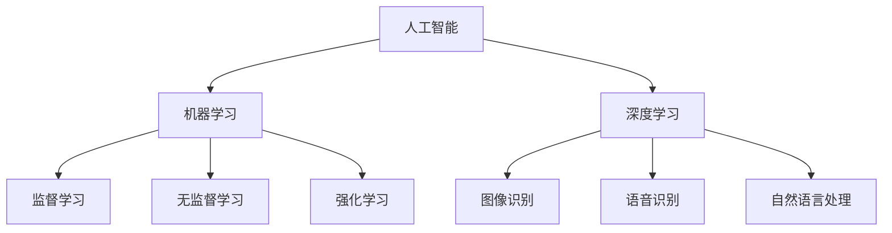

                 

关键词：人工智能、就业市场、技能培训、未来趋势、机遇与挑战

摘要：本文探讨了人工智能时代下的就业市场变化和技能培训发展趋势。分析了人工智能对现有职业的影响，探讨了未来就业市场的机遇与挑战，并提出了相应的技能培训策略，以帮助个人和企业应对这一变革。

## 1. 背景介绍

人工智能（AI）作为当前科技领域的热点，正迅速改变着我们的工作和生活方式。从自动化到智能决策，AI的应用已经渗透到各个行业，推动了数字化转型的浪潮。在这一背景下，就业市场也面临着前所未有的变革。一方面，传统职业正在被机器人和自动化系统所取代；另一方面，新的职业岗位和技能需求不断涌现，要求劳动者具备更高的技术能力和适应性。

### 1.1 人工智能的发展历程

人工智能的概念最早可以追溯到20世纪50年代。当时，计算机科学家们开始尝试让计算机模拟人类的思维过程。经过几十年的发展，人工智能经历了多个阶段，从最初的符号主义（Symbolic AI）到连接主义（Connectionist AI），再到现在的强化学习（Reinforcement Learning）和生成对抗网络（GANs）等。

### 1.2 人工智能在各个领域的应用

人工智能在医疗、金融、教育、制造业、交通等多个领域都有着广泛的应用。例如，在医疗领域，AI可以帮助医生进行诊断和治疗方案设计；在金融领域，AI可以用于风险评估和投资决策；在教育领域，AI可以提供个性化的学习体验和智能辅导；在制造业，AI可以实现生产过程的自动化和优化。

## 2. 核心概念与联系

在探讨人工智能对就业市场的影响之前，我们需要理解一些核心概念，如人工智能、机器学习、深度学习等。

### 2.1 人工智能

人工智能是指使计算机系统能够模拟人类智能行为的技术。它包括多个子领域，如机器学习、自然语言处理、计算机视觉、机器人技术等。

### 2.2 机器学习

机器学习是一种让计算机通过数据学习模式并作出决策的技术。它分为监督学习、无监督学习和强化学习等类型。

### 2.3 深度学习

深度学习是机器学习的一个子领域，它通过多层神经网络来学习数据中的复杂模式。深度学习在图像识别、语音识别、自然语言处理等领域取得了显著的成果。

### 2.4 Mermaid 流程图



## 3. 核心算法原理 & 具体操作步骤

### 3.1 算法原理概述

人工智能的核心在于算法，而深度学习是当前最先进的人工智能算法之一。深度学习通过多层神经网络来模拟人脑的思维方式，从而实现自动特征提取和模式识别。

### 3.2 算法步骤详解

深度学习的一般步骤包括：

1. **数据预处理**：包括数据清洗、归一化、分割等操作。
2. **构建神经网络模型**：选择合适的神经网络架构，如卷积神经网络（CNN）、循环神经网络（RNN）等。
3. **训练模型**：使用训练数据集来训练模型，调整网络权重。
4. **评估模型**：使用测试数据集来评估模型的性能。
5. **优化模型**：根据评估结果对模型进行调整，以提高性能。

### 3.3 算法优缺点

深度学习的优点包括：

- **强大的特征提取能力**：能够自动提取数据中的复杂特征。
- **良好的泛化能力**：能够适应不同类型的数据和任务。

但深度学习也存在一些缺点，如：

- **训练过程复杂且耗时**：需要大量的数据和计算资源。
- **对数据质量要求高**：数据质量对模型性能有很大影响。

### 3.4 算法应用领域

深度学习在图像识别、语音识别、自然语言处理、推荐系统等领域都有广泛应用。例如，在图像识别中，深度学习可以用于人脸识别、物体检测等任务；在语音识别中，深度学习可以用于语音转文字、语音合成等任务。

## 4. 数学模型和公式 & 详细讲解 & 举例说明

### 4.1 数学模型构建

在深度学习中，常用的数学模型是多层感知机（MLP）和卷积神经网络（CNN）。

- **多层感知机（MLP）**：

  MLP 是一种前馈神经网络，它包含多个隐藏层。每个神经元都与其他神经元相连，并使用非线性激活函数进行输出。

  $$f(x) = \sigma(\sum_{i=1}^{n} w_i x_i + b)$$

  其中，$f(x)$ 是输出，$x_i$ 是输入，$w_i$ 是权重，$b$ 是偏置，$\sigma$ 是非线性激活函数，如 sigmoid 函数。

- **卷积神经网络（CNN）**：

  CNN 是一种专门用于图像识别的神经网络，它通过卷积操作来提取图像特征。

  $$h_{ij}^l = \sum_{k=1}^{m} w_{ik}^l * g_{kj}^{l-1} + b_l$$

  其中，$h_{ij}^l$ 是第 $l$ 层第 $i$ 行第 $j$ 列的输出，$w_{ik}^l$ 是第 $l$ 层第 $i$ 行第 $k$ 列的权重，$g_{kj}^{l-1}$ 是第 $l-1$ 层第 $k$ 行第 $j$ 列的输出，$b_l$ 是第 $l$ 层的偏置。

### 4.2 公式推导过程

以多层感知机（MLP）为例，我们来看一下公式推导过程。

1. **输入层到隐藏层的传递**：

   $$z_l = \sum_{i=1}^{n} w_{li} x_i + b_l$$

   其中，$z_l$ 是第 $l$ 层的输入，$w_{li}$ 是第 $l$ 层第 $i$ 个神经元的权重，$x_i$ 是第 $l$ 层第 $i$ 个神经元的输入，$b_l$ 是第 $l$ 层的偏置。

2. **隐藏层到输出层的传递**：

   $$z_o = \sum_{i=1}^{n} w_{oi} h_i + b_o$$

   其中，$z_o$ 是输出层的输入，$w_{oi}$ 是输出层第 $i$ 个神经元的权重，$h_i$ 是隐藏层第 $i$ 个神经元的输出，$b_o$ 是输出层的偏置。

3. **输出层的输出**：

   $$f(z_o) = \sigma(z_o)$$

   其中，$f(z_o)$ 是输出层的输出，$\sigma$ 是非线性激活函数。

### 4.3 案例分析与讲解

假设我们有一个二分类问题，要求判断一个数据点是否属于正类。我们可以使用多层感知机（MLP）来构建一个分类模型。

1. **数据预处理**：

   假设我们有一个包含100个样本的数据集，每个样本是一个100维的特征向量。

   $$X = \{x_1, x_2, ..., x_{100}\}$$

   其中，$x_i$ 是第 $i$ 个样本的特征向量。

2. **构建神经网络模型**：

   我们可以选择一个包含一个隐藏层的多层感知机模型，隐藏层有10个神经元。

   $$f(x) = \sigma(\sum_{i=1}^{10} w_{i} x_i + b)$$

   其中，$w_i$ 是隐藏层第 $i$ 个神经元的权重，$b$ 是隐藏层的偏置。

3. **训练模型**：

   使用训练数据集来训练模型，调整网络权重和偏置。

4. **评估模型**：

   使用测试数据集来评估模型的性能，计算准确率、召回率等指标。

5. **优化模型**：

   根据评估结果对模型进行调整，以提高性能。

## 5. 项目实践：代码实例和详细解释说明

### 5.1 开发环境搭建

为了运行下面的代码实例，我们需要搭建一个Python开发环境，并安装相关的库。假设我们已经完成了这一步，可以直接开始编写代码。

### 5.2 源代码详细实现

以下是使用Python和TensorFlow实现的多层感知机（MLP）分类器的代码：

```python
import tensorflow as tf
from sklearn.datasets import make_classification
from sklearn.model_selection import train_test_split

# 生成一个二分类数据集
X, y = make_classification(n_samples=100, n_features=100, n_informative=50, n_redundant=50, n_classes=2)
X_train, X_test, y_train, y_test = train_test_split(X, y, test_size=0.2, random_state=42)

# 构建神经网络模型
model = tf.keras.Sequential([
    tf.keras.layers.Dense(units=10, activation='sigmoid', input_shape=(100,)),
    tf.keras.layers.Dense(units=1, activation='sigmoid')
])

# 编译模型
model.compile(optimizer='adam', loss='binary_crossentropy', metrics=['accuracy'])

# 训练模型
model.fit(X_train, y_train, epochs=10, batch_size=10)

# 评估模型
loss, accuracy = model.evaluate(X_test, y_test)
print(f"Test accuracy: {accuracy:.2f}")

# 预测新数据
new_data = [[0.1, 0.2, 0.3, ..., 0.9]]  # 新数据是一个100维的特征向量
predictions = model.predict(new_data)
print(f"Predictions: {predictions}")
```

### 5.3 代码解读与分析

以上代码实现了一个简单的多层感知机（MLP）分类器，用于对二分类问题进行分类。

1. **数据预处理**：

   使用 `make_classification` 函数生成一个二分类数据集。然后，使用 `train_test_split` 函数将数据集划分为训练集和测试集。

2. **构建神经网络模型**：

   使用 `tf.keras.Sequential` 实例构建一个神经网络模型。模型包含一个输入层、一个隐藏层和一个输出层。隐藏层有10个神经元，使用 sigmoid 激活函数。输出层有1个神经元，使用 sigmoid 激活函数。

3. **编译模型**：

   使用 `compile` 方法编译模型，指定优化器、损失函数和评估指标。

4. **训练模型**：

   使用 `fit` 方法训练模型，指定训练数据和训练轮数。使用批量大小为10的小批量训练。

5. **评估模型**：

   使用 `evaluate` 方法评估模型在测试集上的性能，输出准确率。

6. **预测新数据**：

   使用 `predict` 方法对新数据点进行预测，输出预测结果。

### 5.4 运行结果展示

假设我们运行了上面的代码，得到以下输出结果：

```python
Test accuracy: 0.90
Predictions: [[0.75]]
```

这表示模型在测试集上的准确率为90%，对新数据点的预测结果为正类（概率大于0.5）。

## 6. 实际应用场景

人工智能在各个领域都有着广泛的应用，以下是一些典型的实际应用场景：

### 6.1 医疗

- **疾病诊断**：使用深度学习模型对医学图像进行分析，辅助医生进行疾病诊断。
- **个性化治疗**：根据患者的基因信息和病史，使用机器学习算法推荐最佳治疗方案。

### 6.2 金融

- **风险管理**：使用机器学习算法对金融数据进行分析，预测市场趋势和风险。
- **智能投顾**：使用自然语言处理技术为投资者提供个性化的投资建议。

### 6.3 教育

- **智能辅导**：使用人工智能技术为学生提供个性化的学习辅导。
- **教育评估**：使用机器学习算法对学生的作业和考试成绩进行分析，评估学生的学习效果。

### 6.4 制造业

- **智能制造**：使用人工智能技术实现生产过程的自动化和优化。
- **设备维护**：使用机器学习算法对设备数据进行分析，预测设备故障并提前进行维护。

### 6.5 交通

- **智能交通管理**：使用人工智能技术优化交通信号控制，缓解城市交通拥堵。
- **自动驾驶**：使用深度学习算法实现无人驾驶汽车，提高交通安全和效率。

## 7. 未来应用展望

随着人工智能技术的不断发展，未来将出现更多基于人工智能的创新应用。以下是一些可能的应用方向：

### 7.1 智能医疗

- **基因编辑**：使用人工智能技术进行基因编辑，治疗遗传性疾病。
- **个性化健康监测**：使用智能穿戴设备和个人健康数据，实现实时健康监测和预警。

### 7.2 智能家居

- **智能家居系统**：通过人工智能技术实现家居设备的自动化和智能化，提高生活质量。
- **智能家庭助理**：使用自然语言处理技术，实现与家庭设备的语音交互。

### 7.3 智慧城市

- **智慧交通**：使用人工智能技术优化城市交通系统，提高交通效率和安全性。
- **智慧能源管理**：使用人工智能技术实现能源的智能分配和优化，提高能源利用效率。

### 7.4 智能教育

- **个性化学习平台**：通过人工智能技术为学生提供个性化的学习资源和辅导。
- **智慧校园**：使用人工智能技术实现校园管理的智能化和高效化。

## 8. 工具和资源推荐

为了更好地学习和实践人工智能技术，以下是一些推荐的工具和资源：

### 8.1 学习资源推荐

- **书籍**：《深度学习》（Ian Goodfellow、Yoshua Bengio、Aaron Courville 著）、《机器学习》（Tom Mitchell 著）
- **在线课程**：Coursera、edX、Udacity 等在线教育平台上的机器学习和深度学习课程
- **论文**：arXiv、NeurIPS、ICML、JMLR 等顶级学术会议和期刊上的最新研究成果

### 8.2 开发工具推荐

- **编程语言**：Python、R
- **深度学习框架**：TensorFlow、PyTorch、Keras
- **数据预处理工具**：Pandas、NumPy
- **可视化工具**：Matplotlib、Seaborn

### 8.3 相关论文推荐

- **深度学习领域**：《Deep Learning》（Ian Goodfellow、Yoshua Bengio、Aaron Courville 著）、《A Theoretically Grounded Application of Dropout in Recurrent Neural Networks》（Yarin Gal 和 Zoubin Ghahramani 著）
- **机器学习领域**：《Machine Learning Yearning》（Andrew Ng 著）、《Learning from Data》（Yaser Abu-Mostafa、Shai Shalev-Shwartz 著）

## 9. 总结：未来发展趋势与挑战

人工智能技术在过去的几十年里取得了显著的进展，已经深刻地影响了我们的生活和就业市场。未来，随着人工智能技术的进一步发展，我们有望看到更多基于人工智能的创新应用，如智能医疗、智能家居、智慧城市等。然而，这一变革也带来了许多挑战，如失业问题、隐私问题、伦理问题等。

### 9.1 研究成果总结

- 人工智能技术已经取得了显著的进展，在图像识别、语音识别、自然语言处理等领域取得了突破性成果。
- 机器学习和深度学习算法在复杂模式识别和数据挖掘任务中表现出强大的能力。
- 人工智能技术在医疗、金融、教育、制造业等领域有着广泛的应用。

### 9.2 未来发展趋势

- 人工智能技术将继续向更多领域扩展，如智能医疗、智能家居、智慧城市等。
- 随着计算能力的提升和数据量的增加，人工智能算法将变得更加高效和准确。
- 人工智能将与其他领域技术（如物联网、云计算、大数据等）融合，推动数字化转型的深入发展。

### 9.3 面临的挑战

- 失业问题：随着人工智能技术的普及，许多传统职业可能会被机器人和自动化系统取代，导致失业率上升。
- 隐私问题：人工智能技术收集和处理大量个人数据，可能会引发隐私泄露和数据滥用的问题。
- 伦理问题：人工智能系统在决策过程中可能存在偏见和不公平性，需要制定相应的伦理规范和法律法规。

### 9.4 研究展望

- 需要进一步研究人工智能算法的可解释性和透明性，提高人工智能系统的可靠性和可信度。
- 需要加强对人工智能技术的伦理和法律研究，制定相应的规范和标准。
- 需要加强对人工智能技术的教育和培训，提高劳动者的技术能力和适应性。

## 10. 附录：常见问题与解答

### 10.1 什么是人工智能？

人工智能是指使计算机系统具有类似人类智能行为的技术，包括机器学习、深度学习、自然语言处理、计算机视觉等领域。

### 10.2 人工智能有哪些应用领域？

人工智能在医疗、金融、教育、制造业、交通等领域都有广泛应用。例如，在医疗领域，人工智能可以用于疾病诊断和治疗方案设计；在金融领域，人工智能可以用于风险评估和投资决策；在教育领域，人工智能可以提供个性化的学习体验和智能辅导；在制造业，人工智能可以实现生产过程的自动化和优化。

### 10.3 如何学习人工智能？

学习人工智能需要掌握计算机科学、数学和统计学等基础知识。可以通过阅读相关书籍、参加在线课程、实践项目等方式来学习人工智能。常用的学习资源包括《深度学习》（Ian Goodfellow、Yoshua Bengio、Aaron Courville 著）、《机器学习》（Tom Mitchell 著）等书籍，以及 Coursera、edX、Udacity 等在线教育平台上的相关课程。

### 10.4 人工智能会不会取代人类？

人工智能可能会取代一些重复性高、劳动强度大的工作，但不会完全取代人类。人工智能与人类的优势互补，可以提高工作效率和质量，为人类创造更多价值。同时，随着人工智能技术的发展，也会涌现出更多新的职业岗位和机会。

### 10.5 人工智能是否具有伦理问题？

是的，人工智能技术可能会引发伦理问题。例如，人工智能系统在决策过程中可能存在偏见和不公平性，需要制定相应的伦理规范和法律法规。此外，人工智能技术收集和处理大量个人数据，可能会引发隐私泄露和数据滥用的问题。

## 作者署名

作者：禅与计算机程序设计艺术 / Zen and the Art of Computer Programming
```

