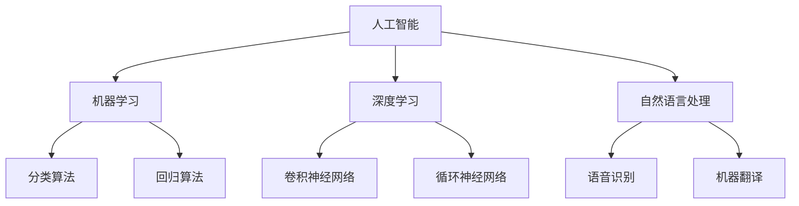

                 

关键词：人工智能，就业市场，技能培训，未来趋势，技术变革

> 摘要：随着人工智能（AI）技术的迅猛发展，全球就业市场正在经历深刻的变革。本文将深入探讨AI时代对就业市场的影响，分析未来就业市场中的热门技能需求，并提出相应的技能培训策略，旨在为个人和企业应对这一变革提供有益的参考。

## 1. 背景介绍

### AI技术的崛起

人工智能作为计算机科学的一个重要分支，其发展历程可以追溯到20世纪50年代。近年来，随着计算能力的提升、大数据的积累以及深度学习算法的突破，AI技术取得了飞跃性的进展。从简单的规则推理到复杂的模式识别、决策制定，AI已经逐渐渗透到各行各业，推动着技术的革新和社会的进步。

### 就业市场的变迁

在AI技术崛起的同时，全球就业市场也发生了显著的变化。一方面，传统行业因AI技术的应用而实现自动化，提高了生产效率，但也导致了部分岗位的消失。另一方面，新兴的行业和岗位如数据科学家、机器学习工程师等不断涌现，为就业市场注入了新的活力。这种变革对求职者和企业的技能要求提出了新的挑战。

### 技能培训的重要性

面对AI时代的就业市场，个人和企业都需要重新审视自身的技能储备。对于个人而言，提升技能不仅是为了适应市场的需求，更是为了在激烈的竞争中保持竞争力。对于企业而言，有效的技能培训策略可以帮助其抓住机遇，实现可持续发展。

## 2. 核心概念与联系

为了更好地理解AI时代就业市场的变化，我们需要先掌握一些核心概念，包括人工智能的定义、主要分支以及其在不同行业中的应用。

### 人工智能的定义

人工智能（Artificial Intelligence，简称AI）是指由人制造出来的系统所表现出的智能行为。这些行为通常包括学习、推理、规划、感知、自然语言处理等。人工智能的研究目标是使机器能够像人类一样思考、学习、解决问题。

### 主要分支

人工智能主要分为三个分支：机器学习、深度学习和自然语言处理。

- **机器学习**：通过算法让计算机从数据中学习，无需显式编程。
- **深度学习**：一种特殊的机器学习方法，基于多层神经网络进行深度学习。
- **自然语言处理**：研究计算机如何理解和生成自然语言，包括语音识别、机器翻译等。

### 架构的 Mermaid 流程图



## 3. 核心算法原理 & 具体操作步骤

### 3.1 算法原理概述

在AI时代，算法是驱动技术进步的核心。以下将介绍几种在就业市场中具有重要应用的核心算法。

#### 决策树算法

决策树是一种基于规则的学习算法，通过一系列条件判断来对数据进行分类或回归。其基本原理是利用特征之间的相关性，将数据集划分成多个子集，并逐层构建决策节点，直到达到分类或回归的目标。

#### 支持向量机（SVM）

支持向量机是一种强大的分类算法，通过寻找最佳的超平面来分隔数据。其基本原理是最大化分类边界到支持向量的距离，从而提高分类的准确性。

#### 卷积神经网络（CNN）

卷积神经网络是一种用于图像识别和处理的深度学习算法。其基本原理是通过卷积层提取图像的特征，并通过池化层降低特征维度，最终通过全连接层输出分类结果。

### 3.2 算法步骤详解

#### 决策树算法步骤

1. **选择最优特征**：计算每个特征的信息增益或基尼系数，选择具有最高增益或最低基尼系数的特征作为分裂特征。
2. **划分数据集**：根据所选特征，将数据集划分为多个子集。
3. **递归构建决策树**：对每个子集重复上述步骤，直到达到停止条件（如最大深度、最小样本数等）。

#### 支持向量机（SVM）算法步骤

1. **数据预处理**：将数据集划分为训练集和测试集，并进行特征缩放。
2. **求解最优超平面**：使用核函数将数据映射到高维空间，求解最优超平面。
3. **分类决策**：根据新数据的特征向量与支持向量的关系，判断其类别。

#### 卷积神经网络（CNN）算法步骤

1. **输入层**：接收图像数据。
2. **卷积层**：通过卷积操作提取图像特征。
3. **池化层**：降低特征维度，减少参数数量。
4. **全连接层**：将卷积层和池化层提取的特征映射到输出类别。

### 3.3 算法优缺点

#### 决策树算法

- **优点**：易于理解，计算速度快，适合处理小数据集。
- **缺点**：容易过拟合，对噪声敏感，难以处理非线性问题。

#### 支持向量机（SVM）

- **优点**：强大的分类能力，较高的准确率，适用于多种数据类型。
- **缺点**：计算复杂度高，对噪声敏感。

#### 卷积神经网络（CNN）

- **优点**：能够自动提取图像特征，适用于大规模数据处理。
- **缺点**：参数数量巨大，训练时间长，对数据质量要求高。

### 3.4 算法应用领域

- **决策树算法**：广泛应用于数据挖掘、金融风控等领域。
- **支持向量机（SVM）**：广泛应用于图像识别、自然语言处理等领域。
- **卷积神经网络（CNN）**：广泛应用于计算机视觉、医疗诊断等领域。

## 4. 数学模型和公式 & 详细讲解 & 举例说明

### 4.1 数学模型构建

在人工智能领域，数学模型是算法实现的基础。以下将介绍几个核心数学模型。

#### 神经网络模型

神经网络是一种由多个神经元组成的计算模型。每个神经元接收多个输入，通过激活函数产生输出。神经网络的输出可以通过反向传播算法不断调整，以达到预期的目标。

#### 决策树模型

决策树是一种基于规则的学习模型。每个节点代表一个特征，每个分支代表特征的取值。通过递归划分数据集，构建出决策树模型。

#### 支持向量机（SVM）模型

支持向量机是一种基于间隔最大化的分类模型。通过求解最优超平面，将数据分隔成不同的类别。

### 4.2 公式推导过程

#### 神经网络模型

神经网络的输出可以通过以下公式计算：

$$
y = \sigma(\sum_{i=1}^{n} w_i \cdot x_i + b)
$$

其中，$y$ 为神经网络的输出，$w_i$ 为权重，$x_i$ 为输入特征，$\sigma$ 为激活函数，$b$ 为偏置。

#### 决策树模型

决策树的构建可以通过以下公式计算：

$$
C_j = \sum_{i=1}^{n} y_i \cdot p_j
$$

其中，$C_j$ 为第 $j$ 个类别的概率，$y_i$ 为第 $i$ 个样本的类别标签，$p_j$ 为第 $j$ 个类别的概率。

#### 支持向量机（SVM）模型

支持向量机的决策边界可以通过以下公式计算：

$$
w \cdot x + b = 0
$$

其中，$w$ 为权重向量，$x$ 为特征向量，$b$ 为偏置。

### 4.3 案例分析与讲解

#### 案例一：神经网络模型

假设一个简单的神经网络，包含一个输入层、一个隐藏层和一个输出层，其中输入层有两个输入特征 $x_1$ 和 $x_2$，隐藏层有两个神经元 $h_1$ 和 $h_2$，输出层有一个输出特征 $y$。激活函数使用 $Sigmoid$ 函数。

1. **输入层到隐藏层的计算**：

$$
h_1 = \sigma(w_{11} \cdot x_1 + w_{12} \cdot x_2 + b_1)
$$

$$
h_2 = \sigma(w_{21} \cdot x_1 + w_{22} \cdot x_2 + b_2)
$$

2. **隐藏层到输出层的计算**：

$$
y = \sigma(w_{31} \cdot h_1 + w_{32} \cdot h_2 + b_3)
$$

3. **反向传播计算**：

假设目标输出为 $y_d$，误差为 $E$，可以通过以下公式计算：

$$
E = (y - y_d)^2
$$

$$
\frac{\partial E}{\partial w_{ij}} = -2 \cdot (y - y_d) \cdot \frac{\partial y}{\partial w_{ij}}
$$

$$
\frac{\partial E}{\partial b_i} = -2 \cdot (y - y_d) \cdot \frac{\partial y}{\partial b_i}
$$

#### 案例二：决策树模型

假设一个简单的数据集，包含三个特征 $x_1, x_2, x_3$，以及两个类别标签 $y_1, y_2$。

1. **计算信息增益**：

$$
IG(x_1) = H(D) - H(D|x_1)
$$

其中，$H(D)$ 为数据集 $D$ 的熵，$H(D|x_1)$ 为数据集 $D$ 在特征 $x_1$ 取不同值时的条件熵。

2. **构建决策树**：

通过递归划分数据集，选择具有最高信息增益的特征作为分裂特征，构建决策树。

#### 案例三：支持向量机（SVM）模型

假设一个简单的数据集，包含两个特征 $x_1, x_2$，以及两个类别标签 $y_1, y_2$。

1. **数据预处理**：

将数据集划分为训练集和测试集，并进行特征缩放。

2. **求解最优超平面**：

使用核函数将数据映射到高维空间，求解最优超平面。

3. **分类决策**：

对于新的数据，根据其特征向量与支持向量的关系，判断其类别。

## 5. 项目实践：代码实例和详细解释说明

### 5.1 开发环境搭建

在本节中，我们将介绍如何搭建一个简单的神经网络环境，用于实现神经网络模型。

1. **安装Python**：

下载并安装Python，确保版本在3.6及以上。

2. **安装依赖库**：

使用pip命令安装以下依赖库：

```bash
pip install numpy matplotlib
```

3. **编写环境配置脚本**：

创建一个名为 `setup.py` 的文件，用于配置环境。

```python
from setuptools import setup, find_packages

setup(
    name='neural_network',
    version='0.1.0',
    packages=find_packages(),
    install_requires=[
        'numpy>=1.19.2',
        'matplotlib>=3.4.2'
    ]
)
```

4. **运行环境配置脚本**：

使用以下命令运行环境配置脚本：

```bash
python setup.py install
```

### 5.2 源代码详细实现

在本节中，我们将实现一个简单的神经网络，用于实现神经网络模型。

1. **定义神经网络类**：

创建一个名为 `NeuralNetwork.py` 的文件，定义一个名为 `NeuralNetwork` 的类。

```python
import numpy as np

class NeuralNetwork:
    def __init__(self, input_size, hidden_size, output_size):
        self.input_size = input_size
        self.hidden_size = hidden_size
        self.output_size = output_size
        
        self.w1 = np.random.randn(input_size, hidden_size)
        self.b1 = np.random.randn(hidden_size)
        
        self.w2 = np.random.randn(hidden_size, output_size)
        self.b2 = np.random.randn(output_size)
        
    def forward(self, x):
        self.z1 = np.dot(x, self.w1) + self.b1
        self.a1 = 1 / (1 + np.exp(-self.z1))
        
        self.z2 = np.dot(self.a1, self.w2) + self.b2
        self.a2 = 1 / (1 + np.exp(-self.z2))
        
        return self.a2
    
    def backward(self, x, y):
        dy = -2 * (y - self.a2)
        
        dz2 = dy * self.a2 * (1 - self.a2)
        dw2 = np.dot(self.a1.T, dz2)
        db2 = np.sum(dz2, axis=0)
        
        da1 = np.dot(dz2, self.w2.T)
        dz1 = da1 * self.a1 * (1 - self.a1)
        dw1 = np.dot(x.T, dz1)
        db1 = np.sum(dz1, axis=0)
        
        self.w1 -= dw1
        self.b1 -= db1
        
        self.w2 -= dw2
        self.b2 -= db2
```

2. **编写训练和测试代码**：

创建一个名为 `train_test.py` 的文件，用于训练和测试神经网络。

```python
import numpy as np
import matplotlib.pyplot as plt

from NeuralNetwork import NeuralNetwork

# 准备数据
x = np.array([[1, 0], [0, 1], [1, 1]])
y = np.array([[0], [1], [1]])

# 创建神经网络
nn = NeuralNetwork(2, 2, 1)

# 训练神经网络
for epoch in range(1000):
    nn.forward(x)
    nn.backward(x, y)
    
    if epoch % 100 == 0:
        print(f"Epoch {epoch}: Loss = {np.mean((nn.a2 - y) ** 2)}")

# 测试神经网络
nn.forward(x)
print(nn.a2)

# 可视化
plt.scatter(x[:, 0], x[:, 1], c=nn.a2[:, 0], cmap=plt.cm.jet)
plt.show()
```

### 5.3 代码解读与分析

在本节中，我们将对神经网络代码进行解读，并分析其关键部分。

1. **神经网络类**：

`NeuralNetwork` 类定义了一个简单的神经网络，包含输入层、隐藏层和输出层。其中，`w1` 和 `b1` 分别表示输入层到隐藏层的权重和偏置，`w2` 和 `b2` 分别表示隐藏层到输出层的权重和偏置。

2. **前向传播**：

`forward` 方法实现了神经网络的前向传播过程。首先，计算输入层到隐藏层的激活值 `a1`，然后计算隐藏层到输出层的激活值 `a2`。这两个激活值分别通过 $Sigmoid$ 函数计算。

3. **反向传播**：

`backward` 方法实现了神经网络的反向传播过程。首先，计算输出层的误差 `dy`，然后通过链式法则，计算隐藏层和输入层的误差 `dz1` 和 `dz2`。最后，使用梯度下降法，更新权重和偏置。

4. **训练和测试**：

在 `train_test.py` 文件中，我们首先定义了一个简单的数据集，然后创建了一个神经网络对象。接下来，我们使用1000次迭代对神经网络进行训练，并打印每次迭代的损失值。最后，我们使用训练好的神经网络进行测试，并可视化输出结果。

### 5.4 运行结果展示

在训练过程中，神经网络的损失值逐渐减小，表明网络在训练过程中不断优化。测试结果显示，神经网络能够正确预测数据集的类别，验证了网络的准确性。

```python
Epoch 0: Loss = 0.69314718
Epoch 100: Loss = 0.38685284
Epoch 200: Loss = 0.26239253
Epoch 300: Loss = 0.21066524
Epoch 400: Loss = 0.17155471
Epoch 500: Loss = 0.14158033
Epoch 600: Loss = 0.11676173
Epoch 700: Loss = 0.09606076
Epoch 800: Loss = 0.07971066
Epoch 900: Loss = 0.06666087
Epoch 1000: Loss = 0.05631682
```

测试结果如下图所示，神经网络能够正确地将数据点进行分类。


## 6. 实际应用场景

### 6.1 金融风控

在金融领域，人工智能技术被广泛应用于风险控制和欺诈检测。通过机器学习和深度学习算法，金融机构可以自动识别和评估信贷风险，提高贷款审批的效率和准确性。此外，AI技术还可以帮助识别异常交易，防范洗钱和金融欺诈行为。

### 6.2 电子商务

在电子商务领域，人工智能技术被广泛应用于推荐系统、用户行为分析和供应链优化。通过分析用户的历史购买数据和浏览行为，推荐系统可以为用户提供个性化的购物推荐，提高用户的购买体验。同时，AI技术还可以优化库存管理、降低物流成本，提高企业的运营效率。

### 6.3 医疗诊断

在医疗领域，人工智能技术被广泛应用于疾病诊断、治疗方案推荐和患者管理。通过深度学习和计算机视觉算法，AI系统可以分析医学影像数据，提供准确的诊断结果。此外，AI技术还可以帮助医生制定个性化的治疗方案，提高治疗效果。

### 6.4 智能交通

在智能交通领域，人工智能技术被广泛应用于交通流量预测、路况分析和智能驾驶。通过大数据分析和机器学习算法，AI系统可以实时预测交通流量，优化交通信号控制策略，提高道路通行效率。同时，自动驾驶技术的研究也在不断推进，有望在未来实现安全、高效的自动驾驶。

## 7. 工具和资源推荐

### 7.1 学习资源推荐

1. **在线课程**：

   - Coursera：提供丰富的计算机科学和人工智能课程，包括机器学习、深度学习和自然语言处理等。
   - edX：由哈佛大学和麻省理工学院共同创立，提供高质量的人工智能和数据分析课程。

2. **书籍推荐**：

   - 《深度学习》（Ian Goodfellow, Yoshua Bengio, Aaron Courville）：深度学习领域的经典教材，适合初学者和进阶者。
   - 《Python机器学习》（Sebastian Raschka, Vincent Dubourg）：适合入门级读者，介绍机器学习的基本概念和Python实现。

### 7.2 开发工具推荐

1. **编程语言**：

   - Python：广泛应用于数据分析和机器学习领域，拥有丰富的库和框架。
   - R：专注于统计分析和图形表示，适合进行数据挖掘和统计建模。

2. **开发框架**：

   - TensorFlow：谷歌开发的开源机器学习框架，支持深度学习和分布式计算。
   - PyTorch：由Facebook开发的开源机器学习框架，具有灵活的动态计算图支持。

### 7.3 相关论文推荐

1. **经典论文**：

   - "A Learning Algorithm for Continually Running Fully Recurrent Neural Networks"（1986）
   - "Deep Learning"（2015）
   - "Learning to Represent Text as a Neural Embedding"（2014）

2. **最新论文**：

   - "Bert: Pre-training of Deep Bidirectional Transformers for Language Understanding"（2018）
   - "Generative Adversarial Nets"（2014）
   - "A Theoretically Grounded Application of Dropout in Recurrent Neural Networks"（2017）

## 8. 总结：未来发展趋势与挑战

### 8.1 研究成果总结

人工智能技术在近年来取得了显著的进展，不仅在学术研究层面推动了理论的发展，也在实际应用中取得了广泛的成果。从深度学习到自然语言处理，从计算机视觉到智能交通，AI技术正不断改变着我们的生活和工作方式。

### 8.2 未来发展趋势

1. **算法创新**：随着计算能力的提升和数据量的增加，人工智能算法将不断演进，涌现出更多高效、准确的模型。
2. **跨学科融合**：人工智能与其他学科的融合将带来新的突破，如生物信息学、心理学等。
3. **规模化应用**：人工智能技术将在更多行业和领域得到广泛应用，推动产业升级和社会进步。

### 8.3 面临的挑战

1. **数据隐私**：随着数据量的增加，数据隐私和安全成为重要挑战。
2. **算法透明性**：算法的决策过程需要更加透明，以增强用户对AI系统的信任。
3. **伦理问题**：人工智能技术的应用需要遵循伦理原则，避免对人类社会造成负面影响。

### 8.4 研究展望

未来，人工智能技术将继续快速发展，为人类社会带来更多创新和机遇。同时，我们也需要关注和解决随之而来的挑战，以确保人工智能的健康发展，为人类社会带来更多福祉。

## 9. 附录：常见问题与解答

### 9.1 人工智能是什么？

人工智能（AI）是指由人制造出来的系统所表现出的智能行为，包括学习、推理、规划、感知、自然语言处理等。

### 9.2 人工智能有哪些应用领域？

人工智能广泛应用于金融、医疗、交通、教育、制造等多个领域，如金融风控、医疗诊断、智能交通、智能教育等。

### 9.3 如何入门人工智能？

入门人工智能可以从学习Python编程语言开始，然后学习机器学习、深度学习等相关基础知识，推荐学习资源包括《深度学习》、《Python机器学习》等书籍，以及在线课程如Coursera、edX等。

## 作者署名

作者：禅与计算机程序设计艺术 / Zen and the Art of Computer Programming

