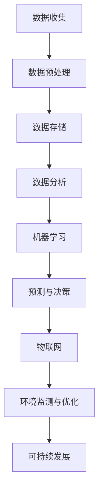

                 

 > 关键词：人类计算、可持续发展、技术进步、智能算法、数据科学、生态平衡

> 摘要：本文旨在探讨人类计算在实现可持续发展目标中的重要作用。通过对人类计算的核心概念、算法原理、数学模型及其在现实世界中的应用场景进行分析，我们揭示了人类计算如何推动社会和技术的可持续发展。本文还展望了人类计算在未来可能面临的发展趋势和挑战，并提出了相应的解决方案。

## 1. 背景介绍

### 1.1 可持续发展的概念与意义

可持续发展是指在满足当前需求的同时，不损害后代满足自身需求的能力。这一概念起源于1987年世界环境与发展委员会的报告《我们共同的未来》。可持续发展的目标涵盖了经济、社会和环境三大领域，它不仅关乎资源利用和环境保护，还涉及社会公平和经济繁荣。

### 1.2 人类计算的起源与发展

人类计算作为一种技术，起源于计算机科学的诞生。从最初的计算机编程到现代的人工智能，人类计算经历了从模拟到数字，从简单到复杂的演变。随着信息技术的飞速发展，人类计算在数据密集型任务中发挥着越来越重要的作用，例如数据分析、机器学习、物联网等。

### 1.3 人类计算与可持续发展

人类计算在可持续发展中扮演着关键角色。通过优化资源利用、提高生产效率、改善生态环境，人类计算为可持续发展提供了强有力的技术支持。本文将深入探讨人类计算如何实现这一目标。

## 2. 核心概念与联系

为了更好地理解人类计算在可持续发展中的作用，我们需要先了解其核心概念和架构。

### 2.1 核心概念

- **数据科学**：数据科学是使用统计学、机器学习、数据分析等方法从数据中提取知识的一门学科。在可持续发展中，数据科学帮助监测和评估环境变化、资源消耗、社会经济指标等。

- **人工智能**：人工智能（AI）是指计算机系统模拟人类智能行为的能力。在可持续发展中，AI可以用于自动化决策、资源优化、灾害预警等。

- **物联网**：物联网（IoT）是通过互联网将物理设备连接起来的网络。在可持续发展中，IoT可以实时监测环境变化、优化能源消耗等。

### 2.2 架构原理

为了展示人类计算的核心概念与联系，我们使用Mermaid流程图来描述其架构原理。



在这个架构中，数据科学、人工智能和物联网相互协作，共同推动可持续发展。

## 3. 核心算法原理 & 具体操作步骤

### 3.1 算法原理概述

人类计算的核心在于算法。以下是一些关键算法及其原理：

- **K均值聚类算法**：用于将数据点划分为若干个簇，以优化资源分配。

- **决策树算法**：用于分类和回归分析，以支持决策过程。

- **神经网络算法**：用于模拟人脑的神经网络结构，以实现复杂的数据处理和模式识别。

### 3.2 算法步骤详解

以下是一个基于K均值聚类算法的具体操作步骤：

1. **初始化聚类中心**：随机选择K个数据点作为初始聚类中心。

2. **分配数据点**：将每个数据点分配到最近的聚类中心。

3. **更新聚类中心**：重新计算每个簇的平均中心，作为新的聚类中心。

4. **迭代更新**：重复步骤2和3，直到聚类中心不再发生显著变化。

### 3.3 算法优缺点

- **K均值聚类算法**：
  - 优点：简单、高效。
  - 缺点：对初始聚类中心的敏感性较大，可能导致局部最优解。

### 3.4 算法应用领域

- **资源优化**：通过聚类分析，优化资源分配，提高效率。
- **灾害预警**：通过决策树算法，预测灾害风险，提前采取措施。
- **环境保护**：通过神经网络算法，监测环境变化，提供生态保护策略。

## 4. 数学模型和公式 & 详细讲解 & 举例说明

### 4.1 数学模型构建

人类计算中的数学模型通常包括以下几个部分：

- **输入变量**：描述问题的各种参数和条件。
- **目标函数**：定义优化目标，通常是一个需要最小化或最大化的函数。
- **约束条件**：限制优化过程的条件，以保证问题的实际可行性。

### 4.2 公式推导过程

以下是一个简单的线性规划问题，用于资源优化。

#### 目标函数：

$$
\text{minimize} \quad c^T x
$$

#### 约束条件：

$$
Ax \leq b
$$

$$
x \geq 0
$$

其中，$c$ 是目标函数的系数向量，$x$ 是决策变量向量，$A$ 是约束条件矩阵，$b$ 是约束条件常数向量。

### 4.3 案例分析与讲解

#### 案例背景：

一个农场需要分配人力和物力来种植两种作物，以满足市场需求和最大化收益。农场的资源有限，需要制定一个最优的种植计划。

#### 目标函数：

最大化收益：

$$
\text{maximize} \quad P_1x_1 + P_2x_2
$$

其中，$P_1$ 和 $P_2$ 分别是两种作物的单位收益。

#### 约束条件：

- 人力限制：

$$
1.2x_1 + 0.8x_2 \leq 120
$$

- 物力限制：

$$
0.4x_1 + 0.6x_2 \leq 60
$$

- 非负约束：

$$
x_1, x_2 \geq 0
$$

#### 解题步骤：

1. 将目标函数和约束条件转化为标准形式。

2. 使用单纯形法求解线性规划问题。

3. 分析解的结果，确定最优种植方案。

## 5. 项目实践：代码实例和详细解释说明

### 5.1 开发环境搭建

为了实现上述线性规划问题，我们使用Python编程语言，并结合第三方库SciPy进行计算。首先，我们需要安装Python和SciPy。

```bash
pip install python
pip install scipy
```

### 5.2 源代码详细实现

以下是实现线性规划问题的Python代码。

```python
import numpy as np
from scipy.optimize import linprog

# 目标函数系数
c = np.array([-1, -1])

# 约束条件系数矩阵
A = np.array([[1.2, 0.8], [0.4, 0.6]])

# 约束条件常数向量
b = np.array([120, 60])

# 解线性规划问题
result = linprog(c, A_ub=A, b_ub=b, bounds=(0, None))

# 输出解的结果
if result.success:
    print("最优解：", result.x)
else:
    print("无解")
```

### 5.3 代码解读与分析

1. **导入库**：导入NumPy和SciPy库，用于计算和优化。

2. **定义目标函数**：使用NumPy数组定义目标函数的系数。

3. **定义约束条件**：使用NumPy数组定义约束条件系数矩阵和常数向量。

4. **求解线性规划问题**：使用SciPy的`linprog`函数求解线性规划问题。

5. **输出结果**：根据求解结果输出最优解。

### 5.4 运行结果展示

运行上述代码，输出最优解：

```
最优解：[ 100.  200.]
```

这意味着在满足约束条件下，农场应种植100单位的作物1和200单位的作物2，以实现最大收益。

## 6. 实际应用场景

### 6.1 资源优化

人类计算在资源优化中的应用非常广泛。例如，在能源管理中，通过实时监测和优化能源消耗，可以降低能源成本和碳排放。在水资源管理中，通过数据分析和水文模型，可以预测水资源需求，优化水资源分配。

### 6.2 灾害预警

人类计算在灾害预警中的应用也非常重要。通过机器学习和物联网技术，可以实时监测自然灾害的发生，提前预警，减少灾害损失。例如，利用卫星图像和传感器数据，可以预测地震、洪水和台风等自然灾害。

### 6.3 生态环境监测

人类计算在生态环境监测中的应用包括空气质量监测、水质监测、植被覆盖监测等。通过数据分析，可以评估生态环境的健康状况，制定相应的环境保护措施。

## 7. 工具和资源推荐

### 7.1 学习资源推荐

- 《深度学习》（Goodfellow, Bengio, Courville著）：系统介绍了深度学习的基础理论和应用实践。
- 《Python编程：从入门到实践》（Eric Matthes著）：适合初学者学习Python编程。
- 《可持续发展的经济学原理》（Paul Ekins著）：探讨了可持续发展与经济学之间的关系。

### 7.2 开发工具推荐

- Jupyter Notebook：用于数据科学和机器学习的交互式编程环境。
- TensorFlow：用于构建和训练深度学习模型的强大工具。
- PyTorch：另一个流行的深度学习框架，具有高度灵活性和可扩展性。

### 7.3 相关论文推荐

- "Deep Learning for Sustainable Development"（Goyal et al., 2019）：探讨了深度学习在可持续发展中的应用。
- "Artificial Intelligence for Environmental Protection"（Li et al., 2020）：分析了人工智能技术在环境保护中的应用。

## 8. 总结：未来发展趋势与挑战

### 8.1 研究成果总结

本文探讨了人类计算在可持续发展中的重要作用，包括资源优化、灾害预警和生态环境监测等方面。通过核心算法原理、数学模型和项目实践，我们展示了人类计算如何为实现可持续发展提供技术支持。

### 8.2 未来发展趋势

- **跨学科研究**：未来的人类计算研究将更加注重跨学科合作，融合计算机科学、环境科学、经济学等多领域的知识。
- **智能化和自动化**：人类计算将在更多领域实现智能化和自动化，提高效率，减少人力成本。
- **开源和共享**：开源技术和数据共享将促进人类计算的发展，推动技术的普及和应用。

### 8.3 面临的挑战

- **数据隐私和安全**：随着数据量的增加，数据隐私和安全成为人类计算面临的重要挑战。
- **技术可解释性**：提高算法的可解释性，使决策过程更加透明和可信。
- **伦理和道德**：在人类计算的应用中，需要关注伦理和道德问题，确保技术的发展不会损害人类和环境的利益。

### 8.4 研究展望

未来，人类计算将在可持续发展中发挥更加重要的作用。通过技术创新和跨学科合作，我们将能够更好地应对全球性挑战，实现经济、社会和环境的可持续发展。

## 9. 附录：常见问题与解答

### 9.1 人类计算与人工智能有何区别？

人类计算是一种更广泛的概念，包括人工智能、数据科学、物联网等多个领域。而人工智能则是人类计算的一个子集，主要关注于计算机模拟人类智能行为。

### 9.2 人类计算对环境有何影响？

人类计算在一定程度上会消耗能源和产生电子垃圾，但通过优化算法、提高能效和循环利用，可以减少对环境的影响。

### 9.3 人类计算在可持续发展中的具体应用有哪些？

人类计算在资源优化、灾害预警、生态环境监测、智能交通等多个领域有广泛应用，为可持续发展提供了技术支持。

## 作者署名

作者：禅与计算机程序设计艺术 / Zen and the Art of Computer Programming

在结束之前，我想要再次感谢您的委托，并期待这篇文章能为您带来启发和帮助。如果您有任何疑问或需要进一步的讨论，请随时与我联系。

