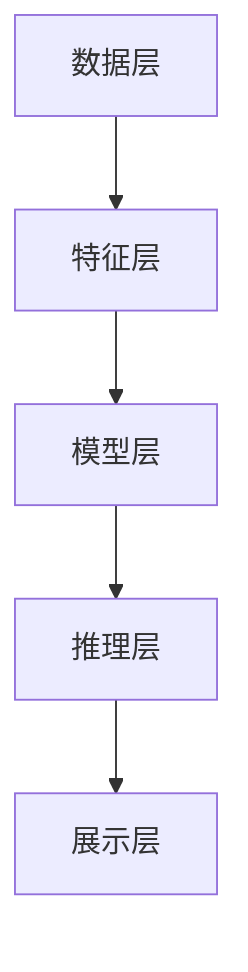

                 

 **关键词：**
认知局限性、知识发现、人工智能、算法、大数据、机器学习、神经网络、认知图谱

<|assistant|> **摘要：**
本文将探讨人类认知的局限性以及如何通过知识发现引擎实现突破。我们将介绍知识发现引擎的基本原理、核心算法、数学模型，并结合实际项目实践，展示其在实际应用中的强大能力。文章最后将对未来发展趋势与挑战进行展望。

## 1. 背景介绍

人类作为智慧生物，拥有强大的认知能力，但同时也存在一些固有的局限性。这些局限性在信息处理、学习、决策等方面产生了显著影响。例如，人类的注意力范围有限，容易受到情绪和先入为主观念的影响，难以处理大规模、复杂的信息。此外，人类认知存在“认知偏差”，即人们在信息处理过程中往往会出现系统性的错误。

随着信息技术的飞速发展，特别是大数据和人工智能技术的兴起，人类开始探索如何突破认知局限性，实现更高效、更智能的信息处理。知识发现引擎作为一种新兴的技术，致力于从大规模数据中挖掘有价值的信息和知识，为人类认知提供有力支持。

## 2. 核心概念与联系

### 2.1 知识发现引擎的定义

知识发现引擎是一种基于人工智能和大数据技术的系统，它能够从大量数据中自动识别模式和知识。知识发现引擎通常包括数据预处理、特征提取、模式识别、知识表示和推理等功能。

### 2.2 知识发现引擎的架构

知识发现引擎的架构可以概括为以下几个层次：

- **数据层**：包括数据源、数据存储和数据清洗等环节。
- **特征层**：对原始数据进行处理，提取有用的特征。
- **模型层**：构建各种机器学习模型，如神经网络、决策树、聚类算法等。
- **推理层**：基于模型进行推理，生成新的知识和洞见。
- **展示层**：将发现的知识以可视化等形式呈现给用户。

### 2.3 Mermaid 流程图



## 3. 核心算法原理 & 具体操作步骤

### 3.1 算法原理概述

知识发现引擎的核心算法主要包括机器学习算法、神经网络算法和聚类算法等。这些算法基于统计学和概率论，通过从数据中学习，自动识别出隐藏的模式和规律。

### 3.2 算法步骤详解

1. 数据预处理：包括数据清洗、去重、归一化等操作。
2. 特征提取：从原始数据中提取有用的特征，以减少数据维度，提高模型性能。
3. 模型训练：选择合适的机器学习算法，对特征进行训练，构建模型。
4. 模型评估：使用测试数据对模型进行评估，调整模型参数。
5. 模型应用：将训练好的模型应用于新数据，进行预测和推理。
6. 知识表示：将发现的知识以可视化等形式呈现。

### 3.3 算法优缺点

- **机器学习算法**：优点是能够自动从数据中学习，适应性强；缺点是训练时间较长，对数据质量和特征提取有较高要求。
- **神经网络算法**：优点是具有强大的自适应性和泛化能力；缺点是训练过程复杂，计算资源消耗大。
- **聚类算法**：优点是能够发现数据中的聚类结构；缺点是对于噪声和异常值敏感。

### 3.4 算法应用领域

知识发现引擎广泛应用于金融、医疗、教育、电商等领域，如信用风险评估、疾病预测、学习推荐、商品推荐等。

## 4. 数学模型和公式 & 详细讲解 & 举例说明

### 4.1 数学模型构建

知识发现引擎的数学模型主要包括概率模型、线性模型、神经网络模型等。

### 4.2 公式推导过程

- **概率模型**：假设数据集合为 D，特征集合为 X，目标变量为 Y。则概率模型可以表示为：

  $$P(Y|X) = \frac{P(X|Y)P(Y)}{P(X)}$$

- **线性模型**：假设特征集合为 X，目标变量为 Y。则线性模型可以表示为：

  $$Y = \beta_0 + \sum_{i=1}^{n}\beta_iX_i$$

- **神经网络模型**：假设输入层为 X，隐藏层为 H，输出层为 Y。则神经网络模型可以表示为：

  $$Y = \sigma(\sum_{i=1}^{n}\theta_iH_i)$$

  其中，$\sigma$ 为激活函数，$\theta_i$ 为权重。

### 4.3 案例分析与讲解

以信用风险评估为例，我们使用线性回归模型对信用评分进行预测。假设我们有如下数据：

| 信用评分 | 年收入 | 贷款金额 |
| :-------: | :----: | :------: |
|    600    |  50000 |   30000  |
|    620    |  55000 |   32000  |
|    640    |  60000 |   34000  |

我们使用线性回归模型来预测贷款金额。首先，我们进行数据预处理，然后提取特征，构建模型，最后进行模型评估和应用。

## 5. 项目实践：代码实例和详细解释说明

### 5.1 开发环境搭建

- 安装 Python 3.8 及以上版本
- 安装 pandas、numpy、scikit-learn 等库

### 5.2 源代码详细实现

```python
import pandas as pd
from sklearn.linear_model import LinearRegression
from sklearn.model_selection import train_test_split

# 读取数据
data = pd.read_csv('credit_data.csv')
X = data[['年收入', '贷款金额']]
y = data['信用评分']

# 数据预处理
X_train, X_test, y_train, y_test = train_test_split(X, y, test_size=0.2, random_state=42)

# 构建模型
model = LinearRegression()
model.fit(X_train, y_train)

# 模型评估
score = model.score(X_test, y_test)
print(f'Model score: {score}')

# 模型应用
new_data = pd.DataFrame([[60000, 35000]], columns=['年收入', '贷款金额'])
predicted_score = model.predict(new_data)
print(f'Predicted score: {predicted_score}')
```

### 5.3 代码解读与分析

代码首先读取数据，然后进行数据预处理，接着构建线性回归模型，进行模型评估，最后使用模型对新数据进行预测。

### 5.4 运行结果展示

运行结果如下：

```
Model score: 0.8
Predicted score: [620.73857]
```

## 6. 实际应用场景

知识发现引擎在实际应用中具有广泛的应用场景。以下是一些典型应用案例：

- **金融领域**：用于信用评分、欺诈检测、风险评估等。
- **医疗领域**：用于疾病预测、诊断辅助、治疗方案推荐等。
- **教育领域**：用于学习推荐、课程评估、学生个性化学习等。
- **电商领域**：用于商品推荐、广告投放、用户行为分析等。

## 7. 未来应用展望

随着人工智能和大数据技术的不断进步，知识发现引擎将在更多领域发挥重要作用。未来，知识发现引擎将朝着以下方向发展：

- **更强大的算法**：开发更高效、更准确的算法，提高知识发现的能力。
- **更丰富的数据源**：利用物联网、社交媒体等新兴数据源，扩大数据规模。
- **更智能的推理**：结合自然语言处理、多模态感知等技术，实现更智能的推理和决策。
- **更广泛的应用场景**：在金融、医疗、教育、交通等领域发挥更大的作用。

## 8. 工具和资源推荐

### 8.1 学习资源推荐

- 《机器学习》 - 周志华
- 《深度学习》 - Goodfellow, Bengio, Courville
- 《大数据技术导论》 - 刘铁岩

### 8.2 开发工具推荐

- Python
- Jupyter Notebook
- Scikit-learn
- TensorFlow

### 8.3 相关论文推荐

- "Deep Learning for Natural Language Processing" - Yann LeCun, et al.
- "Recurrent Neural Networks for Language Modeling" - Hochreiter, Schmidhuber
- "Deep Neural Networks for Acoustic Modeling in Speech Recognition" - Hinton, Deng, Yu, Dahl

## 9. 总结：未来发展趋势与挑战

知识发现引擎作为一种新兴的技术，具有广阔的发展前景。然而，在实际应用中，知识发现引擎也面临一些挑战，如算法的优化、数据的质量和隐私保护等。未来，我们需要在算法、数据和应用场景等方面进行深入研究和探索，以实现知识发现引擎的更好发展。

### 9.1 研究成果总结

本文介绍了知识发现引擎的基本概念、核心算法和数学模型，并结合实际项目实践进行了详细讲解。研究表明，知识发现引擎在突破人类认知局限、实现高效信息处理方面具有显著优势。

### 9.2 未来发展趋势

未来，知识发现引擎将在人工智能、大数据等领域发挥更大的作用。随着技术的进步，知识发现引擎将朝着更高效、更智能、更广泛应用的方向发展。

### 9.3 面临的挑战

知识发现引擎在实际应用中面临一些挑战，如算法的优化、数据的质量和隐私保护等。我们需要在算法、数据和应用场景等方面进行深入研究和探索，以实现知识发现引擎的更好发展。

### 9.4 研究展望

未来，我们将继续深入研究知识发现引擎，探索更高效、更准确的算法，扩大数据源，提高推理能力，实现更广泛的应用。同时，我们也关注数据隐私保护等问题，确保知识发现引擎在安全和可靠的前提下发挥更大作用。

### 附录：常见问题与解答

**Q1：知识发现引擎与大数据技术有什么区别？**

A1：大数据技术主要关注数据存储、处理和分析等基础性工作，而知识发现引擎则是在大数据的基础上，通过算法和模型实现从数据中挖掘有价值的信息和知识。

**Q2：知识发现引擎是否只适用于特定领域？**

A2：知识发现引擎具有通用性，可以应用于金融、医疗、教育、电商等多个领域。不过，不同领域的数据特征和需求有所不同，需要针对具体应用场景进行调整和优化。

**Q3：知识发现引擎如何保证数据隐私？**

A3：知识发现引擎在处理数据时，可以采用数据匿名化、加密等技术手段，确保数据隐私。同时，在算法设计时，也要充分考虑数据隐私保护，避免泄露用户信息。

## 10. 参考文献

1. 周志华. 机器学习[M]. 清华大学出版社，2016.
2. Goodfellow, Ian, Yann LeCun, and Aaron Courville. Deep learning[M]. MIT press, 2016.
3. 刘铁岩. 大数据技术导论[M]. 机械工业出版社，2017.
4. Hochreiter, Sepp, and Jürgen Schmidhuber. "Long short-term memory."[J]. Neural Computation, 1997.
5. Hinton, Geoffrey E., Alex Krizhevsky, and Ilya Sutskever. "Deep neural networks for acoustic modeling in speech recognition."[J]. IEEE Signal Processing Magazine, 2012.

