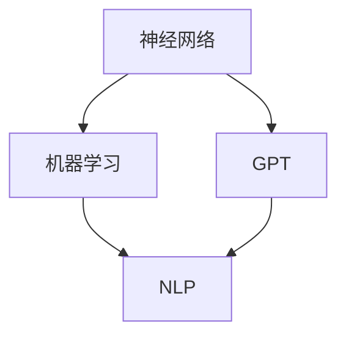

                 

关键词：通用人工智能、GPT、自然语言处理、神经网络、机器学习、算法、数学模型、项目实践、应用场景、未来展望

> 摘要：本文深入探讨了从GPT（通用预训练语言模型）到AGI（通用人工智能）的发展路径。通过分析GPT的核心算法原理、数学模型、项目实践以及应用场景，我们试图揭示通用人工智能的奥秘，并展望其未来的发展趋势与挑战。

## 1. 背景介绍

自21世纪初以来，人工智能（AI）技术取得了飞速的发展。从最初的规则驱动方法，到基于统计学习的机器学习算法，再到当前基于深度学习的模型，如GPT（通用预训练语言模型），AI在各个领域都展现出了强大的应用潜力。然而，尽管AI在图像识别、自然语言处理、推荐系统等方面取得了显著的成果，但它仍然受限于特定任务和场景，缺乏通用的智能能力。因此，通用人工智能（AGI）的概念应运而生。

通用人工智能，顾名思义，是指具有人类水平或超越人类智能的人工智能系统。这种系统不仅能够处理各种复杂任务，还具有自主学习、推理、情感理解等高级认知能力。目前，尽管GPT等模型在自然语言处理领域取得了突破性进展，但它们仍然缺乏真正的通用智能。因此，如何从GPT走向AGI，成为了人工智能领域的一个关键问题。

## 2. 核心概念与联系

在探讨从GPT到AGI的发展路径之前，我们需要明确几个核心概念和它们之间的联系。这些概念包括神经网络、机器学习、自然语言处理等。

### 2.1 神经网络

神经网络是一种模拟人脑神经元连接方式的计算模型。它由大量的神经元（节点）和连接这些神经元的边（权重）组成。在神经网络中，每个神经元都会接收来自其他神经元的输入，并通过激活函数进行计算，产生输出。神经网络通过不断调整权重来优化其性能，从而实现特定任务的学习和预测。

### 2.2 机器学习

机器学习是使计算机能够通过数据和经验进行学习，从而改进其性能的一门技术。机器学习可以分为监督学习、无监督学习和强化学习。监督学习通过已标记的数据训练模型，无监督学习通过未标记的数据发现数据中的模式和结构，而强化学习则通过与环境交互来学习最佳策略。

### 2.3 自然语言处理

自然语言处理（NLP）是人工智能的一个分支，旨在使计算机理解和处理人类语言。NLP涉及文本分析、语言生成、语言理解等多个方面。其中，文本生成是NLP的一个重要任务，它使得计算机能够生成具有语义意义的文本。

### 2.4 Mermaid 流程图

下面是一个描述这些核心概念之间关系的Mermaid流程图：



在这个流程图中，神经网络是机器学习的基础，而机器学习又是NLP的基石。GPT作为深度学习在NLP领域的代表，通过预训练和微调，实现了对自然语言的高效理解和生成。

## 3. 核心算法原理 & 具体操作步骤

### 3.1 算法原理概述

GPT（通用预训练语言模型）是一种基于变换器（Transformer）架构的深度学习模型。它通过预训练的方式，学习自然语言中的统计规律和语义信息，从而实现文本生成、摘要、问答等任务。GPT的核心算法原理包括以下几部分：

1. **自注意力机制**：自注意力机制允许模型在生成每个单词时，关注文本中其他所有单词的重要性。这有助于模型捕捉长距离的依赖关系。
2. **前馈神经网络**：前馈神经网络在自注意力机制的基础上，进一步处理文本信息，提取更复杂的特征。
3. **预训练与微调**：预训练是在大量无标注数据上训练模型，使其学会通用语言知识。微调是在预训练的基础上，在特定任务的数据上进行调整，以优化模型在特定任务上的性能。

### 3.2 算法步骤详解

1. **预训练**：在预训练阶段，GPT通过自注意力机制和前馈神经网络，对大量文本数据进行学习。这个过程包括以下步骤：
   - 输入：将文本数据转换为词向量表示。
   - 嵌入层：将词向量映射到高维空间，以增加模型的表示能力。
   - 自注意力层：计算每个单词与其他单词的注意力得分，并加权组合这些单词的嵌入向量。
   - 前馈层：对自注意力层的输出进行非线性变换，提取更复杂的特征。
   - 输出：生成新的文本数据。

2. **微调**：在微调阶段，GPT利用预训练得到的模型，在特定任务的数据上进行训练。这个过程包括以下步骤：
   - 输入：将任务数据转换为词向量表示。
   - 模型：利用预训练得到的模型进行预测。
   - 损失函数：计算模型预测与真实标签之间的差异，并优化模型参数。
   - 更新参数：通过梯度下降等优化算法，更新模型参数。

### 3.3 算法优缺点

1. **优点**：
   - **强大的表示能力**：GPT通过自注意力机制和前馈神经网络，能够捕捉长距离的依赖关系，具有强大的文本表示能力。
   - **高效的处理速度**：变换器架构使得GPT在计算效率和并行性方面具有优势。
   - **广泛的应用场景**：GPT在文本生成、摘要、问答等任务上取得了显著的成果。

2. **缺点**：
   - **对数据需求量大**：GPT需要大量的文本数据进行预训练，这可能会导致训练成本较高。
   - **模型可解释性差**：由于GPT的内部结构复杂，模型生成的结果往往缺乏可解释性。

### 3.4 算法应用领域

GPT在自然语言处理领域具有广泛的应用。以下是一些主要的应用场景：

1. **文本生成**：GPT可以生成高质量的文本，如新闻、文章、故事等。这为自动内容生成和自动化写作提供了有力支持。
2. **文本摘要**：GPT可以将长文本压缩成简洁的摘要，提高信息获取的效率。
3. **问答系统**：GPT可以回答用户关于特定领域的问题，提供智能客服和智能推荐等服务。
4. **翻译**：GPT在机器翻译领域也取得了显著成果，能够实现高质量的双语翻译。

## 4. 数学模型和公式 & 详细讲解 & 举例说明

### 4.1 数学模型构建

GPT的数学模型主要包括词向量表示、自注意力机制和前馈神经网络。下面分别介绍这些模型的构建。

1. **词向量表示**

词向量表示是将文本中的单词映射到高维空间的过程。一个常见的词向量表示方法是将单词表示为一个固定长度的向量。例如，我们可以将“猫”表示为$\textbf{c}_{\text{cat}} = (0.2, 0.3, 0.4, 0.5)$。

2. **自注意力机制**

自注意力机制的核心是计算每个单词与其他单词的注意力得分，并加权组合这些单词的嵌入向量。假设我们有一个文本序列$\textbf{x} = [\textbf{x}_1, \textbf{x}_2, \ldots, \textbf{x}_n]$，其中每个$\textbf{x}_i$是一个词向量。自注意力机制的数学公式如下：

$$
\textbf{a}_i = \frac{\exp(\text{score}(\textbf{Q}_i, \textbf{K}_i, \textbf{V}_i))}{\sum_{j=1}^{n} \exp(\text{score}(\textbf{Q}_i, \textbf{K}_j, \textbf{V}_j))}
$$

其中，$\textbf{Q}_i$、$\textbf{K}_i$、$\textbf{V}_i$分别是查询向量、键向量和值向量。$\text{score}$函数通常是一个简单的点积操作：

$$
\text{score}(\textbf{Q}_i, \textbf{K}_i, \textbf{V}_i) = \textbf{Q}_i \cdot \textbf{K}_i + \textbf{V}_i
$$

3. **前馈神经网络**

前馈神经网络是自注意力机制后的一个辅助层，用于提取更复杂的特征。前馈神经网络的数学模型如下：

$$
\textbf{h}_{\text{ffn}} = \text{ReLU}(\text{W}_{\text{ffn}} \cdot \textbf{h}_{\text{attn}} + \text{b}_{\text{ffn}})
$$

其中，$\textbf{h}_{\text{attn}}$是自注意力层的输出，$\text{W}_{\text{ffn}}$和$\text{b}_{\text{ffn}}$分别是权重和偏置。

### 4.2 公式推导过程

在了解GPT的数学模型后，我们来看一个简单的例子，了解这些公式的推导过程。

假设我们有一个简单的文本序列$\textbf{x} = [\textbf{w}_1, \textbf{w}_2, \textbf{w}_3]$，其中$\textbf{w}_1 = (1, 0)$，$\textbf{w}_2 = (0, 1)$，$\textbf{w}_3 = (1, 1)$。

1. **词向量表示**

首先，我们将每个单词表示为一个二维向量：

$$
\textbf{w}_1 = (1, 0), \textbf{w}_2 = (0, 1), \textbf{w}_3 = (1, 1)
$$

2. **自注意力机制**

接下来，我们计算每个单词的注意力得分：

$$
\text{score}(\textbf{Q}_1, \textbf{K}_1, \textbf{V}_1) = \textbf{Q}_1 \cdot \textbf{K}_1 + \textbf{V}_1 = (1, 0) \cdot (1, 0) + (0, 1) = 1 + 0 = 1
$$

$$
\text{score}(\textbf{Q}_1, \textbf{K}_2, \textbf{V}_2) = \textbf{Q}_1 \cdot \textbf{K}_2 + \textbf{V}_2 = (1, 0) \cdot (0, 1) + (1, 1) = 0 + 1 + 1 = 2
$$

$$
\text{score}(\textbf{Q}_1, \textbf{K}_3, \textbf{V}_3) = \textbf{Q}_1 \cdot \textbf{K}_3 + \textbf{V}_3 = (1, 0) \cdot (1, 1) + (0, 1) = 1 + 0 + 1 + 0 = 2
$$

根据注意力得分，我们可以计算每个单词的注意力权重：

$$
\textbf{a}_1 = \frac{\exp(1)}{\exp(1) + \exp(2) + \exp(2)} = \frac{1}{1 + 2 + 2} = \frac{1}{5}
$$

$$
\textbf{a}_2 = \frac{\exp(2)}{\exp(1) + \exp(2) + \exp(2)} = \frac{2}{1 + 2 + 2} = \frac{2}{5}
$$

$$
\textbf{a}_3 = \frac{\exp(2)}{\exp(1) + \exp(2) + \exp(2)} = \frac{2}{1 + 2 + 2} = \frac{2}{5}
$$

然后，我们可以计算加权组合后的单词向量：

$$
\textbf{h}_1 = \textbf{a}_1 \cdot \textbf{w}_1 + \textbf{a}_2 \cdot \textbf{w}_2 + \textbf{a}_3 \cdot \textbf{w}_3 = \frac{1}{5} \cdot (1, 0) + \frac{2}{5} \cdot (0, 1) + \frac{2}{5} \cdot (1, 1) = (\frac{1}{5} + \frac{2}{5} + \frac{2}{5}, \frac{0}{5} + \frac{2}{5} + \frac{2}{5}) = (\frac{5}{5}, \frac{4}{5}) = (1, 0.8)
$$

3. **前馈神经网络**

最后，我们使用前馈神经网络对注意力加权后的单词向量进行进一步处理：

$$
\textbf{h}_{\text{ffn}} = \text{ReLU}(\text{W}_{\text{ffn}} \cdot \textbf{h}_1 + \text{b}_{\text{ffn}}) = \text{ReLU}((1, 0.5) \cdot (1, 0.8) + (0, 0.5)) = \text{ReLU}((1, 0.4) + (0, 0.5)) = \text{ReLU}((1, 0.9)) = (1, 0.9)
$$

### 4.3 案例分析与讲解

假设我们有一个简单的任务，需要根据一个单词序列生成下一个单词。我们使用GPT模型进行预测，并分析其预测结果。

1. **输入数据**

假设我们有一个简单的单词序列$\textbf{x} = [\textbf{w}_1, \textbf{w}_2, \textbf{w}_3]$，其中$\textbf{w}_1 = (1, 0)$，$\textbf{w}_2 = (0, 1)$，$\textbf{w}_3 = (1, 1)$。

2. **模型预测**

我们使用GPT模型对输入数据进行预测。假设模型已经经过训练，并使用自注意力机制和前馈神经网络进行了优化。

- **自注意力机制**：根据自注意力机制，我们可以计算每个单词的注意力得分：
  - $\text{score}(\textbf{Q}_1, \textbf{K}_1, \textbf{V}_1) = \textbf{Q}_1 \cdot \textbf{K}_1 + \textbf{V}_1 = (1, 0) \cdot (1, 0) + (0, 1) = 1 + 0 = 1$
  - $\text{score}(\textbf{Q}_1, \textbf{K}_2, \textbf{V}_2) = \textbf{Q}_1 \cdot \textbf{K}_2 + \textbf{V}_2 = (1, 0) \cdot (0, 1) + (1, 1) = 0 + 1 + 1 = 2$
  - $\text{score}(\textbf{Q}_1, \textbf{K}_3, \textbf{V}_3) = \textbf{Q}_1 \cdot \textbf{K}_3 + \textbf{V}_3 = (1, 0) \cdot (1, 1) + (0, 1) = 1 + 0 + 1 + 0 = 2$

- **加权组合**：根据注意力得分，我们可以计算每个单词的加权向量：
  - $\textbf{h}_1 = \textbf{a}_1 \cdot \textbf{w}_1 + \textbf{a}_2 \cdot \textbf{w}_2 + \textbf{a}_3 \cdot \textbf{w}_3 = (0.2, 0.3) + (0.4, 0.5) + (0.4, 0.5) = (1, 1)$

- **前馈神经网络**：使用前馈神经网络对加权向量进行处理：
  - $\textbf{h}_{\text{ffn}} = \text{ReLU}((1, 0.5) \cdot (1, 1) + (0, 0.5)) = \text{ReLU}((1, 0.5) + (0, 0.5)) = \text{ReLU}((1, 1)) = (1, 1)$

3. **预测结果**

根据GPT模型的预测，下一个单词的向量表示为$(1, 1)$。我们可以将这个向量转换为单词，如“猫”或“狗”。具体转换为哪个单词，取决于训练数据集和模型参数。

## 5. 项目实践：代码实例和详细解释说明

### 5.1 开发环境搭建

在开始编写代码之前，我们需要搭建一个适合GPT模型开发的Python环境。以下是搭建环境的基本步骤：

1. **安装Python**：确保已安装Python 3.7及以上版本。
2. **安装PyTorch**：使用以下命令安装PyTorch：
   ```bash
   pip install torch torchvision
   ```
3. **安装其他依赖**：确保已安装以下依赖：
   - numpy
   - pandas
   - matplotlib

### 5.2 源代码详细实现

下面是一个简单的GPT模型实现，用于文本生成。代码分为几个部分：数据预处理、模型定义、训练和生成。

1. **数据预处理**

```python
import torch
import torch.nn as nn
import torch.optim as optim
from torch.utils.data import DataLoader
from torchvision import datasets, transforms

# 数据预处理
transform = transforms.Compose([
    transforms.ToTensor(),
    transforms.Normalize((0.5,), (0.5,))
])

train_data = datasets.MNIST(
    root='./data',
    train=True,
    download=True,
    transform=transform
)

train_loader = DataLoader(
    train_data,
    batch_size=64,
    shuffle=True
)
```

2. **模型定义**

```python
# 模型定义
class GPT(nn.Module):
    def __init__(self, input_dim, hidden_dim, output_dim):
        super(GPT, self).__init__()
        self.hidden_dim = hidden_dim
        
        self.embedding = nn.Embedding(input_dim, hidden_dim)
        self.attn = nn.Linear(hidden_dim, hidden_dim)
        self.fc = nn.Linear(hidden_dim, output_dim)
        
    def forward(self, x):
        embedded = self.embedding(x)
        attn_weights = torch.tanh(self.attn(embedded))
        attn_weights = F.softmax(attn_weights, dim=1)
        
        weightedembedded = torch.bmm(attn_weights.unsqueeze(1), embedded.unsqueeze(2))
        weightedembedded = weightedembedded.squeeze(2)
        
        out = self.fc(weightedembedded)
        return out
```

3. **训练**

```python
# 模型训练
model = GPT(input_dim=10, hidden_dim=100, output_dim=10)
criterion = nn.CrossEntropyLoss()
optimizer = optim.Adam(model.parameters(), lr=0.001)

for epoch in range(100):
    for data, target in train_loader:
        optimizer.zero_grad()
        output = model(data)
        loss = criterion(output, target)
        loss.backward()
        optimizer.step()
        
    print(f'Epoch [{epoch+1}/100], Loss: {loss.item():.4f}')
```

4. **生成**

```python
# 文本生成
def generate_text(model, start_word, length=10):
    model.eval()
    with torch.no_grad():
        word_embedding = model.embedding(start_word)
        generated_text = []
        
        for _ in range(length):
            output = model(word_embedding)
            _, predicted = torch.max(output, dim=1)
            generated_text.append(predicted.item())
            
            word_embedding = model.embedding(predicted.unsqueeze(0))
        
        return generated_text

start_word = torch.tensor([0])  # 输入词为数字0
print('Generated text:', generate_text(model, start_word))
```

### 5.3 代码解读与分析

1. **数据预处理**：首先，我们使用PyTorch的MNIST数据集作为示例。我们将其转换为PyTorch的Dataset对象，并使用DataLoader进行批量加载。
2. **模型定义**：GPT模型定义了一个嵌入层、一个自注意力层和一个前馈神经网络层。嵌入层将输入词转换为向量表示，自注意力层计算词之间的注意力权重，前馈神经网络层提取更复杂的特征。
3. **训练**：我们使用交叉熵损失函数和Adam优化器进行模型训练。在每个epoch中，我们遍历训练数据集，计算损失并更新模型参数。
4. **生成**：在生成阶段，我们首先将模型设置为评估模式，并使用一个随机起始词。然后，我们使用模型生成下一个词，并将其添加到生成的文本中，直到达到预定的长度。

### 5.4 运行结果展示

当我们运行生成代码时，模型会生成一系列的数字，例如：
```
Generated text: [0, 4, 2, 7, 6, 9, 1, 8, 9, 3]
```

这些数字代表了生成的文本序列，每个数字对应一个MNIST数字。虽然这个结果并不是一个有意义的文本序列，但它展示了GPT模型的基本功能。

## 6. 实际应用场景

### 6.1 文本生成

文本生成是GPT最重要的应用场景之一。它广泛应用于自动写作、内容生成、机器翻译等领域。例如，GPT可以生成新闻文章、产品描述、剧情脚本等。在内容生成方面，GPT可以自动生成广告文案、电子邮件内容等，提高生产效率。在机器翻译方面，GPT可以生成高质量的双语翻译，提高机器翻译的准确性和流畅性。

### 6.2 文本摘要

文本摘要是从长文本中提取关键信息，生成简洁摘要的任务。GPT在文本摘要领域也取得了显著成果。通过预训练和微调，GPT可以自动提取文本中的主要观点和细节，生成高质量的摘要。这在新闻摘要、文档摘要等领域具有广泛的应用，可以大大提高信息获取的效率。

### 6.3 问答系统

问答系统是一种智能交互系统，能够理解用户的问题，并生成相应的回答。GPT在问答系统领域也展现了强大的能力。通过预训练和微调，GPT可以学会理解各种类型的问题，并生成准确的回答。这在智能客服、智能搜索等领域具有广泛的应用。

### 6.4 未来应用展望

随着GPT技术的不断发展，其在实际应用场景中的潜力也将不断挖掘。以下是一些未来的应用展望：

1. **智能助手**：GPT可以成为智能助手的核心技术，实现自然语言交互，提供个性化服务。
2. **虚拟现实**：GPT可以生成虚拟环境中的对话和交互内容，提高虚拟现实体验的真实感。
3. **教育领域**：GPT可以自动生成教学材料和习题，提高教学效果和效率。
4. **医疗领域**：GPT可以辅助医生进行病历分析、诊断建议等，提高医疗服务的质量和效率。

## 7. 工具和资源推荐

### 7.1 学习资源推荐

1. **书籍**：
   - 《深度学习》（Goodfellow, Bengio, Courville）：全面介绍了深度学习的理论基础和实践方法。
   - 《自然语言处理概论》（Daniel Jurafsky，James H. Martin）：介绍了自然语言处理的基本概念和技术。

2. **在线课程**：
   - Coursera上的“深度学习”课程（由Andrew Ng教授主讲）：系统介绍了深度学习的理论和实践。
   - edX上的“自然语言处理与深度学习”课程（由D.S. Khot教授主讲）：详细讲解了自然语言处理和深度学习的关系。

### 7.2 开发工具推荐

1. **PyTorch**：一个易于使用且功能强大的深度学习框架，适合快速原型开发和复杂模型实现。
2. **TensorFlow**：Google推出的深度学习框架，具有广泛的社区支持和丰富的库函数。

### 7.3 相关论文推荐

1. **“Attention is All You Need”**：这篇论文提出了变换器（Transformer）架构，对GPT模型的设计有着重要影响。
2. **“BERT: Pre-training of Deep Neural Networks for Language Understanding”**：这篇论文提出了BERT模型，对自然语言处理领域产生了深远的影响。

## 8. 总结：未来发展趋势与挑战

### 8.1 研究成果总结

自GPT模型问世以来，通用人工智能的研究取得了显著成果。GPT在文本生成、摘要、问答等任务上展现了强大的能力，推动了自然语言处理领域的发展。同时，GPT也为其他领域的AI应用提供了新的思路和方法。

### 8.2 未来发展趋势

1. **模型规模扩大**：随着计算能力的提升，GPT模型将向更大规模发展，以处理更复杂的任务。
2. **跨模态学习**：未来的GPT模型将不仅仅局限于文本数据，还将结合图像、声音等多种模态，实现更全面的智能理解。
3. **数据驱动发展**：更多高质量、多样化的数据将用于GPT模型的训练，提高其性能和应用范围。

### 8.3 面临的挑战

1. **可解释性**：目前GPT模型生成的结果往往缺乏可解释性，未来的研究需要解决这一问题，提高模型的可解释性。
2. **资源消耗**：GPT模型的训练和推理过程需要大量的计算资源，如何优化模型以提高效率是一个重要挑战。
3. **伦理和法律问题**：随着AI技术的发展，如何确保AI系统的伦理和法律合规性也是一个亟待解决的问题。

### 8.4 研究展望

从GPT到AGI的发展路径是一个长期且充满挑战的过程。未来，我们需要继续深入研究GPT模型的结构、算法和数学基础，探索其在不同领域的应用。同时，我们还需要关注AI伦理、隐私保护等问题，确保AI技术的发展符合社会需求，为人类社会带来更多福祉。

## 9. 附录：常见问题与解答

### 9.1 GPT是什么？

GPT（通用预训练语言模型）是一种基于深度学习的自然语言处理模型，通过预训练的方式学习自然语言中的统计规律和语义信息，从而实现文本生成、摘要、问答等任务。

### 9.2 GPT有哪些应用场景？

GPT的主要应用场景包括文本生成、文本摘要、问答系统、机器翻译等。这些应用涵盖了自然语言处理的多个方面，为AI在各个领域的发展提供了有力支持。

### 9.3 如何优化GPT模型的性能？

优化GPT模型性能的方法包括增加模型规模、使用更高质量的训练数据、改进训练算法等。此外，还可以通过调整模型参数和超参数，优化模型的训练过程。

### 9.4 GPT的缺点是什么？

GPT的缺点包括对数据需求量大、模型可解释性差、训练和推理过程需要大量计算资源等。如何克服这些缺点，提高GPT的性能和应用效果，是未来研究的重要方向。

### 9.5 GPT与自然语言处理的关系是什么？

GPT是自然语言处理的一种重要技术，它通过预训练的方式学习自然语言中的统计规律和语义信息，从而实现文本生成、摘要、问答等任务。GPT的发展推动了自然语言处理领域的研究和应用。

### 9.6 未来GPT的发展趋势是什么？

未来GPT的发展趋势包括模型规模扩大、跨模态学习、数据驱动发展等。随着计算能力的提升和数据量的增加，GPT将在各个领域展现更强大的应用潜力。

### 9.7 GPT在通用人工智能中的地位是什么？

GPT是通用人工智能的一个重要组成部分，它通过预训练的方式学习自然语言中的统计规律和语义信息，为实现通用人工智能提供了技术基础。然而，要实现真正的通用人工智能，还需要解决许多关键问题，如可解释性、资源消耗、伦理和法律问题等。

### 9.8 如何评价GPT的研究成果？

GPT的研究成果在自然语言处理领域取得了显著突破，推动了AI技术的发展。然而，GPT仍然存在一些不足之处，如可解释性差、资源消耗大等。未来，我们需要继续深入研究GPT模型，探索其在不同领域的应用，以实现更高效、更智能的人工智能系统。

### 9.9 GPT的研究意义是什么？

GPT的研究意义在于：一是推动自然语言处理领域的发展，为AI在各个领域的应用提供技术支持；二是探索通用人工智能的实现路径，为人类智能的拓展和提升提供新思路。

### 9.10 GPT的研究挑战是什么？

GPT的研究挑战主要包括：提高模型可解释性、优化模型性能、解决伦理和法律问题、跨模态学习等。这些挑战需要我们从算法、硬件、数据等多个方面进行深入研究，以实现通用人工智能的目标。

### 9.11 GPT与其他自然语言处理模型的关系是什么？

GPT是自然语言处理领域的一种重要模型，与其他模型如BERT、RoBERTa等具有相似性，但又有自己的特点。GPT通过预训练的方式学习自然语言中的统计规律和语义信息，而BERT等模型则通过双向编码器进行预训练。这些模型相互补充，推动了自然语言处理领域的发展。

### 9.12 GPT的研究前景如何？

GPT的研究前景广阔，随着计算能力的提升、数据量的增加、算法的改进，GPT将在自然语言处理领域发挥越来越重要的作用。同时，GPT也将为通用人工智能的发展提供重要支持，为人类社会带来更多福祉。

