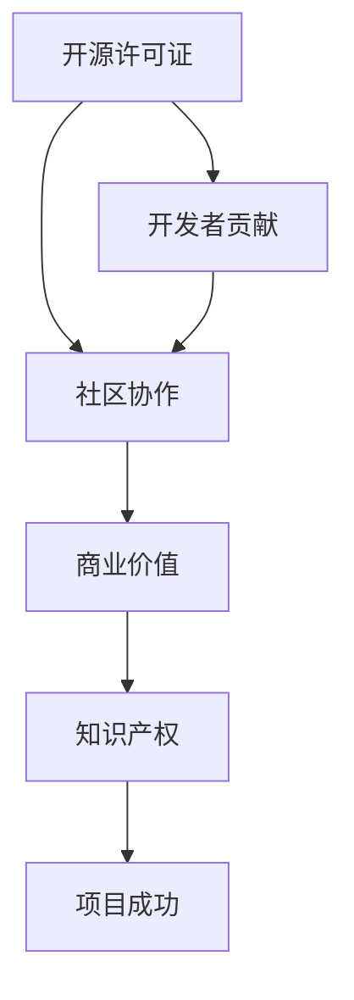

                 

关键词：开源软件，代码贡献，商业化，技术社区，开发者协作

> 摘要：本文将探讨如何将代码贡献转化为商业化的成功案例，分析开源项目在商业领域的潜在价值，并提出一些建议，以帮助开发者更好地实现这一目标。

## 1. 背景介绍

开源软件（Open Source Software, OSS）已经成为现代软件开发的重要组成部分。其核心理念是开放源代码、共享改进，并通过社区协作来推动技术进步。随着时间的推移，越来越多的企业和开发者开始参与开源项目，这不仅促进了技术的创新，也为商业应用提供了丰富的资源。然而，如何将开源代码贡献转化为商业价值，成为许多开发者关注的问题。

本文将结合具体案例，探讨从代码贡献到开源商业化的途径，分析其中涉及的关键要素和策略。通过深入了解这些要素，开发者可以更好地把握开源项目的商业潜力，从而实现个人和组织的双重收益。

## 2. 核心概念与联系

为了更好地理解从代码贡献到开源商业化的过程，我们需要明确以下几个核心概念：

1. **开源许可证**：开源许可证（如GPL、Apache、MIT等）是开发者在使用和分发开源代码时必须遵守的协议。许可证的选择直接影响开源项目的商业用途和策略。

2. **社区协作**：社区协作是开源项目的灵魂。一个活跃、有凝聚力的社区有助于项目的长期发展，并为商业化奠定基础。

3. **商业价值**：商业价值是开发者参与开源项目的重要动力。开源项目可以通过多种方式实现商业价值，例如：技术支持、定制开发、培训、咨询服务等。

4. **知识产权**：知识产权（如版权、专利、商标等）是保护开发者利益和项目价值的关键。合理管理和运用知识产权，有助于提高项目的商业吸引力。

以下是一个简单的 Mermaid 流程图，展示了这些概念之间的联系：



## 3. 核心算法原理 & 具体操作步骤

### 3.1 算法原理概述

从代码贡献到开源商业化的过程可以概括为以下几个步骤：

1. **代码贡献**：开发者通过提交代码、修复bug、添加新功能等方式参与开源项目。
2. **社区认可**：代码贡献需要经过社区评审，确保质量和技术水平符合项目要求。
3. **商业化探索**：在社区认可的基础上，开发者可以尝试将开源项目商业化，探索潜在的商业价值。
4. **知识产权管理**：合理管理知识产权，确保商业化过程中不侵犯他人的权益。
5. **商业模式设计**：根据项目特点和市场需求，设计适合的商业模式，实现商业化目标。

### 3.2 算法步骤详解

1. **代码贡献**
   - 开发者可以在GitHub、GitLab等平台找到感兴趣的开源项目，阅读项目文档，了解项目需求和开发规范。
   - 根据项目需要，编写高质量的代码，提交Pull Request（PR）。
   - 在代码提交过程中，注意遵循开源许可证的要求，明确代码的版权归属。

2. **社区认可**
   - 开源项目的维护者会审查开发者提交的PR，评估代码的质量和实用性。
   - 经过讨论和评审，优秀的代码会被合并到主分支，并获得社区的认可。

3. **商业化探索**
   - 在社区认可的基础上，开发者可以尝试将开源项目商业化。例如，提供技术支持、定制开发、培训等服务。
   - 开发者还需要评估项目的市场需求和潜在客户，确定商业化的方向。

4. **知识产权管理**
   - 开发者应了解开源许可证的具体条款，确保在商业化过程中不侵犯他人的权益。
   - 如果项目包含专利或商标，开发者需要与专利持有者或商标注册机构沟通，确保商业化行为合法。

5. **商业模式设计**
   - 根据项目的特点和市场需求，开发者可以设计不同的商业模式。例如，提供免费软件加增值服务的模式、订阅制等。
   - 开发者还需要考虑市场推广、客户关系管理等方面的策略，确保商业模式的可行性和竞争力。

### 3.3 算法优缺点

**优点：**
- 开源项目可以吸引更多开发者参与，提高代码质量和项目知名度。
- 商业化探索可以为项目带来资金支持，促进项目长期发展。
- 开源许可证保护了开发者的权益，降低了商业化的法律风险。

**缺点：**
- 开源项目的商业化过程可能面临法律风险，需要开发者谨慎处理知识产权问题。
- 商业化探索需要时间和精力，可能会影响开发者对开源项目的贡献。
- 开源项目的商业化可能导致社区冲突，影响项目的稳定性和凝聚力。

### 3.4 算法应用领域

从代码贡献到开源商业化的算法适用于以下领域：

- **软件开发**：开发者可以通过开源项目展示技术实力，吸引潜在客户。
- **人工智能**：开源人工智能项目可以促进技术交流和合作，为企业提供定制化解决方案。
- **大数据**：开源大数据项目可以为企业和开发者提供数据存储、处理和分析的工具。

## 4. 数学模型和公式 & 详细讲解 & 举例说明

### 4.1 数学模型构建

从代码贡献到开源商业化的过程可以用一个简单的数学模型来表示：

\[ \text{商业价值} = f(\text{社区认可}, \text{知识产权管理}, \text{商业模式设计}) \]

其中，商业价值是三个因素（社区认可、知识产权管理、商业模式设计）的函数。每个因素对商业价值的贡献程度不同，具体取决于项目的特点和市场需求。

### 4.2 公式推导过程

1. **社区认可**：社区认可是项目商业化的基础。一个稳定、活跃的社区有助于提高项目的知名度和信任度，从而增加商业价值。

\[ \text{社区认可} = \text{社区规模} \times \text{社区活跃度} \]

2. **知识产权管理**：知识产权管理是确保商业化过程合法的重要环节。合理管理知识产权可以降低法律风险，提高商业价值。

\[ \text{知识产权管理} = \text{专利数量} \times \text{商标数量} \]

3. **商业模式设计**：商业模式设计直接影响项目的盈利能力和市场竞争力。一个适合市场的商业模式可以为项目带来可观的商业价值。

\[ \text{商业模式设计} = \text{市场份额} \times \text{利润率} \]

### 4.3 案例分析与讲解

以Python编程语言的开源项目PyTorch为例，分析其从代码贡献到开源商业化的过程。

1. **社区认可**：PyTorch拥有一个庞大、活跃的社区，吸引了大量开发者参与。社区规模和活跃度较高，为项目商业化奠定了基础。

2. **知识产权管理**：PyTorch的知识产权管理较为完善，涉及多项专利和商标。这有助于降低商业化过程中的法律风险，提高商业价值。

3. **商业模式设计**：PyTorch采用免费软件加增值服务的商业模式。用户可以免费使用PyTorch，但需要为高级功能和技术支持付费。这种模式在市场上具有较强的竞争力。

通过以上分析，可以看出PyTorch在从代码贡献到开源商业化的过程中，充分运用了数学模型中的三个因素，取得了显著的商业价值。

## 5. 项目实践：代码实例和详细解释说明

### 5.1 开发环境搭建

为了更好地理解从代码贡献到开源商业化的过程，我们将以一个简单的Python开源项目为例，展示如何搭建开发环境。

1. **安装Python**：首先，需要在计算机上安装Python。可以从Python官方网站下载安装程序，按照提示完成安装。

2. **配置虚拟环境**：为了保持项目代码的干净和简洁，我们使用虚拟环境来隔离项目依赖。使用以下命令创建虚拟环境：

   ```bash
   python -m venv venv
   ```

   然后激活虚拟环境：

   ```bash
   source venv/bin/activate  # Linux/MacOS
   venv\Scripts\activate     # Windows
   ```

3. **安装依赖库**：在虚拟环境中，使用以下命令安装项目所需的依赖库：

   ```bash
   pip install -r requirements.txt
   ```

   其中，`requirements.txt`文件列出了所有依赖库及其版本。

### 5.2 源代码详细实现

以下是一个简单的Python项目，用于实现一个计算两个数之和的功能。

```python
# sum.py

def add(a, b):
    return a + b

if __name__ == "__main__":
    print(add(2, 3))
```

在这个示例中，我们定义了一个名为`add`的函数，用于计算两个数的和。主程序中调用该函数，并打印结果。

### 5.3 代码解读与分析

1. **函数定义**：`add`函数接收两个参数`a`和`b`，并返回它们的和。函数定义时使用了Python的内置类型`int`，确保参数和返回值都是整数。

2. **主程序**：主程序中，我们使用`if __name__ == "__main__":`语句来判断是否是直接运行该脚本。如果是，则执行以下代码，否则不执行。这样做的好处是，当项目被导入为模块时，主程序不会执行。

3. **打印结果**：主程序调用`add`函数，并将参数`2`和`3`传递给该函数。函数返回和为`5`，并使用`print`函数打印到控制台。

### 5.4 运行结果展示

在虚拟环境中运行该脚本，可以看到以下输出：

```bash
$ python sum.py
5
```

这表明，我们的程序成功地计算了两个数之和，并输出了结果。

## 6. 实际应用场景

从代码贡献到开源商业化的过程在许多实际应用场景中具有重要意义。以下是一些典型的应用场景：

1. **企业内部项目**：企业可以将内部项目开源，吸引外部开发者参与，提高项目的稳定性和性能。同时，企业可以通过提供技术支持、定制开发等服务实现商业化。

2. **开源社区项目**：开源社区项目可以通过吸引更多开发者参与，提高项目的知名度和影响力。商业化可以为项目带来资金支持，促进社区合作。

3. **教育项目**：教育机构可以将教学项目开源，为学生提供实践机会，促进知识传播。同时，教育机构可以通过提供在线课程、辅导服务等方式实现商业化。

4. **技术创新项目**：技术创新项目可以通过开源，吸引业内关注和合作，加速技术进步。商业化可以为项目带来资金支持，进一步推动技术创新。

## 6.4 未来应用展望

随着技术的不断发展，从代码贡献到开源商业化的过程将继续发挥重要作用。以下是一些未来应用展望：

1. **人工智能开源项目**：人工智能领域开源项目将继续增长，为企业提供丰富的技术资源和合作机会。商业化方面，人工智能项目可以通过提供定制化解决方案、技术培训等服务实现价值。

2. **区块链技术**：区块链技术具有广泛的应用前景，开源项目将有助于推动技术的创新和普及。商业化方面，区块链项目可以通过提供区块链应用开发、咨询服务等实现价值。

3. **云计算与大数据**：云计算和大数据领域开源项目将为企业和开发者提供强大的基础设施和技术支持。商业化方面，云计算和大数据项目可以通过提供云服务、数据分析等服务实现价值。

## 7. 工具和资源推荐

为了更好地从代码贡献到开源商业化，开发者可以使用以下工具和资源：

1. **学习资源推荐**
   - 《开源社区协作指南》：了解开源社区的基本规则和协作方式。
   - 《开源许可证详解》：了解不同开源许可证的优缺点，选择合适的许可证。

2. **开发工具推荐**
   - Git：版本控制系统，用于管理代码仓库和协作开发。
   - GitHub、GitLab：开源代码托管平台，提供代码审查、Pull Request等功能。

3. **相关论文推荐**
   - "The Economic Impact of Open Source Software"：探讨开源软件的经济价值。
   - "Open Source Software Development: The Challenges and Opportunities"：分析开源项目的发展挑战和机遇。

## 8. 总结：未来发展趋势与挑战

从代码贡献到开源商业化的过程在技术发展和市场需求的推动下，将继续发挥重要作用。未来发展趋势包括：

1. **开源项目商业化模式的创新**：随着技术进步和市场变化，开发者将探索更多创新的商业模式，提高开源项目的商业价值。
2. **开源社区的合作与竞争**：开源社区将加强合作，共同推动技术的发展。同时，竞争也将促使项目不断创新和优化。

然而，从代码贡献到开源商业化也面临一些挑战：

1. **知识产权保护**：开发者需要了解开源许可证的具体条款，确保在商业化过程中不侵犯他人的权益。
2. **商业化的法律风险**：开发者需要谨慎处理商业化的法律问题，降低潜在的法律风险。

总之，从代码贡献到开源商业化的过程充满机遇和挑战。开发者需要深入了解开源社区和商业市场，灵活运用技术和策略，实现个人和组织的双重收益。

## 9. 附录：常见问题与解答

### Q1：如何选择合适的开源许可证？

**A1**：选择开源许可证时，需要考虑项目的特点和市场需求。例如，如果希望项目可以被广泛使用和修改，可以选择MIT或Apache许可证；如果希望限制项目的商业用途，可以选择GPL许可证。

### Q2：开源项目的商业化是否会破坏社区？

**A2**：开源项目的商业化可能会引起社区争议。然而，合理的管理和沟通可以缓解这一问题。开发者可以通过定期与社区交流，确保商业化行为符合社区价值观和期望。

### Q3：如何保护开源项目的知识产权？

**A3**：开发者可以通过签订知识产权协议、明确项目文档中的版权声明等方式保护开源项目的知识产权。此外，合理选择开源许可证也是保护知识产权的重要手段。

### Q4：开源项目如何进行市场推广？

**A4**：开源项目可以通过以下方式进行市场推广：

1. **社交媒体**：在Twitter、LinkedIn等社交媒体平台上分享项目动态。
2. **技术社区**：在GitHub、Stack Overflow等技术社区发布问题和答案。
3. **线下活动**：参加技术会议和开源社区活动，展示项目亮点。
4. **合作伙伴**：与相关企业、机构建立合作关系，共同推广项目。

## 作者署名

本文作者：禅与计算机程序设计艺术 / Zen and the Art of Computer Programming

感谢您的阅读，希望本文对您从代码贡献到开源商业化的探索有所帮助。如果您有任何问题或建议，欢迎在评论区留言。祝您在开源社区和商业领域取得更多成就！

