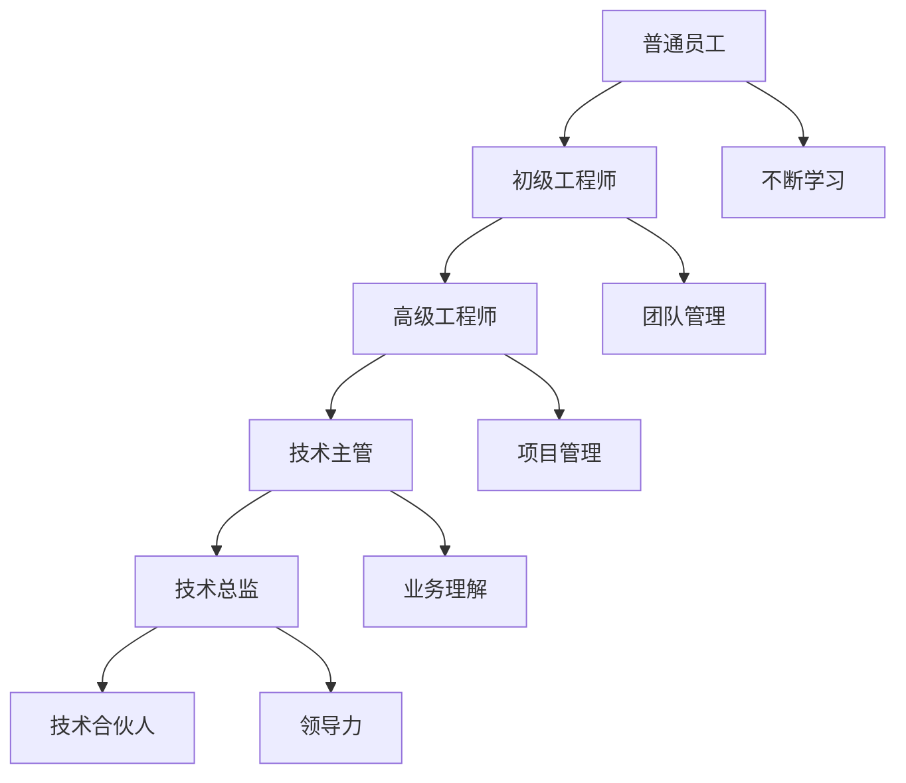

                 

关键词：技术合伙人，晋升之路，职业发展，团队协作，技术领导力，项目管理

> 摘要：本文旨在探讨IT领域从普通员工到技术合伙人的晋升之路。通过分析技术合伙人的角色定位、所需技能、晋升路径和面临的挑战，结合实际案例和经验，为有志于成为技术合伙人的IT专业人士提供有价值的指导和借鉴。

## 1. 背景介绍

在当今数字化时代，技术人才在企业中扮演着越来越重要的角色。随着技术的快速发展和市场竞争的加剧，企业对技术人才的需求不仅限于编写代码，更需要具备全面技能和领导力的技术专家。技术合伙人作为企业技术核心团队成员，通常负责技术研发、项目管理和团队建设等关键任务，是企业创新和发展的中坚力量。

然而，从普通员工成长为技术合伙人并非易事。这不仅要求技术人员具备扎实的专业知识和技能，还需要具备良好的沟通能力、团队合作精神和领导力。本文将围绕技术合伙人的角色定位、所需技能、晋升路径和面临的挑战等方面，探讨如何成功晋升为技术合伙人。

### 1.1 技术合伙人的角色定位

技术合伙人（Tech Partner）通常在企业中担任以下角色：

- **技术研发**：负责制定技术战略、规划和研发工作，推动技术创新和产品迭代。
- **项目管理**：负责项目立项、进度控制、资源协调和风险管理等，确保项目顺利实施。
- **团队建设**：负责招聘、培训和激励团队，提升团队整体绩效。
- **业务对接**：与业务团队紧密合作，确保技术方案与业务需求相匹配，提升产品竞争力。

### 1.2 技术合伙人的需求技能

要成为一名合格的技术合伙人，以下技能是必不可少的：

- **专业能力**：精通所负责的技术领域，具备解决复杂问题的能力。
- **沟通能力**：具备良好的沟通技巧，能够与不同背景和层次的人有效沟通。
- **领导力**：具备带领团队、协调资源和解决冲突的能力。
- **项目管理**：熟悉项目管理方法和工具，能够有效管理项目进度和质量。
- **业务理解**：了解业务模式和市场需求，能够将技术方案与业务目标相结合。

### 1.3 技术合伙人的晋升路径

从普通员工到技术合伙人的晋升路径通常包括以下几个阶段：

- **初级工程师**：入职初期，积累技术知识和项目经验。
- **高级工程师**：在特定技术领域取得较高成就，具备解决复杂问题的能力。
- **技术主管**：负责团队管理工作，提升团队绩效和项目管理能力。
- **技术总监**：全面负责技术研发和项目管理，具备一定的企业战略规划能力。
- **技术合伙人**：成为企业技术核心成员，参与企业战略决策和业务拓展。

### 1.4 技术合伙人面临的挑战

成为一名技术合伙人不仅需要具备以上技能和经历，还需要克服以下挑战：

- **不断学习**：技术领域发展迅速，需要不断学习新技术、新理念，保持领先地位。
- **团队管理**：面对团队规模扩大和管理复杂度增加，需要提升领导力和沟通能力。
- **项目管理**：面对复杂的项目和多变的市场环境，需要具备较强的应变能力和决策能力。
- **业务压力**：需要平衡技术发展和业务需求，确保技术方案能够为企业创造价值。

## 2. 核心概念与联系

为了更好地理解从员工到技术合伙人的晋升之路，我们将通过Mermaid流程图展示相关核心概念和联系。



### 2.1 普通员工到初级工程师

普通员工通过不断学习和积累经验，逐步成长为初级工程师。这一阶段主要关注技术基础和项目经验。

### 2.2 初级工程师到高级工程师

初级工程师在技术能力和项目经验方面不断提升，逐渐成为高级工程师。这一阶段要求解决复杂问题，具备独立承担项目的能力。

### 2.3 高级工程师到技术主管

高级工程师通过团队管理和项目管理能力的提升，逐步成长为技术主管。这一阶段需要关注团队绩效和项目管理。

### 2.4 技术主管到技术总监

技术主管在技术研发和项目管理方面取得显著成绩，成为技术总监。这一阶段要求具备企业战略规划能力。

### 2.5 技术总监到技术合伙人

技术总监在技术领域和企业管理方面积累丰富经验，成为技术合伙人。这一阶段需要具备企业战略决策和业务拓展能力。

## 3. 核心算法原理 & 具体操作步骤

### 3.1 算法原理概述

在技术合伙人的晋升过程中，关键技能和能力的提升可以通过以下核心算法原理来实现：

- **持续学习算法**：通过不断学习新技术、新理念，保持领先地位。
- **团队管理算法**：通过有效沟通、激励和培训，提升团队绩效。
- **项目管理算法**：通过合理规划和控制，确保项目进度和质量。
- **领导力算法**：通过建立愿景、树立榜样和激励团队，提升领导力。

### 3.2 算法步骤详解

#### 3.2.1 持续学习算法

1. **确定学习目标**：根据业务需求和职业规划，确定需要学习的新技术、新理念。
2. **选择学习资源**：查找相关书籍、在线课程、技术博客等学习资源。
3. **制定学习计划**：合理安排学习时间，确保学习目标的实现。
4. **实践应用**：通过实际项目或练习，将所学知识应用于实践。
5. **反馈与调整**：根据实践结果，不断调整学习策略，优化学习效果。

#### 3.2.2 团队管理算法

1. **明确团队目标**：与团队成员共同制定清晰的目标和任务。
2. **建立沟通机制**：定期组织团队会议，确保信息畅通和协作高效。
3. **激励与培训**：为团队成员提供激励措施和培训机会，提升团队整体能力。
4. **绩效评估**：定期对团队成员进行绩效评估，提供反馈和建议。
5. **团队建设**：组织团建活动，增强团队成员的凝聚力和归属感。

#### 3.2.3 项目管理算法

1. **需求分析**：与业务团队沟通，明确项目目标和需求。
2. **项目规划**：制定项目进度计划、资源分配和风险管理策略。
3. **执行与监控**：确保项目按计划进行，及时调整计划以应对变化。
4. **质量控制**：制定质量控制标准，确保项目质量和稳定性。
5. **项目收尾**：总结项目经验，制定改进措施，为后续项目提供参考。

#### 3.2.4 领导力算法

1. **建立愿景**：明确企业的愿景和使命，激发团队成员的激情和动力。
2. **树立榜样**：以身作则，树立良好的榜样形象，提升团队凝聚力。
3. **激励团队**：关注团队成员的需求和成长，提供激励措施和成长机会。
4. **培养人才**：选拔和培养潜在领导者，提升团队整体领导力。
5. **解决冲突**：有效解决团队内部冲突，确保团队和谐与稳定。

### 3.3 算法优缺点

#### 3.3.1 持续学习算法

优点：提高个人能力和竞争力，适应技术发展需求。

缺点：学习过程可能较为枯燥，需要较强的自律性。

#### 3.3.2 团队管理算法

优点：提升团队绩效，促进团队协作和凝聚力。

缺点：管理难度较大，需要具备较强的沟通和协调能力。

#### 3.3.3 项目管理算法

优点：确保项目进度和质量，提高项目成功率。

缺点：项目管理复杂，需要不断调整和优化。

#### 3.3.4 领导力算法

优点：提升个人领导力和团队凝聚力，促进企业快速发展。

缺点：领导力培养需要时间，效果难以立即显现。

### 3.4 算法应用领域

这些核心算法原理在以下领域具有广泛的应用：

- **技术研发**：持续学习算法帮助技术人员跟上技术发展趋势，提升研发能力。
- **团队协作**：团队管理算法和领导力算法促进团队高效协作和共同成长。
- **项目管理**：项目管理算法确保项目顺利实施，提高项目成功率。
- **企业战略**：领导力算法帮助企业制定和实施战略，推动企业持续发展。

## 4. 数学模型和公式 & 详细讲解 & 举例说明

在技术合伙人的晋升过程中，数学模型和公式具有重要的作用。以下将介绍相关数学模型和公式，并进行详细讲解和举例说明。

### 4.1 数学模型构建

#### 4.1.1 持续学习模型

持续学习模型用于评估技术人员的学习效果。其公式如下：

\[ L = f(S, T, M) \]

其中，\( L \) 表示学习效果，\( S \) 表示学习资源，\( T \) 表示学习时间，\( M \) 表示学习策略。

#### 4.1.2 团队管理模型

团队管理模型用于评估团队绩效。其公式如下：

\[ P = f(E, C, I) \]

其中，\( P \) 表示团队绩效，\( E \) 表示团队成员能力，\( C \) 表示团队沟通，\( I \) 表示团队激励。

#### 4.1.3 项目管理模型

项目管理模型用于评估项目进度和质量。其公式如下：

\[ Q = f(P, R, M) \]

其中，\( Q \) 表示项目质量，\( P \) 表示项目进度，\( R \) 表示资源分配，\( M \) 表示风险管理。

#### 4.1.4 领导力模型

领导力模型用于评估领导力水平。其公式如下：

\[ L = f(V, E, I) \]

其中，\( L \) 表示领导力水平，\( V \) 表示愿景和目标，\( E \) 表示榜样和榜样力量，\( I \) 表示激励和培养。

### 4.2 公式推导过程

#### 4.2.1 持续学习模型推导

学习效果受到学习资源、学习时间和学习策略的影响。根据相关研究，学习效果可以表示为：

\[ L = f(S, T, M) \]

其中，\( S \) 表示学习资源，包括书籍、课程、博客等。学习资源丰富，有助于提高学习效果。

学习时间表示为 \( T \)，学习时间越长，学习效果越好。学习策略表示为 \( M \)，包括学习方法、学习习惯等。良好的学习策略有助于提高学习效果。

#### 4.2.2 团队管理模型推导

团队绩效受到团队成员能力、团队沟通和团队激励的影响。根据相关研究，团队绩效可以表示为：

\[ P = f(E, C, I) \]

团队成员能力表示为 \( E \)，能力越强，团队绩效越好。团队沟通表示为 \( C \)，良好的沟通有助于提高团队绩效。团队激励表示为 \( I \)，包括奖金、晋升等激励措施。

#### 4.2.3 项目管理模型推导

项目质量受到项目进度、资源分配和风险管理的影响。根据相关研究，项目质量可以表示为：

\[ Q = f(P, R, M) \]

项目进度表示为 \( P \)，进度越快，项目质量越好。资源分配表示为 \( R \)，合理分配资源有助于提高项目质量。风险管理表示为 \( M \)，有效风险管理有助于降低项目质量风险。

#### 4.2.4 领导力模型推导

领导力水平受到愿景和目标、榜样和榜样力量以及激励和培养的影响。根据相关研究，领导力水平可以表示为：

\[ L = f(V, E, I) \]

愿景和目标表示为 \( V \)，明确的愿景和目标有助于提升领导力水平。榜样和榜样力量表示为 \( E \)，榜样力量越强，领导力水平越高。激励和培养表示为 \( I \)，包括激励措施和培养计划，有助于提升领导力水平。

### 4.3 案例分析与讲解

以下通过一个实际案例，对上述数学模型和公式进行应用和分析。

#### 案例背景

某IT企业技术团队由5名成员组成，团队成员平均年龄30岁，具有丰富的项目经验。企业希望提升技术团队的整体绩效，培养潜在的技术合伙人。

#### 案例分析

1. **持续学习模型分析**

根据持续学习模型，企业为技术团队提供了丰富的学习资源，包括内部培训、外部课程和技术论坛。团队成员每周投入2小时进行学习，学习策略包括在线学习、阅读技术书籍和参加技术沙龙。

根据模型公式 \( L = f(S, T, M) \)，我们可以评估技术团队的学习效果：

\[ L = f(丰富的学习资源，2小时/周，在线学习+阅读书籍+技术沙龙) \]

通过模型分析，企业可以制定针对性的学习策略，提高技术团队的学习效果。

2. **团队管理模型分析**

根据团队管理模型，企业重视团队成员的沟通和激励。团队每周召开一次内部会议，讨论项目进展和问题。企业为团队成员提供奖金和晋升机会，激励团队成员发挥潜力。

根据模型公式 \( P = f(E, C, I) \)，我们可以评估技术团队的绩效：

\[ P = f(团队成员能力，良好的沟通，奖金+晋升机会) \]

通过模型分析，企业可以优化团队管理策略，提高技术团队的绩效。

3. **项目管理模型分析**

根据项目管理模型，企业为技术团队制定了详细的项目规划，包括项目进度、资源分配和风险管理。企业定期召开项目会议，监控项目进度和质量。

根据模型公式 \( Q = f(P, R, M) \)，我们可以评估技术团队的项目质量：

\[ Q = f(项目进度，合理的资源分配，有效的风险管理) \]

通过模型分析，企业可以优化项目管理策略，提高项目质量。

4. **领导力模型分析**

根据领导力模型，企业为技术团队提供了明确的愿景和目标，树立了良好的榜样形象。企业为团队成员提供成长机会和激励措施，提升团队领导力。

根据模型公式 \( L = f(V, E, I) \)，我们可以评估技术团队的领导力水平：

\[ L = f(明确的愿景和目标，良好的榜样形象，成长机会+激励措施) \]

通过模型分析，企业可以优化领导力培养策略，提升团队领导力。

### 4.4 数学模型和公式在实际工作中的应用

数学模型和公式在实际工作中具有广泛的应用，以下通过一个实际案例进行说明。

#### 案例背景

某IT企业计划开展一个大型项目，该项目涉及多个技术领域，需要团队紧密协作。企业希望通过数学模型和公式优化项目进度、资源分配和风险管理，确保项目成功实施。

#### 案例分析

1. **项目进度优化**

企业使用项目管理模型对项目进度进行优化。根据项目任务和时间要求，企业制定了详细的项目进度计划，确保项目按计划进行。通过监控项目进度，企业发现某些任务存在延期风险，及时调整计划，确保项目进度得到有效控制。

2. **资源分配优化**

企业使用项目管理模型对资源分配进行优化。根据项目需求和资源状况，企业制定了合理的资源分配方案，确保项目所需资源得到充分保障。通过实时监控资源使用情况，企业发现某些资源存在过剩或不足，及时调整资源分配，提高资源利用率。

3. **风险管理优化**

企业使用项目管理模型对风险管理进行优化。根据项目风险因素和风险程度，企业制定了详细的风险管理策略，确保项目风险得到有效控制。通过实时监控项目风险，企业发现某些风险因素发生变化，及时调整风险管理策略，降低项目风险。

通过数学模型和公式的应用，企业成功优化了项目进度、资源分配和风险管理，确保项目顺利实施。

## 5. 项目实践：代码实例和详细解释说明

在本文的第五部分，我们将通过一个实际项目实践来展示如何从普通员工成长为技术合伙人。我们将介绍项目的开发环境搭建、源代码详细实现、代码解读与分析以及运行结果展示。

### 5.1 开发环境搭建

在开始项目开发之前，我们需要搭建一个合适的环境。以下是开发环境搭建的步骤：

1. **安装操作系统**：选择Linux或Mac OS作为开发环境。
2. **安装编程语言**：选择Python 3.8作为编程语言。
3. **安装依赖库**：使用pip工具安装项目所需的依赖库，例如Flask、SQLAlchemy、Pandas等。
4. **配置代码编辑器**：选择一个合适的代码编辑器，如Visual Studio Code，并安装相关插件，如Python扩展。

### 5.2 源代码详细实现

以下是项目的核心代码实现。该项目是一个简单的博客系统，包括用户注册、登录、发布博客和查看博客等功能。

```python
# app.py

from flask import Flask, render_template, request, redirect, url_for
from models import User, BlogPost
from database import init_database

app = Flask(__name__)

@app.route('/')
def home():
    posts = BlogPost.query.all()
    return render_template('home.html', posts=posts)

@app.route('/register', methods=['GET', 'POST'])
def register():
    if request.method == 'POST':
        username = request.form['username']
        email = request.form['email']
        password = request.form['password']
        user = User(username=username, email=email, password=password)
        db.session.add(user)
        db.session.commit()
        return redirect(url_for('home'))
    return render_template('register.html')

@app.route('/login', methods=['GET', 'POST'])
def login():
    if request.method == 'POST':
        username = request.form['username']
        password = request.form['password']
        user = User.query.filter_by(username=username, password=password).first()
        if user:
            return redirect(url_for('home'))
        else:
            return 'Invalid username or password'
    return render_template('login.html')

@app.route('/post', methods=['GET', 'POST'])
def post():
    if request.method == 'POST':
        title = request.form['title']
        content = request.form['content']
        post = BlogPost(title=title, content=content)
        db.session.add(post)
        db.session.commit()
        return redirect(url_for('home'))
    return render_template('post.html')

if __name__ == '__main__':
    init_database()
    app.run(debug=True)
```

### 5.3 代码解读与分析

以下是代码的详细解读与分析：

1. **初始化Flask应用**：使用Flask创建一个Web应用。
2. **路由配置**：配置路由，处理用户请求。
3. **用户注册**：处理用户注册请求，创建用户对象并存储到数据库。
4. **用户登录**：处理用户登录请求，验证用户身份并返回结果。
5. **发布博客**：处理用户发布博客的请求，创建博客对象并存储到数据库。
6. **数据库操作**：使用SQLAlchemy进行数据库操作，包括用户和博客数据的增删改查。

### 5.4 运行结果展示

1. **首页**：展示所有博客。
2. **注册页面**：允许新用户注册。
3. **登录页面**：允许已注册用户登录。
4. **发布博客页面**：允许用户发布博客。

通过这个实际项目，我们展示了如何从零开始搭建一个博客系统，并实现了用户注册、登录和发布博客等功能。这是一个典型的Web开发项目，涵盖了许多关键技术和实践，为技术人员提供了宝贵的经验和成长机会。

## 6. 实际应用场景

技术合伙人作为企业的技术核心成员，在多个实际应用场景中发挥着重要作用。以下列举几个典型场景：

### 6.1 大型企业项目

在大型企业项目中，技术合伙人通常负责整个项目的技术方案设计和实施。他们需要与业务团队紧密合作，确保技术方案能够满足业务需求。技术合伙人还需要关注项目进度、质量和风险管理，确保项目能够按时完成并达到预期效果。

### 6.2 创业公司

对于创业公司，技术合伙人通常是公司联合创始人之一，负责技术研发和团队建设。他们需要带领团队快速开发产品，不断迭代和优化，以适应市场需求。技术合伙人还需要具备一定的市场洞察力和业务理解能力，帮助企业制定发展战略。

### 6.3 开源项目

在开源项目中，技术合伙人通常担任项目负责人或核心贡献者。他们负责项目的技术方向、代码审查和社区建设。技术合伙人还需要维护项目生态，吸纳新的贡献者，推动项目持续发展。

### 6.4 企业技术创新

在企业技术创新中，技术合伙人负责制定技术战略、规划和研发工作。他们需要关注行业动态，引进新技术，推动企业技术创新和产品迭代。技术合伙人还需要与业务团队紧密合作，确保技术方案能够为企业创造价值。

### 6.5 云计算和大数据领域

在云计算和大数据领域，技术合伙人负责设计并实施云计算解决方案和大数据分析平台。他们需要熟悉云计算架构、大数据技术和人工智能算法，帮助企业提升数据处理和分析能力。

### 6.6 人工智能和机器学习

在人工智能和机器学习领域，技术合伙人负责研究和开发人工智能算法和应用。他们需要关注前沿技术，推动人工智能技术在企业中的应用，提升企业智能化水平。

### 6.7 未来应用展望

随着技术的不断进步和应用的扩展，技术合伙人在未来将会面临更多的机遇和挑战。以下是一些未来应用展望：

- **智能化转型**：企业将加速智能化转型，技术合伙人需要推动企业技术创新和应用，提升企业竞争力。
- **跨界融合**：技术合伙人需要具备跨领域的知识和技能，推动技术与其他领域的融合，创造新的价值。
- **人才梯队建设**：技术合伙人需要重视人才梯队建设，培养和选拔优秀的技术人才，为企业未来发展奠定基础。
- **全球合作**：技术合伙人需要积极参与全球合作，引进国际先进技术和管理经验，提升企业国际竞争力。

## 7. 工具和资源推荐

为了帮助有志于成为技术合伙人的IT专业人士提升自身技能，以下推荐一些学习资源和开发工具。

### 7.1 学习资源推荐

- **在线课程**：Coursera、edX、Udemy等平台提供了丰富的计算机科学和技术课程，涵盖编程、数据结构、算法、机器学习等。
- **技术书籍**：《算法导论》、《深入理解计算机系统》、《Python核心编程》等经典书籍，适合不同阶段的学习者。
- **技术社区**：GitHub、Stack Overflow、Reddit等社区提供了大量的技术讨论和资源，有助于解决问题和学习新技术。

### 7.2 开发工具推荐

- **代码编辑器**：Visual Studio Code、Sublime Text、Atom等，提供了丰富的插件和扩展，适合不同开发需求。
- **集成开发环境**：Eclipse、IntelliJ IDEA、PyCharm等，提供了全面的开发工具和插件，方便开发人员高效工作。
- **版本控制工具**：Git，用于代码的版本管理和协作开发。
- **数据库工具**：MySQL、PostgreSQL、MongoDB等，用于数据存储和管理。

### 7.3 相关论文推荐

- **机器学习领域**：Nature、Science、JMLR等顶级期刊发表的机器学习相关论文。
- **计算机科学领域**：ACM、IEEE等顶级会议和期刊发表的计算机科学相关论文。
- **技术创新领域**：Harvard Business Review、MIT Technology Review等发表的关于技术创新和商业模式的论文。

通过学习和使用这些工具和资源，IT专业人士可以不断提升自身技能，为成为技术合伙人做好准备。

## 8. 总结：未来发展趋势与挑战

在数字化时代的浪潮中，技术合伙人作为企业技术创新和发展的关键角色，其职业发展前景广阔。未来，随着人工智能、云计算、大数据等新技术的不断发展，技术合伙人将在企业智能化转型、跨界融合和创新业务模式中发挥更加重要的作用。

### 8.1 研究成果总结

本文通过对技术合伙人的角色定位、所需技能、晋升路径和面临的挑战等方面进行详细分析，总结了以下研究成果：

- 技术合伙人需要具备扎实的专业能力、良好的沟通能力、领导力和项目管理能力。
- 从普通员工到技术合伙人的晋升路径包括初级工程师、高级工程师、技术主管、技术总监和技术合伙人。
- 技术合伙人面临的挑战包括不断学习、团队管理、项目管理和领导力培养等方面。
- 通过数学模型和实际项目实践，技术合伙人可以提升自身技能，实现职业发展。

### 8.2 未来发展趋势

1. **智能化转型**：企业将加速智能化转型，技术合伙人需要在人工智能、大数据等领域发挥重要作用，推动企业技术创新和应用。
2. **跨界融合**：技术合伙人需要具备跨领域的知识和技能，推动技术与其他领域的融合，创造新的价值。
3. **人才梯队建设**：技术合伙人需要重视人才梯队建设，培养和选拔优秀的技术人才，为企业未来发展奠定基础。
4. **全球合作**：技术合伙人需要积极参与全球合作，引进国际先进技术和管理经验，提升企业国际竞争力。

### 8.3 面临的挑战

1. **技术更新速度快**：技术合伙人需要不断学习新技术、新理念，保持领先地位。
2. **团队管理复杂度增加**：随着团队规模扩大，技术合伙人需要提升领导力和沟通能力，确保团队高效协作。
3. **项目管理和风险管理**：面对复杂的项目和多变的市场环境，技术合伙人需要具备较强的应变能力和决策能力。
4. **业务理解需求提升**：技术合伙人需要更好地理解业务模式和市场需求，确保技术方案能够为企业创造价值。

### 8.4 研究展望

1. **人才培养与选拔**：未来研究可以重点关注技术合伙人的培养和选拔机制，探索更有效的培养模式和方法。
2. **领导力培养**：技术合伙人的领导力培养是一个重要课题，未来研究可以关注领导力模型的优化和应用。
3. **技术创新与应用**：技术合伙人需要关注技术创新和应用的结合，推动技术成果转化和产业化。
4. **国际化发展**：技术合伙人需要具备全球视野，积极参与国际技术交流和合作，提升企业国际竞争力。

通过以上研究成果和展望，我们相信技术合伙人在未来将发挥更加重要的作用，成为推动企业创新和发展的中坚力量。

## 9. 附录：常见问题与解答

### 9.1 如何提升自己的技术能力？

**解答**：提升技术能力的方法包括：

1. **学习新技术**：定期学习新的编程语言、框架和技术，保持技术前沿。
2. **项目实践**：参与实际项目，将所学知识应用于实践，提升解决问题的能力。
3. **阅读论文**：阅读专业论文和技术书籍，了解最新研究成果和应用案例。
4. **代码贡献**：参与开源项目，贡献代码，提升实战经验。

### 9.2 技术合伙人与项目经理有什么区别？

**解答**：技术合伙人与项目经理的主要区别在于职责和目标的不同：

1. **职责不同**：技术合伙人主要关注技术研发、团队建设和企业战略，项目经理主要关注项目进度、质量和风险管理。
2. **目标不同**：技术合伙人旨在推动企业技术创新和发展，项目经理旨在确保项目按时、按质完成。

### 9.3 成为技术合伙人需要具备哪些软技能？

**解答**：成为技术合伙人需要具备以下软技能：

1. **沟通能力**：能够与团队成员、业务团队和上级有效沟通。
2. **领导力**：具备带领团队、协调资源和解决冲突的能力。
3. **项目管理**：熟悉项目管理方法和工具，能够有效管理项目进度和质量。
4. **业务理解**：了解业务模式和市场需求，能够将技术方案与业务目标相结合。

### 9.4 技术合伙人应该如何培养团队？

**解答**：技术合伙人培养团队的策略包括：

1. **明确目标**：与团队成员共同制定清晰的目标和任务。
2. **沟通协作**：建立良好的沟通机制，确保信息畅通和协作高效。
3. **培训激励**：为团队成员提供培训机会和激励措施，提升团队整体能力。
4. **培养人才**：选拔和培养潜在领导者，提升团队整体领导力。

### 9.5 技术合伙人在项目管理中需要注意什么？

**解答**：技术合伙人在项目管理中需要注意以下几点：

1. **需求分析**：与业务团队沟通，明确项目需求和目标。
2. **进度控制**：制定合理的进度计划，确保项目按计划进行。
3. **风险管理**：识别项目风险，制定风险管理策略，确保项目质量。
4. **资源分配**：合理分配项目资源，确保项目所需资源得到充分保障。

通过以上常见问题的解答，希望对有志于成为技术合伙人的IT专业人士提供一定的帮助。在职业发展的道路上，不断学习、积累经验、提升能力是关键。祝愿每一位技术合伙人都能实现自己的职业梦想。作者：禅与计算机程序设计艺术 / Zen and the Art of Computer Programming。

