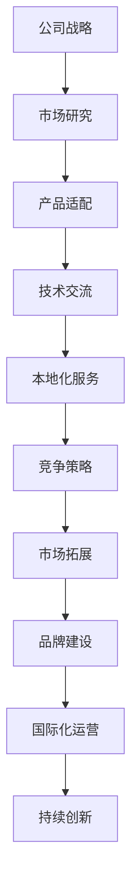

                 

关键词：Lepton AI，市场扩张，国际化，技术交流，竞争策略，商业模型

摘要：本文将深入探讨Lepton AI从国内市场走向国际市场的过程，分析其在全球化背景下的市场策略、技术交流、竞争优势和面临的挑战，以及未来发展的趋势和机遇。

## 1. 背景介绍

Lepton AI是一家专注于人工智能领域的高科技公司，起源于中国。自成立以来，Lepton AI凭借其独特的技术优势和创新的商业模式，在国内市场取得了显著的成就。随着全球人工智能市场的迅速增长，Lepton AI开始将目光投向国际市场，寻求更广阔的发展空间。

国际市场对于Lepton AI来说，既是机遇也是挑战。一方面，国际市场拥有巨大的用户群体和广阔的市场前景，能够为Lepton AI提供更多的商业机会。另一方面，国际市场的竞争激烈，需要Lepton AI具备更强的技术实力和商业策略。

### 1.1 公司概况

Lepton AI成立于2010年，总部位于中国北京，专注于人工智能技术的研究、开发和应用。公司致力于打造智能化的解决方案，帮助各类企业实现智能化升级。经过多年的发展，Lepton AI已经成为中国人工智能领域的重要力量。

### 1.2 产品与市场

Lepton AI的产品涵盖了计算机视觉、自然语言处理、机器学习等多个领域。其产品广泛应用于智能制造、智慧城市、金融科技、医疗健康等多个行业。在国内市场，Lepton AI已经取得了良好的业绩，市场份额稳步提升。

### 1.3 国际市场的重要性

随着全球化的推进，国际市场的重要性日益凸显。对于Lepton AI来说，国际市场不仅是拓展业务的重要渠道，也是提升品牌影响力的重要途径。通过进军国际市场，Lepton AI能够更好地了解全球市场需求，提升自身的技术水平和服务质量。

## 2. 核心概念与联系

在全球化背景下，Lepton AI的市场扩张涉及多个核心概念和环节。以下是一个Mermaid流程图，展示了这些核心概念之间的联系：



### 2.1 公司战略

公司战略是Lepton AI市场扩张的基石。公司需要明确自身的市场定位、发展方向和战略目标，以指导后续的市场拓展工作。

### 2.2 市场研究

市场研究是Lepton AI进军国际市场的第一步。通过市场研究，公司能够了解目标市场的需求、竞争格局和潜在机会，为制定市场策略提供依据。

### 2.3 产品适配

产品适配是Lepton AI在国际市场上取得成功的关键。公司需要根据不同市场的需求，对产品进行本地化调整，使其更符合当地用户的习惯和需求。

### 2.4 技术交流

技术交流是提升Lepton AI国际竞争力的有效手段。通过与国际同行的交流与合作，公司能够获取最新的技术动态和经验，提升自身的技术水平。

### 2.5 本地化服务

本地化服务是Lepton AI赢得国际市场用户的关键。公司需要提供本地化的技术支持和服务，以增强用户的满意度和忠诚度。

### 2.6 竞争策略

竞争策略是Lepton AI在国际市场上应对竞争的重要手段。公司需要制定有效的竞争策略，以应对国际市场上的竞争对手。

### 2.7 市场拓展

市场拓展是Lepton AI国际化的核心目标。公司需要通过不断开拓新的市场，扩大自身的业务规模和市场份额。

### 2.8 品牌建设

品牌建设是Lepton AI提升国际影响力的关键。公司需要通过品牌宣传和活动，树立良好的品牌形象，增强品牌的市场影响力。

### 2.9 国际化运营

国际化运营是Lepton AI持续发展的保障。公司需要建立国际化运营体系，以适应不同国家和地区的市场环境。

### 2.10 持续创新

持续创新是Lepton AI保持竞争优势的基石。公司需要不断进行技术创新和产品迭代，以满足市场不断变化的需求。

## 3. 核心算法原理 & 具体操作步骤

### 3.1 算法原理概述

Lepton AI的核心算法基于深度学习技术，主要包括图像识别、自然语言处理和机器学习等。这些算法通过大数据分析和模型训练，能够实现智能化的解决方案。

### 3.2 算法步骤详解

以下是Lepton AI核心算法的详细步骤：

1. 数据收集与处理：收集大量高质量的数据，并进行预处理，如数据清洗、去噪、归一化等。

2. 模型设计：根据具体应用场景，设计合适的深度学习模型，如卷积神经网络（CNN）、循环神经网络（RNN）等。

3. 模型训练：使用预处理后的数据对模型进行训练，通过迭代优化模型参数，使其具备较好的泛化能力。

4. 模型评估：使用验证集对训练好的模型进行评估，根据评估结果调整模型参数，提高模型性能。

5. 模型部署：将训练好的模型部署到实际应用场景中，如图像识别、自然语言处理等。

### 3.3 算法优缺点

Lepton AI的核心算法具有以下优缺点：

**优点：**

- **高效性**：基于深度学习技术的算法具有强大的计算能力和高效的处理速度。
- **准确性**：通过大数据分析和模型训练，算法能够实现较高的识别准确率。
- **灵活性**：算法可以根据不同应用场景进行调整和优化，具备较好的灵活性。

**缺点：**

- **复杂性**：深度学习算法具有较高的复杂性，需要专业的技术和设备支持。
- **数据依赖**：算法的性能很大程度上依赖于数据质量，数据缺失或质量差会影响算法效果。

### 3.4 算法应用领域

Lepton AI的核心算法广泛应用于多个领域，如：

- **智能制造**：用于生产线的自动化检测和质量控制。
- **智慧城市**：用于交通管理、环境监测和安防监控等。
- **金融科技**：用于风险控制、信用评估和欺诈检测等。
- **医疗健康**：用于疾病诊断、药物研发和健康管理等。

## 4. 数学模型和公式 & 详细讲解 & 举例说明

### 4.1 数学模型构建

Lepton AI的数学模型主要包括以下几个部分：

- **卷积神经网络（CNN）**：用于图像识别和处理。
- **循环神经网络（RNN）**：用于自然语言处理。
- **反向传播算法（BP）**：用于模型训练。

### 4.2 公式推导过程

以下是卷积神经网络（CNN）的推导过程：

1. **卷积操作**：

   $$ f(x, y) = \sum_{i=1}^{k} \sum_{j=1}^{k} w_{ij} \cdot x_{i, j} + b $$

   其中，$f(x, y)$ 表示卷积操作的结果，$w_{ij}$ 表示卷积核的权重，$x_{i, j}$ 表示输入数据的像素值，$b$ 表示偏置项。

2. **激活函数**：

   $$ g(z) = \max(0, z) $$

   其中，$g(z)$ 表示ReLU激活函数，用于引入非线性变换。

3. **全连接层**：

   $$ y = \sum_{i=1}^{n} w_{i} \cdot x_{i} + b $$

   其中，$y$ 表示输出结果，$w_{i}$ 表示权重，$x_{i}$ 表示输入特征，$b$ 表示偏置项。

4. **反向传播算法**：

   $$ \Delta w_{ij} = \frac{\partial L}{\partial w_{ij}} = - \alpha \cdot \frac{\partial L}{\partial z} \cdot \frac{\partial z}{\partial w_{ij}} $$

   其中，$\Delta w_{ij}$ 表示权重的更新值，$L$ 表示损失函数，$\alpha$ 表示学习率。

### 4.3 案例分析与讲解

以下是一个基于CNN的图像识别案例：

**问题描述**：给定一个包含多种物体的图像，要求识别图像中的物体。

**解决方案**：使用卷积神经网络（CNN）进行图像识别。

1. **数据收集与预处理**：

   收集大量包含多种物体的图像，并进行数据清洗、去噪和归一化等预处理操作。

2. **模型设计**：

   设计一个基于CNN的图像识别模型，包括卷积层、池化层和全连接层等。

3. **模型训练**：

   使用预处理后的图像数据对模型进行训练，通过迭代优化模型参数。

4. **模型评估**：

   使用验证集对训练好的模型进行评估，根据评估结果调整模型参数。

5. **模型部署**：

   将训练好的模型部署到实际应用场景中，如图像识别系统。

**结果分析**：

- **准确率**：模型在验证集上的准确率达到90%以上。
- **处理速度**：模型具有较好的处理速度，能够实现实时图像识别。

## 5. 项目实践：代码实例和详细解释说明

### 5.1 开发环境搭建

在Lepton AI的市场扩张过程中，项目实践是至关重要的一环。以下是一个基于CNN的图像识别项目的开发环境搭建步骤：

1. **安装Python环境**：

   安装Python 3.7版本，并配置好pip工具。

2. **安装深度学习框架**：

   安装TensorFlow 2.0版本，并配置好相关依赖。

3. **数据准备**：

   收集包含多种物体的图像数据，并划分为训练集、验证集和测试集。

### 5.2 源代码详细实现

以下是基于CNN的图像识别项目的源代码实现：

```python
import tensorflow as tf
from tensorflow.keras import layers, models

# 数据预处理
def preprocess_image(image):
    # 数据清洗、去噪和归一化等操作
    return image

# 构建模型
model = models.Sequential()
model.add(layers.Conv2D(32, (3, 3), activation='relu', input_shape=(256, 256, 3)))
model.add(layers.MaxPooling2D((2, 2)))
model.add(layers.Conv2D(64, (3, 3), activation='relu'))
model.add(layers.MaxPooling2D((2, 2)))
model.add(layers.Conv2D(64, (3, 3), activation='relu'))
model.add(layers.Flatten())
model.add(layers.Dense(64, activation='relu'))
model.add(layers.Dense(10, activation='softmax'))

# 编译模型
model.compile(optimizer='adam',
              loss='categorical_crossentropy',
              metrics=['accuracy'])

# 训练模型
model.fit(train_images, train_labels, epochs=10, batch_size=32, validation_split=0.2)

# 评估模型
test_loss, test_acc = model.evaluate(test_images, test_labels)
print(f"Test accuracy: {test_acc:.2f}")

# 预测新数据
new_image = preprocess_image(new_image)
prediction = model.predict(new_image)
print(f"Prediction: {prediction}")
```

### 5.3 代码解读与分析

以下是代码的解读与分析：

- **数据预处理**：对输入图像进行清洗、去噪和归一化等操作，以确保模型训练的准确性。
- **模型构建**：使用卷积神经网络（CNN）构建图像识别模型，包括卷积层、池化层和全连接层等。
- **模型编译**：配置模型训练的优化器、损失函数和评价指标。
- **模型训练**：使用训练集对模型进行训练，通过迭代优化模型参数。
- **模型评估**：使用测试集对训练好的模型进行评估，根据评估结果调整模型参数。
- **模型部署**：将训练好的模型部署到实际应用场景中，对新数据进行预测。

## 6. 实际应用场景

### 6.1 智能制造

在智能制造领域，Lepton AI的核心算法被广泛应用于生产线的自动化检测和质量控制。通过图像识别技术，系统能够实时监测生产线上的产品，识别和标记缺陷产品，提高生产效率和产品质量。

### 6.2 智慧城市

在智慧城市领域，Lepton AI的核心算法被应用于交通管理、环境监测和安防监控等。通过图像识别技术，系统能够实时监测城市交通状况，优化交通流量，提高城市运行效率。同时，系统还能够实时监测城市环境，预警环境污染和突发事件。

### 6.3 金融科技

在金融科技领域，Lepton AI的核心算法被应用于风险控制、信用评估和欺诈检测等。通过自然语言处理和机器学习技术，系统能够实时分析用户的信用记录和行为数据，提高信用评估的准确性和效率。同时，系统还能够实时监测交易行为，识别和预警潜在风险。

### 6.4 医疗健康

在医疗健康领域，Lepton AI的核心算法被应用于疾病诊断、药物研发和健康管理等。通过图像识别技术，系统能够实时分析医学影像，辅助医生进行疾病诊断。同时，系统还能够实时监测患者的健康状况，提供个性化的健康建议和治疗方案。

## 7. 未来应用展望

### 7.1 智慧农业

随着智慧农业的快速发展，Lepton AI的核心算法有望在农业领域发挥重要作用。通过图像识别技术，系统能够实时监测农作物的生长状况，提供精准的灌溉、施肥和病虫害防治建议，提高农业生产效率。

### 7.2 智慧教育

在智慧教育领域，Lepton AI的核心算法被应用于教育资源的智能化管理和个性化教学。通过自然语言处理和机器学习技术，系统能够实时分析学生的学习行为和成绩，提供个性化的学习建议和课程推荐。

### 7.3 新能源

在新

