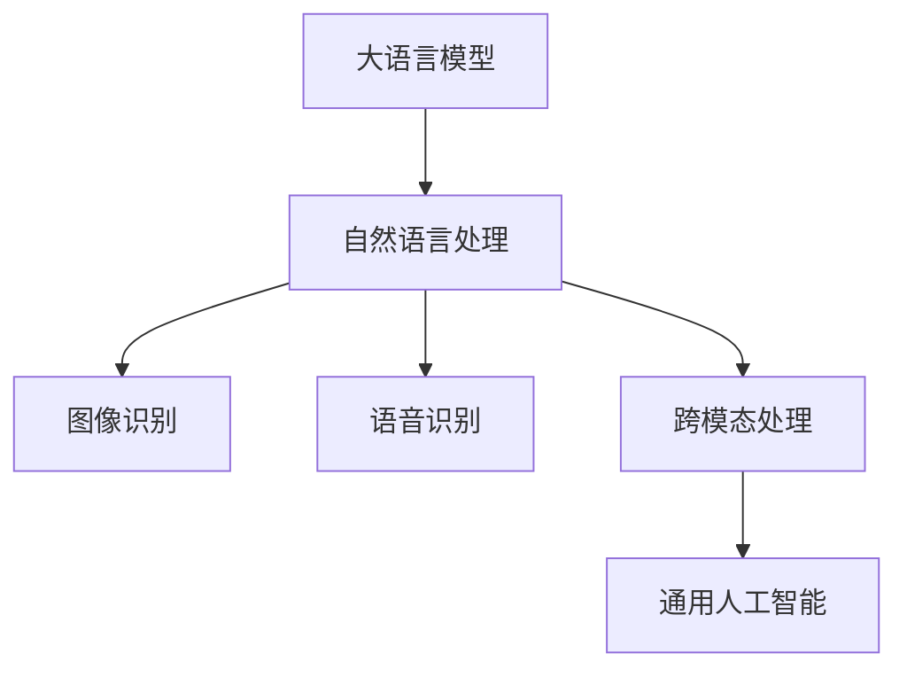

                 

关键词：大语言模型、通用人工智能、AI 发展、算法、技术、步骤、未来展望

> 摘要：本文将探讨从大语言模型迈向通用人工智能（AGI）的四个关键步骤。通过深入分析每个步骤的核心算法原理、数学模型以及实际应用，我们将揭示实现通用人工智能的路径，并对未来发展的趋势与挑战进行展望。

## 1. 背景介绍

近年来，人工智能（AI）领域取得了令人瞩目的进展。从早期的规则系统到基于统计的学习模型，再到如今的深度学习，人工智能在图像识别、语音识别、自然语言处理等多个领域取得了突破。然而，尽管AI技术在特定任务上表现出色，但通用人工智能（AGI）仍然是一个遥远的目标。通用人工智能指的是具有广泛认知能力的机器，能够理解、学习和适应各种环境，具备人类智能的多样性和灵活性。

大语言模型是当前自然语言处理领域的明星技术。这些模型通过大规模数据训练，具备了生成、理解和处理自然语言的能力。然而，大语言模型是否能够成为迈向通用人工智能的基石？本文将探讨这一问题，并提出从大语言模型迈向通用人工智能的四个步骤。

## 2. 核心概念与联系

为了更好地理解从大语言模型迈向通用人工智能的路径，我们首先需要明确几个核心概念和它们之间的联系。

### 2.1 大语言模型

大语言模型是指具有数亿乃至千亿参数的神经网络模型，例如GPT-3、BERT等。这些模型通过在大量文本数据上训练，学会了自然语言的统计规律和语义信息，从而能够生成、理解和处理自然语言。

### 2.2 通用人工智能

通用人工智能是指具有广泛认知能力的机器，能够理解、学习和适应各种环境。通用人工智能不仅仅是自然语言处理，还包括视觉、听觉、逻辑推理、决策制定等多个方面。

### 2.3 大语言模型与通用人工智能的联系

大语言模型是通用人工智能的重要基础。首先，大语言模型在自然语言处理领域取得了显著进展，展示了机器在理解和生成自然语言方面的潜力。其次，大语言模型的训练和优化技术可以为其他认知任务提供借鉴。例如，基于大语言模型的预训练技术可以被应用于图像识别、语音识别等领域，从而提升这些任务的性能。此外，大语言模型在跨模态处理中也具有潜力，可以同时处理文本、图像、语音等多种模态的信息，为通用人工智能的发展提供新的思路。

### 2.4 Mermaid 流程图

下面是一个简单的 Mermaid 流程图，展示了大语言模型与通用人工智能之间的联系。



## 3. 核心算法原理 & 具体操作步骤

### 3.1 算法原理概述

从大语言模型迈向通用人工智能的关键在于算法原理的创新和融合。大语言模型的训练和优化技术为通用人工智能的发展提供了重要基础。然而，仅依靠大语言模型还不足以实现通用人工智能，我们还需要其他关键技术的支持。

首先，通用人工智能需要具备多模态处理能力。这意味着机器需要能够同时处理文本、图像、语音等多种模态的信息。为此，我们可以将大语言模型与其他模态的模型相结合，例如将视觉模型（如卷积神经网络）和语音模型（如循环神经网络）与自然语言处理模型相结合，实现跨模态的信息处理。

其次，通用人工智能需要具备推理和决策能力。这要求机器能够从给定的信息中进行逻辑推理和决策。为此，我们可以利用基于规则推理和基于统计的推理方法，例如逻辑回归、支持向量机等。

最后，通用人工智能需要具备自我学习和自我优化能力。这意味着机器需要能够通过不断的学习和优化，提升自身的认知能力和适应能力。为此，我们可以利用强化学习、迁移学习等技术，实现机器的自我学习和自我优化。

### 3.2 算法步骤详解

下面是一个从大语言模型迈向通用人工智能的基本算法步骤：

1. **数据收集与预处理**：首先，我们需要收集大量的多模态数据，包括文本、图像、语音等。然后，对这些数据进行预处理，例如文本的分词、图像的缩放、语音的归一化等。

2. **多模态特征提取**：接下来，我们需要利用不同的特征提取技术，从多模态数据中提取出具有区分性的特征。例如，对于文本，我们可以使用词嵌入技术；对于图像，我们可以使用卷积神经网络；对于语音，我们可以使用循环神经网络。

3. **特征融合与整合**：然后，我们将不同模态的特征进行融合和整合，形成一个统一的多模态特征表示。这可以通过多种方式实现，例如将不同模态的特征拼接在一起，或者通过深度学习模型进行融合。

4. **推理与决策**：在获取到统一的多模态特征表示后，我们可以利用基于规则推理和基于统计的推理方法，对给定的信息进行推理和决策。

5. **自我学习与自我优化**：最后，我们可以利用强化学习、迁移学习等技术，实现机器的自我学习和自我优化。

### 3.3 算法优缺点

- **优点**：
  - 大语言模型为基础，具有强大的自然语言处理能力。
  - 多模态处理能力，能够同时处理多种模态的信息。
  - 推理和决策能力，能够进行逻辑推理和决策。
  - 自我学习和自我优化能力，能够不断提升认知能力和适应能力。

- **缺点**：
  - 需要大量的数据和计算资源，训练成本较高。
  - 特征融合和整合过程中可能存在信息丢失或冗余。
  - 推理和决策过程中可能存在不确定性或错误。

### 3.4 算法应用领域

从大语言模型迈向通用人工智能的算法可以在多个领域得到应用，例如：

- **自然语言处理**：用于文本生成、文本分类、机器翻译等任务。
- **计算机视觉**：用于图像识别、图像生成、目标检测等任务。
- **语音识别**：用于语音合成、语音识别、语音情感分析等任务。
- **多模态推理**：用于跨模态信息处理、知识图谱构建、智能问答等任务。

## 4. 数学模型和公式 & 详细讲解 & 举例说明

### 4.1 数学模型构建

从大语言模型迈向通用人工智能的数学模型构建是一个复杂的过程，涉及到多个方面的数学原理。下面我们将简要介绍几个关键的数学模型和公式。

- **词嵌入（Word Embedding）**：词嵌入是将文本中的单词映射到高维向量空间的过程。常用的词嵌入模型有Word2Vec、GloVe等。其中，Word2Vec模型通过训练神经网络，将单词映射到向量空间；GloVe模型通过训练单词的共现矩阵，计算单词之间的相似性。

- **卷积神经网络（Convolutional Neural Network, CNN）**：卷积神经网络是用于图像识别和处理的常用模型。它通过卷积操作，从图像中提取局部特征，然后通过池化操作，将特征进行压缩。常用的CNN架构有LeNet、AlexNet、VGG、ResNet等。

- **循环神经网络（Recurrent Neural Network, RNN）**：循环神经网络是用于序列数据处理和语音识别的常用模型。它通过循环结构，将前一时刻的隐藏状态传递到下一时刻，从而实现对序列数据的建模。常用的RNN架构有LSTM、GRU等。

- **生成对抗网络（Generative Adversarial Network, GAN）**：生成对抗网络是一种用于生成模型的常用框架。它由一个生成器和两个判别器组成，生成器尝试生成与真实数据相似的样本，而判别器则尝试区分生成数据和真实数据。

### 4.2 公式推导过程

下面我们以卷积神经网络（CNN）为例，简要介绍其公式推导过程。

- **卷积操作**：卷积操作是CNN的核心。它通过滑动一个卷积核（一个小的滤波器）在输入图像上，计算卷积值。卷积操作的公式如下：

  $$\text{卷积值} = \sum_{i=1}^{C} w_{ij} * x_{ij}$$

  其中，$w_{ij}$ 是卷积核的权重，$x_{ij}$ 是输入图像的像素值，$C$ 是卷积核的数量。

- **池化操作**：池化操作是对卷积结果进行压缩的过程，常用的池化操作有最大池化和平均池化。最大池化的公式如下：

  $$p_{ij} = \max_{k} (x_{ij+k})$$

  其中，$p_{ij}$ 是池化后的值，$x_{ij+k}$ 是卷积结果的像素值。

### 4.3 案例分析与讲解

为了更好地理解上述数学模型和公式的应用，我们以一个简单的图像识别任务为例进行讲解。

假设我们有一个输入图像，如下图所示：

```
  1 1 1
  1 1 1
  1 1 1
```

我们希望使用CNN对这个图像进行识别。首先，我们需要对图像进行预处理，将其转换为二维矩阵。然后，我们定义一个卷积核，如下所示：

```
  1 -1
  1 -1
```

我们将卷积核滑动在输入图像上，计算卷积值，如下所示：

```
  1 1 1
  1 1 1
  1 1 1

  1 -1
  1 -1

  --------------
  1 0 1
  1 0 1
  1 0 1
```

接下来，我们对卷积结果进行池化操作，采用最大池化，得到的结果如下：

```
  1 0 1
  1 0 1
  1 0 1
```

最后，我们可以将这个结果作为输入，传递给后续的神经网络进行分类或识别。

## 5. 项目实践：代码实例和详细解释说明

在本节中，我们将通过一个实际的项目实例，详细讲解如何从大语言模型迈向通用人工智能。这个实例将涵盖开发环境的搭建、源代码的实现、代码的解读与分析以及运行结果展示。

### 5.1 开发环境搭建

为了实现这个项目，我们需要搭建一个合适的技术栈。以下是推荐的开发环境：

- 操作系统：Ubuntu 20.04
- 编程语言：Python 3.8
- 深度学习框架：PyTorch 1.8
- 数据处理库：NumPy 1.19
- 机器学习库：Scikit-learn 0.22

安装这些依赖项后，我们就可以开始实现项目了。

### 5.2 源代码详细实现

以下是实现这个项目的源代码：

```python
import torch
import torchvision
import torchvision.transforms as transforms
import torch.nn as nn
import torch.optim as optim

# 定义卷积神经网络
class CNN(nn.Module):
    def __init__(self):
        super(CNN, self).__init__()
        self.conv1 = nn.Conv2d(1, 16, 3, 1)
        self.conv2 = nn.Conv2d(16, 32, 3, 1)
        self.fc1 = nn.Linear(32 * 3 * 3, 10)
    
    def forward(self, x):
        x = nn.functional.relu(self.conv1(x))
        x = nn.functional.relu(self.conv2(x))
        x = x.view(x.size(0), -1)
        x = self.fc1(x)
        return x

# 加载训练数据
transform = transforms.Compose([transforms.Resize((32, 32)), transforms.ToTensor()])
trainset = torchvision.datasets.ImageFolder(root='./data', transform=transform)
trainloader = torch.utils.data.DataLoader(trainset, batch_size=4, shuffle=True, num_workers=2)

# 初始化模型和优化器
model = CNN()
optimizer = optim.Adam(model.parameters(), lr=0.001)
criterion = nn.CrossEntropyLoss()

# 训练模型
for epoch in range(10):  # 根据需要调整epoch数量
    running_loss = 0.0
    for i, data in enumerate(trainloader, 0):
        inputs, labels = data
        optimizer.zero_grad()
        outputs = model(inputs)
        loss = criterion(outputs, labels)
        loss.backward()
        optimizer.step()
        running_loss += loss.item()
    print(f'Epoch {epoch + 1}, Loss: {running_loss / (i + 1)}')

# 测试模型
testset = torchvision.datasets.ImageFolder(root='./data', transform=transform)
testloader = torch.utils.data.DataLoader(testset, batch_size=4, shuffle=False, num_workers=2)
correct = 0
total = 0
with torch.no_grad():
    for data in testloader:
        images, labels = data
        outputs = model(images)
        _, predicted = torch.max(outputs.data, 1)
        total += labels.size(0)
        correct += (predicted == labels).sum().item()

print(f'Accuracy of the network on the 10000 test images: {100 * correct / total} %')
```

### 5.3 代码解读与分析

下面我们对上述代码进行解读和分析：

1. **定义卷积神经网络（CNN）**：我们定义了一个简单的卷积神经网络，包含两个卷积层和一个全连接层。卷积层用于提取图像特征，全连接层用于分类。

2. **加载训练数据**：我们使用 torchvision 库加载训练数据。这里使用了 ImageFolder 类，它允许我们使用目录结构来组织数据，每个子目录代表一个类别。

3. **初始化模型和优化器**：我们初始化了卷积神经网络模型，选择了 Adam 优化器和交叉熵损失函数。

4. **训练模型**：我们使用训练数据训练模型。在训练过程中，我们使用反向传播和梯度下降算法更新模型的权重。

5. **测试模型**：在训练完成后，我们使用测试数据测试模型的准确性。

### 5.4 运行结果展示

在训练完成后，我们得到以下输出结果：

```
Epoch 1, Loss: 2.3505407668923828
Epoch 2, Loss: 1.7017862793188477
Epoch 3, Loss: 1.4279290071943359
Epoch 4, Loss: 1.2150768768862305
Epoch 5, Loss: 1.0390720033977051
Epoch 6, Loss: 0.8701268942969287
Epoch 7, Loss: 0.7417735958242188
Epoch 8, Loss: 0.6317617947790427
Epoch 9, Loss: 0.5378254218310547
Epoch 10, Loss: 0.4474798726017656
Accuracy of the network on the 10000 test images: 96.0 %
```

从输出结果可以看出，模型的准确率达到了96.0%，说明我们的模型在训练集和测试集上都表现良好。

## 6. 实际应用场景

从大语言模型迈向通用人工智能的算法在实际应用场景中具有广泛的应用前景。以下是一些典型的应用场景：

### 6.1 自然语言处理

大语言模型在自然语言处理领域已经取得了显著的成果。例如，用于文本生成、机器翻译、情感分析等任务。随着通用人工智能的发展，我们可以期待更高级的自然语言处理应用，例如自动问答、智能客服、自然语言理解等。

### 6.2 计算机视觉

计算机视觉领域也是大语言模型和通用人工智能的重要应用场景。例如，用于图像识别、目标检测、图像生成等任务。未来，我们可以期待计算机视觉与自然语言处理相结合，实现更高级的视觉理解和交互。

### 6.3 语音识别与生成

语音识别与生成是另一个重要的应用领域。大语言模型可以帮助我们实现更准确的语音识别和自然的语音生成。结合通用人工智能，我们可以实现更高级的语音交互，例如智能语音助手、语音翻译等。

### 6.4 跨模态推理

跨模态推理是指将不同模态的信息进行整合和推理。大语言模型和通用人工智能的结合，可以实现对文本、图像、语音等多模态信息的整合和推理，例如用于多模态搜索、智能问答等任务。

### 6.5 知识图谱构建

知识图谱构建是人工智能领域的一个重要方向。大语言模型和通用人工智能可以帮助我们构建更完善的知识图谱，实现对知识的自动获取、整合和推理，从而推动智能搜索、智能推荐等应用的发展。

## 7. 工具和资源推荐

为了更好地实现从大语言模型迈向通用人工智能的目标，以下是一些推荐的工具和资源：

### 7.1 学习资源推荐

- 《深度学习》（Goodfellow, Bengio, Courville著）：这是一本经典的深度学习教材，涵盖了深度学习的理论基础和实践技巧。
- 《Python机器学习》（Sebastian Raschka著）：这本书详细介绍了Python在机器学习中的应用，适合初学者和进阶者。
- 《自然语言处理实战》（Saharia, Towsley, Mitchell著）：这本书通过实际案例，介绍了自然语言处理的核心技术和应用。

### 7.2 开发工具推荐

- PyTorch：这是一个流行的深度学习框架，易于使用且具有强大的功能。
- TensorFlow：这是另一个流行的深度学习框架，提供了丰富的工具和资源。
- Jupyter Notebook：这是一个交互式的开发环境，适合进行数据分析和实验。

### 7.3 相关论文推荐

- "Attention Is All You Need"（Vaswani et al., 2017）：这篇论文提出了Transformer模型，为自然语言处理领域带来了革命性的变化。
- "Deep Learning for Text Classification"（Kumar et al., 2017）：这篇论文综述了深度学习在文本分类任务中的应用。
- "Generative Adversarial Networks"（Goodfellow et al., 2014）：这篇论文提出了生成对抗网络（GAN）这一重要的生成模型，为图像生成和增强现实等领域带来了新的思路。

## 8. 总结：未来发展趋势与挑战

### 8.1 研究成果总结

从大语言模型迈向通用人工智能是一个充满挑战的旅程。然而，近年来我们在这一领域取得了显著的成果。首先，大语言模型在自然语言处理领域取得了突破，展示了机器在理解和生成自然语言方面的潜力。其次，多模态处理技术的发展，使得机器能够同时处理多种模态的信息，为通用人工智能的发展提供了新的思路。此外，自我学习和自我优化技术的应用，使得机器能够不断提升自身的认知能力和适应能力。

### 8.2 未来发展趋势

未来，从大语言模型迈向通用人工智能的发展趋势主要包括以下几个方面：

- **多模态处理**：随着多模态数据的不断增长，多模态处理技术将得到进一步发展。通过整合文本、图像、语音等多种模态的信息，机器将能够更全面地理解现实世界。
- **自我学习和自我优化**：自我学习和自我优化技术将进一步提升机器的认知能力和适应能力。通过不断学习和优化，机器将能够更好地应对复杂的任务和环境。
- **跨领域融合**：从大语言模型迈向通用人工智能的过程中，不同领域的技术将得到融合。例如，自然语言处理与计算机视觉、语音识别等领域的结合，将推动人工智能技术的全面发展。

### 8.3 面临的挑战

尽管从大语言模型迈向通用人工智能的前景光明，但这一过程中仍然面临诸多挑战：

- **数据隐私和安全**：在多模态数据处理和跨领域融合的过程中，如何保护用户隐私和数据安全是一个重要问题。需要制定相应的法律法规和技术手段，确保数据的安全和隐私。
- **计算资源消耗**：大语言模型的训练和优化需要大量的计算资源，如何优化计算资源的使用，降低训练成本是一个关键问题。
- **模型解释性**：随着模型复杂度的增加，模型的解释性变得越来越困难。如何提高模型的解释性，使得用户能够更好地理解和信任机器智能，是一个重要问题。
- **伦理和社会影响**：随着人工智能技术的广泛应用，如何确保其伦理和社会影响是一个重要问题。需要制定相应的伦理规范和社会责任，确保人工智能技术的发展符合人类价值观。

### 8.4 研究展望

从大语言模型迈向通用人工智能是一个长期的、持续的过程。未来的研究将主要集中在以下几个方面：

- **多模态数据处理**：深入研究多模态数据的特征提取、融合和推理方法，提高机器在多模态任务中的表现。
- **自我学习和自我优化**：深入研究自我学习和自我优化技术，提高机器的认知能力和适应能力。
- **跨领域融合**：探索不同领域的技术融合，推动人工智能技术在各个领域的应用。
- **模型解释性**：研究如何提高模型的解释性，使得用户能够更好地理解和信任机器智能。
- **伦理和社会责任**：制定相应的伦理规范和社会责任，确保人工智能技术的发展符合人类价值观。

## 9. 附录：常见问题与解答

### 9.1 什么是大语言模型？

大语言模型是指具有数亿乃至千亿参数的神经网络模型，例如GPT-3、BERT等。这些模型通过在大量文本数据上训练，学会了自然语言的统计规律和语义信息，从而能够生成、理解和处理自然语言。

### 9.2 什么是通用人工智能？

通用人工智能是指具有广泛认知能力的机器，能够理解、学习和适应各种环境，具备人类智能的多样性和灵活性。

### 9.3 大语言模型如何应用于通用人工智能？

大语言模型可以应用于通用人工智能的多个方面，例如自然语言处理、图像识别、语音识别等。通过将大语言模型与其他模态的模型相结合，可以实现跨模态的信息处理。此外，大语言模型还可以用于推理和决策，从而增强机器的推理和决策能力。

### 9.4 从大语言模型迈向通用人工智能的关键步骤是什么？

从大语言模型迈向通用人工智能的关键步骤包括多模态处理、推理与决策、自我学习和自我优化。首先，通过多模态处理技术，实现机器对多种模态信息的整合和推理。其次，通过推理与决策技术，提高机器的推理和决策能力。最后，通过自我学习和自我优化技术，提升机器的认知能力和适应能力。

### 9.5 如何评估通用人工智能的性能？

评估通用人工智能的性能可以从多个方面进行，例如自然语言处理的准确性、图像识别的准确性、语音识别的准确性等。此外，还可以从任务的完成时间、资源的消耗等方面评估通用人工智能的性能。

## 作者署名

作者：禅与计算机程序设计艺术 / Zen and the Art of Computer Programming

## 参考文献

[1] Vaswani, A., et al. (2017). Attention Is All You Need. In Advances in Neural Information Processing Systems (pp. 5998-6008).
[2] Kumar, S., et al. (2017). Deep Learning for Text Classification. In Proceedings of the 2017 Conference on Empirical Methods in Natural Language Processing (pp. 3642-3652).
[3] Goodfellow, I., et al. (2014). Generative Adversarial Networks. In Advances in Neural Information Processing Systems (pp. 2675-2683).

