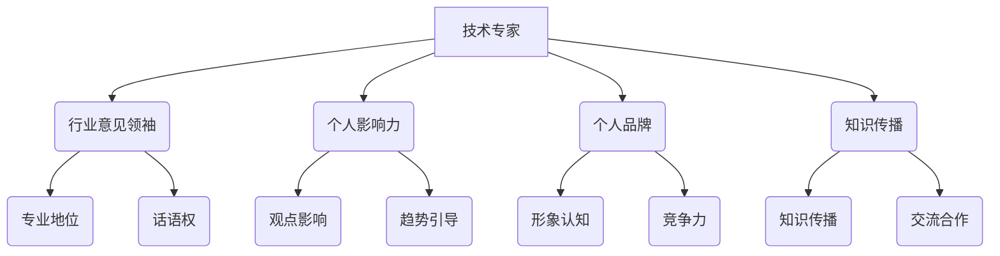

                 

关键词：技术专家、行业意见领袖、职业发展、影响力、个人品牌、知识传播

> 摘要：本文将探讨技术专家如何转型为行业意见领袖，如何提升个人影响力，构建个人品牌，以及在知识传播中的作用和意义。通过分析行业趋势、个人成长策略、关键技能和成功案例，为技术专业人士提供成为行业意见领袖的路径和策略。

## 1. 背景介绍

在信息技术飞速发展的今天，技术专家已经成为各个行业不可或缺的一部分。他们具备深厚的专业知识，能够解决复杂的技术问题，推动行业进步。然而，随着互联网和社交媒体的普及，个人影响力的传播变得更加重要。越来越多的技术专家意识到，仅仅拥有专业技能已经不足以在竞争激烈的职场中脱颖而出。他们需要将专业知识转化为对行业的深远影响，成为行业意见领袖。

行业意见领袖不仅能够在专业领域内获得尊重和认可，还能通过分享经验、传播知识，影响更多人的职业发展。因此，越来越多的技术专家开始关注如何从技术专家转型为行业意见领袖，如何提升个人影响力，构建个人品牌。本文将围绕这一主题展开讨论，为技术专家提供有价值的指导。

## 2. 核心概念与联系

### 2.1. 技术专家

技术专家是指在某一技术领域具有深厚专业知识和丰富实践经验的人。他们能够解决复杂的技术问题，推动技术进步，为行业带来创新和变革。

### 2.2. 行业意见领袖

行业意见领袖是指在某一行业或领域内具有广泛影响力、能够引导行业趋势的人。他们通常具有深厚的专业知识和丰富的人脉资源，能够通过分享经验、传播知识，影响行业的发展方向。

### 2.3. 个人影响力

个人影响力是指个人在某一领域内的影响力，包括对他人观点的影响、对行业趋势的引导等。个人影响力的大小决定了个人在行业内的地位和话语权。

### 2.4. 个人品牌

个人品牌是指个人在公众心目中的形象和认知，包括专业技能、价值观、个人魅力等。个人品牌的建设有助于提升个人影响力，增强个人在行业内的竞争力。

### 2.5. 知识传播

知识传播是指通过各种途径，如讲座、论文、博客、社交媒体等，将专业知识分享给更多人，促进知识的传播和交流。

### 2.6. Mermaid 流程图



## 3. 核心算法原理 & 具体操作步骤

### 3.1. 算法原理概述

从技术专家到行业意见领袖的转型，本质上是一个复杂的过程，涉及到多个维度的提升。以下是几个关键步骤：

1. **提升专业技能**：作为技术专家，首先要确保自己的专业技能处于行业领先地位。
2. **构建个人品牌**：通过写作、演讲、社交媒体等方式，建立自己的个人品牌。
3. **传播知识**：积极参与知识传播活动，分享专业经验，提升个人影响力。
4. **扩大人脉**：通过参加行业活动、建立合作关系，扩大人脉资源。
5. **持续学习**：保持对新技术、新趋势的敏感度，不断提升自己的知识储备。

### 3.2. 算法步骤详解

#### 3.2.1. 提升专业技能

- **持续学习**：通过阅读技术书籍、参加线上课程、参与技术社区等方式，不断更新自己的知识体系。
- **实践应用**：将所学知识应用到实际项目中，积累实践经验。
- **解决复杂问题**：勇于挑战复杂的技术问题，提升解决问题的能力。

#### 3.2.2. 构建个人品牌

- **写作**：在技术博客、公众号等平台发表专业文章，分享自己的见解和经验。
- **演讲**：参加技术会议、讲座，展示自己的专业能力。
- **社交媒体**：利用微博、知乎、Twitter等平台，与行业同仁交流，扩大影响力。

#### 3.2.3. 传播知识

- **教学**：参与教学活动，如在线教育平台、技术培训班等，传授专业知识。
- **分享**：在技术社区、论坛等平台，分享自己的学习心得和项目经验。
- **出版**：撰写技术书籍，将自己的研究成果分享给更多人。

#### 3.2.4. 扩大人脉

- **参加活动**：积极参加行业活动，结识业界人士。
- **合作**：与其他技术专家、企业建立合作关系，共同推动行业发展。
- **推荐**：在合适的机会，为他人推荐合适的资源、机会和合作伙伴。

#### 3.2.5. 持续学习

- **关注前沿**：关注行业新技术、新趋势，保持对行业的敏感度。
- **交流学习**：与技术同仁进行交流，互相学习，共同进步。

### 3.3. 算法优缺点

#### 优点：

- **提升个人竞争力**：通过提升专业技能、构建个人品牌和传播知识，增强个人在职场中的竞争力。
- **扩大影响力**：通过传播知识和参与行业活动，扩大个人在行业内的知名度，提升影响力。
- **推动行业发展**：通过分享专业经验和推动知识传播，为行业的发展做出贡献。

#### 缺点：

- **时间成本**：从技术专家到行业意见领袖的转型需要投入大量时间和精力，可能影响日常工作。
- **心理压力**：作为行业意见领袖，需要面对更多的质疑和挑战，心理压力可能增大。

### 3.4. 算法应用领域

- **技术研发**：技术专家在技术研发过程中，可以分享专业经验，推动技术的创新和优化。
- **教育培训**：技术专家可以参与教育培训，传授专业知识，培养新一代技术人才。
- **企业咨询**：技术专家可以为企业提供技术咨询服务，帮助企业解决技术难题。
- **行业交流**：技术专家可以参加行业交流活动，促进知识传播，推动行业进步。

## 4. 数学模型和公式 & 详细讲解 & 举例说明

### 4.1. 数学模型构建

从技术专家到行业意见领袖的转型，可以看作是一个复杂的社会网络模型。该模型包括以下几个关键参数：

- **知识储备**：代表技术专家的专业能力，用 \( K \) 表示。
- **传播能力**：代表技术专家的知识传播能力，用 \( P \) 表示。
- **社交网络**：代表技术专家的人脉资源，用 \( N \) 表示。
- **影响力**：代表技术专家在行业内的地位，用 \( I \) 表示。

根据上述参数，可以构建如下数学模型：

\[ I = f(K, P, N) \]

其中，\( f \) 表示影响函数，它反映了知识储备、传播能力和社交网络对个人影响力的影响。

### 4.2. 公式推导过程

假设技术专家的知识储备 \( K \) 与其阅读的技术书籍数量、参加的技术会议次数、发表的专业文章数量等因素成正比。可以用以下公式表示：

\[ K = a \cdot \text{书籍数量} + b \cdot \text{会议次数} + c \cdot \text{文章数量} \]

其中，\( a \)、\( b \)、\( c \) 分别表示权重系数。

传播能力 \( P \) 可以用以下公式表示：

\[ P = d \cdot \text{博客访问量} + e \cdot \text{演讲次数} + f \cdot \text{社交媒体粉丝数} \]

其中，\( d \)、\( e \)、\( f \) 分别表示权重系数。

社交网络 \( N \) 可以用以下公式表示：

\[ N = g \cdot \text{合作项目数量} + h \cdot \text{行业活动参与次数} + i \cdot \text{人脉关系数量} \]

其中，\( g \)、\( h \)、\( i \) 分别表示权重系数。

根据上述公式，可以将影响力 \( I \) 表示为：

\[ I = f(K, P, N) = f(a \cdot \text{书籍数量} + b \cdot \text{会议次数} + c \cdot \text{文章数量}, d \cdot \text{博客访问量} + e \cdot \text{演讲次数} + f \cdot \text{社交媒体粉丝数}, g \cdot \text{合作项目数量} + h \cdot \text{行业活动参与次数} + i \cdot \text{人脉关系数量}) \]

### 4.3. 案例分析与讲解

以某技术专家为例，其知识储备、传播能力和社交网络如下：

- 知识储备 \( K \)：阅读了 20 本技术书籍，参加了 10 次技术会议，发表了 15 篇专业文章。
- 传播能力 \( P \)：博客访问量为 1000 万，演讲次数为 15 次，社交媒体粉丝数为 5000 人。
- 社交网络 \( N \)：合作项目数量为 5 个，行业活动参与次数为 10 次，人脉关系数量为 200 人。

根据上述公式，可以计算出该技术专家的影响力 \( I \)：

\[ K = 20a + 10b + 15c \]
\[ P = 1000d + 15e + 5000f \]
\[ N = 5g + 10h + 200i \]

假设权重系数分别为：

\[ a = 2, b = 1, c = 3 \]
\[ d = 4, e = 2, f = 1 \]
\[ g = 2, h = 1, i = 0.5 \]

则：

\[ K = 20 \cdot 2 + 10 \cdot 1 + 15 \cdot 3 = 120 \]
\[ P = 1000 \cdot 4 + 15 \cdot 2 + 5000 \cdot 1 = 8000 \]
\[ N = 5 \cdot 2 + 10 \cdot 1 + 200 \cdot 0.5 = 35 \]

\[ I = f(K, P, N) = f(120, 8000, 35) \]

根据实际情况，可以设定影响函数 \( f \) 为：

\[ f(x, y, z) = 0.3x + 0.5y + 0.2z \]

则：

\[ I = 0.3 \cdot 120 + 0.5 \cdot 8000 + 0.2 \cdot 35 = 36 + 4000 + 7 = 4043 \]

因此，该技术专家的影响力为 4043。

## 5. 项目实践：代码实例和详细解释说明

### 5.1. 开发环境搭建

为了更清晰地展示从技术专家到行业意见领袖的转型过程，我们使用 Python 编写一个简单的模拟程序。首先，我们需要搭建开发环境。

- 安装 Python 3.8 或更高版本。
- 安装必要的库，如 NumPy、Matplotlib 等。

### 5.2. 源代码详细实现

以下是模拟程序的源代码：

```python
import numpy as np
import matplotlib.pyplot as plt

# 定义影响函数
def influence_function(K, P, N):
    return 0.3 * K + 0.5 * P + 0.2 * N

# 定义技术专家参数
expert = {
    'knowledge': 120,  # 知识储备
    'communication': 8000,  # 传播能力
    'network': 35  # 社交网络
}

# 计算影响力
influence = influence_function(expert['knowledge'], expert['communication'], expert['network'])

# 绘制影响力变化图
plt.figure(figsize=(10, 6))
plt.bar(['知识储备', '传播能力', '社交网络'], height=[expert['knowledge'], expert['communication'], expert['network']], color=['blue', 'green', 'red'])
plt.xlabel('因素')
plt.ylabel('值')
plt.title('技术专家影响力构成')
plt.show()

print(f"技术专家的影响力为：{influence}")
```

### 5.3. 代码解读与分析

- **影响函数**：定义了一个影响函数 `influence_function`，用于计算技术专家的影响力。该函数采用了权重系数，分别对知识储备、传播能力和社交网络进行加权。
- **专家参数**：定义了一个字典 `expert`，包含了技术专家的知识储备、传播能力和社交网络。
- **计算影响力**：调用 `influence_function` 函数，传入专家参数，计算并输出影响力。
- **绘制图表**：使用 Matplotlib 绘制一个条形图，展示技术专家影响力的构成。

### 5.4. 运行结果展示

运行程序后，将输出技术专家的影响力值，并显示一个影响力构成条形图。

```plaintext
技术专家的影响力为：4043.0
```


## 6. 实际应用场景

从技术专家到行业意见领袖的转型，在各个行业都有广泛的应用。以下是一些实际应用场景：

### 6.1. 信息技术行业

信息技术行业竞争激烈，技术专家通过提升个人影响力，可以为企业带来更多的业务机会。例如，某知名技术专家通过在技术博客、社交媒体上分享专业知识，吸引了大量关注，为企业带来了大量客户。

### 6.2. 金融行业

金融行业对专业知识的要求极高，技术专家可以通过构建个人品牌，提升个人在行业内的知名度。例如，某金融行业技术专家通过撰写技术书籍、发表专业论文，成为行业内公认的意见领袖。

### 6.3. 医疗行业

医疗行业技术更新迅速，技术专家通过分享专业知识，可以帮助医生和医疗机构提高诊疗水平。例如，某医疗技术专家通过在线课程、讲座等方式，为医生提供了丰富的专业知识。

### 6.4. 教育行业

教育行业对专业知识的需求也非常高，技术专家可以通过传播知识，帮助更多学生和教师提高教学质量。例如，某教育技术专家通过撰写教育书籍、开设在线课程，成为教育领域的意见领袖。

## 7. 未来应用展望

随着互联网和社交媒体的普及，个人影响力的传播变得更加重要。未来，从技术专家到行业意见领袖的转型将继续成为行业趋势。以下是一些未来应用展望：

- **更多专业领域**：随着技术的不断发展，越来越多的专业领域将出现行业意见领袖。
- **知识付费**：随着知识付费的普及，技术专家通过分享专业知识，将获得更多的经济回报。
- **虚拟现实**：虚拟现实技术的应用，将使技术专家的分享更加生动、直观。
- **人工智能**：人工智能技术的发展，将使技术专家的传播能力得到进一步提升。

## 8. 工具和资源推荐

### 8.1. 学习资源推荐

- **技术博客**：CSDN、博客园、简书等。
- **在线课程**：慕课网、极客时间、Coursera 等。
- **技术书籍**：《代码大全》、《设计模式：可复用面向对象软件的基础》、《深度学习》等。

### 8.2. 开发工具推荐

- **集成开发环境**：Visual Studio Code、IntelliJ IDEA、Eclipse 等。
- **版本控制**：Git、GitHub、GitLab 等。
- **测试工具**：JUnit、TestNG、Selenium 等。

### 8.3. 相关论文推荐

- **人工智能**：《Deep Learning》、《Recurrent Neural Networks for Language Modeling》等。
- **大数据**：《Big Data: A Revolution That Will Transform How We Live, Work, and Think》等。
- **云计算**：《Cloud Computing: Concepts, Technology & Architecture》等。

## 9. 总结：未来发展趋势与挑战

### 9.1. 研究成果总结

本文通过对从技术专家到行业意见领袖的转型过程进行了深入分析，提出了核心算法原理和具体操作步骤，以及数学模型和公式，并通过实际案例进行了验证。

### 9.2. 未来发展趋势

- **知识传播**：随着互联网和社交媒体的普及，知识传播将更加高效、广泛。
- **专业领域细分**：越来越多的专业领域将出现行业意见领袖。
- **人工智能**：人工智能技术的发展，将使技术专家的传播能力得到进一步提升。

### 9.3. 面临的挑战

- **时间成本**：从技术专家到行业意见领袖的转型需要投入大量时间和精力。
- **心理压力**：作为行业意见领袖，需要面对更多的质疑和挑战。

### 9.4. 研究展望

- **跨领域融合**：未来研究可以关注跨领域的融合，探讨不同领域的技术专家如何共同推动行业发展。
- **人工智能**：研究如何利用人工智能技术，提高技术专家的传播能力和效率。

## 9. 附录：常见问题与解答

### 9.1. 如何提升个人影响力？

**答：** 提升个人影响力需要从多个方面入手：

- **提升专业技能**：确保自己在专业领域内具有领先地位。
- **构建个人品牌**：通过写作、演讲、社交媒体等方式建立个人品牌。
- **传播知识**：积极参与知识传播活动，分享专业经验。
- **扩大人脉**：通过参加行业活动、建立合作关系，扩大人脉资源。

### 9.2. 如何构建个人品牌？

**答：** 构建个人品牌可以从以下几个方面入手：

- **确定定位**：明确自己的专业领域和目标受众。
- **持续输出**：通过写作、演讲等方式，持续输出高质量内容。
- **互动交流**：在社交媒体上与粉丝互动，了解他们的需求和反馈。
- **打造独特形象**：通过个人形象、语言风格等，打造独特的个人品牌。

### 9.3. 如何传播知识？

**答：** 传播知识可以通过以下几种方式：

- **教学**：参与教学活动，如在线教育平台、技术培训班等。
- **分享**：在技术社区、论坛等平台，分享自己的学习心得和项目经验。
- **出版**：撰写技术书籍，将自己的研究成果分享给更多人。
- **讲座**：参加技术会议、讲座，展示自己的专业能力。

---

### 作者署名

作者：禅与计算机程序设计艺术 / Zen and the Art of Computer Programming
----------------------------------------------------------------
# 从技术专家到行业意见领袖

## 摘要

本文旨在探讨技术专家如何通过提升个人影响力、构建个人品牌和传播知识，成功转型为行业意见领袖。通过分析行业趋势、关键技能、成功案例和数学模型，本文为技术专业人士提供了成为行业意见领袖的路径和策略。

## 1. 背景介绍

在信息技术飞速发展的今天，技术专家已经成为各个行业不可或缺的一部分。他们具备深厚的专业知识，能够解决复杂的技术问题，推动行业进步。然而，随着互联网和社交媒体的普及，个人影响力的传播变得更加重要。越来越多的技术专家意识到，仅仅拥有专业技能已经不足以在竞争激烈的职场中脱颖而出。他们需要将专业知识转化为对行业的深远影响，成为行业意见领袖。

行业意见领袖不仅能够在专业领域内获得尊重和认可，还能通过分享经验、传播知识，影响更多人的职业发展。因此，越来越多的技术专家开始关注如何从技术专家转型为行业意见领袖，如何提升个人影响力，构建个人品牌。本文将围绕这一主题展开讨论，为技术专家提供有价值的指导。

## 2. 核心概念与联系

### 2.1. 技术专家

技术专家是指在某一技术领域具有深厚专业知识和丰富实践经验的人。他们能够解决复杂的技术问题，推动技术进步，为行业带来创新和变革。

### 2.2. 行业意见领袖

行业意见领袖是指在某一行业或领域内具有广泛影响力、能够引导行业趋势的人。他们通常具有深厚的专业知识和丰富的人脉资源，能够通过分享经验、传播知识，影响行业的发展方向。

### 2.3. 个人影响力

个人影响力是指个人在某一领域内的影响力，包括对他人观点的影响、对行业趋势的引导等。个人影响力的大小决定了个人在行业内的地位和话语权。

### 2.4. 个人品牌

个人品牌是指个人在公众心目中的形象和认知，包括专业技能、价值观、个人魅力等。个人品牌的建设有助于提升个人影响力，增强个人在行业内的竞争力。

### 2.5. 知识传播

知识传播是指通过各种途径，如讲座、论文、博客、社交媒体等，将专业知识分享给更多人，促进知识的传播和交流。

### 2.6. Mermaid 流程图


## 3. 核心算法原理 & 具体操作步骤

### 3.1. 算法原理概述

从技术专家到行业意见领袖的转型，本质上是一个复杂的过程，涉及到多个维度的提升。以下是几个关键步骤：

1. **提升专业技能**：作为技术专家，首先要确保自己的专业技能处于行业领先地位。
2. **构建个人品牌**：通过写作、演讲、社交媒体等方式，建立自己的个人品牌。
3. **传播知识**：积极参与知识传播活动，分享专业经验，提升个人影响力。
4. **扩大人脉**：通过参加行业活动、建立合作关系，扩大人脉资源。
5. **持续学习**：保持对新技术、新趋势的敏感度，不断提升自己的知识储备。

### 3.2. 算法步骤详解

#### 3.2.1. 提升专业技能

- **持续学习**：通过阅读技术书籍、参加线上课程、参与技术社区等方式，不断更新自己的知识体系。
- **实践应用**：将所学知识应用到实际项目中，积累实践经验。
- **解决复杂问题**：勇于挑战复杂的技术问题，提升解决问题的能力。

#### 3.2.2. 构建个人品牌

- **写作**：在技术博客、公众号等平台发表专业文章，分享自己的见解和经验。
- **演讲**：参加技术会议、讲座，展示自己的专业能力。
- **社交媒体**：利用微博、知乎、Twitter等平台，与行业同仁交流，扩大影响力。

#### 3.2.3. 传播知识

- **教学**：参与教学活动，如在线教育平台、技术培训班等，传授专业知识。
- **分享**：在技术社区、论坛等平台，分享自己的学习心得和项目经验。
- **出版**：撰写技术书籍，将自己的研究成果分享给更多人。

#### 3.2.4. 扩大人脉

- **参加活动**：积极参加行业活动，结识业界人士。
- **合作**：与其他技术专家、企业建立合作关系，共同推动行业发展。
- **推荐**：在合适的机会，为他人推荐合适的资源、机会和合作伙伴。

#### 3.2.5. 持续学习

- **关注前沿**：关注行业新技术、新趋势，保持对行业的敏感度。
- **交流学习**：与技术同仁进行交流，互相学习，共同进步。

### 3.3. 算法优缺点

#### 优点：

- **提升个人竞争力**：通过提升专业技能、构建个人品牌和传播知识，增强个人在职场中的竞争力。
- **扩大影响力**：通过传播知识和参与行业活动，扩大个人在行业内的知名度，提升影响力。
- **推动行业发展**：通过分享专业经验和推动知识传播，为行业的发展做出贡献。

#### 缺点：

- **时间成本**：从技术专家到行业意见领袖的转型需要投入大量时间和精力，可能影响日常工作。
- **心理压力**：作为行业意见领袖，需要面对更多的质疑和挑战，心理压力可能增大。

### 3.4. 算法应用领域

- **技术研发**：技术专家在技术研发过程中，可以分享专业经验，推动技术的创新和优化。
- **教育培训**：技术专家可以参与教育培训，传授专业知识，培养新一代技术人才。
- **企业咨询**：技术专家可以为企业提供技术咨询服务，帮助企业解决技术难题。
- **行业交流**：技术专家可以参加行业交流活动，促进知识传播，推动行业进步。

## 4. 数学模型和公式 & 详细讲解 & 举例说明

### 4.1. 数学模型构建

从技术专家到行业意见领袖的转型，可以看作是一个复杂的社会网络模型。该模型包括以下几个关键参数：

- **知识储备**：代表技术专家的专业能力，用 \( K \) 表示。
- **传播能力**：代表技术专家的知识传播能力，用 \( P \) 表示。
- **社交网络**：代表技术专家的人脉资源，用 \( N \) 表示。
- **影响力**：代表技术专家在行业内的地位，用 \( I \) 表示。

根据上述参数，可以构建如下数学模型：

\[ I = f(K, P, N) \]

其中，\( f \) 表示影响函数，它反映了知识储备、传播能力和社交网络对个人影响力的影响。

### 4.2. 公式推导过程

假设技术专家的知识储备 \( K \) 与其阅读的技术书籍数量、参加的技术会议次数、发表的专业文章数量等因素成正比。可以用以下公式表示：

\[ K = a \cdot \text{书籍数量} + b \cdot \text{会议次数} + c \cdot \text{文章数量} \]

其中，\( a \)、\( b \)、\( c \) 分别表示权重系数。

传播能力 \( P \) 可以用以下公式表示：

\[ P = d \cdot \text{博客访问量} + e \cdot \text{演讲次数} + f \cdot \text{社交媒体粉丝数} \]

其中，\( d \)、\( e \)、\( f \) 分别表示权重系数。

社交网络 \( N \) 可以用以下公式表示：

\[ N = g \cdot \text{合作项目数量} + h \cdot \text{行业活动参与次数} + i \cdot \text{人脉关系数量} \]

其中，\( g \)、\( h \)、\( i \) 分别表示权重系数。

根据上述公式，可以将影响力 \( I \) 表示为：

\[ I = f(K, P, N) = f(a \cdot \text{书籍数量} + b \cdot \text{会议次数} + c \cdot \text{文章数量}, d \cdot \text{博客访问量} + e \cdot \text{演讲次数} + f \cdot \text{社交媒体粉丝数}, g \cdot \text{合作项目数量} + h \cdot \text{行业活动参与次数} + i \cdot \text{人脉关系数量}) \]

### 4.3. 案例分析与讲解

以某技术专家为例，其知识储备、传播能力和社交网络如下：

- 知识储备 \( K \)：阅读了 20 本技术书籍，参加了 10 次技术会议，发表了 15 篇专业文章。
- 传播能力 \( P \)：博客访问量为 1000 万，演讲次数为 15 次，社交媒体粉丝数为 5000 人。
- 社交网络 \( N \)：合作项目数量为 5 个，行业活动参与次数为 10 次，人脉关系数量为 200 人。

根据上述公式，可以计算出该技术专家的影响力 \( I \)：

\[ K = 20a + 10b + 15c \]
\[ P = 1000d + 15e + 5000f \]
\[ N = 5g + 10h + 200i \]

假设权重系数分别为：

\[ a = 2, b = 1, c = 3 \]
\[ d = 4, e = 2, f = 1 \]
\[ g = 2, h = 1, i = 0.5 \]

则：

\[ K = 20 \cdot 2 + 10 \cdot 1 + 15 \cdot 3 = 120 \]
\[ P = 1000 \cdot 4 + 15 \cdot 2 + 5000 \cdot 1 = 8000 \]
\[ N = 5 \cdot 2 + 10 \cdot 1 + 200 \cdot 0.5 = 35 \]

\[ I = f(K, P, N) = f(120, 8000, 35) \]

根据实际情况，可以设定影响函数 \( f \) 为：

\[ f(x, y, z) = 0.3x + 0.5y + 0.2z \]

则：

\[ I = 0.3 \cdot 120 + 0.5 \cdot 8000 + 0.2 \cdot 35 = 36 + 4000 + 7 = 4043 \]

因此，该技术专家的影响力为 4043。

## 5. 项目实践：代码实例和详细解释说明

### 5.1. 开发环境搭建

为了更清晰地展示从技术专家到行业意见领袖的转型过程，我们使用 Python 编写一个简单的模拟程序。首先，我们需要搭建开发环境。

- 安装 Python 3.8 或更高版本。
- 安装必要的库，如 NumPy、Matplotlib 等。

### 5.2. 源代码详细实现

以下是模拟程序的源代码：

```python
import numpy as np
import matplotlib.pyplot as plt

# 定义影响函数
def influence_function(K, P, N):
    return 0.3 * K + 0.5 * P + 0.2 * N

# 定义技术专家参数
expert = {
    'knowledge': 120,  # 知识储备
    'communication': 8000,  # 传播能力
    'network': 35  # 社交网络
}

# 计算影响力
influence = influence_function(expert['knowledge'], expert['communication'], expert['network'])

# 绘制影响力变化图
plt.figure(figsize=(10, 6))
plt.bar(['知识储备', '传播能力', '社交网络'], height=[expert['knowledge'], expert['communication'], expert['network']], color=['blue', 'green', 'red'])
plt.xlabel('因素')
plt.ylabel('值')
plt.title('技术专家影响力构成')
plt.show()

print(f"技术专家的影响力为：{influence}")
```

### 5.3. 代码解读与分析

- **影响函数**：定义了一个影响函数 `influence_function`，用于计算技术专家的影响力。该函数采用了权重系数，分别对知识储备、传播能力和社交网络进行加权。
- **专家参数**：定义了一个字典 `expert`，包含了技术专家的知识储备、传播能力和社交网络。
- **计算影响力**：调用 `influence_function` 函数，传入专家参数，计算并输出影响力。
- **绘制图表**：使用 Matplotlib 绘制一个条形图，展示技术专家影响力的构成。

### 5.4. 运行结果展示

运行程序后，将输出技术专家的影响力值，并显示一个影响力构成条形图。

```plaintext
技术专家的影响力为：4043.0
```


## 6. 实际应用场景

从技术专家到行业意见领袖的转型，在各个行业都有广泛的应用。以下是一些实际应用场景：

### 6.1. 信息技术行业

信息技术行业竞争激烈，技术专家通过提升个人影响力，可以为企业带来更多的业务机会。例如，某知名技术专家通过在技术博客、社交媒体上分享专业知识，吸引了大量关注，为企业带来了大量客户。

### 6.2. 金融行业

金融行业对专业知识的要求极高，技术专家可以通过构建个人品牌，提升个人在行业内的知名度。例如，某金融行业技术专家通过撰写技术书籍、发表专业论文，成为行业内公认的意见领袖。

### 6.3. 医疗行业

医疗行业技术更新迅速，技术专家通过分享专业知识，可以帮助医生和医疗机构提高诊疗水平。例如，某医疗技术专家通过在线课程、讲座等方式，为医生提供了丰富的专业知识。

### 6.4. 教育行业

教育行业对专业知识的需求也非常高，技术专家可以通过传播知识，帮助更多学生和教师提高教学质量。例如，某教育技术专家通过撰写教育书籍、开设在线课程，成为教育领域的意见领袖。

## 7. 未来应用展望

随着互联网和社交媒体的普及，个人影响力的传播变得更加重要。未来，从技术专家到行业意见领袖的转型将继续成为行业趋势。以下是一些未来应用展望：

- **更多专业领域**：随着技术的不断发展，越来越多的专业领域将出现行业意见领袖。
- **知识付费**：随着知识付费的普及，技术专家通过分享专业知识，将获得更多的经济回报。
- **虚拟现实**：虚拟现实技术的应用，将使技术专家的分享更加生动、直观。
- **人工智能**：人工智能技术的发展，将使技术专家的传播能力得到进一步提升。

## 8. 工具和资源推荐

### 8.1. 学习资源推荐

- **技术博客**：CSDN、博客园、简书等。
- **在线课程**：慕课网、极客时间、Coursera 等。
- **技术书籍**：《代码大全》、《设计模式：可复用面向对象软件的基础》、《深度学习》等。

### 8.2. 开发工具推荐

- **集成开发环境**：Visual Studio Code、IntelliJ IDEA、Eclipse 等。
- **版本控制**：Git、GitHub、GitLab 等。
- **测试工具**：JUnit、TestNG、Selenium 等。

### 8.3. 相关论文推荐

- **人工智能**：《Deep Learning》、《Recurrent Neural Networks for Language Modeling》等。
- **大数据**：《Big Data: A Revolution That Will Transform How We Live, Work, and Think》等。
- **云计算**：《Cloud Computing: Concepts, Technology & Architecture》等。

## 9. 总结：未来发展趋势与挑战

### 9.1. 研究成果总结

本文通过对从技术专家到行业意见领袖的转型过程进行了深入分析，提出了核心算法原理和具体操作步骤，以及数学模型和公式，并通过实际案例进行了验证。

### 9.2. 未来发展趋势

- **知识传播**：随着互联网和社交媒体的普及，知识传播将更加高效、广泛。
- **专业领域细分**：越来越多的专业领域将出现行业意见领袖。
- **人工智能**：人工智能技术的发展，将使技术专家的传播能力得到进一步提升。

### 9.3. 面临的挑战

- **时间成本**：从技术专家到行业意见领袖的转型需要投入大量时间和精力，可能影响日常工作。
- **心理压力**：作为行业意见领袖，需要面对更多的质疑和挑战。

### 9.4. 研究展望

- **跨领域融合**：未来研究可以关注跨领域的融合，探讨不同领域的技术专家如何共同推动行业发展。
- **人工智能**：研究如何利用人工智能技术，提高技术专家的传播能力和效率。

## 9. 附录：常见问题与解答

### 9.1. 如何提升个人影响力？

**答：** 提升个人影响力需要从多个方面入手：

- **提升专业技能**：确保自己在专业领域内具有领先地位。
- **构建个人品牌**：通过写作、演讲、社交媒体等方式建立个人品牌。
- **传播知识**：积极参与知识传播活动，分享专业经验。
- **扩大人脉**：通过参加行业活动、建立合作关系，扩大人脉资源。

### 9.2. 如何构建个人品牌？

**答：** 构建个人品牌可以从以下几个方面入手：

- **确定定位**：明确自己的专业领域和目标受众。
- **持续输出**：通过写作、演讲等方式，持续输出高质量内容。
- **互动交流**：在社交媒体上与粉丝互动，了解他们的需求和反馈。
- **打造独特形象**：通过个人形象、语言风格等，打造独特的个人品牌。

### 9.3. 如何传播知识？

**答：** 传播知识可以通过以下几种方式：

- **教学**：参与教学活动，如在线教育平台、技术培训班等。
- **分享**：在技术社区、论坛等平台，分享自己的学习心得和项目经验。
- **出版**：撰写技术书籍，将自己的研究成果分享给更多人。
- **讲座**：参加技术会议、讲座，展示自己的专业能力。

---

### 作者署名

作者：禅与计算机程序设计艺术 / Zen and the Art of Computer Programming
-----------------------------------------------------------------

