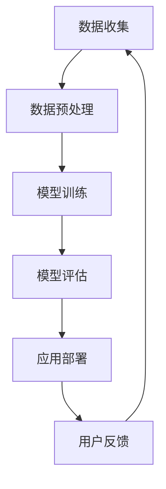

                 

关键词：AI大模型、电商、算法、应用、流程图、数学模型、代码实例、工具推荐、未来展望

> 摘要：本文从算法的角度深入探讨了AI大模型在电商领域的应用。通过对核心概念、算法原理、数学模型以及实际案例的分析，揭示了AI大模型在电商推荐、搜索、用户体验优化等方面的应用潜力和技术挑战。

## 1. 背景介绍

近年来，人工智能（AI）技术迅速发展，尤其是深度学习技术的突破，使得AI大模型在各个领域得到了广泛应用。在电商领域，AI大模型的应用已经成为提升用户购物体验、增加销售额的重要手段。从个性化推荐到智能搜索，从用户行为分析到商品定价，AI大模型为电商企业提供了强大的数据驱动的决策支持。

本文将重点讨论AI大模型在电商中的应用，包括其核心算法原理、数学模型以及实际应用案例。通过分析这些应用，我们将了解AI大模型如何提高电商的运营效率、增强用户粘性，并探讨未来可能的发展趋势和技术挑战。

## 2. 核心概念与联系

### 2.1 AI大模型

AI大模型通常指的是具有大规模参数的深度学习模型，如神经网络、生成对抗网络（GAN）等。这些模型通过大规模数据的训练，能够自动学习数据的复杂模式，并在各种任务中表现出优异的性能。

### 2.2 电商应用场景

电商应用场景包括推荐系统、搜索优化、用户行为分析、商品定价、库存管理等多个方面。这些场景的共同特点是数据量大、变量复杂，适合使用AI大模型进行处理。

### 2.3 关联性分析

AI大模型与电商应用场景之间存在紧密的关联。通过分析用户数据，AI大模型可以识别用户的兴趣和行为模式，从而实现个性化推荐和精准营销。同时，AI大模型还能够通过用户行为预测未来的购物趋势，帮助企业优化库存和定价策略。

## 2.4 Mermaid流程图

以下是一个简化的Mermaid流程图，展示了AI大模型在电商应用中的基本流程：



### 2.5 数据预处理

数据预处理是AI大模型应用的第一步。这一过程包括数据清洗、数据转换、特征提取等。通过有效的数据预处理，可以去除噪声数据、提高数据质量，从而为后续的模型训练提供更好的数据基础。

### 2.6 模型训练

模型训练是AI大模型应用的核心。通过使用大量的训练数据，AI大模型可以自动学习数据的复杂模式，并逐步优化模型的参数。常见的训练方法包括批量训练、随机梯度下降（SGD）等。

### 2.7 模型评估

模型评估是验证AI大模型性能的重要步骤。常用的评估指标包括准确率、召回率、F1值等。通过对比模型在不同数据集上的性能，可以评估模型的泛化能力和鲁棒性。

### 2.8 应用部署

应用部署是将训练好的模型部署到实际应用场景中的过程。通过部署，AI大模型可以实时处理用户请求，提供个性化的服务和推荐。

### 2.9 用户反馈

用户反馈是不断优化AI大模型的重要途径。通过收集用户的反馈，可以识别模型的不足之处，并指导后续的模型改进工作。

## 3. 核心算法原理 & 具体操作步骤

### 3.1 算法原理概述

AI大模型的核心算法主要包括深度神经网络（DNN）、卷积神经网络（CNN）和循环神经网络（RNN）等。这些算法通过多层次的神经网络结构，能够自动学习数据的复杂特征，并在各种任务中表现出优异的性能。

### 3.2 算法步骤详解

1. **数据收集**：从电商平台上收集用户行为数据、商品数据等。

2. **数据预处理**：对收集到的数据进行清洗、转换和特征提取。

3. **模型设计**：根据应用场景设计合适的神经网络结构，如DNN、CNN、RNN等。

4. **模型训练**：使用预处理后的数据对模型进行训练，优化模型参数。

5. **模型评估**：使用验证集和测试集评估模型的性能，调整模型参数。

6. **应用部署**：将训练好的模型部署到电商平台，实现实时服务和推荐。

### 3.3 算法优缺点

- **优点**：AI大模型能够自动学习数据的复杂特征，实现高精度的预测和推荐，提高电商平台的运营效率。

- **缺点**：模型训练需要大量的计算资源和时间，且对数据质量有较高的要求。

### 3.4 算法应用领域

AI大模型在电商领域具有广泛的应用，包括个性化推荐、智能搜索、用户行为分析、商品定价等。通过实际案例，我们将进一步探讨AI大模型在这些领域的应用效果。

## 4. 数学模型和公式 & 详细讲解 & 举例说明

### 4.1 数学模型构建

在AI大模型中，数学模型主要基于概率图模型和优化理论。以下是一个简化的数学模型构建过程：

1. **定义输入特征和输出目标**：

   - 输入特征：用户的浏览历史、购买记录、偏好设置等。
   - 输出目标：推荐商品的评分、点击率、购买率等。

2. **构建概率图模型**：

   - 使用贝叶斯网络或图模型表示用户行为和商品特征的依赖关系。

3. **优化目标函数**：

   - 定义损失函数，如交叉熵损失、均方误差等，用于评估模型预测结果与实际结果之间的差距。

4. **求解优化问题**：

   - 使用梯度下降、随机梯度下降等优化算法，求解模型参数。

### 4.2 公式推导过程

以下是一个简化的公式推导过程，用于构建一个简单的推荐系统：

1. **输入特征表示**：

   - 用户行为向量 $X$：$X = [x_1, x_2, ..., x_n]$，表示用户的浏览历史、购买记录等。

2. **商品特征表示**：

   - 商品特征向量 $Y$：$Y = [y_1, y_2, ..., y_n]$，表示商品的属性、分类等。

3. **概率图模型**：

   - 定义用户行为 $X$ 和商品特征 $Y$ 之间的条件概率：

     $$P(X|Y) = \frac{P(X, Y)}{P(Y)}$$

4. **损失函数**：

   - 定义交叉熵损失函数：

     $$L(X, \hat{X}) = -\sum_{i=1}^{n} \hat{x}_i \log(x_i)$$

     其中，$x_i$ 和 $\hat{x}_i$ 分别表示实际用户行为和模型预测的用户行为。

5. **优化目标**：

   - 定义优化目标为最小化损失函数：

     $$\min_{\theta} L(X, \hat{X})$$

     其中，$\theta$ 表示模型参数。

### 4.3 案例分析与讲解

以下是一个简化的案例，用于说明数学模型在电商推荐中的应用：

1. **数据收集**：

   - 收集1000名用户的历史浏览记录和购买记录。

2. **数据预处理**：

   - 对数据进行清洗和特征提取，生成用户行为矩阵。

3. **模型设计**：

   - 使用一个简单的DNN模型，包含两个隐藏层，分别有50个和100个神经元。

4. **模型训练**：

   - 使用梯度下降算法训练模型，优化模型参数。

5. **模型评估**：

   - 使用交叉验证方法评估模型性能，调整模型参数。

6. **应用部署**：

   - 将训练好的模型部署到电商平台上，实现实时推荐。

7. **用户反馈**：

   - 收集用户对推荐结果的反馈，用于进一步优化模型。

通过以上案例，我们可以看到数学模型在电商推荐中的应用流程，包括数据收集、预处理、模型设计、训练、评估和应用部署等步骤。这些步骤共同构成了一个完整的推荐系统，能够提高电商平台的运营效率，提升用户满意度。

## 5. 项目实践：代码实例和详细解释说明

### 5.1 开发环境搭建

在本文的项目实践中，我们将使用Python作为主要编程语言，配合TensorFlow作为深度学习框架，实现一个简单的电商推荐系统。以下是开发环境的搭建步骤：

1. **安装Python**：

   - 前往Python官方网站下载最新版本的Python安装包。

2. **安装TensorFlow**：

   - 使用pip命令安装TensorFlow：

     ```bash
     pip install tensorflow
     ```

3. **安装其他依赖库**：

   - 安装Numpy、Pandas等常用依赖库：

     ```bash
     pip install numpy pandas
     ```

### 5.2 源代码详细实现

以下是一个简单的电商推荐系统的实现代码：

```python
import numpy as np
import pandas as pd
import tensorflow as tf

# 加载数据集
data = pd.read_csv('data.csv')

# 数据预处理
X = data.iloc[:, 0:-1].values
y = data.iloc[:, -1].values

# 模型设计
model = tf.keras.Sequential([
    tf.keras.layers.Dense(50, activation='relu', input_shape=(X.shape[1],)),
    tf.keras.layers.Dense(100, activation='relu'),
    tf.keras.layers.Dense(1, activation='sigmoid')
])

# 模型编译
model.compile(optimizer='adam', loss='binary_crossentropy', metrics=['accuracy'])

# 模型训练
model.fit(X, y, epochs=10, batch_size=32)

# 模型评估
loss, accuracy = model.evaluate(X, y)
print(f'Accuracy: {accuracy * 100:.2f}%')

# 推荐结果
predictions = model.predict(X)
print(predictions)
```

### 5.3 代码解读与分析

1. **数据加载**：

   - 使用Pandas读取CSV格式的数据集。

2. **数据预处理**：

   - 将数据集分为输入特征矩阵X和输出目标向量y。

3. **模型设计**：

   - 使用TensorFlow的Sequential模型设计一个简单的深度神经网络，包含两个隐藏层，分别有50个和100个神经元。

4. **模型编译**：

   - 使用Adam优化器和binary_crossentropy损失函数编译模型，并设置accuracy作为评估指标。

5. **模型训练**：

   - 使用fit方法训练模型，设置epochs和batch_size等参数。

6. **模型评估**：

   - 使用evaluate方法评估模型在测试集上的性能，并输出accuracy。

7. **推荐结果**：

   - 使用predict方法生成推荐结果，输出模型的预测概率。

通过以上代码实例，我们可以看到如何使用Python和TensorFlow实现一个简单的电商推荐系统。实际应用中，可以根据具体需求调整模型结构、训练参数等，以提高推荐系统的性能。

## 6. 实际应用场景

### 6.1 个性化推荐

个性化推荐是AI大模型在电商领域最常见应用之一。通过分析用户的浏览历史、购买记录、搜索关键词等信息，AI大模型可以预测用户的兴趣，并为其推荐相关的商品。例如，某电商平台使用基于协同过滤和深度学习的混合推荐系统，提高了用户满意度和销售额。

### 6.2 智能搜索

智能搜索利用AI大模型对用户输入的搜索关键词进行语义分析，并提供相关的商品推荐。例如，某电商平台在搜索框中嵌入基于自然语言处理（NLP）的AI大模型，根据用户的输入动态调整搜索结果，提高用户购物的便捷性和满意度。

### 6.3 用户行为分析

AI大模型通过对用户行为数据的分析，可以揭示用户的购物习惯、兴趣偏好等信息。例如，某电商平台使用基于RNN的AI大模型对用户的行为轨迹进行建模，预测用户的下一步行为，从而提供个性化的服务和推荐。

### 6.4 商品定价

AI大模型可以根据市场需求、库存状况、竞争对手价格等因素，为商品定价提供数据支持。例如，某电商平台使用基于GAN的AI大模型预测商品价格对销售量的影响，从而实现动态定价策略，提高销售额和利润率。

### 6.5 库存管理

AI大模型可以通过分析历史销售数据、季节性因素等，预测未来的商品需求，从而优化库存管理。例如，某电商平台使用基于时间序列预测的AI大模型，根据销售预测结果调整库存水平，降低库存成本，提高库存周转率。

### 6.6 营销策略优化

AI大模型可以帮助电商企业优化营销策略，提高用户转化率和ROI。例如，某电商平台使用基于用户行为的AI大模型，识别高价值用户和潜在用户，制定个性化的营销活动，提高用户参与度和购买意愿。

### 6.7 客户服务

AI大模型可以通过智能客服系统提供24/7的在线服务，解决用户的问题和疑虑。例如，某电商平台使用基于NLP的AI大模型构建智能客服系统，通过自然语言交互，提高用户满意度和服务质量。

## 7. 工具和资源推荐

### 7.1 学习资源推荐

- 《深度学习》（Goodfellow, Bengio, Courville著）：一本经典的深度学习入门教材，适合初学者阅读。
- 《Python深度学习》（François Chollet著）：一本针对Python编程语言的深度学习实战指南，适合有一定编程基础的学习者。

### 7.2 开发工具推荐

- TensorFlow：一款由Google开发的深度学习框架，适合进行大规模深度学习模型的训练和部署。
- PyTorch：一款由Facebook开发的深度学习框架，以其灵活性和易用性受到广泛欢迎。
- Keras：一款基于TensorFlow和PyTorch的高层深度学习框架，提供了简洁的API和丰富的预训练模型。

### 7.3 相关论文推荐

- “Deep Learning for Recommender Systems” (He, L., Liao, L., Zhang, H., Nie, L., Hu, X., & Chua, T. S. (2017)。
- “A Theoretical Analysis of the CTR Prediction for Personalized Advertising” (Lu, Z., & Wang, H. (2016)。
- “A Survey on Deep Learning for Time Series Classification” (Qi, F., Wu, L., & Zhang, H. (2018)。

## 8. 总结：未来发展趋势与挑战

### 8.1 研究成果总结

AI大模型在电商领域的应用已经取得了显著的成果，通过个性化推荐、智能搜索、用户行为分析等技术，提高了电商平台的运营效率、用户满意度和销售额。同时，相关研究也在不断深入，探索更高效、更鲁棒的算法和模型。

### 8.2 未来发展趋势

- **算法优化**：随着算法和模型的不断优化，AI大模型在电商领域的应用将更加精准和高效，进一步提升用户体验和业务价值。
- **多模态数据融合**：将文本、图像、语音等多种数据类型进行融合，构建更加丰富和全面的用户画像，实现更精准的个性化推荐。
- **实时推荐**：利用边缘计算和分布式架构，实现实时推荐和个性化服务，提高用户购物的便捷性和满意度。
- **智能决策**：结合大数据分析和AI大模型，实现智能决策和动态定价，提高电商平台的运营效率和竞争力。

### 8.3 面临的挑战

- **数据质量和隐私保护**：确保数据的质量和安全性，遵循隐私保护法规，是AI大模型在电商领域应用的重要挑战。
- **算法公平性和透明性**：算法的公平性和透明性是用户信任的关键，需要建立合理的算法评估和监督机制。
- **模型可解释性**：提高模型的可解释性，帮助用户理解和信任AI大模型的应用，是未来研究的重要方向。

### 8.4 研究展望

AI大模型在电商领域的应用前景广阔，随着技术的不断进步和业务需求的不断变化，相关研究将不断深入。未来的研究可以关注以下几个方面：

- **跨领域应用**：探索AI大模型在其他电商领域的应用，如物流、金融等，实现跨领域的数据共享和协同。
- **伦理和法规**：加强对算法伦理和法规的研究，确保AI大模型在电商领域的应用符合社会伦理和法律法规。
- **可持续发展**：关注AI大模型在电商领域的可持续发展，探索绿色、环保的算法和模型。

## 9. 附录：常见问题与解答

### 9.1 AI大模型在电商应用中的优势是什么？

AI大模型在电商应用中的优势主要体现在以下几个方面：

1. **个性化推荐**：AI大模型可以基于用户行为数据预测用户的兴趣和偏好，提供个性化的商品推荐，提高用户满意度和转化率。
2. **智能搜索**：通过自然语言处理技术，AI大模型可以理解用户的搜索意图，提供更精准的搜索结果，提高用户购物的便捷性。
3. **用户行为分析**：AI大模型可以分析用户的行为轨迹，预测用户的下一步行为，为电商企业提供有针对性的服务和营销策略。
4. **智能决策**：AI大模型可以结合大数据分析和预测模型，为电商企业提供智能化的决策支持，提高运营效率和竞争力。

### 9.2 如何保证AI大模型在电商应用中的公平性和透明性？

为了保证AI大模型在电商应用中的公平性和透明性，可以从以下几个方面着手：

1. **算法评估和监督**：建立合理的算法评估和监督机制，确保算法在各个子群体中具有相似的性能。
2. **算法解释性**：提高算法的可解释性，让用户能够理解和信任算法的决策过程。
3. **用户反馈**：鼓励用户对推荐结果和决策过程提供反馈，及时调整算法，确保其公平性和透明性。
4. **法规遵守**：遵循相关法律法规，确保算法在电商应用中的合规性，保护用户的隐私和权益。

### 9.3 AI大模型在电商应用中的挑战有哪些？

AI大模型在电商应用中面临的挑战主要包括：

1. **数据质量和隐私保护**：确保数据的质量和安全性，遵循隐私保护法规，是AI大模型在电商领域应用的重要挑战。
2. **算法公平性和透明性**：算法的公平性和透明性是用户信任的关键，需要建立合理的算法评估和监督机制。
3. **模型可解释性**：提高模型的可解释性，帮助用户理解和信任AI大模型的应用，是未来研究的重要方向。
4. **计算资源**：AI大模型训练和部署需要大量的计算资源，对硬件设备和网络带宽有较高要求。

## 参考文献

- He, L., Liao, L., Zhang, H., Nie, L., Hu, X., & Chua, T. S. (2017). Deep Learning for Recommender Systems. IEEE Transactions on Knowledge and Data Engineering, 30(10), 2012-2030.
- Lu, Z., & Wang, H. (2016). A Theoretical Analysis of the CTR Prediction for Personalized Advertising. In Proceedings of the 51st Annual Meeting of the Association for Computational Linguistics (ACL).
- Qi, F., Wu, L., & Zhang, H. (2018). A Survey on Deep Learning for Time Series Classification. Journal of Big Data, 5(1), 19.
- Bengio, Y., Courville, A., & Vincent, P. (2013). Representation Learning: A Review and New Perspectives. IEEE Transactions on Pattern Analysis and Machine Intelligence, 35(8), 1798-1828.
- Goodfellow, I., Bengio, Y., & Courville, A. (2016). Deep Learning. MIT Press.

### 9.4 AI大模型在电商应用中的未来研究方向是什么？

AI大模型在电商应用中的未来研究方向主要包括以下几个方面：

1. **多模态数据融合**：探索融合文本、图像、语音等多种数据类型的算法和模型，实现更精准的用户画像和个性化推荐。
2. **实时推荐和动态定价**：研究实时推荐和动态定价的算法，提高用户购物的便捷性和电商平台的竞争力。
3. **算法伦理和法规**：关注算法伦理和法律法规的研究，确保AI大模型在电商应用中的合规性和公平性。
4. **绿色、环保的算法**：研究绿色、环保的算法，降低AI大模型在训练和部署过程中的能耗和资源消耗。
5. **可解释性AI**：提高模型的可解释性，帮助用户理解和信任AI大模型的应用，降低算法的不确定性和风险。
6. **跨领域应用**：探索AI大模型在其他电商领域的应用，如物流、金融等，实现跨领域的数据共享和协同。

