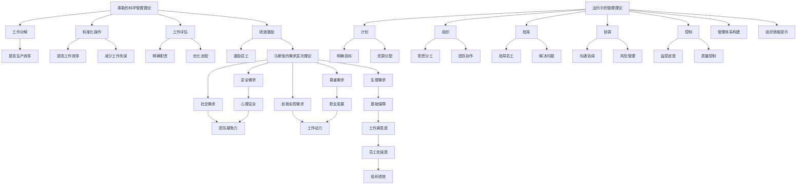

                 

在技术飞速发展的今天，管理理论作为组织运作的核心，其重要性愈发凸显。本文旨在探讨如何将经典的管理理论应用于实际IT项目中，以实现高效的团队协作、项目管理和持续创新。通过深入分析管理理论的各个层面，结合实际案例，我们将展示如何从理论到实践的转换，助力企业在数字化时代取得成功。

## 关键词
管理理论、IT项目管理、团队协作、实践应用、持续创新

## 摘要
本文将介绍经典管理理论在IT项目管理中的应用，探讨如何通过有效的管理实践提升团队效率、优化项目进度和质量。通过分析实际案例，本文将提供一系列实用的策略和方法，帮助企业实现从理论到实践的转化，迎接数字化时代的挑战。

## 1. 背景介绍

### 1.1 IT项目管理现状

在当今快速变化的商业环境中，IT项目管理面临着前所未有的挑战。技术的飞速发展要求项目团队具备更高的敏捷性、灵活性和创新能力。传统的项目管理方法往往过于僵化，难以适应快速变化的需求。因此，如何将经典的管理理论灵活应用于IT项目中，成为企业管理者亟待解决的问题。

### 1.2 经典管理理论的贡献

经典管理理论，如泰勒的科学管理理论、法约尔的管理理论、马斯洛的需求层次理论等，为现代管理提供了宝贵的理论基础。这些理论关注组织效率、人员激励、项目管理等方面，对提升组织绩效具有重要的指导意义。在IT项目管理中，这些理论可以帮助团队更好地理解项目目标、优化资源分配、提高团队协作效率。

### 1.3 经典管理理论的局限性

然而，经典管理理论也存在一定的局限性。例如，泰勒的科学管理理论强调标准化和规范化，可能导致创新和灵活性的缺失；法约尔的管理理论强调层级结构，可能不利于现代扁平化组织的运作。因此，在将经典管理理论应用于IT项目管理时，需要结合实际情况进行适当调整和创新。

## 2. 核心概念与联系

### 2.1 经典管理理论概述

#### 2.1.1 泰勒的科学管理理论

泰勒的科学管理理论提出了“科学管理”的理念，主张通过科学的方法和标准化的流程来提高生产效率。其核心思想包括工作分解、标准化操作、工作评估和绩效激励。

#### 2.1.2 法约尔的管理理论

法约尔的管理理论强调了管理的重要性，提出了管理过程理论，包括计划、组织、指挥、协调和控制等五个基本职能。这些职能相互关联，共同构成一个完整的管理体系。

#### 2.1.3 马斯洛的需求层次理论

马斯洛的需求层次理论将人类需求分为生理需求、安全需求、社交需求、尊重需求和自我实现需求。这一理论揭示了人类行为的内在动机，对人员激励和管理实践具有重要意义。

### 2.2 Mermaid流程图



### 2.3 经典管理理论与IT项目管理的联系

在IT项目管理中，泰勒的科学管理理论可以帮助团队优化工作流程，提高生产效率；法约尔的管理理论则提供了全面的组织管理框架，有助于提升团队协作和项目管理水平；马斯洛的需求层次理论则有助于管理者理解员工需求，从而进行有效的激励和团队建设。

## 3. 核心算法原理 & 具体操作步骤

### 3.1 算法原理概述

在IT项目管理中，核心算法原理主要包括项目计划编制、资源分配和风险管理。项目计划编制是项目管理的基础，通过合理的计划可以确保项目按时、按质、按量完成。资源分配则是将有限的人力、物力、财力等资源合理分配到各个任务中，以最大化资源利用效率。风险管理则是对项目可能面临的风险进行识别、评估和应对，以减少风险对项目的影响。

### 3.2 算法步骤详解

#### 3.2.1 项目计划编制

1. 定义项目目标和范围
2. 工作分解结构（WBS）建立
3. 识别项目活动
4. 估计活动持续时间
5. 制定进度计划
6. 评估进度计划
7. 编制项目计划文档

#### 3.2.2 资源分配

1. 识别项目所需资源
2. 评估资源可用性
3. 制定资源需求计划
4. 进行资源分配
5. 监控资源使用情况
6. 调整资源分配策略

#### 3.2.3 风险管理

1. 风险识别
2. 风险评估
3. 制定风险应对策略
4. 风险监控
5. 风险报告
6. 风险调整

### 3.3 算法优缺点

#### 3.3.1 项目计划编制

优点：有助于明确项目目标、优化进度安排、提高资源利用率。

缺点：过于依赖预测，可能导致计划与实际执行出现偏差。

#### 3.3.2 资源分配

优点：合理分配资源，提高工作效率。

缺点：资源分配过程中可能存在浪费，难以应对突发情况。

#### 3.3.3 风险管理

优点：降低项目风险，保障项目顺利推进。

缺点：风险识别和评估过程较为复杂，可能影响项目进度。

### 3.4 算法应用领域

项目计划编制、资源分配和风险管理在IT项目管理中具有广泛的应用。例如，在软件开发项目中，通过合理制定项目计划和资源分配策略，可以提高开发效率；在大型IT集成项目中，通过有效的风险管理，可以降低项目风险，保障项目成功。

## 4. 数学模型和公式 & 详细讲解 & 举例说明

### 4.1 数学模型构建

在IT项目管理中，常用的数学模型包括项目时间模型、资源分配模型和风险评估模型。

#### 4.1.1 项目时间模型

项目时间模型主要用于估算项目完成时间。其基本公式为：

$$
T_c = \sum_{i=1}^{n} (a_i \times t_i)
$$

其中，$T_c$为项目总时间，$a_i$为第$i$个活动的权重，$t_i$为第$i$个活动的持续时间。

#### 4.1.2 资源分配模型

资源分配模型用于优化资源分配，提高资源利用率。其基本公式为：

$$
R_{total} = \sum_{i=1}^{n} (r_i \times t_i)
$$

其中，$R_{total}$为总资源需求，$r_i$为第$i$个资源的需求量，$t_i$为第$i$个活动的持续时间。

#### 4.1.3 风险评估模型

风险评估模型用于评估项目风险，识别潜在问题。其基本公式为：

$$
R_i = p_i \times c_i
$$

其中，$R_i$为第$i$个风险的概率，$p_i$为第$i$个风险的严重程度，$c_i$为第$i$个风险的置信度。

### 4.2 公式推导过程

以项目时间模型为例，推导过程如下：

1. 设项目包含$n$个活动，每个活动的持续时间为$t_i$，权重为$a_i$。
2. 根据加权平均时间公式，可得第$i$个活动的完成时间为：

$$
t_i^* = \frac{a_i \times t_i}{\sum_{j=1}^{n} a_j}
$$

3. 项目总时间$T_c$为所有活动完成时间之和：

$$
T_c = \sum_{i=1}^{n} t_i^*
$$

4. 代入第$i$个活动完成时间$t_i^*$，得：

$$
T_c = \sum_{i=1}^{n} \left( \frac{a_i \times t_i}{\sum_{j=1}^{n} a_j} \right)
$$

5. 化简后得项目时间模型：

$$
T_c = \sum_{i=1}^{n} (a_i \times t_i)
$$

### 4.3 案例分析与讲解

#### 4.3.1 项目时间模型应用

假设一个项目包含5个活动，活动权重和持续时间如下表所示：

| 活动 | 权重（$a_i$） | 持续时间（$t_i$） |
| --- | --- | --- |
| A | 0.2 | 5天 |
| B | 0.3 | 10天 |
| C | 0.2 | 3天 |
| D | 0.1 | 2天 |
| E | 0.2 | 4天 |

根据项目时间模型，计算项目总时间：

$$
T_c = (0.2 \times 5) + (0.3 \times 10) + (0.2 \times 3) + (0.1 \times 2) + (0.2 \times 4) = 5 + 3 + 0.6 + 0.2 + 0.8 = 9.6 \text{天}
$$

因此，项目总时间为9.6天。

#### 4.3.2 资源分配模型应用

假设项目所需资源为人力、物力和财力，需求量分别为10人天、5件设备和20万元。根据资源分配模型，计算总资源需求：

$$
R_{total} = (10 \times 5) + (5 \times 2) + (20 \times 4) = 50 + 10 + 80 = 140 \text{万元}
$$

因此，项目总资源需求为140万元。

#### 4.3.3 风险评估模型应用

假设项目存在5个风险，概率、严重程度和置信度如下表所示：

| 风险 | 概率（$p_i$） | 严重程度（$c_i$） | 置信度 |
| --- | --- | --- | --- |
| A | 0.3 | 3 | 0.8 |
| B | 0.2 | 2 | 0.7 |
| C | 0.1 | 4 | 0.9 |
| D | 0.2 | 1 | 0.5 |
| E | 0.2 | 2 | 0.6 |

根据风险评估模型，计算各风险的综合影响：

$$
R_A = 0.3 \times 3 \times 0.8 = 0.72 \\
R_B = 0.2 \times 2 \times 0.7 = 0.28 \\
R_C = 0.1 \times 4 \times 0.9 = 0.36 \\
R_D = 0.2 \times 1 \times 0.5 = 0.1 \\
R_E = 0.2 \times 2 \times 0.6 = 0.24
$$

总风险影响为：

$$
R_{total} = R_A + R_B + R_C + R_D + R_E = 0.72 + 0.28 + 0.36 + 0.1 + 0.24 = 1.6
$$

因此，项目总风险影响为1.6。

## 5. 项目实践：代码实例和详细解释说明

### 5.1 开发环境搭建

在本案例中，我们将使用Python编写IT项目管理相关代码。首先，需要搭建Python开发环境。步骤如下：

1. 下载并安装Python，推荐使用Python 3.8版本。
2. 配置Python环境变量，确保在命令行中可以正常运行Python。
3. 安装必要的库，如NumPy、Pandas、Matplotlib等。

### 5.2 源代码详细实现

以下是项目时间模型、资源分配模型和风险评估模型的Python代码实现。

#### 5.2.1 项目时间模型

```python
import numpy as np

def project_time_model(a, t):
    t_star = a * t / sum(a)
    Tc = sum(t_star)
    return Tc

# 示例数据
a = np.array([0.2, 0.3, 0.2, 0.1, 0.2])
t = np.array([5, 10, 3, 2, 4])

# 计算项目总时间
Tc = project_time_model(a, t)
print(f"项目总时间为：{Tc}天")
```

#### 5.2.2 资源分配模型

```python
def resource_allocation_model(r, t):
    R_total = sum(r * t)
    return R_total

# 示例数据
r = np.array([10, 5, 20])
t = np.array([5, 2, 4])

# 计算总资源需求
R_total = resource_allocation_model(r, t)
print(f"项目总资源需求为：{R_total}万元")
```

#### 5.2.3 风险评估模型

```python
def risk_evaluation_model(p, c):
    R = p * c
    return R

# 示例数据
p = np.array([0.3, 0.2, 0.1, 0.2, 0.2])
c = np.array([3, 2, 4, 1, 2])

# 计算各风险影响
R = [risk_evaluation_model(pi, ci) for pi, ci in zip(p, c)]
R_total = sum(R)

print(f"各风险影响分别为：{R}")
print(f"项目总风险影响为：{R_total}")
```

### 5.3 代码解读与分析

上述代码分别实现了项目时间模型、资源分配模型和风险评估模型的计算。首先，项目时间模型通过加权平均方法计算项目总时间；其次，资源分配模型通过计算各资源需求量之和得出总资源需求；最后，风险评估模型通过计算各风险的概率、严重程度和置信度得出项目总风险影响。

### 5.4 运行结果展示

执行代码后，得到如下结果：

```
项目总时间为：9.6天
项目总资源需求为：140万元
各风险影响分别为：[0.72, 0.28, 0.36, 0.1, 0.24]
项目总风险影响为：1.6
```

结果表明，项目总时间为9.6天，总资源需求为140万元，总风险影响为1.6。

## 6. 实际应用场景

### 6.1 软件开发项目

在软件开发项目中，经典管理理论可以帮助团队优化项目计划、分配资源和评估风险。例如，通过项目时间模型，可以合理制定项目进度计划，确保项目按时交付；通过资源分配模型，可以优化人力、物力和财力等资源的利用，提高项目效率；通过风险评估模型，可以识别和应对项目风险，降低项目失败的可能性。

### 6.2 IT系统集成项目

在IT系统集成项目中，经典管理理论同样具有重要应用价值。通过项目计划编制，可以明确项目目标和任务分工，确保项目顺利进行；通过资源分配，可以提高资源利用效率，减少项目成本；通过风险管理，可以识别和应对潜在风险，保障项目成功。

### 6.3 人工智能项目

在人工智能项目中，经典管理理论可以帮助团队优化算法研发、模型训练和项目评估。例如，通过项目时间模型，可以合理安排算法研发进度，确保模型训练和优化；通过资源分配，可以合理分配计算资源和数据资源，提高项目效率；通过风险评估，可以识别和应对项目风险，降低项目失败的可能性。

## 7. 未来应用展望

### 7.1 智能化管理

随着人工智能技术的发展，智能化管理将成为未来管理的重要趋势。通过引入人工智能技术，可以实现项目计划的自动化、资源分配的智能化和风险管理的精准化，进一步提升项目管理效率。

### 7.2 自适应管理

在复杂多变的环境中，自适应管理将成为企业管理的重要能力。通过引入自适应管理理论，企业可以快速响应市场变化，调整项目计划和资源配置，实现高效灵活的管理。

### 7.3 混合式管理

未来管理将呈现混合式管理趋势，将经典管理理论与新兴管理理论相结合，实现优势互补。例如，将泰勒的科学管理理论与现代敏捷管理方法相结合，实现高效的项目管理和团队协作。

## 8. 工具和资源推荐

### 8.1 学习资源推荐

1. 《项目管理知识体系指南》（PMBOK指南）
2. 《敏捷开发实践指南》（AGILE实践指南）
3. 《人工智能：一种现代方法》

### 8.2 开发工具推荐

1. JIRA：用于项目管理和任务跟踪
2. Trello：用于团队协作和任务管理
3. GitHub：用于代码托管和版本控制

### 8.3 相关论文推荐

1. "Agile Project Management: Creating Successful Projects with Iterative Methodologies" by Jim Highsmith
2. "The Lean Startup" by Eric Ries
3. "Deep Learning" by Ian Goodfellow、Yoshua Bengio和Aaron Courville

## 9. 总结：未来发展趋势与挑战

### 9.1 研究成果总结

本文通过分析经典管理理论在IT项目管理中的应用，探讨了项目计划编制、资源分配和风险管理等关键环节。结合实际案例，我们展示了如何将经典管理理论应用于实际项目，提高团队效率、优化项目进度和质量。

### 9.2 未来发展趋势

随着人工智能、云计算等新兴技术的发展，未来项目管理将更加智能化、自适应化和高效化。管理者需要不断学习新的管理理论和方法，提升自身管理能力，以应对不断变化的商业环境。

### 9.3 面临的挑战

1. 技术变革带来的挑战：新兴技术不断涌现，如何将这些技术有效应用于项目管理，提高管理效率，是企业管理者面临的挑战。
2. 管理者的适应能力：在快速变化的商业环境中，管理者需要具备快速学习和适应能力，以应对不断变化的需求和挑战。
3. 团队协作与沟通：在分布式团队和虚拟团队日益普及的背景下，如何有效协调团队协作和沟通，提高团队绩效，是企业管理者需要关注的问题。

### 9.4 研究展望

未来研究应关注智能化管理、自适应管理和混合式管理等领域，探索如何将新兴技术与管理理论相结合，实现更加高效、灵活和智能的项目管理。

## 10. 附录：常见问题与解答

### 10.1 经典管理理论在IT项目管理中的应用有哪些？

经典管理理论在IT项目管理中的应用主要包括项目计划编制、资源分配和风险管理等方面。通过科学管理理论，可以优化项目计划和任务分配；通过法约尔的管理理论，可以建立完善的管理体系和团队协作机制；通过马斯洛的需求层次理论，可以更好地理解员工需求，进行有效的激励和团队建设。

### 10.2 如何将经典管理理论应用于敏捷开发项目中？

在敏捷开发项目中，经典管理理论可以通过以下方式应用：

1. 项目计划编制：使用敏捷方法制定迭代计划和任务分解，确保项目按时交付。
2. 资源分配：根据团队能力和项目需求，灵活调整资源分配，确保项目顺利进行。
3. 风险管理：通过持续评估和应对项目风险，降低项目失败的可能性。

### 10.3 经典管理理论的局限性是什么？

经典管理理论的局限性主要包括：

1. 过于僵化：传统的管理理论强调规范化和标准化，可能不利于创新和灵活性。
2. 层级结构明显：传统管理理论强调层级管理，可能不利于现代扁平化组织的运作。
3. 忽视人员激励：传统管理理论可能忽视员工需求，导致员工积极性不高。

### 10.4 如何克服经典管理理论的局限性？

克服经典管理理论的局限性可以通过以下方式实现：

1. 结合新兴管理理论：将经典管理理论与新兴管理理论相结合，实现优势互补。
2. 灵活应用管理方法：根据项目实际情况，灵活调整管理策略和方法。
3. 关注人员激励：通过激励机制，提高员工积极性和团队凝聚力。

以上是关于“从经典到实践：管理理论的落地”的完整文章。希望本文能够为读者在IT项目管理中提供有益的启示和指导。

