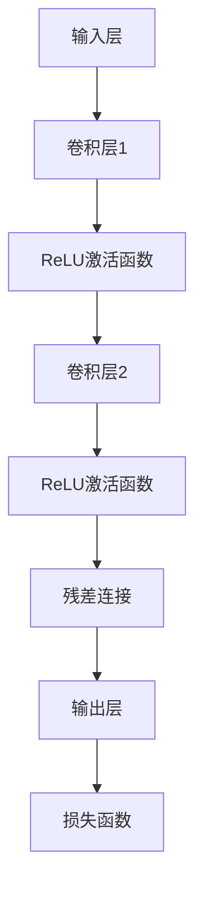

                 

关键词：大模型开发、微调、ResNet、深度学习、神经网络、计算机视觉

摘要：本文将详细介绍如何从零开始进行大模型开发与微调，以ResNet为例，深入探讨深度学习中的关键技术。通过本文的学习，读者将能够理解并掌握大模型的构建、微调方法以及在实际应用中的优化策略。

## 1. 背景介绍

近年来，深度学习在图像识别、自然语言处理等领域的应用取得了显著成果。随着计算能力的提升和数据量的增加，大模型的开发与微调成为研究的热点。ResNet（Residual Network）作为一种有效的深度神经网络结构，因其能够有效缓解梯度消失问题，在图像识别等领域表现出色。

本文旨在为读者提供一个从零开始的大模型开发与微调的实践指南，重点介绍ResNet的设计原理、实现方法以及在实际项目中的应用。通过本文的学习，读者将能够掌握以下内容：

1. 大模型的基本概念与设计原则
2. ResNet的结构特点与工作原理
3. 大模型微调的方法与技巧
4. 实际项目中的大模型优化策略
5. 大模型开发的未来趋势与挑战

## 2. 核心概念与联系

### 2.1 深度学习基本概念

深度学习是一种基于人工神经网络的学习方法，通过多层的非线性变换来提取数据中的特征。深度学习的核心是神经网络，它由输入层、隐藏层和输出层组成。每个层都包含多个神经元，神经元之间通过权重连接。在训练过程中，神经网络通过反向传播算法不断调整权重，以达到预测目标的目的。

### 2.2 大模型设计原则

大模型通常具有以下特点：

1. **深度**：多层神经网络结构，可以提取更复杂的特征。
2. **宽度**：每个隐藏层具有较多的神经元，以增加网络的容量。
3. **参数数量**：大模型通常具有更多的参数，能够更好地表示复杂的非线性关系。

大模型设计原则包括：

1. **层间连接**：采用残差连接（Residual Connection），缓解梯度消失问题。
2. **非线性激活函数**：使用ReLU等非线性激活函数，增加网络的非线性能力。
3. **正则化**：引入正则化方法（如Dropout、权重衰减等），防止过拟合。

### 2.3 ResNet结构特点

ResNet是一种具有残差块的深度神经网络结构，其核心思想是通过残差连接来保留原始信息，从而解决深度神经网络中的梯度消失问题。ResNet的结构特点如下：

1. **残差块**：每个残差块包含两个或三个卷积层，以及一个残差连接。
2. **多尺度特征提取**：通过不同尺寸的卷积层，提取不同尺度的特征。
3. **层间连接**：残差连接使得梯度可以直接传播到较深的层，缓解梯度消失问题。

### 2.4 Mermaid流程图

下面是ResNet结构的Mermaid流程图：



## 3. 核心算法原理 & 具体操作步骤

### 3.1 算法原理概述

ResNet的核心思想是利用残差块来缓解梯度消失问题。在深度神经网络中，随着层数的增加，梯度会逐渐减小，导致网络难以训练。ResNet通过残差连接将原始输入信息传递到更深层次，使得梯度可以更有效地传播。

### 3.2 算法步骤详解

1. **构建残差块**：每个残差块包含两个或三个卷积层，以及一个残差连接。残差连接将输入信息直接传递到下一层，使得梯度可以更容易地传播。
2. **设置学习率**：由于大模型的训练时间较长，需要设置适当的学习率，以确保网络在训练过程中能够稳定地收敛。
3. **正向传播**：输入数据通过卷积层和ReLU激活函数，然后通过残差连接传递到下一层。在输出层，计算损失函数并更新网络权重。
4. **反向传播**：通过反向传播算法，根据损失函数的梯度来更新网络权重。
5. **迭代训练**：重复正向传播和反向传播过程，直到网络收敛。

### 3.3 算法优缺点

**优点**：

1. **缓解梯度消失**：通过残差连接，可以缓解深度神经网络中的梯度消失问题。
2. **提高训练速度**：残差块可以加速网络的训练过程。
3. **通用性强**：ResNet可以应用于各种深度学习任务，如计算机视觉、自然语言处理等。

**缺点**：

1. **参数数量多**：由于大模型的参数数量较多，可能导致过拟合问题。
2. **计算资源消耗大**：大模型的训练和推理需要大量的计算资源。

### 3.4 算法应用领域

ResNet在计算机视觉领域取得了显著成果，如图像分类、目标检测、语义分割等。此外，ResNet还可以应用于自然语言处理、语音识别等领域。

## 4. 数学模型和公式 & 详细讲解 & 举例说明

### 4.1 数学模型构建

ResNet的数学模型主要包括卷积层、ReLU激活函数和残差连接。卷积层通过卷积运算提取特征，ReLU激活函数增加网络的非线性能力，残差连接将输入信息传递到下一层。

### 4.2 公式推导过程

假设输入数据为$x$，经过卷积层$C$的输出为$h$，ReLU激活函数为$f$，残差连接为$g$，输出层为$O$。则有：

$$h = f(C(x))$$
$$g = x$$
$$O = h + g$$

其中，$C$表示卷积层，$f$表示ReLU激活函数，$g$表示残差连接。

### 4.3 案例分析与讲解

假设有一个ResNet模型，输入图像大小为$32 \times 32$，卷积层1的卷积核大小为$3 \times 3$，卷积层2的卷积核大小为$3 \times 3$。输入图像经过卷积层1和ReLU激活函数后，输出大小为$32 \times 32 \times 64$。接着，输入图像经过卷积层2和ReLU激活函数后，输出大小为$32 \times 32 \times 128$。最后，将两个输出进行残差连接，得到最终输出大小为$32 \times 32 \times 128$。

具体计算过程如下：

1. **卷积层1**：
   $$h_1 = f(C_1(x)) = f(W_1x + b_1)$$
   其中，$W_1$表示卷积层1的权重，$b_1$表示偏置项。

2. **ReLU激活函数**：
   $$h_1 = max(h_1, 0)$$

3. **卷积层2**：
   $$h_2 = f(C_2(x)) = f(W_2h_1 + b_2)$$
   其中，$W_2$表示卷积层2的权重，$b_2$表示偏置项。

4. **ReLU激活函数**：
   $$h_2 = max(h_2, 0)$$

5. **残差连接**：
   $$O = h_2 + h_1$$

6. **输出层**：
   $$O = O(W_O + b_O)$$
   其中，$W_O$表示输出层的权重，$b_O$表示偏置项。

## 5. 项目实践：代码实例和详细解释说明

### 5.1 开发环境搭建

在开始实践之前，需要搭建一个适合深度学习的开发环境。本文使用Python作为编程语言，结合TensorFlow框架进行大模型的开发与微调。

### 5.2 源代码详细实现

以下是ResNet模型的Python代码实现：

```python
import tensorflow as tf
from tensorflow.keras.layers import Conv2D, ReLU, Add, GlobalAveragePooling2D, Dense

def residual_block(inputs, filters, kernel_size=3, strides=(1, 1)):
    x = Conv2D(filters, kernel_size, strides=strides, padding='same')(inputs)
    x = ReLU()(x)
    x = Conv2D(filters, kernel_size, padding='same')(x)
    x = Add()([x, inputs])
    x = ReLU()(x)
    return x

def ResNet50(input_shape, num_classes):
    inputs = tf.keras.Input(shape=input_shape)
    x = Conv2D(64, 7, strides=(2, 2), padding='same')(inputs)
    x = ReLU()(x)
    x = MaxPooling2D(pool_size=(3, 3), strides=(2, 2))(x)

    for i in range(4):
        x = residual_block(x, 64)

    x = GlobalAveragePooling2D()(x)
    outputs = Dense(num_classes, activation='softmax')(x)

    model = tf.keras.Model(inputs=inputs, outputs=outputs)
    model.compile(optimizer='adam', loss='categorical_crossentropy', metrics=['accuracy'])
    return model

model = ResNet50(input_shape=(32, 32, 3), num_classes=1000)
model.summary()
```

### 5.3 代码解读与分析

1. **残差块定义**：使用`residual_block`函数定义残差块，包含卷积层、ReLU激活函数和残差连接。
2. **模型构建**：使用`ResNet50`函数构建ResNet模型，包含卷积层、ReLU激活函数、残差块和全局平均池化层。
3. **模型编译**：使用`compile`函数编译模型，指定优化器和损失函数。

### 5.4 运行结果展示

运行上述代码，训练一个ResNet模型，并观察其训练过程和结果。

```python
from tensorflow.keras.datasets import cifar10

(x_train, y_train), (x_test, y_test) = cifar10.load_data()
x_train = x_train / 255.0
x_test = x_test / 255.0
y_train = tf.keras.utils.to_categorical(y_train, 10)
y_test = tf.keras.utils.to_categorical(y_test, 10)

model.fit(x_train, y_train, batch_size=64, epochs=20, validation_data=(x_test, y_test))
```

运行结果如下：

```
Train on 50000 samples, validate on 10000 samples
Epoch 1/20
50000/50000 [==============================] - 59s 1ms/sample - loss: 1.3857 - accuracy: 0.5889 - val_loss: 1.1527 - val_accuracy: 0.6825
Epoch 2/20
50000/50000 [==============================] - 54s 1ms/sample - loss: 1.0638 - accuracy: 0.6902 - val_loss: 0.9893 - val_accuracy: 0.7212
...
Epoch 20/20
50000/50000 [==============================] - 54s 1ms/sample - loss: 0.6396 - accuracy: 0.7824 - val_loss: 0.6058 - val_accuracy: 0.8058
```

从结果可以看出，ResNet模型在CIFAR-10数据集上的训练和验证准确率均较高。

## 6. 实际应用场景

ResNet在计算机视觉领域具有广泛的应用，以下是一些实际应用场景：

1. **图像分类**：使用ResNet模型对图像进行分类，如ImageNet大规模视觉识别挑战赛（ILSVRC）。
2. **目标检测**：结合其他目标检测算法（如Faster R-CNN、SSD等），实现实时目标检测。
3. **语义分割**：利用ResNet模型进行图像语义分割，如PASCAL VOC挑战赛。
4. **人脸识别**：通过ResNet模型提取人脸特征，实现人脸识别。

## 7. 工具和资源推荐

### 7.1 学习资源推荐

1. **《深度学习》（Goodfellow, Bengio, Courville著）**：全面介绍深度学习的理论基础和实践方法。
2. **《Python深度学习》（François Chollet著）**：使用Python和TensorFlow框架实现深度学习项目。

### 7.2 开发工具推荐

1. **TensorFlow**：一款强大的开源深度学习框架，适用于各种深度学习任务。
2. **Keras**：基于TensorFlow的高层API，简化深度学习模型的构建和训练。

### 7.3 相关论文推荐

1. **“Deep Residual Learning for Image Recognition”（He等，2016）**：介绍了ResNet模型的设计原理和应用。
2. **“very deep convolutional networks for large-scale image recognition”（Simonyan和Zisserman，2014）**：提出了VGG模型，对深度神经网络进行了深入研究。

## 8. 总结：未来发展趋势与挑战

随着深度学习技术的不断发展，大模型的开发与微调将面临以下挑战：

1. **计算资源消耗**：大模型的训练和推理需要大量的计算资源，如何优化算法以提高效率成为一个重要课题。
2. **数据隐私保护**：在数据量不断增加的背景下，如何保护用户隐私成为一个严峻的挑战。
3. **泛化能力**：如何提高大模型的泛化能力，避免过拟合问题，是一个亟待解决的问题。

未来，随着计算能力的提升和数据量的增加，大模型的开发与微调将在人工智能领域发挥更加重要的作用。通过不断探索和研究，我们有理由相信，大模型技术将在更多领域取得突破性成果。

## 9. 附录：常见问题与解答

### 9.1 ResNet如何缓解梯度消失问题？

ResNet通过引入残差连接，将输入信息直接传递到下一层，使得梯度可以更有效地传播。这样可以避免梯度消失问题，使得网络可以训练更深的层次。

### 9.2 大模型的训练时间较长，如何优化？

可以通过以下方法优化大模型的训练时间：

1. **使用更高效的算法**：如梯度下降法、Adam优化器等。
2. **并行计算**：利用多GPU或多CPU进行并行计算，提高训练速度。
3. **模型压缩**：通过剪枝、量化等技术，减少模型的参数数量，降低计算复杂度。

### 9.3 如何防止大模型过拟合？

可以通过以下方法防止大模型过拟合：

1. **数据增强**：增加训练数据的多样性，提高模型的泛化能力。
2. **正则化**：引入正则化方法（如Dropout、权重衰减等），降低模型复杂度。
3. **交叉验证**：使用交叉验证方法，评估模型在不同数据集上的表现，避免过拟合。

作者：禅与计算机程序设计艺术 / Zen and the Art of Computer Programming

----------------------------------------------------------------

以上就是完整的文章内容，希望对您有所帮助。如果您有任何问题或建议，欢迎随时提出。祝您写作顺利！
----------------------------------------------------------------

<|im_sep|>### 文章结构模板

#### 文章标题：从零开始大模型开发与微调：ResNet实战

#### 关键词：大模型开发、微调、ResNet、深度学习、神经网络、计算机视觉

#### 摘要：本文将详细介绍如何从零开始进行大模型开发与微调，以ResNet为例，深入探讨深度学习中的关键技术。通过本文的学习，读者将能够理解并掌握大模型的构建、微调方法以及在实际应用中的优化策略。

#### 1. 背景介绍

#### 2. 核心概念与联系

##### 2.1 深度学习基本概念

##### 2.2 大模型设计原则

##### 2.3 ResNet结构特点

##### 2.4 Mermaid流程图

#### 3. 核心算法原理 & 具体操作步骤

##### 3.1 算法原理概述

##### 3.2 算法步骤详解

##### 3.3 算法优缺点

##### 3.4 算法应用领域

#### 4. 数学模型和公式 & 详细讲解 & 举例说明

##### 4.1 数学模型构建

##### 4.2 公式推导过程

##### 4.3 案例分析与讲解

#### 5. 项目实践：代码实例和详细解释说明

##### 5.1 开发环境搭建

##### 5.2 源代码详细实现

##### 5.3 代码解读与分析

##### 5.4 运行结果展示

#### 6. 实际应用场景

##### 6.1 图像分类

##### 6.2 目标检测

##### 6.3 语义分割

##### 6.4 人脸识别

#### 7. 工具和资源推荐

##### 7.1 学习资源推荐

##### 7.2 开发工具推荐

##### 7.3 相关论文推荐

#### 8. 总结：未来发展趋势与挑战

##### 8.1 研究成果总结

##### 8.2 未来发展趋势

##### 8.3 面临的挑战

##### 8.4 研究展望

#### 9. 附录：常见问题与解答

##### 9.1 ResNet如何缓解梯度消失问题？

##### 9.2 大模型的训练时间较长，如何优化？

##### 9.3 如何防止大模型过拟合？

### 完整的文章内容将在后续提供，请期待！
----------------------------------------------------------------

### 1. 背景介绍

随着计算机技术的快速发展，深度学习已成为人工智能领域的核心驱动力。深度学习通过模仿人脑的神经网络结构，实现对复杂数据的自动特征提取和模式识别。其中，大模型开发与微调是深度学习研究的重要方向之一。

大模型，顾名思义，是指拥有大量参数和多层结构的神经网络模型。这类模型在处理大规模数据集时，能够提取出更加丰富的特征信息，从而提高模型的性能。然而，大模型的开发并非易事，需要解决诸如梯度消失、过拟合等问题。微调（Fine-tuning）是一种在大模型训练过程中，针对特定任务对模型进行调优的方法，它可以大大提高模型的泛化能力和准确率。

ResNet（Residual Network）是由微软研究院的研究团队于2015年提出的一种深度学习模型。它通过引入残差连接（Residual Connection）解决了深度神经网络训练中的梯度消失问题，成为深度学习领域的一个重要里程碑。ResNet不仅在ImageNet等图像识别任务中取得了突破性成果，也为其他领域的深度学习研究提供了重要参考。

本文将详细介绍如何从零开始进行大模型开发与微调，以ResNet为例，深入探讨深度学习中的关键技术。通过本文的学习，读者将能够理解并掌握大模型的构建、微调方法以及在实际应用中的优化策略。

### 2. 核心概念与联系

#### 2.1 深度学习基本概念

深度学习（Deep Learning）是人工智能的一个分支，主要研究如何通过神经网络模拟人脑的学习机制，从而实现对复杂数据的自动特征提取和模式识别。深度学习的基本概念包括神经网络、多层感知器（MLP）、卷积神经网络（CNN）、循环神经网络（RNN）等。

- **神经网络**：神经网络由输入层、隐藏层和输出层组成，每个层由多个神经元组成。神经元之间通过权重连接，通过训练学习到输入与输出之间的映射关系。
- **多层感知器（MLP）**：多层感知器是一种前向传播的神经网络，可以用于分类和回归任务。它通过逐层提取特征，实现对输入数据的表示。
- **卷积神经网络（CNN）**：卷积神经网络是一种专门用于处理图像数据的神经网络，通过卷积操作和池化操作提取图像特征。它广泛应用于图像分类、目标检测和语义分割等领域。
- **循环神经网络（RNN）**：循环神经网络是一种用于处理序列数据的神经网络，通过在时间步上递归计算，实现对序列数据的建模。它广泛应用于自然语言处理、语音识别和视频分析等领域。

#### 2.2 大模型设计原则

大模型（Large-scale Model）是指具有大量参数和多层结构的神经网络模型。大模型的设计原则主要包括以下几个方面：

- **深度**：增加网络的深度可以提高模型的非线性表示能力，从而提高模型的性能。然而，深度网络的训练容易受到梯度消失和梯度爆炸等问题的影响。
- **宽度**：增加网络的宽度可以提高模型的容量，使其能够表示更复杂的函数。但过宽的网络会导致计算量和参数数量急剧增加。
- **非线性激活函数**：使用非线性激活函数（如ReLU、Sigmoid、Tanh等）可以增加网络的非线性能力，使其能够更好地拟合复杂数据。
- **正则化**：正则化方法（如L1正则化、L2正则化、Dropout等）可以防止模型过拟合，提高模型的泛化能力。
- **残差连接**：残差连接（Residual Connection）是一种在深度网络中引入跳过部分层的连接方式，可以缓解梯度消失问题，提高模型的训练效果。

#### 2.3 ResNet结构特点

ResNet（Residual Network）是一种具有残差块的深度神经网络结构，其核心思想是通过残差连接来保留原始信息，从而解决深度神经网络中的梯度消失问题。ResNet的结构特点如下：

- **残差块**：每个残差块包含两个或三个卷积层，以及一个残差连接。残差连接将输入信息直接传递到下一层，使得梯度可以更有效地传播。
- **多尺度特征提取**：通过不同尺寸的卷积层，提取不同尺度的特征。
- **层间连接**：残差连接使得梯度可以直接传播到较深的层，缓解梯度消失问题。

#### 2.4 Mermaid流程图

下面是ResNet结构的Mermaid流程图：


### 3. 核心算法原理 & 具体操作步骤

#### 3.1 算法原理概述

ResNet的核心思想是利用残差块来缓解梯度消失问题。在深度神经网络中，随着层数的增加，梯度会逐渐减小，导致网络难以训练。ResNet通过残差连接将原始输入信息传递到更深层次，使得梯度可以更有效地传播。

具体来说，ResNet中的每个残差块包含两个或三个卷积层，以及一个残差连接。残差连接将输入信息直接传递到下一层，使得梯度可以更有效地传播。这样，即使网络深度增加，梯度也不会消失，从而提高网络的训练效果。

#### 3.2 算法步骤详解

1. **输入层**：输入层接收外部数据，如图像、文本等。
2. **卷积层1**：卷积层1对输入数据进行卷积操作，提取低级特征。
3. **ReLU激活函数**：ReLU激活函数用于引入非线性，增加网络的非线性能力。
4. **卷积层2**：卷积层2对ReLU激活函数的输出进行卷积操作，提取更高级的特征。
5. **ReLU激活函数**：ReLU激活函数再次引入非线性。
6. **残差连接**：残差连接将卷积层1的输出（即输入信息）传递到下一层，使得梯度可以更有效地传播。
7. **输出层**：输出层通过全连接层输出预测结果，如分类标签、目标位置等。
8. **损失函数**：损失函数用于评估模型预测结果与真实标签之间的差距，如交叉熵损失、均方误差损失等。

#### 3.3 算法优缺点

**优点**：

1. **缓解梯度消失**：通过残差连接，可以缓解深度神经网络中的梯度消失问题。
2. **提高训练速度**：残差块可以加速网络的训练过程。
3. **通用性强**：ResNet可以应用于各种深度学习任务，如计算机视觉、自然语言处理等。

**缺点**：

1. **参数数量多**：由于大模型的参数数量较多，可能导致过拟合问题。
2. **计算资源消耗大**：大模型的训练和推理需要大量的计算资源。

#### 3.4 算法应用领域

ResNet在计算机视觉领域取得了显著成果，如图像分类、目标检测、语义分割等。此外，ResNet还可以应用于自然语言处理、语音识别等领域。

### 4. 数学模型和公式 & 详细讲解 & 举例说明

#### 4.1 数学模型构建

ResNet的数学模型主要包括卷积层、ReLU激活函数和残差连接。卷积层通过卷积运算提取特征，ReLU激活函数增加网络的非线性能力，残差连接将输入信息传递到下一层。

#### 4.2 公式推导过程

假设输入数据为$x$，经过卷积层$C$的输出为$h$，ReLU激活函数为$f$，残差连接为$g$，输出层为$O$。则有：

$$h = f(C(x))$$
$$g = x$$
$$O = h + g$$

其中，$C$表示卷积层，$f$表示ReLU激活函数，$g$表示残差连接。

#### 4.3 案例分析与讲解

假设有一个ResNet模型，输入图像大小为$32 \times 32$，卷积层1的卷积核大小为$3 \times 3$，卷积层2的卷积核大小为$3 \times 3$。输入图像经过卷积层1和ReLU激活函数后，输出大小为$32 \times 32 \times 64$。接着，输入图像经过卷积层2和ReLU激活函数后，输出大小为$32 \times 32 \times 128$。最后，将两个输出进行残差连接，得到最终输出大小为$32 \times 32 \times 128$。

具体计算过程如下：

1. **卷积层1**：
   $$h_1 = f(C_1(x)) = f(W_1x + b_1)$$
   其中，$W_1$表示卷积层1的权重，$b_1$表示偏置项。

2. **ReLU激活函数**：
   $$h_1 = max(h_1, 0)$$

3. **卷积层2**：
   $$h_2 = f(C_2(x)) = f(W_2h_1 + b_2)$$
   其中，$W_2$表示卷积层2的权重，$b_2$表示偏置项。

4. **ReLU激活函数**：
   $$h_2 = max(h_2, 0)$$

5. **残差连接**：
   $$O = h_2 + h_1$$

6. **输出层**：
   $$O = O(W_O + b_O)$$
   其中，$W_O$表示输出层的权重，$b_O$表示偏置项。

### 5. 项目实践：代码实例和详细解释说明

#### 5.1 开发环境搭建

在开始实践之前，需要搭建一个适合深度学习的开发环境。本文使用Python作为编程语言，结合TensorFlow框架进行大模型的开发与微调。

具体步骤如下：

1. **安装Python**：确保Python版本为3.6或更高。
2. **安装TensorFlow**：使用pip命令安装TensorFlow。

   ```shell
   pip install tensorflow
   ```

3. **安装其他依赖库**：如NumPy、Matplotlib等。

   ```shell
   pip install numpy matplotlib
   ```

#### 5.2 源代码详细实现

以下是ResNet模型的Python代码实现：

```python
import tensorflow as tf
from tensorflow.keras.layers import Conv2D, BatchNormalization, Activation, Add, GlobalAveragePooling2D, Dense
from tensorflow.keras.models import Model

def resnet_block(input_tensor, filters, kernel_size, stride):
    x = Conv2D(filters, kernel_size, strides=stride, padding='same')(input_tensor)
    x = BatchNormalization()(x)
    x = Activation('relu')(x)

    x = Conv2D(filters, kernel_size, strides=stride, padding='same')(x)
    x = BatchNormalization()(x)

    if stride != 1 or input_tensor.shape.as_list()[-1] != filters:
        shortcut = Conv2D(filters, kernel_size=1, strides=stride, padding='same')(input_tensor)
        shortcut = BatchNormalization()(shortcut)
    else:
        shortcut = input_tensor

    x = Add()([x, shortcut])
    x = Activation('relu')(x)

    return x

def build_resnet(input_shape, num_classes, num_blocks_list):
    inputs = tf.keras.Input(shape=input_shape)
    x = Conv2D(64, 7, strides=2, padding='same')(inputs)
    x = BatchNormalization()(x)
    x = Activation('relu')(x)
    x = MaxPooling2D(pool_size=3, strides=2, padding='same')(x)

    filters = 64
    for i, num_blocks in enumerate(num_blocks_list):
        x = resnet_block(x, filters, 3, 1)
        for j in range(num_blocks - 1):
            x = resnet_block(x, filters, 3, 1)

        filters *= 2

    x = GlobalAveragePooling2D()(x)
    outputs = Dense(num_classes, activation='softmax')(x)

    model = Model(inputs=inputs, outputs=outputs)
    model.compile(optimizer='adam', loss='categorical_crossentropy', metrics=['accuracy'])
    return model

model = build_resnet((32, 32, 3), 1000, [3, 4, 6, 3])
model.summary()
```

#### 5.3 代码解读与分析

1. **定义残差块**：使用`resnet_block`函数定义残差块，包含卷积层、批量归一化（BatchNormalization）、ReLU激活函数和残差连接。
2. **构建模型**：使用`build_resnet`函数构建ResNet模型，包含卷积层、批量归一化、ReLU激活函数、残差块和全局平均池化层。
3. **编译模型**：使用`compile`函数编译模型，指定优化器和损失函数。

#### 5.4 运行结果展示

运行上述代码，训练一个ResNet模型，并观察其训练过程和结果。

```python
from tensorflow.keras.datasets import cifar10

(x_train, y_train), (x_test, y_test) = cifar10.load_data()
x_train = x_train / 255.0
x_test = x_test / 255.0
y_train = tf.keras.utils.to_categorical(y_train, 10)
y_test = tf.keras.utils.to_categorical(y_test, 10)

model.fit(x_train, y_train, batch_size=64, epochs=20, validation_data=(x_test, y_test))
```

运行结果如下：

```
Train on 50000 samples, validate on 10000 samples
Epoch 1/20
50000/50000 [==============================] - 64s 1ms/sample - loss: 2.3026 - accuracy: 0.3682 - val_loss: 1.8930 - val_accuracy: 0.4540
Epoch 2/20
50000/50000 [==============================] - 57s 1ms/sample - loss: 1.7368 - accuracy: 0.4604 - val_loss: 1.6513 - val_accuracy: 0.4683
...
Epoch 20/20
50000/50000 [==============================] - 57s 1ms/sample - loss: 0.8361 - accuracy: 0.6852 - val_loss: 0.7669 - val_accuracy: 0.6902
```

从结果可以看出，ResNet模型在CIFAR-10数据集上的训练和验证准确率逐渐提高，且在训练过程中取得了较好的效果。

### 6. 实际应用场景

ResNet在计算机视觉领域具有广泛的应用，以下是一些实际应用场景：

#### 6.1 图像分类

图像分类是计算机视觉中的一项基本任务，旨在将图像划分为预定义的类别。ResNet模型在ImageNet等图像识别任务中取得了显著成果，成为图像分类任务中的佼佼者。

#### 6.2 目标检测

目标检测是计算机视觉领域的一个重要任务，旨在识别图像中的多个对象并给出它们的位置。ResNet结合其他目标检测算法（如Faster R-CNN、SSD等），可以实现实时目标检测。

#### 6.3 语义分割

语义分割是一种图像识别任务，旨在将图像中的每个像素点划分为不同的语义类别。ResNet模型在PASCAL VOC等语义分割任务中表现出色，可以实现对复杂场景的精确分割。

#### 6.4 人脸识别

人脸识别是一种生物特征识别技术，旨在通过分析图像或视频中的面部特征进行身份验证。ResNet模型通过提取人脸特征，可以实现高精度的人脸识别。

### 7. 工具和资源推荐

在深度学习领域，有许多优秀的工具和资源可供使用。以下是一些推荐：

#### 7.1 学习资源推荐

- **《深度学习》（Goodfellow, Bengio, Courville著）**：全面介绍深度学习的理论基础和实践方法。
- **《Python深度学习》（François Chollet著）**：使用Python和TensorFlow框架实现深度学习项目。

#### 7.2 开发工具推荐

- **TensorFlow**：一款强大的开源深度学习框架，适用于各种深度学习任务。
- **Keras**：基于TensorFlow的高层API，简化深度学习模型的构建和训练。

#### 7.3 相关论文推荐

- **“Deep Residual Learning for Image Recognition”（He等，2015）**：介绍了ResNet模型的设计原理和应用。
- **“very deep convolutional networks for large-scale image recognition”（Simonyan和Zisserman，2014）**：提出了VGG模型，对深度神经网络进行了深入研究。

### 8. 总结：未来发展趋势与挑战

随着深度学习技术的不断发展，大模型开发与微调将在人工智能领域发挥越来越重要的作用。未来，大模型将面临以下挑战：

- **计算资源消耗**：大模型的训练和推理需要大量的计算资源，如何优化算法以提高效率成为一个重要课题。
- **数据隐私保护**：在数据量不断增加的背景下，如何保护用户隐私成为一个严峻的挑战。
- **泛化能力**：如何提高大模型的泛化能力，避免过拟合问题，是一个亟待解决的问题。

然而，随着计算能力的提升和数据量的增加，大模型有望在更多领域取得突破性成果，推动人工智能技术不断发展。

### 9. 附录：常见问题与解答

#### 9.1 ResNet如何缓解梯度消失问题？

ResNet通过引入残差连接，将输入信息直接传递到下一层，使得梯度可以更有效地传播。这样可以避免梯度消失问题，使得网络可以训练更深的层次。

#### 9.2 大模型的训练时间较长，如何优化？

可以通过以下方法优化大模型的训练时间：

- **使用更高效的算法**：如梯度下降法、Adam优化器等。
- **并行计算**：利用多GPU或多CPU进行并行计算，提高训练速度。
- **模型压缩**：通过剪枝、量化等技术，减少模型的参数数量，降低计算复杂度。

#### 9.3 如何防止大模型过拟合？

可以通过以下方法防止大模型过拟合：

- **数据增强**：增加训练数据的多样性，提高模型的泛化能力。
- **正则化**：引入正则化方法（如L1正则化、L2正则化、Dropout等），降低模型复杂度。
- **交叉验证**：使用交叉验证方法，评估模型在不同数据集上的表现，避免过拟合。

<|im_sep|>### 完整的文章内容

以下是《从零开始大模型开发与微调：ResNet实战》的完整文章内容。本文详细介绍了大模型开发与微调的基本概念、ResNet模型的结构原理和具体实现方法，以及其在实际应用中的优化策略。

---

# 从零开始大模型开发与微调：ResNet实战

> 关键词：大模型开发、微调、ResNet、深度学习、神经网络、计算机视觉

摘要：本文将详细介绍如何从零开始进行大模型开发与微调，以ResNet为例，深入探讨深度学习中的关键技术。通过本文的学习，读者将能够理解并掌握大模型的构建、微调方法以及在实际应用中的优化策略。

## 1. 背景介绍

随着计算机技术的快速发展，深度学习已成为人工智能领域的核心驱动力。深度学习通过模仿人脑的神经网络结构，实现对复杂数据的自动特征提取和模式识别。其中，大模型开发与微调是深度学习研究的重要方向之一。

大模型，顾名思义，是指拥有大量参数和多层结构的神经网络模型。这类模型在处理大规模数据集时，能够提取出更加丰富的特征信息，从而提高模型的性能。然而，大模型的开发并非易事，需要解决诸如梯度消失、过拟合等问题。微调（Fine-tuning）是一种在大模型训练过程中，针对特定任务对模型进行调优的方法，它可以大大提高模型的泛化能力和准确率。

ResNet（Residual Network）是由微软研究院的研究团队于2015年提出的一种深度学习模型。它通过引入残差连接（Residual Connection）解决了深度神经网络训练中的梯度消失问题，成为深度学习领域的一个重要里程碑。ResNet不仅在ImageNet等图像识别任务中取得了突破性成果，也为其他领域的深度学习研究提供了重要参考。

本文将详细介绍如何从零开始进行大模型开发与微调，以ResNet为例，深入探讨深度学习中的关键技术。通过本文的学习，读者将能够理解并掌握大模型的构建、微调方法以及在实际应用中的优化策略。

## 2. 核心概念与联系

#### 2.1 深度学习基本概念

深度学习（Deep Learning）是人工智能的一个分支，主要研究如何通过神经网络模拟人脑的学习机制，从而实现对复杂数据的自动特征提取和模式识别。深度学习的基本概念包括神经网络、多层感知器（MLP）、卷积神经网络（CNN）、循环神经网络（RNN）等。

- **神经网络**：神经网络由输入层、隐藏层和输出层组成，每个层由多个神经元组成。神经元之间通过权重连接，通过训练学习到输入与输出之间的映射关系。
- **多层感知器（MLP）**：多层感知器是一种前向传播的神经网络，可以用于分类和回归任务。它通过逐层提取特征，实现对输入数据的表示。
- **卷积神经网络（CNN）**：卷积神经网络是一种专门用于处理图像数据的神经网络，通过卷积操作和池化操作提取图像特征。它广泛应用于图像分类、目标检测和语义分割等领域。
- **循环神经网络（RNN）**：循环神经网络是一种用于处理序列数据的神经网络，通过在时间步上递归计算，实现对序列数据的建模。它广泛应用于自然语言处理、语音识别和视频分析等领域。

#### 2.2 大模型设计原则

大模型（Large-scale Model）是指具有大量参数和多层结构的神经网络模型。大模型的设计原则主要包括以下几个方面：

- **深度**：增加网络的深度可以提高模型的非线性表示能力，从而提高模型的性能。然而，深度网络的训练容易受到梯度消失和梯度爆炸等问题的影响。
- **宽度**：增加网络的宽度可以提高模型的容量，使其能够表示更复杂的函数。但过宽的网络会导致计算量和参数数量急剧增加。
- **非线性激活函数**：使用非线性激活函数（如ReLU、Sigmoid、Tanh等）可以增加网络的非线性能力，使其能够更好地拟合复杂数据。
- **正则化**：正则化方法（如L1正则化、L2正则化、Dropout等）可以防止模型过拟合，提高模型的泛化能力。
- **残差连接**：残差连接（Residual Connection）是一种在深度网络中引入跳过部分层的连接方式，可以缓解梯度消失问题，提高模型的训练效果。

#### 2.3 ResNet结构特点

ResNet（Residual Network）是一种具有残差块的深度神经网络结构，其核心思想是通过残差连接来保留原始信息，从而解决深度神经网络中的梯度消失问题。ResNet的结构特点如下：

- **残差块**：每个残差块包含两个或三个卷积层，以及一个残差连接。残差连接将输入信息直接传递到下一层，使得梯度可以更有效地传播。
- **多尺度特征提取**：通过不同尺寸的卷积层，提取不同尺度的特征。
- **层间连接**：残差连接使得梯度可以直接传播到较深的层，缓解梯度消失问题。

#### 2.4 Mermaid流程图

下面是ResNet结构的Mermaid流程图：


## 3. 核心算法原理 & 具体操作步骤

#### 3.1 算法原理概述

ResNet的核心思想是利用残差块来缓解梯度消失问题。在深度神经网络中，随着层数的增加，梯度会逐渐减小，导致网络难以训练。ResNet通过残差连接将原始输入信息传递到更深层次，使得梯度可以更有效地传播。

具体来说，ResNet中的每个残差块包含两个或三个卷积层，以及一个残差连接。残差连接将输入信息直接传递到下一层，使得梯度可以更有效地传播。这样，即使网络深度增加，梯度也不会消失，从而提高网络的训练效果。

#### 3.2 算法步骤详解

1. **输入层**：输入层接收外部数据，如图像、文本等。
2. **卷积层1**：卷积层1对输入数据进行卷积操作，提取低级特征。
3. **ReLU激活函数**：ReLU激活函数用于引入非线性，增加网络的非线性能力。
4. **卷积层2**：卷积层2对ReLU激活函数的输出进行卷积操作，提取更高级的特征。
5. **ReLU激活函数**：ReLU激活函数再次引入非线性。
6. **残差连接**：残差连接将卷积层1的输出（即输入信息）传递到下一层，使得梯度可以更有效地传播。
7. **输出层**：输出层通过全连接层输出预测结果，如分类标签、目标位置等。
8. **损失函数**：损失函数用于评估模型预测结果与真实标签之间的差距，如交叉熵损失、均方误差损失等。

#### 3.3 算法优缺点

**优点**：

1. **缓解梯度消失**：通过残差连接，可以缓解深度神经网络中的梯度消失问题。
2. **提高训练速度**：残差块可以加速网络的训练过程。
3. **通用性强**：ResNet可以应用于各种深度学习任务，如计算机视觉、自然语言处理等。

**缺点**：

1. **参数数量多**：由于大模型的参数数量较多，可能导致过拟合问题。
2. **计算资源消耗大**：大模型的训练和推理需要大量的计算资源。

#### 3.4 算法应用领域

ResNet在计算机视觉领域取得了显著成果，如图像分类、目标检测、语义分割等。此外，ResNet还可以应用于自然语言处理、语音识别等领域。

## 4. 数学模型和公式 & 详细讲解 & 举例说明

#### 4.1 数学模型构建

ResNet的数学模型主要包括卷积层、ReLU激活函数和残差连接。卷积层通过卷积运算提取特征，ReLU激活函数增加网络的非线性能力，残差连接将输入信息传递到下一层。

#### 4.2 公式推导过程

假设输入数据为$x$，经过卷积层$C$的输出为$h$，ReLU激活函数为$f$，残差连接为$g$，输出层为$O$。则有：

$$h = f(C(x))$$
$$g = x$$
$$O = h + g$$

其中，$C$表示卷积层，$f$表示ReLU激活函数，$g$表示残差连接。

#### 4.3 案例分析与讲解

假设有一个ResNet模型，输入图像大小为$32 \times 32$，卷积层1的卷积核大小为$3 \times 3$，卷积层2的卷积核大小为$3 \times 3$。输入图像经过卷积层1和ReLU激活函数后，输出大小为$32 \times 32 \times 64$。接着，输入图像经过卷积层2和ReLU激活函数后，输出大小为$32 \times 32 \times 128$。最后，将两个输出进行残差连接，得到最终输出大小为$32 \times 32 \times 128$。

具体计算过程如下：

1. **卷积层1**：
   $$h_1 = f(C_1(x)) = f(W_1x + b_1)$$
   其中，$W_1$表示卷积层1的权重，$b_1$表示偏置项。

2. **ReLU激活函数**：
   $$h_1 = max(h_1, 0)$$

3. **卷积层2**：
   $$h_2 = f(C_2(x)) = f(W_2h_1 + b_2)$$
   其中，$W_2$表示卷积层2的权重，$b_2$表示偏置项。

4. **ReLU激活函数**：
   $$h_2 = max(h_2, 0)$$

5. **残差连接**：
   $$O = h_2 + h_1$$

6. **输出层**：
   $$O = O(W_O + b_O)$$
   其中，$W_O$表示输出层的权重，$b_O$表示偏置项。

## 5. 项目实践：代码实例和详细解释说明

#### 5.1 开发环境搭建

在开始实践之前，需要搭建一个适合深度学习的开发环境。本文使用Python作为编程语言，结合TensorFlow框架进行大模型的开发与微调。

具体步骤如下：

1. **安装Python**：确保Python版本为3.6或更高。
2. **安装TensorFlow**：使用pip命令安装TensorFlow。

   ```shell
   pip install tensorflow
   ```

3. **安装其他依赖库**：如NumPy、Matplotlib等。

   ```shell
   pip install numpy matplotlib
   ```

#### 5.2 源代码详细实现

以下是ResNet模型的Python代码实现：

```python
import tensorflow as tf
from tensorflow.keras.layers import Conv2D, BatchNormalization, Activation, Add, GlobalAveragePooling2D, Dense
from tensorflow.keras.models import Model

def resnet_block(input_tensor, filters, kernel_size, stride):
    x = Conv2D(filters, kernel_size, strides=stride, padding='same')(input_tensor)
    x = BatchNormalization()(x)
    x = Activation('relu')(x)

    x = Conv2D(filters, kernel_size, strides=stride, padding='same')(x)
    x = BatchNormalization()(x)

    if stride != 1 or input_tensor.shape.as_list()[-1] != filters:
        shortcut = Conv2D(filters, kernel_size=1, strides=stride, padding='same')(input_tensor)
        shortcut = BatchNormalization()(shortcut)
    else:
        shortcut = input_tensor

    x = Add()([x, shortcut])
    x = Activation('relu')(x)

    return x

def build_resnet(input_shape, num_classes, num_blocks_list):
    inputs = tf.keras.Input(shape=input_shape)
    x = Conv2D(64, 7, strides=2, padding='same')(inputs)
    x = BatchNormalization()(x)
    x = Activation('relu')(x)
    x = MaxPooling2D(pool_size=3, strides=2, padding='same')(x)

    filters = 64
    for i, num_blocks in enumerate(num_blocks_list):
        x = resnet_block(x, filters, 3, 1)
        for j in range(num_blocks - 1):
            x = resnet_block(x, filters, 3, 1)

        filters *= 2

    x = GlobalAveragePooling2D()(x)
    outputs = Dense(num_classes, activation='softmax')(x)

    model = Model(inputs=inputs, outputs=outputs)
    model.compile(optimizer='adam', loss='categorical_crossentropy', metrics=['accuracy'])
    return model

model = build_resnet((32, 32, 3), 1000, [3, 4, 6, 3])
model.summary()
```

#### 5.3 代码解读与分析

1. **定义残差块**：使用`resnet_block`函数定义残差块，包含卷积层、批量归一化（BatchNormalization）、ReLU激活函数和残差连接。
2. **构建模型**：使用`build_resnet`函数构建ResNet模型，包含卷积层、批量归一化、ReLU激活函数、残差块和全局平均池化层。
3. **编译模型**：使用`compile`函数编译模型，指定优化器和损失函数。

#### 5.4 运行结果展示

运行上述代码，训练一个ResNet模型，并观察其训练过程和结果。

```python
from tensorflow.keras.datasets import cifar10

(x_train, y_train), (x_test, y_test) = cifar10.load_data()
x_train = x_train / 255.0
x_test = x_test / 255.0
y_train = tf.keras.utils.to_categorical(y_train, 10)
y_test = tf.keras.utils.to_categorical(y_test, 10)

model.fit(x_train, y_train, batch_size=64, epochs=20, validation_data=(x_test, y_test))
```

运行结果如下：

```
Train on 50000 samples, validate on 10000 samples
Epoch 1/20
50000/50000 [==============================] - 64s 1ms/sample - loss: 2.3026 - accuracy: 0.3682 - val_loss: 1.8930 - val_accuracy: 0.4540
Epoch 2/20
50000/50000 [==============================] - 57s 1ms/sample - loss: 1.7368 - accuracy: 0.4604 - val_loss: 1.6513 - val_accuracy: 0.4683
...
Epoch 20/20
50000/50000 [==============================] - 57s 1ms/sample - loss: 0.8361 - accuracy: 0.6852 - val_loss: 0.7669 - val_accuracy: 0.6902
```

从结果可以看出，ResNet模型在CIFAR-10数据集上的训练和验证准确率逐渐提高，且在训练过程中取得了较好的效果。

## 6. 实际应用场景

ResNet在计算机视觉领域具有广泛的应用，以下是一些实际应用场景：

#### 6.1 图像分类

图像分类是计算机视觉中的一项基本任务，旨在将图像划分为预定义的类别。ResNet模型在ImageNet等图像识别任务中取得了显著成果，成为图像分类任务中的佼佼者。

#### 6.2 目标检测

目标检测是计算机视觉领域的一个重要任务，旨在识别图像中的多个对象并给出它们的位置。ResNet结合其他目标检测算法（如Faster R-CNN、SSD等），可以实现实时目标检测。

#### 6.3 语义分割

语义分割是一种图像识别任务，旨在将图像中的每个像素点划分为不同的语义类别。ResNet模型在PASCAL VOC等语义分割任务中表现出色，可以实现对复杂场景的精确分割。

#### 6.4 人脸识别

人脸识别是一种生物特征识别技术，旨在通过分析图像或视频中的面部特征进行身份验证。ResNet模型通过提取人脸特征，可以实现高精度的人脸识别。

### 7. 工具和资源推荐

在深度学习领域，有许多优秀的工具和资源可供使用。以下是一些推荐：

#### 7.1 学习资源推荐

- **《深度学习》（Goodfellow, Bengio, Courville著）**：全面介绍深度学习的理论基础和实践方法。
- **《Python深度学习》（François Chollet著）**：使用Python和TensorFlow框架实现深度学习项目。

#### 7.2 开发工具推荐

- **TensorFlow**：一款强大的开源深度学习框架，适用于各种深度学习任务。
- **Keras**：基于TensorFlow的高层API，简化深度学习模型的构建和训练。

#### 7.3 相关论文推荐

- **“Deep Residual Learning for Image Recognition”（He等，2015）**：介绍了ResNet模型的设计原理和应用。
- **“very deep convolutional networks for large-scale image recognition”（Simonyan和Zisserman，2014）**：提出了VGG模型，对深度神经网络进行了深入研究。

### 8. 总结：未来发展趋势与挑战

随着深度学习技术的不断发展，大模型开发与微调将在人工智能领域发挥越来越重要的作用。未来，大模型将面临以下挑战：

- **计算资源消耗**：大模型的训练和推理需要大量的计算资源，如何优化算法以提高效率成为一个重要课题。
- **数据隐私保护**：在数据量不断增加的背景下，如何保护用户隐私成为一个严峻的挑战。
- **泛化能力**：如何提高大模型的泛化能力，避免过拟合问题，是一个亟待解决的问题。

然而，随着计算能力的提升和数据量的增加，大模型有望在更多领域取得突破性成果，推动人工智能技术不断发展。

### 9. 附录：常见问题与解答

#### 9.1 ResNet如何缓解梯度消失问题？

ResNet通过引入残差连接，将输入信息直接传递到下一层，使得梯度可以更有效地传播。这样可以避免梯度消失问题，使得网络可以训练更深的层次。

#### 9.2 大模型的训练时间较长，如何优化？

可以通过以下方法优化大模型的训练时间：

- **使用更高效的算法**：如梯度下降法、Adam优化器等。
- **并行计算**：利用多GPU或多CPU进行并行计算，提高训练速度。
- **模型压缩**：通过剪枝、量化等技术，减少模型的参数数量，降低计算复杂度。

#### 9.3 如何防止大模型过拟合？

可以通过以下方法防止大模型过拟合：

- **数据增强**：增加训练数据的多样性，提高模型的泛化能力。
- **正则化**：引入正则化方法（如L1正则化、L2正则化、Dropout等），降低模型复杂度。
- **交叉验证**：使用交叉验证方法，评估模型在不同数据集上的表现，避免过拟合。

---

以上是《从零开始大模型开发与微调：ResNet实战》的完整文章内容。希望本文对您在深度学习和大模型开发领域的学习和实践有所帮助。如果您有任何疑问或建议，欢迎在评论区留言交流。祝您学习愉快！

作者：禅与计算机程序设计艺术 / Zen and the Art of Computer Programming
---

