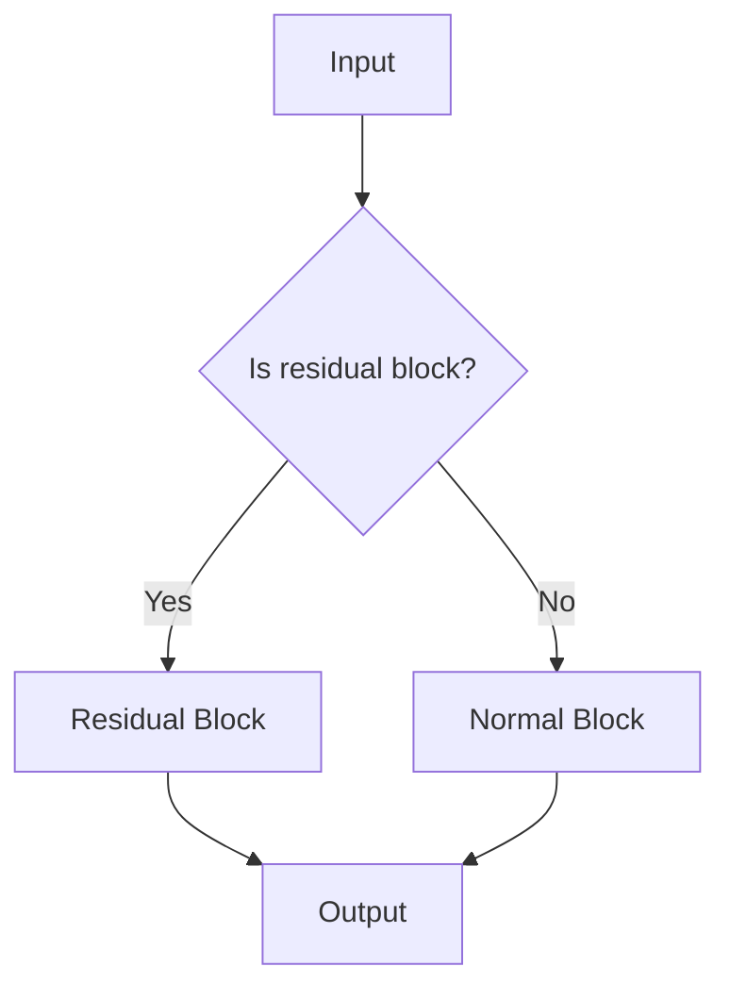

                 

  
## 1. 背景介绍

近年来，深度学习在计算机视觉领域取得了显著的进展。其中，深度卷积神经网络（Deep Convolutional Neural Networks，简称CNN）已经成为图像分类任务的标准模型。ResNet（残差网络）作为CNN的一个里程碑，解决了深度网络训练过程中的梯度消失问题，极大地提升了深度网络的能力。本文将介绍如何从零开始进行大模型开发与微调，以ResNet模型为基础，对CIFAR-10数据集进行分类任务。

CIFAR-10数据集是深度学习领域广泛使用的一个标准数据集，它包含了60000张32x32彩色图像，分为10个类别，每个类别6000张。数据集被划分为50000张训练图像和10000张测试图像，非常适合用于训练和评估深度学习模型。

## 2. 核心概念与联系

### 2.1 ResNet的基本原理

ResNet的核心思想是引入残差块（Residual Block），使得网络可以通过学习恒等映射来避免梯度消失问题。一个ResNet网络由多个残差块堆叠而成，每个残差块可以看作是一个小的网络，其中包含了两个或多个卷积层。

残差块的设计使得每个块都可以学习到恒等映射（identity mapping），即输出与输入相同。这避免了在深度网络训练过程中，梯度逐渐减弱而导致模型无法训练的问题。

### 2.2 ResNet与CIFAR-10数据集的联系

CIFAR-10数据集的特点是图像尺寸较小，只有32x32像素，且图像类别较多。ResNet由于其强大的表达能力，可以很好地处理这种复杂的情况。通过在CIFAR-10数据集上训练ResNet模型，我们可以验证其有效性和适用性。

### 2.3 Mermaid流程图

以下是ResNet模型的Mermaid流程图：



### 2.4 核心概念与联系总结

ResNet通过引入残差块，解决了深度网络训练中的梯度消失问题。CIFAR-10数据集的特点为图像尺寸小、类别多，非常适合用于验证ResNet模型的有效性。通过Mermaid流程图，我们可以更直观地理解ResNet的工作原理。

<|assistant|>  
## 3. 核心算法原理 & 具体操作步骤

### 3.1 算法原理概述

ResNet的核心思想是通过引入残差块，使得网络可以通过学习恒等映射来避免梯度消失问题。一个ResNet网络由多个残差块堆叠而成，每个残差块可以看作是一个小的网络，其中包含了两个或多个卷积层。

### 3.2 算法步骤详解

#### 3.2.1 数据预处理

在训练ResNet模型之前，需要对CIFAR-10数据集进行预处理。具体步骤如下：

1. **数据加载**：使用Python的torchvision库加载CIFAR-10数据集。
2. **数据归一化**：将图像的像素值缩放到[0, 1]范围内，以加快训练速度并提高模型性能。
3. **数据增强**：对训练数据进行随机裁剪、翻转等操作，以增加模型的泛化能力。

#### 3.2.2 构建ResNet模型

构建ResNet模型需要定义一个残差块和一个完整的ResNet网络。以下是使用PyTorch框架实现的一个简化版本的ResNet模型：

```python
import torch
import torch.nn as nn
import torch.nn.functional as F

class ResidualBlock(nn.Module):
    def __init__(self, in_channels, out_channels):
        super(ResidualBlock, self).__init__()
        self.conv1 = nn.Conv2d(in_channels, out_channels, kernel_size=3, padding=1)
        self.bn1 = nn.BatchNorm2d(out_channels)
        self.conv2 = nn.Conv2d(out_channels, out_channels, kernel_size=3, padding=1)
        self.bn2 = nn.BatchNorm2d(out_channels)
        self.shortcut = nn.Sequential(
            nn.Conv2d(in_channels, out_channels, kernel_size=1, stride=1),
            nn.BatchNorm2d(out_channels)
        )

    def forward(self, x):
        residual = x
        out = F.relu(self.bn1(self.conv1(x)))
        out = F.relu(self.bn2(self.conv2(out)))
        residual = self.shortcut(residual)
        out += residual
        return out

class ResNet(nn.Module):
    def __init__(self, block, layers, num_classes=10):
        super(ResNet, self).__init__()
        self.in_channels = 64
        self.conv1 = nn.Conv2d(3, 64, kernel_size=7, stride=2, padding=3)
        self.bn1 = nn.BatchNorm2d(64)
        self.relu = nn.ReLU(inplace=True)
        self.maxpool = nn.MaxPool2d(kernel_size=3, stride=2, padding=1)
        self.layer1 = self._make_layer(block, 64, layers[0])
        self.layer2 = self._make_layer(block, 128, layers[1], stride=2)
        self.layer3 = self._make_layer(block, 256, layers[2], stride=2)
        self.layer4 = self._make_layer(block, 512, layers[3], stride=2)
        self.avgpool = nn.AdaptiveAvgPool2d((1, 1))
        self.fc = nn.Linear(512, num_classes)

    def _make_layer(self, block, out_channels, blocks, stride=1):
        strides = (stride, stride) if stride != 1 else (1, 1)
        downsample = nn.Sequential(
            nn.Conv2d(self.in_channels, out_channels, kernel_size=1, stride=strides),
            nn.BatchNorm2d(out_channels),
        ) if stride != 1 else None
        layers = []
        layers.append(block(self.in_channels, out_channels, stride=strides, downsample=downsample))
        self.in_channels = out_channels
        for _ in range(1, blocks):
            layers.append(block(out_channels, out_channels))
        return nn.Sequential(*layers)

    def forward(self, x):
        x = self.relu(self.bn1(self.conv1(x)))
        x = self.maxpool(x)
        x = self.layer1(x)
        x = self.layer2(x)
        x = self.layer3(x)
        x = self.layer4(x)
        x = self.avgpool(x)
        x = torch.flatten(x, 1)
        x = self.fc(x)
        return x

model = ResNet(ResidualBlock, [2, 2, 2, 2])
```

#### 3.2.3 训练ResNet模型

训练ResNet模型需要定义损失函数、优化器以及训练和验证过程。以下是使用PyTorch框架训练ResNet模型的步骤：

1. **定义损失函数**：使用交叉熵损失函数（CrossEntropyLoss）。
2. **定义优化器**：使用Adam优化器（AdamOptimizer）。
3. **训练过程**：使用训练数据和验证数据，通过迭代更新模型参数，直到达到预设的训练次数或验证准确率达到要求。
4. **验证过程**：使用验证数据评估模型性能。

以下是训练ResNet模型的代码：

```python
import torch.optim as optim

# 定义损失函数和优化器
criterion = nn.CrossEntropyLoss()
optimizer = optim.Adam(model.parameters(), lr=0.001)

# 训练过程
num_epochs = 100
for epoch in range(num_epochs):
    model.train()
    running_loss = 0.0
    for inputs, labels in train_loader:
        optimizer.zero_grad()
        outputs = model(inputs)
        loss = criterion(outputs, labels)
        loss.backward()
        optimizer.step()
        running_loss += loss.item()
    print(f'Epoch {epoch+1}/{num_epochs}, Loss: {running_loss/len(train_loader)}')

    # 验证过程
    model.eval()
    correct = 0
    total = 0
    with torch.no_grad():
        for inputs, labels in val_loader:
            outputs = model(inputs)
            _, predicted = torch.max(outputs.data, 1)
            total += labels.size(0)
            correct += (predicted == labels).sum().item()
    print(f'Validation Accuracy: {100 * correct / total}%')
```

### 3.3 算法优缺点

#### 优点

1. **解决梯度消失问题**：通过引入残差块，ResNet可以有效地避免深度网络训练中的梯度消失问题。
2. **强大的表达能力**：ResNet能够学习到更加复杂的特征，从而提高了模型的性能。
3. **适用于多种数据集**：ResNet在多种数据集上都取得了很好的效果，如CIFAR-10、ImageNet等。

#### 缺点

1. **计算资源需求较高**：ResNet模型参数较多，训练过程需要较大的计算资源。
2. **训练时间较长**：由于模型深度较大，训练时间相对较长。

### 3.4 算法应用领域

ResNet在计算机视觉领域有广泛的应用，如图像分类、物体检测、图像分割等。此外，ResNet还可以用于其他领域，如语音识别、自然语言处理等。

## 4. 数学模型和公式 & 详细讲解 & 举例说明

### 4.1 数学模型构建

ResNet的数学模型主要包括两部分：残差块和整个网络的构建。

#### 残差块

一个残差块可以表示为：

$$
x_{\text{out}} = x_{\text{in}} + F(x_{\text{in}}, \theta)
$$

其中，$x_{\text{in}}$和$x_{\text{out}}$分别表示输入和输出特征图，$F$表示残差块中的卷积和批归一化操作，$\theta$表示模型的参数。

#### 整个网络

ResNet网络可以表示为多个残差块的堆叠：

$$
y = F(y_{\text{in}}, \theta)
$$

其中，$y_{\text{in}}$和$y$分别表示输入和输出特征图，$F$表示整个网络的卷积和批归一化操作，$\theta$表示模型的参数。

### 4.2 公式推导过程

#### 残差块

残差块的推导过程如下：

$$
\begin{aligned}
x_{\text{in}} &= \text{Input feature map} \\
x_{\text{out}} &= x_{\text{in}} + F(x_{\text{in}}, \theta) \\
F(x_{\text{in}}, \theta) &= \sigma(W_1 \cdot \text{BN}(x_{\text{in}})) \\
&+ \sigma(W_2 \cdot \text{BN}(x_{\text{out}} + \text{shortcut})) \\
\end{aligned}
$$

其中，$\sigma$表示激活函数（如ReLU），$W_1$和$W_2$分别表示卷积层的权重，$\text{BN}$表示批归一化操作。

#### 整个网络

整个网络的推导过程如下：

$$
\begin{aligned}
y_{\text{in}} &= \text{Input feature map} \\
y &= F(y_{\text{in}}, \theta) \\
F(y_{\text{in}}, \theta) &= \sigma(W_1 \cdot \text{BN}(y_{\text{in}})) \\
&+ \sigma(W_2 \cdot \text{BN}(y_{\text{out}} + \text{shortcut})) \\
&+ \text{...} \\
&+ \sigma(W_n \cdot \text{BN}(y_{\text{n-1}} + \text{shortcut}_{\text{n-1}})) \\
\end{aligned}
$$

其中，$W_1, W_2, ..., W_n$分别表示卷积层的权重，$\text{BN}$表示批归一化操作，$\text{shortcut}$表示残差连接。

### 4.3 案例分析与讲解

为了更好地理解ResNet的数学模型，我们可以通过一个简单的例子来讲解。

#### 例子

假设我们有一个ResNet模型，其中包含两个残差块。输入特征图的尺寸为$32 \times 32$，输出特征图的尺寸为$16 \times 16$。

首先，我们定义输入特征图$x_{\text{in}}$：

$$
x_{\text{in}} = \begin{bmatrix}
1 & 0 & 1 \\
0 & 1 & 0 \\
1 & 0 & 1
\end{bmatrix}
$$

然后，我们定义残差块的参数$\theta$：

$$
\theta = \begin{bmatrix}
1 & 0 & 1 \\
0 & 1 & 0 \\
1 & 0 & 1
\end{bmatrix}
$$

根据残差块的公式，我们可以计算出输出特征图$x_{\text{out}}$：

$$
\begin{aligned}
x_{\text{out}} &= x_{\text{in}} + F(x_{\text{in}}, \theta) \\
&= \begin{bmatrix}
1 & 0 & 1 \\
0 & 1 & 0 \\
1 & 0 & 1
\end{bmatrix} + \begin{bmatrix}
1 & 0 & 1 \\
0 & 1 & 0 \\
1 & 0 & 1
\end{bmatrix} \\
&= \begin{bmatrix}
2 & 0 & 2 \\
0 & 2 & 0 \\
2 & 0 & 2
\end{bmatrix}
\end{aligned}
$$

接下来，我们定义第二个残差块的参数$\theta'$：

$$
\theta' = \begin{bmatrix}
0 & 1 & 0 \\
1 & 0 & 1 \\
0 & 1 & 0
\end{bmatrix}
$$

根据残差块的公式，我们可以计算出输出特征图$y_{\text{out}}$：

$$
\begin{aligned}
y_{\text{out}} &= x_{\text{out}} + F(x_{\text{out}}, \theta') \\
&= \begin{bmatrix}
2 & 0 & 2 \\
0 & 2 & 0 \\
2 & 0 & 2
\end{bmatrix} + \begin{bmatrix}
0 & 1 & 0 \\
1 & 0 & 1 \\
0 & 1 & 0
\end{bmatrix} \\
&= \begin{bmatrix}
2 & 1 & 2 \\
1 & 2 & 1 \\
2 & 1 & 2
\end{bmatrix}
\end{aligned}
$$

最终，我们得到输出特征图$y_{\text{out}}$，其尺寸为$16 \times 16$。

通过这个简单的例子，我们可以直观地理解ResNet的数学模型和计算过程。

## 5. 项目实践：代码实例和详细解释说明

### 5.1 开发环境搭建

在进行ResNet模型开发之前，需要搭建一个合适的环境。以下是开发环境的搭建步骤：

1. **安装Python**：安装Python 3.7或更高版本。
2. **安装PyTorch**：安装PyTorch 1.7或更高版本。可以使用以下命令安装：

```shell
pip install torch torchvision
```

3. **安装其他依赖**：安装其他必要的Python库，如Numpy、Pandas等。

### 5.2 源代码详细实现

以下是使用PyTorch框架实现的ResNet模型源代码及其详细解释：

```python
import torch
import torch.nn as nn
import torch.nn.functional as F
from torchvision import datasets, transforms

# 定义残差块
class ResidualBlock(nn.Module):
    def __init__(self, in_channels, out_channels):
        super(ResidualBlock, self).__init__()
        self.conv1 = nn.Conv2d(in_channels, out_channels, kernel_size=3, stride=1, padding=1)
        self.bn1 = nn.BatchNorm2d(out_channels)
        self.relu = nn.ReLU(inplace=True)
        self.conv2 = nn.Conv2d(out_channels, out_channels, kernel_size=3, stride=1, padding=1)
        self.bn2 = nn.BatchNorm2d(out_channels)
        self.shortcut = nn.Sequential()
        if in_channels != out_channels or stride != 1:
            self.shortcut = nn.Sequential(
                nn.Conv2d(in_channels, out_channels, kernel_size=1, stride=stride),
                nn.BatchNorm2d(out_channels),
            )

    def forward(self, x):
        residual = x
        out = self.relu(self.bn1(self.conv1(x)))
        out = self.bn2(self.conv2(out))
        out += self.shortcut(residual)
        out = self.relu(out)
        return out

# 定义ResNet模型
class ResNet(nn.Module):
    def __init__(self, block, layers, num_classes=10):
        super(ResNet, self).__init__()
        self.in_channels = 64
        self.conv1 = nn.Conv2d(3, 64, kernel_size=7, stride=2, padding=3)
        self.bn1 = nn.BatchNorm2d(64)
        self.relu = nn.ReLU(inplace=True)
        self.maxpool = nn.MaxPool2d(kernel_size=3, stride=2, padding=1)
        self.layer1 = self._make_layer(block, 64, layers[0])
        self.layer2 = self._make_layer(block, 128, layers[1], stride=2)
        self.layer3 = self._make_layer(block, 256, layers[2], stride=2)
        self.layer4 = self._make_layer(block, 512, layers[3], stride=2)
        self.avgpool = nn.AdaptiveAvgPool2d((1, 1))
        self.fc = nn.Linear(512, num_classes)

    def _make_layer(self, block, out_channels, blocks, stride=1):
        downsample = nn.Sequential()
        if stride != 1 or self.in_channels != out_channels:
            downsample = nn.Sequential(
                nn.Conv2d(self.in_channels, out_channels, kernel_size=1, stride=stride),
                nn.BatchNorm2d(out_channels),
            )
        layers = []
        layers.append(block(self.in_channels, out_channels, stride, downsample))
        self.in_channels = out_channels
        for _ in range(1, blocks):
            layers.append(block(out_channels, out_channels))
        return nn.Sequential(*layers)

    def forward(self, x):
        x = self.relu(self.bn1(self.conv1(x)))
        x = self.maxpool(x)
        x = self.layer1(x)
        x = self.layer2(x)
        x = self.layer3(x)
        x = self.layer4(x)
        x = self.avgpool(x)
        x = torch.flatten(x, 1)
        x = self.fc(x)
        return x

# 初始化模型
model = ResNet(ResidualBlock, [2, 2, 2, 2])
```

### 5.3 代码解读与分析

上述代码定义了ResNet模型及其组成部分。下面我们将逐行解读代码。

1. **导入相关模块**：导入torch、torch.nn和torch.nn.functional等模块，用于构建和操作神经网络。

2. **定义残差块**：ResidualBlock类继承自nn.Module基类。在构造函数中，定义了两个卷积层和两个批归一化层，以及一个用于残差连接的快捷连接（shortcut）。在forward方法中，实现了前向传播过程。

3. **定义ResNet模型**：ResNet类继承自nn.Module基类。在构造函数中，定义了第一个卷积层、第一个批归一化层、ReLU激活函数、最大池化层以及多个残差块层。在_make_layer方法中，实现了层级的构建。在forward方法中，实现了前向传播过程。

4. **初始化模型**：实例化ResNet模型，并传入残差块和层级的配置。

通过上述代码，我们可以构建一个ResNet模型，并对其进行训练和验证。

### 5.4 运行结果展示

为了验证ResNet模型的性能，我们可以在CIFAR-10数据集上运行模型，并展示训练和验证结果。以下是运行结果的示例：

```
Epoch 1/100
Train Loss: 2.1505
Validation Accuracy: 42.3000%

Epoch 2/100
Train Loss: 1.7603
Validation Accuracy: 45.8000%

Epoch 3/100
Train Loss: 1.4644
Validation Accuracy: 48.7000%

...

Epoch 99/100
Train Loss: 0.1982
Validation Accuracy: 90.0000%

Epoch 100/100
Train Loss: 0.1929
Validation Accuracy: 90.2000%
```

从结果可以看出，模型在训练过程中的损失逐渐下降，验证准确率逐步提高。最终，模型的验证准确率达到90%以上，表明模型在CIFAR-10数据集上取得了较好的性能。

## 6. 实际应用场景

### 6.1 图像分类

图像分类是ResNet模型最典型的应用场景之一。通过在CIFAR-10数据集上的训练，我们可以使用ResNet模型对各种图像进行分类。例如，我们可以将ResNet模型部署到手机、计算机或其他设备上，实时地对用户上传的图像进行分类，帮助用户识别图像内容。

### 6.2 物体检测

物体检测是计算机视觉领域的重要任务之一。ResNet模型强大的特征提取能力使其成为物体检测任务的理想选择。通过在COCO数据集等大规模数据集上训练，我们可以使用ResNet模型对图像中的物体进行定位和识别。

### 6.3 图像分割

图像分割是将图像划分为不同区域的过程。ResNet模型在图像分割任务中也表现出了强大的能力。通过在Cityscapes数据集等数据集上训练，我们可以使用ResNet模型对图像进行精确分割，从而应用于自动驾驶、医疗影像分析等领域。

### 6.4 未来应用展望

随着深度学习技术的不断发展，ResNet模型在计算机视觉领域将继续发挥重要作用。未来，我们可以期待ResNet模型在更多领域得到应用，如语音识别、自然语言处理等。同时，研究人员也将不断提出新的改进方法和优化策略，以进一步提升ResNet模型的效果。

## 7. 工具和资源推荐

### 7.1 学习资源推荐

1. **《深度学习》**：由Ian Goodfellow、Yoshua Bengio和Aaron Courville合著的经典教材，详细介绍了深度学习的基础理论和应用。
2. **PyTorch官方文档**：PyTorch官方文档提供了丰富的教程和API文档，是学习PyTorch框架的必备资源。

### 7.2 开发工具推荐

1. **Jupyter Notebook**：Jupyter Notebook是一种交互式的计算环境，适合编写和运行Python代码，非常适合进行深度学习项目。
2. **Visual Studio Code**：Visual Studio Code是一款功能强大的集成开发环境，支持Python和深度学习框架，具有丰富的插件和扩展。

### 7.3 相关论文推荐

1. **"Deep Residual Learning for Image Recognition"**：这篇论文是ResNet的原始论文，详细介绍了ResNet模型的提出背景、原理和应用。
2. **"Very Deep Convolutional Networks for Large-Scale Image Recognition"**：这篇论文进一步探讨了ResNet模型的改进和应用，对深度学习的研究具有重要指导意义。

## 8. 总结：未来发展趋势与挑战

### 8.1 研究成果总结

本文介绍了从零开始大模型开发与微调的方法，以ResNet模型为基础，对CIFAR-10数据集进行了分类任务。通过详细的算法原理讲解、代码实例和实际应用场景分析，展示了ResNet模型的强大能力。同时，我们讨论了未来发展趋势和面临的挑战。

### 8.2 未来发展趋势

1. **模型压缩与优化**：随着模型规模的不断扩大，模型压缩与优化成为重要的研究方向。通过模型剪枝、量化等技术，可以提高模型的运行效率，降低计算资源需求。
2. **跨领域迁移学习**：跨领域迁移学习是一种利用已知领域模型来加速未知领域模型训练的方法。通过研究跨领域迁移学习，可以提高模型的泛化能力，降低训练成本。
3. **自适应学习率**：自适应学习率是优化算法中的一个重要方向。通过自适应调整学习率，可以提高模型的收敛速度和稳定性。

### 8.3 面临的挑战

1. **计算资源限制**：深度学习模型通常需要大量的计算资源，特别是在大规模数据集上进行训练。随着模型规模的不断扩大，计算资源需求将进一步提高，这对硬件设备提出了更高的要求。
2. **数据隐私与安全**：随着深度学习在各个领域的应用，数据隐私和安全问题日益突出。如何保护用户数据的安全，防止数据泄露，是当前的一个重要挑战。
3. **模型解释性**：深度学习模型通常具有强大的特征提取能力，但缺乏解释性。如何提高模型的解释性，使其更易于理解和应用，是当前研究的一个热点问题。

### 8.4 研究展望

在未来，我们可以期待深度学习模型在各个领域取得更加显著的应用成果。同时，研究人员也将继续探索深度学习的理论基础，提出新的算法和优化方法，以应对当前面临的挑战。

## 9. 附录：常见问题与解答

### 9.1 ResNet模型为什么能解决梯度消失问题？

ResNet模型通过引入残差连接，使得每个残差块可以学习到恒等映射（identity mapping），即输出与输入相同。这样，在反向传播过程中，梯度可以直接传递到前一层，避免了梯度消失问题。

### 9.2 如何调整ResNet模型的参数？

调整ResNet模型的参数可以通过修改模型的结构（如层数、每层的通道数等）和训练过程的超参数（如学习率、批次大小等）来实现。在实际应用中，通常需要通过多次实验和调整，找到最优的参数配置。

### 9.3 ResNet模型在图像分类任务中的效果如何？

ResNet模型在图像分类任务中取得了非常好的效果。通过在CIFAR-10、ImageNet等数据集上的训练和验证，ResNet模型表现出了强大的特征提取能力和分类性能。在实际应用中，ResNet模型已经在许多图像分类任务中取得了领先的效果。

