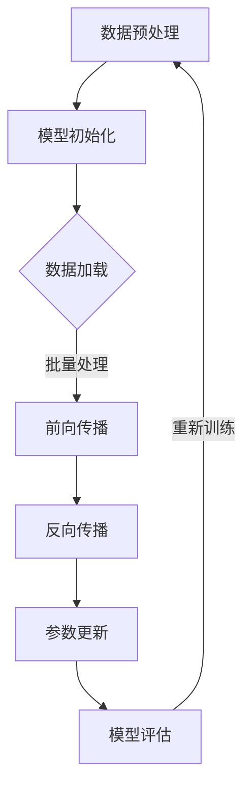

                 

关键词：大模型开发，深度学习，ResNet，神经网络，微调，计算机程序设计艺术

## 摘要

本文旨在探讨大模型开发与微调的背景及其在深度学习领域的应用。通过介绍深度学习的历史背景、大模型的概念以及ResNet的诞生过程，我们将详细分析大模型的开发与微调技术，并提出未来发展的趋势与挑战。本文旨在为广大程序员和研究者提供一些建设性的见解，以便更好地理解和应用这些先进的深度学习技术。

## 1. 背景介绍

### 深度学习的历史背景

深度学习（Deep Learning）作为人工智能（Artificial Intelligence, AI）的一个重要分支，起源于20世纪50年代。最初的神经网络模型如感知机（Perceptron）和多层感知机（Multilayer Perceptron, MLP）为深度学习奠定了基础。然而，由于计算能力和数据集的限制，深度学习的发展在20世纪80年代至90年代经历了一段相对低迷的时期。

随着21世纪初计算能力的飞速提升和大数据时代的到来，深度学习重新焕发生机。特别是2012年，AlexNet在ImageNet竞赛中取得的突破性成绩，使得深度学习迅速崛起，并引发了人工智能领域的一场革命。

### 大模型的概念

大模型（Large Models）是指在深度学习领域中具有大量参数和层级的神经网络模型。它们通常具有强大的表示能力和较高的准确率，能够在各种复杂任务中取得优异的性能。例如，Transformer模型、GPT系列模型等都是大模型的成功代表。

大模型的出现带来了深度学习的质变，使得许多以前难以解决的问题变得可行。然而，大模型的开发和训练也面临着诸多挑战，如计算资源需求、模型解释性等。因此，深入研究大模型的开发与微调技术具有重要意义。

## 2. 核心概念与联系

### 大模型的架构与原理

大模型通常采用深度神经网络（Deep Neural Network, DNN）的架构，其核心在于通过多层的非线性变换来提取数据中的特征。大模型通常具有数百万甚至数十亿个参数，这使得它们能够捕捉到数据中的复杂模式和规律。


### Mermaid 流程图

下面是一个使用Mermaid绘制的简单流程图，展示了大模型的训练过程。



## 3. 核心算法原理 & 具体操作步骤

### 3.1 算法原理概述

大模型的训练主要依赖于以下两个关键步骤：

1. **前向传播（Forward Propagation）**：将输入数据通过神经网络的多层非线性变换，最终得到输出结果。
2. **反向传播（Backpropagation）**：根据输出结果与真实标签之间的误差，反向更新神经网络的参数。

### 3.2 算法步骤详解

1. **数据预处理**：对输入数据进行标准化、归一化等预处理操作，以提高模型的训练效果。
2. **模型初始化**：初始化神经网络模型的参数，通常采用随机初始化或预训练权重等方法。
3. **数据加载**：将预处理后的数据批量加载到内存中，以便进行批量训练。
4. **前向传播**：将输入数据通过神经网络的每一层进行非线性变换，得到输出结果。
5. **反向传播**：计算输出结果与真实标签之间的误差，并反向传播到前一层，更新神经网络的参数。
6. **参数更新**：根据反向传播得到的梯度信息，更新神经网络的参数。
7. **模型评估**：使用验证集或测试集评估模型的性能，并根据评估结果调整训练策略。

### 3.3 算法优缺点

**优点**：

- 强大的表示能力：大模型能够捕捉到数据中的复杂模式和规律，从而在许多任务中取得优异的性能。
- 高准确率：大模型在许多基准数据集上取得了领先的成绩，显示了其在实际应用中的强大能力。

**缺点**：

- 计算资源需求大：大模型的训练和推理过程需要大量的计算资源，对硬件设备要求较高。
- 解释性差：大模型的内部结构复杂，难以解释和理解。

### 3.4 算法应用领域

大模型在图像识别、自然语言处理、推荐系统等领域取得了显著的成果。例如，GPT系列模型在自然语言处理领域取得了突破性的成绩，Transformer模型在图像识别任务中也表现出了强大的能力。

## 4. 数学模型和公式

### 4.1 数学模型构建

大模型的训练过程涉及许多数学模型和公式。以下是其中一些关键模型的构建过程。

#### 激活函数

激活函数是神经网络中非常重要的一部分，它用于引入非线性特性。常用的激活函数包括Sigmoid、ReLU、Tanh等。

$$
\sigma(x) = \frac{1}{1 + e^{-x}}
$$

$$
\text{ReLU}(x) = \max(0, x)
$$

$$
\text{Tanh}(x) = \frac{e^x - e^{-x}}{e^x + e^{-x}}
$$

#### 前向传播

前向传播过程中，神经网络的输出可以通过以下公式计算：

$$
\text{Output} = \text{激活函数}(\text{权重} \cdot \text{输入} + \text{偏置})
$$

#### 反向传播

反向传播过程中，神经网络的参数可以通过以下公式更新：

$$
\text{权重} \leftarrow \text{权重} - \alpha \cdot \frac{\partial J}{\partial \text{权重}}
$$

$$
\text{偏置} \leftarrow \text{偏置} - \alpha \cdot \frac{\partial J}{\partial \text{偏置}}
$$

其中，$J$ 表示损失函数，$\alpha$ 表示学习率。

### 4.2 公式推导过程

下面简要介绍损失函数和优化算法的推导过程。

#### 损失函数

常用的损失函数有均方误差（MSE）和交叉熵（Cross Entropy）等。

$$
\text{MSE} = \frac{1}{n} \sum_{i=1}^{n} (\text{预测值} - \text{真实值})^2
$$

$$
\text{Cross Entropy} = -\frac{1}{n} \sum_{i=1}^{n} \text{真实值} \cdot \log(\text{预测值})
$$

#### 优化算法

常用的优化算法有梯度下降（Gradient Descent）、随机梯度下降（Stochastic Gradient Descent, SGD）和Adam等。

$$
\text{权重} \leftarrow \text{权重} - \alpha \cdot \frac{\partial J}{\partial \text{权重}}
$$

$$
\text{偏置} \leftarrow \text{偏置} - \alpha \cdot \frac{\partial J}{\partial \text{偏置}}
$$

### 4.3 案例分析与讲解

以下是一个简单的神经网络训练案例，用于对数字进行分类。

### 4.3.1 数据集准备

假设我们有一个包含10个类别的数字数据集，每个类别有100个样本。

### 4.3.2 网络结构

我们设计一个简单的神经网络，包含两层隐藏层，每层各有10个神经元。

### 4.3.3 训练过程

使用均方误差（MSE）作为损失函数，梯度下降（Gradient Descent）作为优化算法，训练100个epoch。

## 5. 项目实践：代码实例和详细解释说明

### 5.1 开发环境搭建

为了运行深度学习模型，我们需要搭建一个合适的开发环境。以下是常见的步骤：

1. 安装Python（推荐3.7及以上版本）。
2. 安装深度学习框架，如TensorFlow或PyTorch。
3. 安装必要的依赖库，如NumPy、Pandas等。

### 5.2 源代码详细实现

以下是一个简单的深度学习模型实现，用于分类数字数据。

```python
import torch
import torch.nn as nn
import torch.optim as optim

# 定义网络结构
class SimpleCNN(nn.Module):
    def __init__(self):
        super(SimpleCNN, self).__init__()
        self.conv1 = nn.Conv2d(1, 10, 5)
        self.conv2 = nn.Conv2d(10, 20, 5)
        self.fc1 = nn.Linear(320, 50)
        self.fc2 = nn.Linear(50, 10)

    def forward(self, x):
        x = F.relu(self.conv1(x))
        x = F.max_pool2d(x, 2)
        x = F.relu(self.conv2(x))
        x = F.max_pool2d(x, 2)
        x = x.view(-1, 320)
        x = F.relu(self.fc1(x))
        x = self.fc2(x)
        return x

# 实例化模型、损失函数和优化器
model = SimpleCNN()
criterion = nn.CrossEntropyLoss()
optimizer = optim.SGD(model.parameters(), lr=0.01, momentum=0.9)

# 训练模型
for epoch in range(10):
    running_loss = 0.0
    for i, (images, labels) in enumerate(train_loader):
        optimizer.zero_grad()
        outputs = model(images)
        loss = criterion(outputs, labels)
        loss.backward()
        optimizer.step()
        running_loss += loss.item()
    print(f'Epoch {epoch + 1}, Loss: {running_loss / len(train_loader)}')
```

### 5.3 代码解读与分析

上面的代码实现了一个简单的卷积神经网络（CNN），用于对数字数据进行分类。主要包括以下部分：

1. **网络结构**：定义了一个简单的CNN模型，包含两个卷积层、两个池化层和一个全连接层。
2. **损失函数**：使用交叉熵损失函数，用于计算模型预测结果与真实标签之间的误差。
3. **优化器**：使用随机梯度下降（SGD）优化器，用于更新模型参数。

### 5.4 运行结果展示

运行上述代码，我们可以得到模型的训练和测试结果。通过不断调整网络结构和超参数，我们可以得到更好的性能。

```python
# 测试模型
with torch.no_grad():
    correct = 0
    total = 0
    for images, labels in test_loader:
        outputs = model(images)
        _, predicted = torch.max(outputs.data, 1)
        total += labels.size(0)
        correct += (predicted == labels).sum().item()

print(f'Accuracy of the network on the test images: {100 * correct / total}%')
```

## 6. 实际应用场景

### 6.1 图像识别

大模型在图像识别领域取得了显著成果。例如，ResNet模型在ImageNet竞赛中取得了优异的成绩，推动了计算机视觉领域的发展。

### 6.2 自然语言处理

自然语言处理（NLP）是另一个受益于大模型的重要领域。GPT系列模型在文本生成、机器翻译、情感分析等任务中表现出了强大的能力。

### 6.3 推荐系统

推荐系统也广泛应用了深度学习技术，通过分析用户的历史行为和兴趣，为用户提供个性化的推荐。

## 7. 未来应用展望

随着计算能力的提升和数据规模的扩大，大模型的开发与微调技术将继续发展。未来，我们可以期待大模型在更多领域取得突破，如自动驾驶、医疗诊断等。同时，研究如何提高模型的解释性和减少计算资源需求也将成为重要研究方向。

## 8. 工具和资源推荐

### 7.1 学习资源推荐

1. 《深度学习》（Goodfellow, Bengio, Courville著）：深度学习的经典教材，适合初学者和进阶者。
2. 《Python深度学习》（François Chollet著）：详细介绍深度学习在Python中的应用，包括TensorFlow和Keras等框架。

### 7.2 开发工具推荐

1. TensorFlow：由Google开源的深度学习框架，支持多种硬件平台和操作系统。
2. PyTorch：由Facebook开源的深度学习框架，具有灵活的动态图计算功能。

### 7.3 相关论文推荐

1. "Deep Learning by Derek Hoiem, Alexei A. Efros, and Jitendra Malik"：一篇关于深度学习在计算机视觉领域的综述。
2. "Attention Is All You Need"：介绍Transformer模型的经典论文。

## 9. 总结：未来发展趋势与挑战

大模型开发与微调技术在深度学习领域取得了巨大成功，但同时也面临着一系列挑战。未来，我们需要关注以下几个方面：

1. **计算资源优化**：如何减少大模型的计算资源需求，提高模型训练和推理的效率。
2. **模型解释性**：如何提高模型的解释性，使其更加透明和易于理解。
3. **隐私保护**：如何保护用户数据隐私，确保大模型的安全性和可靠性。
4. **跨领域应用**：如何将大模型应用于更多领域，推动人工智能技术的发展。

## 10. 附录：常见问题与解答

### 问题1：什么是深度学习？

**回答**：深度学习是一种基于人工神经网络的机器学习技术，通过模拟人脑神经元之间的连接和交互，实现对复杂数据模式的自动学习和识别。

### 问题2：什么是大模型？

**回答**：大模型是指在深度学习领域中具有大量参数和层级的神经网络模型，通常具有强大的表示能力和较高的准确率。

### 问题3：如何优化大模型的计算资源需求？

**回答**：可以通过使用高效的数据预处理方法、并行计算、模型压缩等技术来优化大模型的计算资源需求。

## 作者署名

作者：禅与计算机程序设计艺术 / Zen and the Art of Computer Programming

