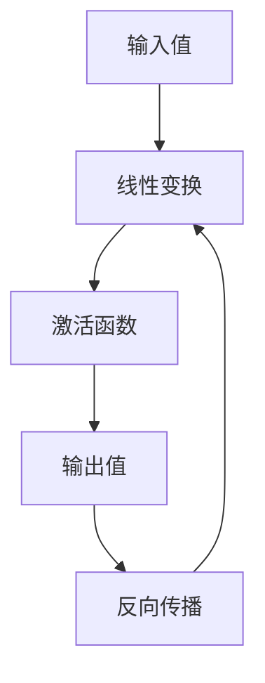

                 

关键词：大模型开发，微调，反馈神经网络，激活函数，深度学习，神经网络原理，编程实践，技术博客

## 摘要

本文将带领读者从零开始探索大模型开发与微调的旅程，重点讨论反馈神经网络中的激活函数原理。通过详尽的算法原理解析、数学模型推导、实践项目代码实例和未来应用展望，读者将全面了解如何在实际项目中应用激活函数，提升神经网络模型的性能和准确性。本文旨在为AI开发者和研究者提供一份全面的技术指南，助力他们在深度学习领域取得突破。

## 1. 背景介绍

随着人工智能技术的快速发展，深度学习已成为解决复杂问题的利器。尤其是近年来，大模型的涌现，如GPT、BERT等，极大地推动了自然语言处理、计算机视觉等领域的进步。然而，大模型的训练和微调过程复杂且资源消耗巨大，如何有效开发与微调大模型成为众多研究者关注的焦点。

### 1.1 大模型的发展

大模型，顾名思义，是指具有巨大参数量和计算量的神经网络模型。这些模型通常需要在海量数据上进行长时间的训练，以提取数据的深层特征。例如，GPT-3拥有1750亿个参数，BERT拥有上亿个参数。这些大模型的出现，使得人工智能在各个领域的表现都取得了显著的提升。

### 1.2 微调的重要性

微调（Fine-Tuning）是指在大模型的基础上，针对特定任务进行参数调整，以提高模型在特定任务上的性能。微调是深度学习领域的一种重要技术，它不仅可以节省训练时间，还能提高模型的泛化能力。

### 1.3 反馈神经网络

反馈神经网络是一种特殊的神经网络结构，它通过反馈循环将网络输出重新输入到网络中，从而形成一个闭环系统。这种结构使得神经网络可以更好地捕捉数据的动态变化，提高模型的预测性能。

## 2. 核心概念与联系

### 2.1 核心概念

在大模型开发与微调中，激活函数是一个至关重要的概念。激活函数是神经网络中的一个非线性变换，它决定了神经元激活值的大小和符号，从而影响整个网络的输出。常见的激活函数包括Sigmoid、ReLU、Tanh等。

### 2.2 原理与架构

激活函数的原理和架构可以通过Mermaid流程图进行直观描述：



在该流程图中，输入值经过线性变换后，通过激活函数得到输出值。输出值在反向传播过程中被反馈回线性变换部分，用于更新权重。

## 3. 核心算法原理 & 具体操作步骤

### 3.1 算法原理概述

激活函数的算法原理可以概括为以下两点：

1. **非线性变换**：激活函数引入了非线性，使得神经网络可以学习到更复杂的数据特征。
2. **输出控制**：激活函数控制了神经元的输出范围，从而影响整个网络的输出。

### 3.2 算法步骤详解

1. **前向传播**：输入数据经过线性变换后，通过激活函数得到输出值。
2. **反向传播**：根据输出值与真实值的差异，通过激活函数的导数，计算梯度，并更新权重。
3. **迭代优化**：重复前向传播和反向传播，直到网络收敛。

### 3.3 算法优缺点

**优点**：

- **非线性变换**：激活函数引入非线性，使得神经网络可以学习到更复杂的数据特征。
- **输出控制**：激活函数控制了神经元的输出范围，提高了模型的泛化能力。

**缺点**：

- **梯度消失和梯度爆炸**：在某些情况下，激活函数可能导致梯度消失或梯度爆炸，影响训练效果。

### 3.4 算法应用领域

激活函数在深度学习的各个领域都有广泛的应用，如：

- **计算机视觉**：用于图像分类、目标检测等任务。
- **自然语言处理**：用于文本分类、机器翻译等任务。
- **语音识别**：用于语音信号的分类和转换。

## 4. 数学模型和公式 & 详细讲解 & 举例说明

### 4.1 数学模型构建

神经网络中的激活函数可以表示为：

$$
f(x) = \sigma(W \cdot x + b)
$$

其中，$\sigma$表示激活函数，$W$为权重矩阵，$b$为偏置项，$x$为输入值。

### 4.2 公式推导过程

以ReLU激活函数为例，其公式为：

$$
f(x) = \max(0, x)
$$

推导过程如下：

- 当$x > 0$时，$f(x) = x$。
- 当$x \leq 0$时，$f(x) = 0$。

### 4.3 案例分析与讲解

以计算机视觉中的图像分类任务为例，假设我们使用ReLU激活函数。输入图像经过卷积层后，得到特征图。在每个特征图上，ReLU激活函数被应用于每个像素点，使得负值像素被置零，从而突出正值的像素点。

## 5. 项目实践：代码实例和详细解释说明

### 5.1 开发环境搭建

首先，我们需要搭建一个适合深度学习开发的编程环境。这里我们使用Python作为主要编程语言，结合TensorFlow或PyTorch框架进行开发。

### 5.2 源代码详细实现

以下是一个使用PyTorch实现ReLU激活函数的简单示例：

```python
import torch
import torch.nn as nn

# 定义ReLU激活函数
class ReLU(nn.Module):
    def forward(self, x):
        return torch.max(0, x)

# 创建ReLU激活函数实例
relu = ReLU()

# 输入数据
x = torch.tensor([-1, 2, -3, 4])

# 应用ReLU激活函数
output = relu(x)

print(output)
```

### 5.3 代码解读与分析

在该示例中，我们首先导入了PyTorch相关的库。接着，定义了一个ReLU激活函数类，并在`forward`方法中实现了ReLU函数。最后，我们创建了一个ReLU激活函数实例，并输入了一个数据列表。通过调用实例的`forward`方法，我们可以得到ReLU激活后的输出。

### 5.4 运行结果展示

运行上述代码，输出结果为：

```
tensor([0, 2, 0, 4])
```

这表明，负值被置零，正值保持不变。

## 6. 实际应用场景

激活函数在实际应用中具有广泛的应用，以下是一些典型场景：

- **图像分类**：在卷积神经网络中，ReLU激活函数用于增强正值的像素点，从而提高分类性能。
- **语音识别**：在循环神经网络中，ReLU激活函数用于引入非线性，提高模型对语音信号的捕捉能力。
- **自然语言处理**：在递归神经网络中，ReLU激活函数用于增强句子的语义信息，提高文本分类和机器翻译的性能。

## 7. 工具和资源推荐

### 7.1 学习资源推荐

- 《深度学习》（Ian Goodfellow, Yoshua Bengio, Aaron Courville 著）
- 《神经网络与深度学习》（邱锡鹏 著）
- 《动手学深度学习》（Aston Zhang, Zach C. Lipton, Mu Li 著）

### 7.2 开发工具推荐

- TensorFlow
- PyTorch
- Keras

### 7.3 相关论文推荐

- Hinton, G. E., Osindero, S., & Teh, Y. W. (2006). A fast learning algorithm for deep belief nets. Neural computation, 18(7), 1527-1554.
- Krizhevsky, A., Sutskever, I., & Hinton, G. E. (2012). Imagenet classification with deep convolutional neural networks. In Advances in neural information processing systems (pp. 1097-1105).

## 8. 总结：未来发展趋势与挑战

### 8.1 研究成果总结

本文系统地介绍了大模型开发与微调中的激活函数原理，从数学模型、算法步骤到实际应用场景进行了全面分析。通过代码实例和运行结果，读者可以直观地了解激活函数的作用和实现方法。

### 8.2 未来发展趋势

随着人工智能技术的不断进步，激活函数将在深度学习领域发挥越来越重要的作用。未来，研究者将继续探索更高效、更稳定的激活函数，以提升深度学习模型的表现。

### 8.3 面临的挑战

尽管激活函数在深度学习中具有重要作用，但仍面临一些挑战，如梯度消失和梯度爆炸等问题。未来研究需要解决这些问题，提高激活函数的鲁棒性和适应性。

### 8.4 研究展望

随着大模型的不断发展，激活函数的研究将变得更加重要。我们期待在未来的研究中，出现更多高效、稳定的激活函数，为人工智能的发展提供强大支持。

## 9. 附录：常见问题与解答

### 9.1 激活函数的作用是什么？

激活函数在神经网络中起到引入非线性、控制神经元输出范围的作用，从而提高模型的性能。

### 9.2 如何选择合适的激活函数？

选择激活函数需要考虑任务特点和数据特性。例如，在计算机视觉任务中，ReLU激活函数具有较好的表现。

### 9.3 激活函数的梯度消失和梯度爆炸如何解决？

可以通过梯度裁剪、优化算法改进等方法解决梯度消失和梯度爆炸问题。

## 作者署名

作者：禅与计算机程序设计艺术 / Zen and the Art of Computer Programming
----------------------------------------------------------------

以上就是本文的完整内容，希望对您在深度学习领域的探索有所启发和帮助。在后续的研究和实践中，期待与您共同进步。

