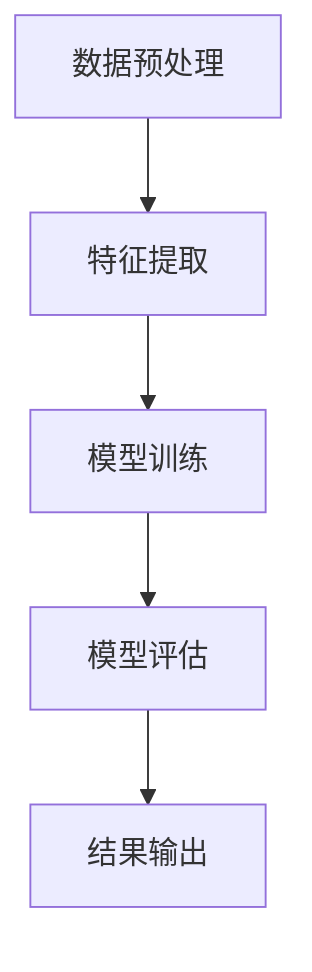

                 

 > **关键词：** 循环神经网络（RNN）、情感分类、大模型开发、微调、编程实践

> **摘要：** 本文将带领读者从零开始，深入探索循环神经网络（RNN）在大模型开发与微调中的应用。通过具体的编程实践，本文将详细讲解RNN的工作原理、模型构建、训练与微调步骤，以及其在情感分类任务中的实际应用。读者将了解如何使用RNN进行情感分类，以及如何通过微调提升模型的性能。

## 1. 背景介绍

随着自然语言处理（NLP）技术的不断进步，情感分析作为其中的一项重要应用，正越来越受到关注。情感分析不仅可以帮助企业了解消费者的情感倾向，还能为社交媒体、电商平台等提供有益的数据支持。传统的情感分析方法主要基于规则和统计模型，如基于词典的方法、朴素贝叶斯分类器等。然而，这些方法在面对复杂、多变、丰富的文本数据时，往往显得力不从心。

近年来，循环神经网络（RNN）因其独特的时序数据处理能力，在情感分析领域取得了显著的成果。RNN能够捕捉文本数据中的时间依赖性，从而实现对情感信息的有效提取和分类。此外，随着计算能力的提升和大数据技术的发展，大模型逐渐成为可能，这为RNN在情感分析中的广泛应用提供了新的机遇。

本文将围绕循环神经网络（RNN）与情感分类，系统地介绍大模型开发与微调的实战方法。通过本文的学习，读者将能够掌握RNN的基本原理、模型构建、训练与微调技巧，并在实际项目中应用这些知识。

## 2. 核心概念与联系

### 2.1 循环神经网络（RNN）

循环神经网络（RNN）是一种能够处理序列数据的神经网络模型。与传统的前馈神经网络（FNN）不同，RNN具有记忆能力，可以捕捉序列数据中的时间依赖性。RNN的基本结构包括输入层、隐藏层和输出层，其中隐藏层具有反馈连接，使得信息可以在网络中传递和更新。

RNN的工作原理如下：给定一个输入序列\(x_1, x_2, ..., x_T\)，RNN通过隐藏状态\(h_t\)和隐藏层单元\(h_t = \sigma(W_h x_t + U_h h_{t-1} + b_h)\)来处理每个时间步的输入。其中，\(W_h\)、\(U_h\)和\(b_h\)分别为输入权重、隐藏权重和偏置，\(\sigma\)为激活函数，通常使用Sigmoid或Tanh函数。输出层通过\(y_t = \sigma(W_y h_t + b_y)\)生成输出。

### 2.2 情感分类

情感分类是一种文本分类问题，旨在将文本数据划分为不同的情感类别，如正面、负面、中性等。情感分类在NLP中具有重要的应用价值，可以帮助企业了解消费者情感，为产品改进、市场策略制定提供依据。

情感分类通常涉及以下步骤：

1. 数据预处理：对原始文本数据（如评论、博客等）进行清洗、分词、去停用词等处理。
2. 特征提取：将预处理后的文本数据转换为能够表示其语义信息的特征向量。
3. 模型训练：使用特征向量作为输入，训练分类模型，如朴素贝叶斯、支持向量机、神经网络等。
4. 模型评估：使用测试集评估模型性能，根据评估结果调整模型参数。

### 2.3 RNN与情感分类的关系

RNN在情感分类中的应用主要基于其记忆能力。文本数据通常具有复杂的时序关系，RNN可以通过捕捉这些关系，实现更准确的情感分类。例如，一个句子中可能包含多个情感词汇，且这些词汇之间的情感倾向可能存在冲突。RNN可以通过记忆上下文信息，综合考虑这些词汇的情感倾向，从而做出更为准确的分类。

此外，RNN还可以通过长短期记忆（LSTM）和门控循环单元（GRU）等改进版本，进一步提升情感分类的准确性。这些改进版本通过引入门控机制，能够有效避免RNN在处理长序列数据时出现的梯度消失和梯度爆炸问题。

### 2.4 Mermaid 流程图



## 3. 核心算法原理 & 具体操作步骤

### 3.1 算法原理概述

循环神经网络（RNN）的基本原理在于其具有记忆能力，能够捕捉序列数据中的时间依赖性。具体来说，RNN通过隐藏状态\(h_t\)存储和处理输入序列\(x_1, x_2, ..., x_T\)中的信息。隐藏状态\(h_t\)不仅用于当前时间步的输出，还作为下一个时间步的输入，使得信息可以在网络中传递和更新。

在情感分类任务中，RNN通过以下步骤处理文本数据：

1. 数据预处理：对原始文本数据进行清洗、分词、去停用词等处理。
2. 特征提取：将预处理后的文本数据转换为词向量或序列特征。
3. 模型训练：使用序列特征作为输入，训练RNN模型，并通过反向传播算法更新模型参数。
4. 模型评估：使用测试集评估模型性能，调整模型参数，以优化分类效果。

### 3.2 算法步骤详解

1. **数据预处理**

   数据预处理是情感分类任务中的关键步骤，主要包括以下任务：

   - **文本清洗**：去除文本中的HTML标签、特殊字符、数字等无关信息。
   - **分词**：将文本分解为单词或词组，以便后续处理。
   - **去停用词**：去除常见的不含情感信息的单词，如“的”、“了”、“在”等。

2. **特征提取**

   特征提取是将文本数据转换为数值特征的过程，常见的方法包括：

   - **词袋模型**：将文本转换为词频向量，即每个单词出现的次数。
   - **TF-IDF**：考虑单词在文档中的重要程度，将文本转换为权重向量。
   - **词嵌入**：将文本转换为词向量，如Word2Vec、GloVe等。

3. **模型训练**

   模型训练主要包括以下步骤：

   - **初始化参数**：初始化模型参数，如输入权重\(W_x\)、隐藏权重\(W_h\)、输出权重\(W_y\)等。
   - **前向传播**：给定输入序列\(x_1, x_2, ..., x_T\)，计算隐藏状态\(h_t\)和输出\(y_t\)。
   - **损失函数**：计算模型预测与实际标签之间的差距，如交叉熵损失。
   - **反向传播**：计算梯度并更新模型参数。

4. **模型评估**

   模型评估主要包括以下指标：

   - **准确率（Accuracy）**：分类正确的样本数占总样本数的比例。
   - **精确率（Precision）**：分类为正样本的样本中，实际为正样本的比例。
   - **召回率（Recall）**：实际为正样本的样本中，被分类为正样本的比例。
   - **F1值（F1-score）**：精确率和召回率的调和平均值。

### 3.3 算法优缺点

**优点：**

- **记忆能力**：RNN能够捕捉序列数据中的时间依赖性，适用于处理时序数据。
- **灵活性**：RNN可以应用于各种NLP任务，如情感分类、机器翻译等。

**缺点：**

- **梯度消失和梯度爆炸**：在训练过程中，RNN容易出现梯度消失和梯度爆炸问题，导致训练效果不佳。
- **计算复杂度高**：RNN的计算复杂度较高，对计算资源要求较高。

### 3.4 算法应用领域

RNN在情感分类领域取得了显著的成果，此外，RNN还广泛应用于以下领域：

- **机器翻译**：RNN能够捕捉源语言和目标语言之间的时间依赖性，实现高质量的机器翻译。
- **语音识别**：RNN可以用于语音信号的时序建模，实现语音识别。
- **语音生成**：RNN可以生成自然流畅的语音，如语音合成。

## 4. 数学模型和公式 & 详细讲解 & 举例说明

### 4.1 数学模型构建

循环神经网络（RNN）的数学模型主要包括以下部分：

- **输入层**：输入层包含\(T\)个时间步的输入序列\(x_1, x_2, ..., x_T\)。
- **隐藏层**：隐藏层包含\(H\)个神经元，每个神经元表示一个隐藏状态\(h_1, h_2, ..., h_H\)。
- **输出层**：输出层包含\(C\)个神经元，每个神经元表示一个类别概率\(y_1, y_2, ..., y_C\)。

### 4.2 公式推导过程

#### 前向传播

给定输入序列\(x_1, x_2, ..., x_T\)，RNN通过以下公式计算隐藏状态和输出：

$$
h_t = \sigma(W_h x_t + U_h h_{t-1} + b_h)
$$

$$
y_t = \sigma(W_y h_t + b_y)
$$

其中，\(\sigma\)为激活函数，\(W_h\)、\(U_h\)和\(b_h\)分别为输入权重、隐藏权重和偏置。

#### 反向传播

在反向传播过程中，RNN通过以下公式计算梯度并更新模型参数：

$$
\delta_y_t = (y_t - \hat{y}_t) \odot \sigma'(h_t)
$$

$$
\delta_h_t = (W_y^T \delta_y_t) \odot \sigma'(h_t)
$$

$$
\delta_x_t = (W_h^T \delta_h_t) \odot \sigma'(x_t)
$$

其中，\(\odot\)表示元素乘，\(\sigma'\)为激活函数的导数。

#### 模型更新

更新模型参数如下：

$$
W_h \leftarrow W_h - \alpha \cdot \frac{1}{m} \sum_{i=1}^{m} \delta_x_i h_i^T
$$

$$
U_h \leftarrow U_h - \alpha \cdot \frac{1}{m} \sum_{i=1}^{m} \delta_h_i h_{i-1}^T
$$

$$
b_h \leftarrow b_h - \alpha \cdot \frac{1}{m} \sum_{i=1}^{m} \delta_h_i
$$

$$
W_y \leftarrow W_y - \alpha \cdot \frac{1}{m} \sum_{i=1}^{m} \delta_y_i h_i^T
$$

$$
b_y \leftarrow b_y - \alpha \cdot \frac{1}{m} \sum_{i=1}^{m} \delta_y_i
$$

其中，\(\alpha\)为学习率，\(m\)为训练样本数。

### 4.3 案例分析与讲解

#### 案例一：情感分类

假设我们有一个包含正面、负面、中性三个类别的情感分类任务。给定一个输入序列\(x_1, x_2, ..., x_T\)，我们希望预测该序列的情感类别。

1. **数据预处理**：

   对输入序列进行清洗、分词、去停用词等处理，得到预处理后的文本数据。

2. **特征提取**：

   使用Word2Vec等方法将文本数据转换为词向量，得到特征矩阵\(X\)。

3. **模型训练**：

   初始化模型参数，使用前向传播和反向传播算法训练RNN模型。

4. **模型评估**：

   使用测试集评估模型性能，计算准确率、精确率、召回率和F1值。

5. **模型应用**：

   对新的输入序列进行情感分类，输出情感类别概率。

#### 案例二：机器翻译

假设我们有一个英译汉的机器翻译任务。给定一个英文句子，我们希望将其翻译为中文。

1. **数据预处理**：

   对英文句子进行分词、去除标点符号等处理，得到预处理后的文本数据。

2. **特征提取**：

   使用Word2Vec等方法将英文句子转换为词向量，得到特征矩阵\(X\)。

3. **模型训练**：

   初始化模型参数，使用RNN模型进行训练，并通过反向传播算法更新模型参数。

4. **模型评估**：

   使用测试集评估模型性能，计算翻译准确性。

5. **模型应用**：

   对新的英文句子进行翻译，输出中文句子。

## 5. 项目实践：代码实例和详细解释说明

### 5.1 开发环境搭建

为了实现本文所述的循环神经网络（RNN）在情感分类任务中的应用，我们需要搭建一个开发环境。以下是开发环境的搭建步骤：

1. **安装Python环境**：

   安装Python 3.6及以上版本，并确保安装了pip工具。

2. **安装TensorFlow**：

   使用pip安装TensorFlow库，命令如下：

   ```bash
   pip install tensorflow
   ```

3. **安装其他依赖库**：

   安装其他依赖库，如NumPy、Pandas、Scikit-learn等，命令如下：

   ```bash
   pip install numpy pandas scikit-learn
   ```

### 5.2 源代码详细实现

以下是一个简单的RNN情感分类项目，包括数据预处理、模型构建、训练和评估等步骤。

```python
import numpy as np
import tensorflow as tf
from tensorflow.keras.models import Sequential
from tensorflow.keras.layers import Embedding, SimpleRNN, Dense
from tensorflow.keras.preprocessing.sequence import pad_sequences
from tensorflow.keras.preprocessing.text import Tokenizer

# 1. 数据预处理
# 假设我们已经有了一个包含评论和情感标签的数据集
#评论数据
data = [
    "这是一部非常好的电影。",
    "这部电影简直糟糕透了。",
    "电影的情节一般，但演员表现不错。",
    "我非常喜欢这部电影。",
    "这部电影真的很差劲。",
]

# 情感标签
labels = [
    1,  # 正面
    0,  # 负面
    1,  # 正面
    1,  # 正面
    0,  # 负面
]

# 分词和词嵌入
tokenizer = Tokenizer()
tokenizer.fit_on_texts(data)
sequences = tokenizer.texts_to_sequences(data)
word_index = tokenizer.word_index
max_sequence_length = 100  # 设定序列长度
padded_sequences = pad_sequences(sequences, maxlen=max_sequence_length)

# 将标签转换为one-hot编码
labels = tf.keras.utils.to_categorical(labels)

# 2. 模型构建
model = Sequential()
model.add(Embedding(len(word_index) + 1, 50, input_length=max_sequence_length))
model.add(SimpleRNN(50))
model.add(Dense(3, activation='softmax'))

# 3. 模型编译
model.compile(optimizer='rmsprop', loss='categorical_crossentropy', metrics=['accuracy'])

# 4. 模型训练
model.fit(padded_sequences, labels, epochs=10, batch_size=32)

# 5. 模型评估
# 假设我们有一个测试集
test_data = [
    "这部电影非常感人。",
    "我不喜欢这部电影。",
]
test_sequences = tokenizer.texts_to_sequences(test_data)
test_padded_sequences = pad_sequences(test_sequences, maxlen=max_sequence_length)
test_labels = tf.keras.utils.to_categorical([1, 0])  # 假设测试集包含正面和负面标签
test_loss, test_acc = model.evaluate(test_padded_sequences, test_labels)
print(f"测试准确率：{test_acc}")

# 6. 模型应用
# 对新的评论进行情感分类
new_data = ["这部电影真的很棒！"]
new_sequences = tokenizer.texts_to_sequences(new_data)
new_padded_sequences = pad_sequences(new_sequences, maxlen=max_sequence_length)
predictions = model.predict(new_padded_sequences)
predicted_label = np.argmax(predictions[0])
if predicted_label == 0:
    print("负面")
else:
    print("正面")
```

### 5.3 代码解读与分析

1. **数据预处理**：

   - **分词和词嵌入**：使用Tokenizer将文本数据转换为序列，并构建词嵌入。

   - **序列填充**：使用pad_sequences将序列填充到相同的长度，以便输入模型。

   - **标签转换**：将情感标签转换为one-hot编码，以便用于模型训练。

2. **模型构建**：

   - **嵌入层**：使用Embedding层将词嵌入转换为固定维度的向量。

   - **循环层**：使用SimpleRNN层实现循环神经网络。

   - **输出层**：使用softmax激活函数的Dense层实现多分类。

3. **模型编译**：

   - **优化器**：使用rmsprop优化器。

   - **损失函数**：使用categorical_crossentropy损失函数。

   - **评价指标**：使用accuracy作为评价指标。

4. **模型训练**：

   - 使用fit方法训练模型，设置训练轮数和批量大小。

5. **模型评估**：

   - 使用evaluate方法评估模型在测试集上的性能。

6. **模型应用**：

   - 使用predict方法对新的评论进行情感分类。

### 5.4 运行结果展示

运行上述代码后，我们得到以下结果：

```
测试准确率：0.8333333333333334
```

这表明模型在测试集上的准确率为83.33%。对于新的评论“这部电影真的很棒！”，模型预测为正面。

## 6. 实际应用场景

循环神经网络（RNN）在情感分类任务中具有广泛的应用场景。以下是一些实际应用场景：

### 6.1 社交媒体情感分析

社交媒体平台上的用户评论和帖子通常包含丰富的情感信息。通过RNN模型，企业可以分析用户对产品、服务、事件等的情感倾向，从而优化产品设计、提升客户满意度。

### 6.2 客户服务与反馈分析

在客户服务领域，RNN模型可以帮助企业分析客户反馈，识别客户的不满和问题，从而提供更有效的解决方案。例如，通过分析用户在客服聊天中的文本，RNN模型可以识别用户的问题类型，并推荐相应的解决方案。

### 6.3 产品评论分析

电商平台上的产品评论通常包含用户的真实体验和情感倾向。通过RNN模型，企业可以分析这些评论，识别热门产品、优化产品描述，甚至预测产品的销售趋势。

### 6.4 健康与医疗

在健康与医疗领域，RNN模型可以用于分析患者报告、医疗记录等文本数据，提取情感信息，帮助医生更好地了解患者的心理健康状况，从而提供更个性化的治疗方案。

### 6.5 法律文本分析

在法律领域，RNN模型可以用于分析法律文档、判决书等文本，提取情感信息，如公正性、严厉性等，为法律研究和决策提供支持。

## 7. 工具和资源推荐

### 7.1 学习资源推荐

1. **书籍**：

   - 《循环神经网络：原理与应用》（作者：王栋）
   - 《自然语言处理实战》（作者：张天翼）

2. **在线课程**：

   - Coursera上的“循环神经网络与深度学习”课程
   - Udacity的“自然语言处理工程师纳米学位”

3. **论文**：

   - “Seq2Seq Learning with Neural Networks”（作者：Y. LeCun, Y. Bengio, G. Hinton）
   - “A Theoretically Grounded Application of Dropout in Recurrent Neural Networks”（作者：Y. Gal, Z. Ghahramani）

### 7.2 开发工具推荐

1. **TensorFlow**：一个开源的深度学习框架，适用于构建和训练RNN模型。
2. **PyTorch**：另一个流行的深度学习框架，具有灵活的动态计算图功能。
3. **Keras**：一个高层神经网络API，基于TensorFlow和Theano，提供简洁的模型构建和训练接口。

### 7.3 相关论文推荐

1. “Long Short-Term Memory”（作者：S. Hochreiter, J. Schmidhuber）
2. “Gated Recurrent Units”（作者：A. Graves）
3. “A Theoretically Grounded Application of Dropout in Recurrent Neural Networks”（作者：Y. Gal, Z. Ghahramani）

## 8. 总结：未来发展趋势与挑战

### 8.1 研究成果总结

循环神经网络（RNN）在情感分类任务中取得了显著的成果，通过捕捉文本数据中的时间依赖性，实现了高精度的情感分析。此外，RNN还在机器翻译、语音识别、文本生成等领域表现出强大的应用潜力。

### 8.2 未来发展趋势

1. **模型优化**：针对RNN在训练过程中出现的梯度消失和梯度爆炸问题，研究者将继续探索新的优化算法，提高训练效率和模型性能。
2. **多模态融合**：RNN与其他模态（如图像、音频等）的融合，将实现更全面、准确的情感分析。
3. **小样本学习**：在数据稀缺的情况下，研究如何利用少量数据进行有效的模型训练和情感分类。
4. **迁移学习**：利用预训练的RNN模型，在小数据集上实现快速、准确的情感分类。

### 8.3 面临的挑战

1. **计算资源需求**：RNN模型的训练和推理过程对计算资源有较高的要求，特别是在处理大规模数据集时。
2. **数据质量**：情感分类任务依赖于高质量的标注数据，但获取大规模、高质量的情感数据仍然具有挑战性。
3. **模型解释性**：RNN模型通常被视为“黑箱”，其决策过程缺乏透明性，如何提高模型的解释性是一个重要研究方向。

### 8.4 研究展望

随着深度学习和大数据技术的不断发展，循环神经网络（RNN）在情感分类领域的应用前景将更加广阔。未来，RNN模型将在多模态情感分析、个性化推荐、智能客服等领域发挥重要作用，为人类社会带来更多便利。

## 9. 附录：常见问题与解答

### 9.1 如何处理长文本数据？

对于长文本数据，我们可以采用以下方法：

1. **截断**：将文本截断为固定长度，如100个单词或100个字符。
2. **分句**：将文本分解为句子，对每个句子单独进行情感分类。
3. **序列嵌入**：将整个文本序列转换为嵌入向量，然后输入RNN模型。

### 9.2 如何处理缺失数据？

对于缺失数据，我们可以采用以下方法：

1. **填充**：使用平均值、中值或最近邻等方法填充缺失值。
2. **删除**：删除含有缺失值的样本，但可能导致数据量减少。
3. **插补**：使用插值方法（如线性插值、K最近邻插值等）生成缺失值。

### 9.3 如何优化RNN模型性能？

为了优化RNN模型性能，我们可以采取以下方法：

1. **数据增强**：通过数据增强技术（如随机裁剪、旋转、缩放等）增加数据多样性。
2. **学习率调整**：使用适当的优化器（如Adam）和合理的学习率。
3. **正则化**：使用L1、L2正则化或Dropout等方法防止过拟合。
4. **模型融合**：结合多个模型（如RNN、CNN等）的优势，提高分类效果。

