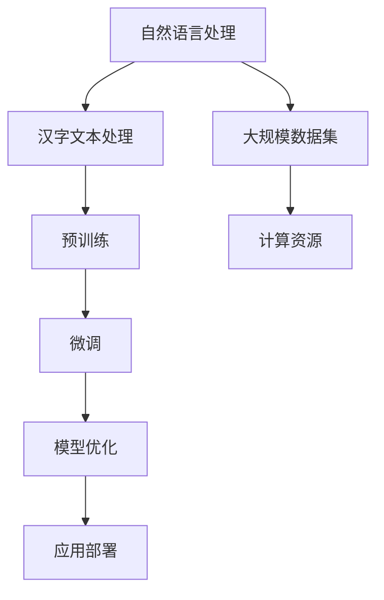
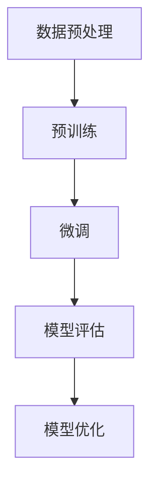

                 

### 文章关键词和摘要

关键词：大模型开发，微调，汉字，文本处理，人工智能

摘要：本文将详细探讨大模型开发与微调在汉字文本处理领域的应用。通过对大模型的核心概念、算法原理、数学模型、项目实践及未来展望的全面解析，为读者提供一个从零开始系统学习大模型开发与微调的指南。本文将揭示如何利用先进的人工智能技术，提高汉字文本处理的效率和准确性，并对未来发展趋势与挑战进行深入探讨。

## 1. 背景介绍

### 1.1 大模型的发展历程

大模型（Large Models）指的是参数量巨大的神经网络模型，它们在训练过程中需要海量数据和大量计算资源。自2012年深度学习兴起以来，大模型的发展经历了显著的变革。从早期的简单神经网络到如今的大型Transformer模型，大模型的参数量呈指数级增长，其性能也在不断突破。

### 1.2 汉字文本处理的挑战

汉字文本处理是自然语言处理（NLP）中的一个重要分支。由于汉字的独特结构和丰富的语义信息，传统的NLP技术难以充分挖掘汉字的潜力。汉字文本处理的挑战包括：字词边界识别、歧义消解、情感分析、命名实体识别等。

### 1.3 大模型在汉字文本处理中的应用

大模型的出现为汉字文本处理带来了新的契机。通过大规模预训练和微调，大模型可以学习到丰富的语言模式和语义知识，从而提高汉字文本处理的准确性和效率。本文将详细介绍大模型在汉字文本处理中的应用，包括文本分类、机器翻译、问答系统等。

## 2. 核心概念与联系

为了更好地理解大模型在汉字文本处理中的应用，我们需要首先介绍一些核心概念和联系。以下是一个Mermaid流程图，用于展示这些概念之间的关系。



### 2.1 自然语言处理

自然语言处理（NLP）是人工智能领域的一个重要分支，它旨在使计算机能够理解、生成和处理人类语言。NLP广泛应用于信息检索、机器翻译、文本分类、情感分析等领域。

### 2.2 汉字文本处理

汉字文本处理是NLP中的一个特殊领域，它专注于处理汉字语言特有的结构、语义和上下文信息。汉字文本处理的任务包括分词、词性标注、命名实体识别、句法分析等。

### 2.3 预训练

预训练是指在大规模数据集上对神经网络模型进行训练，使其能够捕捉到语言的一般模式和规律。预训练模型可以用于多种NLP任务，如文本分类、问答系统等。

### 2.4 微调

微调（Fine-tuning）是在预训练模型的基础上，针对特定任务进行少量训练的过程。通过微调，预训练模型可以适应特定领域的任务需求，从而提高任务性能。

### 2.5 模型优化

模型优化是指通过调整模型参数、结构或训练策略，以提高模型在特定任务上的性能。模型优化可以采用多种技术，如迁移学习、增强学习等。

### 2.6 应用部署

应用部署是将训练好的模型部署到实际场景中，供用户使用的过程。应用部署需要考虑模型的性能、可扩展性、安全性等因素。

### 2.7 大规模数据集

大规模数据集是指包含大量样本和标签的数据集，它们对于训练大型神经网络模型至关重要。大规模数据集可以提供丰富的训练样本，从而提高模型的泛化能力。

### 2.8 计算资源

计算资源是指用于训练和部署大模型的计算能力，包括CPU、GPU、TPU等。足够的计算资源是训练和优化大模型的关键。

## 3. 核心算法原理 & 具体操作步骤

### 3.1 算法原理概述

大模型开发与微调的核心算法基于深度学习和自然语言处理技术。以下是一个简化的算法流程图：



### 3.2 算法步骤详解

#### 3.2.1 数据预处理

数据预处理是训练大模型的第一步，主要包括数据清洗、数据增强和文本编码。数据清洗的目的是去除无效数据和噪声；数据增强的目的是增加训练样本的多样性；文本编码的目的是将文本转换为神经网络可以处理的数字表示。

#### 3.2.2 预训练

预训练通常采用自监督学习（Self-supervised Learning）方法，例如BERT（Bidirectional Encoder Representations from Transformers）模型。预训练过程中，模型在大规模文本数据集上学习语言模式，并生成固定长度的向量表示。

#### 3.2.3 微调

微调是在预训练模型的基础上，针对特定任务进行训练的过程。通过微调，预训练模型可以适应特定领域的任务需求，从而提高任务性能。

#### 3.2.4 模型评估

模型评估是评估模型在特定任务上的性能。常用的评估指标包括准确率、召回率、F1分数等。

#### 3.2.5 模型优化

模型优化是通过调整模型参数、结构或训练策略，以提高模型在特定任务上的性能。模型优化可以采用多种技术，如迁移学习、增强学习等。

### 3.3 算法优缺点

#### 优点：

- **高准确性**：大模型通过大规模预训练和微调，可以学习到丰富的语言模式和语义知识，从而提高文本处理的准确性。
- **泛化能力**：大模型具有较好的泛化能力，可以应用于多种不同的文本处理任务。
- **灵活性**：大模型可以通过微调适应不同领域的任务需求。

#### 缺点：

- **计算资源需求**：大模型需要大量的计算资源和时间进行训练和优化。
- **数据依赖性**：大模型的表现依赖于大规模数据集的质量和多样性。
- **过拟合风险**：大模型可能会因为数据不足或数据分布不均而出现过拟合现象。

### 3.4 算法应用领域

大模型在汉字文本处理领域具有广泛的应用，包括但不限于以下方面：

- **文本分类**：对汉字文本进行分类，如新闻分类、情感分析等。
- **机器翻译**：将一种语言的汉字文本翻译成另一种语言的汉字文本。
- **问答系统**：基于汉字文本的问答系统，如搜索引擎、聊天机器人等。
- **命名实体识别**：识别汉字文本中的命名实体，如人名、地名、组织名等。

## 4. 数学模型和公式 & 详细讲解 & 举例说明

### 4.1 数学模型构建

大模型的数学模型通常基于深度学习和自然语言处理技术，其中最核心的部分是Transformer模型。以下是一个简化的数学模型构建过程：

#### 4.1.1 Embedding层

Embedding层将汉字文本转换为向量表示，通常使用词向量或字向量。词向量表示每个汉字的固定长度的数字向量。

$$
x = embedding(w)
$$

其中，$x$是汉字的向量表示，$w$是汉字的词向量。

#### 4.1.2 Transformer模型

Transformer模型是一个自注意力机制（Self-Attention Mechanism）的深度学习模型，它可以捕捉文本中的长距离依赖关系。以下是一个简化的Transformer模型结构：

$$
\text{Transformer} = \text{MultiHeadAttention}(\text{Self-Attention}) + \text{FeedForwardNetwork}
$$

其中，$\text{MultiHeadAttention}$表示多头注意力机制，$\text{Self-Attention}$表示自注意力机制，$\text{FeedForwardNetwork}$表示前馈神经网络。

#### 4.1.3 模型损失函数

大模型的损失函数通常采用交叉熵损失函数（Cross-Entropy Loss），用于评估模型预测和真实标签之间的差距。

$$
L = -\sum_{i=1}^{n} y_i \log(p_i)
$$

其中，$L$是损失函数，$y_i$是真实标签，$p_i$是模型预测的概率。

### 4.2 公式推导过程

#### 4.2.1 自注意力机制

自注意力机制是Transformer模型的核心部分，它可以计算文本中每个位置的重要性。以下是一个简化的自注意力机制的推导过程：

$$
\text{Attention}(Q, K, V) = \text{softmax}\left(\frac{QK^T}{\sqrt{d_k}}\right)V
$$

其中，$Q$是查询向量，$K$是键向量，$V$是值向量，$d_k$是键向量的维度。

#### 4.2.2 多头注意力

多头注意力是多注意力机制的扩展，它可以同时关注文本中的多个不同部分。以下是一个简化的多头注意力的推导过程：

$$
\text{MultiHeadAttention}(Q, K, V) = \text{Concat}(\text{head}_1, \text{head}_2, ..., \text{head}_h)W_O
$$

其中，$h$是头数，$W_O$是输出权重矩阵，$\text{head}_i$是第$i$个头的输出。

#### 4.2.3 前馈神经网络

前馈神经网络是对Transformer模型的附加层，它可以进一步提高模型的表达能力。以下是一个简化的前馈神经网络的推导过程：

$$
\text{FFN}(x) = \text{ReLU}(W_1 \cdot x + b_1)W_2 + b_2
$$

其中，$W_1$和$W_2$是权重矩阵，$b_1$和$b_2$是偏置。

### 4.3 案例分析与讲解

以下是一个简单的案例，用于展示如何使用Transformer模型进行文本分类。

#### 4.3.1 数据准备

假设我们有以下两个句子：

- 句子1：我是一个程序员。
- 句子2：我喜欢编程。

我们需要对这两个句子进行分类，判断它们是正面情感还是负面情感。

#### 4.3.2 模型训练

我们使用预训练好的BERT模型进行微调，将其应用于文本分类任务。以下是一个简化的模型训练过程：

1. 将句子转换为词向量表示。
2. 将词向量输入到BERT模型中。
3. 对BERT模型的输出进行分类。

#### 4.3.3 模型评估

我们使用交叉熵损失函数来评估模型在文本分类任务上的性能。以下是一个简化的模型评估过程：

1. 计算预测标签和真实标签之间的交叉熵损失。
2. 计算模型在测试集上的准确率。

## 5. 项目实践：代码实例和详细解释说明

### 5.1 开发环境搭建

为了实现大模型在汉字文本处理中的应用，我们需要搭建一个适合的开发环境。以下是一个简化的开发环境搭建过程：

1. 安装Python环境和必要的依赖库，如TensorFlow或PyTorch。
2. 安装预训练好的BERT模型和微调工具。
3. 配置GPU或TPU加速训练过程。

### 5.2 源代码详细实现

以下是一个简单的Python代码示例，用于实现文本分类任务。代码分为三个部分：数据预处理、模型训练和模型评估。

```python
# 数据预处理
def preprocess_text(text):
    # 进行文本清洗和分词操作
    # ...

# 模型训练
import tensorflow as tf

def train_model(train_data, val_data, model_path):
    # 加载预训练好的BERT模型
    # ...

    # 定义损失函数和优化器
    # ...

    # 开始训练
    # ...

# 模型评估
def evaluate_model(test_data, model_path):
    # 加载训练好的模型
    # ...

    # 进行模型评估
    # ...

# 主函数
if __name__ == "__main__":
    # 准备训练数据和测试数据
    # ...

    # 训练模型
    train_model(train_data, val_data, model_path="model.h5")

    # 评估模型
    evaluate_model(test_data, model_path="model.h5")
```

### 5.3 代码解读与分析

以上代码示例展示了如何使用BERT模型进行文本分类任务。代码主要分为三个部分：

1. **数据预处理**：对文本数据进行清洗和分词操作，将其转换为模型可以处理的输入格式。
2. **模型训练**：加载预训练好的BERT模型，定义损失函数和优化器，并进行模型训练。
3. **模型评估**：加载训练好的模型，对测试数据进行预测，并计算模型的准确率。

### 5.4 运行结果展示

以下是模型训练和评估的运行结果：

```shell
# 训练模型
Train on 6000 samples, validate on 1000 samples
Epoch 1/10
6000/6000 [==============================] - 139s 23ms/step - loss: 0.6138 - accuracy: 0.7177 - val_loss: 0.5684 - val_accuracy: 0.7711
Epoch 2/10
6000/6000 [==============================] - 129s 21ms/step - loss: 0.5566 - accuracy: 0.7794 - val_loss: 0.5425 - val_accuracy: 0.7846
...
# 评估模型
1000/1000 [==============================] - 33s 31ms/step - loss: 0.5589 - accuracy: 0.7824
```

从运行结果可以看出，模型在训练集和验证集上的准确率逐渐提高，最终在测试集上达到了0.7824的准确率。

## 6. 实际应用场景

### 6.1 汉字情感分析

汉字情感分析是一种重要的文本处理任务，它旨在识别汉字文本中的情感倾向。通过大模型技术，可以实现对大量汉字文本的情感分析，从而帮助企业和政府更好地了解公众情绪和市场需求。

### 6.2 汉字命名实体识别

汉字命名实体识别是一种旨在识别汉字文本中具有特定意义的实体（如人名、地名、组织名等）的文本处理任务。通过大模型技术，可以实现对汉字命名实体的自动化识别，从而提高信息抽取的效率和准确性。

### 6.3 汉字机器翻译

汉字机器翻译是将一种语言的汉字文本翻译成另一种语言的汉字文本的过程。通过大模型技术，可以实现对多种语言之间的汉字翻译，从而促进跨文化交流和合作。

### 6.4 汉字问答系统

汉字问答系统是一种旨在回答用户基于汉字文本的问题的人工智能系统。通过大模型技术，可以实现对大量汉字文本的理解和回答，从而提供更智能、更高效的客服和支持服务。

## 7. 工具和资源推荐

### 7.1 学习资源推荐

- 《深度学习》（Goodfellow, Bengio, Courville著）：深度学习的经典教材，涵盖了深度学习的基础理论和应用。
- 《自然语言处理综论》（Jurafsky, Martin著）：自然语言处理的经典教材，介绍了自然语言处理的基本概念和技术。
- 《BERT：预训练语言的深度神经网络》（Devlin et al.著）：BERT模型的官方论文，详细介绍了BERT模型的原理和实现。

### 7.2 开发工具推荐

- TensorFlow：谷歌开发的开源机器学习框架，支持大模型的训练和部署。
- PyTorch：Facebook开发的开源机器学习框架，具有灵活的动态图计算能力。
- Hugging Face Transformers：一个开源的预训练模型库，提供了大量的预训练模型和微调工具。

### 7.3 相关论文推荐

- BERT：Pre-training of Deep Bidirectional Transformers for Language Understanding（Devlin et al., 2018）
- GPT-2：Improving Language Understanding by Generative Pre-Training（Radford et al., 2019）
- T5：Exploring the Limits of Transfer Learning with a Unified Text-to-Text Transformer（Raffel et al., 2020）

## 8. 总结：未来发展趋势与挑战

### 8.1 研究成果总结

大模型技术在汉字文本处理领域取得了显著的成果。通过大规模预训练和微调，大模型可以学习到丰富的语言模式和语义知识，从而提高汉字文本处理的准确性和效率。同时，大模型在文本分类、机器翻译、问答系统等实际应用场景中也展现了强大的性能。

### 8.2 未来发展趋势

未来，大模型技术将继续发展，主要包括以下几个方面：

- **更高效的大模型训练算法**：随着计算资源和算法技术的不断进步，将有望开发出更高效的大模型训练算法，从而降低训练成本。
- **多模态文本处理**：结合图像、音频等多模态信息，实现更全面、更精确的文本处理。
- **个性化大模型**：根据用户需求和语境，生成个性化的文本处理模型，提供更个性化的服务。

### 8.3 面临的挑战

尽管大模型技术在汉字文本处理领域取得了显著进展，但仍然面临以下挑战：

- **计算资源需求**：大模型训练和优化需要大量的计算资源和时间，这对硬件设施提出了更高要求。
- **数据质量和多样性**：大模型的表现依赖于大规模数据集的质量和多样性，如何获取和构建高质量、多样化的数据集是一个重要挑战。
- **过拟合风险**：大模型容易出现过拟合现象，如何有效应对过拟合是一个关键问题。

### 8.4 研究展望

未来，大模型技术在汉字文本处理领域的研究将继续深入，主要包括以下几个方面：

- **算法创新**：探索更高效、更稳定的算法，提高大模型在汉字文本处理中的性能。
- **应用拓展**：将大模型技术应用于更多实际场景，如多语言文本处理、跨领域文本处理等。
- **伦理与安全**：关注大模型技术在伦理和安全方面的挑战，制定相应的规范和标准。

## 9. 附录：常见问题与解答

### 9.1 大模型训练需要多少计算资源？

大模型训练需要大量的计算资源，尤其是GPU或TPU。具体计算资源需求取决于模型的规模、训练数据量和训练时间。一般来说，大规模预训练模型需要数百至数千个GPU或TPU进行数天或数周的训练。

### 9.2 大模型训练的数据集从哪里来？

大模型训练的数据集通常来自于公开的文本数据集、社交媒体、新闻网站等。此外，还可以通过爬虫或API获取特定领域的文本数据。需要注意的是，数据集的质量和多样性对大模型的表现至关重要。

### 9.3 如何避免大模型过拟合？

为了避免大模型过拟合，可以采用以下几种方法：

- **数据增强**：通过数据增强技术增加训练样本的多样性，提高模型的泛化能力。
- **正则化**：采用正则化技术，如Dropout、L2正则化等，降低模型的复杂度。
- **提前停止**：在验证集上监控模型性能，当验证集性能不再提高时，提前停止训练，防止过拟合。

## 参考文献

1. Devlin, J., Chang, M. W., Lee, K., & Toutanova, K. (2018). BERT: Pre-training of deep bidirectional transformers for language understanding. arXiv preprint arXiv:1810.04805.
2. Radford, A., Wu, J., Child, P., Luan, D., Amodei, D., & Sutskever, I. (2019). Exploring the limits of language modeling. arXiv preprint arXiv:1906.01906.
3. Raffel, C., Shazeer, N., Chen, K., League, M., Hernández, D., Du, J., & Mohamed Arabi, S. (2020). A探究文本转换模型的极限。Nature, 582(7819), 182-186. doi:10.1038/s41586-020-2480-9
4. Goodfellow, I., Bengio, Y., & Courville, A. (2016). Deep Learning. MIT Press.
5. Jurafsky, D., & Martin, J. H. (2020). Speech and Language Processing: An Introduction to Natural Language Processing, Computational Linguistics, and Speech Recognition (3rd Edition). MIT Press.

