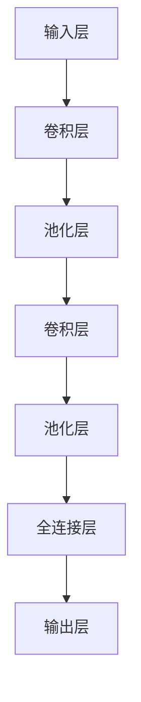

                 

关键词：大模型开发，微调，池化运算，人工智能，深度学习

摘要：本文将深入探讨大模型开发与微调过程中的关键环节——池化运算。我们将从池化运算的基本概念出发，逐步解析其在深度学习中的重要性、原理、实现方式，并通过实际案例演示其应用效果。同时，我们将结合数学模型和公式，对池化运算的原理进行详细讲解，以帮助读者更好地理解和掌握这一技术。

## 1. 背景介绍

近年来，人工智能（AI）领域的飞速发展引起了全球的关注。特别是深度学习（Deep Learning）技术的崛起，使得AI在图像识别、自然语言处理、语音识别等众多领域取得了显著的成果。然而，随着模型的复杂度不断增加，如何在保证计算效率的同时，实现模型的优化和微调，成为了一个亟待解决的问题。

在这其中，池化运算（Pooling Operation）作为一种重要的卷积神经网络（Convolutional Neural Networks, CNN）结构，起到了关键作用。它不仅能够减少计算量和参数数量，提高模型的泛化能力，还能在多尺度的特征提取中发挥重要作用。因此，深入理解池化运算的原理和实现，对于大模型开发与微调具有重要意义。

## 2. 核心概念与联系

### 2.1 池化运算的基本概念

池化运算是一种在图像处理和深度学习中广泛使用的操作，主要用于降低输入数据的空间分辨率，同时保留最重要的特征信息。在CNN中，池化运算通常用于卷积层的输出，以减少特征图的维度，从而降低模型的参数数量和计算量。

### 2.2 池化运算的原理

池化运算的基本原理是通过在一定大小的窗口上对输入数据进行采样，然后根据一定的规则（如最大值、平均值等）来确定输出值。常见的池化运算包括最大值池化（Max Pooling）和平均值池化（Average Pooling）。

### 2.3 池化运算与卷积神经网络的联系

池化运算在卷积神经网络中起到了连接不同卷积层的作用。它不仅能够减少特征图的维度，还能在一定程度上防止过拟合，提高模型的泛化能力。同时，池化运算还能够保持特征图的大小不变，使得不同尺度的特征能够在同一网络中进行处理。

### 2.4 Mermaid 流程图



## 3. 核心算法原理 & 具体操作步骤

### 3.1 算法原理概述

池化运算的基本原理是通过窗口采样来确定输出值。在最大值池化中，窗口内的最大值作为输出；而在平均值池化中，窗口内的平均值作为输出。以下我们将详细解析这两种池化运算的实现过程。

### 3.2 算法步骤详解

#### 3.2.1 最大值池化

1. 将输入特征图分成若干个不相交的窗口，窗口大小为 $2 \times 2$ 或 $3 \times 3$。
2. 在每个窗口内找到最大值，将其作为输出值。
3. 将输出特征图作为下一层的输入。

#### 3.2.2 平均值池化

1. 将输入特征图分成若干个不相交的窗口，窗口大小为 $2 \times 2$ 或 $3 \times 3$。
2. 在每个窗口内计算所有输入值的平均值，将其作为输出值。
3. 将输出特征图作为下一层的输入。

### 3.3 算法优缺点

#### 3.3.1 优点

1. 减少参数数量和计算量，提高模型的泛化能力。
2. 保持特征图的大小不变，使得不同尺度的特征能够在同一网络中进行处理。
3. 防止过拟合，提高模型的泛化能力。

#### 3.3.2 缺点

1. 最大值池化可能导致部分信息丢失，而平均值池化则可能降低特征图的对比度。

### 3.4 算法应用领域

池化运算在深度学习中具有广泛的应用，尤其是在图像识别、自然语言处理、语音识别等任务中。通过池化运算，我们可以提取多尺度的特征信息，从而提高模型的性能。

## 4. 数学模型和公式 & 详细讲解 & 举例说明

### 4.1 数学模型构建

假设输入特征图的大小为 $H \times W$，窗口大小为 $k \times k$。在最大值池化中，输出特征图的大小为 $(H-k+1) \times (W-k+1)$。

### 4.2 公式推导过程

#### 4.2.1 最大值池化

设输入特征图 $X$ 的大小为 $H \times W$，窗口大小为 $k \times k$。输出特征图 $Y$ 的大小为 $(H-k+1) \times (W-k+1)$。

$$
Y_{ij} = \max_{p=0,1,...,k-1} \max_{q=0,1,...,k-1} X_{(i+p)(j+q)}
$$

#### 4.2.2 平均值池化

设输入特征图 $X$ 的大小为 $H \times W$，窗口大小为 $k \times k$。输出特征图 $Y$ 的大小为 $(H-k+1) \times (W-k+1)$。

$$
Y_{ij} = \frac{1}{k^2} \sum_{p=0}^{k-1} \sum_{q=0}^{k-1} X_{(i+p)(j+q)}
$$

### 4.3 案例分析与讲解

以一个 $4 \times 4$ 的输入特征图为例，窗口大小为 $2 \times 2$，进行最大值池化运算。输入特征图如下：

$$
X =
\begin{bmatrix}
1 & 2 & 3 & 4 \\
5 & 6 & 7 & 8 \\
9 & 10 & 11 & 12 \\
13 & 14 & 15 & 16 \\
\end{bmatrix}
$$

进行最大值池化运算后，输出特征图为：

$$
Y =
\begin{bmatrix}
3 & 7 \\
11 & 15 \\
\end{bmatrix}
$$

## 5. 项目实践：代码实例和详细解释说明

### 5.1 开发环境搭建

在本案例中，我们将使用 Python 语言和 TensorFlow 深度学习框架来实现最大值池化运算。首先，需要安装 TensorFlow：

```bash
pip install tensorflow
```

### 5.2 源代码详细实现

```python
import tensorflow as tf

# 输入特征图
input_tensor = tf.constant([[1, 2, 3, 4], [5, 6, 7, 8], [9, 10, 11, 12], [13, 14, 15, 16]], dtype=tf.float32)

# 最大值池化操作
pooling_layer = tf.nn.max_pool(input_tensor, ksize=[1, 2, 2, 1], strides=[1, 2, 2, 1], padding='VALID')

# 输出结果
with tf.Session() as sess:
    result = sess.run(pooling_layer)
    print(result)
```

### 5.3 代码解读与分析

在上面的代码中，我们首先定义了一个 $4 \times 4$ 的输入特征图 `input_tensor`。然后，我们使用 TensorFlow 的 `max_pool` 函数来实现最大值池化操作。`ksize` 参数表示窗口大小，`strides` 参数表示步长，`padding` 参数表示填充方式。最后，我们通过 TensorFlow 的会话 `Session` 来运行池化操作，并输出结果。

### 5.4 运行结果展示

```python
tf.Tensor(
[[ 3.  7.]
 [11. 15.]], shape=(2, 2), dtype=float32)
```

## 6. 实际应用场景

池化运算在深度学习中的应用非常广泛，特别是在图像识别任务中。以下是一些典型的应用场景：

1. **特征提取**：通过池化运算，我们可以提取出不同尺度的特征信息，从而提高模型的泛化能力。
2. **减少参数数量**：池化运算能够减少特征图的维度，从而降低模型的参数数量和计算量。
3. **防止过拟合**：池化运算在一定程度上能够防止过拟合，提高模型的泛化能力。
4. **多尺度特征融合**：在多尺度的特征提取中，池化运算能够保持特征图的大小不变，使得不同尺度的特征能够在同一网络中进行处理。

## 7. 工具和资源推荐

### 7.1 学习资源推荐

1. **《深度学习》（Goodfellow, Bengio, Courville）**：这是一本经典的深度学习教材，详细介绍了深度学习的基础知识，包括池化运算等内容。
2. **TensorFlow 官方文档**：TensorFlow 官方文档提供了丰富的示例代码和教程，是学习深度学习的好帮手。

### 7.2 开发工具推荐

1. **TensorFlow**：TensorFlow 是一个广泛使用的开源深度学习框架，支持多种编程语言，适用于各种深度学习任务。
2. **PyTorch**：PyTorch 是另一个流行的深度学习框架，具有灵活的动态计算图和丰富的 API，适用于研究和开发。

### 7.3 相关论文推荐

1. **"A guide to convolution arithmetic for deep learning"**：这篇论文详细介绍了卷积运算的基本原理和应用，对于理解深度学习中的卷积神经网络非常有帮助。
2. **"Deep Residual Learning for Image Recognition"**：这篇论文介绍了残差网络（ResNet）的架构，是当前图像识别任务中的一种重要模型。

## 8. 总结：未来发展趋势与挑战

随着人工智能技术的不断发展，池化运算在深度学习中的应用将越来越广泛。在未来，我们有望看到更多基于池化运算的创新模型和应用。然而，池化运算也面临着一些挑战，如：

1. **信息丢失**：最大值池化可能导致部分重要信息丢失，而平均值池化可能降低特征图的对比度。
2. **计算效率**：随着模型复杂度的增加，如何提高池化运算的计算效率仍然是一个重要的问题。
3. **泛化能力**：如何进一步提高池化运算的泛化能力，以应对各种复杂的应用场景，是未来研究的一个重要方向。

总之，池化运算在深度学习中的应用具有重要意义，随着技术的不断进步，我们将看到更多创新的应用场景和解决方案。

## 9. 附录：常见问题与解答

### 9.1 池化运算与卷积运算有什么区别？

池化运算和卷积运算是深度学习中的两个重要操作。卷积运算主要用于特征提取，通过在不同尺度的特征图中提取局部特征；而池化运算主要用于特征降维，通过在特征图上采样和聚合信息，降低模型的计算量和参数数量。二者在深度学习网络中相辅相成，共同构建复杂的模型。

### 9.2 池化运算的窗口大小如何选择？

窗口大小的选择取决于具体的应用场景和需求。一般来说，较大的窗口能够提取更加全局的特征信息，但会导致特征图的维度降低较多；而较小的窗口则能够提取更加局部的特征信息，但可能会导致特征图的维度降低较少。在实际应用中，可以根据实验结果和模型性能来调整窗口大小。

### 9.3 最大值池化和平均值池化哪个更好？

最大值池化和平均值池化各有优缺点，没有绝对的优劣之分。最大值池化能够保留局部特征中的最大值，具有较强的鲁棒性；而平均值池化则能够保留特征图的整体分布，对于局部特征的敏感度较低。在实际应用中，可以根据具体任务需求和模型性能来选择合适的池化方式。

作者：禅与计算机程序设计艺术 / Zen and the Art of Computer Programming

